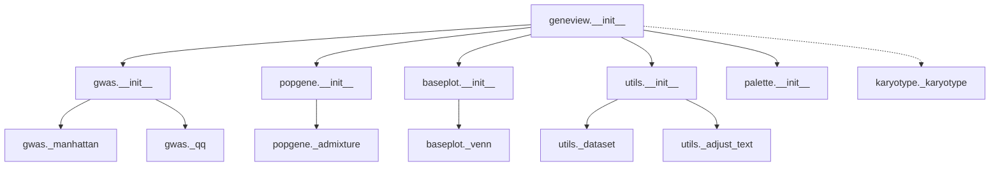
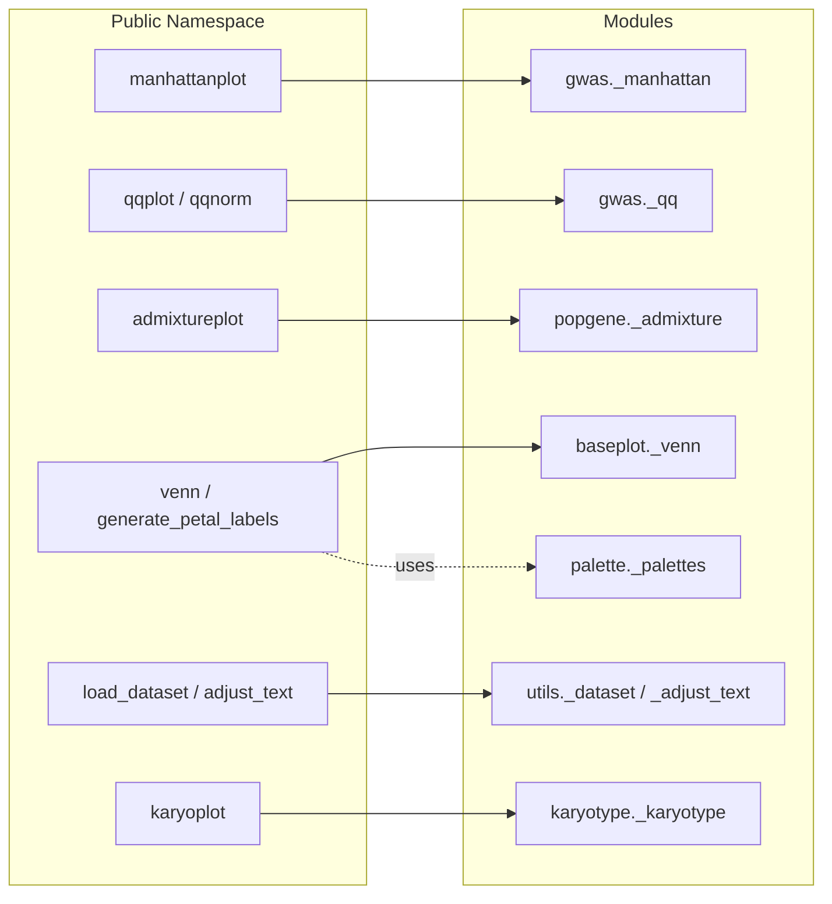
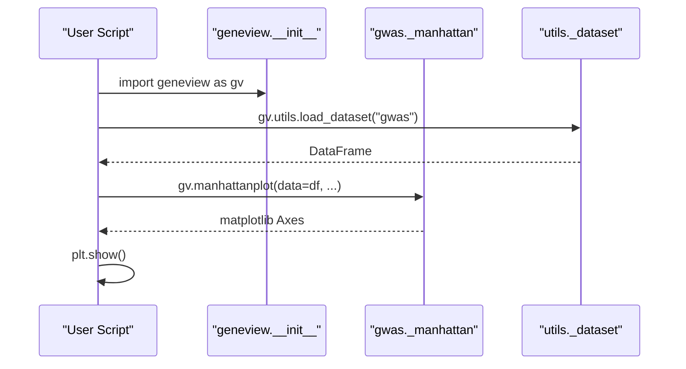
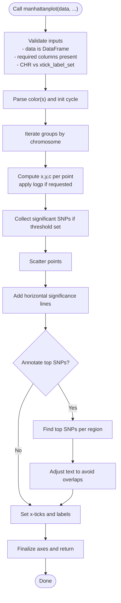
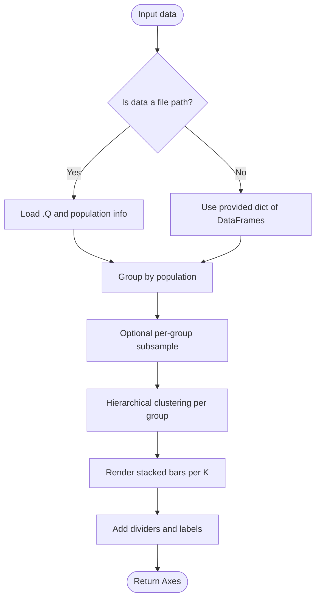
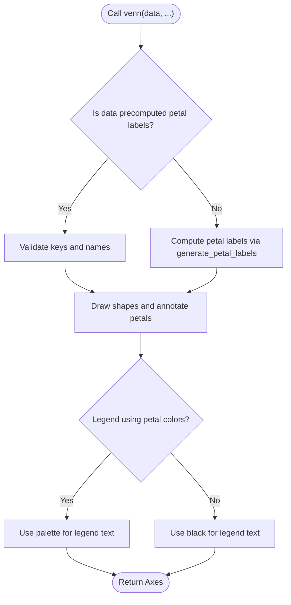
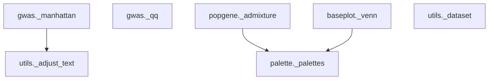

# API Reference

<cite>
**Referenced Files in This Document**
- [__init__.py](file://geneview/__init__.py)
- [gwas/__init__.py](file://geneview/gwas/__init__.py)
- [_manhattan.py](file://geneview/gwas/_manhattan.py)
- [gwas/_qq.py](file://geneview/gwas/_qq.py)
- [popgene/__init__.py](file://geneview/popgene/__init__.py)
- [_admixture.py](file://geneview/popgene/_admixture.py)
- [baseplot/__init__.py](file://geneview/baseplot/__init__.py)
- [_venn.py](file://geneview/baseplot/_venn.py)
- [utils/__init__.py](file://geneview/utils/__init__.py)
- [_dataset.py](file://geneview/utils/_dataset.py)
- [_adjust_text.py](file://geneview/utils/_adjust_text.py)
- [karyotype/__init__.py](file://geneview/karyotype/__init__.py)
- [_karyotype.py](file://geneview/karyotype/_karyotype.py)
- [palette/__init__.py](file://geneview/palette/__init__.py)
- [_palettes.py](file://geneview/palette/_palettes.py)
- [README.md](file://README.md)
- [examples/scripts/manhattan.py](file://examples/scripts/manhattan.py)
- [examples/scripts/qq.py](file://examples/scripts/qq.py)
- [examples/scripts/admixture.py](file://examples/scripts/admixture.py)
- [examples/scripts/venn.py](file://examples/scripts/venn.py)
</cite>

## Table of Contents
1. [Introduction](#introduction)
2. [Project Structure](#project-structure)
3. [Core Components](#core-components)
4. [Architecture Overview](#architecture-overview)
5. [Detailed Component Analysis](#detailed-component-analysis)
6. [Dependency Analysis](#dependency-analysis)
7. [Performance Considerations](#performance-considerations)
8. [Troubleshooting Guide](#troubleshooting-guide)
9. [Conclusion](#conclusion)
10. [Appendices](#appendices)

## Introduction
This document provides a comprehensive API reference for GeneView’s public plotting interfaces and related utilities. It focuses on the primary functions used for genomics data visualization:
- manhattanplot()
- qqplot() and qqnorm()
- admixtureplot()
- venn() and generate_petal_labels()

For each function, we document:
- Complete function signature
- Parameter specifications (types, defaults, validation rules)
- Return value descriptions
- Usage examples and integration patterns
- Module organization, import patterns, and namespace structure
- Function relationships and performance considerations for large-scale genomics data

## Project Structure
GeneView organizes its public API via module-level exports. The top-level package exposes key plotting functions and utilities, while internal modules encapsulate specialized functionality.

**Diagram sources**
- [__init__.py:1-15](file://geneview/__init__.py#L1-L15)
- [gwas/__init__.py:1-3](file://geneview/gwas/__init__.py#L1-L3)
- [popgene/__init__.py:1-2](file://geneview/popgene/__init__.py#L1-L2)
- [baseplot/__init__.py:1-2](file://geneview/baseplot/__init__.py#L1-L2)
- [utils/__init__.py:1-20](file://geneview/utils/__init__.py#L1-L20)
- [_manhattan.py:21-208](file://geneview/gwas/_manhattan.py#L21-L208)
- [gwas/_qq.py:62-212](file://geneview/gwas/_qq.py#L62-L212)
- [_admixture.py:168-363](file://geneview/popgene/_admixture.py#L168-L363)
- [_venn.py:437-584](file://geneview/baseplot/_venn.py#L437-L584)
- [_dataset.py:22-67](file://geneview/utils/_dataset.py#L22-L67)
- [_adjust_text.py](file://geneview/utils/_adjust_text.py)
- [_karyotype.py:28-84](file://geneview/karyotype/_karyotype.py#L28-L84)

**Section sources**
- [__init__.py:1-15](file://geneview/__init__.py#L1-L15)
- [README.md:1-344](file://README.md#L1-L344)

## Core Components
This section summarizes the public API surface exposed at the package level and the modules they originate from.

- manhattanplot(data, ...): Plots Manhattan plots for GWAS summary statistics.
  - Module: geneview.gwas
  - Import: from geneview.gwas import manhattanplot
  - Signature and parameters: see manhattanplot() in [manhattanplot():21-208](file://geneview/gwas/_manhattan.py#L21-L208)

- qqplot(data, ...): Creates Q-Q plots for p-values against uniform distribution.
  - Module: geneview.gwas
  - Import: from geneview.gwas import qqplot
  - Signature and parameters: see qqplot() in [qqplot():62-212](file://geneview/gwas/_qq.py#L62-L212)

- qqnorm(data, ...): Creates Q-Q plots against the standard normal distribution.
  - Module: geneview.gwas
  - Import: from geneview.gwas import qqnorm
  - Signature and parameters: see qqnorm() in [qqnorm():215-309](file://geneview/gwas/_qq.py#L215-L309)

- admixtureplot(data, ...): Renders ancestry composition plots from ADMIXTURE output.
  - Module: geneview.popgene
  - Import: from geneview.popgene import admixtureplot
  - Signature and parameters: see admixtureplot() in [admixtureplot():168-363](file://geneview/popgene/_admixture.py#L168-L363)

- venn(data, ...): Draws Venn diagrams for 2–6 sets using ellipses/triangles.
  - Module: geneview.baseplot
  - Import: from geneview.baseplot import venn
  - Signature and parameters: see venn() in [venn():437-584](file://geneview/baseplot/_venn.py#L437-L584)

- generate_petal_labels(datasets, fmt): Computes labels for Venn petals.
  - Module: geneview.baseplot
  - Import: from geneview.baseplot import generate_petal_labels
  - Signature and parameters: see generate_petal_labels() in [generate_petal_labels():186-208](file://geneview/baseplot/_venn.py#L186-L208)

- Utility functions:
  - load_dataset(name, ...): Loads example datasets from the online repository.
    - Module: geneview.utils
    - Import: from geneview.utils import load_dataset
    - Signature and parameters: see load_dataset() in [load_dataset():22-67](file://geneview/utils/_dataset.py#L22-L67)
  - adjust_text(...): Text adjustment helper for plots.
    - Module: geneview.utils
    - Import: from geneview.utils import adjust_text
    - Signature and parameters: see adjust_text() in [adjust_text()](file://geneview/utils/_adjust_text.py)

**Section sources**
- [__init__.py:3-8](file://geneview/__init__.py#L3-L8)
- [gwas/__init__.py:1-3](file://geneview/gwas/__init__.py#L1-L3)
- [popgene/__init__.py:1-2](file://geneview/popgene/__init__.py#L1-L2)
- [baseplot/__init__.py:1-2](file://geneview/baseplot/__init__.py#L1-L2)
- [utils/__init__.py:10-19](file://geneview/utils/__init__.py#L10-L19)
- [_manhattan.py:21-208](file://geneview/gwas/_manhattan.py#L21-L208)
- [gwas/_qq.py:62-212](file://geneview/gwas/_qq.py#L62-L212)
- [_admixture.py:168-363](file://geneview/popgene/_admixture.py#L168-L363)
- [_venn.py:437-584](file://geneview/baseplot/_venn.py#L437-L584)
- [_dataset.py:22-67](file://geneview/utils/_dataset.py#L22-L67)
- [_adjust_text.py](file://geneview/utils/_adjust_text.py)

## Architecture Overview
The public API is organized into cohesive functional domains:
- gwas: GWAS-focused plotting (manhattan, qq)
- popgene: Population genetics plotting (admixture)
- baseplot: General-purpose set and diagram plotting (venn)
- utils: Utilities for datasets and text adjustments
- palette: Color generation helpers
- karyotype: Cytogenetic ideogram plotting (exported at top-level)

**Diagram sources**
- [__init__.py:3-8](file://geneview/__init__.py#L3-L8)
- [_manhattan.py:21-208](file://geneview/gwas/_manhattan.py#L21-L208)
- [gwas/_qq.py:62-212](file://geneview/gwas/_qq.py#L62-L212)
- [_admixture.py:168-363](file://geneview/popgene/_admixture.py#L168-L363)
- [_venn.py:437-584](file://geneview/baseplot/_venn.py#L437-L584)
- [_dataset.py:22-67](file://geneview/utils/_dataset.py#L22-L67)
- [_adjust_text.py](file://geneview/utils/_adjust_text.py)
- [_karyotype.py:28-84](file://geneview/karyotype/_karyotype.py#L28-L84)
- [_palettes.py](file://geneview/palette/_palettes.py)

## Detailed Component Analysis

### manhattanplot(data, ...)
- Purpose: Produce a Manhattan plot from GWAS summary statistics.
- Module: geneview.gwas
- Import: from geneview.gwas import manhattanplot
- Signature and parameters:
  - data: pandas DataFrame with columns for chromosome, position, p-value, and optionally SNP identifier.
  - chrom: column name for chromosome (default: "#CHROM").
  - pos: column name for position (default: "POS").
  - pv: column name for p-value (default: "P").
  - snp: column name for SNP identifier (default: "ID").
  - logp: boolean to plot -log10(p) (default: True).
  - ax: matplotlib axis; if None, a new axis is created.
  - marker: marker style for scatter (default: ".").
  - color: color(s) for dots; accepts hex or comma-separated list (default: "#3B5488,#53BBD5").
  - alpha: transparency (default: 0.8).
  - title, xlabel, ylabel: plot labels.
  - xtick_label_set: set of chromosome labels to use as x-ticks.
  - CHR: restrict to a single chromosome for linear axis (mutually exclusive with xtick_label_set).
  - xticklabel_kws: keyword args passed to set_xticklabels.
  - suggestiveline: threshold for suggestive line (default: 1e-5); set None to disable.
  - genomewideline: threshold for genome-wide significant line (default: 5e-8); set None to disable.
  - sign_line_cols: colors for significance lines (default: "#D62728,#2CA02C").
  - hline_kws: keyword args for axhline (excluding color).
  - sign_marker_p: p-value threshold to mark significant SNPs (default: None).
  - sign_marker_color: color for significant SNP markers (default: "r").
  - is_annotate_topsnp: annotate top SNP per significant region (default: False).
  - text_kws: keyword args for text annotations.
  - ld_block_size: window size for grouping top SNPs (default: 50000).
  - kwargs: additional keyword args passed to scatter or vlines.
- Returns: matplotlib Axes object.
- Validation and constraints:
  - data must be a DataFrame.
  - Required columns must exist; errors raised if missing.
  - CHR and xtick_label_set cannot be used together.
  - Zero-size arrays raise an error.
- Related utilities:
  - adjust_text is used for annotating top SNPs when enabled.
- Usage examples:
  - Basic plot with default parameters: [examples/scripts/manhattan.py:5-11](file://examples/scripts/manhattan.py#L5-L11)
  - Example with horizontal labels and custom lines: [examples/scripts/manhattan.py:6-11](file://examples/scripts/manhattan.py#L6-L11)
- Notes:
  - Supports single-chromosome zoom-in mode when CHR is specified.
  - Right and top spines are hidden for a clean look.

**Section sources**
- [_manhattan.py:21-208](file://geneview/gwas/_manhattan.py#L21-L208)
- [_manhattan.py:209-335](file://geneview/gwas/_manhattan.py#L209-L335)
- [_adjust_text.py](file://geneview/utils/_adjust_text.py)

### qqplot(data, ...) and qqnorm(data, ...)
- Purpose:
  - qqplot(): Q-Q plot against uniform distribution (default) or another dataset.
  - qqnorm(): Q-Q plot against standard normal distribution.
- Module: geneview.gwas
- Imports:
  - from geneview.gwas import qqplot
  - from geneview.gwas import qqnorm
- Signature and parameters:
  - data: array-like of probabilities/values between 0 and 1.
  - other: optional second dataset for comparison; must match length of data.
  - logp: boolean to plot -log10(p) (default: True).
  - ax: matplotlib axis; if None, a new axis is created.
  - marker: marker style (default: "o").
  - color: dot color; inferred if None.
  - alpha: transparency (default: 0.8).
  - title: plot title; lambda is auto-appended.
  - xlabel, ylabel: axis labels; defaults depend on whether other is provided.
  - ablinecolor: color for diagonal reference line; set None to disable.
  - kwargs: additional keyword args passed to scatter.
- Returns: matplotlib Axes object.
- Validation and constraints:
  - All values must be numeric; raises ValueError otherwise.
  - If other is provided, lengths must match; otherwise raises ValueError.
- Usage examples:
  - Basic QQ plot: [examples/scripts/qq.py:4-5](file://examples/scripts/qq.py#L4-L5)
  - Customized QQ plot with title and labels: [README.md:187-226](file://README.md#L187-L226)

**Section sources**
- [gwas/_qq.py:62-212](file://geneview/gwas/_qq.py#L62-L212)
- [gwas/_qq.py:215-309](file://geneview/gwas/_qq.py#L215-L309)

### admixtureplot(data, ...)
- Purpose: Render ancestry composition plots from ADMIXTURE Q matrix.
- Module: geneview.popgene
- Import: from geneview.popgene import admixtureplot
- Signature and parameters:
  - data: either a file path to .Q output or a dict mapping population groups to pandas DataFrame.
  - population_info: file path to a sample-to-group mapping; required if data is a file path.
  - shuffle_popsample_kws: dict passed to pandas.DataFrame.sample to subsample per group (supports n or frac).
  - group_order: list specifying the order of groups to plot.
  - linewidth: width of dividers between groups (default: 1.0).
  - edgewidth: width of plot frame edges (default: 1.0).
  - palette: color palette for K components; supports string, list, or colormap (default: "tab10").
  - xticklabels: custom x-axis tick labels for groups.
  - xticklabel_kws: keyword args for xticklabels.
  - ylabel: y-axis label; inferred if None.
  - ylabel_kws: keyword args for ylabel.
  - hierarchical_kws: dict passed to hierarchical clustering; defaults axis=0.
  - set_xticklabel_top: place x-axis ticklabels at the top (default: False).
  - ax: matplotlib axis; if None, a new axis is created.
- Returns: matplotlib Axes object.
- Validation and constraints:
  - If population_info is None, data must be a dict keyed by group with DataFrame values.
  - If population_info is provided, data must be a file path.
  - Group sizes and palette compatibility may trigger warnings.
- Usage examples:
  - Basic admixture plot with file inputs: [examples/scripts/admixture.py:4-22](file://examples/scripts/admixture.py#L4-L22)
  - Customized plot with group order and palette: [examples/scripts/admixture.py:13-22](file://examples/scripts/admixture.py#L13-L22)

**Section sources**
- [_admixture.py:168-363](file://geneview/popgene/_admixture.py#L168-L363)
- [_admixture.py:137-165](file://geneview/popgene/_admixture.py#L137-L165)

### venn(data, ...) and generate_petal_labels(datasets, fmt)
- Purpose:
  - venn(): Draw Venn diagrams for 2–6 sets; computes petal labels automatically or accepts precomputed labels.
  - generate_petal_labels(): Compute standardized petal labels from sets.
- Module: geneview.baseplot
- Imports:
  - from geneview.baseplot import venn
  - from geneview.baseplot import generate_petal_labels
- Signature and parameters:
  - venn(data, ...):
    - data: dict of sets or precomputed petal labels (dict with binary keys).
    - names: list of dataset names; inferred if omitted.
    - fmt: format string for petal labels supporting {size}, {percentage}, {logic}.
    - palette: color palette; supports string, list, or colormap (default: "viridis").
    - alpha: transparency (default: 0.4).
    - fontsize: font size (default: 14).
    - legend_use_petal_color: use petal colors for legend text (default: False).
    - legend_loc: legend location string.
    - ax: matplotlib axis; if None, a new axis is created.
  - generate_petal_labels(datasets, fmt):
    - datasets: iterable of sets.
    - fmt: format string for labels.
- Returns:
  - venn(): matplotlib Axes object.
  - generate_petal_labels(): dict mapping binary intersection keys to formatted strings.
- Validation and constraints:
  - venn() validates input types and keys; raises errors for invalid formats.
  - generate_petal_labels() enforces 2–6 sets and proper formatting.
- Usage examples:
  - Minimal Venn: [README.md:276-322](file://README.md#L276-L322)
  - Multiple set counts and legends: [examples/scripts/venn.py:15-25](file://examples/scripts/venn.py#L15-L25)
  - Precomputed labels: [README.md:307-319](file://README.md#L307-L319)

**Section sources**
- [_venn.py:437-584](file://geneview/baseplot/_venn.py#L437-L584)
- [_venn.py:186-208](file://geneview/baseplot/_venn.py#L186-L208)

### Utility: load_dataset(name, ...)
- Purpose: Download and cache example datasets from the online repository.
- Module: geneview.utils
- Import: from geneview.utils import load_dataset
- Signature and parameters:
  - name: dataset name; CSV loads into DataFrame, others return path string.
  - cache: cache downloaded files locally (default: True).
  - data_home: directory for cached data; respects environment variable GENEVIEW_DATA.
  - kws: additional kwargs passed to pandas.read_csv.
- Returns: pandas DataFrame for CSV datasets or file path string for non-CSV.
- Usage examples:
  - Loading GWAS data for Manhattan/QQ plots: [examples/scripts/manhattan.py:5-5](file://examples/scripts/manhattan.py#L5-L5), [examples/scripts/qq.py:4-4](file://examples/scripts/qq.py#L4-L4)

**Section sources**
- [_dataset.py:22-67](file://geneview/utils/_dataset.py#L22-L67)

## Architecture Overview

**Diagram sources**
- [__init__.py:3-8](file://geneview/__init__.py#L3-L8)
- [_manhattan.py:21-208](file://geneview/gwas/_manhattan.py#L21-L208)
- [_dataset.py:22-67](file://geneview/utils/_dataset.py#L22-L67)

## Detailed Component Analysis

### manhattanplot() call flow

**Diagram sources**
- [_manhattan.py:209-335](file://geneview/gwas/_manhattan.py#L209-L335)
- [_adjust_text.py](file://geneview/utils/_adjust_text.py)

### admixtureplot() data pipeline

**Diagram sources**
- [_admixture.py:137-165](file://geneview/popgene/_admixture.py#L137-L165)
- [_admixture.py:168-363](file://geneview/popgene/_admixture.py#L168-L363)

### venn() decision tree

**Diagram sources**
- [_venn.py:560-584](file://geneview/baseplot/_venn.py#L560-L584)
- [_venn.py:186-208](file://geneview/baseplot/_venn.py#L186-L208)
- [_venn.py:234-295](file://geneview/baseplot/_venn.py#L234-L295)

## Dependency Analysis

**Diagram sources**
- [_manhattan.py:17-17](file://geneview/gwas/_manhattan.py#L17-L17)
- [_admixture.py:13-14](file://geneview/popgene/_admixture.py#L13-L14)
- [_venn.py:12-12](file://geneview/baseplot/_venn.py#L12-L12)

**Section sources**
- [_manhattan.py:17-17](file://geneview/gwas/_manhattan.py#L17-L17)
- [_admixture.py:13-14](file://geneview/popgene/_admixture.py#L13-L14)
- [_venn.py:12-12](file://geneview/baseplot/_venn.py#L12-L12)

## Performance Considerations
- Large-scale GWAS plots:
  - manhattanplot() internally groups by chromosome and computes cumulative positions; for very large datasets, consider limiting to a subset of chromosomes or using appropriate figure sizing to reduce rendering overhead.
  - Enabling top SNP annotation adds extra computation for region detection and text adjustment.
- QQ plots:
  - Sorting and computing -log10(p) is O(n log n); ensure data is pre-filtered if needed.
- Admixture plots:
  - Hierarchical clustering per group scales with group size; subsampling via shuffle_popsample_kws can significantly reduce runtime.
- Venn diagrams:
  - generate_petal_labels() computes unions/intersections; for very large sets, consider reducing set sizes or precomputing labels.

## Troubleshooting Guide
- manhattanplot():
  - Error: “Input data must be a pandas.DataFrame.” — Ensure data is a DataFrame and required columns are present.
  - Error: “Column '...' not found!” — Verify chrom, pos, pv, and optionally snp column names.
  - Error: “CHR and xtick_label_set can’t be set simultaneously.” — Choose one mode of x-axis labeling.
  - Error: “zero-size array to reduction operation...” — No data passed or filtering removed all entries.
- qqplot()/qqnorm():
  - Error: “Input must all be numeric in data.” — Ensure all values are numeric and in (0, 1) for QQ.
  - Error: “Input data and other must all be the same size.” — Align lengths when comparing two datasets.
- admixtureplot():
  - Error: “KeyError: ‘...’. Missing in group_order.” — Ensure all groups in data are represented in group_order.
  - Warning: “categories of colors setting by palette is less than the number of estimating sub populations (K)” — Increase palette diversity or adjust K.
  - Error: “The size of sample_info and input admixture result must be the same.” — Align sample counts between files.
- venn():
  - Error: “Only dictionaries of sets are understood” — Provide a dict of sets or precomputed petal labels.
  - Error: “Number of sets must be between 2 and 6.” — Limit the number of sets or use triangle-based 6-set mode carefully.

**Section sources**
- [_manhattan.py:209-221](file://geneview/gwas/_manhattan.py#L209-L221)
- [gwas/_qq.py:168-178](file://geneview/gwas/_qq.py#L168-L178)
- [_admixture.py:329-340](file://geneview/popgene/_admixture.py#L329-L340)
- [_admixture.py:146-148](file://geneview/popgene/_admixture.py#L146-L148)
- [_venn.py:574-576](file://geneview/baseplot/_venn.py#L574-L576)

## Conclusion
GeneView’s public API provides high-level, robust plotting functions tailored for genomics workflows. The functions are modular, well-documented, and integrate seamlessly with pandas and matplotlib. Users can combine these functions with the provided utilities to build publication-ready visualizations efficiently.

## Appendices

### Import Patterns and Namespace Structure
- Top-level imports:
  - import geneview as gv
  - from geneview import manhattanplot, qqplot, qqnorm, admixtureplot, venn, generate_petal_labels
  - from geneview.utils import load_dataset, get_dataset_names, adjust_text
  - from geneview.palette import generate_colors_palette
- Module-specific imports:
  - from geneview.gwas import manhattanplot, qqplot, qqnorm
  - from geneview.popgene import admixtureplot
  - from geneview.baseplot import venn, generate_petal_labels
  - from geneview.utils import load_dataset, adjust_text
  - from geneview.karyotype import karyoplot

**Section sources**
- [__init__.py:3-8](file://geneview/__init__.py#L3-L8)
- [utils/__init__.py:10-19](file://geneview/utils/__init__.py#L10-L19)
- [palette/__init__.py:1-10](file://geneview/palette/__init__.py#L1-L10)