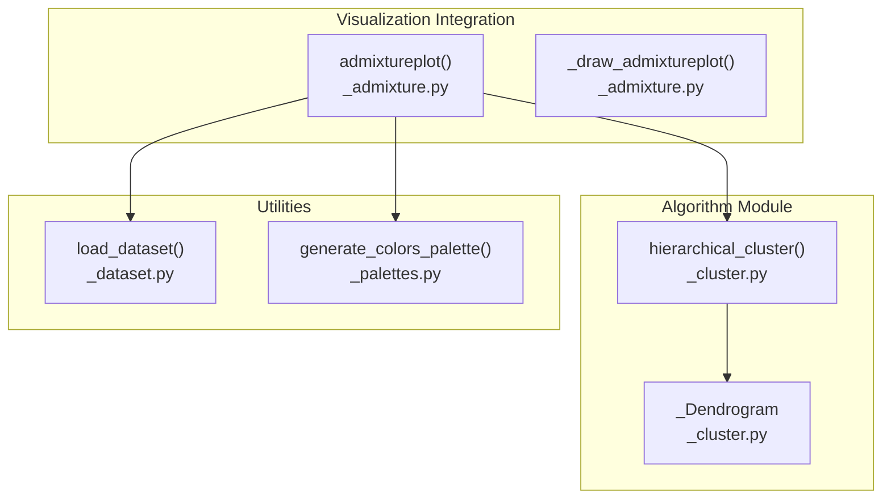
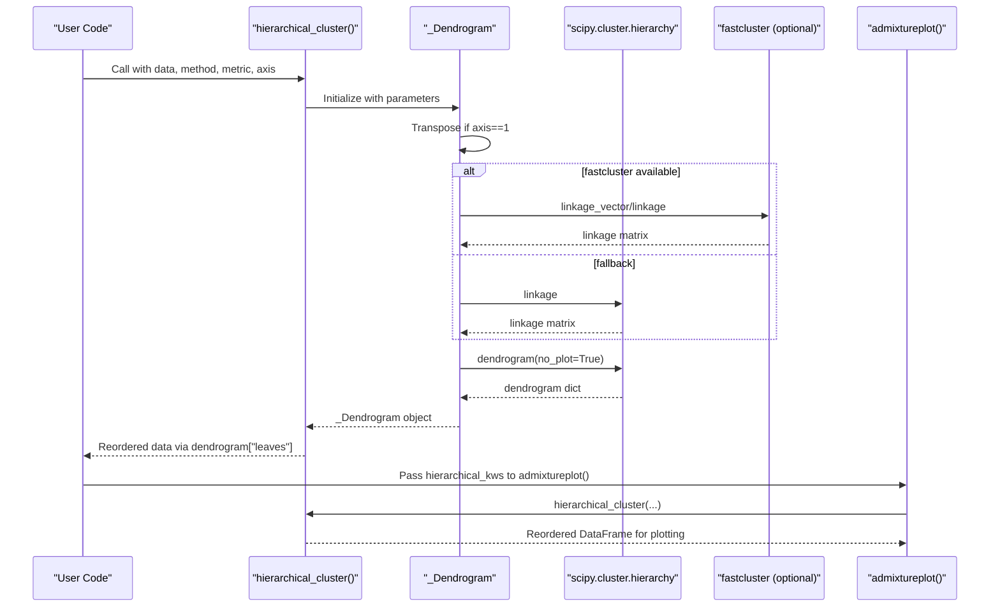
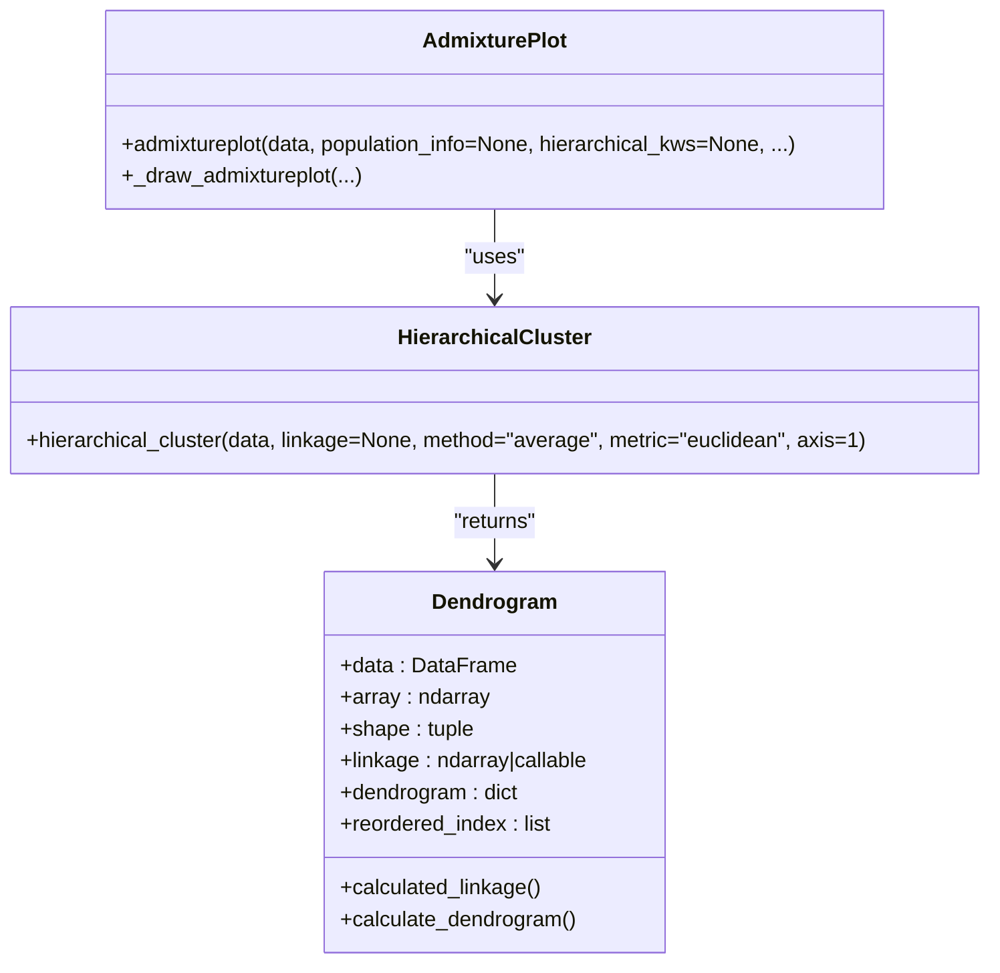
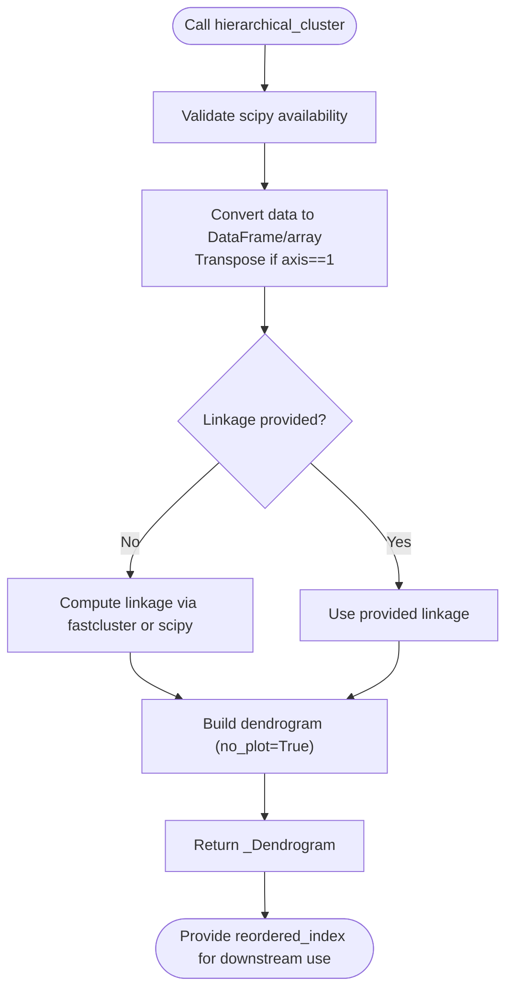
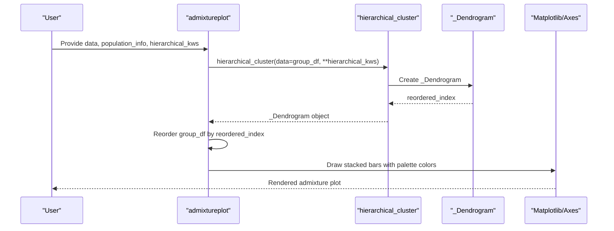
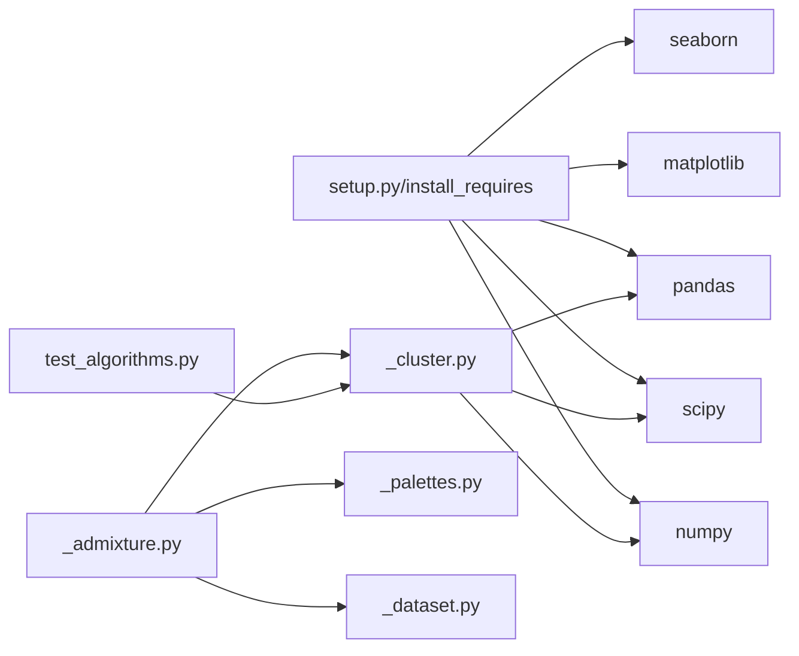

# Algorithm Functions

<cite>
**Referenced Files in This Document**
- [README.md](file://README.md)
- [_cluster.py](file://geneview/algorithm/_cluster.py)
- [__init__.py](file://geneview/algorithm/__init__.py)
- [_admixture.py](file://geneview/popgene/_admixture.py)
- [_dataset.py](file://geneview/utils/_dataset.py)
- [_palettes.py](file://geneview/palette/_palettes.py)
- [test_algorithms.py](file://geneview/tests/test_algorithms.py)
- [requirements.txt](file://requirements.txt)
- [setup.py](file://setup.py)
</cite>

## Table of Contents
1. [Introduction](#introduction)
2. [Project Structure](#project-structure)
3. [Core Components](#core-components)
4. [Architecture Overview](#architecture-overview)
5. [Detailed Component Analysis](#detailed-component-analysis)
6. [Dependency Analysis](#dependency-analysis)
7. [Performance Considerations](#performance-considerations)
8. [Troubleshooting Guide](#troubleshooting-guide)
9. [Conclusion](#conclusion)
10. [Appendices](#appendices)

## Introduction
This document provides comprehensive API documentation for GeneView’s algorithmic functions focused on hierarchical clustering and statistical computations. It covers:
- Cluster analysis APIs with parameter specifications for linkage methods, distance metrics, and clustering optimization
- Integration examples with visualization functions (e.g., admixture plots)
- Performance considerations for large datasets
- Algorithm selection guidelines
- Dependencies, computational complexity, and memory usage patterns

## Project Structure
The algorithmic functionality resides primarily in the algorithm module, with integration points in visualization modules such as popgene (admixture plots). Utility modules provide dataset loading and color palette generation.

**Diagram sources**
- [_cluster.py:114-147](file://geneview/algorithm/_cluster.py#L114-L147)
- [_admixture.py:17-134](file://geneview/popgene/_admixture.py#L17-L134)
- [_dataset.py:22-67](file://geneview/utils/_dataset.py#L22-L67)
- [_palettes.py:5-12](file://geneview/palette/_palettes.py#L5-L12)

**Section sources**
- [README.md:1-370](file://README.md#L1-L370)
- [_cluster.py:1-147](file://geneview/algorithm/_cluster.py#L1-L147)
- [_admixture.py:1-364](file://geneview/popgene/_admixture.py#L1-L364)
- [_dataset.py:1-88](file://geneview/utils/_dataset.py#L1-L88)
- [_palettes.py:1-13](file://geneview/palette/_palettes.py#L1-L13)

## Core Components
- Hierarchical clustering API: exposes a single function to compute dendrograms and reorder data based on hierarchical clustering.
- Dendrogram object: encapsulates linkage computation, dendrogram calculation, and index reordering.
- Visualization integration: admixture plotting integrates clustering to reorder samples for coherent visualization.

Key API surfaces:
- hierarchical_cluster(data, linkage=None, method="average", metric="euclidean", axis=1)
- _Dendrogram(data, linkage, method, metric, axis)
- admixtureplot(...) with hierarchical_kws to configure clustering

**Section sources**
- [_cluster.py:114-147](file://geneview/algorithm/_cluster.py#L114-L147)
- [_admixture.py:168-364](file://geneview/popgene/_admixture.py#L168-L364)

## Architecture Overview
The clustering pipeline integrates data preprocessing, linkage computation, dendrogram construction, and visualization-driven reordering.

**Diagram sources**
- [_cluster.py:22-111](file://geneview/algorithm/_cluster.py#L22-L111)
- [_admixture.py:48-62](file://geneview/popgene/_admixture.py#L48-L62)

## Detailed Component Analysis

### Hierarchical Clustering API
- Purpose: Compute hierarchical clustering and return a dendrogram object with reordered indices.
- Parameters:
  - data: pandas.DataFrame or array-like rectangular data
  - linkage: optional precomputed linkage matrix
  - method: linkage method compatible with scipy.cluster.hierarchy.linkage
  - metric: distance metric compatible with scipy.spatial.distance.pdist
  - axis: 0 to cluster rows, 1 to cluster columns
- Behavior:
  - If axis=1, data is transposed internally before clustering.
  - If linkage is None, computes linkage automatically; otherwise uses provided linkage.
  - Calculates dendrogram and exposes reordered_index for downstream use.

Algorithmic notes:
- Method compatibility: Supports standard SciPy linkage methods (e.g., single, complete, average, weighted, ward).
- Metric compatibility: Supports standard SciPy distance metrics (e.g., euclidean, cityblock, cosine).
- Memory optimization: Uses fastcluster when available and applicable; warns for large matrices when falling back to SciPy.

Integration:
- Returns a _Dendrogram object with:
  - data: DataFrame of clustered data
  - array: underlying array
  - shape: original shape
  - linkage: computed or provided linkage
  - dendrogram: SciPy dendrogram dictionary
  - reordered_index: leaves ordering for reindexing

**Section sources**
- [_cluster.py:114-147](file://geneview/algorithm/_cluster.py#L114-L147)
- [_cluster.py:19-111](file://geneview/algorithm/_cluster.py#L19-L111)
- [test_algorithms.py:13-78](file://geneview/tests/test_algorithms.py#L13-L78)

### Dendrogram Object
- Responsibilities:
  - Convert input data to DataFrame/array
  - Compute linkage using fastcluster (preferred) or SciPy fallback
  - Build dendrogram dictionary for leaf ordering
  - Expose reordered_index for downstream reordering

- Key properties and methods:
  - calculated_linkage: property that selects fastcluster or SciPy linkage
  - calculate_dendrogram: computes dendrogram with no_plot=True
  - reordered_index: returns the leaves ordering

- Performance considerations:
  - fastcluster vectorized path is used for specific combinations (e.g., euclidean with centroid/median/ward or single linkage)
  - Warning issued for large matrices when using SciPy fallback

**Section sources**
- [_cluster.py:19-111](file://geneview/algorithm/_cluster.py#L19-L111)

### Visualization Integration: Admixture Plotting
- Purpose: Plot admixture results with hierarchical clustering to reorder samples for coherent visualization.
- Key integration points:
  - hierarchical_kws passed to hierarchical_cluster to control method, metric, and axis
  - Default clustering axis is rows (samples) for admixture plots
  - Reorders each group’s DataFrame using _Dendrogram.reordered_index

- Parameter highlights:
  - hierarchical_kws: controls method, metric, axis for clustering
  - group_order: defines population order for plotting
  - palette: color scheme for subpopulations

- Example integration:
  - admixtureplot(data, population_info, hierarchical_kws={"method": "average", "metric": "euclidean", "axis": 0})

**Section sources**
- [_admixture.py:17-134](file://geneview/popgene/_admixture.py#L17-L134)
- [_admixture.py:168-364](file://geneview/popgene/_admixture.py#L168-L364)

### API Definitions and Parameters

- hierarchical_cluster
  - Parameters:
    - data: pandas.DataFrame or array-like
    - linkage: numpy.ndarray or None
    - method: str (default "average")
    - metric: str (default "euclidean")
    - axis: int (default 1)
  - Returns: _Dendrogram object
  - Notes: Requires scipy; raises runtime error if unavailable

- _Dendrogram
  - Properties:
    - data: DataFrame
    - array: ndarray
    - shape: tuple
    - linkage: ndarray or callable
    - dendrogram: dict
    - reordered_index: list of indices

- admixtureplot
  - Parameters (selected):
    - data: file path or dict of DataFrames
    - population_info: file path to sample grouping
    - hierarchical_kws: dict with method, metric, axis
    - group_order: list of groups
    - palette: colormap or list of colors
  - Behavior: Applies hierarchical_cluster per group and reorders data accordingly

**Section sources**
- [_cluster.py:114-147](file://geneview/algorithm/_cluster.py#L114-L147)
- [_cluster.py:19-111](file://geneview/algorithm/_cluster.py#L19-L111)
- [_admixture.py:168-364](file://geneview/popgene/_admixture.py#L168-L364)

## Architecture Overview

**Diagram sources**
- [_cluster.py:114-147](file://geneview/algorithm/_cluster.py#L114-L147)
- [_cluster.py:19-111](file://geneview/algorithm/_cluster.py#L19-L111)
- [_admixture.py:168-364](file://geneview/popgene/_admixture.py#L168-L364)

## Detailed Component Analysis

### Hierarchical Clustering Workflow

**Diagram sources**
- [_cluster.py:114-147](file://geneview/algorithm/_cluster.py#L114-L147)
- [_cluster.py:22-111](file://geneview/algorithm/_cluster.py#L22-L111)

**Section sources**
- [_cluster.py:114-147](file://geneview/algorithm/_cluster.py#L114-L147)
- [_cluster.py:19-111](file://geneview/algorithm/_cluster.py#L19-L111)

### Admixture Plotting Integration

**Diagram sources**
- [_admixture.py:48-62](file://geneview/popgene/_admixture.py#L48-L62)
- [_cluster.py:114-147](file://geneview/algorithm/_cluster.py#L114-L147)

**Section sources**
- [_admixture.py:17-134](file://geneview/popgene/_admixture.py#L17-L134)
- [_cluster.py:114-147](file://geneview/algorithm/_cluster.py#L114-L147)

## Dependency Analysis
- External libraries:
  - numpy, pandas, scipy (required)
  - matplotlib, seaborn (visualization stack)
  - fastcluster (optional; improves performance for specific methods/metrics)
- Internal dependencies:
  - algorithm module exports hierarchical_cluster
  - popgene/admixture uses hierarchical_cluster and palette utilities
  - utils provides dataset loading for examples

**Diagram sources**
- [setup.py:44-49](file://setup.py#L44-L49)
- [_cluster.py:10-16](file://geneview/algorithm/_cluster.py#L10-L16)
- [_admixture.py:13-14](file://geneview/popgene/_admixture.py#L13-L14)
- [_palettes.py:1-1](file://geneview/palette/_palettes.py#L1-L1)
- [_dataset.py:1-88](file://geneview/utils/_dataset.py#L1-L88)
- [test_algorithms.py:1-116](file://geneview/tests/test_algorithms.py#L1-L116)

**Section sources**
- [requirements.txt:1-5](file://requirements.txt#L1-L5)
- [setup.py:44-49](file://setup.py#L44-L49)
- [_cluster.py:10-16](file://geneview/algorithm/_cluster.py#L10-L16)
- [_admixture.py:13-14](file://geneview/popgene/_admixture.py#L13-L14)
- [_palettes.py:1-13](file://geneview/palette/_palettes.py#L1-L13)
- [_dataset.py:1-88](file://geneview/utils/_dataset.py#L1-L88)
- [test_algorithms.py:1-116](file://geneview/tests/test_algorithms.py#L1-L116)

## Performance Considerations
- Linkage computation cost:
  - Hierarchical clustering scales approximately as O(n^3) for dense matrices in typical SciPy implementations, where n is the number of observations.
  - Memory usage grows roughly as O(n^2) for storing the distance matrix and linkage structure.
- Method and metric impact:
  - Ward linkage requires Euclidean distances and tends to produce compact clusters; it is sensitive to outliers.
  - Single linkage is fastest but can yield long chains; complete/average are more balanced.
  - Metrics like cityblock/cosine may reduce sensitivity to scale and improve robustness for normalized data.
- Large dataset strategies:
  - Prefer fastcluster when available for vectorized linkage computation.
  - Use axis=0 (rows) for sample clustering in admixture plots to limit dimensionality.
  - Consider subsampling or pre-normalization to reduce computational burden.
- Practical tips:
  - For very large datasets, consider approximate nearest neighbors or dimensionality reduction prior to clustering.
  - Cache precomputed linkage matrices when iterating over multiple visualizations.

[No sources needed since this section provides general guidance]

## Troubleshooting Guide
- Missing scipy:
  - Symptom: RuntimeError indicating hierarchical clustering requires scipy.
  - Resolution: Install scipy or use an environment with scipy preinstalled.
- Unexpected axis behavior:
  - Symptom: Clustering appears to operate on columns instead of rows.
  - Resolution: Ensure axis=0 for row-wise clustering (samples) or axis=1 for column-wise clustering (features).
- Large matrix warnings:
  - Symptom: Warning about performance when using SciPy for large matrices.
  - Resolution: Install fastcluster for improved performance with compatible methods/metrics.
- Color palette mismatch:
  - Symptom: Fewer colors than subpopulations lead to confusion.
  - Resolution: Increase palette size or provide explicit color list via palette parameter.

**Section sources**
- [_cluster.py:142-147](file://geneview/algorithm/_cluster.py#L142-L147)
- [_cluster.py:88-91](file://geneview/algorithm/_cluster.py#L88-L91)
- [_admixture.py:70-74](file://geneview/popgene/_admixture.py#L70-L74)

## Conclusion
GeneView’s hierarchical clustering API provides a robust, flexible foundation for genomics workflows. By integrating seamlessly with visualization modules like admixture plotting, it enables coherent, data-driven reordering of samples. Proper selection of linkage methods and metrics, awareness of performance characteristics, and attention to memory usage are essential for scalable genomics analysis.

[No sources needed since this section summarizes without analyzing specific files]

## Appendices

### Algorithm Selection Guidelines
- Choose Ward with Euclidean for compact, spherical clusters; sensitive to outliers.
- Choose Complete for well-separated clusters; resistant to chaining.
- Choose Average for balanced, moderate sensitivity; widely applicable.
- Choose Single for chain-like clusters; computationally efficient but can over-segment.
- Use cityblock/cosine for robustness to scale and outliers; especially for normalized data.

[No sources needed since this section provides general guidance]

### Example Workflows
- Basic clustering:
  - Use hierarchical_cluster(data, method="average", metric="euclidean", axis=0) to cluster samples.
- Admixture integration:
  - Use admixtureplot(..., hierarchical_kws={"method": "average", "metric": "euclidean", "axis": 0}) to reorder samples by population structure.
- Dataset loading:
  - Use load_dataset to fetch example datasets for testing clustering and plotting.

**Section sources**
- [_cluster.py:114-147](file://geneview/algorithm/_cluster.py#L114-L147)
- [_admixture.py:168-364](file://geneview/popgene/_admixture.py#L168-L364)
- [_dataset.py:22-67](file://geneview/utils/_dataset.py#L22-L67)