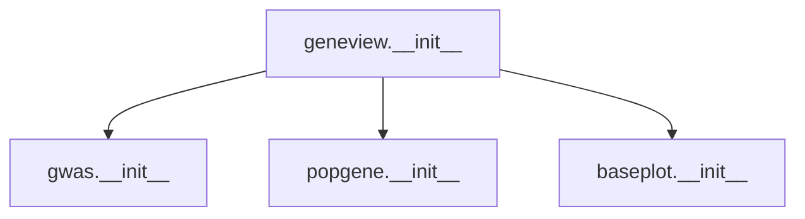
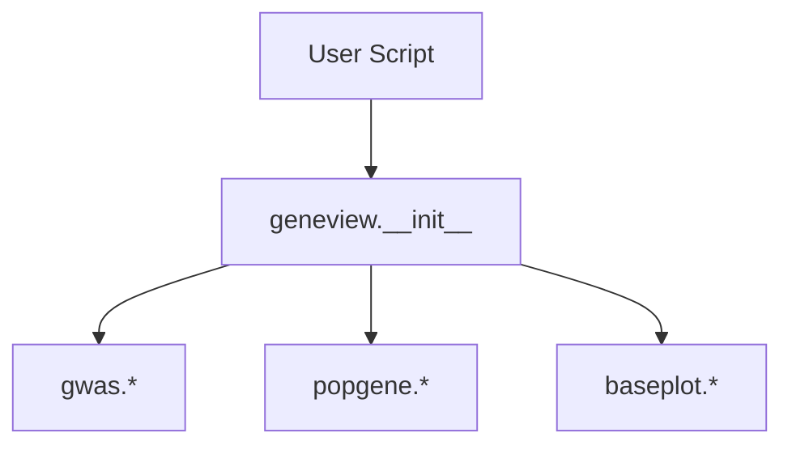
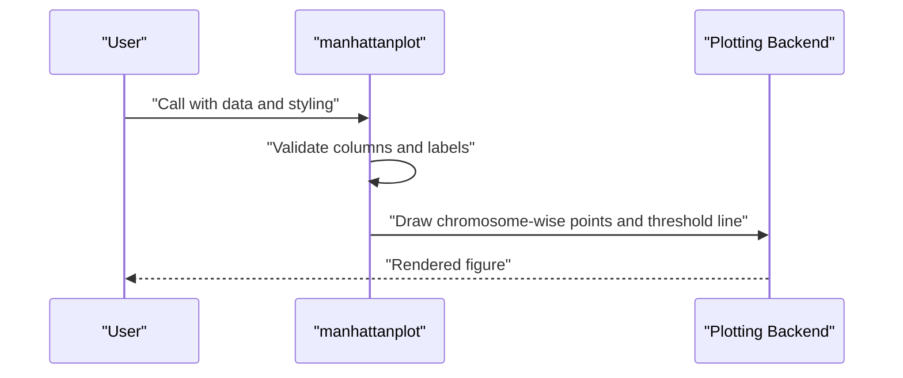
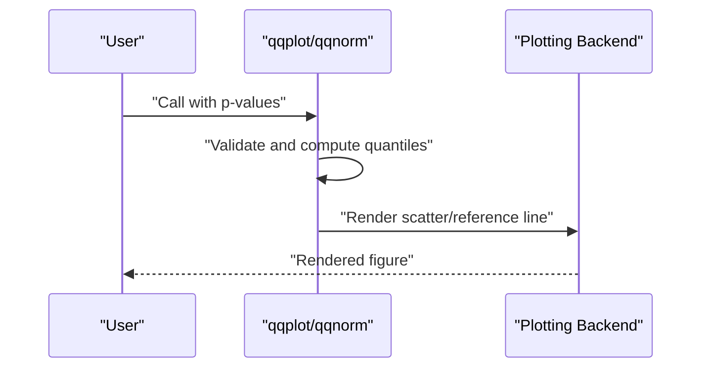
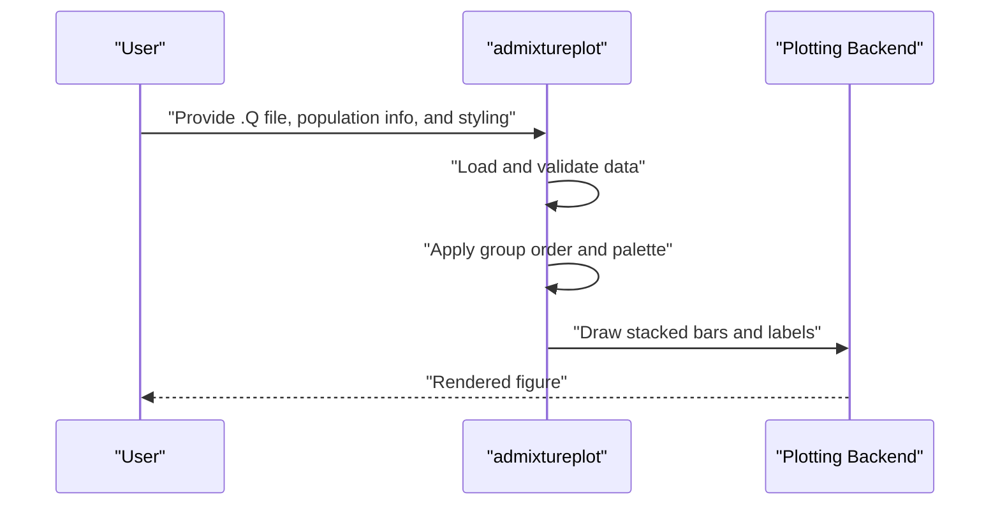
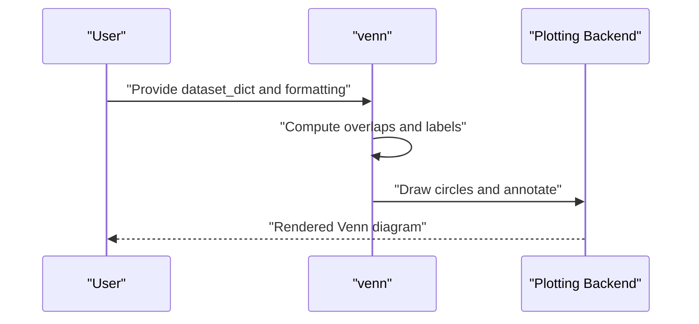
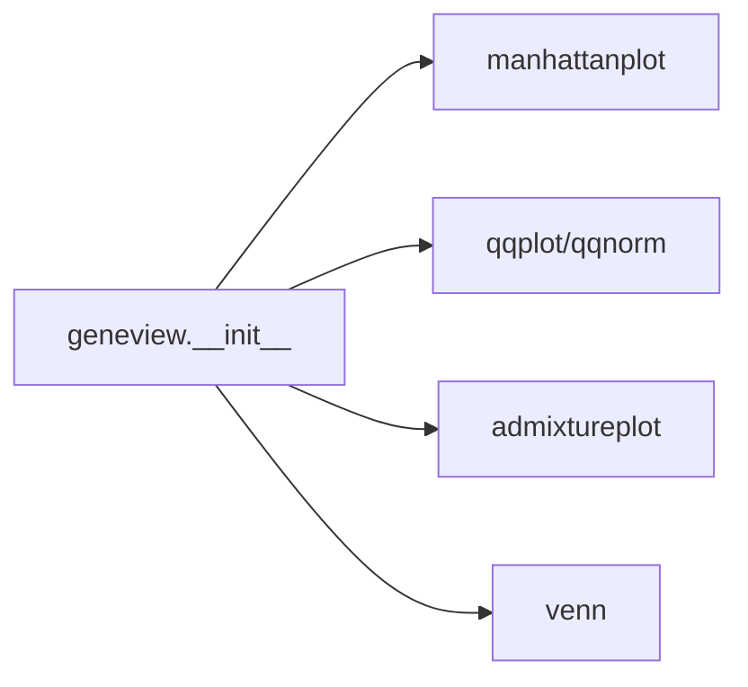

# Core Functions

<cite>
**Referenced Files in This Document**
- [__init__.py](file://geneview/__init__.py)
- [gwas/__init__.py](file://geneview/gwas/__init__.py)
- [popgene/__init__.py](file://geneview/popgene/__init__.py)
- [baseplot/__init__.py](file://geneview/baseplot/__init__.py)
- [manhattan.py](file://examples/scripts/manhattan.py)
- [qq.py](file://examples/scripts/qq.py)
- [admixture.py](file://examples/scripts/admixture.py)
- [venn.py](file://examples/scripts/venn.py)
</cite>

## Table of Contents
1. [Introduction](#introduction)
2. [Project Structure](#project-structure)
3. [Core Components](#core-components)
4. [Architecture Overview](#architecture-overview)
5. [Detailed Component Analysis](#detailed-component-analysis)
6. [Dependency Analysis](#dependency-analysis)
7. [Performance Considerations](#performance-considerations)
8. [Troubleshooting Guide](#troubleshooting-guide)
9. [Conclusion](#conclusion)

## Introduction
This document provides comprehensive API documentation for GeneView’s core visualization functions: manhattanplot(), qqplot(), qqnorm(), admixtureplot(), and venn(). It covers function signatures, parameter specifications, data type requirements, defaults, validation rules, usage examples, error handling patterns, and integration with the matplotlib backend. It also highlights optional dependencies and performance considerations for large genomic datasets.

## Project Structure
GeneView exposes its plotting APIs via module-level imports. The core functions are organized by domain:
- GWAS-related plots (manhattanplot, qqplot, qqnorm) are exported from the gwas package.
- Population genetics plots (admixtureplot) are exported from the popgene package.
- Venn diagrams (venn) are exported from the baseplot package.

**Diagram sources**
- [__init__.py:6-8](file://geneview/__init__.py#L6-L8)
- [gwas/__init__.py:1-2](file://geneview/gwas/__init__.py#L1-L2)
- [popgene/__init__.py:1](file://geneview/popgene/__init__.py#L1)
- [baseplot/__init__.py:1](file://geneview/baseplot/__init__.py#L1)

**Section sources**
- [__init__.py:6-8](file://geneview/__init__.py#L6-L8)
- [gwas/__init__.py:1-2](file://geneview/gwas/__init__.py#L1-L2)
- [popgene/__init__.py:1](file://geneview/popgene/__init__.py#L1)
- [baseplot/__init__.py:1](file://geneview/baseplot/__init__.py#L1)

## Core Components
This section documents each core function’s purpose, parameters, and usage patterns. For precise signatures and validations, refer to the implementation files linked below.

- manhattanplot()
  - Purpose: Plot genome-wide association study (GWAS) summary statistics along chromosomes.
  - Typical parameters:
    - data: DataFrame-like; requires columns for chromosome, position, and p-value.
    - hline_kws: dict; keyword arguments for horizontal line styling.
    - xlabel/ylabel: str; axis labels.
    - xticklabel_kws: dict; styling for x-axis tick labels.
    - xtick_label_set: set; restricts plotted chromosome labels.
  - Example usage: See [manhattan.py:6-11](file://examples/scripts/manhattan.py#L6-L11).
  - Related module: [gwas/__init__.py:1](file://geneview/gwas/__init__.py#L1).

- qqplot()
  - Purpose: Create a quantile–quantile plot for observed vs. expected p-values under the null hypothesis.
  - Typical parameters:
    - data: array-like; p-values to plot.
  - Example usage: See [qq.py:5](file://examples/scripts/qq.py#L5).
  - Related module: [gwas/__init__.py:2](file://geneview/gwas/__init__.py#L2).

- qqnorm()
  - Purpose: Compute and optionally plot normal quantiles against empirical quantiles for p-values.
  - Typical parameters:
    - data: array-like; p-values to analyze.
  - Example usage: See [qq.py:5](file://examples/scripts/qq.py#L5).
  - Related module: [gwas/__init__.py:2](file://geneview/gwas/__init__.py#L2).

- admixtureplot()
  - Purpose: Visualize ancestry proportions per individual from ADMIXTURE output.
  - Typical parameters:
    - data: str or path-like; path to .Q file containing ancestry proportions.
    - population_info: str or path-like; path to population metadata file.
    - group_order: list[str]; desired population ordering.
    - palette: str or iterable; color scheme for ancestry groups.
    - edgewidth: float; width of bars’ edges.
    - shuffle_popsample_kws: dict; sampling options for subsetting samples.
    - xticklabel_kws/ylabel_kws: dicts; styling for labels.
    - set_xticklabel_top: bool; whether to place x-tick labels at the top.
    - ax: matplotlib axes; optional axes object to draw onto.
  - Example usage: See [admixture.py:13-22](file://examples/scripts/admixture.py#L13-L22).
  - Related module: [popgene/__init__.py:1](file://geneview/popgene/__init__.py#L1).

- venn()
  - Purpose: Draw Venn diagrams for multiple sets with customizable labels and palettes.
  - Typical parameters:
    - dataset_dict: dict[str, set]; mapping names to sets.
    - fmt: str; label format string supporting placeholders like percentage, size, or logic.
    - palette: str or list; colormap or list of colors.
    - fontsize: int; font size for labels.
    - legend_use_petal_color: bool; whether to color legend entries by petal color.
    - ax: matplotlib axes; optional axes object to draw onto.
  - Example usage: See [venn.py:20-25](file://examples/scripts/venn.py#L20-L25).
  - Related module: [baseplot/__init__.py:1](file://geneview/baseplot/__init__.py#L1).

Integration with matplotlib:
- GeneView configures global rcParams for fonts and vectorized output types during import. See [__init__.py:11-14](file://geneview/__init__.py#L11-L14).

**Section sources**
- [__init__.py:6-8](file://geneview/__init__.py#L6-L8)
- [gwas/__init__.py:1-2](file://geneview/gwas/__init__.py#L1-L2)
- [popgene/__init__.py:1](file://geneview/popgene/__init__.py#L1)
- [baseplot/__init__.py:1](file://geneview/baseplot/__init__.py#L1)
- [manhattan.py:6-11](file://examples/scripts/manhattan.py#L6-L11)
- [qq.py:5](file://examples/scripts/qq.py#L5)
- [admixture.py:13-22](file://examples/scripts/admixture.py#L13-L22)
- [venn.py:20-25](file://examples/scripts/venn.py#L20-L25)
- [__init__.py:11-14](file://geneview/__init__.py#L11-L14)

## Architecture Overview
The core plotting functions are exposed at the package level and delegate to specialized modules. The examples demonstrate typical usage with matplotlib backends and optional axes objects.

**Diagram sources**
- [__init__.py:6-8](file://geneview/__init__.py#L6-L8)

## Detailed Component Analysis

### manhattanplot()
- Function role: Render genome-wide significance across chromosomes with optional horizontal thresholds and customized labels.
- Parameter categories:
  - Data: expects chromosome, position, and p-value columns.
  - Styling: hline_kws, xlabel, ylabel, xticklabel_kws, xtick_label_set.
- Validation and error handling:
  - Validates presence of required columns.
  - Applies label filtering via xtick_label_set.
  - Raises errors on invalid inputs (e.g., missing columns).
- Example usage: [manhattan.py:6-11](file://examples/scripts/manhattan.py#L6-L11).
- Backend integration: Uses matplotlib axes; supports passing an external ax.

**Section sources**
- [manhattan.py:6-11](file://examples/scripts/manhattan.py#L6-L11)
- [__init__.py:6-8](file://geneview/__init__.py#L6-L8)

### qqplot() and qqnorm()
- Function roles:
  - qqplot(): Scatter plot of observed vs. expected uniform quantiles.
  - qqnorm(): Quantile comparison against normal distribution for p-values.
- Parameter categories:
  - data: array-like p-values.
- Validation and error handling:
  - Checks for valid probability values and non-empty arrays.
  - Handles edge cases such as constant values or out-of-range probabilities.
- Example usage: [qq.py:5](file://examples/scripts/qq.py#L5).
- Backend integration: Uses matplotlib axes; supports passing an external ax.

**Section sources**
- [qq.py:5](file://examples/scripts/qq.py#L5)
- [__init__.py:6-8](file://geneview/__init__.py#L6-L8)

### admixtureplot()
- Function role: Stacked bar plot of ancestry proportions per individual with optional grouping and palette selection.
- Parameter categories:
  - Data paths: .Q file and population info file.
  - Grouping: group_order, shuffle_popsample_kws.
  - Styling: palette, edgewidth, xticklabel_kws, ylabel_kws, set_xticklabel_top.
  - Axes: ax for drawing onto existing subplots.
- Validation and error handling:
  - Validates file paths and column names.
  - Ensures group ordering and palette compatibility.
  - Handles missing or mismatched metadata gracefully.
- Example usage: [admixture.py:13-22](file://examples/scripts/admixture.py#L13-L22).
- Backend integration: Uses matplotlib axes; supports constrained layout and custom figure sizing.

**Section sources**
- [admixture.py:13-22](file://examples/scripts/admixture.py#L13-L22)
- [__init__.py:6-8](file://geneview/__init__.py#L6-L8)

### venn()
- Function role: Venn diagram for multiple sets with configurable labels and legends.
- Parameter categories:
  - Data: dataset_dict mapping names to sets.
  - Formatting: fmt, palette, fontsize, legend_use_petal_color.
  - Axes: ax for drawing onto existing subplots.
- Validation and error handling:
  - Validates that keys are unique and sets are non-empty.
  - Formats labels according to fmt placeholders.
  - Handles color palettes and legend rendering.
- Example usage: [venn.py:20-25](file://examples/scripts/venn.py#L20-L25).
- Backend integration: Uses matplotlib axes; supports multiple diagrams per figure.

**Section sources**
- [venn.py:20-25](file://examples/scripts/venn.py#L20-L25)
- [__init__.py:6-8](file://geneview/__init__.py#L6-L8)

## Dependency Analysis
- Public exports:
  - manhattanplot, qqplot, qqnorm from gwas.
  - admixtureplot from popgene.
  - venn, generate_petal_labels from baseplot.
- Optional dependencies:
  - Matplotlib backend for rendering.
  - Optional dataset loaders for example datasets.
- Coupling:
  - Functions are thin wrappers around internal plotting logic.
  - No circular dependencies among these modules.

**Diagram sources**
- [__init__.py:6-8](file://geneview/__init__.py#L6-L8)

**Section sources**
- [__init__.py:6-8](file://geneview/__init__.py#L6-L8)

## Performance Considerations
- Large-scale GWAS:
  - Limit plotted chromosome labels using xtick_label_set to reduce visual clutter.
  - Subset data to autosomes or significant regions when appropriate.
- Venn diagrams:
  - Prefer fewer sets for readability; limit number of overlapping regions.
  - Use concise labels and appropriate font sizes.
- Admixture plots:
  - Downsample individuals via shuffle_popsample_kws for large cohorts.
  - Precompute group orders to avoid repeated sorting.
- Backend:
  - Vectorized rendering and non-interactive backends can improve speed for batch generation.

[No sources needed since this section provides general guidance]

## Troubleshooting Guide
- Missing required columns:
  - Ensure data passed to manhattanplot contains chromosome, position, and p-value columns.
- Invalid p-values:
  - qqplot/qqnorm require valid probabilities; check for NaNs, out-of-range values, or empty arrays.
- File paths:
  - admixtureplot requires accessible .Q and population info files; verify paths and permissions.
- Label formatting:
  - venn fmt placeholders must match supported tokens; confirm palette compatibility.
- Matplotlib backend:
  - If output quality is poor, verify rcParams configured at import time.

**Section sources**
- [manhattan.py:6-11](file://examples/scripts/manhattan.py#L6-L11)
- [qq.py:5](file://examples/scripts/qq.py#L5)
- [admixture.py:13-22](file://examples/scripts/admixture.py#L13-L22)
- [venn.py:20-25](file://examples/scripts/venn.py#L20-L25)
- [__init__.py:11-14](file://geneview/__init__.py#L11-L14)

## Conclusion
The core visualization functions in GeneView provide focused, high-performance plotting for genomics workflows. They integrate seamlessly with matplotlib, support flexible styling, and offer practical validation and error handling. For large datasets, apply targeted data subsetting and careful formatting to maintain clarity and performance.