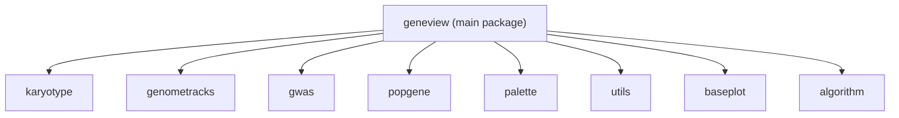
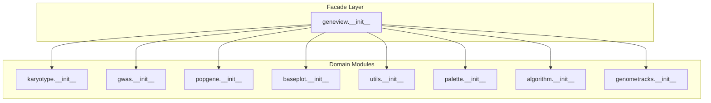
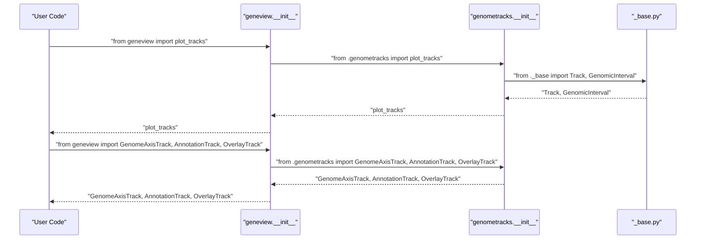
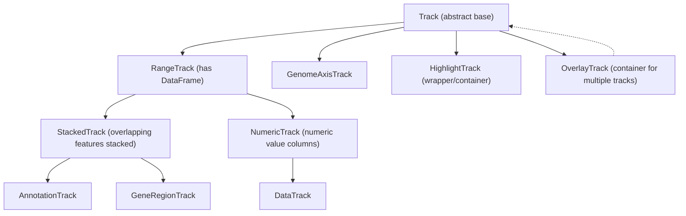
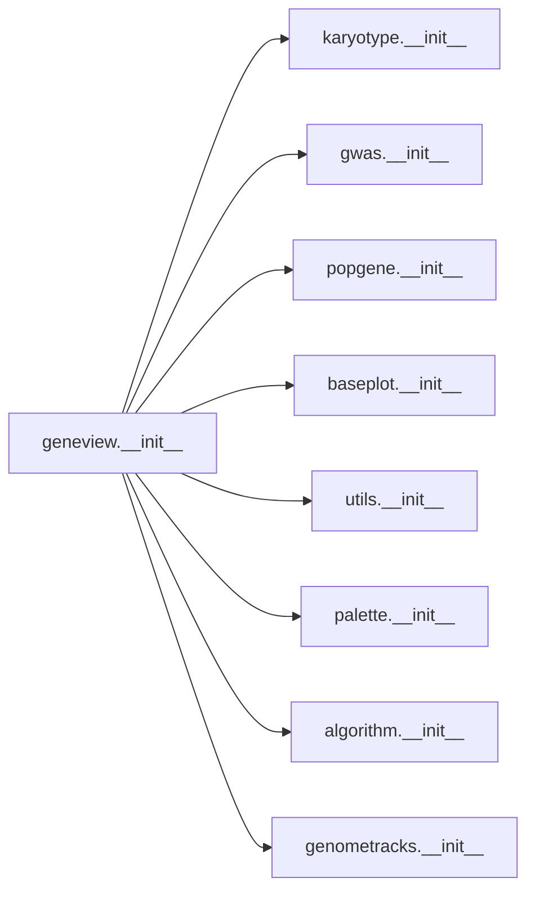

# Module Organization

<cite>
**Referenced Files in This Document**
- [README.md](file://README.md)
- [setup.py](file://setup.py)
- [geneview/__init__.py](file://geneview/__init__.py)
- [geneview/karyotype/__init__.py](file://geneview/karyotype/__init__.py)
- [geneview/genometracks/__init__.py](file://geneview/genometracks/__init__.py)
- [geneview/genometracks/_base.py](file://geneview/genometracks/_base.py)
- [geneview/genometracks/_track_plot.py](file://geneview/genometracks/_track_plot.py)
- [geneview/genometracks/_annotation.py](file://geneview/genometracks/_annotation.py)
- [geneview/genometracks/_gene_region.py](file://geneview/genometracks/_gene_region.py)
- [geneview/genometracks/_data_track.py](file://geneview/genometracks/_data_track.py)
- [geneview/genometracks/_highlight.py](file://geneview/genometracks/_highlight.py)
- [geneview/genometracks/_overlay.py](file://geneview/genometracks/_overlay.py)
- [geneview/genometracks/_io.py](file://geneview/genometracks/_io.py)
- [geneview/genometracks/_stacking.py](file://geneview/genometracks/_stacking.py)
- [geneview/genometracks/_genome_axis.py](file://geneview/genometracks/_genome_axis.py)
- [geneview/gwas/__init__.py](file://geneview/gwas/__init__.py)
- [geneview/popgene/__init__.py](file://geneview/popgene/__init__.py)
- [geneview/palette/__init__.py](file://geneview/palette/__init__.py)
- [geneview/utils/__init__.py](file://geneview/utils/__init__.py)
- [geneview/baseplot/__init__.py](file://geneview/baseplot/__init__.py)
- [geneview/algorithm/__init__.py](file://geneview/algorithm/__init__.py)
- [examples/scripts/manhattan.py](file://examples/scripts/manhattan.py)
- [examples/scripts/admixture.py](file://examples/scripts/admixture.py)
- [examples/scripts/venn.py](file://examples/scripts/venn.py)
- [examples/scripts/genome_tracks_advanced.py](file://examples/scripts/genome_tracks_advanced.py)
- [docs/genome_tracks_guide.md](file://docs/genome_tracks_guide.md)
</cite>

## Update Summary
**Changes Made**
- Added comprehensive documentation for the new OverlayTrack module as a specialized container track
- Updated track hierarchy documentation to include OverlayTrack as a wrapper/container track type
- Enhanced genometracks module architecture section with OverlayTrack integration details
- Added practical usage examples demonstrating OverlayTrack functionality for comparing multiple data tracks
- Updated import patterns and namespace management to reflect OverlayTrack availability

## Table of Contents
1. [Introduction](#introduction)
2. [Project Structure](#project-structure)
3. [Core Components](#core-components)
4. [Architecture Overview](#architecture-overview)
5. [Detailed Component Analysis](#detailed-component-analysis)
6. [Dependency Analysis](#dependency-analysis)
7. [Performance Considerations](#performance-considerations)
8. [Troubleshooting Guide](#troubleshooting-guide)
9. [Conclusion](#conclusion)

## Introduction
This document explains GeneView's module organization and namespace structure, focusing on the package hierarchy, import patterns, and interdependencies among specialized modules such as karyotype, genometracks, gwas, popgene, palette, utils, baseplot, and algorithm. The genometracks module represents a comprehensive genome browser-style visualization system that complements the existing plotting modules. It provides a facade pattern exposed via the main package interface and offers advanced functionality for complex genomic data visualization.

## Project Structure
GeneView follows a clear feature-based package layout under the geneview/ namespace. The main package exposes a consolidated facade that re-exports selected functions from subpackages, enabling convenient access to high-level plotting and utility functions. The genometracks module integrates seamlessly with this architecture, providing specialized genome visualization capabilities.

**Diagram sources**
- [geneview/__init__.py:11-14](file://geneview/__init__.py#L11-L14)
- [geneview/genometracks/__init__.py:1-93](file://geneview/genometracks/__init__.py#L1-L93)

**Section sources**
- [README.md:1-370](file://README.md#L1-L370)
- [setup.py:1-65](file://setup.py#L1-L65)
- [geneview/__init__.py:1-21](file://geneview/__init__.py#L1-L21)

## Core Components
The main package acts as a facade, selectively importing and re-exporting functions from submodules. The genometracks module is fully integrated into this facade, providing access to all track types and core functionality. This design centralizes the public API while keeping internal modules organized by domain.

Key exports from the main package include:
- Palette utilities from palette
- Dataset loading helpers from utils
- Karyotype plotting from karyotype
- Venn plotting and petal label generation from baseplot
- GWAS plotting functions from gwas
- Admixture plotting from popgene
- **Genome tracks visualization from genometracks (new)**

The genometracks integration provides access to:
- plot_tracks: Main orchestration function for genome track rendering
- Track types: GenomeAxisTrack, AnnotationTrack, GeneRegionTrack, DataTrack, HighlightTrack, **OverlayTrack**
- Data structures: GenomicInterval
- File I/O utilities: read_bed, read_gff, read_bedgraph, read_bigwig, read_bam_coverage, read_auto

**Section sources**
- [geneview/__init__.py:11-14](file://geneview/__init__.py#L11-L14)
- [geneview/genometracks/__init__.py:69-92](file://geneview/genometracks/__init__.py#L69-L92)

## Architecture Overview
The facade pattern is implemented at the main package level, with the genometracks module providing a sophisticated track-based visualization system. The genometracks module follows a clear inheritance hierarchy with Track as the abstract base class, supporting specialized track types for different genomic data visualization needs.

**Diagram sources**
- [geneview/__init__.py:11-14](file://geneview/__init__.py#L11-L14)
- [geneview/genometracks/__init__.py:1-93](file://geneview/genometracks/__init__.py#L1-L93)

## Detailed Component Analysis

### Facade Pattern and Public API
The main package serves as a facade that consolidates commonly used functions, including the newly integrated genometracks module. The genometracks integration provides seamless access to genome visualization capabilities through the main package interface.

**Diagram sources**
- [geneview/__init__.py:11-14](file://geneview/__init__.py#L11-L14)
- [geneview/genometracks/__init__.py:46-67](file://geneview/genometracks/__init__.py#L46-L67)

**Section sources**
- [geneview/__init__.py:11-14](file://geneview/__init__.py#L11-L14)

### Import Patterns and Namespace Management
The genometracks module supports flexible import patterns that complement the existing GeneView ecosystem:

- Using the main facade for convenience:
  - [examples/scripts/manhattan.py:1-14](file://examples/scripts/manhattan.py#L1-L14)
  - [examples/scripts/admixture.py:1-28](file://examples/scripts/admixture.py#L1-L28)
  - [examples/scripts/venn.py:1-30](file://examples/scripts/venn.py#L1-L30)

- Direct submodule imports for advanced control:
  - [examples/scripts/venn.py:6-6](file://examples/scripts/venn.py#L6-L6): from geneview import venn
  - [examples/scripts/manhattan.py:5-5](file://examples/scripts/manhattan.py#L5-L5): from geneview.utils import load_dataset

- Genometracks-specific imports:
  - [docs/genome_tracks_guide.md:67-89](file://docs/genome_tracks_guide.md#L67-L89): Direct genometracks imports for track creation
  - [examples/scripts/genome_tracks_advanced.py:21-21](file://examples/scripts/genome_tracks_advanced.py#L21-L21): OverlayTrack import for advanced features

**Section sources**
- [examples/scripts/manhattan.py:1-14](file://examples/scripts/manhattan.py#L1-L14)
- [examples/scripts/admixture.py:1-28](file://examples/scripts/admixture.py#L1-L28)
- [examples/scripts/venn.py:1-30](file://examples/scripts/venn.py#L1-L30)
- [docs/genome_tracks_guide.md:67-89](file://docs/genome_tracks_guide.md#L67-L89)
- [examples/scripts/genome_tracks_advanced.py:21-21](file://examples/scripts/genome_tracks_advanced.py#L21-L21)

### Specialized Module Functionality

#### karyotype
- Purpose: Cytogenetic band visualization with G-banding color schemes.
- Public API: karyoplot
- Import pattern: from geneview.karyotype import karyoplot or from geneview import karyoplot

**Section sources**
- [geneview/karyotype/__init__.py:1-2](file://geneview/karyotype/__init__.py#L1-L2)

#### gwas
- Purpose: GWAS plotting including Manhattan and Q-Q plots.
- Public APIs: manhattanplot, qqplot, qqnorm
- Import pattern: from geneview.gwas import manhattanplot, qqplot, qqnorm

**Section sources**
- [geneview/gwas/__init__.py:1-3](file://geneview/gwas/__init__.py#L1-L3)

#### popgene
- Purpose: Population structure visualization from ADMIXTURE output.
- Public API: admixtureplot
- Import pattern: from geneview.popgene import admixtureplot

**Section sources**
- [geneview/popgene/__init__.py:1-2](file://geneview/popgene/__init__.py#L1-L2)

#### baseplot
- Purpose: Basic plotting utilities including Venn diagrams.
- Public APIs: venn, generate_petal_labels
- Import pattern: from geneview.baseplot import venn, generate_petal_labels

**Section sources**
- [geneview/baseplot/__init__.py:1-2](file://geneview/baseplot/__init__.py#L1-L2)

#### palette
- Purpose: Color palettes curated for genomics figures.
- Public APIs: xkcd_rgb, circos, generate_colors_palette
- Import pattern: from geneview.palette import xkcd_rgb, circos, generate_colors_palette

**Section sources**
- [geneview/palette/__init__.py:1-10](file://geneview/palette/__init__.py#L1-L10)

#### utils
- Purpose: General utilities including dataset loading and decorators.
- Public APIs: load_dataset, get_dataset_names, adjust_text, deprecate_positional_args
- Import pattern: from geneview.utils import load_dataset, get_dataset_names

**Section sources**
- [geneview/utils/__init__.py:1-20](file://geneview/utils/__init__.py#L1-L20)

#### algorithm
- Purpose: Algorithmic utilities (e.g., clustering).
- Public API: hierarchical_cluster
- Import pattern: from geneview.algorithm import hierarchical_cluster

**Section sources**
- [geneview/algorithm/__init__.py:1-1](file://geneview/algorithm/__init__.py#L1-L1)

#### genometracks (NEW)
- Purpose: Comprehensive genome browser-style track visualization system.
- Core Track Types: GenomeAxisTrack, AnnotationTrack, GeneRegionTrack, DataTrack, HighlightTrack, **OverlayTrack**
- Main Function: plot_tracks for orchestrating track rendering
- Data Structures: GenomicInterval for genomic region representation
- File I/O: Support for BED, GFF/GTF, bedGraph, BigWig, and BAM files
- Import pattern: from geneview.genometracks import plot_tracks, GenomeAxisTrack, AnnotationTrack, GeneRegionTrack, DataTrack, HighlightTrack, **OverlayTrack**, GenomicInterval

**Updated** Added comprehensive documentation for the new OverlayTrack module as a specialized container track for overlaying multiple tracks.

**Section sources**
- [geneview/genometracks/__init__.py:1-93](file://geneview/genometracks/__init__.py#L1-L93)

### Genometracks Module Architecture

#### Track Hierarchy and Inheritance
The genometracks module implements a sophisticated track-based architecture with clear inheritance patterns. **The addition of OverlayTrack extends this hierarchy as a wrapper/container track type**:

**Diagram sources**
- [geneview/genometracks/_base.py:116-188](file://geneview/genometracks/_base.py#L116-L188)
- [geneview/genometracks/_annotation.py:37-126](file://geneview/genometracks/_annotation.py#L37-L126)
- [geneview/genometracks/_gene_region.py:55-138](file://geneview/genometracks/_gene_region.py#L55-L138)
- [geneview/genometracks/_data_track.py:33-133](file://geneview/genometracks/_data_track.py#L33-L133)
- [geneview/genometracks/_highlight.py:21-100](file://geneview/genometracks/_highlight.py#L21-L100)
- [geneview/genometracks/_overlay.py:16-101](file://geneview/genometracks/_overlay.py#L16-L101)

#### Core Track Types

##### GenomeAxisTrack
- Purpose: Displays genomic coordinate ruler with automatic formatting
- Features: Scale bar mode, tick customization, region highlighting
- Use case: Coordinate reference for all other tracks

##### AnnotationTrack
- Purpose: Displays genomic ranges as shapes (boxes, ellipses, arrows)
- Features: Strand-aware arrows, feature coloring, stacking modes
- Use case: Visualizing genomic features like CpG islands, repeats

##### GeneRegionTrack
- Purpose: Displays gene models with exons, UTRs, and introns
- Features: Transcript collapsing, strand chevrons, label options
- Use case: Gene structure visualization from GFF/GTF data

##### DataTrack
- Purpose: Visualizes numeric genomic data with multiple plot types
- Features: Line plots, histograms, heatmaps, gradients, boxplots
- Use case: Coverage tracks, expression data, methylation levels

##### HighlightTrack
- Purpose: Adds colored highlight regions across multiple tracks
- Features: Multi-track highlighting, configurable transparency
- Use case: Emphasizing specific genomic regions across different data types

##### **OverlayTrack (NEW)**
- Purpose: Container track that overlays multiple tracks on the same plot panel
- Features: Multiple track composition, shared axes drawing, alpha blending support
- Use case: Visual comparison of multiple data tracks (e.g., comparing two samples on the same axes)
- Implementation: Inherits from Track, contains a list of Track objects, draws all contained tracks on the same matplotlib Axes

**Updated** Added comprehensive documentation for the new OverlayTrack module as a specialized container track.

**Section sources**
- [geneview/genometracks/_genome_axis.py:39-124](file://geneview/genometracks/_genome_axis.py#L39-L124)
- [geneview/genometracks/_annotation.py:37-320](file://geneview/genometracks/_annotation.py#L37-L320)
- [geneview/genometracks/_gene_region.py:55-453](file://geneview/genometracks/_gene_region.py#L55-L453)
- [geneview/genometracks/_data_track.py:33-416](file://geneview/genometracks/_data_track.py#L33-L416)
- [geneview/genometracks/_highlight.py:21-174](file://geneview/genometracks/_highlight.py#L21-L174)
- [geneview/genometracks/_overlay.py:16-101](file://geneview/genometracks/_overlay.py#L16-L101)

#### File I/O and Data Processing
The genometracks module provides comprehensive file format support:

- BED files: Standard browser extensible data format
- GFF/GTF files: General feature format with attribute parsing
- bedGraph files: Fixed-width wiggle format
- BigWig files: Binary wiggle format (requires pyBigWig)
- BAM files: Alignment coverage calculation (requires pysam)

**Section sources**
- [geneview/genometracks/_io.py:36-367](file://geneview/genometracks/_io.py#L36-L367)

## Dependency Analysis
The main package depends on submodules to provide a cohesive public API, with the genometracks module being fully integrated. The genometracks module maintains clean internal dependencies while providing a comprehensive external interface.

**Diagram sources**
- [geneview/__init__.py:5-14](file://geneview/__init__.py#L5-L14)

**Section sources**
- [geneview/__init__.py:5-14](file://geneview/__init__.py#L5-L14)

## Performance Considerations
- Facade imports: Using the main package facade avoids repeated submodule imports and reduces namespace pollution, which can improve readability and maintainability.
- Direct submodule imports: For advanced use cases requiring fine-grained control, importing directly from submodules allows selective loading of functions, potentially reducing memory overhead if only a subset of functionality is needed.
- Utility functions: Functions like load_dataset and get_dataset_names are lightweight wrappers around data loading logic; their performance impact is minimal compared to plotting functions.
- **Genometracks performance**: The track-based system is optimized for efficient rendering of large genomic datasets, with built-in caching and lazy evaluation where appropriate. **OverlayTrack adds minimal overhead as it simply delegates drawing operations to contained tracks**.

## Troubleshooting Guide
- If a function is not found when importing from the main package, verify that the corresponding submodule's init file exports the desired function and that the main package re-exports it.
- For dataset-related errors, ensure that the dataset name exists and that the environment supports the required dependencies.
- When encountering import errors related to matplotlib font configuration, check that the main package's initialization runs before any plotting calls.
- **Genometracks troubleshooting**: For track rendering issues, verify that track data contains required columns (chrom, start, end) and that genomic intervals are properly formatted.
- **OverlayTrack troubleshooting**: Ensure that contained tracks are compatible (same genomic region) and that the first track's title and axis configuration are appropriate for the overlay context.
- **File format issues**: Ensure that file paths are correct and that required dependencies (pyBigWig, pysam) are installed for binary format support.

**Section sources**
- [geneview/__init__.py:17-21](file://geneview/__init__.py#L17-L21)
- [geneview/genometracks/_io.py:210-245](file://geneview/genometracks/_io.py#L210-L245)
- [geneview/genometracks/_overlay.py:70-95](file://geneview/genometracks/_overlay.py#L70-L95)

## Conclusion
GeneView's module organization leverages a clear facade pattern at the main package level, exposing a concise public API while maintaining modular internals. The integration of the genometracks module as a specialized visualization component enhances the package's capabilities for comprehensive genomic data visualization. The package hierarchy groups functionality by domain (karyotype, gwas, popgene, baseplot, palette, utils, algorithm, genometracks), enabling both convenient high-level usage and advanced, fine-grained control through direct submodule imports. The genometracks module provides a sophisticated track-based system that complements existing plotting modules, offering specialized functionality for complex genome browser-style visualizations. **The addition of OverlayTrack extends this capability by enabling visual comparison of multiple data tracks through shared axes rendering**. Following the documented import patterns ensures reliable access to specialized functions for diverse genomics visualization tasks, from basic Manhattan plots to comprehensive genome browser displays with advanced overlay capabilities.