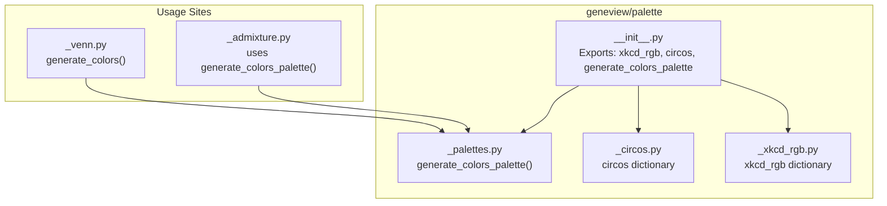
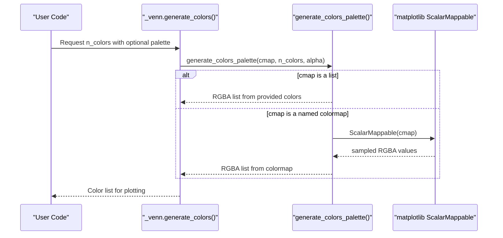
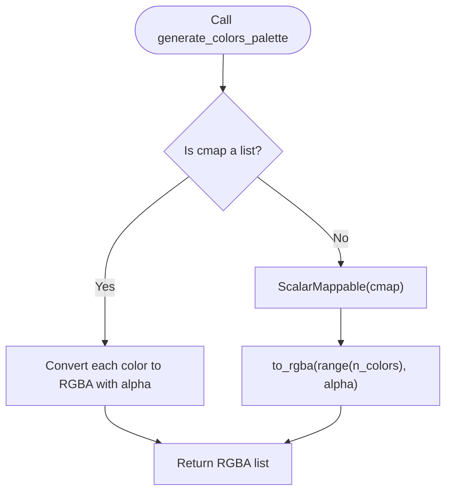
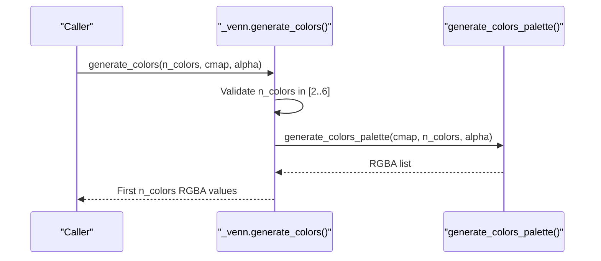
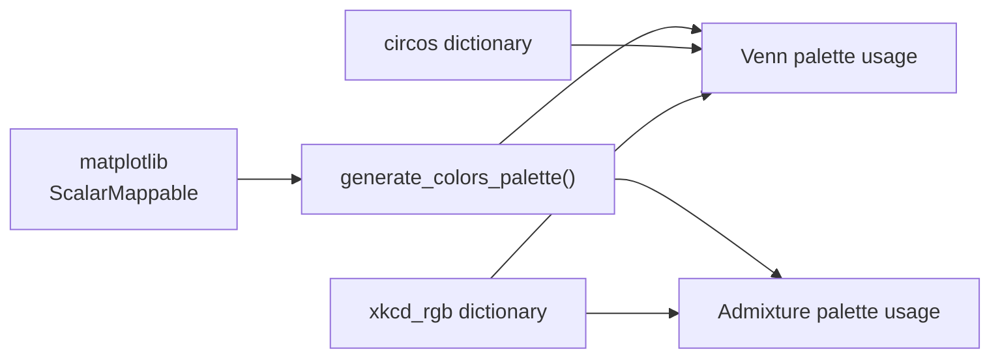

# Palette Management

<cite>
**Referenced Files in This Document**
- [__init__.py](file://geneview/palette/__init__.py)
- [_palettes.py](file://geneview/palette/_palettes.py)
- [_circos.py](file://geneview/palette/_circos.py)
- [_xkcd_rgb.py](file://geneview/palette/_xkcd_rgb.py)
- [test_palettes.py](file://geneview/tests/test_palettes.py)
- [_venn.py](file://geneview/baseplot/_venn.py)
- [_admixture.py](file://geneview/popgene/_admixture.py)
- [palettes.ipynb](file://docs/tutorial/palettes.ipynb)
</cite>

## Table of Contents
1. [Introduction](#introduction)
2. [Project Structure](#project-structure)
3. [Core Components](#core-components)
4. [Architecture Overview](#architecture-overview)
5. [Detailed Component Analysis](#detailed-component-analysis)
6. [Dependency Analysis](#dependency-analysis)
7. [Performance Considerations](#performance-considerations)
8. [Troubleshooting Guide](#troubleshooting-guide)
9. [Conclusion](#conclusion)

## Introduction
This document provides comprehensive API documentation for GeneView's color palette management system. It covers the generation and usage of color palettes for scientific visualization, focusing on:
- `generate_colors_palette()`: Matplotlib-based palette generator supporting both named colormaps and custom color lists
- Chromosome ideogram and cytogenetic band color schemes via the Circos palette
- XKCD color dictionary for human-friendly color names
- Practical usage patterns in Venn diagrams and admixture plots
- Integration with matplotlib colormaps and scientific visualization standards

The documentation emphasizes parameter specifications, output formats, naming conventions, and compatibility considerations for reproducible and accessible visualizations.

## Project Structure
The palette subsystem resides under `geneview/palette` and exposes three primary APIs:
- `generate_colors_palette()`: Core palette generator
- `circos`: Predefined Circos-style color dictionary
- `xkcd_rgb`: Human-friendly color names mapped to hex values

**Diagram sources**
- [__init__.py:1-10](file://geneview/palette/__init__.py#L1-L10)
- [_palettes.py:1-13](file://geneview/palette/_palettes.py#L1-L13)
- [_circos.py:1-236](file://geneview/palette/_circos.py#L1-L236)
- [_xkcd_rgb.py:1-951](file://geneview/palette/_xkcd_rgb.py#L1-L951)
- [_venn.py:123-130](file://geneview/baseplot/_venn.py#L123-L130)
- [_admixture.py:13-67](file://geneview/popgene/_admixture.py#L13-L67)

**Section sources**
- [__init__.py:1-10](file://geneview/palette/__init__.py#L1-L10)

## Core Components
- `generate_colors_palette(cmap="viridis", n_colors=10, alpha=1.0)`
  - Purpose: Generate a list of RGBA colors from a matplotlib colormap or a custom list of colors
  - Behavior:
    - If `cmap` is a list, converts each color to RGBA with the specified alpha
    - Otherwise, creates a ScalarMappable from the named colormap and samples `n_colors`
  - Output: List of RGBA tuples/lists, each with four numeric values in [0, 1]
  - Notes: Accepts any valid matplotlib colormap name or a list of hex strings

- `circos`: Dictionary of predefined color names for chromosome ideograms and cytogenetic bands
  - Includes hues (e.g., optblue, vlred, dgrey), cytogenetic bands (e.g., gpos25, gpos50, acen), and UCSC chromosome colors (e.g., chr1, chrX, chrUn)
  - Values are hex color strings prefixed with "#"

- `xkcd_rgb`: Dictionary mapping human-friendly color names to hex values
  - Useful for accessible and memorable color choices
  - Values are hex color strings prefixed with "#"

**Section sources**
- [_palettes.py:5-12](file://geneview/palette/_palettes.py#L5-L12)
- [_circos.py:1-236](file://geneview/palette/_circos.py#L1-L236)
- [_xkcd_rgb.py:1-951](file://geneview/palette/_xkcd_rgb.py#L1-L951)

## Architecture Overview
The palette system integrates matplotlib colormaps with domain-specific dictionaries for scientific visualization. The Venn and admixture modules consume the palette APIs to produce consistent, accessible color schemes.

**Diagram sources**
- [_venn.py:123-130](file://geneview/baseplot/_venn.py#L123-L130)
- [_palettes.py:5-12](file://geneview/palette/_palettes.py#L5-L12)

## Detailed Component Analysis

### Component A: generate_colors_palette()
- Function signature: `generate_colors_palette(cmap="viridis", n_colors=10, alpha=1.0)`
- Parameters:
  - `cmap`: Either a matplotlib colormap name (string) or a list of color strings (hex)
  - `n_colors`: Number of colors to generate (integer)
  - `alpha`: Transparency factor in [0, 1]; applies to all returned colors
- Output format: List of RGBA values, each element is a 4-tuple/list of floats in [0, 1]
- Behavior:
  - When `cmap` is a list, each color is converted to RGBA with the specified alpha
  - When `cmap` is a string, a ScalarMappable is created and `n_colors` are sampled
- Edge cases:
  - Works with `n_colors=1` and larger values
  - Alpha affects all colors uniformly

**Diagram sources**
- [_palettes.py:5-12](file://geneview/palette/_palettes.py#L5-L12)

**Section sources**
- [_palettes.py:5-12](file://geneview/palette/_palettes.py#L5-L12)
- [test_palettes.py:10-66](file://geneview/tests/test_palettes.py#L10-L66)

### Component B: Venn Diagram Palette Integration
- Function: `generate_colors(cmap="viridis", n_colors=6, alpha=0.4)`
- Purpose: Generate a color list tailored for Venn diagrams with sensible defaults
- Validation: Enforces `n_colors` to be an integer between 2 and 6
- Integration: Delegates to `generate_colors_palette()` and slices to requested length

**Diagram sources**
- [_venn.py:123-130](file://geneview/baseplot/_venn.py#L123-L130)
- [_palettes.py:5-12](file://geneview/palette/_palettes.py#L5-L12)

**Section sources**
- [_venn.py:123-130](file://geneview/baseplot/_venn.py#L123-L130)

### Component C: Admixture Plot Palette Integration
- Usage pattern: Calls `generate_colors_palette(cmap=palette, n_colors=len(k_names))`
- Purpose: Dynamically select palette size based on number of ancestry components
- Compatibility: Works with both named colormaps and custom color lists

**Section sources**
- [_admixture.py:13-67](file://geneview/popgene/_admixture.py#L13-L67)

### Component D: Circos Ideogram and Band Colors
- Dictionary: `circos`
- Categories:
  - Optimal visualization colors (e.g., optblue, optred)
  - Greyscale gradients (e.g., lgrey, dgrey)
  - Chromosome hues (e.g., vlred, lblue, purple)
  - Cytogenetic bands (e.g., gpos25, gpos50, acen, stalk)
  - UCSC chromosome palette (e.g., chr1–chr24, chrX, chrY, chrUn, chrNA)
- Naming convention: Lowercase with hyphenated suffixes (e.g., "vlred", "gpos50", "chrX")
- Color space: Hex strings prefixed with "#"

**Section sources**
- [_circos.py:1-236](file://geneview/palette/_circos.py#L1-L236)

### Component E: XKCD Human-Friendly Colors
- Dictionary: `xkcd_rgb`
- Characteristics:
  - Human-readable color names (e.g., "acid green", "blush pink")
  - Values are hex strings prefixed with "#"
- Use cases: Accessible, memorable color choices for exploratory visualization

**Section sources**
- [_xkcd_rgb.py:1-951](file://geneview/palette/_xkcd_rgb.py#L1-L951)

## Dependency Analysis
The palette system exhibits low coupling and high cohesion:
- `generate_colors_palette()` depends on matplotlib for colormap sampling
- Venn and admixture modules depend on `generate_colors_palette()` for dynamic palette generation
- `circos` and `xkcd_rgb` are independent dictionaries used for fixed color schemes

**Diagram sources**
- [_palettes.py:1-2](file://geneview/palette/_palettes.py#L1-L2)
- [_venn.py:123-130](file://geneview/baseplot/_venn.py#L123-L130)
- [_admixture.py:13-67](file://geneview/popgene/_admixture.py#L13-L67)
- [_circos.py:1-236](file://geneview/palette/_circos.py#L1-L236)
- [_xkcd_rgb.py:1-951](file://geneview/palette/_xkcd_rgb.py#L1-L951)

**Section sources**
- [_palettes.py:1-2](file://geneview/palette/_palettes.py#L1-L2)
- [_venn.py:123-130](file://geneview/baseplot/_venn.py#L123-L130)
- [_admixture.py:13-67](file://geneview/popgene/_admixture.py#L13-L67)

## Performance Considerations
- Colormap sampling cost: Generating many colors from a named colormap scales linearly with `n_colors`
- List-based palette cost: Converting a list of colors to RGBA is O(n_colors)
- Reuse patterns: Prefer reusing generated palettes across plots to avoid repeated computation
- Memory footprint: RGBA lists are compact; overhead is minimal for typical visualization needs

## Troubleshooting Guide
Common issues and resolutions:
- Invalid colormap name: Ensure the `cmap` argument is a valid matplotlib colormap name or a list of hex strings
- Unexpected transparency: Verify the `alpha` parameter is in [0, 1]; all returned colors share the same alpha
- Palette size mismatch: For Venn diagrams, constrain `n_colors` to [2, 6] as enforced by the wrapper function
- Color space mismatches: All outputs are RGBA float tuples/lists; convert to hex if required by downstream libraries

Validation and tests:
- The test suite verifies:
  - Return type and length of generated palettes
  - Correctness of alpha application
  - Distinctness across different colormaps
  - Behavior when passing a custom color list
  - Edge cases for small and large `n_colors`

**Section sources**
- [test_palettes.py:10-66](file://geneview/tests/test_palettes.py#L10-L66)
- [_venn.py:123-130](file://geneview/baseplot/_venn.py#L123-L130)

## Conclusion
GeneView’s palette management system provides a flexible, test-backed foundation for color generation in scientific visualizations. The `generate_colors_palette()` function integrates seamlessly with matplotlib while offering convenient overrides for custom color lists. The `circos` and `xkcd_rgb` dictionaries supply domain-appropriate and accessible color schemes, respectively. Together, these components enable consistent, reproducible, and visually effective plots across Venn diagrams, admixture displays, and other genomic visualizations.