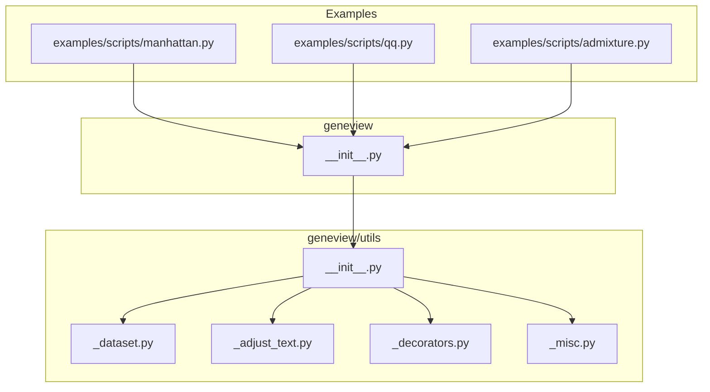
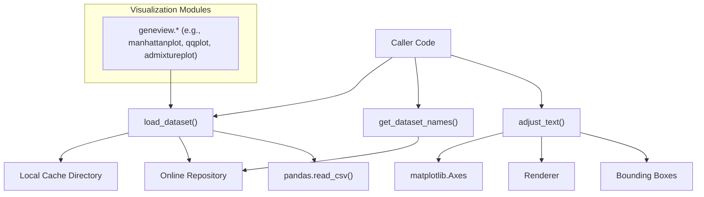
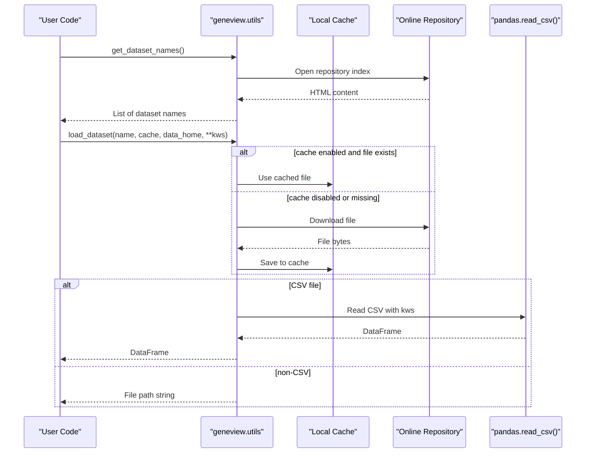
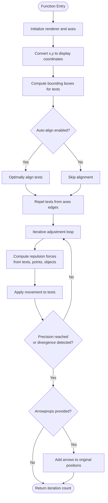
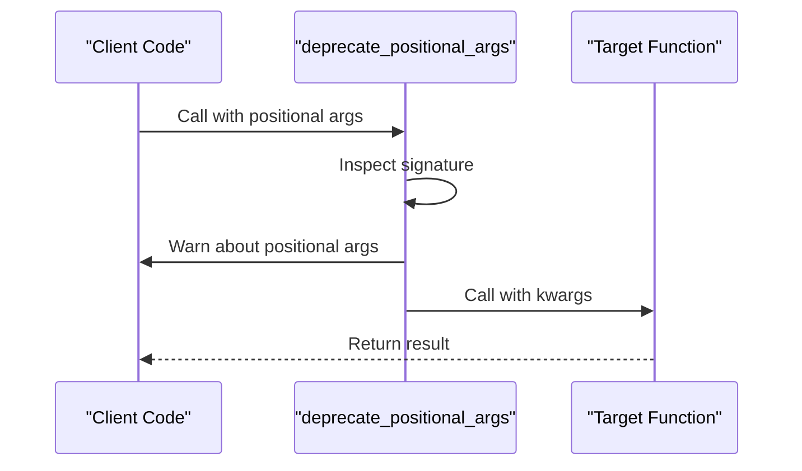
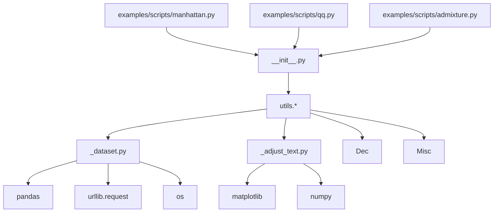

# Utility Functions

<cite>
**Referenced Files in This Document**
- [__init__.py](file://geneview/utils/__init__.py)
- [_dataset.py](file://geneview/utils/_dataset.py)
- [_adjust_text.py](file://geneview/utils/_adjust_text.py)
- [_decorators.py](file://geneview/utils/_decorators.py)
- [_misc.py](file://geneview/utils/_misc.py)
- [__init__.py](file://geneview/__init__.py)
- [manhattan.py](file://examples/scripts/manhattan.py)
- [qq.py](file://examples/scripts/qq.py)
- [admixture.py](file://examples/scripts/admixture.py)
- [test_decorators.py](file://geneview/tests/test_decorators.py)
</cite>

## Table of Contents
1. [Introduction](#introduction)
2. [Project Structure](#project-structure)
3. [Core Components](#core-components)
4. [Architecture Overview](#architecture-overview)
5. [Detailed Component Analysis](#detailed-component-analysis)
6. [Dependency Analysis](#dependency-analysis)
7. [Performance Considerations](#performance-considerations)
8. [Troubleshooting Guide](#troubleshooting-guide)
9. [Conclusion](#conclusion)
10. [Appendices](#appendices)

## Introduction
This document provides comprehensive API documentation for GeneView’s utility functions focused on data loading, dataset management, parameter validation, and text adjustment utilities. Specifically, it covers:
- Data loading and caching: load_dataset(), get_dataset_names()
- Text adjustment utilities: adjust_text()
- Parameter validation decorator: deprecate_positional_args
- Miscellaneous helpers: is_numeric
- Dataset preparation workflows and integration with visualization functions

The goal is to help users understand how to prepare datasets, manage data sources, validate function parameters, and fine-tune text placement in plots for genomics visualization pipelines.

## Project Structure
The utility functions live under the geneview/utils package and are exposed at the package level for convenient access. They integrate with visualization modules and example scripts to demonstrate typical workflows.

**Diagram sources**
- [__init__.py:10-19](file://geneview/utils/__init__.py#L10-L19)
- [__init__.py:4-6](file://geneview/__init__.py#L4-L6)

**Section sources**
- [__init__.py:10-19](file://geneview/utils/__init__.py#L10-L19)
- [__init__.py:4-6](file://geneview/__init__.py#L4-L6)

## Core Components
This section documents the primary utility functions and their roles in data preparation and visualization workflows.

- load_dataset(name, cache=True, data_home=None, **kws)
  - Loads a dataset from an online repository. Supports CSV and non-CSV files. Provides local caching and pandas read options.
  - Returns a pandas DataFrame for CSV files or a file path for non-CSV files.
  - Uses an internal cache directory controlled by an environment variable and defaults to a user home directory.

- get_dataset_names()
  - Lists available example datasets by parsing the online repository page.

- adjust_text(texts, x=None, y=None, add_objects=None, ax=None, ...)
  - Iteratively adjusts text positions to minimize overlaps with other texts, points, and additional objects. Supports auto-alignment, precision thresholds, and saving intermediate steps.

- deprecate_positional_args(f)
  - Decorator that enforces keyword-only arguments for selected parameters, issuing warnings when positional arguments are used.

- is_numeric(s)
  - Checks if a value is numeric by attempting to convert to float.

**Section sources**
- [_dataset.py:22-67](file://geneview/utils/_dataset.py#L22-L67)
- [_dataset.py:10-19](file://geneview/utils/_dataset.py#L10-L19)
- [_adjust_text.py:439-758](file://geneview/utils/_adjust_text.py#L439-L758)
- [_decorators.py:8-45](file://geneview/utils/_decorators.py#L8-L45)
- [_misc.py:6-42](file://geneview/utils/_misc.py#L6-L42)

## Architecture Overview
The utility functions are designed to support:
- Data ingestion and caching for reproducible workflows
- Robust parameter validation for API stability
- Flexible text positioning for publication-ready plots
- Seamless integration with visualization modules

**Diagram sources**
- [_dataset.py:22-67](file://geneview/utils/_dataset.py#L22-L67)
- [_adjust_text.py:439-758](file://geneview/utils/_adjust_text.py#L439-L758)
- [__init__.py:4-8](file://geneview/__init__.py#L4-L8)

## Detailed Component Analysis

### Data Loading and Management: load_dataset() and get_dataset_names()
- Purpose
  - Provide access to curated example datasets hosted online.
  - Enable local caching to reduce network overhead and improve reproducibility.
- Behavior
  - get_dataset_names(): Fetches the repository index page and extracts dataset filenames.
  - load_dataset():
    - Determines whether to treat the input as a CSV or a raw file path.
    - Optionally caches files to a local directory derived from an environment variable or a default path.
    - Reads CSV files with pandas and removes trailing all-null rows.
    - Returns a DataFrame for CSV or a file path for non-CSV.
- Parameters
  - name: Dataset identifier; for CSV files, appends .csv to the URL; for others, uses the raw file path.
  - cache: Whether to cache downloaded files locally.
  - data_home: Override default cache directory; respects an environment variable if not provided.
  - kws: Additional keyword arguments passed to pandas.read_csv().
- Error Handling
  - Trailing all-null rows are removed for CSV files.
  - Non-CSV returns a path string suitable for downstream processing.
- Integration
  - Used by visualization functions to quickly load example datasets for demonstrations and tutorials.

**Diagram sources**
- [_dataset.py:10-19](file://geneview/utils/_dataset.py#L10-L19)
- [_dataset.py:22-67](file://geneview/utils/_dataset.py#L22-L67)

**Section sources**
- [_dataset.py:10-19](file://geneview/utils/_dataset.py#L10-L19)
- [_dataset.py:22-67](file://geneview/utils/_dataset.py#L22-L67)

### Text Adjustment Utilities: adjust_text()
- Purpose
  - Automatically adjust text positions to minimize overlaps with other texts, data points, and additional objects.
- Key Features
  - Auto-alignment of text anchors to reduce overlaps.
  - Repulsion forces from other texts, data points, and arbitrary matplotlib objects.
  - Precision thresholds and iteration limits to control convergence.
  - Optional saving of intermediate steps for debugging adjustments.
  - Arrow annotations linking adjusted texts to their original positions.
- Parameters
  - texts: List of matplotlib Text objects.
  - x, y: Optional arrays of point coordinates to repel from.
  - add_objects: Optional list of additional matplotlib objects whose bounding boxes are used for repulsion.
  - ax: Target axes; defaults to current axes.
  - expand_*: Multipliers to expand bounding boxes during repulsion calculations.
  - autoalign: Controls automatic alignment selection ("xy", "x", "y", or False).
  - force_*: Multipliers for repulsion strengths.
  - lim: Maximum number of iterations.
  - precision: Convergence threshold based on total overlap area.
  - only_move: Restrict movement directions for different overlap types.
  - avoid_text/avoid_points/avoid_self: Control which repulsion mechanisms are active.
  - save_steps/save_prefix/save_format/add_step_numbers: Controls saving intermediate steps.
  - arrowprops: Keyword arguments passed to annotate() to draw arrows to original positions.
- Processing Logic
  - Converts point coordinates to display units.
  - Computes initial bounding boxes and alignment costs.
  - Iteratively computes repulsion forces and updates text positions.
  - Stops when precision thresholds are met or convergence fails.
  - Optionally annotates arrows from texts to their original positions.

**Diagram sources**
- [_adjust_text.py:439-758](file://geneview/utils/_adjust_text.py#L439-L758)

**Section sources**
- [_adjust_text.py:439-758](file://geneview/utils/_adjust_text.py#L439-L758)

### Parameter Validation Decorator: deprecate_positional_args
- Purpose
  - Enforce keyword-only arguments for selected parameters to improve API stability and prevent misuse.
- Behavior
  - Inspects function signatures and issues warnings when positional arguments are passed for parameters intended to be keyword-only.
  - Updates kwargs with positional values and forwards to the decorated function.
- Typical Use
  - Applied to functions where future breaking changes may occur, guiding users toward explicit keyword usage.

**Diagram sources**
- [_decorators.py:8-45](file://geneview/utils/_decorators.py#L8-L45)

**Section sources**
- [_decorators.py:8-45](file://geneview/utils/_decorators.py#L8-L45)
- [test_decorators.py:12-48](file://geneview/tests/test_decorators.py#L12-L48)

### Miscellaneous Helpers: is_numeric
- Purpose
  - Determine whether a value is numeric by attempting conversion to float.
- Use Cases
  - Preprocessing checks in visualization pipelines to ensure numerical inputs for plotting functions.

**Section sources**
- [_misc.py:6-42](file://geneview/utils/_misc.py#L6-L42)

## Dependency Analysis
- Internal Dependencies
  - load_dataset() depends on:
    - urllib.request for downloading files
    - pandas for CSV parsing
    - os for path handling and cache directory creation
    - Environment variables for cache location
  - adjust_text() depends on:
    - matplotlib for axes, renderer, and text objects
    - numpy for numerical computations
    - PathCollection extents for scatter plots
- External Integrations
  - Visualization modules (e.g., manhattanplot, qqplot, admixtureplot) rely on load_dataset() to obtain example datasets.
- Cohesion and Coupling
  - Utilities are cohesive around data loading, text adjustment, and parameter validation.
  - Coupling is primarily to external libraries (matplotlib, pandas) and the online repository.

**Diagram sources**
- [_dataset.py:4-7](file://geneview/utils/_dataset.py#L4-L7)
- [_adjust_text.py:8-14](file://geneview/utils/_adjust_text.py#L8-L14)
- [__init__.py:4-6](file://geneview/__init__.py#L4-L6)

**Section sources**
- [_dataset.py:4-7](file://geneview/utils/_dataset.py#L4-L7)
- [_adjust_text.py:8-14](file://geneview/utils/_adjust_text.py#L8-L14)
- [__init__.py:4-6](file://geneview/__init__.py#L4-L6)

## Performance Considerations
- Data Loading
  - Caching reduces repeated network requests and improves reproducibility.
  - CSV parsing overhead scales with dataset size; consider chunking or filtering when working with large datasets.
- Text Adjustment
  - adjust_text() performs iterative repulsion calculations; complexity increases with the number of texts and points.
  - Tuning expand_* multipliers and precision can balance quality and speed.
  - Limit iterations via lim to avoid long runs on complex layouts.
- Rendering
  - Renderer acquisition and bounding box computation dominate runtime; minimize unnecessary redraws and reuse axes where possible.

[No sources needed since this section provides general guidance]

## Troubleshooting Guide
- Network Issues
  - If load_dataset() fails to download, verify connectivity and proxy settings. The function relies on an online repository; offline environments require pre-downloaded files or local alternatives.
- Cache Directory Permissions
  - Ensure write permissions to the cache directory. The default path resolves to a user home directory; override via the environment variable or data_home parameter.
- CSV Parsing Errors
  - If pandas.read_csv() raises errors, review encoding, delimiter, and header options passed via kws.
- adjust_text() Not Working as Expected
  - Ensure axes limits and renderer are finalized before calling adjust_text(); call it after all plotting is complete.
  - Verify that x and y are provided together or not at all; partial specification raises an error.
  - Reduce precision or increase lim for complex layouts; disable avoid_points or avoid_text selectively to simplify adjustments.
- Parameter Deprecation Warnings
  - Use keyword arguments for parameters marked as keyword-only by deprecate_positional_args to suppress warnings and future-proof code.

**Section sources**
- [_dataset.py:22-67](file://geneview/utils/_dataset.py#L22-L67)
- [_adjust_text.py:570-625](file://geneview/utils/_adjust_text.py#L570-L625)
- [_decorators.py:8-45](file://geneview/utils/_decorators.py#L8-L45)

## Conclusion
GeneView’s utility functions provide robust mechanisms for data loading, dataset discovery, parameter validation, and text adjustment. Together with visualization modules, they enable efficient, reproducible, and publication-ready genomics data visualizations. Following the best practices outlined here ensures reliable workflows and predictable behavior across diverse datasets and plotting scenarios.

[No sources needed since this section summarizes without analyzing specific files]

## Appendices

### Example Workflows
- Manhattan Plot Workflow
  - Load example GWAS dataset using load_dataset().
  - Pass the subset of required columns to manhattanplot().
  - Use adjust_text() to refine SNP labels after plotting.

- QQ Plot Workflow
  - Load the GWAS dataset and pass the P-column to qqplot().
  - Apply adjust_text() to annotate significant points if needed.

- Admixture Plot Workflow
  - Load Q matrix and population info files via load_dataset().
  - Visualize using admixtureplot() and adjust text labels for clarity.

**Section sources**
- [manhattan.py:4-11](file://examples/scripts/manhattan.py#L4-L11)
- [qq.py:4-5](file://examples/scripts/qq.py#L4-L5)
- [admixture.py:4-22](file://examples/scripts/admixture.py#L4-L22)

### API Reference Summary
- load_dataset(name, cache=True, data_home=None, **kws)
  - Returns: pandas.DataFrame for CSV, str for non-CSV
  - Side effects: Downloads and caches files locally
- get_dataset_names()
  - Returns: list of dataset names
- adjust_text(texts, x=None, y=None, add_objects=None, ax=None, ...)
  - Returns: number of iterations performed
  - Side effects: Modifies text positions and optionally adds arrows
- deprecate_positional_args(f)
  - Returns: decorated function with enforced keyword-only arguments
- is_numeric(s)
  - Returns: bool indicating numeric type

**Section sources**
- [_dataset.py:22-67](file://geneview/utils/_dataset.py#L22-L67)
- [_dataset.py:10-19](file://geneview/utils/_dataset.py#L10-L19)
- [_adjust_text.py:439-758](file://geneview/utils/_adjust_text.py#L439-L758)
- [_decorators.py:8-45](file://geneview/utils/_decorators.py#L8-L45)
- [_misc.py:6-42](file://geneview/utils/_misc.py#L6-L42)