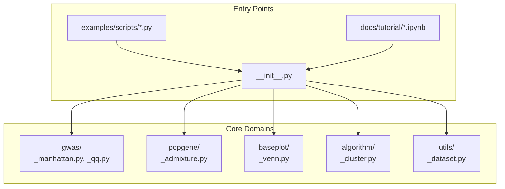
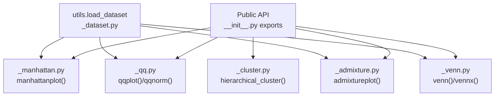
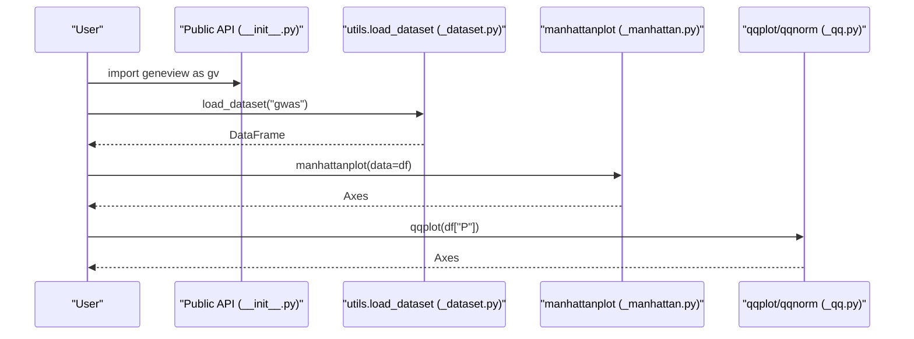
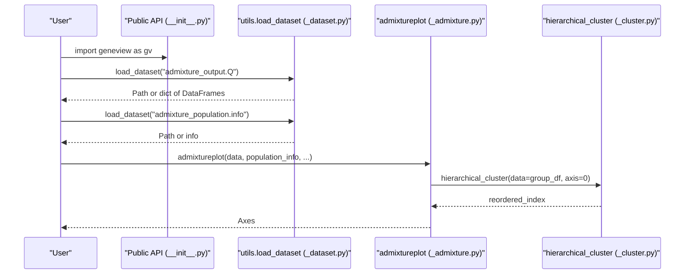
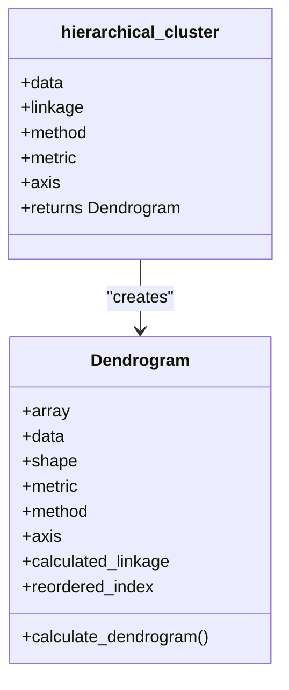
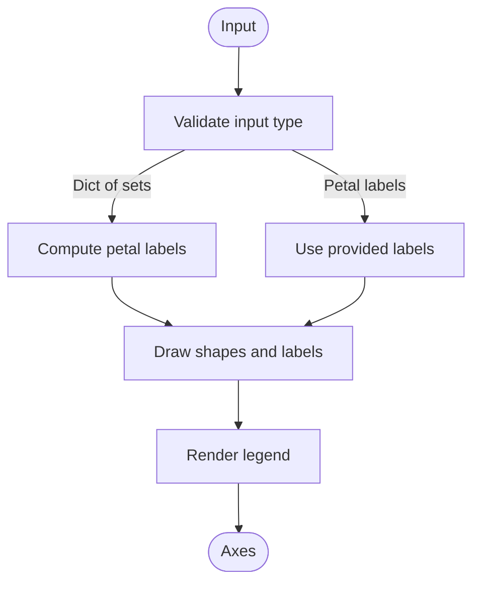
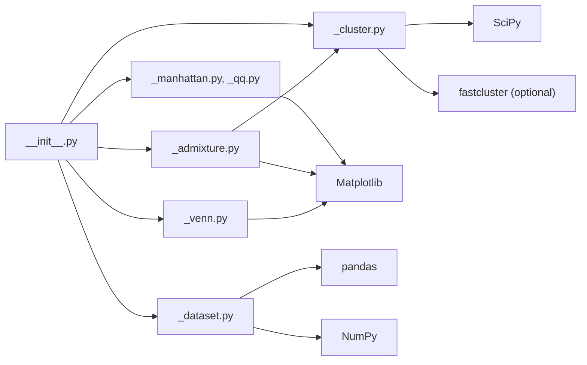

# Core Concepts

<cite>
**Referenced Files in This Document**
- [README.md](file://README.md)
- [__init__.py](file://geneview/__init__.py)
- [_dataset.py](file://geneview/utils/_dataset.py)
- [_manhattan.py](file://geneview/gwas/_manhattan.py)
- [_qq.py](file://geneview/gwas/_qq.py)
- [_admixture.py](file://geneview/popgene/_admixture.py)
- [_cluster.py](file://geneview/algorithm/_cluster.py)
- [_venn.py](file://geneview/baseplot/_venn.py)
- [manhattan.py](file://examples/scripts/manhattan.py)
- [qq.py](file://examples/scripts/qq.py)
- [admixture.py](file://examples/scripts/admixture.py)
- [venn.py](file://examples/scripts/venn.py)
- [gwas_plot.ipynb](file://docs/tutorial/gwas_plot.ipynb)
</cite>

## Table of Contents
1. [Introduction](#introduction)
2. [Project Structure](#project-structure)
3. [Core Components](#core-components)
4. [Architecture Overview](#architecture-overview)
5. [Detailed Component Analysis](#detailed-component-analysis)
6. [Dependency Analysis](#dependency-analysis)
7. [Performance Considerations](#performance-considerations)
8. [Troubleshooting Guide](#troubleshooting-guide)
9. [Conclusion](#conclusion)
10. [Appendices](#appendices)

## Introduction
This document explains GeneView’s core genomics visualization concepts with scientific rigor and practical accessibility. It covers:
- Genomic data formats commonly visualized by GeneView (VCF, PLINK association outputs, .Q files)
- GWAS methodology and statistical concepts (P-values, Manhattan and Q–Q plots)
- Population genetics principles (ancestry inference, admixture plots)
- Hierarchical clustering algorithms and their visualization (dendrograms)
- Scientific background for interpreting visualizations (P-value distributions, chromosome positioning, population structure)

The goal is to help beginners understand the biological and statistical meaning behind the plots, while providing sufficient technical depth for experienced researchers to integrate GeneView into analysis pipelines.

## Project Structure
GeneView organizes functionality by domain:
- gwas: GWAS-focused plots (Manhattan, Q–Q)
- popgene: Population genetics plots (Admixture)
- baseplot: General-purpose plots (Venn diagrams)
- algorithm: Clustering utilities (hierarchical clustering)
- utils: Data loading helpers
- examples: Minimal scripts demonstrating workflows
- docs/tutorial: Jupyter notebooks with guided tutorials

**Diagram sources**
- [__init__.py:1-15](file://geneview/__init__.py#L1-L15)
- [_manhattan.py:1-20](file://geneview/gwas/_manhattan.py#L1-L20)
- [_qq.py:1-20](file://geneview/gwas/_qq.py#L1-L20)
- [_admixture.py:1-20](file://geneview/popgene/_admixture.py#L1-L20)
- [_venn.py:1-20](file://geneview/baseplot/_venn.py#L1-L20)
- [_cluster.py:1-20](file://geneview/algorithm/_cluster.py#L1-L20)
- [_dataset.py:1-20](file://geneview/utils/_dataset.py#L1-L20)
- [manhattan.py:1-14](file://examples/scripts/manhattan.py#L1-L14)
- [qq.py:1-9](file://examples/scripts/qq.py#L1-L9)
- [admixture.py:1-28](file://examples/scripts/admixture.py#L1-L28)
- [venn.py:1-30](file://examples/scripts/venn.py#L1-L30)
- [gwas_plot.ipynb:1-30](file://docs/tutorial/gwas_plot.ipynb#L1-L30)

**Section sources**
- [README.md:1-344](file://README.md#L1-L344)
- [__init__.py:1-15](file://geneview/__init__.py#L1-L15)

## Core Components
- GWAS plotting
  - Manhattan plot: Chromosome-position vs. -log10(P) with significance thresholds and top-SNP annotation
  - Q–Q plot: Observed vs. expected -log10(P) under the null; includes genomic control λ estimate
- Population genetics
  - Admixture plot: Individual ancestry proportions across inferred ancestral populations
- General-purpose
  - Venn diagrams: Set intersections for up to six collections
- Clustering
  - Hierarchical clustering: Agglomerative clustering with configurable linkage and distance metrics

These components are designed to accept standard genomics data frames and leverage NumPy, pandas, and Matplotlib for efficient visualization.

**Section sources**
- [_manhattan.py:20-208](file://geneview/gwas/_manhattan.py#L20-L208)
- [_qq.py:62-212](file://geneview/gwas/_qq.py#L62-L212)
- [_admixture.py:168-363](file://geneview/popgene/_admixture.py#L168-L363)
- [_venn.py:437-584](file://geneview/baseplot/_venn.py#L437-L584)
- [_cluster.py:114-146](file://geneview/algorithm/_cluster.py#L114-L146)

## Architecture Overview
The public API exposes high-level plotting functions. Internally, each plot module:
- Validates inputs and prepares data
- Computes coordinates and aesthetics
- Renders via Matplotlib axes

**Diagram sources**
- [__init__.py:3-8](file://geneview/__init__.py#L3-L8)
- [_dataset.py:22-67](file://geneview/utils/_dataset.py#L22-L67)
- [_manhattan.py:20-208](file://geneview/gwas/_manhattan.py#L20-L208)
- [_qq.py:62-212](file://geneview/gwas/_qq.py#L62-L212)
- [_admixture.py:168-363](file://geneview/popgene/_admixture.py#L168-L363)
- [_venn.py:437-584](file://geneview/baseplot/_venn.py#L437-L584)
- [_cluster.py:114-146](file://geneview/algorithm/_cluster.py#L114-L146)

## Detailed Component Analysis

### GWAS: Manhattan and Q–Q Plots
- Manhattan plot
  - Input: DataFrame with columns for chromosome, position, and P-value; optional SNP identifier
  - Behavior: Alternating chromosome colors, significance thresholds (-log10(1e-5) and -log10(5e-8)), optional top-SNP annotation within blocks
  - Special case: Single chromosome mode plots position along the axis
- Q–Q plot
  - Input: Vector of P-values
  - Behavior: Compares observed -log10(P) to expected -log10(P) under the null; includes genomic control λ estimate
  - Alternative: Normal Q–Q for residuals

**Diagram sources**
- [__init__.py:3-8](file://geneview/__init__.py#L3-L8)
- [_dataset.py:22-67](file://geneview/utils/_dataset.py#L22-L67)
- [_manhattan.py:20-208](file://geneview/gwas/_manhattan.py#L20-L208)
- [_qq.py:62-212](file://geneview/gwas/_qq.py#L62-L212)

**Section sources**
- [_manhattan.py:20-208](file://geneview/gwas/_manhattan.py#L20-L208)
- [_qq.py:62-212](file://geneview/gwas/_qq.py#L62-L212)
- [manhattan.py:1-14](file://examples/scripts/manhattan.py#L1-L14)
- [qq.py:1-9](file://examples/scripts/qq.py#L1-L9)
- [gwas_plot.ipynb:286-327](file://docs/tutorial/gwas_plot.ipynb#L286-L327)

### Population Genetics: Admixture Plot
- Input: .Q file (ancestry proportions per individual) and optional per-individual population labels
- Behavior:
  - Optional per-population subsampling
  - Hierarchical clustering of individuals within each population (by sample rows)
  - Stacked bars representing inferred ancestral populations (K)
- Palette and layout: Configurable colors and x-axis labels

**Diagram sources**
- [__init__.py:7-8](file://geneview/__init__.py#L7-L8)
- [_dataset.py:22-67](file://geneview/utils/_dataset.py#L22-L67)
- [_admixture.py:168-363](file://geneview/popgene/_admixture.py#L168-L363)
- [_cluster.py:114-146](file://geneview/algorithm/_cluster.py#L114-L146)

**Section sources**
- [_admixture.py:168-363](file://geneview/popgene/_admixture.py#L168-L363)
- [admixture.py:1-28](file://examples/scripts/admixture.py#L1-L28)

### Hierarchical Clustering
- Purpose: Agglomerative clustering for organizing samples or features based on distance and linkage criteria
- Inputs: Data matrix, linkage method, distance metric, axis (rows/columns)
- Outputs: Reordered indices suitable for heatmap or dendrogram ordering

**Diagram sources**
- [_cluster.py:19-111](file://geneview/algorithm/_cluster.py#L19-L111)
- [_cluster.py:114-146](file://geneview/algorithm/_cluster.py#L114-L146)

**Section sources**
- [_cluster.py:19-146](file://geneview/algorithm/_cluster.py#L19-L146)

### Venn Diagrams
- Purpose: Visualize intersections among 2–6 sets
- Inputs: Dictionary of sets or precomputed petal labels
- Behavior: Generates ellipses/triangles per set, annotates petals with counts/percentages/logic strings, optional legend

**Diagram sources**
- [_venn.py:437-584](file://geneview/baseplot/_venn.py#L437-L584)
- [_venn.py:298-435](file://geneview/baseplot/_venn.py#L298-L435)

**Section sources**
- [_venn.py:1-585](file://geneview/baseplot/_venn.py#L1-L585)
- [venn.py:1-30](file://examples/scripts/venn.py#L1-L30)

## Dependency Analysis
- Public API surface
  - Exports plotting functions and utilities from submodules
- Internal dependencies
  - GWAS plots depend on utils for data loading and Matplotlib for rendering
  - Admixture plot depends on hierarchical clustering and palette utilities
  - Venn diagrams depend on palette generation and Matplotlib patches
- External libraries
  - NumPy, pandas, Matplotlib, SciPy (and optional statsmodels), optional fastcluster for performance

**Diagram sources**
- [__init__.py:1-15](file://geneview/__init__.py#L1-L15)
- [_manhattan.py:12-17](file://geneview/gwas/_manhattan.py#L12-L17)
- [_qq.py:7-11](file://geneview/gwas/_qq.py#L7-L11)
- [_admixture.py:13-14](file://geneview/popgene/_admixture.py#L13-L14)
- [_venn.py:8-12](file://geneview/baseplot/_venn.py#L8-L12)
- [_cluster.py:10-16](file://geneview/algorithm/_cluster.py#L10-L16)
- [_dataset.py:4-7](file://geneview/utils/_dataset.py#L4-L7)

**Section sources**
- [README.md:324-340](file://README.md#L324-L340)

## Performance Considerations
- Hierarchical clustering
  - Prefer fastcluster when available for large matrices; falls back to SciPy with a warning for large inputs
  - Choose appropriate linkage and metric; Euclidean with centroid/median/ward is optimized in fastcluster
- Plotting
  - Minimize repeated recalculations (e.g., avoid recomputing dendrograms)
  - Use vectorized operations via NumPy/pandas for large datasets
- Memory
  - Consider subsampling for very large admixture datasets via per-group sampling options

**Section sources**
- [_cluster.py:66-93](file://geneview/algorithm/_cluster.py#L66-L93)

## Troubleshooting Guide
- Input validation errors
  - Missing required columns in GWAS data (e.g., chromosome, position, P-value)
  - Mutually exclusive parameters (e.g., selecting a single chromosome and providing x-tick labels simultaneously)
- Data types
  - Ensure P-values are numeric; non-numeric entries raise errors
- Admixture input mismatches
  - Sample count mismatch between .Q file and population info
  - Group order and labels must align with dataset structure
- Venn inputs
  - Provide either a dictionary of sets or precomputed petal labels consistently
- Dataset loading
  - Verify network connectivity and cache directory permissions

**Section sources**
- [_manhattan.py:209-221](file://geneview/gwas/_manhattan.py#L209-L221)
- [_qq.py:168-178](file://geneview/gwas/_qq.py#L168-L178)
- [_admixture.py:326-340](file://geneview/popgene/_admixture.py#L326-L340)
- [_venn.py:421-434](file://geneview/baseplot/_venn.py#L421-L434)
- [_dataset.py:51-67](file://geneview/utils/_dataset.py#L51-L67)

## Conclusion
GeneView provides a cohesive toolkit for genomics visualization:
- GWAS plots interpret statistical evidence across chromosomes
- Q–Q plots assess distributional assumptions and inflation
- Admixture plots reveal population structure and ancestry
- Hierarchical clustering supports downstream organization and exploration
- Venn diagrams summarize set overlaps succinctly

Together, these components enable reproducible, publication-ready visualizations grounded in established statistical and population-genetics principles.

## Appendices

### Scientific Background and Terminology
- P-values and significance thresholds
  - -log10(P) scaling emphasizes small P-values; typical thresholds for genome-wide significance are -log10(5e-8)
- Manhattan plots
  - Chromosome-wise -log10(P) highlights loci enriched for association
- Q–Q plots
  - Deviations from the diagonal indicate departures from the null hypothesis; λ quantifies genomic inflation
- Population structure and admixture
  - Admixture proportions reflect ancestry components; clustering helps organize samples by inferred groups
- Hierarchical clustering
  - Linkage defines inter-cluster distances; common methods include average, complete, single, and Ward’s criterion

**Section sources**
- [_manhattan.py:88-104](file://geneview/gwas/_manhattan.py#L88-L104)
- [_qq.py:200-207](file://geneview/gwas/_qq.py#L200-L207)

### Example Workflows
- Manhattan and Q–Q plots
  - Load example GWAS data and render both plots with customized aesthetics
- Admixture plot
  - Load .Q and population info; optionally subsample and reorder groups
- Venn diagrams
  - Generate diagrams for 2–6 sets with custom palettes and label formats

**Section sources**
- [manhattan.py:1-14](file://examples/scripts/manhattan.py#L1-L14)
- [qq.py:1-9](file://examples/scripts/qq.py#L1-L9)
- [admixture.py:1-28](file://examples/scripts/admixture.py#L1-L28)
- [venn.py:1-30](file://examples/scripts/venn.py#L1-L30)
- [gwas_plot.ipynb:286-327](file://docs/tutorial/gwas_plot.ipynb#L286-L327)