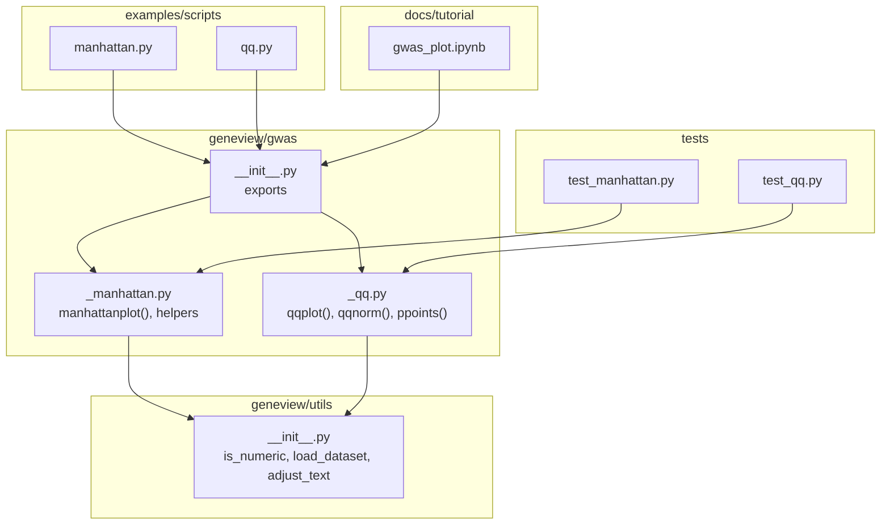
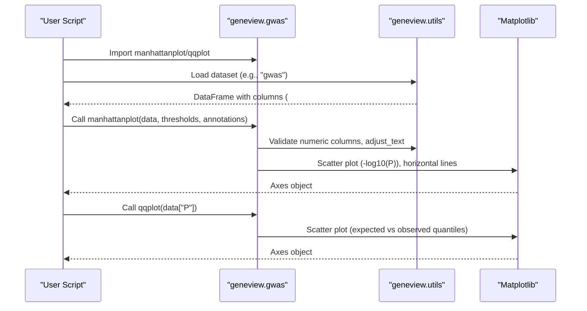
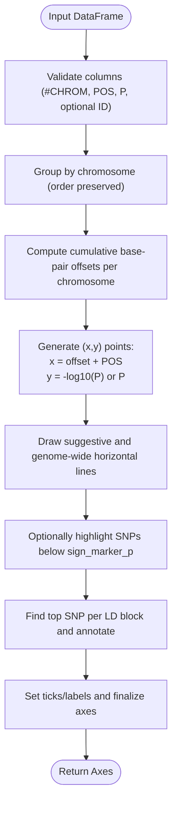
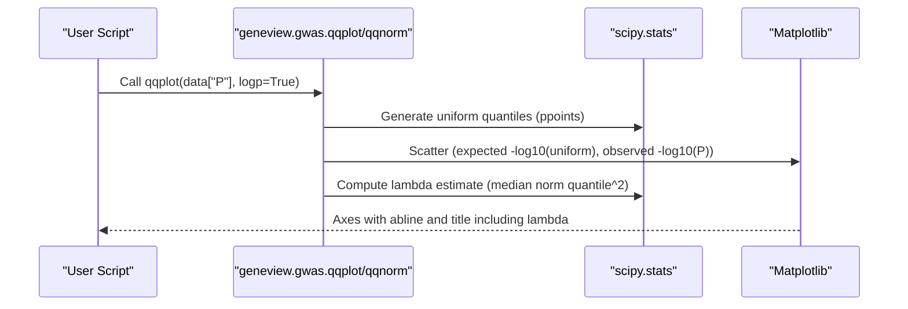
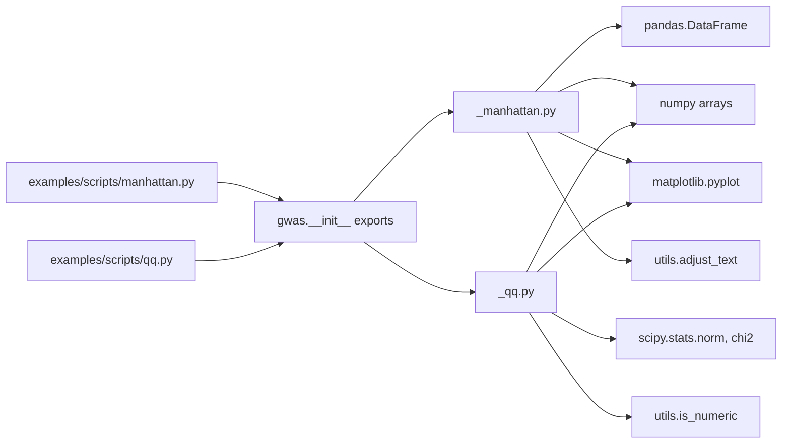

# GWAS Methodology

<cite>
**Referenced Files in This Document**
- [_manhattan.py](file://geneview/gwas/_manhattan.py)
- [_qq.py](file://geneview/gwas/_qq.py)
- [__init__.py](file://geneview/gwas/__init__.py)
- [utils/__init__.py](file://geneview/utils/__init__.py)
- [manhattan.py](file://examples/scripts/manhattan.py)
- [qq.py](file://examples/scripts/qq.py)
- [test_manhattan.py](file://geneview/tests/test_manhattan.py)
- [test_qq.py](file://geneview/tests/test_qq.py)
- [README.md](file://README.md)
- [gwas_plot.ipynb](file://docs/tutorial/gwas_plot.ipynb)
</cite>

## Table of Contents
1. [Introduction](#introduction)
2. [Project Structure](#project-structure)
3. [Core Components](#core-components)
4. [Architecture Overview](#architecture-overview)
5. [Detailed Component Analysis](#detailed-component-analysis)
6. [Dependency Analysis](#dependency-analysis)
7. [Performance Considerations](#performance-considerations)
8. [Troubleshooting Guide](#troubleshooting-guide)
9. [Conclusion](#conclusion)
10. [Appendices](#appendices)

## Introduction
This document explains Genome-Wide Association Study (GWAS) methodology and statistical concepts implemented in the repository, focusing on:
- P-value calculations and -log10(P) transformations
- Genome-wide significance thresholds (5×10^-8) and suggestive thresholds (1×10^-5)
- Multiple testing corrections via Manhattan and Q-Q plots
- Manhattan plot construction, chromosome positioning logic, and SNP annotation strategies
- Q-Q plot interpretation for assessing distributional assumptions and genomic inflation
- Quality control measures, population stratification correction, and replication study guidance
- Statistical foundations and limitations of GWAS results

The repository provides reusable Python functions for generating Manhattan and Q-Q plots from GWAS summary statistics, along with example notebooks and scripts demonstrating usage.

## Project Structure
The GWAS plotting functionality resides under the geneview/gwas package, with supporting utilities in geneview/utils. Example scripts and tutorials demonstrate practical usage.

**Diagram sources**
- [_manhattan.py:1-414](file://geneview/gwas/_manhattan.py#L1-L414)
- [_qq.py:1-366](file://geneview/gwas/_qq.py#L1-L366)
- [__init__.py:1-3](file://geneview/gwas/__init__.py#L1-L3)
- [utils/__init__.py:1-20](file://geneview/utils/__init__.py#L1-L20)
- [manhattan.py:1-14](file://examples/scripts/manhattan.py#L1-L14)
- [qq.py:1-9](file://examples/scripts/qq.py#L1-L9)
- [gwas_plot.ipynb:1-711](file://docs/tutorial/gwas_plot.ipynb#L1-L711)
- [test_manhattan.py:1-46](file://geneview/tests/test_manhattan.py#L1-L46)
- [test_qq.py:1-46](file://geneview/tests/test_qq.py#L1-L46)

**Section sources**
- [_manhattan.py:1-414](file://geneview/gwas/_manhattan.py#L1-L414)
- [_qq.py:1-366](file://geneview/gwas/_qq.py#L1-L366)
- [__init__.py:1-3](file://geneview/gwas/__init__.py#L1-L3)
- [utils/__init__.py:1-20](file://geneview/utils/__init__.py#L1-L20)
- [manhattan.py:1-14](file://examples/scripts/manhattan.py#L1-L14)
- [qq.py:1-9](file://examples/scripts/qq.py#L1-L9)
- [gwas_plot.ipynb:1-711](file://docs/tutorial/gwas_plot.ipynb#L1-L711)
- [test_manhattan.py:1-46](file://geneview/tests/test_manhattan.py#L1-L46)
- [test_qq.py:1-46](file://geneview/tests/test_qq.py#L1-L46)
- [README.md:102-144](file://README.md#L102-L144)

## Core Components
- Manhattan plot generator: constructs chromosome-positioned scatter plots with significance thresholds and optional top-SNP annotations.
- Q-Q plot generator: produces quantile-quantile plots for uniform or normal distributions to assess distributional assumptions and genomic inflation.
- Utility functions: numeric validation, dataset loading, and text adjustment for readable annotations.

Key capabilities:
- Thresholds: suggestive (1×10^-5) and genome-wide (5×10^-8) lines in -log10(P) scale.
- Chromosome positioning: cumulative base-pair offsets per chromosome; optional single-chromosome linear axis.
- SNP annotation: identifies top signals within linkage disequilibrium blocks and annotates them.
- Distribution diagnostics: Q-Q plots against uniform and normal distributions; lambda estimate for genomic inflation.

**Section sources**
- [_manhattan.py:21-335](file://geneview/gwas/_manhattan.py#L21-L335)
- [_qq.py:62-212](file://geneview/gwas/_qq.py#L62-L212)
- [utils/__init__.py:10-19](file://geneview/utils/__init__.py#L10-L19)
- [README.md:102-144](file://README.md#L102-L144)

## Architecture Overview
The GWAS plotting pipeline integrates data ingestion, preprocessing, and visualization:

**Diagram sources**
- [__init__.py:1-3](file://geneview/gwas/__init__.py#L1-L3)
- [utils/__init__.py:10-19](file://geneview/utils/__init__.py#L10-L19)
- [_manhattan.py:21-335](file://geneview/gwas/_manhattan.py#L21-L335)
- [_qq.py:62-212](file://geneview/gwas/_qq.py#L62-L212)
- [manhattan.py:1-14](file://examples/scripts/manhattan.py#L1-L14)
- [qq.py:1-9](file://examples/scripts/qq.py#L1-L9)

## Detailed Component Analysis

### Manhattan Plot Construction
The manhattanplot function builds chromosome-positioned scatter plots with:
- X-axis: cumulative base-pair positions per chromosome; optional single-chromosome linear axis.
- Y-axis: -log10(P) by default; raw P-values supported.
- Horizontal thresholds: suggestive (1×10^-5) and genome-wide (5×10^-8) lines.
- Optional SNP highlighting and top-SNP annotation within LD blocks.

**Diagram sources**
- [_manhattan.py:21-335](file://geneview/gwas/_manhattan.py#L21-L335)
- [_manhattan.py:338-414](file://geneview/gwas/_manhattan.py#L338-L414)

Implementation highlights:
- Thresholds: configurable suggestive and genome-wide lines; defaults align with standard GWAS thresholds.
- Annotation: top-SNP detection within sliding LD blocks; text adjustment for readability.
- Single chromosome mode: switches to linear chromosome position on x-axis.

Usage examples:
- Notebook tutorial demonstrates basic and advanced Manhattan plots.
- Example script shows threshold customization and label rotation.

**Section sources**
- [_manhattan.py:21-335](file://geneview/gwas/_manhattan.py#L21-L335)
- [_manhattan.py:338-414](file://geneview/gwas/_manhattan.py#L338-L414)
- [gwas_plot.ipynb:285-327](file://docs/tutorial/gwas_plot.ipynb#L285-L327)
- [manhattan.py:1-14](file://examples/scripts/manhattan.py#L1-L14)
- [README.md:102-144](file://README.md#L102-L144)
- [test_manhattan.py:38-46](file://geneview/tests/test_manhattan.py#L38-L46)

### Q-Q Plot Construction and Interpretation
The qqplot and qqnorm functions support diagnostic assessment:
- qqplot: compares observed -log10(P) quantiles to expected uniform quantiles; includes lambda estimate.
- qqnorm: compares normalized observed distribution to standard normal.

**Diagram sources**
- [_qq.py:62-212](file://geneview/gwas/_qq.py#L62-L212)
- [_qq.py:215-310](file://geneview/gwas/_qq.py#L215-L310)

Interpretation guidelines:
- Expected vs observed near y=x indicates no inflation or deflation.
- Deviation upward (below diagonal) suggests deflation; downward suggests inflation.
- Lambda estimate quantifies genomic inflation; values near 1 indicate expected null distribution.

**Section sources**
- [_qq.py:62-212](file://geneview/gwas/_qq.py#L62-L212)
- [_qq.py:215-310](file://geneview/gwas/_qq.py#L215-L310)
- [test_qq.py:14-46](file://geneview/tests/test_qq.py#L14-L46)

### Statistical Foundations and Practical Guidance
- P-values and -log10(P): Standard transformation for visualization; genome-wide threshold corresponds to 5×10^-8.
- Multiple testing corrections: While not computed internally, Manhattan and Q-Q plots enable visual inference and diagnostic checks.
- Population stratification: Q-Q plots help detect inflation; consider principal components or structured association methods in study design.
- Quality control: Remove SNPs with low call rates, Hardy–Weinberg departure, or extreme missingness prior to analysis.
- Replication: Use independent datasets to confirm top signals; consider meta-analysis approaches.

[No sources needed since this section provides general guidance]

## Dependency Analysis
The GWAS plotting components depend on:
- pandas for DataFrame handling
- numpy for numerical operations and quantile generation
- matplotlib for plotting
- scipy.stats for theoretical distributions in Q-Q plots
- internal utilities for numeric validation and text adjustment

**Diagram sources**
- [_manhattan.py:12-18](file://geneview/gwas/_manhattan.py#L12-L18)
- [_qq.py:7-11](file://geneview/gwas/_qq.py#L7-L11)
- [utils/__init__.py:10-19](file://geneview/utils/__init__.py#L10-L19)
- [__init__.py:1-3](file://geneview/gwas/__init__.py#L1-L3)
- [manhattan.py:1-14](file://examples/scripts/manhattan.py#L1-L14)
- [qq.py:1-9](file://examples/scripts/qq.py#L1-L9)

**Section sources**
- [_manhattan.py:12-18](file://geneview/gwas/_manhattan.py#L12-L18)
- [_qq.py:7-11](file://geneview/gwas/_qq.py#L7-L11)
- [utils/__init__.py:10-19](file://geneview/utils/__init__.py#L10-L19)
- [__init__.py:1-3](file://geneview/gwas/__init__.py#L1-L3)

## Performance Considerations
- Large-scale plotting: Prefer filtering to autosomes and excluding extremely small P-values to reduce overplotting.
- Memory efficiency: Use chunked processing for very large datasets; leverage subset selection by chromosome.
- Rendering optimization: Adjust marker transparency (alpha) and marker size; avoid excessive annotations for dense regions.

[No sources needed since this section provides general guidance]

## Troubleshooting Guide
Common issues and resolutions:
- Zero-size arrays: Ensure input DataFrame contains required columns and non-empty data.
- Incorrect column names: Verify #CHROM, POS, P; update column names accordingly.
- Overlapping annotations: Reduce LD block size or disable top-SNP annotation.
- Scientific notation on x-axis: Disable scientific formatting when plotting a single chromosome.

Validation and tests:
- Numeric validation: Inputs validated via utility functions.
- Unit tests: Coverage for ppoints monotonicity, bounds, and defaults; Manhattan plot basic rendering.

**Section sources**
- [_manhattan.py:209-221](file://geneview/gwas/_manhattan.py#L209-L221)
- [test_manhattan.py:38-46](file://geneview/tests/test_manhattan.py#L38-L46)
- [test_qq.py:14-46](file://geneview/tests/test_qq.py#L14-L46)

## Conclusion
The repository provides robust, reusable tools for GWAS visualization:
- Manhattan plots with standard significance thresholds and top-SNP annotation
- Q-Q plots for distribution diagnostics and inflation assessment
- Utilities for numeric validation and readable annotations

These components support rigorous GWAS workflows, enabling efficient exploration of associations, diagnostic checks, and communication of results.

[No sources needed since this section summarizes without analyzing specific files]

## Appendices

### Thresholds and Significance
- Suggestive threshold: 1×10^-5
- Genome-wide threshold: 5×10^-8
- Visualization: Horizontal lines in -log10(P) scale

**Section sources**
- [_manhattan.py:92-96](file://geneview/gwas/_manhattan.py#L92-L96)
- [README.md:102-107](file://README.md#L102-L107)

### Example Workflows
- Manhattan plot: Basic and customized examples in notebook and script.
- Q-Q plot: Quick diagnostic using loaded dataset.

**Section sources**
- [gwas_plot.ipynb:285-327](file://docs/tutorial/gwas_plot.ipynb#L285-L327)
- [manhattan.py:1-14](file://examples/scripts/manhattan.py#L1-L14)
- [qq.py:1-9](file://examples/scripts/qq.py#L1-L9)