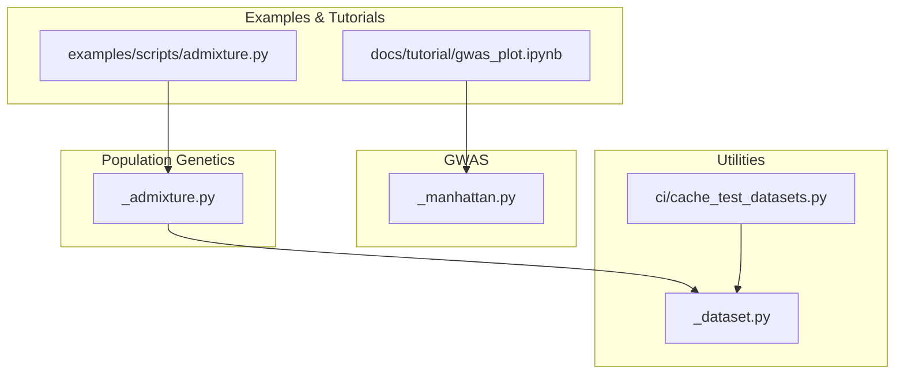
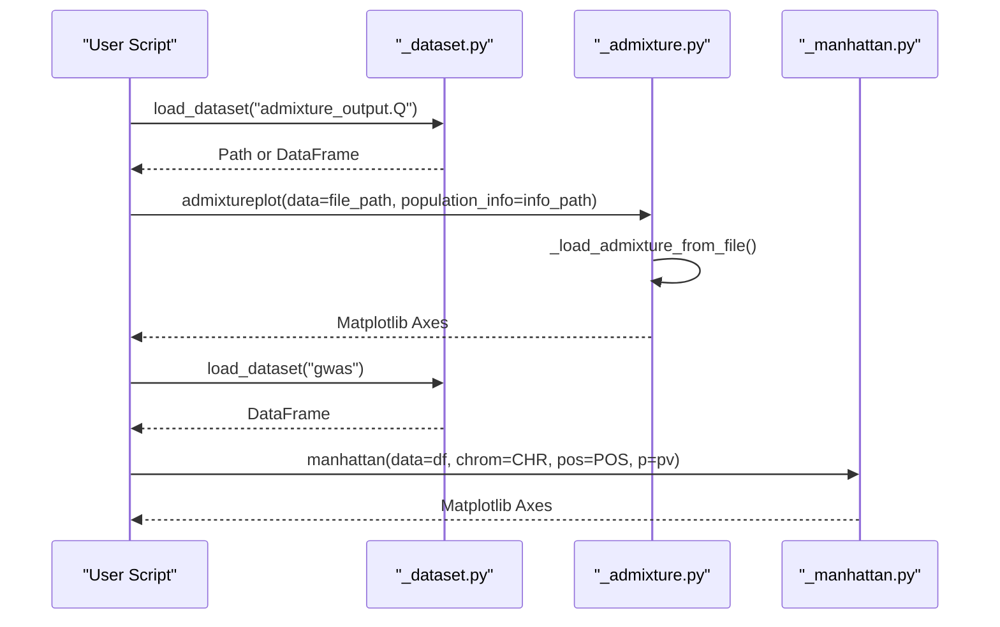
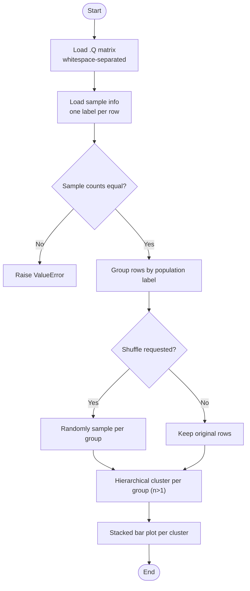
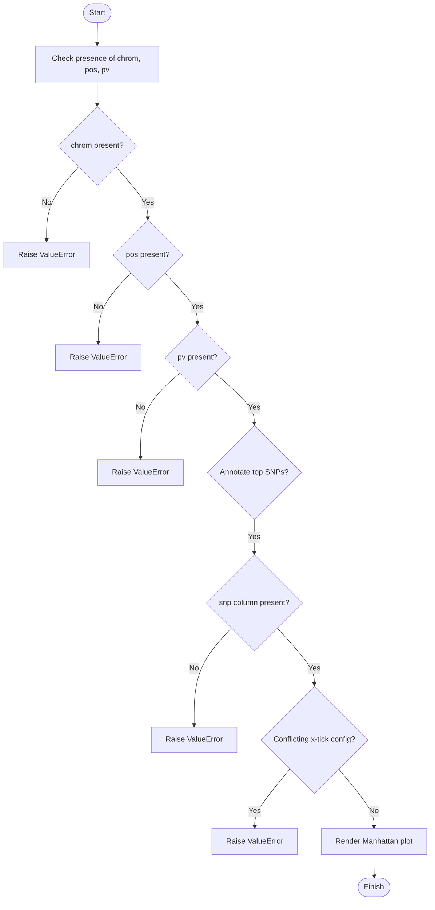
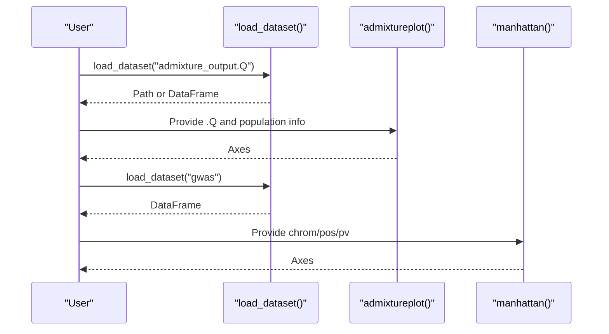
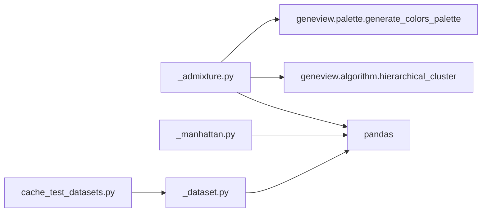

# Genomic Data Formats

<cite>
**Referenced Files in This Document**
- [_admixture.py](file://geneview/popgene/_admixture.py)
- [admixture.py](file://examples/scripts/admixture.py)
- [gwas_plot.ipynb](file://docs/tutorial/gwas_plot.ipynb)
- [_manhattan.py](file://geneview/gwas/_manhattan.py)
- [_dataset.py](file://geneview/utils/_dataset.py)
- [cache_test_datasets.py](file://ci/cache_test_datasets.py)
</cite>

## Table of Contents
1. [Introduction](#introduction)
2. [Project Structure](#project-structure)
3. [Core Components](#core-components)
4. [Architecture Overview](#architecture-overview)
5. [Detailed Component Analysis](#detailed-component-analysis)
6. [Dependency Analysis](#dependency-analysis)
7. [Performance Considerations](#performance-considerations)
8. [Troubleshooting Guide](#troubleshooting-guide)
9. [Conclusion](#conclusion)
10. [Appendices](#appendices)

## Introduction
This document explains the genomic data formats supported by GeneView and how the library processes and interprets them for visualization. It focuses on:
- .Q files used in ancestry/admixture analysis
- Variant association study formats used for GWAS plots
- Practical guidance for preparing datasets, handling missing data, and validating inputs

Where relevant, we map GeneView’s behavior to the actual code and notebooks in the repository to ensure accuracy.

## Project Structure
GeneView organizes format-specific functionality under domain-focused modules:
- Population genetics (admixture): geneview/popgene/_admixture.py
- GWAS plotting: geneview/gwas/_manhattan.py
- Example usage and tutorials: docs/tutorial/gwas_plot.ipynb and examples/scripts/admixture.py
- Dataset loading utilities: geneview/utils/_dataset.py
- CI caching of example datasets: ci/cache_test_datasets.py

**Diagram sources**
- [_admixture.py:168-364](file://geneview/popgene/_admixture.py#L168-L364)
- [_manhattan.py:213-221](file://geneview/gwas/_manhattan.py#L213-L221)
- [admixture.py:1-23](file://examples/scripts/admixture.py#L1-L23)
- [gwas_plot.ipynb:98-223](file://docs/tutorial/gwas_plot.ipynb#L98-L223)
- [_dataset.py:22-67](file://geneview/utils/_dataset.py#L22-L67)
- [cache_test_datasets.py:7-13](file://ci/cache_test_datasets.py#L7-L13)

**Section sources**
- [_admixture.py:1-364](file://geneview/popgene/_admixture.py#L1-L364)
- [_manhattan.py:213-221](file://geneview/gwas/_manhattan.py#L213-L221)
- [admixture.py:1-23](file://examples/scripts/admixture.py#L1-L23)
- [gwas_plot.ipynb:98-223](file://docs/tutorial/gwas_plot.ipynb#L98-L223)
- [_dataset.py:22-67](file://geneview/utils/_dataset.py#L22-L67)
- [cache_test_datasets.py:7-13](file://ci/cache_test_datasets.py#L7-L13)

## Core Components
- Admixture (.Q) processing and plotting:
  - Reads .Q matrix and associated sample group file
  - Groups samples by population, optionally shuffles samples per group, and renders a stacked bar plot
- GWAS plotting:
  - Validates required columns for chromosome, position, and p-values
  - Supports optional SNP annotation and custom x-tick configurations

**Section sources**
- [_admixture.py:137-165](file://geneview/popgene/_admixture.py#L137-L165)
- [_admixture.py:168-364](file://geneview/popgene/_admixture.py#L168-L364)
- [_manhattan.py:213-221](file://geneview/gwas/_manhattan.py#L213-L221)

## Architecture Overview
The following diagram maps how GeneView loads example datasets, prepares data, and renders plots for admixture and GWAS.

**Diagram sources**
- [_dataset.py:22-67](file://geneview/utils/_dataset.py#L22-L67)
- [_admixture.py:137-165](file://geneview/popgene/_admixture.py#L137-L165)
- [_admixture.py:168-364](file://geneview/popgene/_admixture.py#L168-L364)
- [_manhattan.py:213-221](file://geneview/gwas/_manhattan.py#L213-L221)

## Detailed Component Analysis

### Admixture (.Q) Format
- Structure:
  - .Q file: whitespace-separated matrix with rows as samples and columns as ancestral clusters (K)
  - Sample info file: one population label per row, aligned to the .Q rows
- Processing:
  - Loads .Q and sample info via whitespace parsing
  - Groups rows by population label and optionally subsamples per group
  - Performs hierarchical clustering per group (when multiple samples exist)
  - Renders a stacked bar plot with one color per cluster (column)
- Quality metrics and interpretation:
  - Each cell in .Q represents the estimated proportion of ancestry for a given sample and cluster
  - Values are proportions summing to 1.0 per sample
- Practical guidance:
  - Ensure the number of rows in the .Q file equals the number of rows in the sample info file
  - Use group_order to control panel ordering and x-axis labels
  - Use shuffle_popsample_kws to randomly sample a subset per group for visualization clarity

**Diagram sources**
- [_admixture.py:137-165](file://geneview/popgene/_admixture.py#L137-L165)
- [_admixture.py:168-364](file://geneview/popgene/_admixture.py#L168-L364)

**Section sources**
- [_admixture.py:137-165](file://geneview/popgene/_admixture.py#L137-L165)
- [_admixture.py:168-364](file://geneview/popgene/_admixture.py#L168-L364)
- [admixture.py:1-23](file://examples/scripts/admixture.py#L1-L23)

### GWAS Format and Columns
- Required columns for Manhattan plots:
  - Chromosome (chrom)
  - Base-pair position (pos)
  - P-value (pv)
- Optional features:
  - Annotating top SNPs (requires SNP identifier column)
  - Custom x-tick labels and chromosome labels
- Validation:
  - Raises explicit errors if required columns are missing
  - Prevents simultaneous conflicting configurations for chromosome and x-tick labels

**Diagram sources**
- [_manhattan.py:213-221](file://geneview/gwas/_manhattan.py#L213-L221)

**Section sources**
- [_manhattan.py:213-221](file://geneview/gwas/_manhattan.py#L213-L221)
- [gwas_plot.ipynb:98-223](file://docs/tutorial/gwas_plot.ipynb#L98-L223)

### Dataset Loading and Example Workflows
- Dataset loading:
  - load_dataset returns either a DataFrame (CSV) or a file path (non-CSV)
  - Caching enabled by default to local directory
- Example workflows:
  - Admixture plotting uses example .Q and population info files
  - GWAS plotting uses a CSV-backed example dataset

**Diagram sources**
- [_dataset.py:22-67](file://geneview/utils/_dataset.py#L22-L67)
- [cache_test_datasets.py:7-13](file://ci/cache_test_datasets.py#L7-L13)
- [_admixture.py:168-364](file://geneview/popgene/_admixture.py#L168-L364)
- [_manhattan.py:213-221](file://geneview/gwas/_manhattan.py#L213-L221)

**Section sources**
- [_dataset.py:22-67](file://geneview/utils/_dataset.py#L22-L67)
- [cache_test_datasets.py:7-13](file://ci/cache_test_datasets.py#L7-L13)
- [admixture.py:1-23](file://examples/scripts/admixture.py#L1-L23)
- [gwas_plot.ipynb:98-223](file://docs/tutorial/gwas_plot.ipynb#L98-L223)

## Dependency Analysis
- Admixture plotting depends on:
  - pandas for data loading and manipulation
  - hierarchical clustering from geneview.algorithm
  - color palette generation from geneview.palette
- GWAS plotting depends on:
  - pandas for data validation and plotting
- Utilities:
  - load_dataset centralizes remote dataset retrieval and local caching

**Diagram sources**
- [_admixture.py:1-15](file://geneview/popgene/_admixture.py#L1-L15)
- [_manhattan.py:213-221](file://geneview/gwas/_manhattan.py#L213-L221)
- [_dataset.py:22-67](file://geneview/utils/_dataset.py#L22-L67)
- [cache_test_datasets.py:7-13](file://ci/cache_test_datasets.py#L7-L13)

**Section sources**
- [_admixture.py:1-15](file://geneview/popgene/_admixture.py#L1-L15)
- [_manhattan.py:213-221](file://geneview/gwas/_manhattan.py#L213-L221)
- [_dataset.py:22-67](file://geneview/utils/_dataset.py#L22-L67)
- [cache_test_datasets.py:7-13](file://ci/cache_test_datasets.py#L7-L13)

## Performance Considerations
- Admixture plotting:
  - Hierarchical clustering is applied per group when multiple samples exist; consider subsampling large groups to reduce computation
  - Stacked bar rendering is linear in the number of samples and clusters
- GWAS plotting:
  - Large-scale Manhattan plots benefit from pre-filtering datasets to regions of interest
  - Avoid unnecessary intermediate copies by passing validated column names directly

[No sources needed since this section provides general guidance]

## Troubleshooting Guide
Common issues and resolutions:
- Missing required columns for Manhattan plots:
  - Ensure chrom, pos, and pv columns exist; the validator raises explicit errors if any are missing
- Conflicting x-tick configurations:
  - CHR and xtick_label_set cannot be set simultaneously; adjust one or the other
- Admixture data mismatches:
  - The number of rows in the .Q file must equal the number of rows in the sample info file; otherwise a ValueError is raised
- Sampling axis in admixture:
  - Sampling by columns (axis=1) is discouraged and flagged with a warning
- Dataset loading:
  - If a dataset is cached locally, subsequent calls reuse the cached file; ensure permissions and disk space are sufficient

**Section sources**
- [_manhattan.py:213-221](file://geneview/gwas/_manhattan.py#L213-L221)
- [_admixture.py:137-165](file://geneview/popgene/_admixture.py#L137-L165)
- [_admixture.py:137-140](file://geneview/popgene/_admixture.py#L137-L140)
- [_dataset.py:55-67](file://geneview/utils/_dataset.py#L55-L67)

## Conclusion
GeneView supports key population genetics and GWAS visualization formats through focused modules:
- Admixture (.Q) files are parsed, grouped by population, optionally subsampled, clustered, and plotted as stacked bars
- GWAS Manhattan plots require validated columns for chromosome, position, and p-values, with robust error handling for invalid configurations
- Example notebooks and scripts demonstrate end-to-end workflows, while utilities streamline dataset retrieval and caching

[No sources needed since this section summarizes without analyzing specific files]

## Appendices

### Practical Guidance: Preparing Datasets
- Admixture (.Q):
  - Ensure whitespace-separated .Q matrix and a corresponding sample info file with one label per row
  - Optionally subsample per group to improve visualization clarity
- GWAS:
  - Prepare a table with columns for chromosome, position, and p-values
  - Optionally include SNP identifiers for top-SNP annotation

**Section sources**
- [_admixture.py:137-165](file://geneview/popgene/_admixture.py#L137-L165)
- [_manhattan.py:213-221](file://geneview/gwas/_manhattan.py#L213-L221)
- [gwas_plot.ipynb:98-223](file://docs/tutorial/gwas_plot.ipynb#L98-L223)