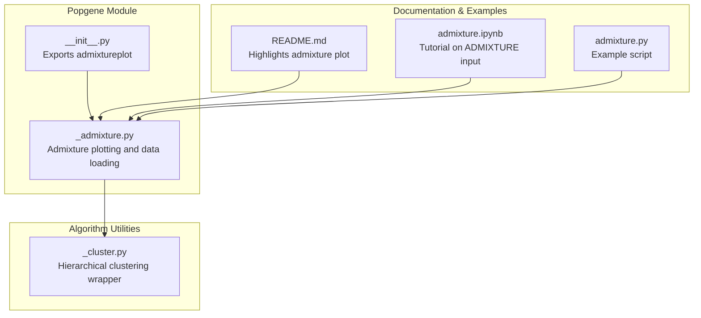
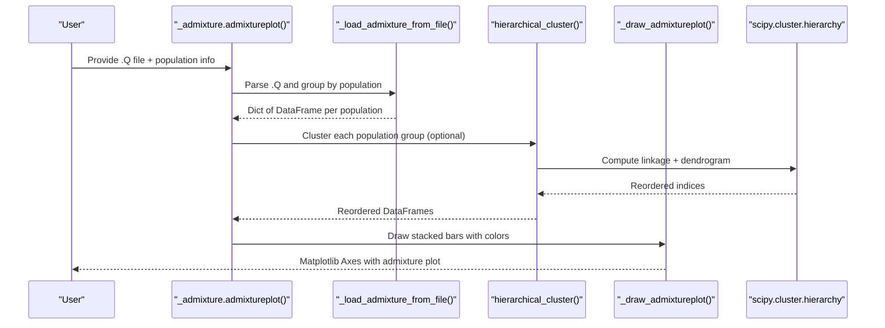
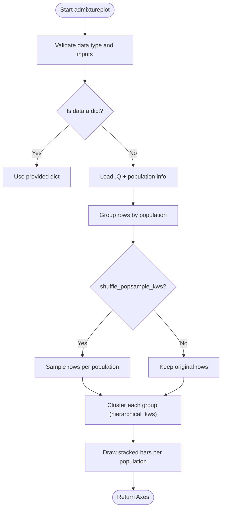
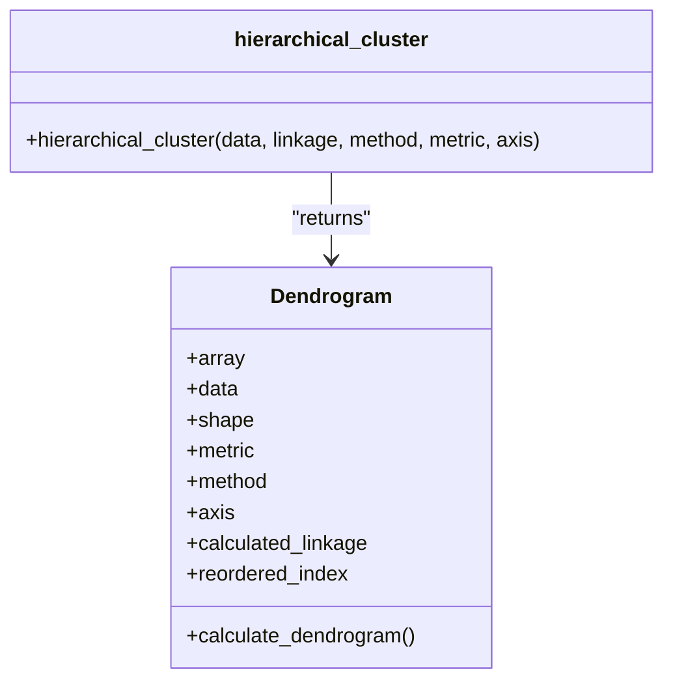
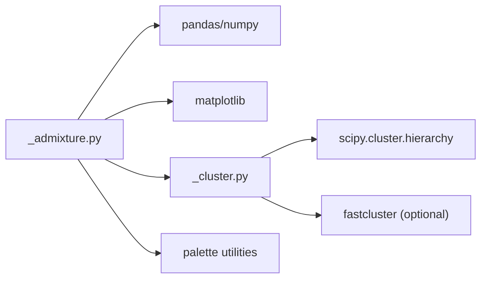

# Population Genetics Principles

<cite>
**Referenced Files in This Document**
- [_admixture.py](file://geneview/popgene/_admixture.py)
- [__init__.py](file://geneview/popgene/__init__.py)
- [_cluster.py](file://geneview/algorithm/_cluster.py)
- [README.md](file://README.md)
- [admixture.ipynb](file://docs/tutorial/admixture.ipynb)
- [admixture.py](file://examples/scripts/admixture.py)
</cite>

## Table of Contents
1. [Introduction](#introduction)
2. [Project Structure](#project-structure)
3. [Core Components](#core-components)
4. [Architecture Overview](#architecture-overview)
5. [Detailed Component Analysis](#detailed-component-analysis)
6. [Dependency Analysis](#dependency-analysis)
7. [Performance Considerations](#performance-considerations)
8. [Troubleshooting Guide](#troubleshooting-guide)
9. [Conclusion](#conclusion)
10. [Appendices](#appendices)

## Introduction
This document explains population genetics concepts essential for interpreting GeneView’s population analysis tools, focusing on admixture visualization and the underlying computational foundations. It connects biological concepts—such as Hardy–Weinberg equilibrium, allele frequencies, genetic diversity, and population structure—with the practical workflows implemented in GeneView’s admixture plotting pipeline. The goal is to help users interpret population structure plots produced by GeneView and understand how the code organizes and clusters admixture data to reveal ancestry patterns.

## Project Structure
GeneView organizes population genetics functionality primarily under the popgene module, with supporting clustering utilities in algorithm and visualization helpers in palette. The admixture plotting workflow integrates file loading, hierarchical clustering, and plotting routines.

**Diagram sources**
- [_admixture.py:1-364](file://geneview/popgene/_admixture.py#L1-L364)
- [__init__.py:1-2](file://geneview/popgene/__init__.py#L1-L2)
- [_cluster.py:1-147](file://geneview/algorithm/_cluster.py#L1-L147)
- [README.md:242-286](file://README.md#L242-L286)
- [admixture.ipynb:1-436](file://docs/tutorial/admixture.ipynb#L1-L436)
- [admixture.py:1-28](file://examples/scripts/admixture.py#L1-L28)

**Section sources**
- [README.md:12-21](file://README.md#L12-L21)
- [README.md:242-286](file://README.md#L242-L286)

## Core Components
- Admixture plotting: Converts ADMIXTURE .Q output into stacked ancestry bars, with optional hierarchical clustering and sampling controls.
- Hierarchical clustering: Wraps scipy/fastcluster linkage and dendrogram computation to reorder samples by similarity.
- Tutorial and examples: Provide input formats and usage patterns for admixture visualization.

Key implementation references:
- Admixture plotting function and internal drawing routine
- Hierarchical clustering wrapper and dendrogram calculation
- Example script and tutorial notebook demonstrating input formats

**Section sources**
- [_admixture.py:168-364](file://geneview/popgene/_admixture.py#L168-L364)
- [_admixture.py:17-134](file://geneview/popgene/_admixture.py#L17-L134)
- [_cluster.py:114-147](file://geneview/algorithm/_cluster.py#L114-L147)
- [admixture.ipynb:1-436](file://docs/tutorial/admixture.ipynb#L1-L436)
- [admixture.py:1-28](file://examples/scripts/admixture.py#L1-L28)

## Architecture Overview
The admixture plotting pipeline orchestrates data ingestion, optional subsampling, hierarchical clustering, and visualization.

**Diagram sources**
- [_admixture.py:137-165](file://geneview/popgene/_admixture.py#L137-L165)
- [_admixture.py:168-364](file://geneview/popgene/_admixture.py#L168-L364)
- [_admixture.py:17-134](file://geneview/popgene/_admixture.py#L17-L134)
- [_cluster.py:114-147](file://geneview/algorithm/_cluster.py#L114-L147)
- [_cluster.py:100-111](file://geneview/algorithm/_cluster.py#L100-L111)

## Detailed Component Analysis

### Admixture Plotting Workflow
The admixture plotting function accepts either a file path to ADMIXTURE .Q output or a prebuilt dictionary keyed by population. It validates inputs, optionally subsamples within each population, groups samples by population, and applies hierarchical clustering to reorder samples within each group. Finally, it renders stacked ancestry bars with a configurable color palette.

**Diagram sources**
- [_admixture.py:168-364](file://geneview/popgene/_admixture.py#L168-L364)
- [_admixture.py:137-165](file://geneview/popgene/_admixture.py#L137-L165)
- [_admixture.py:17-134](file://geneview/popgene/_admixture.py#L17-L134)

**Section sources**
- [_admixture.py:168-364](file://geneview/popgene/_admixture.py#L168-L364)
- [_admixture.py:137-165](file://geneview/popgene/_admixture.py#L137-L165)
- [_admixture.py:17-134](file://geneview/popgene/_admixture.py#L17-L134)

### Hierarchical Clustering Utility
The clustering utility computes linkage and a dendrogram, returning reordered indices suitable for reordering rows or columns of a matrix. It supports multiple linkage methods and metrics, with automatic fallback between scipy and fastcluster when available.

**Diagram sources**
- [_cluster.py:19-111](file://geneview/algorithm/_cluster.py#L19-L111)
- [_cluster.py:114-147](file://geneview/algorithm/_cluster.py#L114-L147)

**Section sources**
- [_cluster.py:19-111](file://geneview/algorithm/_cluster.py#L19-L111)
- [_cluster.py:114-147](file://geneview/algorithm/_cluster.py#L114-L147)

### Tutorial and Example Inputs
The tutorial notebook and example script demonstrate:
- ADMIXTURE .Q format (space-separated matrix of ancestry coefficients)
- Population group file (one group label per row)
- Optional grouping order and subsampling parameters

These inputs align with the internal loader and plotting logic.

**Section sources**
- [admixture.ipynb:1-436](file://docs/tutorial/admixture.ipynb#L1-L436)
- [admixture.py:1-28](file://examples/scripts/admixture.py#L1-L28)

## Dependency Analysis
The admixture plotting module depends on:
- pandas/numpy for data handling
- matplotlib for rendering
- scipy (and optionally fastcluster) for hierarchical clustering
- GeneView’s palette utilities for color generation

**Diagram sources**
- [_admixture.py:6-14](file://geneview/popgene/_admixture.py#L6-L14)
- [_cluster.py:10-14](file://geneview/algorithm/_cluster.py#L10-L14)

**Section sources**
- [_admixture.py:6-14](file://geneview/popgene/_admixture.py#L6-L14)
- [_cluster.py:10-14](file://geneview/algorithm/_cluster.py#L10-L14)

## Performance Considerations
- Hierarchical clustering scales with the square of the number of samples; large datasets may benefit from subsampling or specialized libraries.
- Stacked bar rendering is linear in the number of samples and ancestry components; very large plots may require adjusting figure size or palette.
- Reordering by dendrogram adds overhead proportional to the number of clusters; consider disabling clustering for very large datasets.

[No sources needed since this section provides general guidance]

## Troubleshooting Guide
Common issues and resolutions:
- Mismatch between .Q rows and population info length: ensure equal lengths and consistent ordering.
- Unexpected subsampling behavior: verify axis and fraction parameters; axis=1 is disallowed for admixture data.
- Palette fewer colors than ancestry components: increase palette diversity to avoid reuse.
- Clustering failures: ensure scipy is installed; consider fastcluster for large matrices.

**Section sources**
- [_admixture.py:146-148](file://geneview/popgene/_admixture.py#L146-L148)
- [_admixture.py:138-140](file://geneview/popgene/_admixture.py#L138-L140)
- [_admixture.py:70-74](file://geneview/popgene/_admixture.py#L70-L74)
- [_cluster.py:142-147](file://geneview/algorithm/_cluster.py#L142-L147)

## Conclusion
GeneView’s admixture plotting pipeline transforms ADMIXTURE output into interpretable ancestry visualizations. By grouping samples by population, optionally subsampling, and applying hierarchical clustering to reorder samples, it reveals fine-scale population structure. Understanding the biological meaning of ancestry coefficients and the computational steps behind the plot enables accurate interpretation of population structure analyses.

[No sources needed since this section summarizes without analyzing specific files]

## Appendices

### A. Biological Interpretation of Admixture Coefficients
- Each row in the .Q matrix represents an individual’s estimated ancestry proportions across K ancestral populations.
- Column sums equal 1 for each row, reflecting probabilistic assignment.
- High uncertainty occurs when coefficients are distributed across multiple columns; low uncertainty occurs when most mass is concentrated on one or two columns.

[No sources needed since this section provides general guidance]

### B. Practical Tips for Using GeneView Admixture Plots
- Use group_order to enforce meaningful population ordering.
- Apply subsampling via shuffle_popsample_kws to manage large datasets.
- Choose a distinct palette to differentiate ancestral components.
- Enable hierarchical clustering to reveal cryptic relatedness within populations.

**Section sources**
- [_admixture.py:168-364](file://geneview/popgene/_admixture.py#L168-L364)
- [admixture.ipynb:1-436](file://docs/tutorial/admixture.ipynb#L1-L436)
- [admixture.py:1-28](file://examples/scripts/admixture.py#L1-L28)