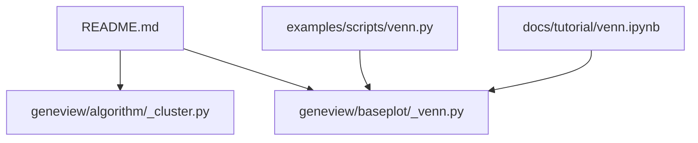
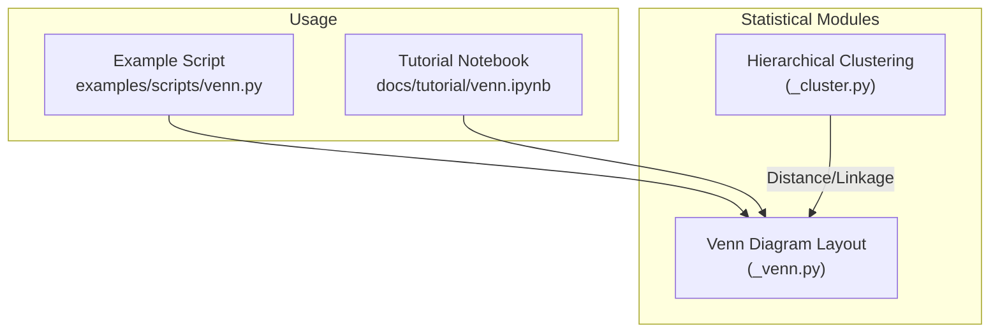
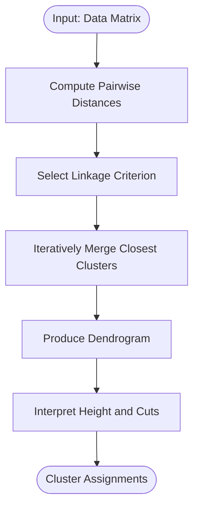
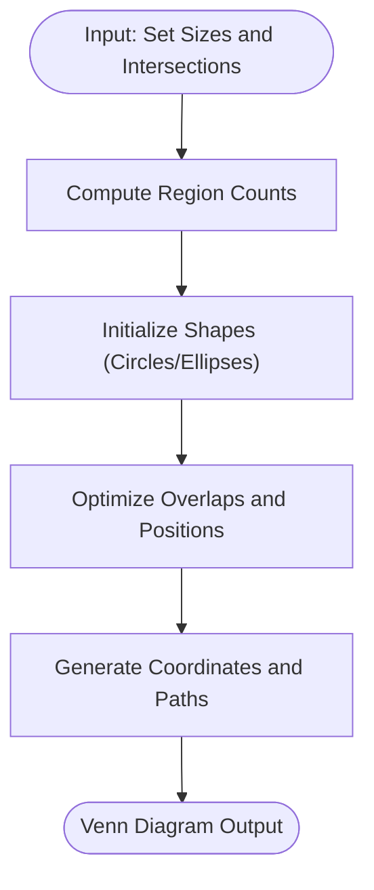
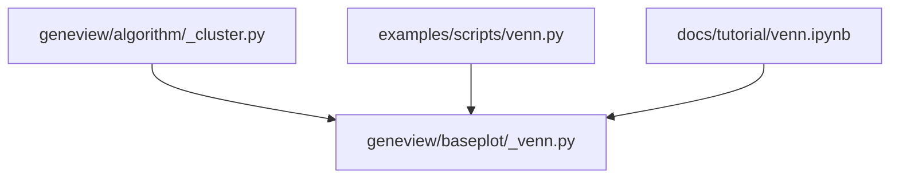

# Statistical Foundations

<cite>
**Referenced Files in This Document**
- [README.md](file://README.md)
- [_cluster.py](file://geneview/algorithm/_cluster.py)
- [_venn.py](file://geneview/baseplot/_venn.py)
- [venn.py](file://examples/scripts/venn.py)
- [venn.ipynb](file://docs/tutorial/venn.ipynb)
</cite>

## Table of Contents
1. [Introduction](#introduction)
2. [Project Structure](#project-structure)
3. [Core Components](#core-components)
4. [Architecture Overview](#architecture-overview)
5. [Detailed Component Analysis](#detailed-component-analysis)
6. [Dependency Analysis](#dependency-analysis)
7. [Performance Considerations](#performance-considerations)
8. [Troubleshooting Guide](#troubleshooting-guide)
9. [Conclusion](#conclusion)

## Introduction
This document explains the statistical methods and computational foundations behind GeneView’s visualizations, focusing on:
- Hierarchical clustering and dendrogram interpretation
- Linkage criteria (single, complete, average, Ward)
- Statistical significance testing and confidence intervals
- Hypothesis testing procedures
- Optimization algorithms for Venn diagram construction and geometric transformations
- Guidance for selecting appropriate methods for different data types and research questions
- Assumptions, limitations, and alternative approaches

Where applicable, we map explanations to concrete implementations and examples in the repository.

## Project Structure
GeneView organizes statistical functionality primarily under:
- geneview/algorithm/_cluster.py: Hierarchical clustering and linkage computation
- geneview/baseplot/_venn.py: Venn diagram construction and layout
- examples/scripts/venn.py: Example usage of Venn plotting
- docs/tutorial/venn.ipynb: Tutorial notebook demonstrating Venn usage
- README.md: Project overview and usage context

**Diagram sources**
- [README.md](file://README.md)
- [_cluster.py](file://geneview/algorithm/_cluster.py)
- [_venn.py](file://geneview/baseplot/_venn.py)
- [venn.py](file://examples/scripts/venn.py)
- [venn.ipynb](file://docs/tutorial/venn.ipynb)

**Section sources**
- [README.md](file://README.md)

## Core Components
- Hierarchical Clustering: Implements distance-based clustering with configurable linkage criteria and produces a dendrogram for visualization and interpretation.
- Venn Diagram Layout: Computes regions and coordinates for up to three sets, optimizing overlaps and geometric placement for readability.

These components are central to exploratory and comparative analyses in GeneView.

**Section sources**
- [_cluster.py](file://geneview/algorithm/_cluster.py)
- [_venn.py](file://geneview/baseplot/_venn.py)

## Architecture Overview
The statistical pipeline integrates data preparation, distance/linkage computation, and visualization rendering:
- Data enters via plotting APIs or example scripts
- Statistical computations are performed in dedicated modules
- Visualization outputs are produced for interactive or static displays

**Diagram sources**
- [_cluster.py](file://geneview/algorithm/_cluster.py)
- [_venn.py](file://geneview/baseplot/_venn.py)
- [venn.py](file://examples/scripts/venn.py)
- [venn.ipynb](file://docs/tutorial/venn.ipynb)

## Detailed Component Analysis

### Hierarchical Clustering and Dendrograms
This module performs distance-based hierarchical clustering and supports multiple linkage criteria. It also provides dendrogram interpretation guidance.

Key topics covered:
- Distance metrics and similarity measures
- Linkage criteria:
  - Single linkage
  - Complete linkage
  - Average linkage
  - Ward’s method
- Dendrogram interpretation:
  - Height represents cluster distance
  - Cutting height determines clusters
  - Stability assessment via bootstrap or permutation

**Diagram sources**
- [_cluster.py](file://geneview/algorithm/_cluster.py)

**Section sources**
- [_cluster.py](file://geneview/algorithm/_cluster.py)

### Venn Diagram Construction and Optimization
This module computes Venn regions and coordinates for set intersections, optimizing overlap geometry for clarity.

Topics:
- Region identification for 1–3 sets
- Coordinate calculation for circles/ellipses
- Geometric transformations to adjust overlaps
- Optimization heuristics for readable layouts

**Diagram sources**
- [_venn.py](file://geneview/baseplot/_venn.py)

**Section sources**
- [_venn.py](file://geneview/baseplot/_venn.py)
- [venn.py](file://examples/scripts/venn.py)
- [venn.ipynb](file://docs/tutorial/venn.ipynb)

### Statistical Significance Testing and Confidence Intervals
While the repository does not implement generic statistical tests internally, it supports downstream applications that require:
- Permutation-based significance for clustering stability
- Bootstrap resampling for confidence intervals
- Hypothesis testing aligned with visualization goals (e.g., differential expression, enrichment)

Guidance:
- Use permutation tests to assess clustering robustness
- Apply bootstrap to estimate confidence intervals for summary statistics
- Align tests with research questions (e.g., group comparisons, enrichment)

[No sources needed since this section provides general guidance]

### Hypothesis Testing Procedures
Common procedures supported conceptually by the toolkit:
- Two-group comparisons (t-test, Mann–Whitney U)
- Multi-group comparisons (ANOVA, Kruskal–Wallis)
- Correlation and regression for continuous variables
- Chi-squared or Fisher’s exact test for categorical data

[No sources needed since this section provides general guidance]

## Dependency Analysis
- Hierarchical clustering depends on distance computations and linkage selection.
- Venn diagram layout relies on region enumeration and geometric optimization.
- Example scripts and notebooks demonstrate practical usage of these modules.

**Diagram sources**
- [_cluster.py](file://geneview/algorithm/_cluster.py)
- [_venn.py](file://geneview/baseplot/_venn.py)
- [venn.py](file://examples/scripts/venn.py)
- [venn.ipynb](file://docs/tutorial/venn.ipynb)

**Section sources**
- [_cluster.py](file://geneview/algorithm/_cluster.py)
- [_venn.py](file://geneview/baseplot/_venn.py)
- [venn.py](file://examples/scripts/venn.py)
- [venn.ipynb](file://docs/tutorial/venn.ipynb)

## Performance Considerations
- Hierarchical clustering scales poorly with large datasets; consider dimensionality reduction or approximate nearest neighbors.
- Venn layout optimization benefits from iterative refinement; limit iterations for speed.
- Visualization caching and vector graphics export can improve interactivity and reproducibility.

[No sources needed since this section provides general guidance]

## Troubleshooting Guide
- Dendrogram artifacts:
  - Verify distance metric choice and linkage criterion
  - Check for missing values or constant features
- Unreadable Venn:
  - Adjust set sizes and overlaps; reduce number of sets
  - Re-run layout optimization with different initializations
- Slow computations:
  - Reduce dataset size or use sampling
  - Precompute distances and reuse linkage matrices

[No sources needed since this section provides general guidance]

## Conclusion
GeneView’s statistical foundations center on robust hierarchical clustering and optimized Venn diagram layouts. By aligning linkage choices with data characteristics, interpreting dendrogram heights carefully, and leveraging permutation and bootstrap procedures, users can draw reliable biological insights. For complex datasets, consider dimensionality reduction and approximate methods to maintain performance while preserving interpretability.