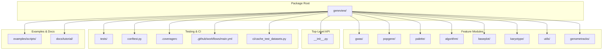
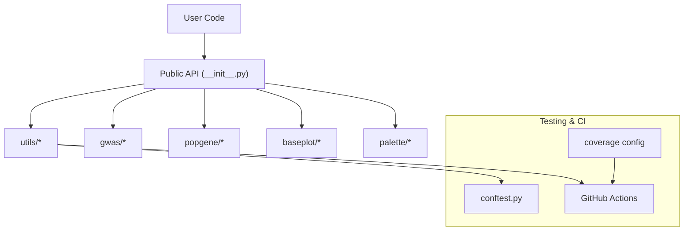
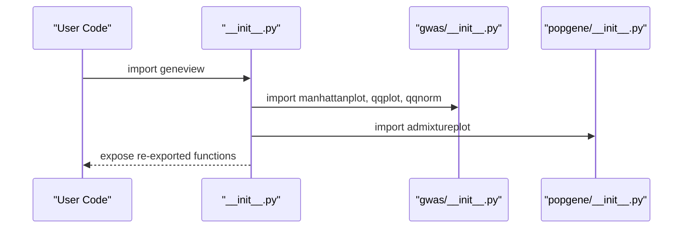
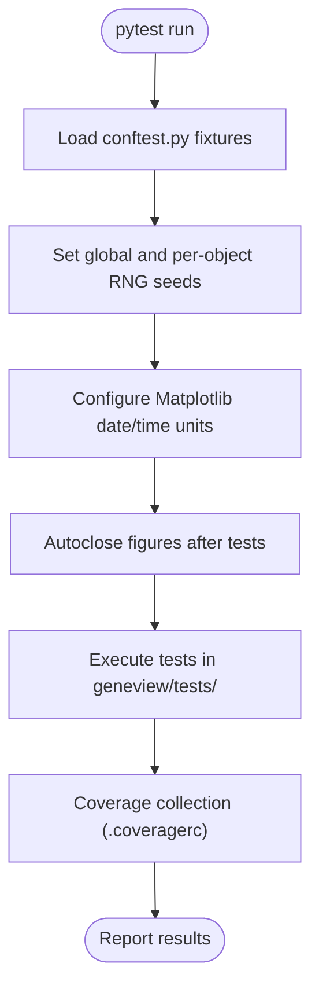
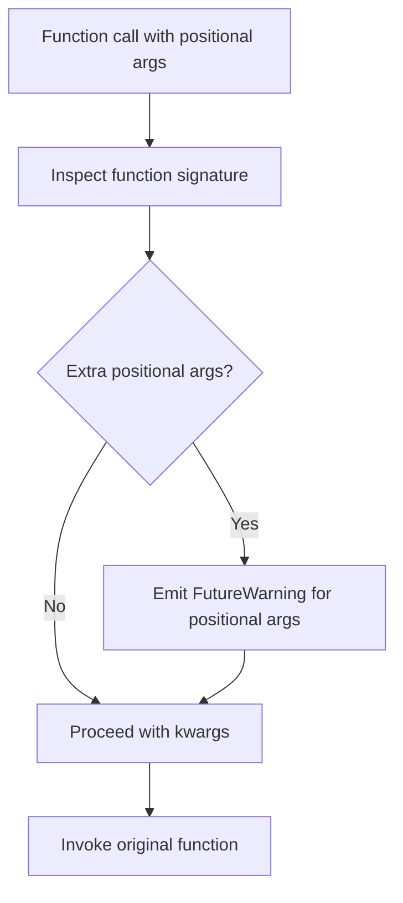
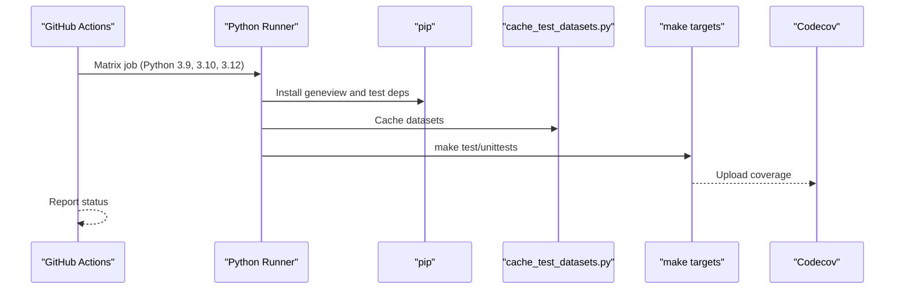
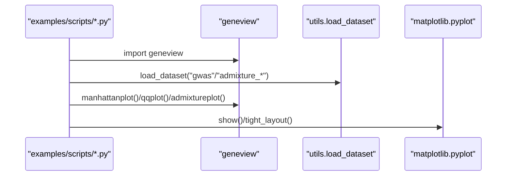
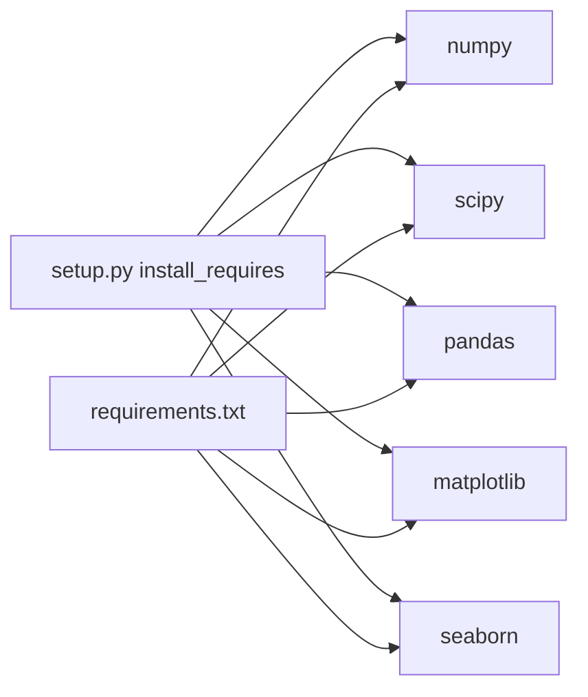
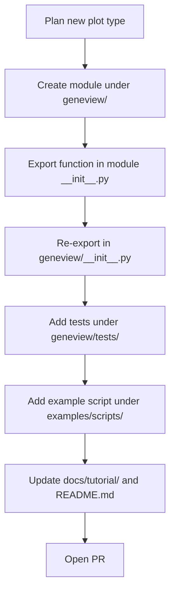

# Development and Contributing

<cite>
**Referenced Files in This Document**
- [README.md](file://README.md)
- [setup.py](file://setup.py)
- [requirements.txt](file://requirements.txt)
- [Makefile](file://Makefile)
- [.github/workflows/main.yml](file://.github/workflows/main.yml)
- [.coveragerc](file://.coveragerc)
- [ci/cache_test_datasets.py](file://ci/cache_test_datasets.py)
- [docs/tutorial/README.md](file://docs/tutorial/README.md)
- [geneview/__init__.py](file://geneview/__init__.py)
- [geneview/conftest.py](file://geneview/conftest.py)
- [geneview/tests/test_decorators.py](file://geneview/tests/test_decorators.py)
- [geneview/utils/_decorators.py](file://geneview/utils/_decorators.py)
- [geneview/gwas/__init__.py](file://geneview/gwas/__init__.py)
- [geneview/popgene/__init__.py](file://geneview/popgene/__init__.py)
- [examples/scripts/manhattan.py](file://examples/scripts/manhattan.py)
- [examples/scripts/qq.py](file://examples/scripts/qq.py)
- [examples/scripts/admixture.py](file://examples/scripts/admixture.py)
</cite>

## Update Summary
**Changes Made**
- Updated CI workflow configuration section to reflect Python version matrix changes from 3.7, 3.8, 3.9, 3.10 to 3.9, 3.10, 3.12
- Updated development environment setup section to reflect current Python version support
- Updated continuous integration section to reflect new Python version matrix
- Updated dependency analysis section to reflect current Python version classifiers

## Table of Contents
1. [Introduction](#introduction)
2. [Project Structure](#project-structure)
3. [Core Components](#core-components)
4. [Architecture Overview](#architecture-overview)
5. [Detailed Component Analysis](#detailed-component-analysis)
6. [Dependency Analysis](#dependency-analysis)
7. [Performance Considerations](#performance-considerations)
8. [Troubleshooting Guide](#troubleshooting-guide)
9. [Contribution Guidelines](#contribution-guidelines)
10. [Conclusion](#contribution-guidelines)
11. [Appendices](#appendices)

## Introduction
This document provides comprehensive development and contribution guidelines for GeneView, a Python package for genomics data visualization. It explains the modular architecture, development environment setup, testing procedures using pytest, continuous integration workflows, and community contribution processes. It also covers code style expectations, testing strategies, documentation standards, pull request processes, extending functionality, adding new plot types, maintaining backward compatibility, issue reporting, feature requests, and community engagement.

## Project Structure
GeneView follows a feature-based package layout with clearly separated modules for different visualization domains. The repository includes:
- Core package: geneview/
- Tests: geneview/tests/
- Conftest fixtures: geneview/conftest.py
- Continuous integration: .github/workflows/main.yml
- Example scripts: examples/scripts/
- Tutorial notebooks: docs/tutorial/
- CI dataset caching: ci/cache_test_datasets.py
- Build and packaging: setup.py, requirements.txt, Makefile
- Coverage configuration: .coveragerc

**Diagram sources**
- [geneview/__init__.py:1-17](file://geneview/__init__.py#L1-L17)
- [.github/workflows/main.yml:1-63](file://.github/workflows/main.yml#L1-L63)
- [ci/cache_test_datasets.py:1-15](file://ci/cache_test_datasets.py#L1-L15)

**Section sources**
- [README.md:1-482](file://README.md#L1-L482)
- [geneview/__init__.py:1-17](file://geneview/__init__.py#L1-L17)
- [.github/workflows/main.yml:1-63](file://.github/workflows/main.yml#L1-L63)

## Core Components
- Public API surface is exposed via the package's top-level __init__.py, re-exporting key plotting functions and utilities.
- Feature modules encapsulate domain-specific plotting logic:
  - gwas: Manhattan and Q-Q plots
  - popgene: Admixture plots
  - baseplot: Venn diagrams and related utilities
  - palette: Color palettes and helpers
  - utils: Shared utilities, decorators, and dataset loading
  - algorithm: Clustering and other algorithms
  - karyotype: Karyotype plotting
  - genometracks: Documentation and initialization
- Testing fixtures and configurations live under geneview/conftest.py and geneview/tests/, with pytest-driven workflows.

Key responsibilities:
- Expose high-level plotting functions for GWAS, population genetics, and Venn diagrams.
- Provide reusable utilities and decorators for robust argument handling and compatibility.
- Maintain a clean separation of concerns across modules to support extensibility.

**Section sources**
- [geneview/__init__.py:1-17](file://geneview/__init__.py#L1-L17)
- [geneview/gwas/__init__.py:1-3](file://geneview/gwas/__init__.py#L1-L3)
- [geneview/popgene/__init__.py:1-2](file://geneview/popgene/__init__.py#L1-L2)
- [geneview/conftest.py:1-217](file://geneview/conftest.py#L1-L217)

## Architecture Overview
The package architecture emphasizes modularity and layered responsibilities:
- Layer 1: Public API (top-level __init__.py) exposes functions for users.
- Layer 2: Feature modules (gwas, popgene, baseplot, palette, utils) implement domain-specific logic.
- Layer 3: Utilities and shared infrastructure (decorators, dataset loading) support all modules.
- Layer 4: Testing and CI orchestrate quality checks and coverage.

**Diagram sources**
- [geneview/__init__.py:1-17](file://geneview/__init__.py#L1-L17)
- [geneview/conftest.py:1-217](file://geneview/conftest.py#L1-L217)
- [.github/workflows/main.yml:1-63](file://.github/workflows/main.yml#L1-L63)
- [.coveragerc:1-5](file://.coveragerc#L1-L5)

## Detailed Component Analysis

### Public API and Package Initialization
The package initializer aggregates and re-exports public functions, ensuring a concise user-facing interface. It also sets default Matplotlib rendering parameters for consistent output.

**Diagram sources**
- [geneview/__init__.py:1-17](file://geneview/__init__.py#L1-L17)
- [geneview/gwas/__init__.py:1-3](file://geneview/gwas/__init__.py#L1-L3)
- [geneview/popgene/__init__.py:1-2](file://geneview/popgene/__init__.py#L1-L2)

**Section sources**
- [geneview/__init__.py:1-17](file://geneview/__init__.py#L1-L17)

### Testing Infrastructure and Fixtures
The testing suite leverages pytest with a comprehensive set of fixtures defined in conftest.py. These fixtures standardize RNG seeds, manage Matplotlib units, and provide reusable data structures for tests. Coverage is configured to exclude test configuration files.

**Diagram sources**
- [geneview/conftest.py:33-61](file://geneview/conftest.py#L33-L61)
- [.coveragerc:1-5](file://.coveragerc#L1-L5)

**Section sources**
- [geneview/conftest.py:1-217](file://geneview/conftest.py#L1-L217)
- [.coveragerc:1-5](file://.coveragerc#L1-L5)

### Decorators and Backward Compatibility
The deprecate_positional_args decorator enforces keyword-only arguments for selected functions, guiding users toward future-proof APIs and reducing ambiguity. Tests validate warning behavior for both functions and classes.

**Diagram sources**
- [geneview/utils/_decorators.py:8-45](file://geneview/utils/_decorators.py#L8-L45)
- [geneview/tests/test_decorators.py:12-84](file://geneview/tests/test_decorators.py#L12-L84)

**Section sources**
- [geneview/utils/_decorators.py:1-60](file://geneview/utils/_decorators.py#L1-L60)
- [geneview/tests/test_decorators.py:1-85](file://geneview/tests/test_decorators.py#L1-L85)

### Continuous Integration Workflow
The CI pipeline runs on Ubuntu with multiple Python versions, installs the package and test dependencies, caches datasets, executes tests with configurable backends, and uploads coverage reports.

**Updated** The CI workflow now uses Python 3.9, 3.10, and 3.12 for testing instead of the previous 3.7, 3.8, 3.9, 3.10 matrix.

**Diagram sources**
- [.github/workflows/main.yml:1-63](file://.github/workflows/main.yml#L1-L63)
- [ci/cache_test_datasets.py:1-15](file://ci/cache_test_datasets.py#L1-L15)
- [Makefile:3-10](file://Makefile#L3-L10)

**Section sources**
- [.github/workflows/main.yml:1-63](file://.github/workflows/main.yml#L1-L63)
- [ci/cache_test_datasets.py:1-15](file://ci/cache_test_datasets.py#L1-L15)
- [Makefile:1-11](file://Makefile#L1-L11)

### Example Scripts and Usage Patterns
Example scripts demonstrate typical usage patterns for Manhattan, Q-Q, and Admixture plots, showcasing how to load datasets, configure axes, and render plots.

**Diagram sources**
- [examples/scripts/manhattan.py:1-14](file://examples/scripts/manhattan.py#L1-L14)
- [examples/scripts/qq.py:1-9](file://examples/scripts/qq.py#L1-L9)
- [examples/scripts/admixture.py:1-28](file://examples/scripts/admixture.py#L1-L28)

**Section sources**
- [examples/scripts/manhattan.py:1-14](file://examples/scripts/manhattan.py#L1-L14)
- [examples/scripts/qq.py:1-9](file://examples/scripts/qq.py#L1-L9)
- [examples/scripts/admixture.py:1-28](file://examples/scripts/admixture.py#L1-L28)

## Dependency Analysis
- Runtime dependencies are declared in setup.py and requirements.txt, including NumPy, SciPy, Pandas, Matplotlib, and Seaborn.
- The package supports Python 3.9+ and integrates with the PyData stack.
- CI installs optional test dependencies via ci/utils.txt and caches datasets to reduce flakiness.

**Updated** The package now declares support for Python 3.9, 3.10, and 3.12 in its classifiers, reflecting the current CI matrix.

**Diagram sources**
- [setup.py:44-49](file://setup.py#L44-L49)
- [setup.py:57-68](file://setup.py#L57-L68)
- [requirements.txt:1-6](file://requirements.txt#L1-L6)

**Section sources**
- [setup.py:1-70](file://setup.py#L1-L70)
- [requirements.txt:1-6](file://requirements.txt#L1-L6)

## Performance Considerations
- Prefer vectorized operations with NumPy and Pandas to minimize Python loops.
- Reuse axes and figure instances to reduce overhead in batch plotting.
- Use appropriate Matplotlib backends in CI (Agg) to avoid GUI-related issues.
- Cache datasets during CI to avoid network-induced variability.

## Troubleshooting Guide
Common issues and resolutions:
- Matplotlib unit conversion conflicts: The conftest fixture ensures proper date/time unit registries for compatibility.
- Randomness reproducibility: Global and per-object RNG seeds are set to ensure deterministic tests.
- Font availability: Tests include a helper to detect fonts; adjust rendering accordingly if fonts are missing.
- Backend headless rendering: CI uses Agg backend; local development can switch backends as needed.

**Section sources**
- [geneview/conftest.py:33-61](file://geneview/conftest.py#L33-L61)

## Contribution Guidelines

### Development Environment Setup
- Install Python 3.9+ and clone the repository.
- Install dependencies:
  - Core runtime: NumPy, SciPy, Pandas, Matplotlib, Seaborn
  - Development/testing: pytest, flake8, and optional Jupyter/IPyKernel for tutorials
- Set up a virtual environment and install the package in editable mode for iterative development.

**Updated** Development environment now requires Python 3.9+ to align with the current CI matrix and package classifiers.

**Section sources**
- [requirements.txt:1-6](file://requirements.txt#L1-L6)
- [setup.py:44-49](file://setup.py#L44-L49)
- [docs/tutorial/README.md:1-45](file://docs/tutorial/README.md#L1-L45)

### Running Tests Locally
- Use the provided Makefile targets:
  - make test: Runs doctests and unit tests with coverage
  - make unittests: Runs unit tests with coverage
  - make lint: Runs flake8 for style checks
- Ensure the MPLBACKEND environment variable is set appropriately for your platform.

**Section sources**
- [Makefile:1-11](file://Makefile#L1-L11)
- [.github/workflows/main.yml:11-14](file://.github/workflows/main.yml#L11-L14)

### Continuous Integration
- CI runs on Ubuntu with Python 3.9–3.12 matrices.
- Installs the package with extras and test dependencies, caches datasets, and uploads coverage.
- Jobs include both headless (Agg) and GUI-capable (TKAgg) variants for broader coverage.

**Updated** CI now uses Python 3.9, 3.10, and 3.12 for testing, replacing the previous 3.7, 3.8, 3.9, 3.10 matrix.

**Section sources**
- [.github/workflows/main.yml:1-63](file://.github/workflows/main.yml#L1-L63)
- [ci/cache_test_datasets.py:1-15](file://ci/cache_test_datasets.py#L1-L15)

### Code Style and Quality
- Enforce style with flake8 via make lint.
- Maintain docstrings and type hints where applicable.
- Keep changes minimal and focused; add tests for new features.

**Section sources**
- [Makefile:9-10](file://Makefile#L9-L10)

### Testing Strategies
- Write unit tests under geneview/tests/.
- Leverage fixtures in conftest.py for consistent RNG and data structures.
- Use pytest markers and parametrize tests where appropriate.
- Validate coverage via .coveragerc configuration.

**Section sources**
- [geneview/conftest.py:1-217](file://geneview/conftest.py#L1-L217)
- [.coveragerc:1-5](file://.coveragerc#L1-L5)

### Documentation Standards
- Update README.md for user-facing changes.
- Add or update tutorial notebooks under docs/tutorial/ for new features.
- Keep example scripts under examples/scripts/ aligned with new capabilities.

**Section sources**
- [README.md:1-482](file://README.md#L1-L482)
- [docs/tutorial/README.md:1-45](file://docs/tutorial/README.md#L1-L45)

### Pull Request Process
- Open a PR against the master branch.
- Ensure CI passes, coverage remains acceptable, and tests are added or updated.
- Request review from maintainers; address feedback promptly.

**Section sources**
- [.github/workflows/main.yml:1-63](file://.github/workflows/main.yml#L1-L63)

### Extending Functionality and Adding New Plot Types
- Create a new module under geneview/ with a clear focus (e.g., new domain or plot family).
- Add a public function in the module's __init__.py and re-export it in geneview/__init__.py.
- Provide a small example script under examples/scripts/ and update docs/tutorial/ as needed.
- Add tests under geneview/tests/.

### Maintaining Backward Compatibility
- Use deprecate_positional_args for functions that require keyword-only arguments.
- Preserve existing function signatures and defaults when possible.
- Emit FutureWarnings for deprecated usage and plan removal in a future release.

**Section sources**
- [geneview/utils/_decorators.py:8-45](file://geneview/utils/_decorators.py#L8-L45)
- [geneview/tests/test_decorators.py:12-84](file://geneview/tests/test_decorators.py#L12-L84)

### Issue Reporting and Feature Requests
- Use GitHub Issues to report bugs and request features.
- Provide a minimal reproduction case, expected vs. actual behavior, and environment details (Python version, dependencies).
- For feature requests, describe the use case and proposed API shape.

**Section sources**
- [.github/workflows/main.yml:1-63](file://.github/workflows/main.yml#L1-L63)

### Community Engagement
- Engage respectfully in discussions and reviews.
- Offer help triaging issues and reviewing contributions.
- Share tutorials and examples to grow the community.

## Conclusion
This guide consolidates GeneView's development and contribution practices: modular architecture, robust testing with pytest, CI automation, and community-focused processes. By following these guidelines—environment setup, testing strategies, documentation standards, and PR procedures—you can confidently extend GeneView while preserving backward compatibility and high-quality output.

## Appendices

### Quick Reference: Local Development Commands
- make test: Run doctests and unit tests with coverage
- make unittests: Run unit tests with coverage
- make lint: Run flake8 for style checks

**Section sources**
- [Makefile:1-11](file://Makefile#L1-L11)

### Example Usage Paths
- Manhattan plot: [examples/scripts/manhattan.py:1-14](file://examples/scripts/manhattan.py#L1-L14)
- Q-Q plot: [examples/scripts/qq.py:1-9](file://examples/scripts/qq.py#L1-L9)
- Admixture plot: [examples/scripts/admixture.py:1-28](file://examples/scripts/admixture.py#L1-L28)

**Section sources**
- [examples/scripts/manhattan.py:1-14](file://examples/scripts/manhattan.py#L1-L14)
- [examples/scripts/qq.py:1-9](file://examples/scripts/qq.py#L1-L9)
- [examples/scripts/admixture.py:1-28](file://examples/scripts/admixture.py#L1-L28)