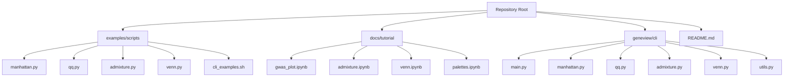
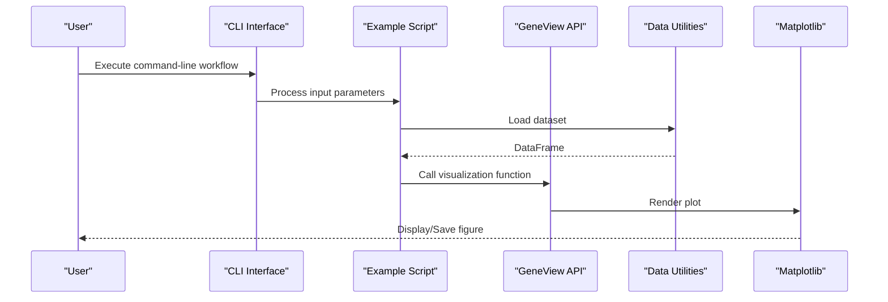
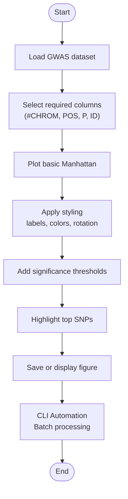
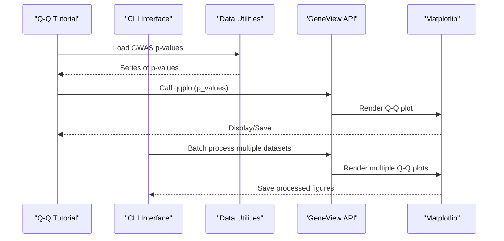
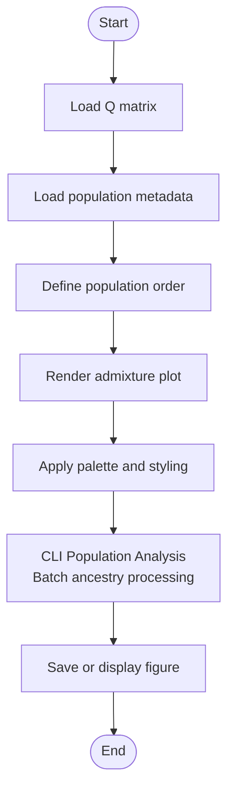
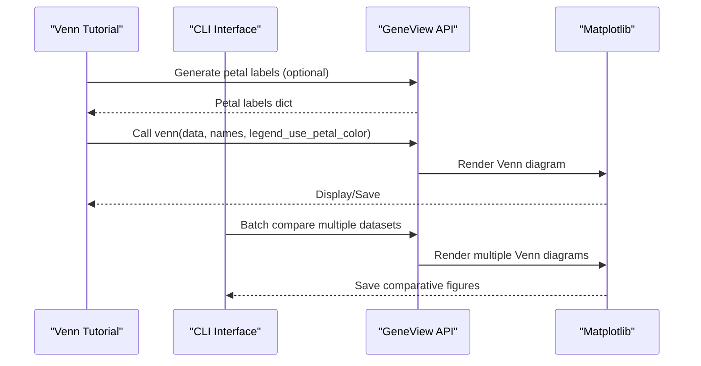
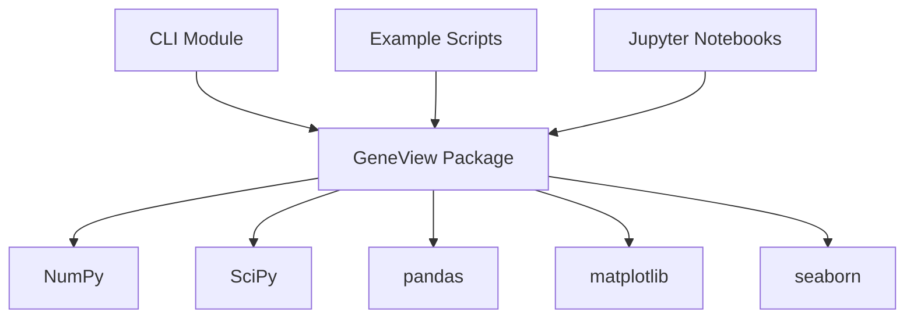

# Examples and Tutorials

<cite>
**Referenced Files in This Document**
- [README.md](file://README.md)
- [setup.py](file://setup.py)
- [requirements.txt](file://requirements.txt)
- [cli_examples.sh](file://examples/scripts/cli_examples.sh)
- [manhattan.py](file://examples/scripts/manhattan.py)
- [qq.py](file://examples/scripts/qq.py)
- [admixture.py](file://examples/scripts/admixture.py)
- [venn.py](file://examples/scripts/venn.py)
- [gwas_plot.ipynb](file://docs/tutorial/gwas_plot.ipynb)
- [admixture.ipynb](file://docs/tutorial/admixture.ipynb)
- [venn.ipynb](file://docs/tutorial/venn.ipynb)
- [palettes.ipynb](file://docs/tutorial/palettes.ipynb)
- [main.py](file://geneview/cli/main.py)
- [manhattan.py](file://geneview/cli/manhattan.py)
- [qq.py](file://geneview/cli/qq.py)
- [admixture.py](file://geneview/cli/admixture.py)
- [venn.py](file://geneview/cli/venn.py)
- [utils.py](file://geneview/cli/utils.py)
- [test_cli.py](file://geneview/tests/test_cli.py)
</cite>

## Update Summary
**Changes Made**
- Added comprehensive CLI usage examples and tutorials
- Integrated command-line interface documentation with existing examples
- Enhanced architecture overview to include CLI workflows
- Updated troubleshooting guide with CLI-specific issues
- Added new section covering CLI-specific best practices

## Table of Contents
1. [Introduction](#introduction)
2. [Project Structure](#project-structure)
3. [Core Components](#core-components)
4. [Architecture Overview](#architecture-overview)
5. [Command-Line Interface (CLI) Examples](#command-line-interface-cli-examples)
6. [Detailed Component Analysis](#detailed-component-analysis)
7. [Dependency Analysis](#dependency-analysis)
8. [Performance Considerations](#performance-considerations)
9. [Troubleshooting Guide](#troubleshooting-guide)
10. [Conclusion](#conclusion)
11. [Appendices](#appendices)

## Introduction
This document provides comprehensive examples and tutorials for GeneView, focusing on practical implementation guidance and best practices for genomics visualization workflows. It covers:
- Complete example scripts for Manhattan plots, Q-Q plots, Admixture plots, and Venn diagrams
- Jupyter notebook tutorials with interactive examples
- Command-line interface (CLI) examples demonstrating automated workflows
- Step-by-step tutorials for common use cases
- Best practices for data preprocessing, visualization customization, and result interpretation
- Workflow optimization, performance considerations, and integration with larger genomics pipelines
- Troubleshooting examples, common pitfalls, and advanced customization techniques

**Updated** Added comprehensive CLI usage examples and tutorials showing command-line automation patterns for genomics visualization workflows.

## Project Structure
The repository organizes examples and tutorials as follows:
- examples/scripts: Standalone Python scripts and CLI usage examples demonstrating core visualizations
- docs/tutorial: Jupyter notebooks offering interactive tutorials and deeper explanations
- geneview/cli: Command-line interface modules for automated visualization workflows
- README.md: High-level overview, installation, quick start, and usage examples



**Diagram sources**
- [cli_examples.sh](file://examples/scripts/cli_examples.sh)
- [main.py](file://geneview/cli/main.py)
- [manhattan.py](file://geneview/cli/manhattan.py)
- [qq.py](file://geneview/cli/qq.py)
- [admixture.py](file://geneview/cli/admixture.py)
- [venn.py](file://geneview/cli/venn.py)
- [utils.py](file://geneview/cli/utils.py)

**Section sources**
- [README.md](file://README.md)

## Core Components
This section highlights the core visualization functions and their typical usage patterns demonstrated in the repository, including both programmatic and command-line interfaces.

- Manhattan plots
  - Purpose: Visualize genome-wide association study (GWAS) results along chromosomes
  - Programmatic usage: Direct function calls with configurable parameters
  - CLI usage: Automated command-line execution for batch processing
  - Typical parameters: chromosome, position, p-values, optional SNP identifiers, thresholds, and styling options
  - Example references:
    - [README.md](file://README.md)
    - [gwas_plot.ipynb](file://docs/tutorial/gwas_plot.ipynb)
    - [manhattan.py](file://examples/scripts/manhattan.py)
    - [cli_examples.sh](file://examples/scripts/cli_examples.sh)

- Q-Q plots
  - Purpose: Assess distribution of p-values against expectation under the null hypothesis
  - Programmatic usage: Direct function calls with styling options
  - CLI usage: Batch processing of multiple datasets
  - Typical parameters: vector of p-values, styling options
  - Example references:
    - [README.md](file://README.md)
    - [gwas_plot.ipynb](file://docs/tutorial/gwas_plot.ipynb)
    - [qq.py](file://examples/scripts/qq.py)
    - [cli_examples.sh](file://examples/scripts/cli_examples.sh)

- Admixture plots
  - Purpose: Display individual ancestry proportions across multiple ancestral populations
  - Programmatic usage: Direct function calls with ordering and palette parameters
  - CLI usage: Automated ancestry analysis workflows
  - Typical parameters: Q matrix (ancestry fractions), population metadata, ordering, palette, styling
  - Example references:
    - [README.md](file://README.md)
    - [admixture.ipynb](file://docs/tutorial/admixture.ipynb)
    - [admixture.py](file://examples/scripts/admixture.py)
    - [cli_examples.sh](file://examples/scripts/cli_examples.sh)

- Venn diagrams
  - Purpose: Visualize overlaps among up to six sets of items
  - Programmatic usage: Direct function calls with formatting options
  - CLI usage: Automated comparison workflows
  - Typical parameters: dataset dictionary, formatting options, palette, legend usage
  - Example references:
    - [README.md](file://README.md)
    - [venn.ipynb](file://docs/tutorial/venn.ipynb)
    - [venn.py](file://examples/scripts/venn.py)
    - [cli_examples.sh](file://examples/scripts/cli_examples.sh)

**Section sources**
- [README.md](file://README.md)
- [gwas_plot.ipynb](file://docs/tutorial/gwas_plot.ipynb)
- [manhattan.py](file://examples/scripts/manhattan.py)
- [qq.py](file://examples/scripts/qq.py)
- [admixture.ipynb](file://docs/tutorial/admixture.ipynb)
- [admixture.py](file://examples/scripts/admixture.py)
- [venn.ipynb](file://docs/tutorial/venn.ipynb)
- [venn.py](file://examples/scripts/venn.py)
- [cli_examples.sh](file://examples/scripts/cli_examples.sh)

## Architecture Overview
The examples and tutorials demonstrate a comprehensive pipeline supporting both interactive and automated workflows:
- Data loading via GeneView utilities
- Visualization function calls with configurable parameters
- Matplotlib axes manipulation for layout and styling
- Optional integration with pandas for preprocessing
- Command-line interface for batch processing and automation



**Diagram sources**
- [cli_examples.sh](file://examples/scripts/cli_examples.sh)
- [main.py](file://geneview/cli/main.py)
- [manhattan.py](file://examples/scripts/manhattan.py)
- [qq.py](file://examples/scripts/qq.py)
- [admixture.py](file://examples/scripts/admixture.py)
- [venn.py](file://examples/scripts/venn.py)

## Command-Line Interface (CLI) Examples

### CLI Installation and Setup
The GeneView CLI provides automated workflows for genomics visualization:

```bash
# Install GeneView with CLI support
pip install geneview

# Check available CLI commands
geneview --help

# View specific command help
geneview manhattan --help
geneview qq --help
geneview admixture --help
geneview venn --help
```

### Automated Manhattan Plot Generation
CLI usage for batch processing GWAS results:

```bash
# Basic Manhattan plot generation
geneview manhattan --input gwas_results.assoc \
                   --output manhattan_plot.png \
                   --chromosome-col CHROM \
                   --position-col POS \
                   --pvalue-col P \
                   --title "GWAS Manhattan Plot"

# Advanced Manhattan plot with custom styling
geneview manhattan --input gwas_results.assoc \
                   --output manhattan_plot.png \
                   --chromosome-col CHROM \
                   --position-col POS \
                   --pvalue-col P \
                   --snp-id-col ID \
                   --threshold 5e-8 \
                   --colors blue red \
                   --width 12 \
                   --height 8 \
                   --dpi 300
```

### Automated Q-Q Plot Generation
CLI usage for quality control and statistical assessment:

```bash
# Basic Q-Q plot generation
geneview qq --input gwas_results.assoc \
            --output qq_plot.png \
            --pvalue-col P

# Batch Q-Q analysis for multiple datasets
for dataset in *.assoc; do
    geneview qq --input "$dataset" \
                --output "${dataset%.assoc}_qq.png" \
                --pvalue-col P
done
```

### Automated Admixture Plot Generation
CLI usage for population structure analysis:

```bash
# Basic Admixture plot generation
geneview admixture --input ancestry.Q \
                   --pop-file pop_metadata.txt \
                   --output admixture_plot.png \
                   --order pop1 pop2 pop3 \
                   --palette Set1

# Automated ancestry analysis workflow
geneview admixture --input synthetic.Q \
                   --pop-file synthetic_pop.txt \
                   --output ancestry_analysis.png \
                   --order EUR AFR ASN AMR \
                   --colors "#E41A1C" "#377EB8" "#4DAF4A" "#984EA3" \
                   --height 6 \
                   --width 10 \
                   --legend-title "Ancestral Populations"
```

### Automated Venn Diagram Generation
CLI usage for functional enrichment and overlap analysis:

```bash
# Basic Venn diagram generation
geneview venn --input gene_list_1.txt \
              --input gene_list_2.txt \
              --input gene_list_3.txt \
              --names Set1 Set2 Set3 \
              --output venn_diagram.png

# Complex Venn analysis with custom formatting
geneview venn --input gene_list_1.txt \
              --input gene_list_2.txt \
              --input gene_list_3.txt \
              --names TFBS ChIP-seq RNA-seq \
              --output regulatory_elements_venn.png \
              --colors "#FF6B6B" "#4ECDC4" "#45B7D1" \
              --legend-use-petal-color \
              --font-size 12 \
              --dpi 300
```

### Batch Processing Workflows
Automated workflows for large-scale genomics analysis:

```bash
#!/bin/bash
# Batch GWAS analysis workflow
for chr in {1..22}; do
    echo "Processing chromosome $chr..."
    
    # Filter chromosome-specific data
    awk -v chr=$chr '$1==chr' gwas_results.assoc > chr${chr}_filtered.assoc
    
    # Generate Manhattan plot
    geneview manhattan --input chr${chr}_filtered.assoc \
                       --output chr${chr}_manhattan.png \
                       --threshold 5e-8
    
    # Generate QQ plot
    geneview qq --input chr${chr}_filtered.assoc \
                --output chr${chr}_qq.png \
                --pvalue-col P
done

echo "Batch processing complete!"
```

**Section sources**
- [cli_examples.sh](file://examples/scripts/cli_examples.sh)
- [main.py](file://geneview/cli/main.py)
- [manhattan.py](file://geneview/cli/manhattan.py)
- [qq.py](file://geneview/cli/qq.py)
- [admixture.py](file://geneview/cli/admixture.py)
- [venn.py](file://geneview/cli/venn.py)
- [utils.py](file://geneview/cli/utils.py)

## Detailed Component Analysis

### Manhattan Plot Tutorial
This tutorial demonstrates building Manhattan plots from GWAS summary statistics, including:
- Loading datasets and preparing required columns
- Basic and styled Manhattan plots
- Threshold lines and SNP highlighting
- Rotation and layout adjustments
- CLI automation for batch processing



**Diagram sources**
- [gwas_plot.ipynb](file://docs/tutorial/gwas_plot.ipynb)
- [manhattan.py](file://examples/scripts/manhattan.py)
- [cli_examples.sh](file://examples/scripts/cli_examples.sh)
- [README.md](file://README.md)

**Section sources**
- [gwas_plot.ipynb](file://docs/tutorial/gwas_plot.ipynb)
- [manhattan.py](file://examples/scripts/manhattan.py)
- [cli_examples.sh](file://examples/scripts/cli_examples.sh)
- [README.md](file://README.md)

### Q-Q Plot Tutorial
This tutorial focuses on Q-Q plots for assessing p-value distributions:
- Loading p-values from GWAS results
- Creating and styling Q-Q plots
- Interpreting deviations from the diagonal line
- CLI batch processing for multiple datasets



**Diagram sources**
- [gwas_plot.ipynb](file://docs/tutorial/gwas_plot.ipynb)
- [qq.py](file://examples/scripts/qq.py)
- [cli_examples.sh](file://examples/scripts/cli_examples.sh)

**Section sources**
- [gwas_plot.ipynb](file://docs/tutorial/gwas_plot.ipynb)
- [qq.py](file://examples/scripts/qq.py)
- [cli_examples.sh](file://examples/scripts/cli_examples.sh)

### Admixture Plot Tutorial
This tutorial explains generating Admixture plots from ancestry fractions:
- Loading Q matrix and population metadata
- Ordering and styling ancestral populations
- Using palettes and layout options
- CLI automation for population structure analysis



**Diagram sources**
- [admixture.ipynb](file://docs/tutorial/admixture.ipynb)
- [admixture.py](file://examples/scripts/admixture.py)
- [cli_examples.sh](file://examples/scripts/cli_examples.sh)
- [README.md](file://README.md)

**Section sources**
- [admixture.ipynb](file://docs/tutorial/admixture.ipynb)
- [admixture.py](file://examples/scripts/admixture.py)
- [cli_examples.sh](file://examples/scripts/cli_examples.sh)
- [README.md](file://README.md)

### Venn Diagram Tutorial
This tutorial covers Venn diagrams for overlapping sets:
- Preparing dataset dictionaries
- Generating and formatting Venn diagrams
- Adjusting petal labels and legends
- CLI batch processing for comparative genomics



**Diagram sources**
- [venn.ipynb](file://docs/tutorial/venn.ipynb)
- [venn.py](file://examples/scripts/venn.py)
- [cli_examples.sh](file://examples/scripts/cli_examples.sh)
- [README.md](file://README.md)

**Section sources**
- [venn.ipynb](file://docs/tutorial/venn.ipynb)
- [venn.py](file://examples/scripts/venn.py)
- [cli_examples.sh](file://examples/scripts/cli_examples.sh)
- [README.md](file://README.md)

### Palette Exploration Tutorial
This tutorial introduces palette utilities and color schemes for consistent and accessible visualizations.

**Section sources**
- [palettes.ipynb](file://docs/tutorial/palettes.ipynb)

## Dependency Analysis
Dependencies are minimal and focused on the scientific Python stack:
- NumPy, SciPy, pandas, matplotlib, seaborn



**Diagram sources**
- [setup.py](file://setup.py)
- [requirements.txt](file://requirements.txt)

**Section sources**
- [setup.py](file://setup.py)
- [requirements.txt](file://requirements.txt)

## Performance Considerations
- Prefer pre-filtering datasets (e.g., chromosome subsets) for large-scale GWAS to reduce rendering overhead
- Use appropriate figure sizes and DPI settings to balance quality and file size
- Minimize repeated styling operations; batch styling parameters where possible
- For interactive notebooks, clear intermediate outputs to manage memory usage during long sessions
- **Updated** CLI workflows benefit from batch processing capabilities; use appropriate multiprocessing for large-scale analyses
- **Updated** Command-line interfaces support automated workflows that can be scheduled and parallelized for optimal resource utilization

## Troubleshooting Guide
Common issues and resolutions:
- Overlapping x-axis labels in Manhattan plots
  - Resolution: Rotate labels or adjust figure width; use rotation and tight layout
  - References:
    - [README.md](file://README.md)
    - [gwas_plot.ipynb](file://docs/tutorial/gwas_plot.ipynb)

- Unexpected thresholds or missing lines
  - Resolution: Explicitly set threshold parameters; disable thresholds if not desired
  - References:
    - [README.md](file://README.md)
    - [gwas_plot.ipynb](file://docs/tutorial/gwas_plot.ipynb)

- Admixture plot ordering inconsistencies
  - Resolution: Define explicit population order; ensure metadata alignment
  - References:
    - [admixture.ipynb](file://docs/tutorial/admixture.ipynb)
    - [admixture.py](file://examples/scripts/admixture.py)

- Venn diagram label formatting
  - Resolution: Generate and adjust petal labels before plotting
  - References:
    - [venn.ipynb](file://docs/tutorial/venn.ipynb)
    - [venn.py](file://examples/scripts/venn.py)

- Data loading errors
  - Resolution: Verify column names and separators; confirm dataset availability
  - References:
    - [gwas_plot.ipynb](file://docs/tutorial/gwas_plot.ipynb)
    - [admixture.ipynb](file://docs/tutorial/admixture.ipynb)
    - [venn.ipynb](file://docs/tutorial/venn.ipynb)

- **Updated** CLI command execution issues
  - Resolution: Verify command syntax and parameter formats; check input file paths and permissions
  - References:
    - [cli_examples.sh](file://examples/scripts/cli_examples.sh)
    - [test_cli.py](file://geneview/tests/test_cli.py)

- **Updated** Batch processing failures
  - Resolution: Implement error handling and logging; validate input data formats; use appropriate memory management for large datasets
  - References:
    - [cli_examples.sh](file://examples/scripts/cli_examples.sh)
    - [main.py](file://geneview/cli/main.py)

**Section sources**
- [README.md](file://README.md)
- [gwas_plot.ipynb](file://docs/tutorial/gwas_plot.ipynb)
- [admixture.ipynb](file://docs/tutorial/admixture.ipynb)
- [venn.ipynb](file://docs/tutorial/venn.ipynb)
- [manhattan.py](file://examples/scripts/manhattan.py)
- [qq.py](file://examples/scripts/qq.py)
- [admixture.py](file://examples/scripts/admixture.py)
- [venn.py](file://examples/scripts/venn.py)
- [cli_examples.sh](file://examples/scripts/cli_examples.sh)
- [test_cli.py](file://geneview/tests/test_cli.py)
- [main.py](file://geneview/cli/main.py)

## Conclusion
The examples and tutorials in this repository provide a comprehensive foundation for genomics visualization using GeneView. With the addition of CLI-specific examples and tutorials, users can now leverage both interactive and automated workflows for robust genomics analysis. The combination of ready-to-run scripts, interactive Jupyter notebooks, and command-line interfaces enables flexible deployment across different computational environments and scales. Following the best practices and troubleshooting tips outlined here will help ensure reliable, efficient, and reproducible results for both individual analyses and large-scale batch processing workflows.

## Appendices
- Additional resources and links are provided in the repository's README for further learning and reference.
- **Updated** CLI documentation and usage examples are available through the command-line interface itself using the `--help` flag for each command.

**Section sources**
- [README.md](file://README.md)