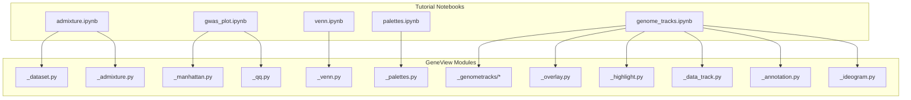
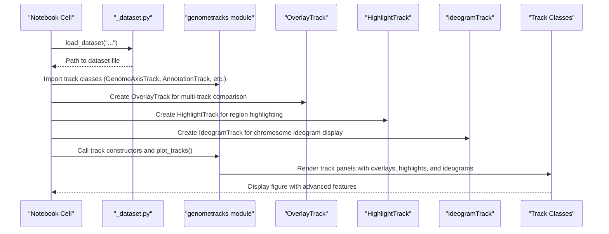
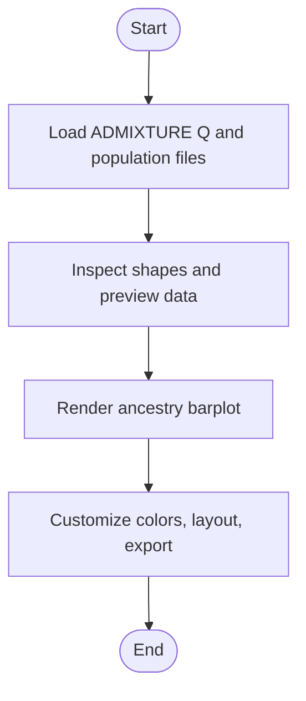
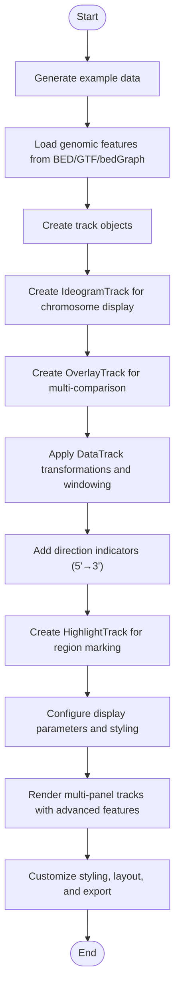
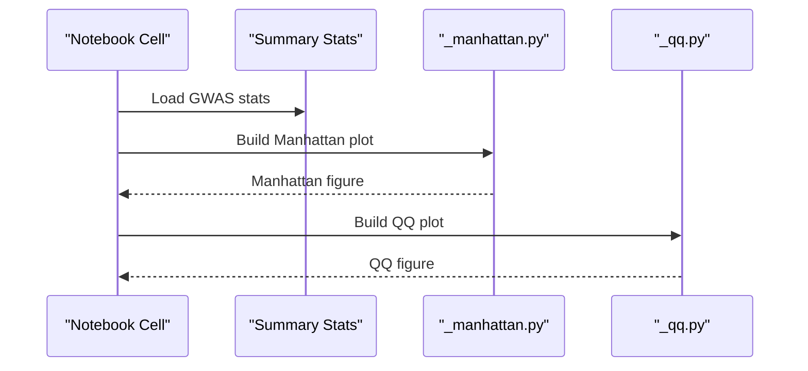
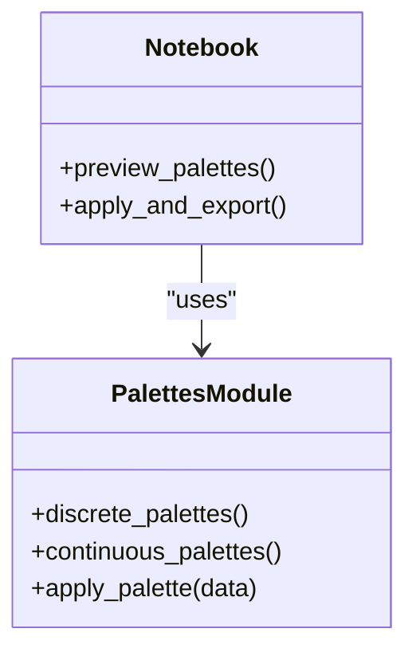
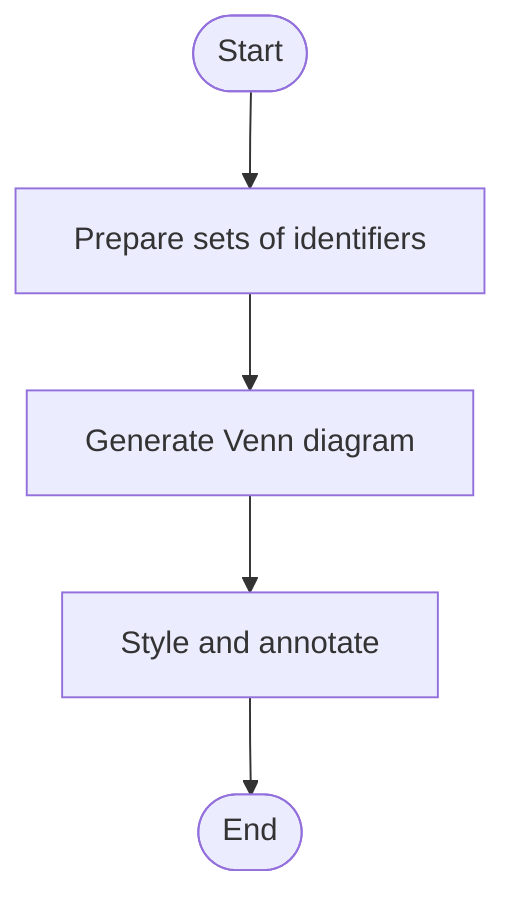
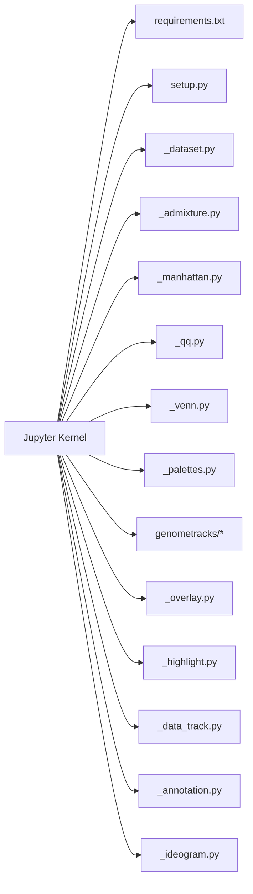

# Jupyter Notebook Tutorials

<cite>
**Referenced Files in This Document**
- [README.md](file://README.md)
- [tutorial/README.md](file://docs/tutorial/README.md)
- [admixture.ipynb](file://docs/tutorial/admixture.ipynb)
- [genome_tracks.ipynb](file://docs/tutorial/genome_tracks.ipynb)
- [gwas_plot.ipynb](file://docs/tutorial/gwas_plot.ipynb)
- [palettes.ipynb](file://docs/tutorial/palettes.ipynb)
- [venn.ipynb](file://docs/tutorial/venn.ipynb)
- [requirements.txt](file://requirements.txt)
- [setup.py](file://setup.py)
- [_dataset.py](file://geneview/utils/_dataset.py)
- [_admixture.py](file://geneview/popgene/_admixture.py)
- [_manhattan.py](file://geneview/gwas/_manhattan.py)
- [_qq.py](file://geneview/gwas/_qq.py)
- [_venn.py](file://geneview/baseplot/_venn.py)
- [_palettes.py](file://geneview/palette/_palettes.py)
- [genometracks/__init__.py](file://geneview/genometracks/__init__.py)
- [genometracks/_base.py](file://geneview/genometracks/_base.py)
- [genometracks/_track_plot.py](file://geneview/genometracks/_track_plot.py)
- [genometracks/_annotation.py](file://geneview/genometracks/_annotation.py)
- [genometracks/_gene_region.py](file://geneview/genometracks/_gene_region.py)
- [genometracks/_data_track.py](file://geneview/genometracks/_data_track.py)
- [genometracks/_highlight.py](file://geneview/genometracks/_highlight.py)
- [genometracks/_overlay.py](file://geneview/genometracks/_overlay.py)
- [genometracks/_ideogram.py](file://geneview/genometracks/_ideogram.py)
- [generate_genome_tracks_data.py](file://examples/scripts/generate_genome_tracks_data.py)
- [multi_sample.tsv](file://examples/data/genome_tracks/multi_sample.tsv)
- [genome_tracks_guide.md](file://docs/genome_tracks_guide.md)
- [test_genome_tracks.py](file://geneview/tests/test_genome_tracks.py)
</cite>

## Update Summary
**Changes Made**
- Updated to include comprehensive examples of the new IdeogramTrack functionality in the genome tracks tutorial notebook, demonstrating integration with other track types and advanced visualization features
- Enhanced documentation of IdeogramTrack capabilities including chromosome ideogram display, centromere shapes, band labeling, and automatic karyotype loading
- Added detailed coverage of IdeogramTrack parameter variations and customization options
- Updated genome tracks tutorial to showcase IdeogramTrack alongside existing track types (OverlayTrack, HighlightTrack, DataTrack, etc.)

## Table of Contents
1. [Introduction](#introduction)
2. [Project Structure](#project-structure)
3. [Core Components](#core-components)
4. [Architecture Overview](#architecture-overview)
5. [Detailed Component Analysis](#detailed-component-analysis)
6. [Dependency Analysis](#dependency-analysis)
7. [Performance Considerations](#performance-considerations)
8. [Troubleshooting Guide](#troubleshooting-guide)
9. [Conclusion](#conclusion)
10. [Appendices](#appendices)

## Introduction
This document provides comprehensive, hands-on guidance for the GeneView Jupyter notebook tutorials. It explains each tutorial's objectives, required data, step-by-step execution workflow, parameter variations, customization options, and expected outputs. It also covers local setup, environment preparation, common extensions to the basic examples, troubleshooting, and adapting tutorials for different datasets and research scenarios.

**Updated** Enhanced with new default colors, parameter values, and styling conventions reflecting the updated Gviz-style appearance, including comprehensive coverage of the new IdeogramTrack functionality for chromosome ideogram visualization.

## Project Structure
The tutorial notebooks are located under docs/tutorial/. Each notebook focuses on a specific visualization or analysis task and references GeneView modules for data loading and plotting. The project now includes a new genome tracks tutorial alongside existing admixture, gwas_plot, palettes, and venn notebooks. The genome tracks tutorial has been expanded to include IdeogramTrack functionality for chromosome ideogram visualization.

**Diagram sources**
- [admixture.ipynb](file://docs/tutorial/admixture.ipynb)
- [genome_tracks.ipynb](file://docs/tutorial/genome_tracks.ipynb)
- [gwas_plot.ipynb](file://docs/tutorial/gwas_plot.ipynb)
- [palettes.ipynb](file://docs/tutorial/palettes.ipynb)
- [venn.ipynb](file://docs/tutorial/venn.ipynb)
- [_dataset.py](file://geneview/utils/_dataset.py)
- [_admixture.py](file://geneview/popgene/_admixture.py)
- [_manhattan.py](file://geneview/gwas/_manhattan.py)
- [_qq.py](file://geneview/gwas/_qq.py)
- [_venn.py](file://geneview/baseplot/_venn.py)
- [_palettes.py](file://geneview/palette/_palettes.py)
- [genometracks/__init__.py](file://geneview/genometracks/__init__.py)
- [genometracks/_overlay.py](file://geneview/genometracks/_overlay.py)
- [genometracks/_highlight.py](file://geneview/genometracks/_highlight.py)
- [genometracks/_data_track.py](file://geneview/genometracks/_data_track.py)
- [genometracks/_annotation.py](file://geneview/genometracks/_annotation.py)
- [genometracks/_ideogram.py](file://geneview/genometracks/_ideogram.py)

**Section sources**
- [tutorial/README.md](file://docs/tutorial/README.md)

## Core Components
- Environment setup and kernel registration for Jupyter notebooks.
- Tutorial-specific workflows:
  - Admixture ancestry visualization
  - Genome tracks visualization (enhanced with IdeogramTrack)
  - GWAS Manhattan and QQ plots
  - Palette exploration and customization
  - Venn diagram generation

**Updated** Enhanced with new default colors and styling conventions reflecting the updated Gviz-style appearance, including comprehensive IdeogramTrack functionality for chromosome ideogram visualization.

**Section sources**
- [tutorial/README.md](file://docs/tutorial/README.md)

## Architecture Overview
The tutorials integrate with GeneView modules to load test datasets and produce visualizations. Data loading utilities supply prepackaged datasets, while plotting modules encapsulate visualization logic. The genome tracks tutorial leverages the new genometracks module for comprehensive genomic visualization with advanced overlay, highlighting, and ideogram capabilities.

**Diagram sources**
- [_dataset.py](file://geneview/utils/_dataset.py)
- [genometracks/__init__.py](file://geneview/genometracks/__init__.py)
- [genometracks/_base.py](file://geneview/genometracks/_base.py)
- [genometracks/_track_plot.py](file://geneview/genometracks/_track_plot.py)
- [genometracks/_overlay.py](file://geneview/genometracks/_overlay.py)
- [genometracks/_highlight.py](file://geneview/genometracks/_highlight.py)
- [genometracks/_ideogram.py](file://geneview/genometracks/_ideogram.py)

## Detailed Component Analysis

### Admixture Ancestry Visualization (admixture.ipynb)
- Objective: Load ADMIXTURE output and population group files, inspect data shapes, and render ancestry barplots.
- Data requirements:
  - ADMIXTURE output file (Q matrix)
  - Population info file (sample groups)
- Execution workflow:
  - Load datasets via the internal loader
  - Inspect shapes and preview dataframes
  - Plot ancestry bars using GeneView's admixture plotting module
- Parameter variations and customization:
  - Adjust color palettes and figure sizes
  - Subset samples or ancestries for focused views
  - Export figures in vector formats for presentations
- Expected outputs:
  - Clean ancestry barplots per sample
  - Accessible legends and axis labels
- Extensions:
  - Overlay metadata (age, sex) onto plots
  - Compare multiple runs by stacking plots
  - Add significance thresholds or grouping labels

**Diagram sources**
- [admixture.ipynb](file://docs/tutorial/admixture.ipynb)
- [_dataset.py](file://geneview/utils/_dataset.py)
- [_admixture.py](file://geneview/popgene/_admixture.py)

**Section sources**
- [admixture.ipynb](file://docs/tutorial/admixture.ipynb)
- [_dataset.py](file://geneview/utils/_dataset.py)
- [_admixture.py](file://geneview/popgene/_admixture.py)

### Genome Tracks Visualization (genome_tracks.ipynb) - ENHANCED
- Objective: Demonstrate comprehensive genome track visualization using the new genometracks module with advanced features including IdeogramTrack for chromosome ideogram display.
- Data requirements:
  - CpG islands BED file
  - Gene models GTF file
  - Coverage bedGraph file
  - Annotation BED file
  - Multi-sample TSV file (for DataTrack grouping)
  - Cytoband data for IdeogramTrack (auto-loaded or provided)
- Execution workflow:
  - Generate example data using the provided script
  - Load genomic features from various file formats
  - Create and combine different track types (GenomeAxisTrack, AnnotationTrack, GeneRegionTrack, DataTrack, HighlightTrack, **NEW**: IdeogramTrack)
  - **NEW**: Create IdeogramTrack for chromosome ideogram display with centromere visualization
  - **NEW**: Configure IdeogramTrack with different centromere shapes (triangle, circle) and band labeling options
  - **NEW**: Enable automatic karyotype loading for human genome builds (hg38, hg19)
  - **NEW**: Integrate IdeogramTrack with other track types for comprehensive genomic visualization
  - **NEW**: Utilize OverlayTrack for multi-track comparison and visual overlay
  - **NEW**: Apply DataTrack transformations (log2, custom functions) and windowing/smoothing
  - **NEW**: Add direction indicators (5'→3' arrows) to show strand orientation
  - **NEW**: Implement per-region highlighting across multiple tracks
  - Configure display parameters and track stacking
  - Render multi-panel genomic figures with advanced styling options including ideogram integration
- Parameter variations and customization:
  - Configure stacking modes for overlapping features
  - Customize track heights and display parameters
  - Implement transcript collapsing strategies
  - Set up multi-sample data visualization
  - Add highlight regions across multiple tracks
  - **NEW**: Configure IdeogramTrack parameters (centromere_shape, show_band_id, outline, height)
  - **NEW**: Choose genome build for automatic karyotype loading (hg38, hg19)
  - **NEW**: Customize ideogram appearance with display_params
  - **NEW**: Integrate ideogram with other track types for coordinated visualization
  - **NEW**: Use combined plot types (line + points, stair-step plots)
  - **NEW**: Apply value transformations and smoothing techniques
  - **NEW**: Enable grid lines and custom styling options
- Expected outputs:
  - Multi-panel genomic tracks with proper coordinate alignment
  - Gene models with exons, UTRs, and introns including direction indicators
  - Coverage data visualization with transformations and windowing
  - Highlighted genomic regions spanning multiple tracks
  - Overlaid tracks for comparative analysis
  - **NEW**: Chromosome ideogram with cytoband visualization and centromere display
  - **NEW**: Integrated ideogram showing genomic region context within chromosome background
- Extensions:
  - Integrate with real biological datasets
  - Customize track styling and colors
  - Add interactive widgets for dynamic filtering
  - Export high-resolution figures for publications
  - **NEW**: Implement complex multi-track overlay scenarios with ideogram integration
  - **NEW**: Apply advanced data transformations for different visualization needs
  - **NEW**: Create comprehensive genomic views combining ideogram context with detailed track data
  - **NEW**: Customize ideogram appearance for different research contexts and visual preferences

**Diagram sources**
- [genome_tracks.ipynb](file://docs/tutorial/genome_tracks.ipynb)
- [generate_genome_tracks_data.py](file://examples/scripts/generate_genome_tracks_data.py)
- [multi_sample.tsv](file://examples/data/genome_tracks/multi_sample.tsv)
- [genometracks/_overlay.py](file://geneview/genometracks/_overlay.py)
- [genometracks/_highlight.py](file://geneview/genometracks/_highlight.py)
- [genometracks/_annotation.py](file://geneview/genometracks/_annotation.py)
- [genometracks/_ideogram.py](file://geneview/genometracks/_ideogram.py)

**Section sources**
- [genome_tracks.ipynb](file://docs/tutorial/genome_tracks.ipynb)
- [generate_genome_tracks_data.py](file://examples/scripts/generate_genome_tracks_data.py)
- [multi_sample.tsv](file://examples/data/genome_tracks/multi_sample.tsv)
- [genometracks/_overlay.py](file://geneview/genometracks/_overlay.py)
- [genometracks/_highlight.py](file://geneview/genometracks/_highlight.py)
- [genometracks/_annotation.py](file://geneview/genometracks/_annotation.py)
- [genometracks/_ideogram.py](file://geneview/genometracks/_ideogram.py)
- [genome_tracks_guide.md](file://docs/genome_tracks_guide.md)
- [test_genome_tracks.py](file://geneview/tests/test_genome_tracks.py)

### GWAS Manhattan and QQ Plots (gwas_plot.ipynb)
- Objective: Visualize GWAS summary statistics with Manhattan and QQ plots.
- Data requirements:
  - GWAS summary statistics (chromosome, position, p-value)
- Execution workflow:
  - Load summary stats
  - Generate Manhattan plot highlighting genome-wide significant hits
  - Generate QQ plot assessing distributional assumptions
- Parameter variations and customization:
  - Thresholds for significance and highlights
  - Chromosome-wise coloring and label rotations
  - Axis scaling and figure sizing
- Expected outputs:
  - Manhattan plot with highlighted loci
  - QQ plot with lambda estimation
- Extensions:
  - Stratify by trait or ancestry
  - Add genomic annotations (genes, CpG islands)
  - Batch multiple traits for comparison

**Diagram sources**
- [gwas_plot.ipynb](file://docs/tutorial/gwas_plot.ipynb)
- [_manhattan.py](file://geneview/gwas/_manhattan.py)
- [_qq.py](file://geneview/gwas/_qq.py)

**Section sources**
- [gwas_plot.ipynb](file://docs/tutorial/gwas_plot.ipynb)
- [_manhattan.py](file://geneview/gwas/_manhattan.py)
- [_qq.py](file://geneview/gwas/_qq.py)

### Palette Exploration (palettes.ipynb)
- Objective: Explore and apply GeneView color palettes for consistent, publication-ready visuals.
- Data requirements:
  - No external datasets required
- Execution workflow:
  - Import GeneView
  - Preview built-in palettes
  - Apply palettes to plots
- Parameter variations and customization:
  - Select discrete vs continuous palettes
  - Modify alpha/transparency and saturation
  - Combine palettes for multi-panel layouts
- Expected outputs:
  - Consistent color schemes across figures
- Extensions:
  - Save palette swatches for reproducibility
  - Derive custom palettes from perceptually uniform spaces

**Diagram sources**
- [palettes.ipynb](file://docs/tutorial/palettes.ipynb)
- [_palettes.py](file://geneview/palette/_palettes.py)

**Section sources**
- [palettes.ipynb](file://docs/tutorial/palettes.ipynb)
- [_palettes.py](file://geneview/palette/_palettes.py)

### Venn Diagrams (venn.ipynb)
- Objective: Construct Venn diagrams to compare sets across conditions or traits.
- Data requirements:
  - Collections of identifiers (e.g., genes, SNPs)
- Execution workflow:
  - Prepare set inputs
  - Generate Venn diagram with overlaps
- Parameter variations and customization:
  - Adjust set labels and colors
  - Toggle inclusion of subset counts
- Expected outputs:
  - Clear Venn diagram with overlapping regions
- Extensions:
  - Multi-way comparisons (3+ sets)
  - Interactive widgets for dynamic filtering

**Diagram sources**
- [venn.ipynb](file://docs/tutorial/venn.ipynb)
- [_venn.py](file://geneview/baseplot/_venn.py)

**Section sources**
- [venn.ipynb](file://docs/tutorial/venn.ipynb)
- [_venn.py](file://geneview/baseplot/_venn.py)

## Dependency Analysis
- Internal dependencies:
  - Data loading relies on _dataset.py
  - Visualization modules are implemented in _admixture.py, _manhattan.py, _qq.py, _venn.py, _palettes.py
  - Genome tracks functionality is implemented in the genometracks module with new overlay, highlight, and ideogram features
- External dependencies:
  - Matplotlib, NumPy, pandas are commonly used across notebooks
  - Additional dependencies for genome tracks: pyBigWig, pysam (optional)
- Environment setup:
  - Install Jupyter and ipykernel
  - Register a virtual environment kernel for consistent execution

**Diagram sources**
- [requirements.txt](file://requirements.txt)
- [setup.py](file://setup.py)
- [_dataset.py](file://geneview/utils/_dataset.py)
- [_admixture.py](file://geneview/popgene/_admixture.py)
- [_manhattan.py](file://geneview/gwas/_manhattan.py)
- [_qq.py](file://geneview/gwas/_qq.py)
- [_venn.py](file://geneview/baseplot/_venn.py)
- [_palettes.py](file://geneview/palette/_palettes.py)
- [genometracks/__init__.py](file://geneview/genometracks/__init__.py)
- [genometracks/_overlay.py](file://geneview/genometracks/_overlay.py)
- [genometracks/_highlight.py](file://geneview/genometracks/_highlight.py)
- [genometracks/_data_track.py](file://geneview/genometracks/_data_track.py)
- [genometracks/_annotation.py](file://geneview/genometracks/_annotation.py)
- [genometracks/_ideogram.py](file://geneview/genometracks/_ideogram.py)

**Section sources**
- [requirements.txt](file://requirements.txt)
- [setup.py](file://setup.py)
- [tutorial/README.md](file://docs/tutorial/README.md)

## Performance Considerations
- Large datasets:
  - Subset analyses to reduce memory footprint
  - Use efficient data types (e.g., categorical for groups)
- Plotting:
  - Vector formats for scalability in publications
  - Minimize repeated rendering during exploratory sessions
- Reproducibility:
  - Pin versions of key libraries (NumPy, pandas, matplotlib)
  - Cache intermediate results for iterative workflows
- Genome tracks performance:
  - Optimize track stacking algorithms for large genomic regions
  - Use appropriate data formats (bedGraph, bigWig) for large datasets
  - Implement efficient region queries and data subsetting
  - **NEW**: Consider computational overhead of overlay operations and transformations
  - **NEW**: Optimize highlight rendering for multiple tracks and regions
  - **NEW**: Optimize ideogram rendering for large chromosome displays and multiple band types

## Troubleshooting Guide
- Environment setup:
  - Ensure Jupyter and ipykernel are installed and a kernel is registered
  - Verify the kernel name matches the one used in the notebooks
- Data loading:
  - Confirm dataset filenames and paths align with the internal loader
  - Check file encodings and separators if parsing fails
  - For genome tracks, ensure example data is generated before running the notebook
- Rendering issues:
  - Switch backend or restart kernel if plots fail to display
  - Reduce figure sizes or DPI for large multi-panel figures
  - **NEW**: Check overlay track compatibility and ensure proper track ordering
  - **NEW**: Verify transformation functions don't produce invalid values (NaN, inf)
  - **NEW**: Validate ideogram track parameters (centromere_shape, show_band_id) for proper rendering
  - **NEW**: Check automatic karyotype loading for valid genome_build parameters (hg38, hg19)
- Notebook execution:
  - Run cells sequentially to avoid undefined variables
  - Clear outputs and re-run if stale state affects rendering
- Genome tracks specific issues:
  - Verify data file formats match expected BED/GTF/bedGraph specifications
  - Check chromosome naming conventions (chr7 vs 7)
  - Ensure genomic intervals are properly formatted and ordered
  - **NEW**: Validate overlay track list contains compatible track types
  - **NEW**: Confirm highlight regions don't exceed track boundaries
  - **NEW**: Check windowing parameters for appropriate bin sizes
  - **NEW**: Verify ideogram data format matches expected cytoband specifications (chrom, chromStart, chromEnd, name, gieStain)
  - **NEW**: Ensure chromosome parameter matches ideogram data chromosome naming convention

**Section sources**
- [tutorial/README.md](file://docs/tutorial/README.md)
- [_dataset.py](file://geneview/utils/_dataset.py)

## Conclusion
These tutorials provide practical, interactive pathways to explore genetic data through GeneView. The addition of the genome tracks tutorial expands the toolkit to include comprehensive genomic visualization capabilities with advanced features like overlay comparisons, data transformations, direction indicators, per-region highlighting, and **NEW**: IdeogramTrack for chromosome ideogram visualization. The IdeogramTrack functionality enables researchers to display chromosome ideograms with cytoband coloring, centromere visualization, and automatic karyotype loading, providing essential genomic context for detailed track analysis. By following the outlined workflows, customizing parameters, and extending examples, users can tailor visualizations to diverse datasets and research questions.

**Updated** Enhanced with new default colors, parameter values, and styling conventions reflecting the updated Gviz-style appearance, including comprehensive IdeogramTrack functionality for chromosome ideogram visualization with advanced customization options.

## Appendices

### Running Notebooks Locally
- Install Jupyter and register a kernel as described in the tutorial setup guide.
- Launch Jupyter and open the desired notebook.
- Execute cells in order; consult troubleshooting tips if issues arise.
- For genome tracks tutorial, ensure example data is generated first using the provided script.
- **NEW**: For overlay and highlight features, ensure proper track initialization and parameter validation.
- **NEW**: For IdeogramTrack functionality, ensure proper chromosome ideogram data loading and parameter configuration.
- **NEW**: Take advantage of updated default colors and styling conventions for improved visual appeal.

**Section sources**
- [tutorial/README.md](file://docs/tutorial/README.md)

### Adapting Tutorials to New Datasets
- Replace dataset loaders with paths to your files; ensure column names match expectations.
- Align data types and missing value conventions to the plotting modules' requirements.
- Iterate on thresholds, colors, and labels to reflect your study's context.
- For genome tracks, ensure your data follows the expected BED/GTF/bedGraph format specifications.
- **NEW**: For overlay comparisons, ensure track data types are compatible and properly normalized.
- **NEW**: For transformations, validate data ranges and handle negative values appropriately.
- **NEW**: For direction indicators, verify strand information is present and correctly formatted.
- **NEW**: For IdeogramTrack, ensure cytoband data follows the required format (chrom, chromStart, chromEnd, name, gieStain) or use automatic karyotype loading.
- **NEW**: Leverage updated default color schemes for consistent visual presentation.

### Extending the Basic Examples
- Combine multiple plots into composite figures
- Integrate interactive widgets for dynamic filtering
- Export high-resolution figures for presentations and publications
- Leverage the new genome tracks module for complex multi-track genomic visualizations
- Customize track styling and implement advanced genomic data integration workflows
- **NEW**: Implement multi-track overlay comparisons for experimental conditions
- **NEW**: Apply advanced data transformations for different visualization contexts
- **NEW**: Add directional markers to show strand-specific features
- **NEW**: Create per-region highlight annotations across multiple track types
- **NEW**: Utilize updated default color palettes for enhanced visual appeal
- **NEW**: Create comprehensive genomic views combining ideogram context with detailed track data
- **NEW**: Customize ideogram appearance for different research contexts and visual preferences

### New Genome Tracks Module Features
- Track hierarchy: Track → RangeTrack → StackedTrack/NumericTrack → Specific Track Types
- File I/O support: read_bed, read_gff, read_bedgraph, read_bigwig, read_bam_coverage
- Display parameter system: configurable appearance through display_params dictionaries
- Multi-format support: BED, GFF/GTF, bedGraph, BigWig, BAM coverage data
- Advanced features: transcript collapsing, stacking modes, highlight regions, multi-sample visualization
- **NEW**: OverlayTrack for multi-track comparison and visual overlay
- **NEW**: Enhanced DataTrack with combined plot types (line + points, stair-step), transformations, and windowing
- **NEW**: Direction indicators (5'→3' arrows) for strand orientation visualization
- **NEW**: Per-region highlighting across multiple tracks with customizable styling
- **NEW**: Advanced plot_tracks options including grid lines and custom styling parameters
- **NEW**: Updated default color schemes and styling conventions for Gviz-style appearance
- **NEW**: IdeogramTrack for chromosome ideogram visualization with cytoband coloring and centromere display
- **NEW**: Automatic karyotype loading for human genome builds (hg38, hg19) with customizable parameters
- **NEW**: Centromere shape customization (triangle, circle) and band labeling options
- **NEW**: Integrated ideogram display showing genomic region context within chromosome background

**Section sources**
- [genometracks/_overlay.py](file://geneview/genometracks/_overlay.py)
- [genometracks/_highlight.py](file://geneview/genometracks/_highlight.py)
- [genometracks/_data_track.py](file://geneview/genometracks/_data_track.py)
- [genometracks/_annotation.py](file://geneview/genometracks/_annotation.py)
- [genometracks/_ideogram.py](file://geneview/genometracks/_ideogram.py)
- [genome_tracks_guide.md](file://docs/genome_tracks_guide.md)
- [test_genome_tracks.py](file://geneview/tests/test_genome_tracks.py)

### Updated Default Styling Conventions

#### Base Track Defaults (Gviz-style)
| Parameter | Default Value | Description |
|-----------|---------------|-------------|
| `alpha` | 1.0 | Opacity of plot elements |
| `background_panel` | "white" | Background color of data panel |
| `background_title` | "#D3D3D3" | Background color of title panel |
| `col` | "#0080FF" | Line/border color |
| `fill` | "lightgray" | Fill color |
| `col_border` | "transparent" | Border color |
| `col_grid` | "#808080" | Grid line color |
| `col_title` | "white" | Title text color |
| `col_border_title` | "white" | Title border color |
| `fontface` | "normal" | Text font style |
| `fontface_title` | "bold" | Title font style |
| `fontsize` | 10 | Base font size |
| `fontsize_title` | 10 | Title font size |
| `frame` | False | Draw frame around panel |
| `grid` | False | Show grid lines |
| `lwd` | 1.0 | Line width |
| `lty` | "-" | Line type |
| `show_title` | True | Show the title panel |
| `reverse_strand` | False | Reverse strand orientation |
| `rotation_title` | 90 | Title text rotation |
| `cex` | 1.0 | Character expansion |
| `min_width` | 1 | Minimum feature width (pixels) |
| `min_height` | 3 | Minimum feature height (pixels) |
| `min_distance` | 1 | Minimum distance for stacking |
| `collapse` | True | Collapse overlapping features |
| `stack_height` | 0.75 | Stack height ratio |

#### Track-Specific Default Colors

**AnnotationTrack Defaults:**
- `fill`: "lightblue" (Gviz default)
- `col`: "transparent" (Gviz: AnnotationTrack col = "transparent")

**GeneRegionTrack Defaults:**
- `col`: "orange" (Gviz: orange exon border)
- `fill`: "orange" (Gviz: orange exon fill)
- `fill_utr`: "#FFD699" (Gviz: lighter orange for UTR)
- `col_intron`: "#808080" (Gviz: darkgray intron lines)
- `lwd`: 0.8
- `fontsize`: 8
- `fontcolor`: "#333333"

**DataTrack Defaults:**
- `col`: "#0080FF" (Gviz: bright blue)
- `fill`: "#808080" (Gviz: gray for histogram)
- `col_histogram`: "#808080" (Gviz: gray histogram bars)
- `fill_histogram`: None (uses general fill if None)
- `baseline`: 0
- `ncolor`: 100
- `grid`: False
- `col_grid`: "#DDDDDD"

**IdeogramTrack Defaults:**
- `col`: "red" (Gviz default for ideogram outline)
- `fill`: "#FFE3E6" (Gviz default for ideogram fill)
- `outline`: False (Gviz default for ideogram outline)
- `height`: 0.5 (relative track height)
- `show_title`: False (Gviz default for ideogram title)
- `background_title`: "transparent" (Gviz default for ideogram title background)

**Section sources**
- [genometracks/_base.py](file://geneview/genometracks/_base.py)
- [genometracks/_annotation.py](file://geneview/genometracks/_annotation.py)
- [genometracks/_gene_region.py](file://geneview/genometracks/_gene_region.py)
- [genometracks/_data_track.py](file://geneview/genometracks/_data_track.py)
- [genometracks/_track_plot.py](file://geneview/genometracks/_track_plot.py)
- [genometracks/_ideogram.py](file://geneview/genometracks/_ideogram.py)

### IdeogramTrack Parameter Reference

#### IdeogramTrack Constructor Parameters
| Parameter | Type | Default | Description |
|-----------|------|---------|-------------|
| `bands` | pd.DataFrame or str | None | Cytoband data with columns: chrom, chromStart, chromEnd, name, gieStain. If string, interpreted as file path. If None, auto-loads human karyotype. |
| `chromosome` | str | None | Chromosome to display. Uses first chromosome if None. |
| `genome_build` | str | "hg38" | Genome build for default karyotype: "hg38" or "hg19". Only used when bands=None. |
| `show_band_id` | bool | False | Whether to show band name labels inside bands. |
| `centromere_shape` | str | "triangle" | Shape of centromere: 'triangle' or 'circle'. |
| `outline` | bool | False | Whether to draw black outline around bands. |
| `name` | str | chromosome name | Track name for title panel. |
| `height` | float | 0.5 | Relative track height. |
| `display_params` | dict | None | Additional display parameters. |

#### IdeogramTrack Usage Examples
- **Basic ideogram display**: `IdeogramTrack(bands, chromosome="chr7")`
- **Triangle centromere**: `IdeogramTrack(bands, chromosome="chr7", centromere_shape="triangle")`
- **Circle centromere**: `IdeogramTrack(bands, chromosome="chr7", centromere_shape="circle")`
- **Show band IDs**: `IdeogramTrack(bands, chromosome="chr7", show_band_id=True)`
- **Automatic karyotype loading**: `IdeogramTrack(chromosome="chr7")`
- **Custom display parameters**: `IdeogramTrack(bands, chromosome="chr7", display_params={"col": "blue", "fill": "lightblue"})`

**Section sources**
- [genometracks/_ideogram.py](file://geneview/genometracks/_ideogram.py)
- [test_genome_tracks.py](file://geneview/tests/test_genome_tracks.py)
- [genome_tracks_guide.md](file://docs/genome_tracks_guide.md)