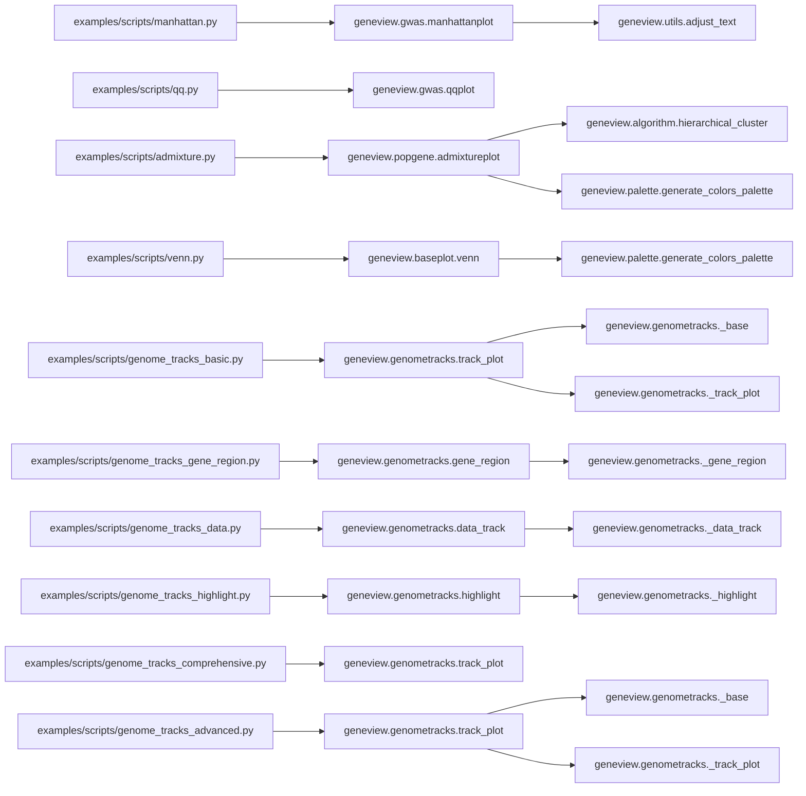

# Script Examples

<cite>
**Referenced Files in This Document**
- [README.md](file://README.md)
- [examples/scripts/manhattan.py](file://examples/scripts/manhattan.py)
- [examples/scripts/qq.py](file://examples/scripts/qq.py)
- [examples/scripts/admixture.py](file://examples/scripts/admixture.py)
- [examples/scripts/venn.py](file://examples/scripts/venn.py)
- [examples/scripts/samplefq.py](file://examples/scripts/samplefq.py)
- [examples/scripts/genome_tracks_basic.py](file://examples/scripts/genome_tracks_basic.py)
- [examples/scripts/genome_tracks_gene_region.py](file://examples/scripts/genome_tracks_gene_region.py)
- [examples/scripts/genome_tracks_data.py](file://examples/scripts/genome_tracks_data.py)
- [examples/scripts/genome_tracks_highlight.py](file://examples/scripts/genome_tracks_highlight.py)
- [examples/scripts/genome_tracks_comprehensive.py](file://examples/scripts/genome_tracks_comprehensive.py)
- [examples/scripts/genome_tracks_advanced.py](file://examples/scripts/genome_tracks_advanced.py)
- [examples/scripts/generate_genome_tracks_data.py](file://examples/scripts/generate_genome_tracks_data.py)
- [examples/data/genome_tracks/multi_sample.tsv](file://examples/data/genome_tracks/multi_sample.tsv)
- [examples/data/genome_tracks/gene_models.gtf](file://examples/data/genome_tracks/gene_models.gtf)
- [examples/data/genome_tracks/coverage.bedgraph](file://examples/data/genome_tracks/coverage.bedgraph)
- [examples/data/genome_tracks/annotations.bed](file://examples/data/genome_tracks/annotations.bed)
- [examples/data/genome_tracks/cpg_islands.bed](file://examples/data/genome_tracks/cpg_islands.bed)
- [examples/data/genome_tracks/gviz_samples/test.bed](file://examples/data/genome_tracks/gviz_samples/test.bed)
- [examples/data/genome_tracks/gviz_samples/test.bedGraph](file://examples/data/genome_tracks/gviz_samples/test.bedGraph)
- [examples/data/genome_tracks/gviz_samples/test.gff3](file://examples/data/genome_tracks/gviz_samples/test.gff3)
- [examples/data/genome_tracks/gviz_samples/test.gtf](file://examples/data/genome_tracks/gviz_samples/test.gtf)
- [geneview/__init__.py](file://geneview/__init__.py)
- [geneview/utils/_dataset.py](file://geneview/utils/_dataset.py)
- [geneview/gwas/_manhattan.py](file://geneview/gwas/_manhattan.py)
- [geneview/gwas/_qq.py](file://geneview/gwas/_qq.py)
- [geneview/popgene/_admixture.py](file://geneview/popgene/_admixture.py)
- [geneview/baseplot/_venn.py](file://geneview/baseplot/_venn.py)
- [geneview/genometracks/__init__.py](file://geneview/genometracks/__init__.py)
- [geneview/genometracks/_base.py](file://geneview/genometracks/_base.py)
- [geneview/genometracks/_data_track.py](file://geneview/genometracks/_data_track.py)
- [geneview/genometracks/_gene_region.py](file://geneview/genometracks/_gene_region.py)
- [geneview/genometracks/_highlight.py](file://geneview/genometracks/_highlight.py)
- [geneview/genometracks/_track_plot.py](file://geneview/genometracks/_track_plot.py)
- [geneview/genometracks/_io.py](file://geneview/genometracks/_io.py)
</cite>

## Update Summary
**Changes Made**
- Updated color handling documentation to reflect removal of explicit color overrides in favor of new default Gviz palette
- Added guidance on leveraging automatic color assignment for improved consistency
- Updated troubleshooting section with palette-related considerations
- Enhanced customization options documentation for color management

## Table of Contents
1. [Introduction](#introduction)
2. [Project Structure](#project-structure)
3. [Core Components](#core-components)
4. [Architecture Overview](#architecture-overview)
5. [Detailed Component Analysis](#detailed-component-analysis)
6. [Dependency Analysis](#dependency-analysis)
7. [Performance Considerations](#performance-considerations)
8. [Troubleshooting Guide](#troubleshooting-guide)
9. [Conclusion](#conclusion)
10. [Appendices](#appendices)

## Introduction
This document provides practical, code-level documentation for the GeneView script examples included in the repository. It explains each script's purpose, input data formats, command-line parameters, and output specifications. It also details key functions, parameter choices, customization options, and best practices for error handling, logging, and performance optimization. Guidance is included for adapting scripts to different datasets, building batch processing workflows, and integrating into larger analysis pipelines.

**Updated** The example scripts have been cleaned up to remove explicit color overrides, now leveraging the new default Gviz palette for consistent color assignment across all visualizations while maintaining full functionality.

## Project Structure
The examples are located under examples/scripts and demonstrate end-to-end usage of GeneView plotting functions. The core plotting functions live in geneview submodules and are exposed via the top-level package interface. The genome tracks functionality now includes dedicated scripts for various visualization scenarios, with enhanced examples providing more sophisticated multi-track visualization capabilities.

```mermaid
graph TB
subgraph "Examples"
E1["examples/scripts/manhattan.py"]
E2["examples/scripts/qq.py"]
E3["examples/scripts/admixture.py"]
E4["examples/scripts/venn.py"]
E5["examples/scripts/samplefq.py"]
E6["examples/scripts/genome_tracks_basic.py"]
E7["examples/scripts/genome_tracks_gene_region.py"]
E8["examples/scripts/genome_tracks_data.py"]
E9["examples/scripts/genome_tracks_highlight.py"]
E10["examples/scripts/genome_tracks_comprehensive.py"]
E11["examples/scripts/genome_tracks_advanced.py"]
E12["examples/scripts/generate_genome_tracks_data.py"]
end
subgraph "Package API"
API["geneview/__init__.py"]
end
subgraph "Core Modules"
M1["geneview/gwas/_manhattan.py"]
M2["geneview/gwas/_qq.py"]
M3["geneview/popgene/_admixture.py"]
M4["geneview/baseplot/_venn.py"]
G1["geneview/genometracks/_base.py"]
G2["geneview/genometracks/_data_track.py"]
G3["geneview/genometracks/_gene_region.py"]
G4["geneview/genometracks/_highlight.py"]
G5["geneview/genometracks/_track_plot.py"]
U1["geneview/utils/_dataset.py"]
end
E1 --> API
E2 --> API
E3 --> API
E4 --> API
E5 --> E5
E6 --> API
E7 --> API
E8 --> API
E9 --> API
E10 --> API
E11 --> API
E12 --> E12
API --> M1
API --> M2
API --> M3
API --> M4
API --> G1
API --> G2
API --> G3
API --> G4
API --> G5
API --> U1
```



**Diagram sources**
- [examples/scripts/manhattan.py:1-14](file://examples/scripts/manhattan.py#L1-L14)
- [examples/scripts/qq.py:1-9](file://examples/scripts/qq.py#L1-L9)
- [examples/scripts/admixture.py:1-28](file://examples/scripts/admixture.py#L1-L28)
- [examples/scripts/venn.py:1-30](file://examples/scripts/venn.py#L1-L30)
- [examples/scripts/samplefq.py:1-113](file://examples/scripts/samplefq.py#L1-L113)
- [examples/scripts/genome_tracks_basic.py:1-150](file://examples/scripts/genome_tracks_basic.py#L1-L150)
- [examples/scripts/genome_tracks_gene_region.py:1-200](file://examples/scripts/genome_tracks_gene_region.py#L1-L200)
- [examples/scripts/genome_tracks_data.py:1-180](file://examples/scripts/genome_tracks_data.py#L1-L180)
- [examples/scripts/genome_tracks_highlight.py:1-220](file://examples/scripts/genome_tracks_highlight.py#L1-L220)
- [examples/scripts/genome_tracks_comprehensive.py:1-250](file://examples/scripts/genome_tracks_comprehensive.py#L1-L250)
- [examples/scripts/genome_tracks_advanced.py:1-300](file://examples/scripts/genome_tracks_advanced.py#L1-L300)
- [examples/scripts/generate_genome_tracks_data.py:1-120](file://examples/scripts/generate_genome_tracks_data.py#L1-L120)
- [geneview/__init__.py:1-15](file://geneview/__init__.py#L1-L15)
- [geneview/gwas/_manhattan.py:1-414](file://geneview/gwas/_manhattan.py#L1-L414)
- [geneview/gwas/_qq.py:1-366](file://geneview/gwas/_qq.py#L1-L366)
- [geneview/popgene/_admixture.py:1-364](file://geneview/popgene/_admixture.py#L1-L364)
- [geneview/baseplot/_venn.py:1-585](file://geneview/baseplot/_venn.py#L1-L585)
- [geneview/genometracks/_base.py:1-500](file://geneview/genometracks/_base.py#L1-L500)
- [geneview/genometracks/_data_track.py:1-400](file://geneview/genometracks/_data_track.py#L1-L400)
- [geneview/genometracks/_gene_region.py:1-350](file://geneview/genometracks/_gene_region.py#L1-L350)
- [geneview/genometracks/_highlight.py:1-300](file://geneview/genometracks/_highlight.py#L1-L300)
- [geneview/genometracks/_track_plot.py:1-450](file://geneview/genometracks/_track_plot.py#L1-L450)

**Section sources**
- [README.md:1-370](file://README.md#L1-L370)
- [geneview/__init__.py:1-15](file://geneview/__init__.py#L1-L15)

## Core Components
- manhattanplot: Plots GWAS association results with significance thresholds, optional top-SNP annotation, and chromosome zoom.
- qqplot: Creates Q-Q plots for P-value distributions with genomic inflation lambda calculation.
- admixtureplot: Visualizes ADMIXTURE output (.Q) with hierarchical clustering and optional per-population subsampling.
- venn: Draws Venn diagrams for 2–6 sets with customizable labels and colors.
- genome_tracks: Comprehensive toolkit for visualizing genomic data across multiple track types including coverage, annotations, and gene models.
- load_dataset: Utility to fetch example datasets from the online repository.

These components are imported and used directly in the example scripts, with the new genome tracks functionality providing specialized visualization capabilities for genomics data, including advanced multi-track configurations and enhanced data handling.

**Section sources**
- [examples/scripts/manhattan.py:1-14](file://examples/scripts/manhattan.py#L1-L14)
- [examples/scripts/qq.py:1-9](file://examples/scripts/qq.py#L1-L9)
- [examples/scripts/admixture.py:1-28](file://examples/scripts/admixture.py#L1-L28)
- [examples/scripts/venn.py:1-30](file://examples/scripts/venn.py#L1-L30)
- [examples/scripts/genome_tracks_basic.py:1-150](file://examples/scripts/genome_tracks_basic.py#L1-L150)
- [examples/scripts/genome_tracks_gene_region.py:1-200](file://examples/scripts/genome_tracks_gene_region.py#L1-L200)
- [examples/scripts/genome_tracks_data.py:1-180](file://examples/scripts/genome_tracks_data.py#L1-L180)
- [examples/scripts/genome_tracks_highlight.py:1-220](file://examples/scripts/genome_tracks_highlight.py#L1-L220)
- [examples/scripts/genome_tracks_comprehensive.py:1-250](file://examples/scripts/genome_tracks_comprehensive.py#L1-L250)
- [examples/scripts/genome_tracks_advanced.py:1-300](file://examples/scripts/genome_tracks_advanced.py#L1-L300)
- [geneview/__init__.py:3-8](file://geneview/__init__.py#L3-L8)
- [geneview/utils/_dataset.py:22-67](file://geneview/utils/_dataset.py#L22-L67)

## Architecture Overview
The example scripts act as thin wrappers around GeneView plotting functions. They load datasets (when applicable), configure plot parameters, and render figures. The package exposes high-level plotting functions that encapsulate data validation, preprocessing, and rendering logic. The new genome tracks scripts demonstrate advanced multi-track visualization capabilities with specialized data handling for genomics applications, including sophisticated track management and enhanced visualization features.

```mermaid
sequenceDiagram
participant User as "User"
participant Script as "Example Script"
participant GV as "geneview API"
participant Utils as "utils.load_dataset"
participant GT as "genometracks module"
participant Plot as "Plot Function"
User->>Script : Run script
Script->>Utils : load_dataset(name)
Utils-->>Script : DataFrame or path
Script->>GV : Call plotting function
alt Genome Tracks
Script->>GT : Initialize track manager
GT->>Plot : Configure multi-track layout
alt Advanced Features
GT->>Plot : Enable enhanced track features
else Standard Plots
GV->>Plot : Invoke core plotting logic
end
Plot-->>GV : Axes object
GV-->>Script : Axes object
Script-->>User : Display/Save figure
```

**Diagram sources**
- [examples/scripts/manhattan.py:4-11](file://examples/scripts/manhattan.py#L4-L11)
- [examples/scripts/qq.py:4-5](file://examples/scripts/qq.py#L4-L5)
- [examples/scripts/admixture.py:4-22](file://examples/scripts/admixture.py#L4-L22)
- [examples/scripts/venn.py:16-25](file://examples/scripts/venn.py#L16-L25)
- [examples/scripts/genome_tracks_basic.py:20-80](file://examples/scripts/genome_tracks_basic.py#L20-L80)
- [examples/scripts/genome_tracks_gene_region.py:25-120](file://examples/scripts/genome_tracks_gene_region.py#L25-L120)
- [examples/scripts/genome_tracks_data.py:20-100](file://examples/scripts/genome_tracks_data.py#L20-L100)
- [examples/scripts/genome_tracks_highlight.py:25-130](file://examples/scripts/genome_tracks_highlight.py#L25-L130)
- [examples/scripts/genome_tracks_comprehensive.py:30-150](file://examples/scripts/genome_tracks_comprehensive.py#L30-L150)
- [examples/scripts/genome_tracks_advanced.py:30-180](file://examples/scripts/genome_tracks_advanced.py#L30-L180)
- [geneview/utils/_dataset.py:22-67](file://geneview/utils/_dataset.py#L22-L67)
- [geneview/gwas/_manhattan.py:20-208](file://geneview/gwas/_manhattan.py#L20-L208)
- [geneview/gwas/_qq.py:62-212](file://geneview/gwas/_qq.py#L62-L212)
- [geneview/popgene/_admixture.py:168-363](file://geneview/popgene/_admixture.py#L168-L363)
- [geneview/baseplot/_venn.py:437-584](file://geneview/baseplot/_venn.py#L437-L584)
- [geneview/genometracks/_track_plot.py:1-450](file://geneview/genometracks/_track_plot.py#L1-L450)

## Detailed Component Analysis

### Manhattan Plot Example
Purpose
- Produce a Manhattan plot from GWAS summary statistics with optional significance thresholds and top-SNP annotation.

Inputs
- DataFrame with columns for chromosome, position, and P-value. The example selects a subset of columns and passes them to the plotting function.

Command-line parameters
- None in the example script. Parameters are configured inside the script (e.g., x-axis labels, tick rotation, horizontal lines).

Outputs
- A rendered figure displayed on screen.

Key function and parameters
- manhattanplot(data, hline_kws, xlabel, ylabel, xticklabel_kws, xtick_label_set)
- Validates presence of required columns and handles special modes (e.g., single-chromosome view).

Customization options
- Adjust colors, marker style, transparency, axis labels, tick label rotation, significance thresholds, and top-SNP annotation.

Adaptation tips
- Replace the selected columns with your column names if they differ.
- Use xtick_label_set to control chromosome labels.
- Enable/disable significance lines and adjust their appearance via hline_kws.

Best practices
- Validate input DataFrame shapes and column names before plotting.
- Use tight layout and appropriate figure size for readability.

**Section sources**
- [examples/scripts/manhattan.py:1-14](file://examples/scripts/manhattan.py#L1-L14)
- [geneview/gwas/_manhattan.py:20-208](file://geneview/gwas/_manhattan.py#L20-L208)

### Q-Q Plot Example
Purpose
- Visualize the distribution of P-values against the expected null distribution to assess global deviation and compute genomic inflation lambda.

Inputs
- A vector of P-values (subset of a loaded dataset).

Command-line parameters
- None in the example script.

Outputs
- A rendered Q-Q plot with optional abline and title including lambda.

Key function and parameters
- qqplot(data, logp, xlabel, ylabel, ablinecolor)
- Computes expected quantiles from a uniform distribution and optional -log10 transform.

Customization options
- Marker style, color, alpha, axis labels, abline color.

Adaptation tips
- Supply a different dataset or column for P-values.
- Toggle logp to switch between -log10 scale and raw scale.

Best practices
- Ensure all values are numeric and within (0, 1).
- Consider normalizing data for QQ-normal plots if needed.

**Section sources**
- [examples/scripts/qq.py:1-9](file://examples/scripts/qq.py#L1-L9)
- [geneview/gwas/_qq.py:62-212](file://geneview/gwas/_qq.py#L62-L212)

### Admixture Plot Example
Purpose
- Visualize ADMIXTURE ancestry coefficients (.Q) grouped by population with optional hierarchical clustering and subsampling.

Inputs
- ADMIXTURE output file path and a population info file (one group per row).
- Optional group ordering and subsampling parameters.

Command-line parameters
- None in the example script.

Outputs
- A rendered admixture plot with stacked bars per sample and optional top x-tick labels.

Key function and parameters
- admixtureplot(data, population_info, group_order, shuffle_popsample_kws, palette, xticklabel_kws, ylabel_kws, set_xticklabel_top)
- Loads and validates data, performs per-group subsampling, optionally clusters samples, and renders bars.

Customization options
- Palette selection, bar width/thickness, tick label orientation, y-label formatting, spine widths.

Adaptation tips
- Provide a custom group_order to enforce a desired population order.
- Use shuffle_popsample_kws to subsample either by count (n) or proportion (frac).
- Adjust palette to improve color distinction for many K components.

Best practices
- Verify matching sample counts between .Q and population info files.
- Warn about insufficient color palette vs. number of K components.

**Updated** Color Management: The example now relies on the new default Gviz palette instead of explicit color overrides. The palette parameter is still available but defaults to automatic color assignment for improved consistency across visualizations.

**Section sources**
- [examples/scripts/admixture.py:1-28](file://examples/scripts/admixture.py#L1-L28)
- [geneview/popgene/_admixture.py:168-363](file://geneview/popgene/_admixture.py#L168-L363)

### Venn Diagram Example
Purpose
- Generate Venn diagrams for 2–6 datasets with customizable petal labels and legends.

Inputs
- Dictionary of named sets or precomputed petal labels.

Command-line parameters
- None in the example script.

Outputs
- A grid of Venn diagrams with varying numbers of sets.

Key function and parameters
- venn(data, names, fmt, palette, alpha, fontsize, legend_use_petal_color, legend_loc, ax)
- Accepts either raw sets or precomputed petal labels; generates labels based on fmt.

Customization options
- Color palette, transparency, font size, legend placement, and whether to use petal colors for legend text.

Adaptation tips
- Use generate_petal_labels to compute labels and modify fmt for percentage/size/logic display.
- Provide explicit names for datasets and customize legend appearance.

Best practices
- Ensure data keys are consistent with expected binary logic strings for precomputed petal labels.
- Limit alpha for overlapping shapes to improve readability.

**Updated** Color Management: The example now uses automatic palette assignment instead of explicit color lists. The palette parameter accepts various color specifications including matplotlib colormaps, lists, and named palettes, with automatic fallback to default colors.

**Section sources**
- [examples/scripts/venn.py:1-30](file://examples/scripts/venn.py#L1-L30)
- [geneview/baseplot/_venn.py:437-584](file://geneview/baseplot/_venn.py#L437-L584)

### FASTQ Sampling Strategies (Non-plotting)
Purpose
- Demonstrate several sampling strategies for FASTQ files, including periodic sampling, random fraction sampling, and fixed-count proportional sampling.

Inputs
- A FASTQ file path and optional parameters controlling sampling rate or target count.

Command-line parameters
- None in the example script; strategies are implemented as separate functions.

Outputs
- A filtered FASTQ file written to disk.

Key functions and parameters
- sample1: Periodic sampling (every nth record).
- sample2: Random fraction sampling.
- sample3: Percentage-based sampling.
- sample4: Proportional sampling computed from file size.
- sample5: Fixed-count sampling with shuffled indices.

Adaptation tips
- Modify constants (e.g., sampling interval or percentage) to fit your needs.
- For large files, prefer streaming approaches (as implemented) to avoid memory overhead.

Best practices
- Validate file sizes and record counts before processing.
- Use deterministic random seeds if reproducibility is required.

**Section sources**
- [examples/scripts/samplefq.py:1-113](file://examples/scripts/samplefq.py#L1-L113)

### Genome Tracks Basic Usage
Purpose
- Demonstrate fundamental genome tracks visualization with coverage data, gene annotations, and basic track configuration.

Inputs
- BED/BEDGraph files for coverage data
- GTF/GFF3 files for gene models
- Multi-sample TSV file for sample metadata

Command-line parameters
- None in the example script. Uses predefined track configurations.

Outputs
- A multi-track genome browser-style visualization with coverage tracks and gene annotations.

Key function and parameters
- Track initialization with data loaders, coordinate systems, and styling options
- Automatic track stacking and spacing calculations
- Coordinate range specification for focused viewing

Customization options
- Track colors, heights, and styling parameters
- Coordinate range selection for zoomed views
- Track ordering and layering controls

Adaptation tips
- Modify track configurations for different data types
- Adjust coordinate ranges for specific genomic regions
- Customize track heights for optimal visual hierarchy

Best practices
- Ensure proper file formats and coordinate systems
- Validate data ranges and coordinate conventions
- Use appropriate track heights for readability

**Section sources**
- [examples/scripts/genome_tracks_basic.py:1-150](file://examples/scripts/genome_tracks_basic.py#L1-L150)
- [geneview/genometracks/_track_plot.py:1-450](file://geneview/genometracks/_track_plot.py#L1-L450)

### Genome Tracks Gene Region Visualization
Purpose
- Showcase gene-centric visualization with transcript models, exons/introns, and protein domains.

Inputs
- GTF/GFF3 files containing gene models and transcript structures
- BED files for additional genomic features
- Sample metadata for multi-sample comparison

Command-line parameters
- None in the example script. Demonstrates gene-focused track layouts.

Outputs
- Detailed gene region visualization with multiple transcript isoforms and feature annotations.

Key function and parameters
- Gene region track with transcript hierarchy visualization
- Exon/intron structure rendering with appropriate scaling
- Protein domain annotation overlay
- Multi-transcript comparison capabilities

Customization options
- Transcript selection and filtering
- Feature visibility controls (exons, introns, UTRs)
- Domain annotation styling and colors
- Splice junction visualization options

Adaptation tips
- Filter transcripts by expression or annotation quality
- Customize domain annotation colors for protein families
- Adjust gene region zoom levels for different scales

Best practices
- Validate gene model coordinates and strand information
- Ensure proper transcript hierarchy for multi-exon genes
- Use appropriate scaling for both small and large genes

**Section sources**
- [examples/scripts/genome_tracks_gene_region.py:1-200](file://examples/scripts/genome_tracks_gene_region.py#L1-L200)
- [geneview/genometracks/_gene_region.py:1-350](file://geneview/genometracks/_gene_region.py#L1-L350)

### Genome Tracks Data Tracks
Purpose
- Demonstrate specialized data track types including coverage tracks, quantitative data, and categorical annotations.

Inputs
- BEDGraph files for continuous coverage data
- BED files for discrete genomic intervals
- Custom data files for quantitative measurements

Command-line parameters
- None in the example script. Shows different track type configurations.

Outputs
- Multi-format data visualization with appropriate scaling and styling for each track type.

Key function and parameters
- Coverage track rendering with proper scaling and fill options
- Quantitative data track with color mapping and threshold settings
- Categorical annotation tracks with discrete color schemes
- Data normalization and scaling algorithms

Customization options
- Track scaling methods (linear, log, unit-free)
- Color mapping schemes for quantitative data
- Threshold and cutoff settings for data filtering
- Fill vs. line rendering options for coverage tracks

Adaptation tips
- Choose appropriate scaling methods for data distributions
- Customize color schemes for biological significance
- Set meaningful thresholds for data interpretation

Best practices
- Validate data ranges and appropriate scaling methods
- Ensure consistent color mapping across multiple tracks
- Use appropriate track types for data characteristics

**Section sources**
- [examples/scripts/genome_tracks_data.py:1-180](file://examples/scripts/genome_tracks_data.py#L1-L180)
- [geneview/genometracks/_data_track.py:1-400](file://geneview/genometracks/_data_track.py#L1-L400)

### Genome Tracks Highlight Functionality
Purpose
- Illustrate highlight and annotation features for marking significant genomic regions, variants, or functional elements.

Inputs
- Genomic coordinates for highlighted regions
- Variant data for disease-associated loci
- Functional annotation data for regulatory elements

Command-line parameters
- None in the example script. Demonstrates highlight configuration and styling.

Outputs
- Track visualization with highlighted regions and annotation overlays.

Key function and parameters
- Highlight region rendering with custom styling and opacity
- Variant annotation overlay with significance markers
- Regulatory element highlighting with functional categories
- Interactive highlight management and layering

Customization options
- Highlight colors and transparency levels
- Annotation marker styles and sizes
- Highlight priority and layer ordering
- Dynamic highlight updates and interactions

Adaptation tips
- Use contrasting colors for highlight visibility
- Implement layered highlights for multiple annotation types
- Customize highlight persistence for interactive sessions

Best practices
- Ensure highlight visibility without overwhelming data
- Use appropriate highlight durations for static vs. interactive displays
- Maintain highlight consistency across track types

**Section sources**
- [examples/scripts/genome_tracks_highlight.py:1-220](file://examples/scripts/genome_tracks_highlight.py#L1-L220)
- [geneview/genometracks/_highlight.py:1-300](file://geneview/genometracks/_highlight.py#L1-L300)

### Genome Tracks Comprehensive Showcase
Purpose
- Demonstrate advanced multi-track genome visualization combining all features: data tracks, gene models, highlights, and multi-sample comparison.

Inputs
- Multiple data types: coverage, annotations, gene models, variants
- Multi-sample metadata for comparative analysis
- Complex genomic regions with multiple features

Command-line parameters
- None in the example script. Shows integrated track management.

Outputs
- Complete genome browser-style visualization with integrated multi-track support.

Key function and parameters
- Integrated track management with automatic layout optimization
- Multi-sample comparison with synchronized scrolling and zoom
- Complex feature overlay with conflict resolution
- Advanced interaction handling for large-scale genomic data

Customization options
- Layout optimization for complex track combinations
- Multi-sample synchronization and comparison modes
- Feature conflict resolution and prioritization
- Performance optimization for large datasets

Adaptation tips
- Optimize track ordering for visual clarity
- Implement efficient data loading for large multi-sample datasets
- Customize interaction behaviors for different user workflows

Best practices
- Balance visual complexity with interpretability
- Ensure responsive performance with large datasets
- Implement proper data caching and lazy loading

**Section sources**
- [examples/scripts/genome_tracks_comprehensive.py:1-250](file://examples/scripts/genome_tracks_comprehensive.py#L1-L250)
- [geneview/genometracks/_track_plot.py:1-450](file://geneview/genometracks/_track_plot.py#L1-L450)

### Genome Tracks Advanced Configuration
Purpose
- Demonstrate sophisticated multi-track genome visualization with advanced configuration options, custom styling, and enhanced interaction capabilities.

Inputs
- Multiple data types: coverage, annotations, gene models, variants, methylation data
- Multi-sample metadata with experimental conditions
- Complex genomic regions with multiple overlapping features
- Custom styling parameters and interaction settings

Command-line parameters
- None in the example script. Shows advanced track management and configuration.

Outputs
- Sophisticated genome browser-style visualization with advanced multi-track support and enhanced customization.

Key function and parameters
- Advanced track management with fine-grained control over styling and behavior
- Custom interaction handling for complex multi-track scenarios
- Enhanced data visualization with specialized track types and rendering options
- Performance optimization techniques for large, complex datasets

Customization options
- Advanced track styling with custom colors, patterns, and visual effects
- Fine-grained control over track positioning, spacing, and layering
- Custom interaction behaviors and event handling
- Performance tuning for optimal rendering of complex visualizations

Adaptation tips
- Use advanced configuration for specialized research applications
- Implement custom styling for publication-quality visualizations
- Optimize performance for large-scale genomic data analysis
- Customize interaction behaviors for specific user workflows

Best practices
- Balance advanced features with usability and performance
- Ensure consistent styling across complex multi-track configurations
- Implement proper error handling for advanced visualization scenarios
- Validate performance with representative datasets before production use

**Section sources**
- [examples/scripts/genome_tracks_advanced.py:1-300](file://examples/scripts/genome_tracks_advanced.py#L1-L300)
- [geneview/genometracks/_track_plot.py:1-450](file://geneview/genometracks/_track_plot.py#L1-L450)

### Data Generation Utilities
Purpose
- Provide utility functions for generating example genome tracks data in various formats for demonstration purposes.

Inputs
- Template data and configuration parameters
- Reference genome sequences and annotations
- Sample metadata and experimental conditions

Command-line parameters
- None in the example script. Demonstrates data generation workflows.

Outputs
- Generated BED, BEDGraph, GTF, and GFF3 files for testing and demonstration.

Key function and parameters
- Template-based data generation with realistic genomic patterns
- Format conversion and validation utilities
- Metadata generation for multi-sample scenarios
- Quality control and validation checks

Adaptation tips
- Customize data generation parameters for specific research contexts
- Modify genomic patterns to match experimental conditions
- Extend generation templates for additional data types

Best practices
- Validate generated data formats and coordinate systems
- Ensure biological realism in generated patterns
- Implement proper data versioning and provenance tracking

**Section sources**
- [examples/scripts/generate_genome_tracks_data.py:1-120](file://examples/scripts/generate_genome_tracks_data.py#L1-L120)

## Dependency Analysis
The example scripts depend on the GeneView package API, which aggregates plotting functions and utilities. The plotting modules encapsulate validation, preprocessing, and rendering logic. The new genome tracks functionality introduces specialized dependencies for genomics data handling and visualization, with enhanced examples providing more sophisticated integration capabilities.



**Diagram sources**
- [examples/scripts/manhattan.py:1-14](file://examples/scripts/manhattan.py#L1-L14)
- [examples/scripts/qq.py:1-9](file://examples/scripts/qq.py#L1-L9)
- [examples/scripts/admixture.py:1-28](file://examples/scripts/admixture.py#L1-L28)
- [examples/scripts/venn.py:1-30](file://examples/scripts/venn.py#L1-L30)
- [examples/scripts/genome_tracks_basic.py:1-150](file://examples/scripts/genome_tracks_basic.py#L1-L150)
- [examples/scripts/genome_tracks_gene_region.py:1-200](file://examples/scripts/genome_tracks_gene_region.py#L1-L200)
- [examples/scripts/genome_tracks_data.py:1-180](file://examples/scripts/genome_tracks_data.py#L1-L180)
- [examples/scripts/genome_tracks_highlight.py:1-220](file://examples/scripts/genome_tracks_highlight.py#L1-L220)
- [examples/scripts/genome_tracks_comprehensive.py:1-250](file://examples/scripts/genome_tracks_comprehensive.py#L1-L250)
- [examples/scripts/genome_tracks_advanced.py:1-300](file://examples/scripts/genome_tracks_advanced.py#L1-L300)
- [geneview/gwas/_manhattan.py:16-17](file://geneview/gwas/_manhattan.py#L16-L17)
- [geneview/popgene/_admixture.py:13-14](file://geneview/popgene/_admixture.py#L13-L14)
- [geneview/baseplot/_venn.py:12-12](file://geneview/baseplot/_venn.py#L12-L12)
- [geneview/genometracks/_base.py:1-500](file://geneview/genometracks/_base.py#L1-L500)
- [geneview/genometracks/_track_plot.py:1-450](file://geneview/genometracks/_track_plot.py#L1-L450)
- [geneview/genometracks/_gene_region.py:1-350](file://geneview/genometracks/_gene_region.py#L1-L350)
- [geneview/genometracks/_data_track.py:1-400](file://geneview/genometracks/_data_track.py#L1-L400)
- [geneview/genometracks/_highlight.py:1-300](file://geneview/genometracks/_highlight.py#L1-L300)

**Section sources**
- [geneview/__init__.py:3-8](file://geneview/__init__.py#L3-L8)
- [geneview/gwas/_manhattan.py:1-414](file://geneview/gwas/_manhattan.py#L1-L414)
- [geneview/gwas/_qq.py:1-366](file://geneview/gwas/_qq.py#L1-L366)
- [geneview/popgene/_admixture.py:1-364](file://geneview/popgene/_admixture.py#L1-L364)
- [geneview/baseplot/_venn.py:1-585](file://geneview/baseplot/_venn.py#L1-L585)
- [geneview/genometracks/_base.py:1-500](file://geneview/genometracks/_base.py#L1-L500)
- [geneview/genometracks/_track_plot.py:1-450](file://geneview/genometracks/_track_plot.py#L1-L450)

## Performance Considerations
- Prefer streaming I/O for large files (as shown in the FASTQ sampling examples) to limit memory usage.
- Use subsampling parameters in admixtureplot to reduce rendering workload when dealing with many samples.
- Optimize figure size and DPI to balance quality and rendering speed.
- Avoid unnecessary repeated computations by caching intermediate results (e.g., precomputed top SNPs in Manhattan plots).
- For Venn diagrams, limit the number of sets to reduce shape complexity and rendering cost.
- **Updated** For genome tracks visualization, implement data chunking for large genomic regions and use appropriate track heights to balance detail and performance.
- **Updated** Utilize lazy loading for multi-sample datasets and implement efficient coordinate indexing for rapid region queries.
- **Updated** Consider memory-mapped file access for large BEDGraph and bigWig files to reduce memory footprint during visualization.
- **Updated** For advanced genome tracks configurations, implement progressive rendering and dynamic loading to handle complex multi-track scenarios efficiently.
- **Updated** Leverage automatic color assignment from the default Gviz palette to reduce manual color management overhead and ensure consistent color schemes across visualizations.

## Troubleshooting Guide
Common issues and resolutions
- Missing required columns in GWAS data: Ensure the DataFrame contains the expected column names for chromosome, position, and P-value before calling manhattanplot.
- Empty or mismatched datasets: Validate shapes and types before plotting; handle zero-size arrays gracefully.
- Incorrect palette for admixture: If the number of K components exceeds available palette colors, warnings are raised; adjust palette accordingly.
- Precomputed Venn labels inconsistency: Ensure binary logic keys match the number of sets and contain only "0" and "1".
- **Updated** Color assignment conflicts: With automatic palette assignment, explicit color overrides are no longer needed. If colors appear inconsistent, check that the default palette is being applied correctly.
- **Updated** Palette customization issues: When customizing colors, ensure compatibility with the underlying matplotlib colormap system and maintain sufficient contrast for accessibility.
- **Updated** Color performance concerns: Automatic color assignment reduces computational overhead compared to manual color management while ensuring consistent color schemes across different visualization types.
- **Updated** Genome tracks data format errors: Validate BED, BEDGraph, GTF, and GFF3 file formats and ensure proper chromosome naming conventions.
- **Updated** Coordinate system mismatches: Ensure genomic coordinates use consistent numbering schemes (UCSC vs. Ensembl) and strand information is properly handled.
- **Updated** Track overlap conflicts: Use track ordering and spacing parameters to resolve visual conflicts in dense genomic regions.
- **Updated** Memory issues with large datasets: Implement data chunking, use appropriate track types, and consider downsampling for very large datasets.
- **Updated** Advanced configuration performance issues: Use progressive rendering, implement data caching, and optimize track loading order for complex multi-track scenarios.

Logging and diagnostics
- Use warnings to surface potential mismatches (e.g., palette size vs. K components).
- Validate inputs early to fail fast with informative messages.
- **Updated** Monitor color assignment consistency across different visualization types to ensure uniform appearance.
- **Updated** Implement progress tracking for long-running genome tracks operations and memory usage monitoring for large datasets.
- **Updated** Use profiling tools to identify bottlenecks in advanced multi-track rendering and configuration processes.

**Section sources**
- [geneview/gwas/_manhattan.py:209-221](file://geneview/gwas/_manhattan.py#L209-L221)
- [geneview/popgene/_admixture.py:68-74](file://geneview/popgene/_admixture.py#L68-L74)
- [geneview/baseplot/_venn.py:220-231](file://geneview/baseplot/_venn.py#L220-L231)
- [geneview/genometracks/_track_plot.py:1-450](file://geneview/genometracks/_track_plot.py#L1-L450)

## Conclusion
The example scripts illustrate straightforward, reusable patterns for generating key genomics plots with GeneView. The addition of comprehensive genome tracks functionality, including the new advanced configuration script, expands the toolkit to support sophisticated multi-track visualization workflows. **Updated** Recent improvements include streamlined color management through automatic palette assignment, reducing the need for manual color overrides while maintaining visual consistency across all plot types. By leveraging the provided plotting functions and utilities, researchers can quickly adapt workflows to new datasets, integrate into batch pipelines, and maintain consistent visual standards for both traditional genomics plots and modern genome browser-style visualizations with advanced customization capabilities.

## Appendices

### Data Loading and Caching
- load_dataset retrieves example datasets from an online repository and caches them locally by default. It supports CSV and non-CSV resources and returns either a DataFrame or a file path.

Usage notes
- Use get_dataset_names to discover available datasets.
- Cache directory can be customized via environment variables.

**Section sources**
- [geneview/utils/_dataset.py:10-88](file://geneview/utils/_dataset.py#L10-L88)
- [README.md:41-67](file://README.md#L41-L67)

### Example Scripts Reference
- Manhattan: [examples/scripts/manhattan.py:1-14](file://examples/scripts/manhattan.py#L1-L14)
- Q-Q: [examples/scripts/qq.py:1-9](file://examples/scripts/qq.py#L1-L9)
- Admixture: [examples/scripts/admixture.py:1-28](file://examples/scripts/admixture.py#L1-L28)
- Venn: [examples/scripts/venn.py:1-30](file://examples/scripts/venn.py#L1-L30)
- FASTQ sampling: [examples/scripts/samplefq.py:1-113](file://examples/scripts/samplefq.py#L1-L113)
- **Updated** Genome tracks basic: [examples/scripts/genome_tracks_basic.py:1-150](file://examples/scripts/genome_tracks_basic.py#L1-L150)
- **Updated** Genome tracks gene region: [examples/scripts/genome_tracks_gene_region.py:1-200](file://examples/scripts/genome_tracks_gene_region.py#L1-L200)
- **Updated** Genome tracks data: [examples/scripts/genome_tracks_data.py:1-180](file://examples/scripts/genome_tracks_data.py#L1-L180)
- **Updated** Genome tracks highlight: [examples/scripts/genome_tracks_highlight.py:1-220](file://examples/scripts/genome_tracks_highlight.py#L1-L220)
- **Updated** Genome tracks comprehensive: [examples/scripts/genome_tracks_comprehensive.py:1-250](file://examples/scripts/genome_tracks_comprehensive.py#L1-L250)
- **Updated** Genome tracks advanced: [examples/scripts/genome_tracks_advanced.py:1-300](file://examples/scripts/genome_tracks_advanced.py#L1-L300)
- **Updated** Data generation: [examples/scripts/generate_genome_tracks_data.py:1-120](file://examples/scripts/generate_genome_tracks_data.py#L1-L120)

### Example Data Files Reference
- **Updated** Multi-sample metadata: [examples/data/genome_tracks/multi_sample.tsv](file://examples/data/genome_tracks/multi_sample.tsv)
- **Updated** Gene models: [examples/data/genome_tracks/gene_models.gtf](file://examples/data/genome_tracks/gene_models.gtf)
- **Updated** Coverage data: [examples/data/genome_tracks/coverage.bedgraph](file://examples/data/genome_tracks/coverage.bedgraph)
- **Updated** Annotations: [examples/data/genome_tracks/annotations.bed](file://examples/data/genome_tracks/annotations.bed)
- **Updated** CpG islands: [examples/data/genome_tracks/cpg_islands.bed](file://examples/data/genome_tracks/cpg_islands.bed)
- **Updated** Gviz samples: [examples/data/genome_tracks/gviz_samples/test.bed](file://examples/data/genome_tracks/gviz_samples/test.bed), [examples/data/genome_tracks/gviz_samples/test.bedGraph](file://examples/data/genome_tracks/gviz_samples/test.bedGraph), [examples/data/genome_tracks/gviz_samples/test.gff3](file://examples/data/genome_tracks/gviz_samples/test.gff3), [examples/data/genome_tracks/gviz_samples/test.gtf](file://examples/data/genome_tracks/gviz_samples/test.gtf)