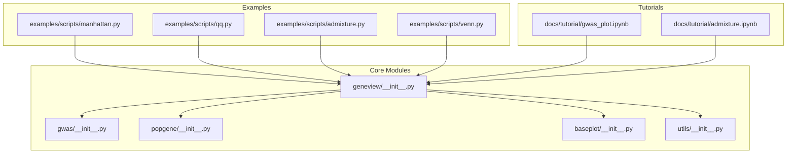
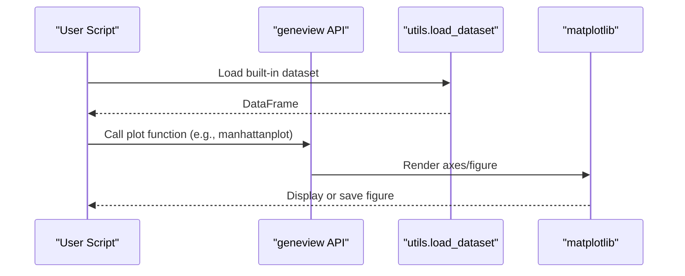
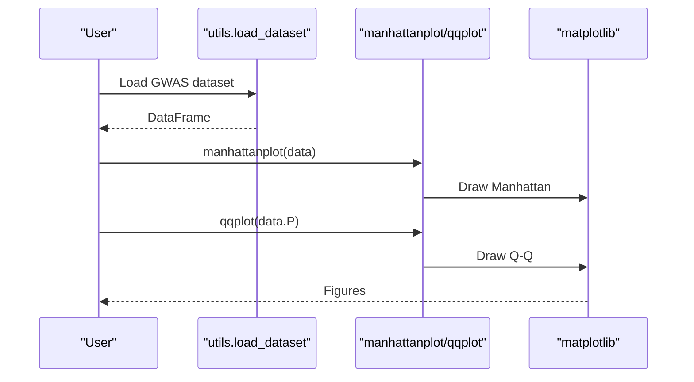
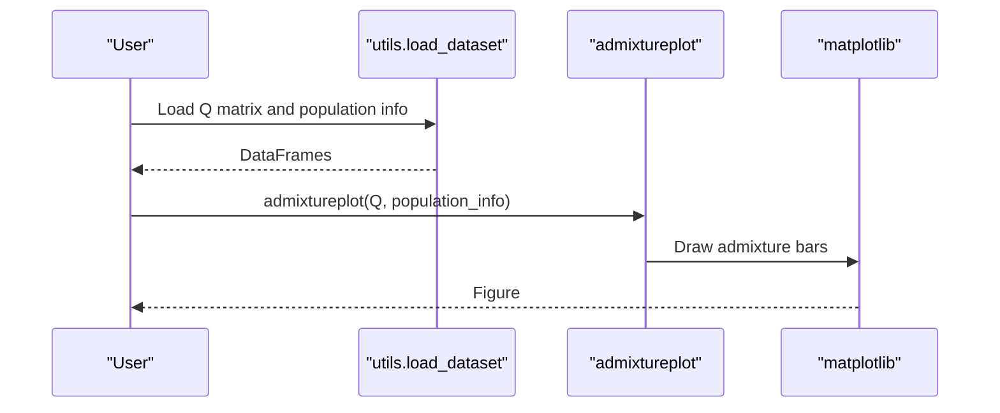
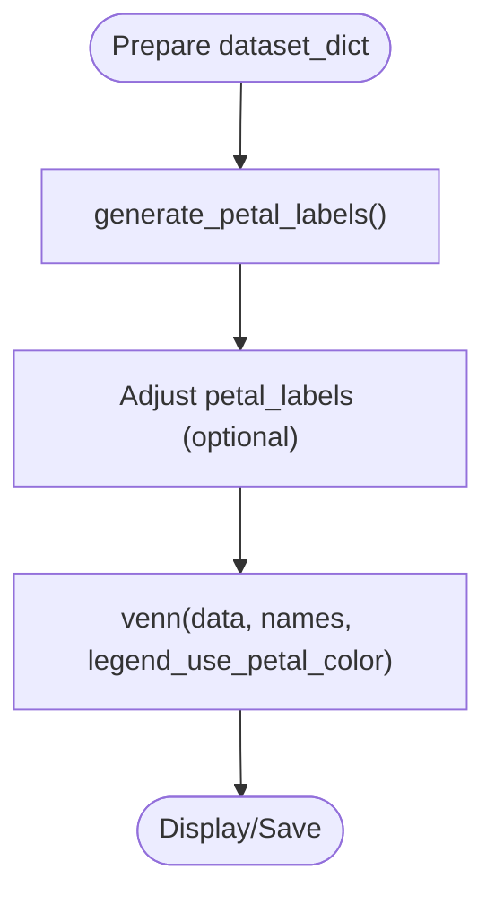
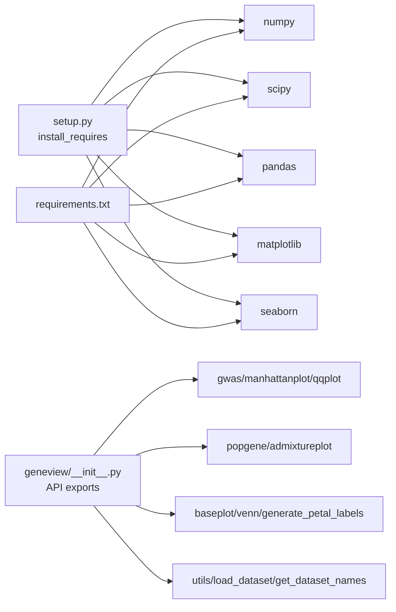
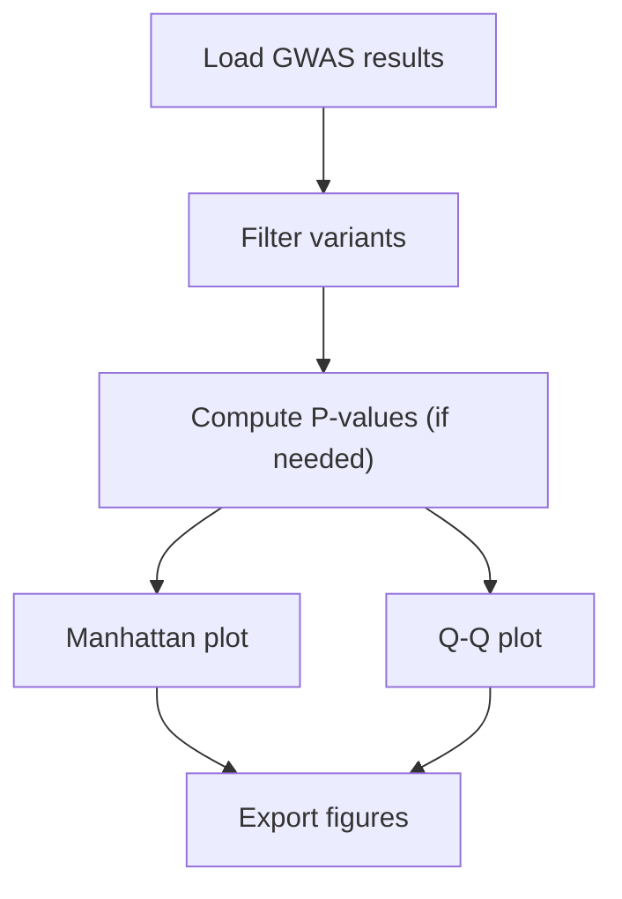

# Workflow Guides

<cite>
**Referenced Files in This Document**
- [README.md](file://README.md)
- [setup.py](file://setup.py)
- [requirements.txt](file://requirements.txt)
- [functions.md](file://functions.md)
- [geneview/__init__.py](file://geneview/__init__.py)
- [geneview/gwas/__init__.py](file://geneview/gwas/__init__.py)
- [geneview/popgene/__init__.py](file://geneview/popgene/__init__.py)
- [geneview/baseplot/__init__.py](file://geneview/baseplot/__init__.py)
- [geneview/utils/__init__.py](file://geneview/utils/__init__.py)
- [examples/scripts/manhattan.py](file://examples/scripts/manhattan.py)
- [examples/scripts/qq.py](file://examples/scripts/qq.py)
- [examples/scripts/admixture.py](file://examples/scripts/admixture.py)
- [examples/scripts/venn.py](file://examples/scripts/venn.py)
- [docs/tutorial/gwas_plot.ipynb](file://docs/tutorial/gwas_plot.ipynb)
- [docs/tutorial/admixture.ipynb](file://docs/tutorial/admixture.ipynb)
</cite>

## Table of Contents
1. [Introduction](#introduction)
2. [Project Structure](#project-structure)
3. [Core Components](#core-components)
4. [Architecture Overview](#architecture-overview)
5. [Detailed Component Analysis](#detailed-component-analysis)
6. [Dependency Analysis](#dependency-analysis)
7. [Performance Considerations](#performance-considerations)
8. [Troubleshooting Guide](#troubleshooting-guide)
9. [Conclusion](#conclusion)
10. [Appendices](#appendices)

## Introduction
This document provides comprehensive workflow guides for GeneView, focusing on end-to-end genomics visualization pipelines and best practices. It covers typical research workflows from data preprocessing through final visualization, including quality control, data formatting, and result interpretation. You will learn how to combine multiple GeneView functions into cohesive analysis pipelines, automate workflows, process batches efficiently, integrate with other bioinformatics tools, and adhere to reproducible research practices. Guidance is grounded in the repository’s example scripts, tutorials, and module APIs.

## Project Structure
GeneView organizes functionality by domain:
- gwas: Manhattan and Q-Q plots for GWAS results
- popgene: Admixture plots for population structure
- baseplot: Venn diagrams for set intersections
- utils: Dataset loading, helpers, and decorators
- examples/scripts: Minimal runnable scripts demonstrating each plot type
- docs/tutorial: Jupyter notebooks with extended tutorials and examples

**Diagram sources**
- [geneview/__init__.py:1-15](file://geneview/__init__.py#L1-L15)
- [geneview/gwas/__init__.py:1-3](file://geneview/gwas/__init__.py#L1-L3)
- [geneview/popgene/__init__.py:1-2](file://geneview/popgene/__init__.py#L1-L2)
- [geneview/baseplot/__init__.py:1-2](file://geneview/baseplot/__init__.py#L1-L2)
- [geneview/utils/__init__.py:1-20](file://geneview/utils/__init__.py#L1-L20)
- [examples/scripts/manhattan.py:1-14](file://examples/scripts/manhattan.py#L1-L14)
- [examples/scripts/qq.py:1-9](file://examples/scripts/qq.py#L1-L9)
- [examples/scripts/admixture.py:1-28](file://examples/scripts/admixture.py#L1-L28)
- [examples/scripts/venn.py:1-30](file://examples/scripts/venn.py#L1-L30)
- [docs/tutorial/gwas_plot.ipynb:1-327](file://docs/tutorial/gwas_plot.ipynb#L1-L327)
- [docs/tutorial/admixture.ipynb:1-436](file://docs/tutorial/admixture.ipynb#L1-L436)

**Section sources**
- [README.md:1-370](file://README.md#L1-L370)
- [geneview/__init__.py:1-15](file://geneview/__init__.py#L1-L15)
- [examples/scripts/manhattan.py:1-14](file://examples/scripts/manhattan.py#L1-L14)
- [examples/scripts/qq.py:1-9](file://examples/scripts/qq.py#L1-L9)
- [examples/scripts/admixture.py:1-28](file://examples/scripts/admixture.py#L1-L28)
- [examples/scripts/venn.py:1-30](file://examples/scripts/venn.py#L1-L30)
- [docs/tutorial/gwas_plot.ipynb:1-327](file://docs/tutorial/gwas_plot.ipynb#L1-L327)
- [docs/tutorial/admixture.ipynb:1-436](file://docs/tutorial/admixture.ipynb#L1-L436)

## Core Components
- gwas: Provides manhattanplot and qqplot for GWAS visualization.
- popgene: Provides admixtureplot for ancestry composition.
- baseplot: Provides venn and generate_petal_labels for set overlap visualization.
- utils: Provides load_dataset and get_dataset_names for accessing built-in datasets and helpers for plotting.

These components expose a clean API for building visualization pipelines and integrating with pandas/numpy/matplotlib/seaborn.

**Section sources**
- [geneview/gwas/__init__.py:1-3](file://geneview/gwas/__init__.py#L1-L3)
- [geneview/popgene/__init__.py:1-2](file://geneview/popgene/__init__.py#L1-L2)
- [geneview/baseplot/__init__.py:1-2](file://geneview/baseplot/__init__.py#L1-L2)
- [geneview/utils/__init__.py:1-20](file://geneview/utils/__init__.py#L1-L20)
- [README.md:12-21](file://README.md#L12-L21)

## Architecture Overview
The visualization pipeline follows a consistent pattern:
- Load or prepare data (often pandas DataFrame)
- Select appropriate plot function(s)
- Configure axes, legends, and styling
- Save or display figures

**Diagram sources**
- [examples/scripts/manhattan.py:1-14](file://examples/scripts/manhattan.py#L1-L14)
- [examples/scripts/qq.py:1-9](file://examples/scripts/qq.py#L1-L9)
- [examples/scripts/admixture.py:1-28](file://examples/scripts/admixture.py#L1-L28)
- [examples/scripts/venn.py:1-30](file://examples/scripts/venn.py#L1-L30)
- [docs/tutorial/gwas_plot.ipynb:1-327](file://docs/tutorial/gwas_plot.ipynb#L1-L327)
- [docs/tutorial/admixture.ipynb:1-436](file://docs/tutorial/admixture.ipynb#L1-L436)

## Detailed Component Analysis

### GWAS Manhattan and Q-Q Plots
Typical workflow:
- Load GWAS results (DataFrame with columns such as #CHROM, POS, P)
- Plot Manhattan and Q-Q to assess global distribution and significance
- Customize axes, thresholds, and styling for publication-ready figures

**Diagram sources**
- [docs/tutorial/gwas_plot.ipynb:1-327](file://docs/tutorial/gwas_plot.ipynb#L1-L327)
- [examples/scripts/manhattan.py:1-14](file://examples/scripts/manhattan.py#L1-L14)
- [examples/scripts/qq.py:1-9](file://examples/scripts/qq.py#L1-L9)

Best practices:
- Use rotation and tight layout for readable x-axis labels
- Highlight suggestive/genome-wide significance thresholds
- Annotate top SNPs and customize markers/colors
- Export high-resolution PDFs for publication

**Section sources**
- [README.md:43-240](file://README.md#L43-L240)
- [docs/tutorial/gwas_plot.ipynb:1-327](file://docs/tutorial/gwas_plot.ipynb#L1-L327)
- [examples/scripts/manhattan.py:1-14](file://examples/scripts/manhattan.py#L1-L14)
- [examples/scripts/qq.py:1-9](file://examples/scripts/qq.py#L1-L9)

### Admixture Plot
Typical workflow:
- Load Q matrix and population info
- Optionally reorder groups and adjust sampling
- Plot admixture composition per individual

**Diagram sources**
- [docs/tutorial/admixture.ipynb:1-436](file://docs/tutorial/admixture.ipynb#L1-L436)
- [examples/scripts/admixture.py:1-28](file://examples/scripts/admixture.py#L1-L28)

Best practices:
- Reorder populations to reflect scientific grouping
- Adjust edge width and label rotations for readability
- Use consistent palettes and legends

**Section sources**
- [README.md:242-286](file://README.md#L242-L286)
- [docs/tutorial/admixture.ipynb:1-436](file://docs/tutorial/admixture.ipynb#L1-L436)
- [examples/scripts/admixture.py:1-28](file://examples/scripts/admixture.py#L1-L28)

### Venn Diagrams
Typical workflow:
- Prepare a dictionary of named sets
- Generate petal labels and customize formatting
- Plot Venn diagrams for 2–6 sets

**Diagram sources**
- [examples/scripts/venn.py:1-30](file://examples/scripts/venn.py#L1-L30)
- [docs/tutorial/gwas_plot.ipynb:1-327](file://docs/tutorial/gwas_plot.ipynb#L1-L327)

Best practices:
- Use consistent color schemes across panels
- Prefer percentages or sizes in petal labels for interpretability
- Limit overlapping regions to maintain clarity

**Section sources**
- [README.md:289-335](file://README.md#L289-L335)
- [examples/scripts/venn.py:1-30](file://examples/scripts/venn.py#L1-L30)

### Karyotype Plot
Typical workflow:
- Load cytogenetic band file
- Plot karyotype with G-banding colors

Note: Karyotype plotting is available via the top-level API and is demonstrated in the repository.

**Section sources**
- [README.md:337-350](file://README.md#L337-L350)

## Dependency Analysis
- Runtime dependencies: numpy, scipy, pandas, matplotlib, seaborn
- Installation metadata and supported Python versions are declared in setup.py and README
- The package exposes a unified API surface through geneview/__init__.py

**Diagram sources**
- [setup.py:44-49](file://setup.py#L44-L49)
- [requirements.txt:1-6](file://requirements.txt#L1-L6)
- [geneview/__init__.py:1-15](file://geneview/__init__.py#L1-L15)

**Section sources**
- [setup.py:1-65](file://setup.py#L1-L65)
- [requirements.txt:1-6](file://requirements.txt#L1-L6)
- [README.md:351-370](file://README.md#L351-L370)
- [geneview/__init__.py:1-15](file://geneview/__init__.py#L1-L15)

## Performance Considerations
- Memory management for large datasets:
  - Use column selection and filtering prior to plotting (e.g., select only #CHROM, POS, P)
  - Downcast numeric dtypes if feasible
  - Avoid storing unnecessary intermediate DataFrames
- Rendering optimization:
  - Use vector formats (PDF/SVG) for publication-quality figures
  - Minimize repeated figure creation; reuse axes where possible
- Batch processing:
  - Iterate over trait or cohort lists and apply consistent styling
  - Parallelize independent analyses where safe (e.g., separate jobs per chromosome)
- Data I/O:
  - Prefer efficient formats and chunked reading for very large files
  - Cache frequently accessed datasets locally

[No sources needed since this section provides general guidance]

## Troubleshooting Guide
Common issues and resolutions:
- Empty or missing axes:
  - Verify column names match expected GWAS schema (#CHROM, POS, P)
  - Ensure data types are numeric for POS and P
- Overlapping x-axis labels:
  - Rotate labels and adjust figure width
  - Use xtick_label_set to constrain displayed chromosomes
- Color and legend mismatches:
  - Explicitly set palette and legend keywords
  - Confirm group ordering aligns with scientific expectations
- Large file rendering delays:
  - Reduce number of plotted points or filter by significance
  - Increase DPI only when necessary for export

**Section sources**
- [docs/tutorial/gwas_plot.ipynb:1-327](file://docs/tutorial/gwas_plot.ipynb#L1-L327)
- [examples/scripts/manhattan.py:1-14](file://examples/scripts/manhattan.py#L1-L14)
- [examples/scripts/admixture.py:1-28](file://examples/scripts/admixture.py#L1-L28)

## Conclusion
GeneView enables robust, reproducible genomics visualization pipelines. By leveraging built-in datasets, consistent APIs, and modular plotting functions, researchers can construct end-to-end workflows spanning QC, formatting, interactive exploration, and publication-ready figures. Adopt the best practices outlined here—standardized data formats, careful styling, and batch-friendly automation—to streamline reproducible research.

[No sources needed since this section summarizes without analyzing specific files]

## Appendices

### A. Typical Research Workflows

#### A.1 GWAS Quality Control and Visualization Pipeline
- Preprocessing:
  - Filter variants by call rate, MAF, Hardy–Weinberg equilibrium, and chromosome
  - Compute and adjust P-values if needed
- Visualization:
  - Manhattan: set suggestive/genome-wide thresholds, annotate top SNPs
  - Q-Q: assess distribution and genomic inflation
- Reporting:
  - Export figures in PDF/SVG; include method parameters and thresholds

**Diagram sources**
- [docs/tutorial/gwas_plot.ipynb:1-327](file://docs/tutorial/gwas_plot.ipynb#L1-L327)
- [examples/scripts/manhattan.py:1-14](file://examples/scripts/manhattan.py#L1-L14)
- [examples/scripts/qq.py:1-9](file://examples/scripts/qq.py#L1-L9)

#### A.2 Population Structure Workflow
- Preprocessing:
  - Align Q matrix and population info files
  - Reorder populations to reflect scientific grouping
- Visualization:
  - Admixture plot with adjusted edge width and label rotations
- Reporting:
  - Include group definitions and palette choices

**Section sources**
- [docs/tutorial/admixture.ipynb:1-436](file://docs/tutorial/admixture.ipynb#L1-L436)
- [examples/scripts/admixture.py:1-28](file://examples/scripts/admixture.py#L1-L28)

#### A.3 Set Overlap Workflow
- Preprocessing:
  - Define named sets (e.g., genes in traits A, B, C)
- Visualization:
  - Generate petal labels and customize formatting
- Reporting:
  - Include counts/percentages and color scheme

**Section sources**
- [examples/scripts/venn.py:1-30](file://examples/scripts/venn.py#L1-L30)

### B. Data Formats and File Organization
- GWAS:
  - Expected columns include #CHROM, POS, P, and optionally ID, REF, ALT, A1, TEST, OBS_CT, BETA, SE, T_STAT
- Admixture:
  - Q matrix: rows are samples, columns are ancestral populations
  - Population info: one column with group labels per sample
- Venn:
  - Dictionary mapping names to sets of identifiers
- Karyotype:
  - Banding file with chromosome coordinates and staining bands

**Section sources**
- [README.md:45-64](file://README.md#L45-L64)
- [docs/tutorial/admixture.ipynb:1-436](file://docs/tutorial/admixture.ipynb#L1-L436)

### C. Automation and Batch Strategies
- Loop over traits or cohorts and apply identical styling
- Use configuration files to parameterize thresholds and styles
- Integrate with job schedulers for multi-chromosome or multi-trait runs
- Cache intermediate results and figures to accelerate re-runs

[No sources needed since this section provides general guidance]

### D. Integration with Other Tools
- PLINK/PLINK2: produce GWAS outputs compatible with manhattanplot/qqplot
- ADMIXTURE: produce Q files compatible with admixtureplot
- BED/GFF/BAM/bigWig: leverage external tools for interval processing; visualize summaries with GeneView utilities

**Section sources**
- [functions.md:1-28](file://functions.md#L1-L28)