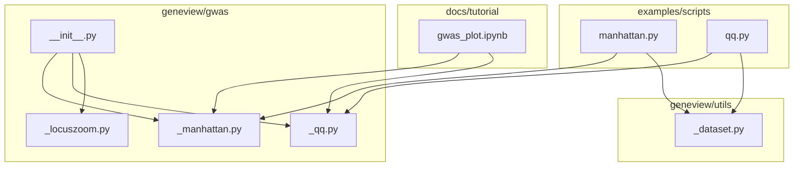
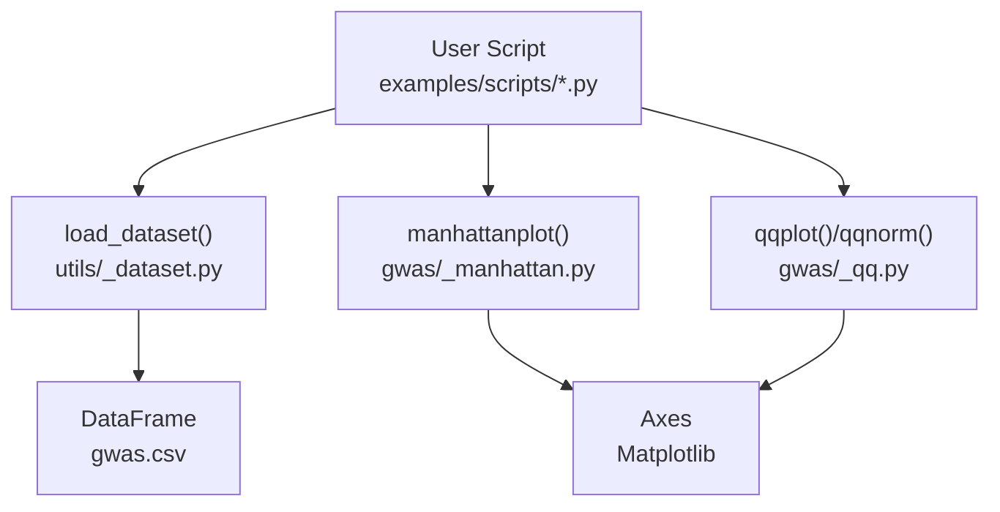
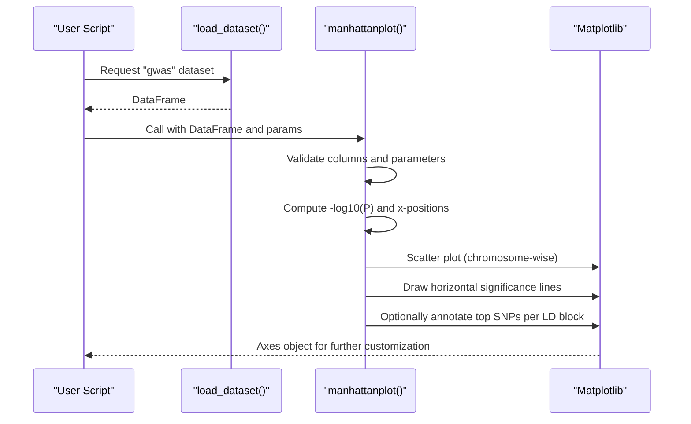
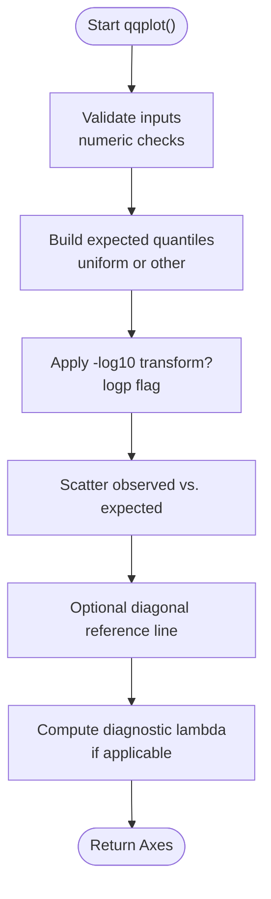
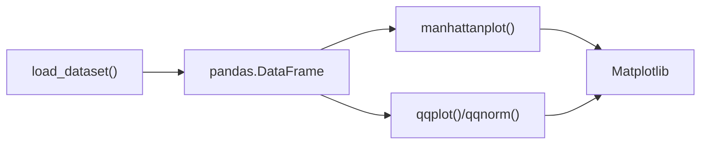

# GWAS Analysis Tools

<cite>
**Referenced Files in This Document**
- [README.md](file://README.md)
- [gwas/__init__.py](file://geneview/gwas/__init__.py)
- [gwas/_manhattan.py](file://geneview/gwas/_manhattan.py)
- [_manhattan.py (example)](file://examples/scripts/manhattan.py)
- [gwas/_qq.py](file://geneview/gwas/_qq.py)
- [_qq.py (example)](file://examples/scripts/qq.py)
- [gwas_plot.ipynb](file://docs/tutorial/gwas_plot.ipynb)
- [utils/_dataset.py](file://geneview/utils/_dataset.py)
</cite>

## Table of Contents
1. [Introduction](#introduction)
2. [Project Structure](#project-structure)
3. [Core Components](#core-components)
4. [Architecture Overview](#architecture-overview)
5. [Detailed Component Analysis](#detailed-component-analysis)
6. [Dependency Analysis](#dependency-analysis)
7. [Performance Considerations](#performance-considerations)
8. [Troubleshooting Guide](#troubleshooting-guide)
9. [Conclusion](#conclusion)
10. [Appendices](#appendices)

## Introduction
This document explains GeneView’s GWAS visualization tools with a focus on:
- Manhattan plot: chromosome positioning, -log10 scale, significance thresholds, SNP annotation, and zoom-in via single-chromosome mode.
- Q-Q plot: assessing P-value distribution and evaluating deviation from expectation under the null hypothesis.
- LocusZoom-style regional visualization: while GeneView does not include a native LocusZoom implementation, it provides the building blocks (data formats, plotting primitives) to construct region-focused views.

The goal is to help researchers integrate these tools into GWAS workflows, interpret results statistically, and customize visual outputs for publication-ready figures.

## Project Structure
GeneView organizes GWAS plotting functions under a dedicated module with supporting utilities for data loading and tutorials.

**Diagram sources**
- [gwas/__init__.py:1-3](file://geneview/gwas/__init__.py#L1-L3)
- [gwas/_manhattan.py:1-413](file://geneview/gwas/_manhattan.py#L1-L413)
- [gwas/_qq.py:1-366](file://geneview/gwas/_qq.py#L1-L366)
- [gwas/_locuszoom.py:1-2](file://geneview/gwas/_locuszoom.py#L1-L2)
- [examples/scripts/manhattan.py:1-14](file://examples/scripts/manhattan.py#L1-L14)
- [examples/scripts/qq.py:1-9](file://examples/scripts/qq.py#L1-L9)
- [docs/tutorial/gwas_plot.ipynb:1-327](file://docs/tutorial/gwas_plot.ipynb#L1-L327)
- [utils/_dataset.py:1-88](file://geneview/utils/_dataset.py#L1-L88)

**Section sources**
- [README.md:1-344](file://README.md#L1-L344)
- [gwas/__init__.py:1-3](file://geneview/gwas/__init__.py#L1-L3)

## Core Components
- Manhattan plot: renders genome-wide association signals with customizable thresholds, highlighting top SNPs per linkage disequilibrium (LD) block, and optional single-chromosome zoom.
- Q-Q plot: compares observed vs. expected -log10(P) under the null hypothesis, with a diagnostic lambda estimate.
- Regional visualization: GeneView does not include a LocusZoom-native renderer; however, the same data formats and plotting primitives enable constructing region-focused views.

Key references:
- Manhattan plot API and parameters: [gwas/_manhattan.py:21-208](file://geneview/gwas/_manhattan.py#L21-L208)
- Q-Q plot API and parameters: [gwas/_qq.py:62-212](file://geneview/gwas/_qq.py#L62-L212)
- Example usage notebooks and quick-start: [README.md:30-227](file://README.md#L30-L227), [docs/tutorial/gwas_plot.ipynb:1-327](file://docs/tutorial/gwas_plot.ipynb#L1-L327)

**Section sources**
- [gwas/_manhattan.py:21-208](file://geneview/gwas/_manhattan.py#L21-L208)
- [gwas/_qq.py:62-212](file://geneview/gwas/_qq.py#L62-L212)
- [README.md:30-227](file://README.md#L30-L227)
- [docs/tutorial/gwas_plot.ipynb:1-327](file://docs/tutorial/gwas_plot.ipynb#L1-L327)

## Architecture Overview
The GWAS plotting functions are thin wrappers around Matplotlib and NumPy/SciPy, designed to accept a pandas DataFrame and produce axes objects suitable for further customization or saving.

**Diagram sources**
- [examples/scripts/manhattan.py:1-14](file://examples/scripts/manhattan.py#L1-L14)
- [examples/scripts/qq.py:1-9](file://examples/scripts/qq.py#L1-L9)
- [utils/_dataset.py:22-67](file://geneview/utils/_dataset.py#L22-L67)
- [gwas/_manhattan.py:21-208](file://geneview/gwas/_manhattan.py#L21-L208)
- [gwas/_qq.py:62-212](file://geneview/gwas/_qq.py#L62-L212)

## Detailed Component Analysis

### Manhattan Plot
Manhattan plots display association statistics across chromosomes. GeneView supports:
- Chromosome positioning and alternating colors.
- -log10 scale for P-values by default.
- Horizontal significance thresholds (suggestive and genome-wide).
- Highlighting and annotating top SNPs within LD blocks.
- Single-chromosome zoom mode for regional views.

**Diagram sources**
- [gwas/_manhattan.py:21-335](file://geneview/gwas/_manhattan.py#L21-L335)
- [utils/_dataset.py:22-67](file://geneview/utils/_dataset.py#L22-L67)

Key parameters and behaviors:
- Data columns: defaults expect "#CHROM", "POS", "P", and optionally "ID"; configurable via keyword arguments.
- Scale: logp toggles -log10 transform of P-values.
- Thresholds: suggestiveline and genomewideline accept numeric thresholds or None to disable.
- Annotation: is_annotate_topsnp triggers top-SNP detection within LD blocks; ld_block_size controls block size.
- Single-chromosome zoom: CHR restricts to one chromosome and plots physical position on x-axis.
- Styling: marker, color, alpha, title, xlabel, ylabel, xtick_label_set, xticklabel_kws, hline_kws, text_kws.

Statistical interpretation:
- Suggestive threshold (~1e-5) indicates candidate loci requiring replication.
- Genome-wide threshold (~5e-8) corresponds to conservative significance in uncorrected analyses; multiple testing corrections (e.g., Bonferroni) often yield stricter thresholds.

Common use cases:
- Whole-genome QC and discovery: default parameters with rotated x-tick labels.
- Highlighting known hits: annotate top SNPs and customize colors/markers.
- Regional zoom: select a single chromosome and adjust x-axis limits.

Practical examples:
- Notebook-based examples and quick-start usage: [README.md:52-184](file://README.md#L52-L184), [docs/tutorial/gwas_plot.ipynb:289-327](file://docs/tutorial/gwas_plot.ipynb#L289-L327), [examples/scripts/manhattan.py:1-14](file://examples/scripts/manhattan.py#L1-L14)

**Section sources**
- [gwas/_manhattan.py:21-208](file://geneview/gwas/_manhattan.py#L21-L208)
- [gwas/_manhattan.py:209-335](file://geneview/gwas/_manhattan.py#L209-L335)
- [README.md:52-184](file://README.md#L52-L184)
- [docs/tutorial/gwas_plot.ipynb:289-327](file://docs/tutorial/gwas_plot.ipynb#L289-L327)
- [examples/scripts/manhattan.py:1-14](file://examples/scripts/manhattan.py#L1-L14)

### Q-Q Plot
Q-Q plots compare observed vs. expected -log10(P) under the null hypothesis. GeneView provides:
- qqplot: compares data to uniform distribution (default) or another dataset.
- qqnorm: compares normalized data to a standard normal distribution.

**Diagram sources**
- [gwas/_qq.py:62-212](file://geneview/gwas/_qq.py#L62-L212)

Parameters:
- data: array-like of P-values.
- other: optional second dataset for comparison.
- logp: apply -log10 to P-values on both axes.
- ablinecolor: color of reference line; None disables.
- Styling: marker, color, alpha, title, xlabel, ylabel, kwargs passed to scatter.

Statistical interpretation:
- Points near the diagonal indicate agreement with the null hypothesis.
- Curvature upward at high expected P indicates polygenic inflation; lambda estimate quantifies this.
- Deviations from the diagonal may reflect population stratification, cryptic relatedness, or true associations.

Common use cases:
- Assessing global test validity and inflation prior to correction.
- Comparing distributions across datasets or conditions.

Practical examples:
- Notebook-based examples and quick-start usage: [README.md:187-226](file://README.md#L187-L226), [docs/tutorial/gwas_plot.ipynb:1-327](file://docs/tutorial/gwas_plot.ipynb#L1-L327), [examples/scripts/qq.py:1-9](file://examples/scripts/qq.py#L1-L9)

**Section sources**
- [gwas/_qq.py:62-212](file://geneview/gwas/_qq.py#L62-L212)
- [README.md:187-226](file://README.md#L187-L226)
- [docs/tutorial/gwas_plot.ipynb:1-327](file://docs/tutorial/gwas_plot.ipynb#L1-L327)
- [examples/scripts/qq.py:1-9](file://examples/scripts/qq.py#L1-L9)

### LocusZoom-style Regional Visualization
GeneView does not include a native LocusZoom renderer. However, the same GWAS data formats and plotting primitives enable constructing region-focused views:
- Use manhattanplot with CHR and restricted x-limits to “zoom” into a genomic region.
- Overlay summary statistics (e.g., local LD, gene annotations) using Matplotlib primitives atop the returned axes.

Implementation notes:
- Data format: standard GWAS summary stats with columns for chromosome, position, and P-value.
- Region selection: specify a single chromosome and adjust x-axis limits to the desired window.
- Annotation: add gene tracks, LD blocks, or custom overlays using Matplotlib’s axes methods.

[No sources needed since this section describes conceptual usage without mapping to specific source files]

## Dependency Analysis
- Input data: pandas DataFrame with required columns (#CHROM, POS, P, optional ID).
- Core libraries: NumPy, SciPy, Matplotlib, pandas.
- Utilities: load_dataset fetches public example datasets for demos.

**Diagram sources**
- [gwas/_manhattan.py:21-208](file://geneview/gwas/_manhattan.py#L21-L208)
- [gwas/_qq.py:62-212](file://geneview/gwas/_qq.py#L62-L212)
- [utils/_dataset.py:22-67](file://geneview/utils/_dataset.py#L22-L67)

**Section sources**
- [README.md:324-339](file://README.md#L324-L339)
- [utils/_dataset.py:22-67](file://geneview/utils/_dataset.py#L22-L67)

## Performance Considerations
- Large-scale plotting: Matplotlib rendering can be slow for very large DataFrames. Consider filtering to autosomes or limiting to top hits for exploratory plots.
- Memory footprint: storing intermediate arrays (x, y, c) scales linearly with the number of variants. For massive datasets, pre-aggregate or downsample.
- Threshold computation: computing -log10(P) is O(n); avoid repeated transforms by passing precomputed values if needed.
- Annotation: top-SNP detection and LD-block indexing add overhead; disable is_annotate_topsnp for speed.

[No sources needed since this section provides general guidance]

## Troubleshooting Guide
Common issues and resolutions:
- Zero-size array errors: ensure input DataFrame is non-empty and contains required columns.
- Wrong column names: align column names with chrom, pos, pv, snp parameters.
- Mutually exclusive parameters: CHR and xtick_label_set cannot be used together.
- Single-chromosome mode pitfalls: when CHR is set, x-axis becomes physical position; avoid combining with xtick_label_set.
- P-values out of range: ensure P-values are in (0, 1]; otherwise -log10 transform yields invalid values.

References:
- Parameter validation and error messages: [gwas/_manhattan.py:209-222](file://geneview/gwas/_manhattan.py#L209-L222)
- Single-chromosome mode and x-axis behavior: [gwas/_manhattan.py:318-324](file://geneview/gwas/_manhattan.py#L318-L324)

**Section sources**
- [gwas/_manhattan.py:209-222](file://geneview/gwas/_manhattan.py#L209-L222)
- [gwas/_manhattan.py:318-324](file://geneview/gwas/_manhattan.py#L318-L324)

## Conclusion
GeneView’s GWAS tools provide robust, flexible plotting primitives for interpreting genome-wide association studies:
- Manhattan plots support whole-genome scans, custom thresholds, and regional zooming.
- Q-Q plots enable quality assessment and diagnostic lambda estimation.
- While a native LocusZoom renderer is not included, the same data formats and Matplotlib primitives allow constructing region-focused views tailored to downstream analysis.

These components integrate seamlessly into typical GWAS workflows, from QC and discovery to targeted regional exploration and publication-grade figure production.

[No sources needed since this section summarizes without analyzing specific files]

## Appendices

### Data Formats and Column Specifications
- Required columns:
  - #CHROM: chromosome identifier (character).
  - POS: chromosomal position (numeric).
  - P: association P-value (numeric).
  - ID: variant identifier (optional; used for SNP annotation).
- Example dataset loading and preview: [README.md:32-51](file://README.md#L32-L51), [utils/_dataset.py:22-67](file://geneview/utils/_dataset.py#L22-L67)

**Section sources**
- [README.md:32-51](file://README.md#L32-L51)
- [utils/_dataset.py:22-67](file://geneview/utils/_dataset.py#L22-L67)

### Practical Examples and Tutorials
- Quick-start and examples:
  - Manhattan plot: [README.md:52-184](file://README.md#L52-L184), [docs/tutorial/gwas_plot.ipynb:289-327](file://docs/tutorial/gwas_plot.ipynb#L289-L327), [examples/scripts/manhattan.py:1-14](file://examples/scripts/manhattan.py#L1-L14)
  - Q-Q plot: [README.md:187-226](file://README.md#L187-L226), [docs/tutorial/gwas_plot.ipynb:1-327](file://docs/tutorial/gwas_plot.ipynb#L1-L327), [examples/scripts/qq.py:1-9](file://examples/scripts/qq.py#L1-L9)

**Section sources**
- [README.md:52-226](file://README.md#L52-L226)
- [docs/tutorial/gwas_plot.ipynb:1-327](file://docs/tutorial/gwas_plot.ipynb#L1-L327)
- [examples/scripts/manhattan.py:1-14](file://examples/scripts/manhattan.py#L1-L14)
- [examples/scripts/qq.py:1-9](file://examples/scripts/qq.py#L1-L9)