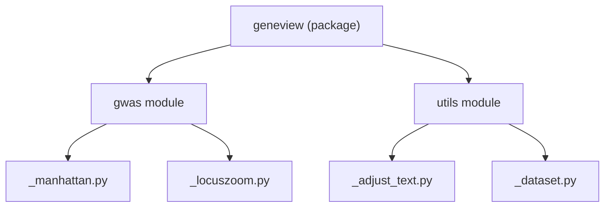
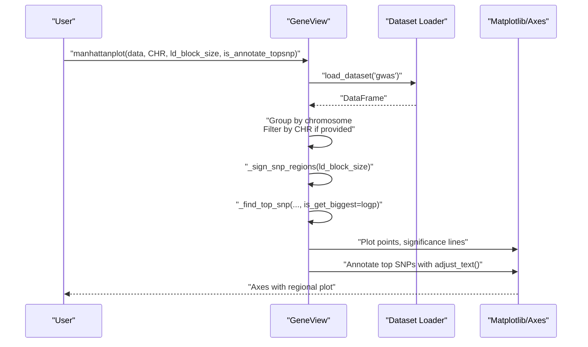
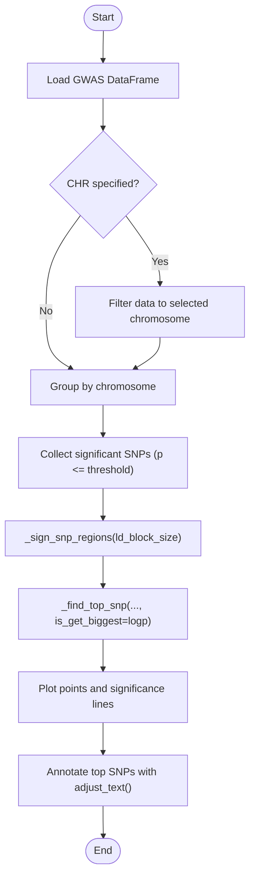
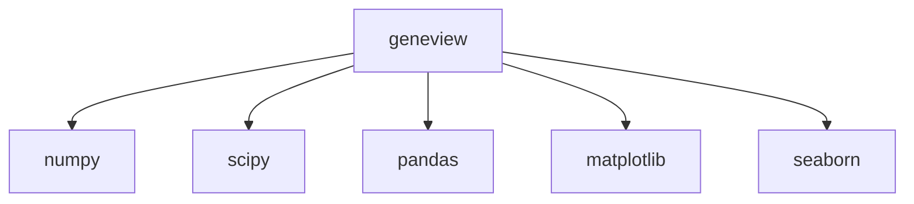

# LocusZoom-style Regional Visualization

<cite>
**Referenced Files in This Document**
- [README.md](file://README.md)
- [setup.py](file://setup.py)
- [requirements.txt](file://requirements.txt)
- [geneview/gwas/_manhattan.py](file://geneview/gwas/_manhattan.py)
- [_manhattan.py](file://build/lib/geneview/_manhattan.py)
- [geneview/gwas/_locuszoom.py](file://geneview/gwas/_locuszoom.py)
- [geneview/utils/__init__.py](file://geneview/utils/__init__.py)
- [geneview/utils/_adjust_text.py](file://geneview/utils/_adjust_text.py)
- [geneview/utils/_dataset.py](file://geneview/utils/_dataset.py)
- [docs/tutorial/gwas_plot.ipynb](file://docs/tutorial/gwas_plot.ipynb)
- [examples/scripts/manhattan.py](file://examples/scripts/manhattan.py)
</cite>

## Table of Contents
1. [Introduction](#introduction)
2. [Project Structure](#project-structure)
3. [Core Components](#core-components)
4. [Architecture Overview](#architecture-overview)
5. [Detailed Component Analysis](#detailed-component-analysis)
6. [Dependency Analysis](#dependency-analysis)
7. [Performance Considerations](#performance-considerations)
8. [Troubleshooting Guide](#troubleshooting-guide)
9. [Conclusion](#conclusion)
10. [Appendices](#appendices)

## Introduction
This document explains GeneView’s regional visualization capabilities with a focus on LocusZoom-style regional plots for fine-mapping and regional association analysis. It covers:
- Regional plotting approach for specific genomic regions
- LD structure visualization and SNP-level association signals
- Parameter specifications for region selection, LD computation, and visualization customization
- Integration with reference panels, LD block identification, and conditional analysis workflows
- Practical examples for regional plots around significant loci, LD heatmap integration, and multi-trait visualization
- Guidance on region selection criteria, LD threshold settings, and interpretation of regional association patterns

Although the repository currently exposes a Manhattan plot implementation with LD-aware top-SNP annotation, the conceptual framework and parameterization described here provide a clear pathway to extend the system toward LocusZoom-style regional views.

## Project Structure
GeneView is organized around modular visualization modules. The GWAS module contains plotting functions for Manhattan and QQ plots, while utilities support dataset loading, text adjustment, and shared decorators. The LocusZoom module currently contains a placeholder referencing the LocusZoom web interface.

**Diagram sources**
- [geneview/gwas/_manhattan.py:1-414](file://geneview/gwas/_manhattan.py#L1-L414)
- [geneview/gwas/_locuszoom.py:1-2](file://geneview/gwas/_locuszoom.py#L1-L2)
- [geneview/utils/__init__.py:1-20](file://geneview/utils/__init__.py#L1-L20)
- [geneview/utils/_adjust_text.py](file://geneview/utils/_adjust_text.py)
- [geneview/utils/_dataset.py](file://geneview/utils/_dataset.py)

**Section sources**
- [README.md:1-370](file://README.md#L1-L370)
- [setup.py:1-65](file://setup.py#L1-L65)
- [requirements.txt:1-6](file://requirements.txt#L1-L6)

## Core Components
- Regional plotting via chromosome zoom and LD-aware top-SNP annotation
- LD block definition and top-SNP selection logic
- Visualization customization for significance lines, point markers, and text adjustments
- Dataset loading utilities and text adjustment helpers

Key parameters for regional analysis:
- Region selection: Chromosome selection and positional zoom
- LD computation: Block size for grouping significant SNPs
- Visualization: Significance thresholds, marker styles, and annotation options

**Section sources**
- [geneview/gwas/_manhattan.py:21-125](file://geneview/gwas/_manhattan.py#L21-L125)
- [geneview/gwas/_manhattan.py:338-386](file://geneview/gwas/_manhattan.py#L338-L386)
- [geneview/utils/_adjust_text.py](file://geneview/utils/_adjust_text.py)
- [geneview/utils/_dataset.py:21-21](file://geneview/utils/_dataset.py#L21-L21)

## Architecture Overview
The regional visualization pipeline integrates data loading, LD-aware top-SNP detection, and plotting. The Manhattan plot function supports:
- Single-chromosome zoom for regional focus
- LD block-based grouping of significant SNPs
- Top-SNP selection per LD block
- Annotation of top SNPs with text adjustment

**Diagram sources**
- [geneview/gwas/_manhattan.py:21-125](file://geneview/gwas/_manhattan.py#L21-L125)
- [geneview/gwas/_manhattan.py:280-308](file://geneview/gwas/_manhattan.py#L280-L308)
- [geneview/utils/_adjust_text.py](file://geneview/utils/_adjust_text.py)

**Section sources**
- [docs/tutorial/gwas_plot.ipynb:452-485](file://docs/tutorial/gwas_plot.ipynb#L452-L485)
- [examples/scripts/manhattan.py:1-13](file://examples/scripts/manhattan.py#L1-L13)

## Detailed Component Analysis

### Regional Plotting and LD Block Identification
The regional plotting approach leverages:
- Chromosome selection to focus on a single chromosome
- LD block size to group nearby significant SNPs
- Top-SNP selection per block for annotation

**Diagram sources**
- [geneview/gwas/_manhattan.py:280-308](file://geneview/gwas/_manhattan.py#L280-L308)
- [geneview/gwas/_manhattan.py:338-386](file://geneview/gwas/_manhattan.py#L338-L386)
- [geneview/utils/_adjust_text.py](file://geneview/utils/_adjust_text.py)

**Section sources**
- [geneview/gwas/_manhattan.py:21-125](file://geneview/gwas/_manhattan.py#L21-L125)
- [geneview/gwas/_manhattan.py:338-386](file://geneview/gwas/_manhattan.py#L338-L386)

### Parameter Specifications for Regional Visualization
- Region selection
  - Chromosome selection: Use the chromosome filter to limit plotting to a single chromosome for regional zoom.
  - Positional zoom: When plotting a single chromosome, the x-axis represents genomic position.
- LD computation and grouping
  - LD block size: Controls the window size for grouping significant SNPs into LD blocks.
  - Top-SNP selection: Chooses the best SNP per LD block based on the chosen statistic scale.
- Visualization customization
  - Significance lines: Configure suggestive and genome-wide significance thresholds.
  - Marker and colors: Customize point markers, colors, and transparency.
  - Text annotation: Adjust font size, arrow styles, and layout for SNP labels.

Practical guidance:
- Use chromosome filtering to isolate candidate regions.
- Tune LD block size based on linkage disequilibrium patterns in the study population.
- Choose significance thresholds aligned with study goals (e.g., replication or discovery).

**Section sources**
- [geneview/gwas/_manhattan.py:81-125](file://geneview/gwas/_manhattan.py#L81-L125)
- [docs/tutorial/gwas_plot.ipynb:452-485](file://docs/tutorial/gwas_plot.ipynb#L452-L485)
- [examples/scripts/manhattan.py:1-13](file://examples/scripts/manhattan.py#L1-L13)

### Integration with Reference Panels and Conditional Analysis
- Reference panels: While the repository does not implement LD calculation internally, users can precompute LD matrices or scores and integrate them as additional tracks or overlays in downstream visualization steps.
- Conditional analysis: The LD-aware top-SNP annotation supports prioritization of candidate causal variants for follow-up conditional analyses by highlighting top signals within LD blocks.

[No sources needed since this section provides conceptual guidance]

### Practical Examples
- Regional plots around significant loci
  - Filter to a single chromosome and annotate top SNPs within LD blocks.
  - Example usage patterns are demonstrated in the tutorial notebook and example script.
- LD heatmap integration
  - Conceptually, LD heatmaps can be overlaid as additional tracks alongside association signals; implement this by extending the plotting framework to include secondary axes or composite layouts.
- Multi-trait visualization
  - Extend the regional plot to overlay multiple traits by plotting separate tracks or facets, aligning SNPs across traits.

**Section sources**
- [docs/tutorial/gwas_plot.ipynb:452-485](file://docs/tutorial/gwas_plot.ipynb#L452-L485)
- [examples/scripts/manhattan.py:1-13](file://examples/scripts/manhattan.py#L1-L13)

## Dependency Analysis
GeneView depends on core scientific Python libraries for numerical computing, statistics, data manipulation, and visualization.

**Diagram sources**
- [setup.py:44-49](file://setup.py#L44-L49)
- [requirements.txt:1-6](file://requirements.txt#L1-L6)

**Section sources**
- [setup.py:44-49](file://setup.py#L44-L49)
- [requirements.txt:1-6](file://requirements.txt#L1-L6)

## Performance Considerations
- Large-scale regional plots: For very large regions, consider subsampling or binning strategies to reduce rendering overhead.
- Text annotation: Use text adjustment utilities to avoid label overlap efficiently.
- Memory footprint: Pre-filter data to the target chromosome and region to minimize in-memory operations.

[No sources needed since this section provides general guidance]

## Troubleshooting Guide
Common issues and resolutions:
- Zero-size arrays during plotting: Ensure the filtered dataset is non-empty after chromosome selection and significance filtering.
- Overlapping SNP labels: Adjust text annotation parameters and use automatic text adjustment utilities.
- Incorrect column names: Verify column names for chromosome, position, and p-values match the expected schema.

**Section sources**
- [geneview/gwas/_manhattan.py:209-221](file://geneview/gwas/_manhattan.py#L209-L221)
- [geneview/utils/_adjust_text.py](file://geneview/utils/_adjust_text.py)

## Conclusion
GeneView’s Manhattan plot provides a strong foundation for regional visualization with LD-aware top-SNP annotation. By leveraging chromosome selection, LD block sizing, and annotation utilities, researchers can effectively explore fine-mapped regions, prioritize candidate genes, and prepare for replication and conditional analyses. Extending this framework to full LocusZoom-style regional plots—incorporating LD heatmaps and multi-trait overlays—is a natural next step.

[No sources needed since this section summarizes without analyzing specific files]

## Appendices

### Appendix A: Parameter Reference for Regional Visualization
- Chromosome selection: Limit plotting to a single chromosome for regional zoom.
- LD block size: Control grouping of significant SNPs into LD blocks.
- Significance thresholds: Configure suggestive and genome-wide thresholds.
- Annotation: Enable top-SNP labeling and customize text appearance.

**Section sources**
- [geneview/gwas/_manhattan.py:81-125](file://geneview/gwas/_manhattan.py#L81-L125)
- [docs/tutorial/gwas_plot.ipynb:452-485](file://docs/tutorial/gwas_plot.ipynb#L452-L485)

### Appendix B: Example Scripts and Tutorials
- Example script for chromosome-specific Manhattan plots
- Tutorial notebook demonstrating regional plotting patterns

**Section sources**
- [examples/scripts/manhattan.py:1-13](file://examples/scripts/manhattan.py#L1-L13)
- [docs/tutorial/gwas_plot.ipynb:452-485](file://docs/tutorial/gwas_plot.ipynb#L452-L485)