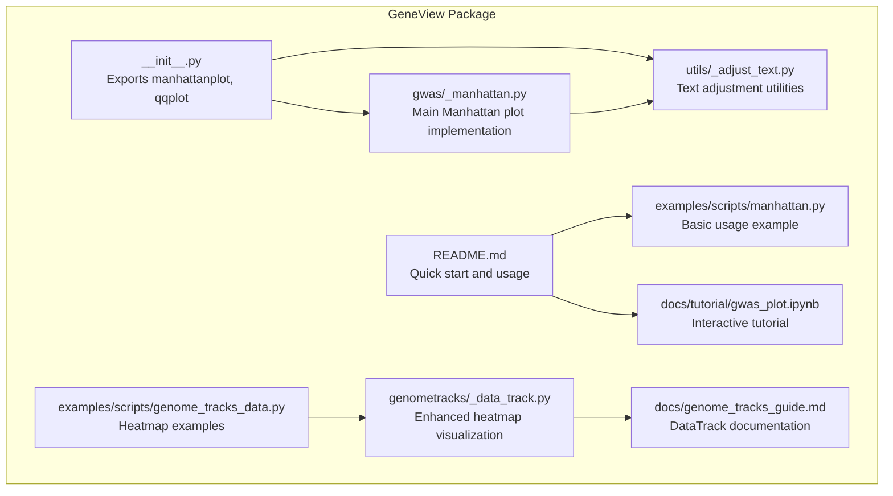
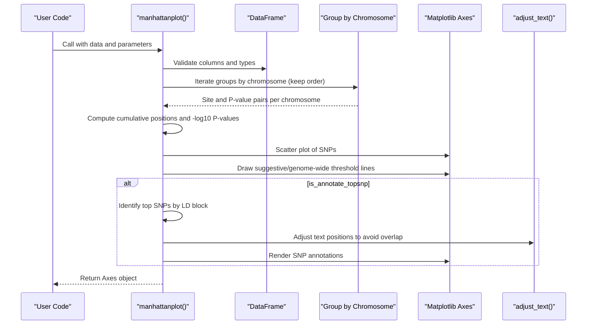
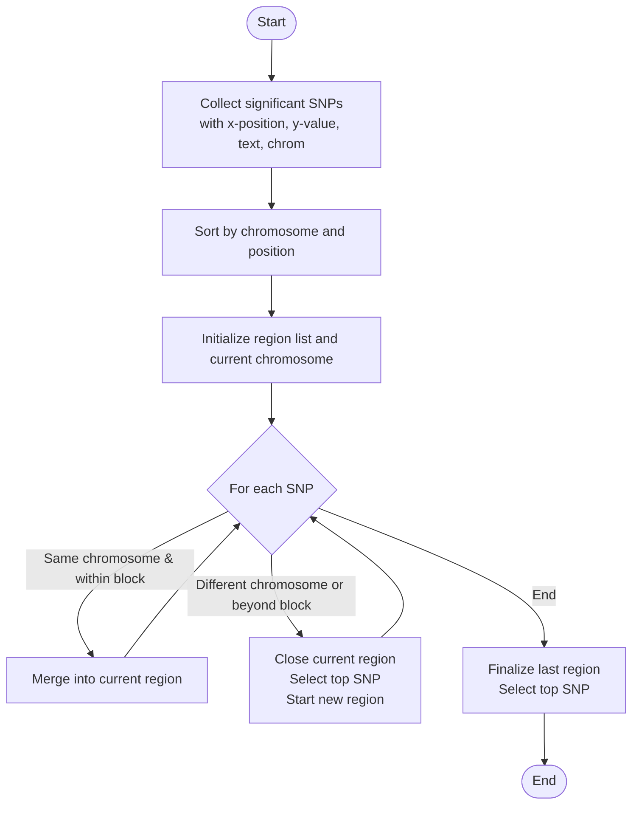
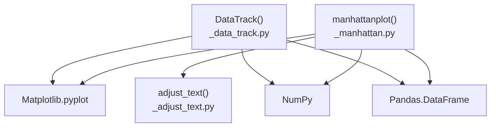

# Manhattan Plot Visualization

<cite>
**Referenced Files in This Document**
- [_manhattan.py](file://geneview/gwas/_manhattan.py)
- [_adjust_text.py](file://geneview/utils/_adjust_text.py)
- [README.md](file://README.md)
- [examples/scripts/manhattan.py](file://examples/scripts/manhattan.py)
- [docs/tutorial/gwas_plot.ipynb](file://docs/tutorial/gwas_plot.ipynb)
- [__init__.py](file://geneview/__init__.py)
- [_data_track.py](file://geneview/genometracks/_data_track.py)
- [genome_tracks_guide.md](file://docs/genome_tracks_guide.md)
- [examples/scripts/genome_tracks_data.py](file://examples/scripts/genome_tracks_data.py)
</cite>

## Update Summary
**Changes Made**
- Added new section documenting DataTrack heatmap visualization enhancements
- Updated DataTrack parameter specifications to include new separator parameter
- Enhanced color scheme documentation with sequential blue gradient matching Gviz
- Added practical examples of heatmap usage with separator and sample naming
- Updated parameter tables to reflect new DataTrack capabilities

## Table of Contents
1. [Introduction](#introduction)
2. [Project Structure](#project-structure)
3. [Core Components](#core-components)
4. [Architecture Overview](#architecture-overview)
5. [Detailed Component Analysis](#detailed-component-analysis)
6. [Enhanced DataTrack Heatmap Visualization](#enhanced-datatrack-heatmap-visualization)
7. [Dependency Analysis](#dependency-analysis)
8. [Performance Considerations](#performance-considerations)
9. [Troubleshooting Guide](#troubleshooting-guide)
10. [Conclusion](#conclusion)

## Introduction
This document provides comprehensive documentation for GeneView's Manhattan plot functionality, focusing on genome-wide association study (GWAS) visualization. The Manhattan plot displays genetic association statistics across chromosomes, enabling researchers to identify potential disease-associated loci. This guide explains chromosome positioning algorithms, -log10 P-value scaling, significance threshold lines (suggestive line at 1e-5, genome-wide significance at 5e-8), and SNP annotation capabilities. It also documents parameter specifications for data column mapping, color customization, marker styling, text annotation options, selective chromosome plotting, LD block analysis for top SNP identification, and interactive text adjustment. Practical examples demonstrate basic plots, customized styling, threshold customization, and integration with GWAS workflow pipelines. Common use cases, statistical interpretations, and performance considerations for large genomic datasets are addressed.

**Updated** Enhanced with comprehensive DataTrack heatmap visualization capabilities including sequential blue gradient color schemes and improved row separation features.

## Project Structure
GeneView organizes its GWAS visualization components within the `gwas` module, with the Manhattan plot implemented in `_manhattan.py`. Supporting utilities for automatic text adjustment are located in `utils/_adjust_text.py`. The package exposes public APIs through `__init__.py`, making `manhattanplot` and related functions available to users. Example scripts and tutorials demonstrate usage patterns and advanced configurations.



**Diagram sources**
- [__init__.py:7-7](file://geneview/__init__.py#L7-L7)
- [_manhattan.py:21-27](file://geneview/gwas/_manhattan.py#L21-L27)
- [_adjust_text.py:439-759](file://geneview/utils/_adjust_text.py#L439-L759)
- [README.md:30-184](file://README.md#L30-L184)
- [examples/scripts/manhattan.py:1-14](file://examples/scripts/manhattan.py#L1-L14)
- [docs/tutorial/gwas_plot.ipynb:1-327](file://docs/tutorial/gwas_plot.ipynb#L1-L327)
- [_data_track.py:1-591](file://geneview/genometracks/_data_track.py#L1-L591)
- [genome_tracks_guide.md:730-929](file://docs/genome_tracks_guide.md#L730-L929)
- [examples/scripts/genome_tracks_data.py:40-125](file://examples/scripts/genome_tracks_data.py#L40-L125)

**Section sources**
- [README.md:1-344](file://README.md#L1-L344)
- [__init__.py:1-15](file://geneview/__init__.py#L1-L15)

## Core Components
- Manhattan plot function: Implements chromosome positioning, -log10 P-value scaling, significance thresholds, SNP highlighting, and top SNP annotation with LD block analysis.
- Text adjustment utility: Provides automatic positioning of SNP labels to minimize overlap and improve readability.
- Public API exposure: Makes `manhattanplot` available via the package namespace.
- **Updated** DataTrack heatmap visualization: Enhanced with sequential blue gradient color scheme matching Gviz, improved row separation capabilities, and expanded parameter support.

Key responsibilities:
- Data validation and parameter mapping for chromosome, position, P-value, and optional SNP identifiers.
- Chromosome ordering and cumulative position calculation for linear chromosome layout.
- Threshold line rendering for suggestive and genome-wide significance levels.
- LD block-based top SNP detection and annotation with interactive text adjustment.
- Single-chromosome zoom mode for targeted region visualization.
- **Updated** Sequential blue gradient color mapping for heatmap visualizations.
- **Updated** Row separator functionality for improved sample distinction in multi-sample heatmaps.

**Section sources**
- [_manhattan.py:21-335](file://geneview/gwas/_manhattan.py#L21-L335)
- [_adjust_text.py:439-759](file://geneview/utils/_adjust_text.py#L439-L759)
- [__init__.py:7-7](file://geneview/__init__.py#L7-L7)
- [_data_track.py:392-440](file://geneview/genometracks/_data_track.py#L392-L440)

## Architecture Overview
The Manhattan plot pipeline integrates data processing, visualization rendering, and interactive text adjustment. The main function orchestrates chromosome grouping, coordinate computation, scatter plotting, threshold line drawing, and optional top SNP annotation.



**Diagram sources**
- [_manhattan.py:21-335](file://geneview/gwas/_manhattan.py#L21-L335)
- [_adjust_text.py:439-759](file://geneview/utils/_adjust_text.py#L439-L759)

## Detailed Component Analysis

### Manhattan Plot Function (`manhattanplot`)
The `manhattanplot` function creates a Manhattan plot from GWAS summary statistics. It supports flexible data column mapping, customizable styling, and advanced annotation features.

- Data column mapping:
  - Chromosome column: defaults to "#CHROM"; must be character type.
  - Position column: defaults to "POS"; must be numeric.
  - P-value column: defaults to "P"; must be float type.
  - SNP identifier column: defaults to "ID"; optional for annotation.

- Scaling and visualization:
  - `-log10` P-value scaling controlled by `logp` parameter.
  - Scatter marker customization via `marker` and `alpha`.
  - Color customization via `color` (supports hex codes or matplotlib color names).
  - Axis labels and title configurable via `xlabel`, `ylabel`, and `title`.

- Threshold lines:
  - Suggestive line at `-log10(1e-5)` when `suggestiveline` is not None.
  - Genome-wide significance line at `-log10(5e-8)` when `genomewideline` is not None.
  - Line colors controlled by `sign_line_cols`; additional line properties via `hline_kws`.

- SNP highlighting and annotation:
  - Significant SNP highlighting via `sign_marker_p` and `sign_marker_color`.
  - Top SNP annotation per LD block when `is_annotate_topsnp=True`.
  - Interactive text adjustment via `text_kws` passed to `adjust_text`.

- Selective chromosome plotting:
  - Single chromosome mode via `CHR` parameter; disables `xtick_label_set`.
  - X-axis displays physical position on selected chromosome.

- Advanced features:
  - LD block size for top SNP identification via `ld_block_size`.
  - Additional Matplotlib scatter properties via `**kwargs`.

Algorithm highlights:
- Chromosome grouping preserves input order; cumulative positions computed to avoid overlap.
- Significance markers color-coded based on threshold.
- Top SNP detection groups SNPs by chromosome and LD block, selecting the most extreme P-value within each block.

**Section sources**
- [_manhattan.py:21-335](file://geneview/gwas/_manhattan.py#L21-L335)
- [_manhattan.py:338-413](file://geneview/gwas/_manhattan.py#L338-L413)

#### LD Block Analysis for Top SNP Identification
The LD block analysis identifies top SNPs within genomic regions to reduce redundancy and highlight the most significant variant per locus.

- Region creation:
  - Regions are constructed around significant SNPs with radius `ld_block_size`.
  - Adjacent SNPs within the same chromosome and within the block radius are merged into the same region.

- Top SNP selection:
  - Within each region, the SNP with the most extreme P-value (most significant) is selected as the representative top SNP.
  - The selection respects the `is_get_biggest` flag for `-log10` P-values.

- Overlap detection:
  - All SNPs within the computed regions are identified and highlighted.



**Diagram sources**
- [_manhattan.py:338-386](file://geneview/gwas/_manhattan.py#L338-L386)
- [_manhattan.py:389-413](file://geneview/gwas/_manhattan.py#L389-L413)

**Section sources**
- [_manhattan.py:338-413](file://geneview/gwas/_manhattan.py#L338-L413)

#### Interactive Text Adjustment (`adjust_text`)
The `adjust_text` utility minimizes label overlap and improves readability by iteratively adjusting text positions.

Key capabilities:
- Automatic alignment optimization to keep labels inside axes boundaries.
- Repulsion forces from other texts, data points, and additional objects.
- Configurable expansion multipliers and convergence criteria.
- Optional arrow annotations linking labels to their source points.

Parameters impacting Manhattan plots:
- `force_points`: Controls repulsion strength from plotted SNPs.
- `avoid_points`: Toggle repulsion from data points.
- `expand_text`: Expansion factor for text bounding boxes during overlap checks.
- `precision`: Convergence threshold for overlap sums.
- `lim`: Maximum iterations for adjustment.

**Section sources**
- [_adjust_text.py:439-759](file://geneview/utils/_adjust_text.py#L439-L759)

### Parameter Specifications and Usage Patterns
Common parameter combinations and their effects:

- Basic plot with default styling:
  - Uses PLINK2.x column names by default; renders -log10 P-values with suggestive and genome-wide threshold lines.

- Customized styling:
  - Modify marker shape and transparency via `marker` and `alpha`.
  - Customize colors via `color` and `sign_line_cols`.
  - Control axis labels and title via `xlabel`, `ylabel`, and `title`.

- Threshold customization:
  - Disable or relocate threshold lines via `suggestiveline` and `genomewideline`.
  - Style lines via `hline_kws`.

- SNP annotation:
  - Highlight significant SNPs via `sign_marker_p` and `sign_marker_color`.
  - Enable top SNP annotation with `is_annotate_topsnp` and configure via `text_kws`.

- Selective chromosome plotting:
  - Limit visualization to a single chromosome via `CHR`.
  - Disables `xtick_label_set` to show physical positions.

- Integration with GWAS workflows:
  - Load example datasets via `load_dataset("gwas")`.
  - Combine with QQ plots and other visualizations for comprehensive analysis.

**Section sources**
- [README.md:30-184](file://README.md#L30-L184)
- [examples/scripts/manhattan.py:1-14](file://examples/scripts/manhattan.py#L1-L14)
- [docs/tutorial/gwas_plot.ipynb:1-327](file://docs/tutorial/gwas_plot.ipynb#L1-L327)

## Enhanced DataTrack Heatmap Visualization

**Updated** GeneView now provides enhanced DataTrack heatmap visualization capabilities with improved color schemes and row separation features.

### Color Scheme Enhancements
The DataTrack heatmap now features a sequential blue gradient color scheme that matches Gviz's default palette:

- **Default Color Map**: Uses matplotlib's "Blues" colormap by default
- **Color Range**: White (low values) to dark blue `#08306B` (high values)
- **Gradient Matching**: Directly corresponds to Gviz's `colorRampPalette(brewer.pal(9, "Blues"))`
- **Customizable**: Users can specify alternative colormap names via `heatmap_cmap` parameter

### Row Separation Features
Enhanced row separation capabilities for improved multi-sample visualization:

- **Separator Parameter**: New `separator` parameter controls spacing between heatmap rows
- **Visual Separators**: Draws white lines between sample rows when `separator > 0`
- **Pixel-Based Control**: Separator width is specified in pixels for precise control
- **Background Matching**: Separator color automatically matches the panel background

### Parameter Specifications for DataTrack Heatmap

| Parameter | Default | Description |
|-----------|---------|-------------|
| `type` | `"line"` | Set to `"heatmap"` for heatmap visualization |
| `show_sample_names` | `False` | Show sample names on y-axis (Gviz default: `FALSE`) |
| `separator` | `0` | Separator line width between heatmap rows (0=none) |
| `heatmap_cmap` | `"Blues"` | Colormap name for color scheme (matches Gviz) |
| `ncolor` | `100` | Number of discrete colors in gradient |

### Practical Examples

#### Basic Heatmap with Sample Names
```python
# Create multi-sample heatmap with row separators
dtrack_heat = DataTrack(heat_data, type="heatmap", name="Heatmap",
                       show_sample_names=True, separator=2)
```

#### Custom Color Scheme
```python
# Use alternative blue gradient
dtrack_custom = DataTrack(data, type="heatmap", 
                         heatmap_cmap="Blues_r",  # Reverse blue gradient
                         ncolor=50)
```

#### Enhanced Visualization with Grid Lines
```python
# Combine heatmap with custom display parameters
dtrack_enhanced = DataTrack(heat_data, type="heatmap",
                          show_sample_names=True,
                          separator=1,
                          display_params={"grid": True, "col_grid": "#CCCCCC"})
```

### Implementation Details

The enhanced heatmap implementation includes:

1. **Sequential Blue Gradient**: Uses matplotlib's Blues colormap for intuitive value representation
2. **Row Separation Logic**: Draws horizontal lines between sample rows when separator > 0
3. **Sample Name Display**: Automatically shows sample names on y-axis when enabled
4. **Background Matching**: Separator lines match the panel background color
5. **Gviz Compatibility**: Maintains full compatibility with Gviz's color scheme conventions

**Section sources**
- [_data_track.py:392-440](file://geneview/genometracks/_data_track.py#L392-L440)
- [genome_tracks_guide.md:730-929](file://docs/genome_tracks_guide.md#L730-L929)
- [examples/scripts/genome_tracks_data.py:40-125](file://examples/scripts/genome_tracks_data.py#L40-L125)

## Dependency Analysis
The Manhattan plot relies on core libraries and internal utilities:

- Matplotlib: Rendering scatter plots and axes elements.
- NumPy: Numerical operations for -log10 scaling and array computations.
- Pandas: Data validation and grouping operations.
- Internal text adjustment utility: Enhances label placement and readability.
- **Updated** Enhanced DataTrack module: Provides advanced heatmap visualization capabilities.



**Diagram sources**
- [_manhattan.py:12-17](file://geneview/gwas/_manhattan.py#L12-L17)
- [_adjust_text.py:8-14](file://geneview/utils/_adjust_text.py#L8-L14)
- [_data_track.py:10-19](file://geneview/genometracks/_data_track.py#L10-L19)

**Section sources**
- [_manhattan.py:12-17](file://geneview/gwas/_manhattan.py#L12-L17)
- [_adjust_text.py:8-14](file://geneview/utils/_adjust_text.py#L8-L14)
- [_data_track.py:10-19](file://geneview/genometracks/_data_track.py#L10-L19)

## Performance Considerations
- Large-scale datasets:
  - The plot scales linearly with the number of SNPs; consider subsetting for extremely large datasets.
  - Use `CHR` to focus on specific chromosomes and reduce rendering overhead.

- Memory efficiency:
  - Grouping by chromosome avoids repeated sorting; ensure input data is ordered appropriately to minimize overhead.

- Rendering optimization:
  - Prefer vectorized operations for -log10 scaling and coordinate calculations.
  - Limit label annotations to regions of interest to reduce computational cost.

- Interactive adjustments:
  - Adjust `precision` and `lim` in `adjust_text` to balance quality and speed for dense plots.

- **Updated** DataTrack heatmap performance:
  - Heatmap rendering uses efficient `imshow` operations for large matrices.
  - Row separator lines are drawn as simple horizontal lines for minimal overhead.
  - Color normalization is optimized to handle edge cases where min equals max.

## Troubleshooting Guide
Common issues and resolutions:

- Input validation errors:
  - Ensure required columns ("#CHROM", "POS", "P") are present and correctly typed.
  - Verify that `CHR` and `xtick_label_set` are not used simultaneously.

- Zero-size arrays:
  - Occurs when no SNPs meet filtering criteria; check `sign_marker_p` thresholds and chromosome selection.

- Unexpected chromosome ordering:
  - The function preserves input order; ensure data is pre-sorted by chromosome if needed.

- Overlapping labels:
  - Increase `ld_block_size` to merge more SNPs into top SNP regions.
  - Adjust `text_kws` parameters in `adjust_text` to improve label placement.

- Single-chromosome mode:
  - When `CHR` is set, `xtick_label_set` is ignored; use `xlabel` to reflect the selected chromosome.

- **Updated** DataTrack heatmap issues:
  - Heatmap appears blank: verify that value columns contain numeric data and are not all NaN.
  - Separator lines not visible: ensure `separator > 0` and panel background color is not white.
  - Color scheme not matching expectations: check `heatmap_cmap` parameter and matplotlib colormap availability.

**Section sources**
- [_manhattan.py:209-221](file://geneview/gwas/_manhattan.py#L209-L221)
- [_manhattan.py:269-272](file://geneview/gwas/_manhattan.py#L269-L272)
- [_data_track.py:392-440](file://geneview/genometracks/_data_track.py#L392-L440)

## Conclusion
GeneView's Manhattan plot provides a robust, customizable framework for GWAS visualization. Its chromosome positioning algorithm, -log10 P-value scaling, threshold line rendering, and LD block-based top SNP annotation enable comprehensive interpretation of genome-wide association results. With flexible parameterization, interactive text adjustment, and integration with other visualization tools, it supports efficient exploration of genetic associations across diverse datasets and research workflows.

**Updated** The enhanced DataTrack heatmap visualization further extends GeneView's capabilities by providing professional-grade genomic data visualization with Gviz-compatible color schemes, improved multi-sample presentation through row separators, and seamless integration with the broader GeneView ecosystem. These enhancements make GeneView an even more comprehensive solution for genomic data analysis and visualization needs.