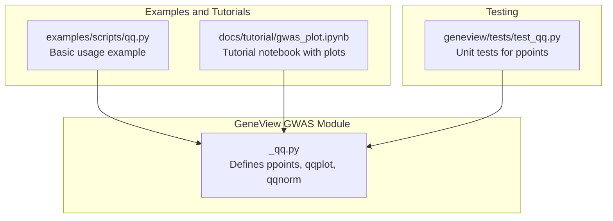
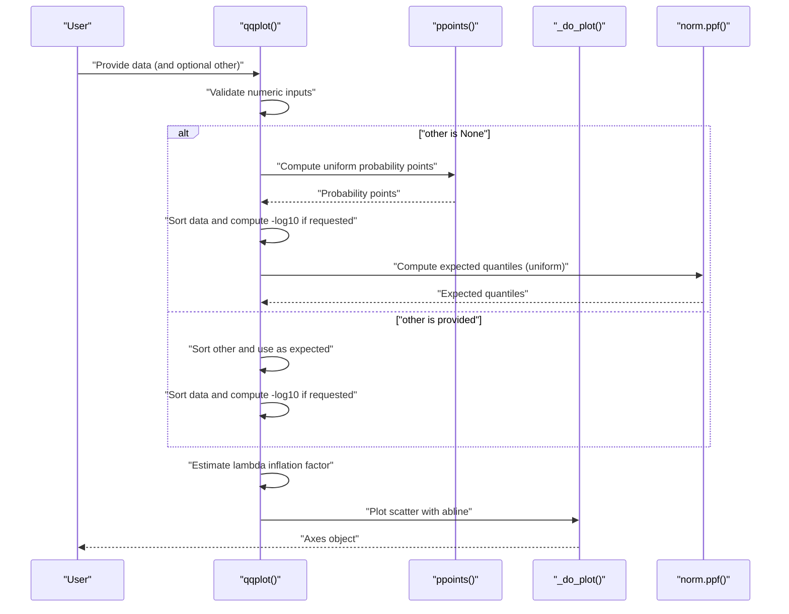
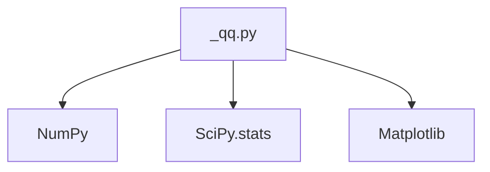

# Q-Q Plot Analysis

<cite>
**Referenced Files in This Document**
- [_qq.py](file://geneview/gwas/_qq.py)
- [qq.py](file://examples/scripts/qq.py)
- [gwas_plot.ipynb](file://docs/tutorial/gwas_plot.ipynb)
- [test_qq.py](file://geneview/tests/test_qq.py)
</cite>

## Table of Contents
1. [Introduction](#introduction)
2. [Project Structure](#project-structure)
3. [Core Components](#core-components)
4. [Architecture Overview](#architecture-overview)
5. [Detailed Component Analysis](#detailed-component-analysis)
6. [Dependency Analysis](#dependency-analysis)
7. [Performance Considerations](#performance-considerations)
8. [Troubleshooting Guide](#troubleshooting-guide)
9. [Conclusion](#conclusion)
10. [Appendices](#appendices)

## Introduction
This document provides comprehensive technical and practical documentation for GeneView's Q-Q plot functionality designed for P-value distribution analysis in Genome-Wide Association Studies (GWAS). It explains the theoretical versus observed P-value comparison methodology, the computation of the genomic control lambda inflation factor, and how the implementation integrates with GWAS quality control workflows. The guide covers parameter specifications for data input formatting, plot customization options, statistical significance assessment, interpretation of deviations from the diagonal line, inflation factors, and heterogeneity detection. Practical examples demonstrate basic Q-Q plots, customized styling, statistical annotations, and integration with broader GWAS visualization workflows.

## Project Structure
GeneView organizes Q-Q plotting functionality within the GWAS module. The primary implementation resides in the `_qq.py` file, which exposes functions for generating Q-Q plots for P-values and related distributions. Example scripts and tutorials illustrate usage patterns and integration with GWAS datasets.

**Diagram sources**
- [_qq.py:1-366](file://geneview/gwas/_qq.py#L1-L366)
- [qq.py:1-9](file://examples/scripts/qq.py#L1-L9)
- [gwas_plot.ipynb:1-711](file://docs/tutorial/gwas_plot.ipynb#L1-L711)
- [test_qq.py:1-46](file://geneview/tests/test_qq.py#L1-L46)

**Section sources**
- [_qq.py:1-366](file://geneview/gwas/_qq.py#L1-L366)
- [qq.py:1-9](file://examples/scripts/qq.py#L1-L9)
- [gwas_plot.ipynb:1-711](file://docs/tutorial/gwas_plot.ipynb#L1-L711)
- [test_qq.py:1-46](file://geneview/tests/test_qq.py#L1-L46)

## Core Components
- ppoints: Generates probability points for quantile computations using the R-style formula, supporting both default and small-sample offsets.
- qqplot: Creates Q-Q plots for P-values against theoretical uniform quantiles, optionally plotting against another dataset; automatically computes and annotates the genomic control lambda inflation factor.
- qqnorm: Produces Q-Q plots against the normal distribution for general distribution checking.

Key implementation characteristics:
- Input validation ensures numeric arrays.
- Automatic computation of lambda inflation factor via median-based estimator.
- Flexible customization via matplotlib parameters (markers, colors, transparency, axes, and abline color).
- Optional -log10 transformation of P-values for improved visualization.

**Section sources**
- [_qq.py:14-59](file://geneview/gwas/_qq.py#L14-L59)
- [_qq.py:62-212](file://geneview/gwas/_qq.py#L62-L212)
- [_qq.py:215-309](file://geneview/gwas/_qq.py#L215-L309)

## Architecture Overview
The Q-Q plotting pipeline follows a modular design:
- Data preparation: Validation and sorting of input arrays.
- Quantile generation: Probability points computed via ppoints; expected quantiles derived from uniform distribution or an external dataset.
- Transformation: Optional -log10 transformation of P-values.
- Estimation: Lambda inflation factor computed using the median-based estimator.
- Visualization: Scatter plot with diagonal reference line and customizable styling.

**Diagram sources**
- [_qq.py:62-212](file://geneview/gwas/_qq.py#L62-L212)
- [_qq.py:14-59](file://geneview/gwas/_qq.py#L14-L59)
- [_qq.py:312-365](file://geneview/gwas/_qq.py#L312-L365)

## Detailed Component Analysis

### Function: ppoints
Computes probability points for quantile calculations using the R-style formula:
- Formula: (rank - a) / (n + 1 - 2a)
- Supports offset parameter `a` with recommended defaults for small samples.

Usage implications:
- Ensures ordered, continuous probability values in (0, 1) suitable for quantile interpolation.
- Validates that `a` lies within (0, 1); raises an error otherwise.

**Section sources**
- [_qq.py:14-59](file://geneview/gwas/_qq.py#L14-L59)

### Function: qqplot
Core function for generating Q-Q plots tailored to GWAS P-values:
- Input validation: Ensures numeric arrays; raises errors for non-numeric entries or mismatched sizes.
- Expected quantiles: Defaults to uniform distribution via ppoints; can compare against another dataset.
- Transformation: Applies -log10 to P-values by default for GWAS convention.
- Lambda estimation: Computes genomic control lambda inflation factor using the median-based estimator and appends it to the plot title.
- Visualization: Uses a scatter plot with a diagonal reference line; supports extensive matplotlib customization.

Customization options:
- Marker styles, colors, transparency, axis objects, and abline color.
- Titles and axis labels; default labels adapt based on whether theoretical or empirical expected quantiles are used.

Statistical annotation:
- Automatically computes and displays lambda inflation factor in the plot title.

Integration with GWAS workflows:
- Designed for P-values from association tests; supports comparisons against another dataset for methodological checks.

**Section sources**
- [_qq.py:62-212](file://geneview/gwas/_qq.py#L62-L212)

### Function: qqnorm
Produces Q-Q plots against the normal distribution:
- Normalizes input data to zero mean and unit variance prior to plotting.
- Uses normal quantile function to generate expected values.
- Useful for general distribution diagnostics beyond GWAS P-values.

**Section sources**
- [_qq.py:215-309](file://geneview/gwas/_qq.py#L215-L309)

### Lambda Inflation Factor Computation
The genomic control lambda estimator implemented in qqplot:
- Method: Median-based estimator using the standard normal quantile function applied to transformed P-values.
- Denominator constant: Uses the median of the chi-squared distribution with one degree of freedom under the null hypothesis.
- Annotation: The computed lambda value is rounded to three decimal places and appended to the plot title.

Interpretation:
- λ ≈ 1 indicates no genomic control inflation.
- λ > 1 suggests inflation (e.g., population stratification, cryptic relatedness).
- λ significantly greater than 1 warrants further investigation and potential correction strategies.

**Section sources**
- [_qq.py:201-202](file://geneview/gwas/_qq.py#L201-L202)

### Example Usage Patterns
- Basic Q-Q plot: Load a GWAS dataset and pass P-values to qqplot.
- Customized styling: Adjust markers, colors, transparency, axis labels, and abline color.
- Comparison plots: Supply a second dataset to compare observed versus expected quantiles directly.

Practical references:
- Basic usage example script demonstrates loading a GWAS dataset and generating a Q-Q plot.
- Tutorial notebook illustrates integration with broader GWAS visualization workflows.

**Section sources**
- [qq.py:1-9](file://examples/scripts/qq.py#L1-L9)
- [gwas_plot.ipynb:613-630](file://docs/tutorial/gwas_plot.ipynb#L613-L630)

## Dependency Analysis
The Q-Q plotting module depends on:
- NumPy for numerical operations and array handling.
- SciPy stats for probability and quantile functions.
- Matplotlib for plotting.

**Diagram sources**
- [_qq.py:7-11](file://geneview/gwas/_qq.py#L7-L11)

**Section sources**
- [_qq.py:7-11](file://geneview/gwas/_qq.py#L7-L11)

## Performance Considerations
- Sorting and quantile computations scale with O(n log n) due to sorting operations.
- Vectorized NumPy operations minimize Python overhead.
- Lambda computation involves median estimation and is efficient for typical GWAS sample sizes.
- For very large datasets, consider subsampling or pre-aggregation strategies if memory becomes constrained.

## Troubleshooting Guide
Common issues and resolutions:
- Non-numeric inputs: Ensure all P-values and comparison arrays contain numeric data; the function validates inputs and raises explicit errors for invalid entries.
- Mismatched array sizes: When supplying a second dataset, ensure lengths match the primary dataset.
- Unexpected axis labels: Default labels adapt based on whether theoretical or empirical expected quantiles are used; customize labels explicitly if needed.
- Lambda annotation: If lambda appears unexpected, verify P-values are valid and within (0, 1]; confirm -log10 transformation is appropriate for your data representation.
- Plot appearance: Adjust marker, color, alpha, and abline color to improve visibility and aesthetics.

Validation references:
- Unit tests for ppoints validate monotonicity, bounds, and formula correctness.

**Section sources**
- [_qq.py:168-174](file://geneview/gwas/_qq.py#L168-L174)
- [test_qq.py:17-46](file://geneview/tests/test_qq.py#L17-L46)

## Conclusion
GeneView’s Q-Q plot functionality provides a robust, validated toolkit for GWAS P-value distribution analysis. It integrates seamlessly with GWAS workflows, offers flexible customization, and includes automated lambda inflation estimation for detecting genomic control issues. By following the guidelines in this document, users can confidently interpret Q-Q plots, diagnose potential biases, and incorporate Q-Q analysis into broader quality control procedures.

## Appendices

### Parameter Specifications and Options
- data: Array-like containing P-values; must be numeric.
- other: Optional; array-like for comparison quantiles; must match data length if provided.
- logp: Boolean; applies -log10 transformation to P-values for visualization.
- ax: Matplotlib axis object; uses current axis if not provided.
- marker, color, alpha: Matplotlib styling options for scatter plot.
- title, xlabel, ylabel: Text customization for plot metadata.
- ablinecolor: Color for the diagonal reference line; set to None to suppress.
- Additional kwargs: Passed to the underlying scatter plot rendering.

**Section sources**
- [_qq.py:62-212](file://geneview/gwas/_qq.py#L62-L212)

### Statistical Significance Assessment
- Use the lambda inflation factor to assess global genomic control:
  - λ ≈ 1: No evidence of inflation.
  - λ > 1: Evidence of inflation; investigate population stratification or cryptic relatedness.
- Deviations from the diagonal line:
  - Above the line at low observed -log10(P): enrichment of small P-values.
  - Below the line at high observed -log10(P): deficit of small P-values.
- Combine with Manhattan plots and locus zooms for fine-mapping and prioritization.

**Section sources**
- [_qq.py:201-202](file://geneview/gwas/_qq.py#L201-L202)

### Practical Examples Index
- Basic Q-Q plot: [examples/scripts/qq.py:1-9](file://examples/scripts/qq.py#L1-L9)
- Tutorial integration: [docs/tutorial/gwas_plot.ipynb:613-630](file://docs/tutorial/gwas_plot.ipynb#L613-L630)