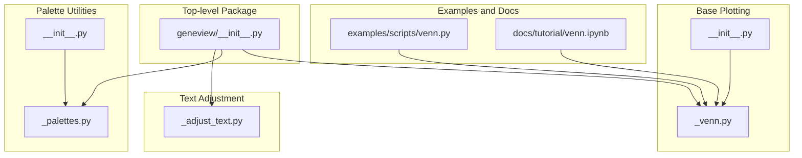
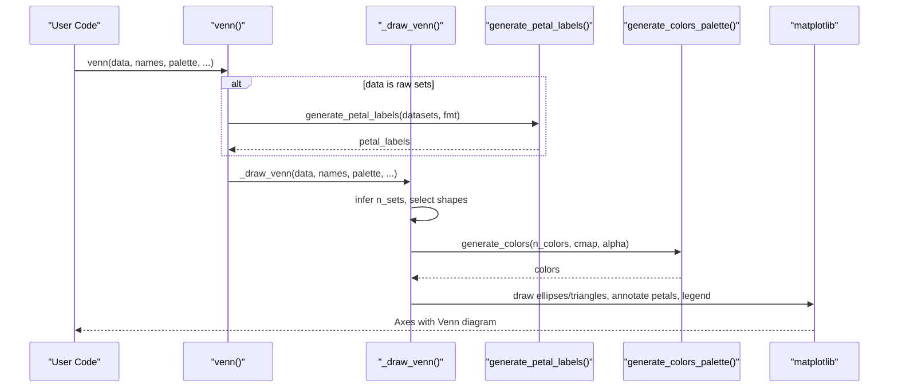
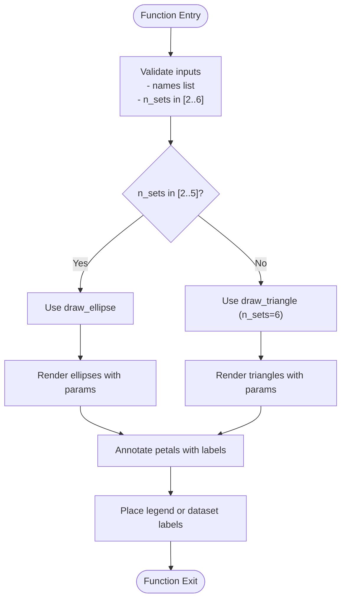
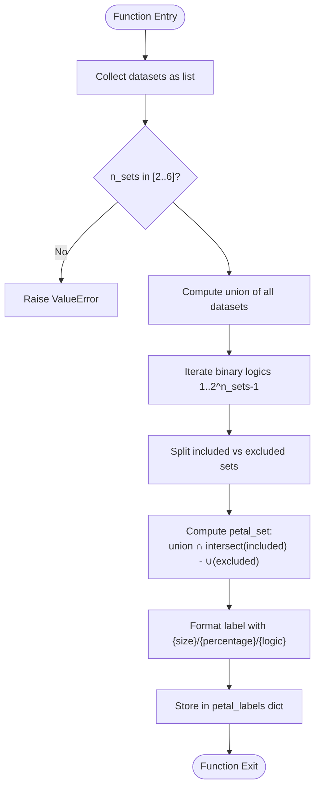
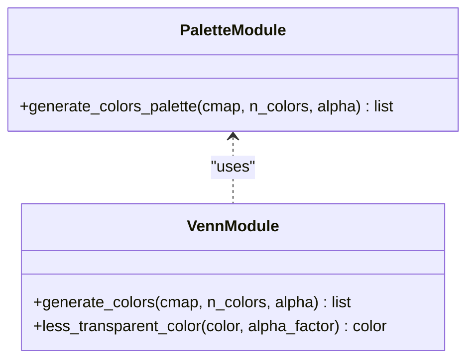
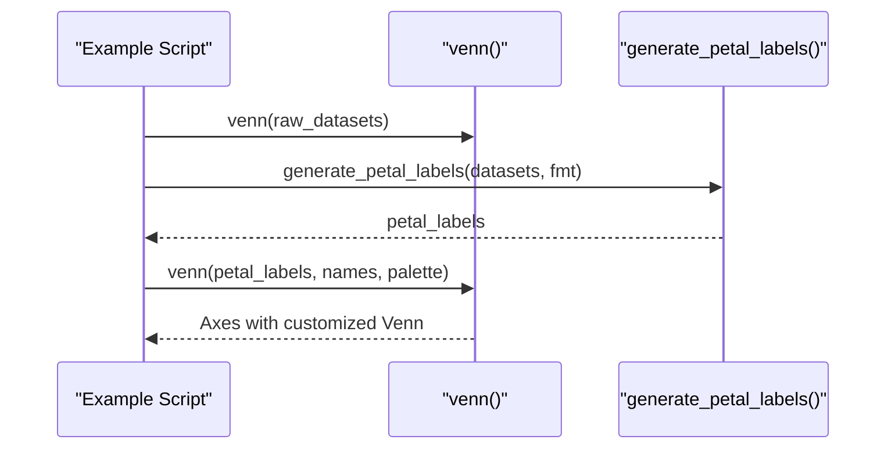
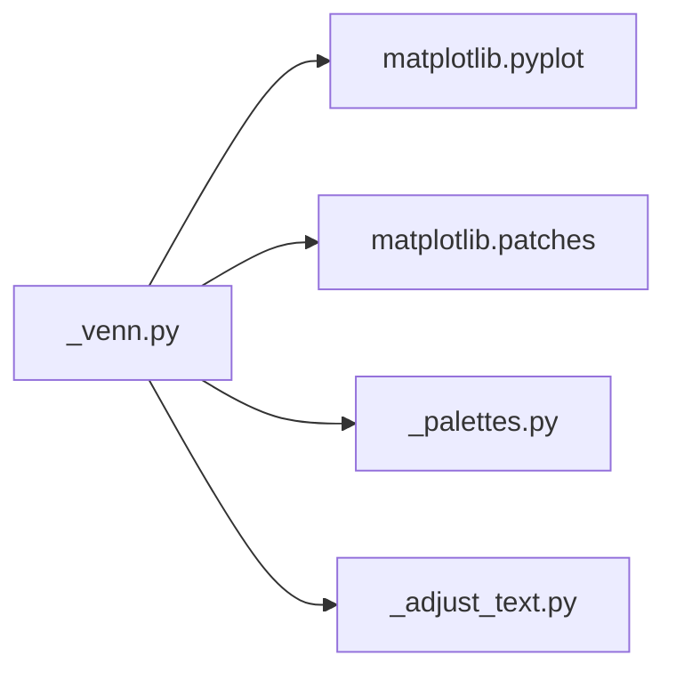

# General Plotting Utilities

<cite>
**Referenced Files in This Document**
- [README.md](file://README.md)
- [geneview/__init__.py](file://geneview/__init__.py)
- [geneview/baseplot/_venn.py](file://geneview/baseplot/_venn.py)
- [geneview/baseplot/__init__.py](file://geneview/baseplot/__init__.py)
- [geneview/palette/_palettes.py](file://geneview/palette/_palettes.py)
- [geneview/palette/__init__.py](file://geneview/palette/__init__.py)
- [geneview/utils/_adjust_text.py](file://geneview/utils/_adjust_text.py)
- [examples/scripts/venn.py](file://examples/scripts/venn.py)
- [docs/tutorial/venn.ipynb](file://docs/tutorial/venn.ipynb)
</cite>

## Table of Contents
1. [Introduction](#introduction)
2. [Project Structure](#project-structure)
3. [Core Components](#core-components)
4. [Architecture Overview](#architecture-overview)
5. [Detailed Component Analysis](#detailed-component-analysis)
6. [Dependency Analysis](#dependency-analysis)
7. [Performance Considerations](#performance-considerations)
8. [Troubleshooting Guide](#troubleshooting-guide)
9. [Conclusion](#conclusion)
10. [Appendices](#appendices)

## Introduction
This document provides comprehensive documentation for GeneView's general plotting utilities, with a focus on multi-set Venn diagram generation and basic plotting components. The Venn diagram functionality supports 2–6 sets, automatic shape calculation, customizable petal labeling, and intersection analysis. The implementation integrates seamlessly with genomics data analysis workflows, enabling practical applications such as gene set analysis, variant overlap studies, and functional enrichment analysis.

## Project Structure
The general plotting utilities reside primarily in the `baseplot` module, with supporting color palette generation in the `palette` module and text adjustment utilities in the `utils` module. The top-level package exposes convenient entry points for Venn plotting and dataset loading.

**Diagram sources**
- [geneview/__init__.py:1-15](file://geneview/__init__.py#L1-L15)
- [geneview/baseplot/_venn.py:1-14](file://geneview/baseplot/_venn.py#L1-L14)
- [geneview/baseplot/__init__.py:1-2](file://geneview/baseplot/__init__.py#L1-L2)
- [geneview/palette/_palettes.py:1-13](file://geneview/palette/_palettes.py#L1-L13)
- [geneview/palette/__init__.py:1-10](file://geneview/palette/__init__.py#L1-L10)
- [geneview/utils/_adjust_text.py:1-759](file://geneview/utils/_adjust_text.py#L1-L759)
- [examples/scripts/venn.py:1-30](file://examples/scripts/venn.py#L1-L30)
- [docs/tutorial/venn.ipynb:1-146](file://docs/tutorial/venn.ipynb#L1-L146)

**Section sources**
- [README.md:1-344](file://README.md#L1-L344)
- [geneview/__init__.py:1-15](file://geneview/__init__.py#L1-L15)

## Core Components
- Venn diagram plotting: Supports 2–6 sets with automatic shape selection (ellipses for 2–5 sets, triangles for 6 sets).
- Petal labeling engine: Computes intersection sizes and percentages for each petal using binary logic identifiers.
- Color palette integration: Generates colors from matplotlib colormaps or explicit lists for consistent visual styling.
- Text adjustment utilities: Provides automated text positioning to reduce overlaps in complex plots.

Key entry points:
- `venn`: High-level function to plot Venn diagrams from either raw sets or precomputed petal labels.
- `generate_petal_labels`: Computes petal labels and percentages for manual customization.
- Palette utilities: `generate_colors_palette` for flexible color mapping.

**Section sources**
- [geneview/baseplot/_venn.py:186-208](file://geneview/baseplot/_venn.py#L186-L208)
- [geneview/baseplot/_venn.py:234-295](file://geneview/baseplot/_venn.py#L234-L295)
- [geneview/palette/_palettes.py:5-12](file://geneview/palette/_palettes.py#L5-L12)
- [geneview/utils/_adjust_text.py:439-759](file://geneview/utils/_adjust_text.py#L439-L759)

## Architecture Overview
The Venn plotting pipeline consists of:
- Input validation and inference of set count from petal labels or raw datasets.
- Automatic shape selection and parameterization for 2–6 sets.
- Intersection computation and petal label generation.
- Rendering with configurable colors, legends, and text placement.

**Diagram sources**
- [geneview/baseplot/_venn.py:437-585](file://geneview/baseplot/_venn.py#L437-L585)
- [geneview/baseplot/_venn.py:234-295](file://geneview/baseplot/_venn.py#L234-L295)
- [geneview/baseplot/_venn.py:186-208](file://geneview/baseplot/_venn.py#L186-L208)
- [geneview/palette/_palettes.py:5-12](file://geneview/palette/_palettes.py#L5-L12)

## Detailed Component Analysis

### Venn Diagram Core: Shape Selection and Rendering
- Shape parameters: Predefined coordinates, dimensions, and angles for 2–6 sets.
- Automatic shape selection: Uses ellipses for 2–5 sets; triangles for 6 sets.
- Drawing primitives: Ellipses and polygons via matplotlib patches.
- Legend placement: Configurable legend location or per-dataset labels with optional petal-color usage.

**Diagram sources**
- [geneview/baseplot/_venn.py:234-295](file://geneview/baseplot/_venn.py#L234-L295)
- [geneview/baseplot/_venn.py:16-43](file://geneview/baseplot/_venn.py#L16-L43)

**Section sources**
- [geneview/baseplot/_venn.py:16-43](file://geneview/baseplot/_venn.py#L16-L43)
- [geneview/baseplot/_venn.py:234-295](file://geneview/baseplot/_venn.py#L234-L295)

### Petal Labeling Engine: Intersection Analysis and Formatting
- Binary logic identifiers: Generates all non-empty combinations of sets using binary strings.
- Intersection computation: Computes each petal’s unique elements by intersecting included sets and subtracting excluded ones.
- Percentage calculation: Normalizes counts against the union universe size.
- Formatting: Supports placeholders for size, percentage, and logic string.

**Diagram sources**
- [geneview/baseplot/_venn.py:180-208](file://geneview/baseplot/_venn.py#L180-L208)

**Section sources**
- [geneview/baseplot/_venn.py:180-208](file://geneview/baseplot/_venn.py#L180-L208)

### Color Palette Integration
- Flexible color generation: Accepts matplotlib colormaps or explicit color lists.
- Alpha blending: Controls transparency for overlapping shapes.
- Default palette: Built-in default colors when no palette is provided.

**Diagram sources**
- [geneview/palette/_palettes.py:5-12](file://geneview/palette/_palettes.py#L5-L12)
- [geneview/baseplot/_venn.py:124-136](file://geneview/baseplot/_venn.py#L124-L136)

**Section sources**
- [geneview/palette/_palettes.py:5-12](file://geneview/palette/_palettes.py#L5-L12)
- [geneview/baseplot/_venn.py:124-136](file://geneview/baseplot/_venn.py#L124-L136)

### Practical Examples and Workflows
- Minimal Venn plot from raw sets.
- Manual adjustment of petal labels and custom formatting.
- Multi-set examples (2–6 sets) with varied colormaps and legends.

**Diagram sources**
- [examples/scripts/venn.py:1-30](file://examples/scripts/venn.py#L1-L30)
- [docs/tutorial/venn.ipynb:29-120](file://docs/tutorial/venn.ipynb#L29-L120)
- [geneview/baseplot/_venn.py:437-585](file://geneview/baseplot/_venn.py#L437-L585)

**Section sources**
- [examples/scripts/venn.py:1-30](file://examples/scripts/venn.py#L1-L30)
- [docs/tutorial/venn.ipynb:29-120](file://docs/tutorial/venn.ipynb#L29-L120)

## Dependency Analysis
The Venn plotting module depends on:
- Matplotlib for rendering shapes and text.
- Internal palette utilities for color generation.
- Utility functions for text adjustment (optional, for advanced layouts).

**Diagram sources**
- [geneview/baseplot/_venn.py:8-12](file://geneview/baseplot/_venn.py#L8-L12)
- [geneview/palette/_palettes.py:1-2](file://geneview/palette/_palettes.py#L1-L2)
- [geneview/utils/_adjust_text.py:1-14](file://geneview/utils/_adjust_text.py#L1-L14)

**Section sources**
- [geneview/baseplot/_venn.py:8-12](file://geneview/baseplot/_venn.py#L8-L12)
- [geneview/palette/_palettes.py:1-2](file://geneview/palette/_palettes.py#L1-L2)
- [geneview/utils/_adjust_text.py:1-14](file://geneview/utils/_adjust_text.py#L1-L14)

## Performance Considerations
- Complexity of intersection computation scales exponentially with the number of sets (2^n). For large datasets, precompute petal labels to avoid repeated recomputation.
- Rendering performance benefits from using fewer sets or simplified shapes (ellipses vs triangles).
- Transparency (alpha) affects rendering speed; moderate alpha values balance aesthetics and performance.

## Troubleshooting Guide
Common issues and resolutions:
- Invalid number of sets: Ensure 2–6 sets; otherwise a ValueError is raised.
- Incorrect petal label keys: Keys must be binary strings of length equal to the number of sets; invalid keys trigger KeyError.
- Non-set inputs: Raw datasets must be dictionaries of sets; otherwise a TypeError is raised.
- Legend placement: Use legend_loc to control legend positioning or disable with legend_loc=None.

**Section sources**
- [geneview/baseplot/_venn.py:220-231](file://geneview/baseplot/_venn.py#L220-L231)
- [geneview/baseplot/_venn.py:560-585](file://geneview/baseplot/_venn.py#L560-L585)

## Conclusion
GeneView’s general plotting utilities provide a robust, extensible framework for multi-set Venn diagram generation. The implementation combines precise intersection analysis, automatic shape calculation, and flexible customization to support diverse genomics workflows. By leveraging precomputed petal labels and color palettes, users can efficiently produce publication-ready visualizations tailored to gene set analysis, variant overlap studies, and functional enrichment investigations.

## Appendices

### API Reference Highlights
- `venn(data, names=None, fmt="{size}", palette="viridis", alpha=0.4, fontsize=14, legend_use_petal_color=False, legend_loc=None, ax=None)`
  - Plots Venn diagrams from raw sets or precomputed petal labels.
- `generate_petal_labels(datasets, fmt="{size}")`
  - Computes petal labels and percentages for each intersection.

**Section sources**
- [geneview/baseplot/_venn.py:437-585](file://geneview/baseplot/_venn.py#L437-L585)
- [geneview/baseplot/_venn.py:186-208](file://geneview/baseplot/_venn.py#L186-L208)