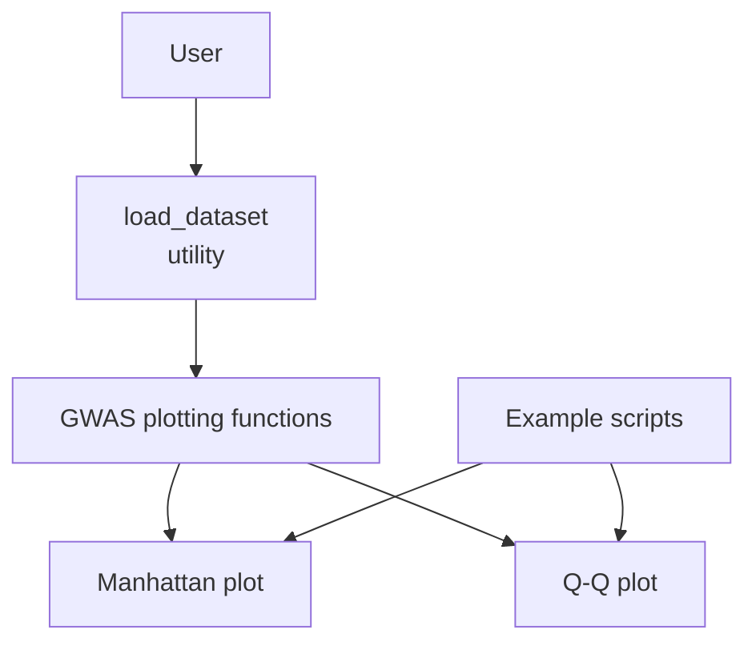
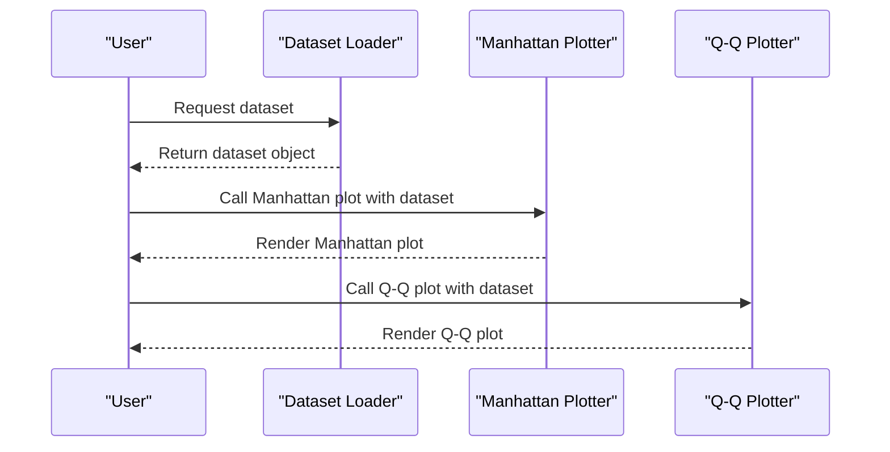
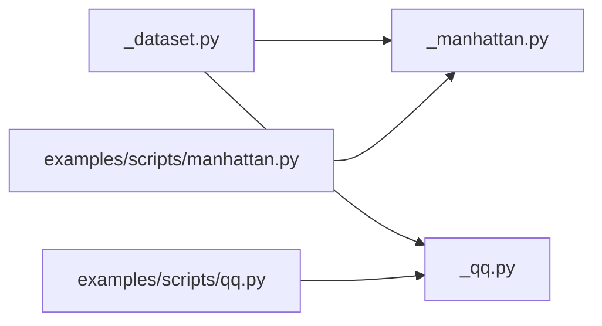

# Getting Started

<cite>
**Referenced Files in This Document**
- [README.md](file://README.md)
- [examples/scripts/manhattan.py](file://examples/scripts/manhattan.py)
- [examples/scripts/qq.py](file://examples/scripts/qq.py)
- [geneview/utils/_dataset.py](file://geneview/utils/_dataset.py)
- [geneview/gwas/__init__.py](file://geneview/gwas/__init__.py)
- [geneview/gwas/_manhattan.py](file://geneview/gwas/_manhattan.py)
- [geneview/gwas/_qq.py](file://geneview/gwas/_qq.py)
</cite>

## Table of Contents
1. [Introduction](#introduction)
2. [Project Structure](#project-structure)
3. [Core Components](#core-components)
4. [Architecture Overview](#architecture-overview)
5. [Detailed Component Analysis](#detailed-component-analysis)
6. [Dependency Analysis](#dependency-analysis)
7. [Performance Considerations](#performance-considerations)
8. [Troubleshooting Guide](#troubleshooting-guide)
9. [Conclusion](#conclusion)

## Introduction
This guide helps you quickly get started with GeneView to create your first GWAS visualizations. You will learn how to load real genomics datasets and produce two foundational plots: Manhattan and Q-Q plots. These steps are designed for beginners and establish the foundation for more advanced usage.

## Project Structure
GeneView organizes plotting functionality under a dedicated module for GWAS-related visualizations. The key areas you will use during onboarding are:
- Data loading utilities for genomics datasets
- GWAS plotting functions for Manhattan and Q-Q plots
- Example scripts demonstrating end-to-end workflows

**Section sources**
- [README.md](file://README.md)

## Core Components
- Data loading: Use the dataset loader to fetch a ready-to-use GWAS dataset for practice.
- Plotting: Use the Manhattan and Q-Q plotting functions to visualize association statistics.
- Examples: Follow the example scripts to see minimal working workflows.

What you will accomplish:
- Load a dataset suitable for GWAS analysis
- Produce a Manhattan plot highlighting chromosome-wide associations
- Produce a Q-Q plot assessing distribution of p-values
- Customize plot appearance with common parameters

**Section sources**
- [geneview/utils/_dataset.py](file://geneview/utils/_dataset.py)
- [geneview/gwas/__init__.py](file://geneview/gwas/__init__.py)

## Architecture Overview
The onboarding flow connects user actions to internal plotting functions via a dataset loader.

**Diagram sources**
- [geneview/utils/_dataset.py](file://geneview/utils/_dataset.py)
- [geneview/gwas/_manhattan.py](file://geneview/gwas/_manhattan.py)
- [geneview/gwas/_qq.py](file://geneview/gwas/_qq.py)

## Detailed Component Analysis

### Step 1: Load a Dataset
Goal: Obtain a dataset object containing GWAS summary statistics for plotting.

- Use the dataset loader to retrieve a built-in or cached dataset suitable for GWAS visualization.
- The returned dataset object contains columns such as chromosome, position, and p-values.

Expected outcome:
- A dataset object ready to pass into plotting functions.

Common parameter configuration:
- Choose a dataset identifier or path if you have a local file.
- Ensure column names match expected GWAS fields (e.g., chromosome, position, p-value).

**Section sources**
- [geneview/utils/_dataset.py](file://geneview/utils/_dataset.py)

### Step 2: Create a Manhattan Plot
Goal: Visualize genome-wide association signals across chromosomes.

Workflow:
- Provide the loaded dataset to the Manhattan plotting function.
- The function renders a chromosome-wise plot of association statistics.

First visualization example:
- A Manhattan plot with labeled chromosomes and significance thresholds.
- Points represent SNPs across autosomes; sex chromosomes may be highlighted.

Customization options:
- Adjust colors per chromosome, significance threshold lines, and axis labels.
- Control figure size and save to a file for reports.

**Section sources**
- [examples/scripts/manhattan.py](file://examples/scripts/manhattan.py)
- [geneview/gwas/_manhattan.py](file://geneview/gwas/_manhattan.py)

### Step 3: Create a Q-Q Plot
Goal: Assess whether the observed p-value distribution matches expectations under the null hypothesis.

Workflow:
- Provide the loaded dataset to the Q-Q plotting function.
- The function compares observed vs. expected quantiles of -log10(p-values).

First visualization example:
- A diagonal reference line and cloud of points deviating at the tail indicate polygenic architecture or stratification.
- Points above the diagonal at low p-values suggest true associations.

Customization options:
- Change colors, markers, and grid settings.
- Add confidence bands or overlay annotations.

**Section sources**
- [examples/scripts/qq.py](file://examples/scripts/qq.py)
- [geneview/gwas/_qq.py](file://geneview/gwas/_qq.py)

### Step 4: Explore Further
After mastering Manhattan and Q-Q plots:
- Try locus zoom plots around top hits.
- Combine plots with custom palettes and export high-resolution figures.
- Explore advanced customization options exposed by the plotting functions.

**Section sources**
- [geneview/gwas/__init__.py](file://geneview/gwas/__init__.py)

## Dependency Analysis
The plotting functions depend on the dataset loader to obtain standardized input. The example scripts demonstrate end-to-end usage.

**Diagram sources**
- [geneview/utils/_dataset.py](file://geneview/utils/_dataset.py)
- [geneview/gwas/_manhattan.py](file://geneview/gwas/_manhattan.py)
- [geneview/gwas/_qq.py](file://geneview/gwas/_qq.py)
- [examples/scripts/manhattan.py](file://examples/scripts/manhattan.py)
- [examples/scripts/qq.py](file://examples/scripts/qq.py)

**Section sources**
- [geneview/gwas/__init__.py](file://geneview/gwas/__init__.py)

## Performance Considerations
- Large datasets: For very large GWAS catalogs, consider subsampling or filtering to autosomal chromosomes to reduce rendering time.
- Interactive environments: Prefer saving static figures for reproducibility; adjust DPI and figure sizes for print-quality output.
- Memory usage: Keep only necessary columns in memory when preparing datasets for plotting.

## Troubleshooting Guide
Common issues and resolutions:
- Missing dataset: Ensure the dataset loader returns a valid object with required columns (chromosome, position, p-value).
- Column name mismatches: Align your dataset column names with expected field names used by plotting functions.
- Out-of-memory errors: Reduce plotted regions or filter SNPs to autosomes before plotting.
- Rendering artifacts: Adjust figure size and DPI; re-check axis limits and color schemes.

**Section sources**
- [geneview/utils/_dataset.py](file://geneview/utils/_dataset.py)
- [geneview/gwas/_manhattan.py](file://geneview/gwas/_manhattan.py)
- [geneview/gwas/_qq.py](file://geneview/gwas/_qq.py)

## Conclusion
You have learned how to load a genomics dataset and create your first Manhattan and Q-Q plots with GeneView. These two plots form the backbone of GWAS interpretation. Continue by exploring advanced plotting modes and customizing visuals to suit your research needs.