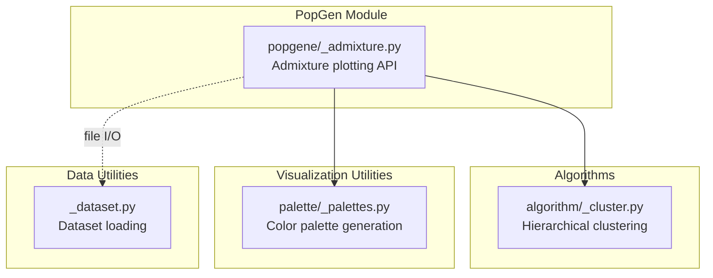
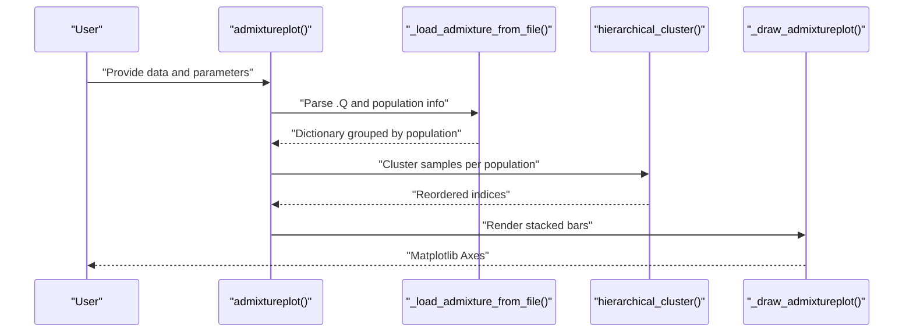
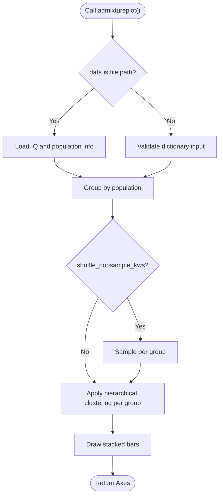
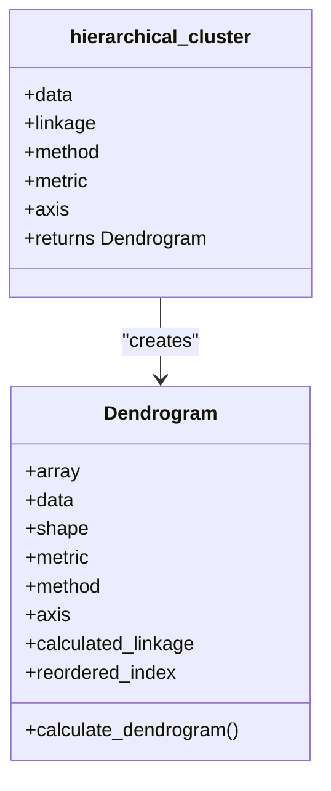
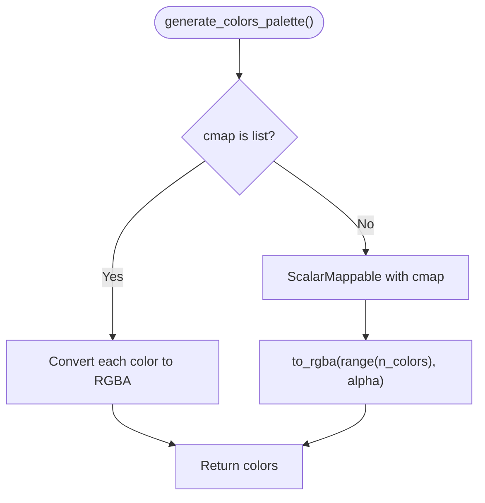
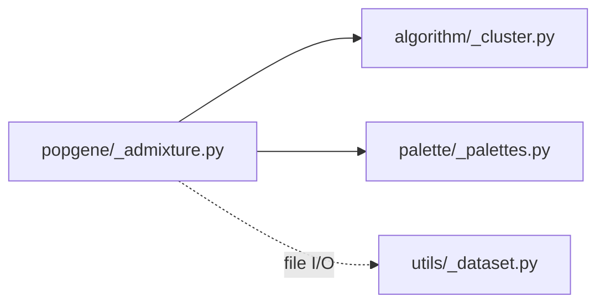

# Population Genetics Visualization

<cite>
**Referenced Files in This Document**
- [_admixture.py](file://geneview/popgene/_admixture.py)
- [_cluster.py](file://geneview/algorithm/_cluster.py)
- [_palettes.py](file://geneview/palette/_palettes.py)
- [_dataset.py](file://geneview/utils/_dataset.py)
- [README.md](file://README.md)
- [admixture.py](file://examples/scripts/admixture.py)
- [admixture.ipynb](file://docs/tutorial/admixture.ipynb)
- [popgene/__init__.py](file://geneview/popgene/__init__.py)
</cite>

## Table of Contents
1. [Introduction](#introduction)
2. [Project Structure](#project-structure)
3. [Core Components](#core-components)
4. [Architecture Overview](#architecture-overview)
5. [Detailed Component Analysis](#detailed-component-analysis)
6. [Dependency Analysis](#dependency-analysis)
7. [Performance Considerations](#performance-considerations)
8. [Troubleshooting Guide](#troubleshooting-guide)
9. [Conclusion](#conclusion)
10. [Appendices](#appendices)

## Introduction
This document explains GeneView’s population genetics visualization tools with a focus on admixture coefficient analysis and population structure visualization. It covers:
- Admixture plot functionality: .Q file format processing, population information management, hierarchical clustering integration, and sample ordering optimization
- Data input requirements, population grouping strategies, and visualization customization options
- Practical examples demonstrating population structure analysis workflows, statistical significance testing, and interpretation of admixture coefficients
- Integration with population genetics research pipelines and comparative analysis techniques

## Project Structure
GeneView organizes population genetics visualization under the popgene module, with supporting algorithmic clustering and palette utilities. The admixture plotting pipeline integrates file parsing, hierarchical clustering, and Matplotlib rendering.

**Diagram sources**
- [_admixture.py:17-134](file://geneview/popgene/_admixture.py#L17-L134)
- [_cluster.py:115-146](file://geneview/algorithm/_cluster.py#L115-L146)
- [_palettes.py:5-12](file://geneview/palette/_palettes.py#L5-L12)
- [_dataset.py:22-67](file://geneview/utils/_dataset.py#L22-L67)

**Section sources**
- [README.md:229-274](file://README.md#L229-L274)
- [popgene/__init__.py:1-1](file://geneview/popgene/__init__.py#L1-L1)

## Core Components
- Admixture plotting API: Loads .Q and population info files, groups data by population, applies hierarchical clustering for sample ordering, and renders stacked bars representing admixture coefficients.
- Hierarchical clustering: Agglomerative clustering to reorder samples within each population group for improved interpretability.
- Palette utilities: Color generation for K ancestry components with support for categorical or continuous colormaps.
- Dataset utilities: Helper to fetch example datasets for quick prototyping.

Key responsibilities:
- Input validation and preprocessing
- Population grouping and optional subsampling
- Hierarchical clustering integration
- Visualization customization (colors, labels, layout)

**Section sources**
- [_admixture.py:168-364](file://geneview/popgene/_admixture.py#L168-L364)
- [_cluster.py:115-146](file://geneview/algorithm/_cluster.py#L115-L146)
- [_palettes.py:5-12](file://geneview/palette/_palettes.py#L5-L12)
- [_dataset.py:22-67](file://geneview/utils/_dataset.py#L22-L67)

## Architecture Overview
The admixture plotting pipeline follows a modular design:
- Input stage: Accepts either a file path to .Q and a population info file or a prebuilt dictionary keyed by population.
- Preprocessing stage: Validates inputs, loads data, and optionally subsamples per population.
- Clustering stage: Applies hierarchical clustering to reorder samples within each population group.
- Rendering stage: Generates stacked bars for each ancestry component, with customizable colors and labels.

**Diagram sources**
- [_admixture.py:137-165](file://geneview/popgene/_admixture.py#L137-L165)
- [_admixture.py:168-364](file://geneview/popgene/_admixture.py#L168-L364)
- [_cluster.py:115-146](file://geneview/algorithm/_cluster.py#L115-L146)

## Detailed Component Analysis

### Admixture Plot API
The public API function accepts:
- data: Either a file path to the .Q output or a dictionary keyed by population name with values as pandas DataFrames of admixture coefficients
- population_info: File path to a population assignment list (one group per row)
- shuffle_popsample_kws: Sampling parameters for each population group (supports n or frac)
- group_order: Explicit order of populations to render
- Visualization parameters: palette, line widths, tick label placement, and axis labels

Processing highlights:
- Input validation ensures consistent shapes between .Q rows and population assignments
- Per-group subsampling via pandas DataFrame.sample
- Hierarchical clustering applied only when a group contains more than one sample
- Stacked bar rendering with cumulative baseline stacking

**Diagram sources**
- [_admixture.py:137-165](file://geneview/popgene/_admixture.py#L137-L165)
- [_admixture.py:168-364](file://geneview/popgene/_admixture.py#L168-L364)

**Section sources**
- [_admixture.py:168-364](file://geneview/popgene/_admixture.py#L168-L364)

### Hierarchical Clustering Integration
Hierarchical clustering reorders samples within each population group to reveal structure:
- Uses scipy.cluster.hierarchy with configurable linkage method and distance metric
- Supports axis selection (row-wise clustering by default)
- Exposes reordered indices suitable for DataFrame reordering

**Diagram sources**
- [_cluster.py:19-146](file://geneview/algorithm/_cluster.py#L19-L146)

**Section sources**
- [_cluster.py:115-146](file://geneview/algorithm/_cluster.py#L115-L146)

### Palette Management
Colors for ancestry components are generated from:
- Matplotlib colormaps or explicit color lists
- ScalarMappable for continuous palettes
- RGBA conversion for transparency control

**Diagram sources**
- [_palettes.py:5-12](file://geneview/palette/_palettes.py#L5-L12)

**Section sources**
- [_palettes.py:5-12](file://geneview/palette/_palettes.py#L5-L12)

### Example Workflows and Interpretation
- Basic admixture plot: Load .Q and population info, render stacked bars, customize palette and labels
- Population ordering: Define group_order to reflect scientific expectations (e.g., 1000 Genomes superpopulations)
- Subsampling: Use shuffle_popsample_kws to reduce density for large datasets
- Comparative analysis: Compare plots across runs or datasets by aligning group_order and palette

Practical examples are provided in:
- Notebook tutorial with .Q and population info inspection
- Script example demonstrating population ordering and subsampling

**Section sources**
- [README.md:229-274](file://README.md#L229-L274)
- [admixture.ipynb:290-398](file://docs/tutorial/admixture.ipynb#L290-L398)
- [admixture.py:1-28](file://examples/scripts/admixture.py#L1-L28)

## Dependency Analysis
- PopGen depends on:
  - Algorithmic clustering (scipy)
  - Visualization utilities (matplotlib)
  - Palette utilities (matplotlib)
  - Data utilities (pandas)

**Diagram sources**
- [_admixture.py:13-14](file://geneview/popgene/_admixture.py#L13-L14)
- [_cluster.py:10-16](file://geneview/algorithm/_cluster.py#L10-L16)
- [_palettes.py:1-2](file://geneview/palette/_palettes.py#L1-L2)
- [_dataset.py:6-7](file://geneview/utils/_dataset.py#L6-L7)

**Section sources**
- [_admixture.py:13-14](file://geneview/popgene/_admixture.py#L13-L14)
- [_cluster.py:10-16](file://geneview/algorithm/_cluster.py#L10-L16)
- [_palettes.py:1-2](file://geneview/palette/_palettes.py#L1-L2)
- [_dataset.py:6-7](file://geneview/utils/_dataset.py#L6-L7)

## Performance Considerations
- Hierarchical clustering cost: Computation scales with O(n^3) for dense matrices; consider subsampling via shuffle_popsample_kws for very large datasets
- Rendering cost: Stacked bar rendering is efficient; adjust figure size and DPI to balance quality and performance
- Memory footprint: Large .Q matrices increase memory usage; process in chunks or subsample as needed

## Troubleshooting Guide
Common issues and resolutions:
- Mismatched dimensions between .Q and population info: Ensure equal row counts for both inputs
- Invalid data types: data must be a file path or dictionary; population_info must be a file path when data is a file path
- Unexpected palette coverage: If palette categories are fewer than K components, a warning is raised; adjust palette or ensure sufficient categories
- Subsampling axis: axis=1 is disallowed for population subsampling; use axis=0 (default) with n or frac
- Group ordering mismatch: xticklabels length must match group_order length

**Section sources**
- [_admixture.py:137-165](file://geneview/popgene/_admixture.py#L137-L165)
- [_admixture.py:326-364](file://geneview/popgene/_admixture.py#L326-L364)

## Conclusion
GeneView’s admixture visualization provides a robust, extensible pipeline for interpreting population structure from .Q files. Its modular design enables flexible input handling, optional hierarchical clustering for sample ordering, and rich customization for publication-ready figures. The included examples and tutorials facilitate reproducible workflows and integration into broader population genetics analyses.

## Appendices

### Data Input Requirements
- .Q file: Rows correspond to samples; columns represent estimated ancestry components (K); separated by whitespace
- Population info file: One group label per row, aligned with .Q rows
- Optional dictionary input: Keys are population names; values are pandas DataFrames of admixture coefficients

**Section sources**
- [_admixture.py:137-165](file://geneview/popgene/_admixture.py#L137-L165)
- [admixture.ipynb:290-398](file://docs/tutorial/admixture.ipynb#L290-L398)

### Visualization Customization Options
- Palette: String colormap name, list of colors, or continuous colormap
- Layout: Line widths, edge width, tick label rotation and alignment
- Labels: X-axis tick labels, Y-axis label text and orientation
- Ordering: group_order to enforce population order; hierarchical_kws to tune clustering

**Section sources**
- [_admixture.py:168-364](file://geneview/popgene/_admixture.py#L168-L364)

### Practical Example Paths
- Notebook tutorial: Inspect .Q and population info, build plots with customizations
- Script example: Demonstrate population ordering and subsampling

**Section sources**
- [README.md:229-274](file://README.md#L229-L274)
- [admixture.ipynb:290-398](file://docs/tutorial/admixture.ipynb#L290-L398)
- [admixture.py:1-28](file://examples/scripts/admixture.py#L1-L28)