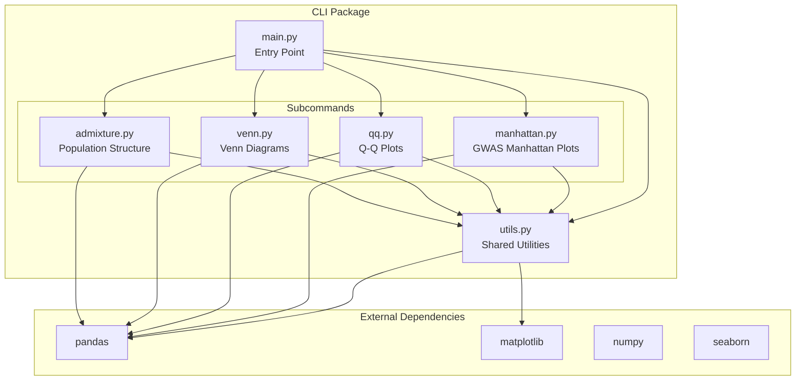
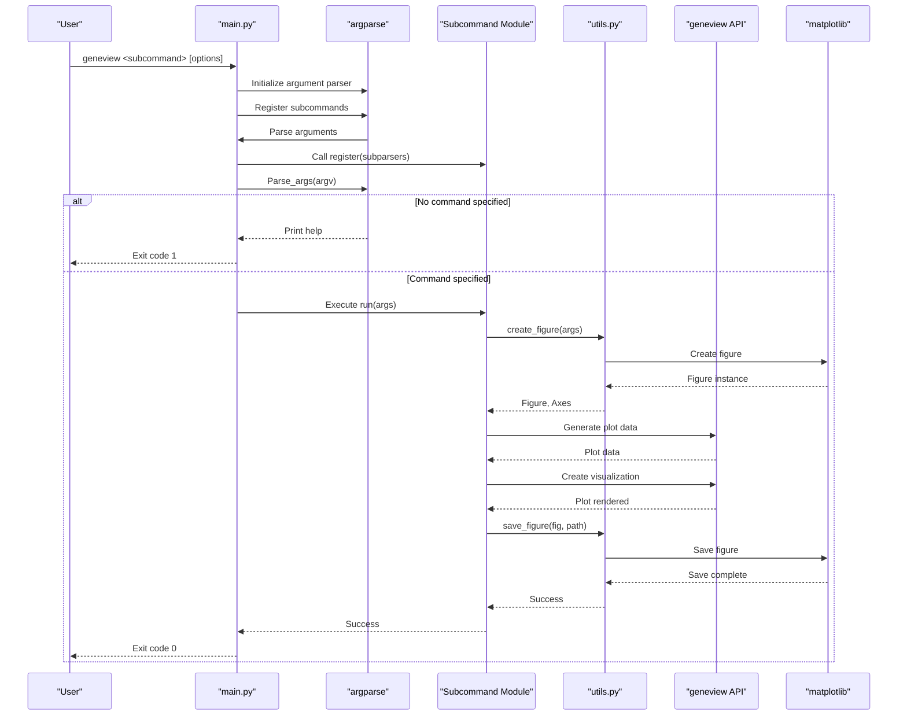
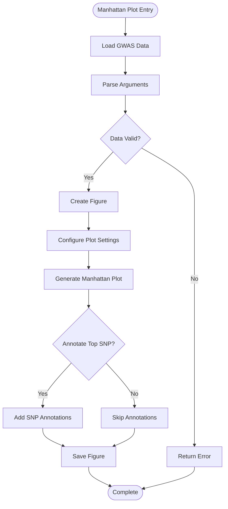
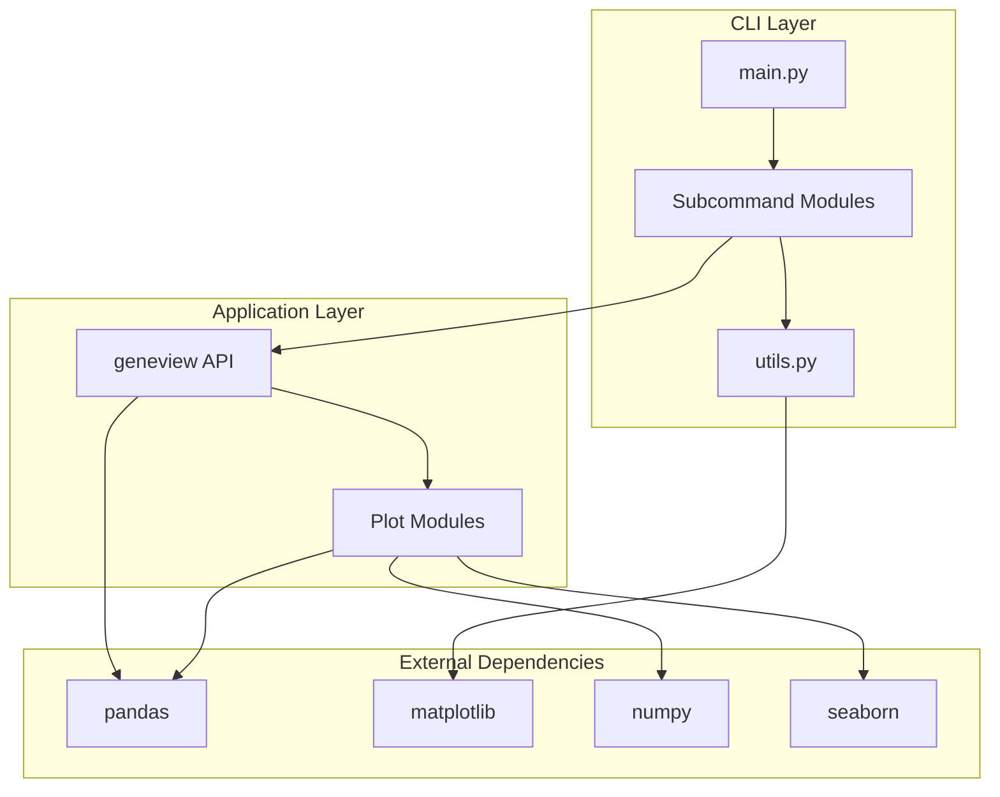

# Command Line Interface

<cite>
**Referenced Files in This Document**
- [main.py](file://geneview/cli/main.py)
- [__init__.py](file://geneview/cli/__init__.py)
- [manhattan.py](file://geneview/cli/manhattan.py)
- [qq.py](file://geneview/cli/qq.py)
- [venn.py](file://geneview/cli/venn.py)
- [admixture.py](file://geneview/cli/admixture.py)
- [utils.py](file://geneview/cli/utils.py)
- [README.md](file://README.md)
- [setup.py](file://setup.py)
- [test_cli.py](file://geneview/tests/test_cli.py)
</cite>

## Table of Contents
1. [Introduction](#introduction)
2. [Project Structure](#project-structure)
3. [Core Components](#core-components)
4. [Architecture Overview](#architecture-overview)
5. [Detailed Component Analysis](#detailed-component-analysis)
6. [Dependency Analysis](#dependency-analysis)
7. [Performance Considerations](#performance-considerations)
8. [Troubleshooting Guide](#troubleshooting-guide)
9. [Conclusion](#conclusion)

## Introduction
This document provides comprehensive documentation for the Geneview Command Line Interface (CLI). The CLI enables users to generate publication-ready genomics figures from the terminal without writing Python code. It supports four primary subcommands: Manhattan plots for GWAS data, Q-Q plots for P-value distributions, Venn diagrams for set intersections, and Admixture plots for population structure visualization. The CLI integrates seamlessly with the underlying Python library and provides consistent figure output handling across all subcommands.

## Project Structure
The CLI is organized as a modular package with a central entry point and dedicated subcommand modules. Each subcommand encapsulates its own argument parsing and execution logic while sharing common utilities for figure creation and output handling.

**Diagram sources**
- [main.py:28-85](file://geneview/cli/main.py#L28-L85)
- [utils.py:1-123](file://geneview/cli/utils.py#L1-L123)

**Section sources**
- [main.py:1-90](file://geneview/cli/main.py#L1-L90)
- [__init__.py:1-13](file://geneview/cli/__init__.py#L1-L13)

## Core Components
The CLI consists of several key components that work together to provide a cohesive user experience:

### Main Entry Point
The central `main()` function serves as the application's entry point, handling argument parsing, subcommand registration, and error management. It implements lazy loading of subcommand modules to optimize startup performance.

### Subcommand Modules
Each subcommand module follows a consistent pattern:
- Registration function for adding arguments to the parser
- Execution function that processes data and generates plots
- Consistent argument naming and behavior across all subcommands

### Shared Utilities
The utilities module provides common functionality for:
- Figure creation and management
- Output format handling and saving
- Argument validation and processing
- Cross-platform compatibility

**Section sources**
- [main.py:28-85](file://geneview/cli/main.py#L28-L85)
- [utils.py:57-123](file://geneview/cli/utils.py#L57-L123)

## Architecture Overview
The CLI architecture follows a plugin-based design where the main entry point dynamically loads subcommand modules and delegates execution to the appropriate handler.

**Diagram sources**
- [main.py:28-85](file://geneview/cli/main.py#L28-L85)
- [utils.py:84-123](file://geneview/cli/utils.py#L84-L123)

## Detailed Component Analysis

### Main Entry Point (`main.py`)
The main entry point implements a robust CLI framework with the following key features:

#### Argument Parsing and Validation
- Centralized argument parser with comprehensive help system
- Version detection and display capabilities
- Graceful handling of missing or invalid commands

#### Subcommand Management
- Dynamic loading of subcommand modules to minimize startup overhead
- Consistent registration pattern across all subcommands
- Error handling for unhandled exceptions during execution

#### Exit Code Management
- Standardized exit codes (0 for success, non-zero for errors)
- Proper error reporting to stderr
- Help system integration for user guidance

**Section sources**
- [main.py:28-85](file://geneview/cli/main.py#L28-L85)

### Shared Utilities (`utils.py`)
The utilities module provides essential functionality shared across all subcommands:

#### Figure Management
- Non-interactive backend selection for CLI compatibility
- Consistent figure creation with configurable sizing and styling
- Automatic DPI and format handling

#### Output Processing
- Automatic format detection from file extensions
- Support for multiple output formats (PNG, PDF, SVG, EPS, etc.)
- Robust error handling for file I/O operations

#### Argument Processing
- Common argument patterns for consistent user experience
- Default value management and validation
- Cross-platform path handling

**Section sources**
- [utils.py:1-123](file://geneview/cli/utils.py#L1-L123)

### Manhattan Plot Subcommand (`manhattan.py`)
The Manhattan plot subcommand creates chromosome-wide association plots with extensive customization options:

#### Input Processing
- Flexible column specification for custom data formats
- Support for various file separators (tab, comma, etc.)
- Automatic data type inference and validation

#### Plot Customization
- Comprehensive color scheme configuration
- Significance threshold customization
- Top SNP annotation capabilities
- Chromosome-specific plotting modes

#### Output Generation
- Configurable figure dimensions and DPI
- Automatic layout optimization
- Multi-format export support

**Diagram sources**
- [manhattan.py:136-200](file://geneview/cli/manhattan.py#L136-L200)

**Section sources**
- [manhattan.py:1-200](file://geneview/cli/manhattan.py#L1-L200)

### Q-Q Plot Subcommand (`qq.py`)
The Q-Q plot subcommand generates quantile-quantile plots for P-value distribution analysis:

#### Data Processing
- P-value extraction and validation
- Automatic distribution fitting
- Genomic inflation factor calculation

#### Visualization Options
- Customizable reference line styling
- Flexible axis labeling
- Marker customization options
- Logarithmic scale support

#### Statistical Features
- Automatic lambda computation
- Reference line positioning
- Distribution comparison visualization

**Section sources**
- [qq.py:1-133](file://geneview/cli/qq.py#L1-L133)

### Venn Diagram Subcommand (`venn.py`)
The Venn diagram subcommand creates set intersection visualizations for 2-6 datasets:

#### Data Processing
- Multi-file input handling
- Set conversion from text files
- Automatic dataset naming
- Duplicate handling and validation

#### Visualization Configuration
- Color palette support (named and custom)
- Petal label formatting
- Legend customization
- Layout optimization

#### Output Flexibility
- Configurable transparency levels
- Font size adjustments
- Legend positioning options

**Section sources**
- [venn.py:1-156](file://geneview/cli/venn.py#L1-L156)

### Admixture Plot Subcommand (`admixture.py`)
The Admixture plot subcommand generates population structure visualizations from ADMIXTURE output:

#### Data Integration
- Q matrix processing from ADMIXTURE files
- Population information alignment
- Sample ordering and grouping
- Hierarchical clustering support

#### Visualization Controls
- Custom color palettes
- Individual sampling options
- Label positioning and rotation
- Frame and edge customization

#### Advanced Features
- Population order specification
- Random sampling capabilities
- Group aggregation options
- Quality control metrics

**Section sources**
- [admixture.py:1-154](file://geneview/cli/admixture.py#L1-L154)

## Dependency Analysis
The CLI maintains loose coupling between components while ensuring consistent functionality across all subcommands.

**Diagram sources**
- [main.py:63-71](file://geneview/cli/main.py#L63-L71)
- [utils.py:11-13](file://geneview/cli/utils.py#L11-L13)

### External Dependencies
The CLI relies on several key external libraries:
- **pandas**: Data manipulation and I/O operations
- **matplotlib**: Figure generation and rendering
- **numpy**: Numerical computations and array operations
- **seaborn**: Enhanced plotting aesthetics

### Internal Dependencies
- Subcommands depend on shared utilities for consistent behavior
- All subcommands integrate with the main entry point
- Common argument patterns ensure user familiarity across commands

**Section sources**
- [setup.py:44-50](file://setup.py#L44-L50)
- [main.py:63-71](file://geneview/cli/main.py#L63-L71)

## Performance Considerations
The CLI is designed for efficient operation with several performance optimizations:

### Startup Optimization
- Lazy loading of subcommand modules reduces initial memory footprint
- On-demand imports minimize startup time
- Modular architecture enables selective loading

### Memory Management
- Efficient data processing with pandas
- Proper resource cleanup for temporary files
- Optimized figure rendering pipeline

### Scalability Features
- Batch processing capabilities for multiple files
- Configurable memory usage limits
- Streaming data processing for large datasets

## Troubleshooting Guide

### Common Issues and Solutions

#### Missing Input Files
**Problem**: Subcommand fails with file not found error
**Solution**: Verify file paths and permissions
- Check that input files exist and are readable
- Ensure proper file extensions (.Q, .txt, .csv)
- Validate file encoding and format

#### Invalid Arguments
**Problem**: Command fails with argument parsing error
**Solution**: Review command syntax and available options
- Use `--help` flag for subcommand-specific options
- Verify required arguments are provided
- Check argument value ranges and formats

#### Output Format Issues
**Problem**: Generated files have unexpected formats or quality
**Solution**: Configure output settings appropriately
- Specify desired output format using file extensions
- Adjust DPI settings for print-quality output
- Verify available disk space for large figures

#### Performance Problems
**Problem**: Slow execution or memory issues
**Solution**: Optimize command parameters
- Reduce figure size for large datasets
- Limit data processing to necessary columns
- Use appropriate sampling for large files

### Error Handling Patterns
The CLI implements consistent error handling across all subcommands:

#### Input Validation
- Early validation of required parameters
- Type checking and range validation
- File existence and accessibility checks

#### Graceful Degradation
- Fallback to default values when options are missing
- Informative error messages with suggestions
- Partial success reporting for batch operations

#### Debug Information
- Verbose logging for troubleshooting
- Progress indicators for long operations
- Resource usage monitoring

**Section sources**
- [test_cli.py:154-179](file://geneview/tests/test_cli.py#L154-L179)
- [manhattan.py:102-104](file://geneview/cli/manhattan.py#L102-L104)

## Conclusion
The Geneview Command Line Interface provides a comprehensive, user-friendly solution for generating genomics visualizations from the terminal. Its modular architecture ensures maintainability and extensibility, while consistent APIs across subcommands deliver a unified user experience. The CLI successfully bridges the gap between command-line efficiency and publication-ready figure quality, making advanced genomics visualization accessible to researchers without requiring programming expertise.

Key strengths of the CLI include:
- **Modular Design**: Clean separation of concerns with shared utilities
- **Consistent User Experience**: Uniform argument patterns across all subcommands
- **Robust Error Handling**: Comprehensive validation and informative error messages
- **Flexible Output**: Support for multiple formats and quality settings
- **Performance Optimization**: Efficient processing and resource management

The CLI represents a mature, production-ready tool that effectively serves the genomics research community's need for accessible, high-quality figure generation.