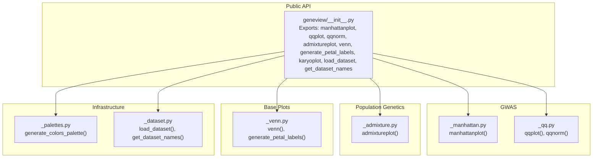
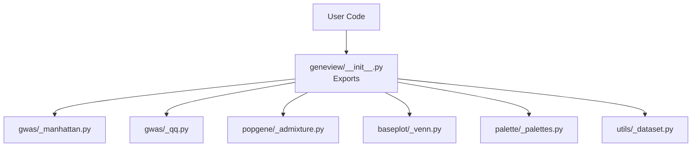
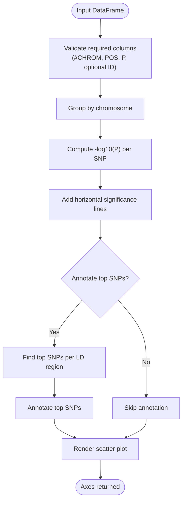
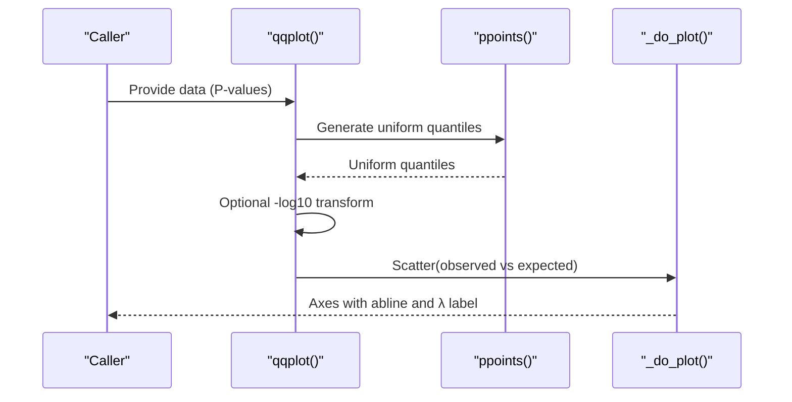
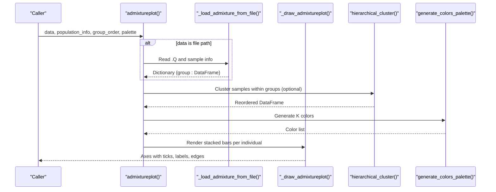
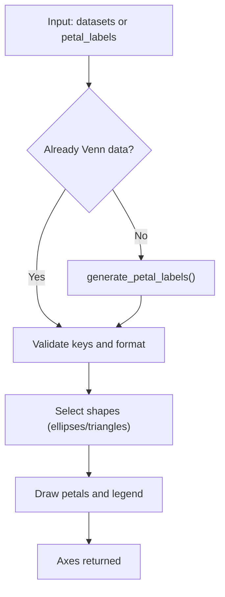
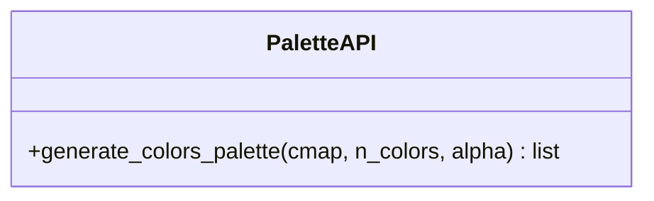
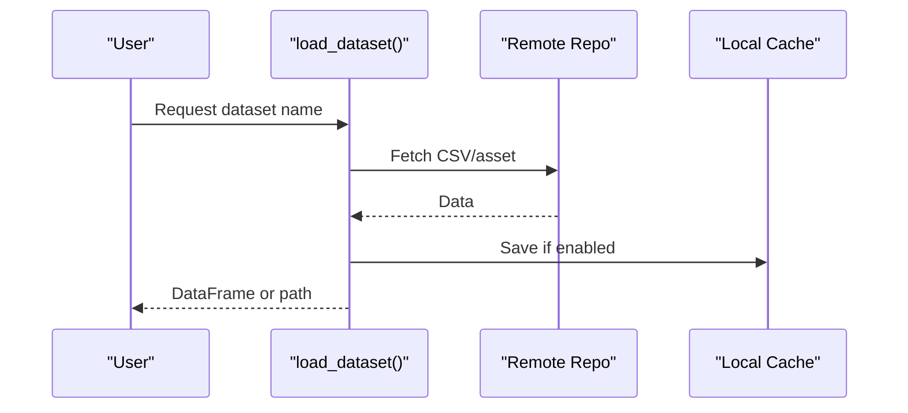
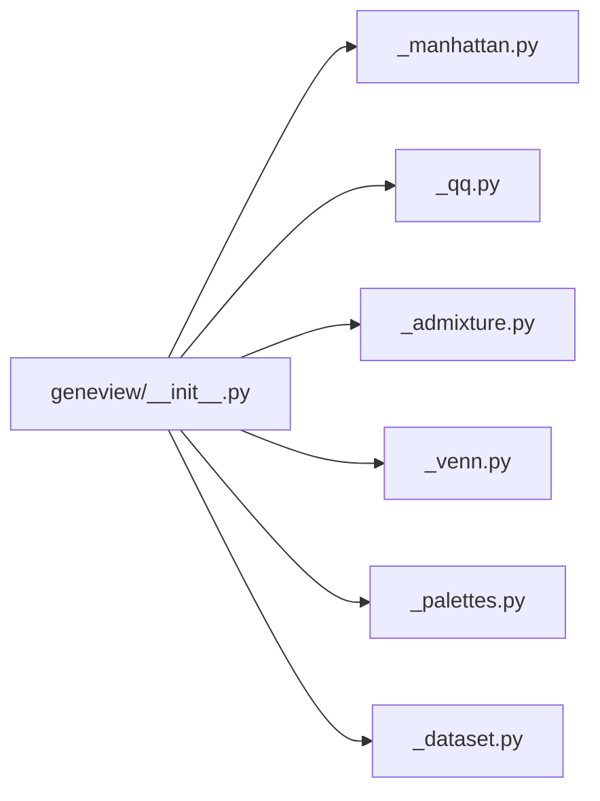

# Core Features

<cite>
**Referenced Files in This Document**
- [README.md](file://README.md)
- [__init__.py](file://geneview/__init__.py)
- [_manhattan.py](file://geneview/gwas/_manhattan.py)
- [_qq.py](file://geneview/gwas/_qq.py)
- [_admixture.py](file://geneview/popgene/_admixture.py)
- [_venn.py](file://geneview/baseplot/_venn.py)
- [_palettes.py](file://geneview/palette/_palettes.py)
- [_dataset.py](file://geneview/utils/_dataset.py)
- [gwas_plot.ipynb](file://docs/tutorial/gwas_plot.ipynb)
</cite>

## Table of Contents
1. [Introduction](#introduction)
2. [Project Structure](#project-structure)
3. [Core Components](#core-components)
4. [Architecture Overview](#architecture-overview)
5. [Detailed Component Analysis](#detailed-component-analysis)
6. [Dependency Analysis](#dependency-analysis)
7. [Performance Considerations](#performance-considerations)
8. [Troubleshooting Guide](#troubleshooting-guide)
9. [Conclusion](#conclusion)

## Introduction
This document describes the core visualization features of GeneView, focusing on four primary categories:
- GWAS analysis tools: Manhattan plots and Q-Q plots
- Population genetics visualization: Admixture plots
- General plotting utilities: Venn diagrams
- Visualization infrastructure: color palettes and dataset management

Each feature is explained in terms of biological/genomic context, typical use cases, and how it fits into standard research workflows. Methodological notes and guidance on when each visualization is most appropriate are included, along with how these features complement each other in comprehensive genomics analysis pipelines.

## Project Structure
GeneView exposes a concise public API via its package initializer and organizes functionality by domain:
- GWAS plotting: manhattan and QQ utilities
- Population genetics: admixture plotting
- General plotting: Venn diagrams
- Infrastructure: color palettes and dataset utilities

**Diagram sources**
- [__init__.py:1-15](file://geneview/__init__.py#L1-L15)
- [_manhattan.py:21-335](file://geneview/gwas/_manhattan.py#L21-L335)
- [_qq.py:62-212](file://geneview/gwas/_qq.py#L62-L212)
- [_admixture.py:168-363](file://geneview/popgene/_admixture.py#L168-L363)
- [_venn.py:437-584](file://geneview/baseplot/_venn.py#L437-L584)
- [_palettes.py:5-12](file://geneview/palette/_palettes.py#L5-L12)
- [_dataset.py:22-67](file://geneview/utils/_dataset.py#L22-L67)

**Section sources**
- [README.md:12-21](file://README.md#L12-L21)
- [__init__.py:1-15](file://geneview/__init__.py#L1-L15)

## Core Components
This section outlines the four core feature categories and their roles in genomics visualization.

- GWAS analysis tools
  - Manhattan plots: Chromosome-wise significance, threshold lines, optional top-SNP annotation and chromosome zoom.
  - Q-Q plots: Distribution of P-values against theoretical/uniform distribution; genomic inflation λ estimation.

- Population genetics visualization
  - Admixture plots: Visualization of ancestry proportions across individuals and groups, with optional hierarchical clustering and color palettes.

- General plotting utilities
  - Venn diagrams: Set intersections for 2–6 datasets with customizable petal labels and colors.

- Visualization infrastructure
  - Color palettes: Matplotlib-compatible color generation for reproducible, publication-ready figures.
  - Dataset management: Utilities to load example datasets for quick prototyping and tutorials.

Typical workflows:
- GWAS QC and discovery: QQ plot to assess distribution and λ; Manhattan plot to identify signals; zoom-in on top loci; annotate top SNPs.
- Population structure: Admixture plot to visualize ancestry; optionally cluster samples; compare with metadata.
- Comparative genomics: Venn diagrams to summarize overlaps among variant lists or sets of genes.
- Consistent presentation: Apply curated color palettes across plots; manage datasets via built-in loaders.

**Section sources**
- [README.md:14-19](file://README.md#L14-L19)
- [_manhattan.py:21-335](file://geneview/gwas/_manhattan.py#L21-L335)
- [_qq.py:62-212](file://geneview/gwas/_qq.py#L62-L212)
- [_admixture.py:168-363](file://geneview/popgene/_admixture.py#L168-L363)
- [_venn.py:437-584](file://geneview/baseplot/_venn.py#L437-L584)
- [_palettes.py:5-12](file://geneview/palette/_palettes.py#L5-L12)
- [_dataset.py:22-67](file://geneview/utils/_dataset.py#L22-L67)

## Architecture Overview
The public API aggregates domain-specific plotting functions and shared infrastructure. Users primarily call exported functions from the package initializer, which route to internal modules implementing the visualizations and utilities.

**Diagram sources**
- [__init__.py:1-15](file://geneview/__init__.py#L1-L15)

**Section sources**
- [__init__.py:1-15](file://geneview/__init__.py#L1-L15)

## Detailed Component Analysis

### GWAS Analysis Tools

#### Manhattan Plots
- Purpose: Visualize genome-wide association scan results across chromosomes, highlighting significance thresholds and top signals.
- Biological context: P-values across the genome inform candidate loci; thresholds guide interpretation of significance.
- Typical use cases:
  - Quality control: Identify chromosome-wise inflation or unusual patterns.
  - Discovery: Highlight genome-wide and suggestive thresholds; annotate top SNPs per locus.
  - Regional zoom: Focus on candidate regions by selecting a single chromosome.
- Methodology highlights:
  - Computes -log10(P) for visualization scale.
  - Adds horizontal lines for suggestive and genome-wide thresholds.
  - Identifies top SNPs within LD-based regions and annotates them.
  - Supports rotation of x-axis tick labels and custom styling.

**Diagram sources**
- [_manhattan.py:21-335](file://geneview/gwas/_manhattan.py#L21-L335)

**Section sources**
- [_manhattan.py:21-335](file://geneview/gwas/_manhattan.py#L21-L335)
- [README.md:43-197](file://README.md#L43-L197)
- [gwas_plot.ipynb:29-311](file://docs/tutorial/gwas_plot.ipynb#L29-L311)

#### Q-Q Plots
- Purpose: Assess agreement between observed and expected P-value distributions; estimate genomic inflation (λ).
- Biological context: Deviations from the null distribution indicate polygenic architecture or potential confounding.
- Typical use cases:
  - QC: Evaluate lambda to detect inflation.
  - Reporting: Include λ in figure captions for transparency.
- Methodology highlights:
  - Optionally transforms P-values to -log10 scale.
  - Computes expected quantiles from uniform or normal distribution.
  - Adds identity line; reports λ computed from median score.

**Diagram sources**
- [_qq.py:62-212](file://geneview/gwas/_qq.py#L62-L212)
- [_qq.py:312-365](file://geneview/gwas/_qq.py#L312-L365)

**Section sources**
- [_qq.py:62-212](file://geneview/gwas/_qq.py#L62-L212)
- [_qq.py:215-309](file://geneview/gwas/_qq.py#L215-L309)
- [README.md:200-238](file://README.md#L200-L238)
- [gwas_plot.ipynb:29-311](file://docs/tutorial/gwas_plot.ipynb#L29-L311)

### Population Genetics Visualization

#### Admixture Plots
- Purpose: Display individual ancestry proportions across K ancestral clusters, often grouped by population.
- Biological context: ADMIXTURE output (.Q files) encodes fractional ancestry per individual and cluster.
- Typical use cases:
  - Population structure exploration.
  - Compare inferred ancestry across study groups.
  - Optional subsampling and hierarchical clustering of samples.
- Methodology highlights:
  - Accepts either file paths or preloaded dictionaries keyed by population group.
  - Applies hierarchical clustering to reorder samples within groups.
  - Uses color palettes to represent K components; supports custom ordering and styling.

**Diagram sources**
- [_admixture.py:168-363](file://geneview/popgene/_admixture.py#L168-L363)
- [_admixture.py:17-134](file://geneview/popgene/_admixture.py#L17-L134)
- [_palettes.py:5-12](file://geneview/palette/_palettes.py#L5-L12)

**Section sources**
- [_admixture.py:168-363](file://geneview/popgene/_admixture.py#L168-L363)
- [README.md:242-286](file://README.md#L242-L286)

### General Plotting Utilities

#### Venn Diagrams
- Purpose: Visualize set intersections among 2–6 collections of items.
- Typical use cases:
  - Overlap of variant lists across conditions or cohorts.
  - Functional enrichment or pathway comparisons.
- Methodology highlights:
  - Supports ellipses/triangles for 2–5/6 sets.
  - Generates or accepts precomputed petal labels with counts and percentages.
  - Allows customization of colors, legends, and label formats.

**Diagram sources**
- [_venn.py:437-584](file://geneview/baseplot/_venn.py#L437-L584)
- [_venn.py:186-208](file://geneview/baseplot/_venn.py#L186-L208)

**Section sources**
- [_venn.py:437-584](file://geneview/baseplot/_venn.py#L437-L584)
- [README.md:289-335](file://README.md#L289-L335)

### Visualization Infrastructure

#### Color Palettes
- Purpose: Provide consistent, publication-ready color schemes for plots.
- Typical use cases:
  - Ensuring color-blind friendly and reproducible palettes.
  - Mapping categorical variables across multiple plots.
- Implementation:
  - Generates colors from matplotlib colormaps or explicit lists.
  - Supports alpha blending for overlays and transparency.

**Diagram sources**
- [_palettes.py:5-12](file://geneview/palette/_palettes.py#L5-L12)

**Section sources**
- [_palettes.py:5-12](file://geneview/palette/_palettes.py#L5-L12)

#### Dataset Management
- Purpose: Access example datasets for tutorials and quick prototyping.
- Typical use cases:
  - Loading GWAS summary stats, admixture outputs, and related metadata.
  - Managing local caches and environment overrides.
- Implementation:
  - Loads CSV or returns file paths for non-CSV assets.
  - Lists available datasets and caches locally for speed.

**Diagram sources**
- [_dataset.py:22-67](file://geneview/utils/_dataset.py#L22-L67)

**Section sources**
- [_dataset.py:22-67](file://geneview/utils/_dataset.py#L22-L67)
- [README.md:42-64](file://README.md#L42-L64)

## Dependency Analysis
The public API consolidates exports from domain modules and utilities. The following diagram shows import relationships and coupling:

**Diagram sources**
- [__init__.py:1-15](file://geneview/__init__.py#L1-L15)

**Section sources**
- [__init__.py:1-15](file://geneview/__init__.py#L1-L15)

## Performance Considerations
- Vectorized computations: Manhattan and QQ routines rely on NumPy arrays for efficient transformations and sorting.
- Memory footprint: Large-scale GWAS summaries can be handled efficiently; consider chunking or filtering when working with very large datasets.
- Rendering: Matplotlib backends and figure sizing influence rendering time; use constrained layout and appropriate DPI for publication-quality figures.
- Caching datasets: Using cached datasets reduces repeated network overhead during development and testing.

[No sources needed since this section provides general guidance]

## Troubleshooting Guide
Common issues and resolutions:
- Missing required columns in GWAS data: Ensure presence of chromosome, position, and P-value columns; optionally provide SNP identifiers for annotation.
- Mixed chromosome types: Convert chromosome identifiers to strings to maintain consistent ordering.
- Overlapping x-axis labels in Manhattan plots: Rotate or customize tick labels to improve readability.
- QQ plot scaling: Use -log10 transformation for P-values to emphasize low p-values and highlight deviations from expectation.
- Admixture input mismatches: Verify that sample counts match between .Q file and population info; confirm group ordering and subsampling parameters.
- Venn diagram set counts: Confirm that petal labels correspond to the correct number of sets and binary keys; use generated labels when unsure.
- Color palette mismatches: Ensure the number of colors matches the number of categories; otherwise, warnings are issued.

**Section sources**
- [_manhattan.py:209-221](file://geneview/gwas/_manhattan.py#L209-L221)
- [_manhattan.py:310-335](file://geneview/gwas/_manhattan.py#L310-L335)
- [_qq.py:168-178](file://geneview/gwas/_qq.py#L168-L178)
- [_admixture.py:334-340](file://geneview/popgene/_admixture.py#L334-L340)
- [_venn.py:186-208](file://geneview/baseplot/_venn.py#L186-L208)
- [_venn.py:298-346](file://geneview/baseplot/_venn.py#L298-L346)

## Conclusion
GeneView’s core features provide a cohesive toolkit for genomics visualization:
- Manhattan and Q-Q plots enable robust GWAS exploration and quality assessment.
- Admixture plots reveal population structure and ancestry patterns.
- Venn diagrams facilitate comparative analyses across multiple datasets.
- Color palettes and dataset utilities streamline reproducible, publication-ready figures.

Together, these components integrate seamlessly into end-to-end genomics workflows, from QC and discovery to population structure and functional comparisons.