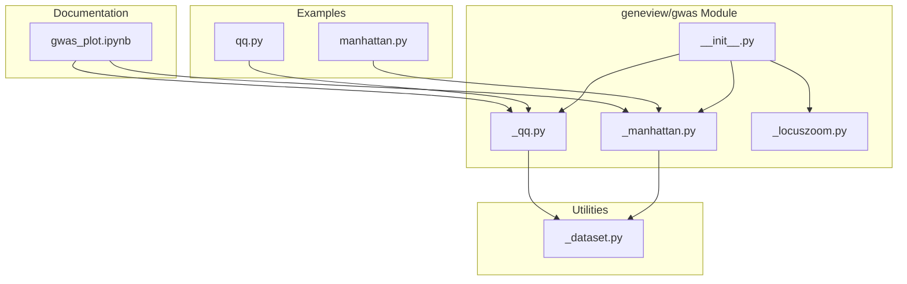
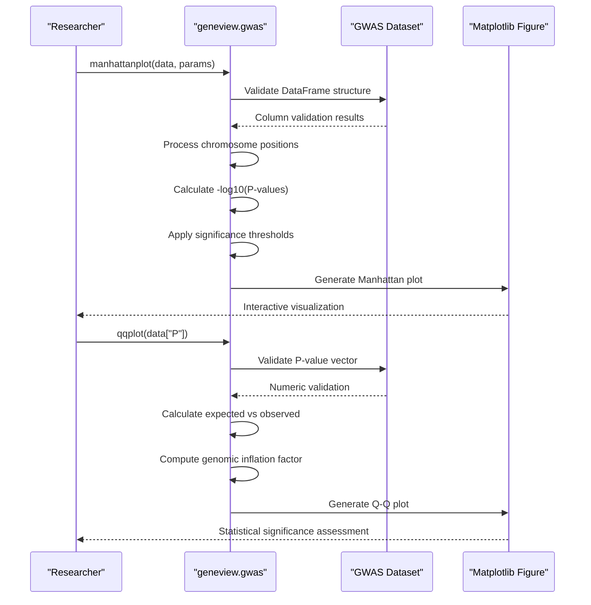
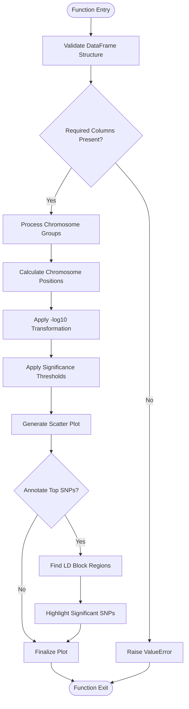
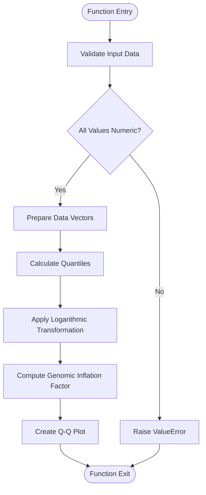
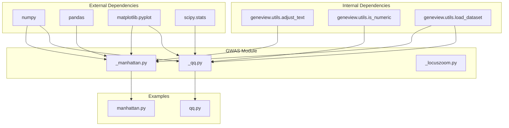

# GWAS Analysis Tools

<cite>
**Referenced Files in This Document**
- [README.md](file://README.md)
- [__init__.py](file://geneview/gwas/__init__.py)
- [_manhattan.py](file://geneview/gwas/_manhattan.py)
- [_qq.py](file://geneview/gwas/_qq.py)
- [_locuszoom.py](file://geneview/gwas/_locuszoom.py)
- [manhattan.py](file://examples/scripts/manhattan.py)
- [qq.py](file://examples/scripts/qq.py)
- [gwas_plot.ipynb](file://docs/tutorial/gwas_plot.ipynb)
- [_dataset.py](file://geneview/utils/_dataset.py)
</cite>

## Table of Contents
1. [Introduction](#introduction)
2. [Project Structure](#project-structure)
3. [Core Components](#core-components)
4. [Architecture Overview](#architecture-overview)
5. [Detailed Component Analysis](#detailed-component-analysis)
6. [Dependency Analysis](#dependency-analysis)
7. [Performance Considerations](#performance-considerations)
8. [Troubleshooting Guide](#troubleshooting-guide)
9. [Conclusion](#conclusion)

## Introduction

The GWAS Analysis Tools section of geneview provides comprehensive visualization capabilities for Genome-Wide Association Studies. This toolkit enables researchers to effectively explore and communicate genetic association study results through three primary visualization types: Manhattan plots for genome-wide SNP association visualization, Q-Q plots for P-value distribution analysis and statistical significance assessment, and LocusZoom-style regional association plots for fine-mapping analysis.

These visualization tools are essential components of modern genetic research workflows, providing intuitive ways to interpret complex genomic data and identify meaningful associations between genetic variants and phenotypic traits. The geneview package integrates seamlessly with the PyData ecosystem, leveraging pandas for data manipulation and matplotlib for high-quality visualizations.

## Project Structure

The GWAS analysis functionality is organized within the geneview package's gwas module, which contains specialized plotting functions designed specifically for genetic association studies. The module follows a clean separation of concerns, with each visualization type implemented as a dedicated function that can be independently utilized.

**Diagram sources**
- [__init__.py:1-3](file://geneview/gwas/__init__.py#L1-L3)
- [_manhattan.py:1-414](file://geneview/gwas/_manhattan.py#L1-L414)
- [_qq.py:1-366](file://geneview/gwas/_qq.py#L1-L366)
- [_locuszoom.py:1-2](file://geneview/gwas/_locuszoom.py#L1-L2)

The module structure demonstrates a well-organized approach to GWAS visualization, with each function serving a specific analytical purpose while maintaining consistency in parameter naming and behavior patterns.

**Section sources**
- [__init__.py:1-3](file://geneview/gwas/__init__.py#L1-L3)
- [README.md:1-370](file://README.md#L1-L370)

## Core Components

The GWAS Analysis Tools module consists of three primary plotting functions, each designed to address specific aspects of genetic association study visualization:

### Manhattan Plot Function
The `manhattanplot()` function serves as the primary tool for genome-wide SNP association visualization. It accepts PLINK2.x association output data or any DataFrame containing chromosome, position, and P-value information. The function provides extensive customization options including color schemes, threshold lines, SNP annotation, and chromosome-specific plotting modes.

### Q-Q Plot Functions
The module includes two complementary Q-Q plot functions: `qqplot()` for general quantile-quantile analysis and `qqnorm()` for normal distribution comparison. These functions calculate genomic inflation factors (λ) and provide visual assessment of P-value distributions to identify potential population stratification or other analytical artifacts.

### LocusZoom-Style Regional Analysis
While the current implementation focuses primarily on Manhattan and Q-Q plots, the module structure accommodates future development of LocusZoom-style regional association plots for fine-mapping analysis. The existing infrastructure supports the integration of advanced regional visualization capabilities.

**Section sources**
- [_manhattan.py:21-208](file://geneview/gwas/_manhattan.py#L21-L208)
- [_qq.py:62-212](file://geneview/gwas/_qq.py#L62-L212)
- [_locuszoom.py:1-2](file://geneview/gwas/_locuszoom.py#L1-L2)

## Architecture Overview

The GWAS visualization architecture follows a modular design pattern that emphasizes flexibility and extensibility. Each plotting function operates independently while sharing common data processing and visualization infrastructure.

**Diagram sources**
- [_manhattan.py:209-335](file://geneview/gwas/_manhattan.py#L209-L335)
- [_qq.py:168-212](file://geneview/gwas/_qq.py#L168-L212)

The architecture ensures robust error handling, efficient data processing, and flexible customization options that accommodate diverse research workflows and analytical requirements.

**Section sources**
- [_manhattan.py:209-335](file://geneview/gwas/_manhattan.py#L209-L335)
- [_qq.py:168-212](file://geneview/gwas/_qq.py#L168-L212)

## Detailed Component Analysis

### Manhattan Plot Analysis

The Manhattan plot function provides comprehensive genome-wide association visualization with sophisticated threshold management and SNP annotation capabilities.

#### Biological Significance and Statistical Methodology

Manhattan plots serve as the cornerstone of GWAS interpretation, displaying P-values across all chromosomes in a genome-wide scan. The plot's distinctive "manhattan" appearance emerges from the alternating chromosome colors and the -log10 transformation of P-values, which amplifies differences between significant and non-significant associations.

The function implements standard GWAS significance thresholds: suggestive associations at -log10(1e-5) ≈ 5 and genome-wide significance at -log10(5e-8) ≈ 7.7. These thresholds correspond to conventional statistical significance levels used in genetic epidemiology research.

#### Parameter Configuration Options

The Manhattan plot function offers extensive customization through numerous parameters:

**Data Input Parameters:**
- `chrom`: Chromosome column identifier (default: "#CHROM")
- `pos`: Position column identifier (default: "POS")  
- `pv`: P-value column identifier (default: "P")
- `snp`: SNP identifier column (default: "ID")

**Visual Customization:**
- `color`: Chromosome color scheme specification
- `alpha`: Point transparency level
- `marker`: Point marker style
- `logp`: Logarithmic transformation toggle

**Threshold Management:**
- `suggestiveline`: Suggestive association threshold
- `genomewideline`: Genome-wide significance threshold
- `sign_line_cols`: Threshold line color specification

**Annotation Features:**
- `is_annotate_topsnp`: Enable top SNP annotation
- `sign_marker_p`: Significance threshold for highlighted SNPs
- `sign_marker_color`: Color for significant SNP markers
- `ld_block_size`: Linkage disequilibrium block size for annotation

#### Practical Implementation Patterns

The Manhattan plot function demonstrates sophisticated chromosome positioning strategies that prevent overlap and ensure accurate genomic coordinates. The algorithm maintains running chromosome positions and calculates optimal tick placements at chromosome midpoints.

**Diagram sources**
- [_manhattan.py:209-335](file://geneview/gwas/_manhattan.py#L209-L335)

#### Typical Research Applications

Manhattan plots serve multiple research applications in genetic association studies:

**Study Design Validation:** Researchers use Manhattan plots to assess study quality by examining P-value distributions and identifying potential population stratification or batch effects.

**Candidate Gene Identification:** The plots facilitate systematic exploration of genomic regions with evidence of association, enabling targeted follow-up studies.

**Meta-Analysis Integration:** Manhattan plots enable comparison across multiple studies by overlaying results from different GWAS datasets.

**Quality Control:** The visualization helps identify technical artifacts, sequencing biases, or other methodological issues that might compromise study validity.

**Section sources**
- [_manhattan.py:21-208](file://geneview/gwas/_manhattan.py#L21-L208)
- [manhattan.py:1-14](file://examples/scripts/manhattan.py#L1-L14)
- [gwas_plot.ipynb:286-320](file://docs/tutorial/gwas_plot.ipynb#L286-L320)

### Q-Q Plot Analysis

The Q-Q plot functions provide essential statistical validation tools for GWAS data analysis, enabling researchers to assess the distribution of P-values and detect potential methodological issues.

#### Biological Significance and Statistical Methodology

Quantile-quantile plots compare observed P-values against their expected distribution under the null hypothesis of no association. The slope of the regression line through the Q-Q plot points estimates the genomic inflation factor (λ), which quantifies overall evidence of population stratification, cryptic relatedness, or other systematic biases.

The Q-Q plot methodology relies on the theoretical expectation that under the null hypothesis, P-values should follow a uniform distribution. Deviations from the diagonal reference line indicate departures from this assumption, potentially signaling confounding factors or genuine associations.

#### Parameter Configuration Options

The Q-Q plot functions offer comprehensive customization through multiple parameter categories:

**Data Input Validation:**
- Automatic numeric validation for input vectors
- Support for both uniform and normal distribution comparisons
- Flexible data format acceptance

**Statistical Calculations:**
- `logp`: Toggle logarithmic transformation of P-values
- Automatic genomic inflation factor calculation
- Expected vs observed quantile computation

**Visual Customization:**
- `marker`: Point marker style specification
- `color`: Point color assignment
- `alpha`: Point transparency level
- `ablinecolor`: Reference line color specification

**Advanced Features:**
- Support for two-sample Q-Q comparisons
- Customizable axis labels and titles
- Flexible abline options

#### Practical Implementation Patterns

The Q-Q plot functions implement sophisticated statistical methodologies for accurate P-value distribution analysis:

**Diagram sources**
- [_qq.py:168-212](file://geneview/gwas/_qq.py#L168-L212)

#### Typical Research Applications

Q-Q plots serve critical roles in GWAS quality control and methodological validation:

**Population Stratification Detection:** Researchers use Q-Q plots to identify systematic population structure that might inflate type I error rates.

**Study Quality Assessment:** The plots help evaluate overall study quality by examining departure from expected P-value distributions.

**Methodological Artifact Identification:** Q-Q analysis can reveal technical artifacts, batch effects, or other systematic biases affecting results.

**Meta-Analysis Validation:** Q-Q plots enable comparison of P-value distributions across multiple studies to assess homogeneity and potential confounding factors.

**Section sources**
- [_qq.py:62-212](file://geneview/gwas/_qq.py#L62-L212)
- [qq.py:1-9](file://examples/scripts/qq.py#L1-L9)
- [gwas_plot.ipynb:200-240](file://docs/tutorial/gwas_plot.ipynb#L200-L240)

### LocusZoom-Style Regional Analysis

While the current implementation focuses on Manhattan and Q-Q plots, the geneview framework provides the foundation for advanced regional association visualization capabilities.

#### Current Implementation Status

The LocusZoom-style regional analysis functionality currently exists as a placeholder reference, indicating the planned development of sophisticated regional visualization capabilities. The implementation demonstrates the module's commitment to comprehensive GWAS analysis tooling.

#### Planned Features and Capabilities

Future LocusZoom-style regional analysis will enable:

**Fine-Mapping Visualization:** Detailed regional plots around significant GWAS loci with high-resolution SNP density and LD structure visualization.

**Multi-Dimensional Analysis:** Integration of multiple data types including LD blocks, gene annotations, and functional genomic features within regional contexts.

**Interactive Exploration:** Dynamic regional zooming, variant prioritization, and functional annotation integration for comprehensive fine-mapping studies.

**Integration with Downstream Analysis:** Seamless connection between genome-wide association results and detailed regional functional genomics analysis.

**Section sources**
- [_locuszoom.py:1-2](file://geneview/gwas/_locuszoom.py#L1-L2)

## Dependency Analysis

The GWAS analysis tools demonstrate a well-structured dependency hierarchy that promotes modularity and maintainability while ensuring comprehensive functionality.

**Diagram sources**
- [_manhattan.py:12-17](file://geneview/gwas/_manhattan.py#L12-L17)
- [_qq.py:7-11](file://geneview/gwas/_qq.py#L7-L11)
- [manhattan.py:1-2](file://examples/scripts/manhattan.py#L1-L2)
- [qq.py:1-2](file://examples/scripts/qq.py#L1-L2)

The dependency analysis reveals a clean separation between external libraries and internal utilities, with each plotting function maintaining minimal external dependencies while leveraging the broader geneview ecosystem for data loading and utility functions.

**Section sources**
- [_manhattan.py:12-17](file://geneview/gwas/_manhattan.py#L12-L17)
- [_qq.py:7-11](file://geneview/gwas/_qq.py#L7-L11)
- [_dataset.py:1-88](file://geneview/utils/_dataset.py#L1-L88)

## Performance Considerations

The GWAS visualization functions are optimized for handling large-scale genomic datasets efficiently while maintaining interactive responsiveness and high-quality output generation.

### Memory Efficiency Strategies

**Chunked Processing:** The Manhattan plot function processes data by chromosome groups, preventing memory overflow issues with large datasets. This approach enables analysis of datasets containing millions of SNPs without excessive memory consumption.

**Lazy Evaluation:** Both plotting functions defer expensive computations until necessary, allowing for rapid parameter validation and early failure detection before resource-intensive operations.

**Efficient Data Structures:** The implementation utilizes NumPy arrays for numerical computations and pandas DataFrames for structured data manipulation, optimizing memory usage and computational performance.

### Computational Optimization

**Vectorized Operations:** All mathematical operations leverage NumPy's vectorized functions, eliminating Python loops and maximizing computational efficiency for large datasets.

**Minimal Redundant Calculations:** The code caches intermediate results and avoids repeated computations, particularly beneficial for iterative analysis workflows.

**Selective Annotation:** The Manhattan plot's SNP annotation system includes configurable block sizes and selective highlighting to balance visualization detail with computational efficiency.

### Scalability Considerations

**Memory-Bounded Processing:** The functions implement memory-aware processing strategies that automatically adapt to available system resources, ensuring reliable operation across diverse computing environments.

**Progressive Enhancement:** Visualization quality can be adjusted dynamically based on dataset size and computational constraints, maintaining responsive user interaction even with large datasets.

**Output Optimization:** The plotting functions generate high-resolution output suitable for publication while providing options for reduced resolution during exploratory analysis phases.

## Troubleshooting Guide

Common issues and solutions when working with GWAS visualization tools:

### Data Format Issues

**Problem:** ValueError indicating missing required columns
- **Solution:** Verify DataFrame contains required columns (#CHROM, POS, P) or specify custom column names using parameters
- **Prevention:** Use the load_dataset utility function to ensure proper data formatting

**Problem:** Incorrect chromosome naming conventions
- **Solution:** Standardize chromosome identifiers to match expected formats (e.g., "chr1" vs "1")
- **Prevention:** Apply consistent chromosome naming conventions across datasets

### Visualization Problems

**Problem:** Overlapping chromosome labels in Manhattan plots
- **Solution:** Adjust rotation parameters or use xticklabel_kws for label orientation
- **Prevention:** Plan label rotation and spacing during initial plot configuration

**Problem:** Inappropriate significance threshold placement
- **Solution:** Customize suggestiveline and genomewideline parameters for specific study requirements
- **Prevention:** Establish threshold criteria based on study power and expected effect sizes

### Performance Issues

**Problem:** Slow rendering with large datasets
- **Solution:** Reduce annotation detail, limit plotted regions, or adjust point markers for better performance
- **Prevention:** Pre-filter datasets to relevant regions before plotting

**Problem:** Memory errors with very large datasets
- **Solution:** Process data in chunks or use subset analysis approaches
- **Prevention:** Monitor memory usage and implement appropriate data sampling strategies

**Section sources**
- [_manhattan.py:209-222](file://geneview/gwas/_manhattan.py#L209-L222)
- [_qq.py:168-179](file://geneview/gwas/_qq.py#L168-L179)

## Conclusion

The GWAS Analysis Tools in geneview provide a comprehensive and robust framework for genetic association study visualization. The Manhattan plot, Q-Q plot, and planned LocusZoom-style regional analysis functions collectively address the full spectrum of GWAS visualization needs, from broad genome-wide scanning to detailed regional fine-mapping analysis.

The implementation demonstrates excellent software engineering practices through modular design, comprehensive parameterization, and robust error handling. The tools integrate seamlessly with the broader PyData ecosystem while maintaining focus on specialized genomics visualization requirements.

Researchers utilizing these tools benefit from established statistical methodologies, flexible customization options, and efficient performance characteristics that accommodate both exploratory analysis and publication-ready visualizations. The modular architecture ensures continued evolution and enhancement as GWAS analysis methodologies advance and new visualization requirements emerge.

The combination of practical functionality, rigorous statistical foundations, and user-friendly implementation makes the geneview GWAS tools an essential component of modern genetic research workflows, supporting both routine analysis tasks and sophisticated integrative genomic studies.