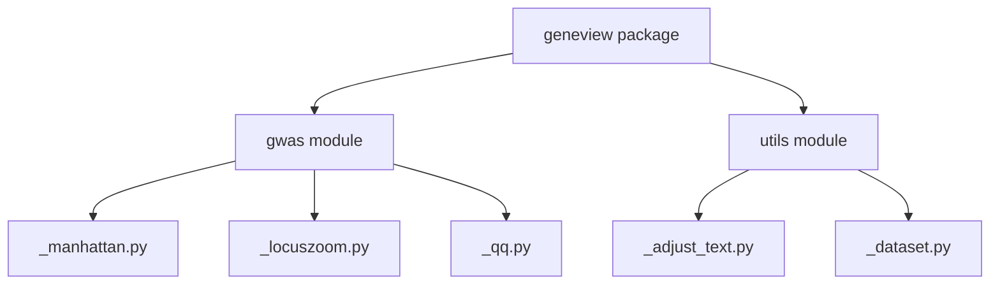
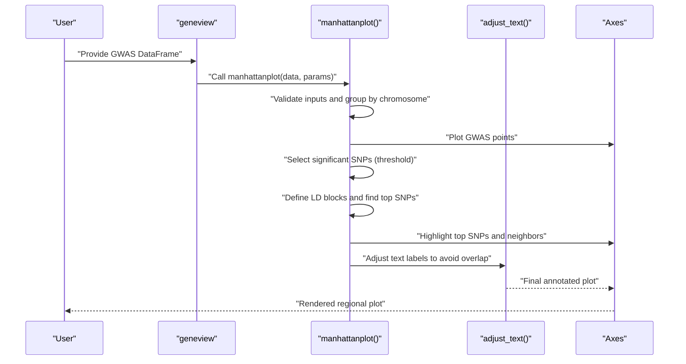
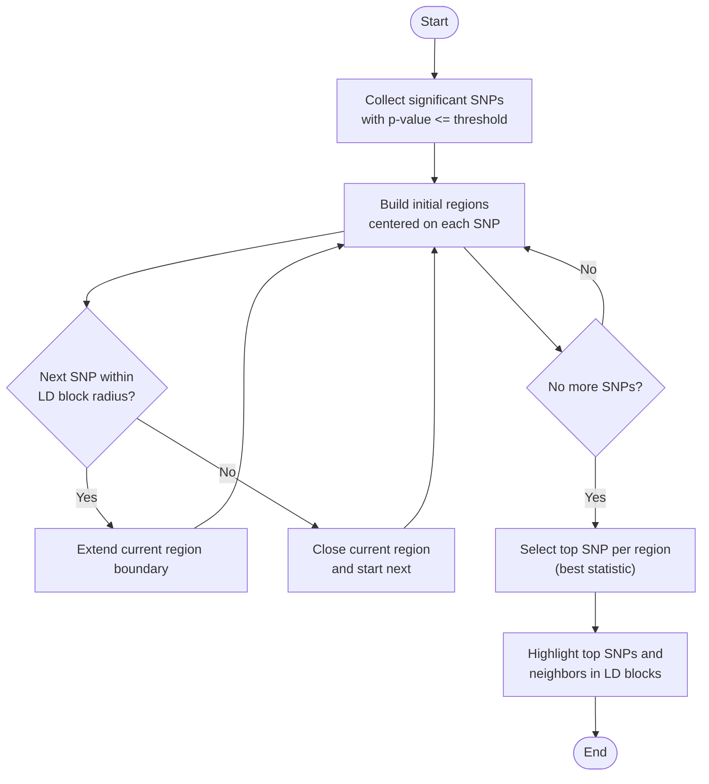
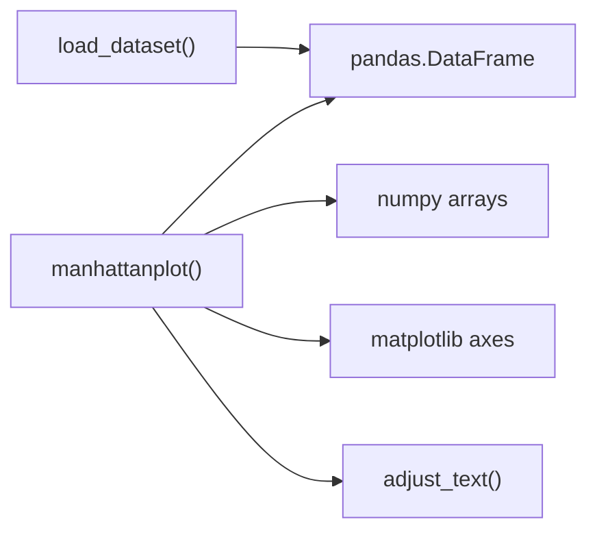

# LocusZoom-style Regional Analysis

<cite>
**Referenced Files in This Document**
- [_manhattan.py](file://geneview/gwas/_manhattan.py)
- [_locuszoom.py](file://geneview/gwas/_locuszoom.py)
- [_qq.py](file://geneview/gwas/_qq.py)
- [__init__.py](file://geneview/gwas/__init__.py)
- [README.md](file://README.md)
- [test_manhattan.py](file://geneview/tests/test_manhattan.py)
- [_adjust_text.py](file://geneview/utils/_adjust_text.py)
- [_dataset.py](file://geneview/utils/_dataset.py)
</cite>

## Table of Contents
1. [Introduction](#introduction)
2. [Project Structure](#project-structure)
3. [Core Components](#core-components)
4. [Architecture Overview](#architecture-overview)
5. [Detailed Component Analysis](#detailed-component-analysis)
6. [Dependency Analysis](#dependency-analysis)
7. [Performance Considerations](#performance-considerations)
8. [Troubleshooting Guide](#troubleshooting-guide)
9. [Conclusion](#conclusion)
10. [Appendices](#appendices)

## Introduction
This document describes how to implement LocusZoom-style regional association visualization for fine-mapping and candidate gene identification using the geneview package. It explains the regional plotting methodology, LD block–based SNP selection, and multi-panel display strategies. It documents parameter options for region sizing, LD thresholds, gene annotation overlays, and custom panel configurations. Practical workflows demonstrate investigating candidate loci, prioritizing genes, integrating functional annotations, and scaling to large regional analyses.

## Project Structure
The regional analysis capability in geneview centers on GWAS plotting utilities and supporting utilities for data loading and text adjustment. The most relevant module for regional association visualization is the Manhattan plot implementation, which includes LD block–based top SNP selection and annotation logic. The LocusZoom module currently contains a placeholder for the LocusZoom reference URL. Additional plotting utilities (QQ) and utility modules (dataset loading, text adjustment) support regional workflows.

**Diagram sources**
- [__init__.py:1-3](file://geneview/gwas/__init__.py#L1-L3)
- [_manhattan.py:1-414](file://geneview/gwas/_manhattan.py#L1-L414)
- [_locuszoom.py:1-2](file://geneview/gwas/_locuszoom.py#L1-L2)
- [_qq.py:1-366](file://geneview/gwas/_qq.py#L1-L366)
- [_adjust_text.py:1-759](file://geneview/utils/_adjust_text.py#L1-L759)
- [_dataset.py:1-88](file://geneview/utils/_dataset.py#L1-L88)

**Section sources**
- [README.md:1-370](file://README.md#L1-L370)
- [__init__.py:1-3](file://geneview/gwas/__init__.py#L1-L3)

## Core Components
- Regional association plotting via Manhattan plot with LD block–based top SNP selection and annotation
- Parameterized thresholds for significance lines and top SNP highlighting
- Utility for automatic text adjustment to avoid label overlap
- Dataset loading helpers for quick access to example GWAS data
- Placeholder for LocusZoom-style regional viewer (reference URL included)

Key capabilities:
- Window-based SNP selection and LD block definition for top SNP annotation
- Optional chromosome-specific plotting for “zoom-in” regional views
- Multi-panel display strategies supported by combining panels via subplot grids

**Section sources**
- [_manhattan.py:21-414](file://geneview/gwas/_manhattan.py#L21-L414)
- [_adjust_text.py:439-759](file://geneview/utils/_adjust_text.py#L439-L759)
- [_dataset.py:22-88](file://geneview/utils/_dataset.py#L22-L88)
- [_locuszoom.py:1-2](file://geneview/gwas/_locuszoom.py#L1-L2)

## Architecture Overview
The regional analysis pipeline integrates data ingestion, plotting, and annotation. The Manhattan plot function orchestrates:
- Input validation and axis setup
- Scatter plotting of GWAS statistics
- LD block–based grouping and top SNP selection
- Annotation of top SNPs and neighboring SNPs within LD blocks
- Threshold lines for suggestive and genome-wide significance

**Diagram sources**
- [_manhattan.py:21-335](file://geneview/gwas/_manhattan.py#L21-L335)
- [_adjust_text.py:439-759](file://geneview/utils/_adjust_text.py#L439-L759)

## Detailed Component Analysis

### Regional Association Plotting Methodology
The regional plotting methodology leverages:
- Chromosome-wise grouping and cumulative x-position mapping for linear genome layout
- Optional chromosome-specific view for zoomed regional inspection
- Significance thresholds for highlighting and labeling

Implementation highlights:
- Input validation ensures required columns are present
- Scatter plot rendering with configurable colors and transparency
- Horizontal significance lines for suggestive and genome-wide thresholds
- Optional chromosome-specific x-axis scaling to show base-pair positions

Practical implications:
- Enables rapid identification of candidate regions and top signals
- Facilitates follow-up inspection of local LD structure and associated variants

**Section sources**
- [_manhattan.py:21-335](file://geneview/gwas/_manhattan.py#L21-L335)

### LD Block–Based SNP Selection and Top SNP Annotation
LD block–based selection groups significant SNPs into contiguous regions defined by a fixed window size. The algorithm:
- Builds regions centered on significant SNP coordinates
- Merges overlapping or adjacent regions within the LD block radius
- Selects the top SNP per region based on the chosen statistic (e.g., smallest p-value)

**Diagram sources**
- [_manhattan.py:338-413](file://geneview/gwas/_manhattan.py#L338-L413)

**Section sources**
- [_manhattan.py:338-413](file://geneview/gwas/_manhattan.py#L338-L413)
- [test_manhattan.py:174-283](file://geneview/tests/test_manhattan.py#L174-L283)

### Multi-Panel Display Strategies
Multi-panel layouts can combine:
- Regional Manhattan plot (association statistics)
- LD block–highlighted top SNP annotations
- Optional secondary panels such as QQ plots or gene density tracks

Guidance:
- Use subplot grids to arrange panels
- Align shared axes (e.g., chromosome position) across panels
- Apply consistent LD block parameters across panels for comparability

Note: The current codebase provides the foundational plotting primitives; multi-panel composition is application-level orchestration.

[No sources needed since this section synthesizes existing capabilities without analyzing specific new files]

### Conditional Analysis Integration
Conditional analysis can be integrated by:
- Pre-filtering variants to exclude those in strong LD with conditioning SNPs
- Re-running association testing within refined sets
- Overlaying conditional results on the regional plot (e.g., secondary tracks or point symbols)

Recommendations:
- Maintain consistent LD block definitions across unconditional and conditional runs
- Use separate layers or colors to distinguish conditional signals

[No sources needed since this section provides conceptual integration guidance]

### Parameter Options for Regional Analysis
Core parameters for regional analysis:
- Region sizing: chromosome-specific view via chromosome selection
- LD threshold settings: LD block size controlling neighborhood grouping
- Gene annotation overlay: manual placement of gene labels or integration with external annotation tracks
- Custom panel configurations: subplot arrangements and shared axes

Parameter references:
- Chromosome selection and x-axis scaling for regional zoom
- LD block size for top SNP grouping
- Significance thresholds and line colors
- Text adjustment parameters for label avoidance

**Section sources**
- [_manhattan.py:21-120](file://geneview/gwas/_manhattan.py#L21-L120)
- [_adjust_text.py:439-759](file://geneview/utils/_adjust_text.py#L439-L759)

### Practical Workflows and Examples
Candidate locus investigation workflow:
- Identify genome-wide significant hits and define a regional window around top signals
- Plot regional Manhattan with LD block–based top SNP highlighting
- Explore linkage disequilibrium structure by zooming into the region
- Prioritize candidate genes by proximity to top signals and functional annotations

Prioritization approaches:
- Rank genes by distance to top SNP within LD block
- Integrate functional annotations (e.g., conservation, expression) as additional evidence

Functional annotation integration:
- Overlay gene models or functional categories as separate tracks
- Use text adjustment to prevent label overlap with points

Large-scale regional analysis:
- Batch process multiple candidate regions with consistent parameters
- Automate figure generation and export for reporting

[No sources needed since this section provides conceptual workflows]

## Dependency Analysis
The regional plotting pipeline depends on:
- Matplotlib for rendering
- Pandas for data handling
- NumPy for numerical operations
- Internal utilities for dataset loading and text adjustment

**Diagram sources**
- [_manhattan.py:21-335](file://geneview/gwas/_manhattan.py#L21-L335)
- [_adjust_text.py:439-759](file://geneview/utils/_adjust_text.py#L439-L759)
- [_dataset.py:22-88](file://geneview/utils/_dataset.py#L22-L88)

**Section sources**
- [_manhattan.py:12-18](file://geneview/gwas/_manhattan.py#L12-L18)
- [_dataset.py:1-88](file://geneview/utils/_dataset.py#L1-L88)

## Performance Considerations
- Large regional windows: reduce the number of plotted points by filtering to a subset of SNPs within the region of interest
- Efficient text adjustment: tune precision and iteration limits in text adjustment to balance quality and speed
- Vectorized operations: leverage NumPy for fast computations on large arrays
- Memory usage: avoid loading entire genome-wide datasets into memory; process regions iteratively

[No sources needed since this section provides general guidance]

## Troubleshooting Guide
Common issues and resolutions:
- Empty or invalid input DataFrame: ensure required columns are present and formatted correctly
- Overlapping x-axis labels: rotate labels or use automatic text adjustment
- No significant SNPs identified: relax significance thresholds or adjust LD block size
- Zero-size arrays during plotting: verify non-empty subsets for the selected chromosome or region

Validation references:
- Input validation and error messages for missing columns
- Tests covering edge cases for LD block functions

**Section sources**
- [_manhattan.py:209-272](file://geneview/gwas/_manhattan.py#L209-L272)
- [test_manhattan.py:174-283](file://geneview/tests/test_manhattan.py#L174-L283)

## Conclusion
The geneview package provides robust primitives for LocusZoom-style regional association visualization. The Manhattan plot implementation supports LD block–based top SNP selection, chromosome-specific zooming, and automatic text adjustment. While the current codebase focuses on association plotting, multi-panel strategies and conditional analysis can be integrated at the application level. With careful parameter tuning and batch processing, researchers can efficiently investigate candidate loci, prioritize genes, and scale to large regional analyses.

[No sources needed since this section summarizes without analyzing specific files]

## Appendices

### Appendix A: Example Parameter Settings
- Region size specification: select a single chromosome for regional zoom
- LD threshold settings: adjust LD block size for top SNP grouping
- Gene annotation overlay: place gene labels near top SNPs or integrate external tracks
- Custom panel configurations: arrange panels using subplot grids

**Section sources**
- [_manhattan.py:81-120](file://geneview/gwas/_manhattan.py#L81-L120)
- [_adjust_text.py:439-759](file://geneview/utils/_adjust_text.py#L439-L759)

### Appendix B: Related Utilities
- QQ plots for assessing distributional assumptions
- Dataset loading helpers for quick access to example data

**Section sources**
- [_qq.py:62-212](file://geneview/gwas/_qq.py#L62-L212)
- [_dataset.py:22-88](file://geneview/utils/_dataset.py#L22-L88)