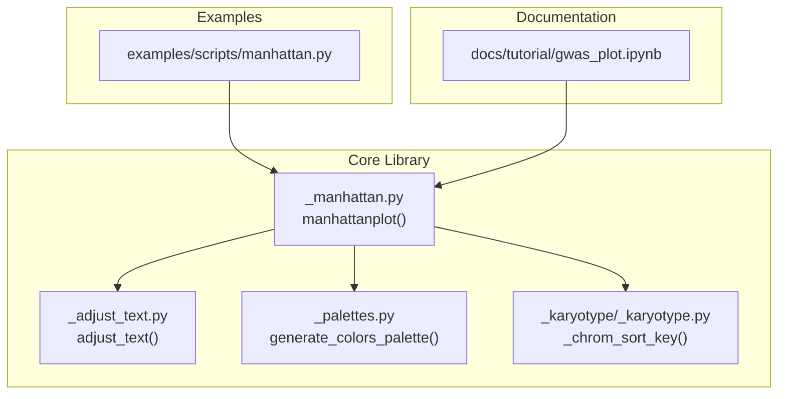
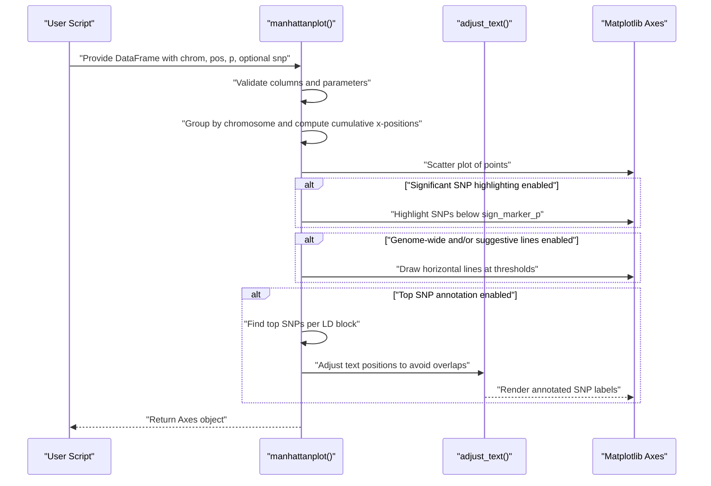
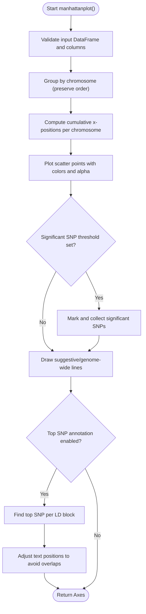
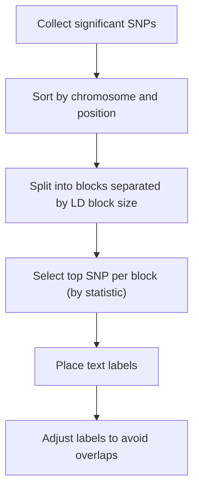
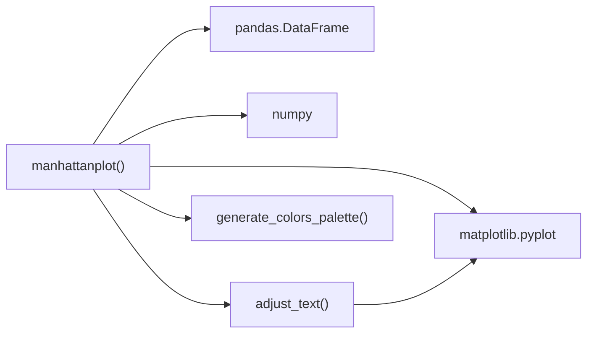

# Manhattan Plots

<cite>
**Referenced Files in This Document**
- [README.md](file://README.md)
- [examples/scripts/manhattan.py](file://examples/scripts/manhattan.py)
- [docs/tutorial/gwas_plot.ipynb](file://docs/tutorial/gwas_plot.ipynb)
- [geneview/gwas/_manhattan.py](file://geneview/gwas/_manhattan.py)
- [_adjust_text.py](file://geneview/utils/_adjust_text.py)
- [test_manhattan.py](file://geneview/tests/test_manhattan.py)
- [geneview/palette/_palettes.py](file://geneview/palette/_palettes.py)
- [geneview/karyotype/_karyotype.py](file://geneview/karyotype/_karyotype.py)
</cite>

## Table of Contents
1. [Introduction](#introduction)
2. [Project Structure](#project-structure)
3. [Core Components](#core-components)
4. [Architecture Overview](#architecture-overview)
5. [Detailed Component Analysis](#detailed-component-analysis)
6. [Dependency Analysis](#dependency-analysis)
7. [Performance Considerations](#performance-considerations)
8. [Troubleshooting Guide](#troubleshooting-guide)
9. [Conclusion](#conclusion)
10. [Appendices](#appendices)

## Introduction
This document explains how to create Manhattan plots for genome-wide SNP association analysis using the geneview package. It covers biological significance of chromosome positioning, significance thresholds (suggestive and genome-wide), SNP annotation strategies, coordinate calculation, data preprocessing requirements, and customization options. Practical examples demonstrate preparing GWAS summary statistics, setting thresholds, and interactive SNP highlighting. It also outlines common research applications such as locus identification, replication validation, and multi-trait comparisons, and describes integration with genomic annotation resources and quality control filtering approaches.

## Project Structure
The Manhattan plot functionality resides in the GWAS module and integrates with utilities for automatic text adjustment and color palettes. Example scripts and tutorials illustrate usage and parameterization.

**Diagram sources**
- [examples/scripts/manhattan.py:1-14](file://examples/scripts/manhattan.py#L1-L14)
- [docs/tutorial/gwas_plot.ipynb:1-200](file://docs/tutorial/gwas_plot.ipynb#L1-L200)
- [geneview/gwas/_manhattan.py:21-335](file://geneview/gwas/_manhattan.py#L21-L335)
- [geneview/utils/_adjust_text.py:439-759](file://geneview/utils/_adjust_text.py#L439-L759)
- [geneview/palette/_palettes.py:5-12](file://geneview/palette/_palettes.py#L5-L12)
- [geneview/karyotype/_karyotype.py:16-26](file://geneview/karyotype/_karyotype.py#L16-L26)

**Section sources**
- [README.md:43-197](file://README.md#L43-L197)
- [examples/scripts/manhattan.py:1-14](file://examples/scripts/manhattan.py#L1-L14)
- [docs/tutorial/gwas_plot.ipynb:1-200](file://docs/tutorial/gwas_plot.ipynb#L1-L200)

## Core Components
- manhattanplot(): Creates a Manhattan plot from a DataFrame with columns for chromosome, position, and p-value. It supports custom thresholds, color schemes, point markers, and SNP annotation.
- adjust_text(): Automatically adjusts text labels to avoid overlaps and improve readability.
- generate_colors_palette(): Generates color palettes from matplotlib colormaps or explicit lists.
- _chrom_sort_key(): Provides biological ordering for chromosome labels, relevant for consistent x-axis labeling.

Key parameters include:
- Data columns: chromosome, position, p-value, and optionally SNP identifiers.
- Thresholds: suggestive and genome-wide significance lines.
- Annotation: top SNP per significant region and optional highlighting of nearby SNPs.
- Formatting: colors, marker style, alpha, axis labels, and tick label rotation.

**Section sources**
- [geneview/gwas/_manhattan.py:21-125](file://geneview/gwas/_manhattan.py#L21-L125)
- [geneview/gwas/_manhattan.py:298-301](file://geneview/gwas/_manhattan.py#L298-L301)
- [geneview/gwas/_manhattan.py:304-308](file://geneview/gwas/_manhattan.py#L304-L308)
- [geneview/utils/_adjust_text.py:439-759](file://geneview/utils/_adjust_text.py#L439-L759)
- [geneview/palette/_palettes.py:5-12](file://geneview/palette/_palettes.py#L5-L12)
- [geneview/karyotype/_karyotype.py:16-26](file://geneview/karyotype/_karyotype.py#L16-L26)

## Architecture Overview
The Manhattan plot pipeline processes a DataFrame, computes cumulative chromosome positions, plots points with optional significance highlighting, draws horizontal significance lines, and annotates top SNPs with automatic text adjustment.

**Diagram sources**
- [geneview/gwas/_manhattan.py:21-335](file://geneview/gwas/_manhattan.py#L21-L335)
- [geneview/utils/_adjust_text.py:439-759](file://geneview/utils/_adjust_text.py#L439-L759)

## Detailed Component Analysis

### manhattanplot() Implementation
- Input validation ensures required columns exist and incompatible parameters are not used together.
- Chromosome grouping preserves input order; cumulative x-positions are computed to space chromosomes along the x-axis.
- Points are colored by chromosome (alternating colors) or highlighted when meeting significance thresholds.
- Horizontal lines indicate suggestive and genome-wide thresholds; colors and styles configurable.
- Top SNP annotation identifies the most significant SNP within LD blocks and places labels with automatic adjustment.

**Diagram sources**
- [geneview/gwas/_manhattan.py:210-335](file://geneview/gwas/_manhattan.py#L210-L335)

**Section sources**
- [geneview/gwas/_manhattan.py:21-125](file://geneview/gwas/_manhattan.py#L21-L125)
- [geneview/gwas/_manhattan.py:241-278](file://geneview/gwas/_manhattan.py#L241-L278)
- [geneview/gwas/_manhattan.py:298-308](file://geneview/gwas/_manhattan.py#L298-L308)

### Top SNP Annotation and LD Block Strategy
- Significant SNPs are collected when meeting the threshold; a sliding window approach groups SNPs by chromosome and genomic distance.
- The top SNP per block is selected by the maximum (or minimum, depending on scale) statistic within the block.
- Automatic text adjustment prevents overlapping labels and improves readability.

**Diagram sources**
- [geneview/gwas/_manhattan.py:338-364](file://geneview/gwas/_manhattan.py#L338-L364)
- [geneview/gwas/_manhattan.py:367-386](file://geneview/gwas/_manhattan.py#L367-L386)
- [geneview/gwas/_manhattan.py:389-413](file://geneview/gwas/_manhattan.py#L389-L413)
- [geneview/utils/_adjust_text.py:439-759](file://geneview/utils/_adjust_text.py#L439-L759)

**Section sources**
- [geneview/gwas/_manhattan.py:338-413](file://geneview/gwas/_manhattan.py#L338-L413)
- [geneview/utils/_adjust_text.py:439-759](file://geneview/utils/_adjust_text.py#L439-L759)

### Parameter Options and Customization
- Data columns: customize column names for chromosome, position, p-value, and SNP identifier.
- Thresholds: set suggestive and genome-wide thresholds; disable either by passing None.
- Colors and markers: configure point colors, marker style, and alpha blending.
- Axis formatting: control x-axis tick labels, rotation, and chromosome selection for zoomed views.
- Text adjustment: fine-tune label placement and arrow connections via text keyword arguments.

Practical examples and parameterization are demonstrated in the example script and tutorial notebook.

**Section sources**
- [examples/scripts/manhattan.py:4-11](file://examples/scripts/manhattan.py#L4-L11)
- [docs/tutorial/gwas_plot.ipynb:452-485](file://docs/tutorial/gwas_plot.ipynb#L452-L485)
- [README.md:102-196](file://README.md#L102-L196)

### Data Preprocessing Requirements
- Required columns: chromosome, position, and p-value; optional SNP identifier for annotation.
- Data types: chromosome as string, position as numeric, p-value as float.
- Ordering: chromosome grouping preserves input order; for consistent x-axis labels, ensure chromosome names are standardized (e.g., “chr1”, “chrX”).

Quality control recommendations:
- Filter low-quality SNPs (e.g., missing genotype rate, Hardy–Weinberg equilibrium).
- Exclude SNPs with extreme imputation quality or strand ambiguity.
- Apply population stratification correction and cryptic relatedness adjustments prior to association testing.

Integration with annotation databases:
- Use external resources (e.g., dbSNP, ClinVar, GWAS Catalog) to annotate top hits and prioritize known functional variants.
- Overlay LD information and linkage to regulatory annotations to contextualize signals.

**Section sources**
- [geneview/gwas/_manhattan.py:210-221](file://geneview/gwas/_manhattan.py#L210-L221)
- [README.md:45-64](file://README.md#L45-L64)

### Research Applications and Workflows
- Locus identification: Use top SNP annotation and LD block strategy to define candidate regions; combine with functional annotations.
- Replication validation: Compare signals across studies by overlaying Manhattan plots or focusing on shared top SNPs.
- Multi-trait comparison: Plot multiple traits on the same axis or compare trait-specific Manhattan plots to identify pleiotropy.

**Section sources**
- [docs/tutorial/gwas_plot.ipynb:472-485](file://docs/tutorial/gwas_plot.ipynb#L472-L485)
- [README.md:132-151](file://README.md#L132-L151)

## Dependency Analysis
The Manhattan plot depends on:
- Matplotlib for plotting and axes manipulation.
- Pandas for DataFrame handling and grouping.
- NumPy for numerical operations (e.g., logarithmic transformation).
- Internal utilities for automatic text adjustment and color palette generation.

**Diagram sources**
- [geneview/gwas/_manhattan.py:12-17](file://geneview/gwas/_manhattan.py#L12-L17)
- [geneview/utils/_adjust_text.py:8-14](file://geneview/utils/_adjust_text.py#L8-L14)
- [geneview/palette/_palettes.py:1-2](file://geneview/palette/_palettes.py#L1-L2)

**Section sources**
- [geneview/gwas/_manhattan.py:12-17](file://geneview/gwas/_manhattan.py#L12-L17)
- [geneview/utils/_adjust_text.py:8-14](file://geneview/utils/_adjust_text.py#L8-L14)
- [geneview/palette/_palettes.py:1-2](file://geneview/palette/_palettes.py#L1-L2)

## Performance Considerations
- Large datasets: Consider subsampling or pre-filtering to reduce rendering overhead.
- Text adjustment: Iterative adjustment can be computationally intensive; tune precision and iteration limits if needed.
- Color cycling: Efficient for many chromosomes; avoid excessive color permutations.

[No sources needed since this section provides general guidance]

## Troubleshooting Guide
Common issues and resolutions:
- Zero-size arrays: Ensure the input DataFrame contains valid data and required columns.
- Missing columns: Verify chromosome, position, and p-value columns exist; optionally provide SNP identifiers for annotation.
- Incompatible parameters: Do not set both chromosome selection and x-tick label set simultaneously.
- Overlapping labels: Increase spacing or adjust label rotation; use automatic text adjustment.

Validation and tests confirm expected behavior for thresholds, annotation, and invalid inputs.

**Section sources**
- [geneview/gwas/_manhattan.py:210-221](file://geneview/gwas/_manhattan.py#L210-L221)
- [test_manhattan.py:131-140](file://geneview/tests/test_manhattan.py#L131-L140)
- [test_manhattan.py:107-112](file://geneview/tests/test_manhattan.py#L107-L112)
- [test_manhattan.py:114-129](file://geneview/tests/test_manhattan.py#L114-L129)

## Conclusion
The geneview Manhattan plot provides a robust, customizable framework for GWAS visualization. It supports biological meaningful chromosome positioning, configurable significance thresholds, and intelligent SNP annotation with automatic text adjustment. By integrating quality control and annotation resources, researchers can efficiently identify loci, validate replication, and compare multiple traits.

[No sources needed since this section summarizes without analyzing specific files]

## Appendices

### Practical Examples and Data Preparation
- Basic Manhattan plot from GWAS summary statistics.
- Rotating x-axis labels to prevent overlap.
- Disabling thresholds and customizing line styles.
- Zooming into a single chromosome and plotting continuous positions.
- Highlighting significant SNPs and annotating top SNPs with arrows.

**Section sources**
- [examples/scripts/manhattan.py:4-11](file://examples/scripts/manhattan.py#L4-L11)
- [README.md:65-196](file://README.md#L65-L196)
- [docs/tutorial/gwas_plot.ipynb:452-485](file://docs/tutorial/gwas_plot.ipynb#L452-L485)

### Parameter Reference
- Data columns: chromosome, position, p-value, optional SNP identifier.
- Thresholds: suggestive and genome-wide significance lines.
- Colors and markers: point colors, marker style, alpha blending.
- Axis formatting: x-tick labels, rotation, chromosome selection for zoom.
- Text adjustment: label placement and arrow properties.

**Section sources**
- [geneview/gwas/_manhattan.py:21-125](file://geneview/gwas/_manhattan.py#L21-L125)
- [geneview/utils/_adjust_text.py:439-759](file://geneview/utils/_adjust_text.py#L439-L759)