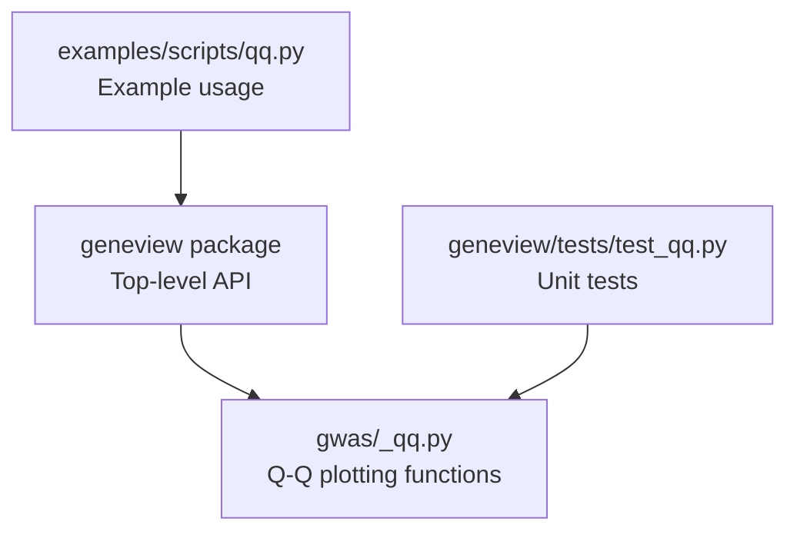
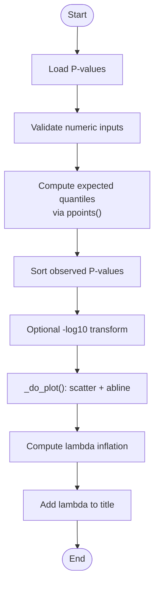
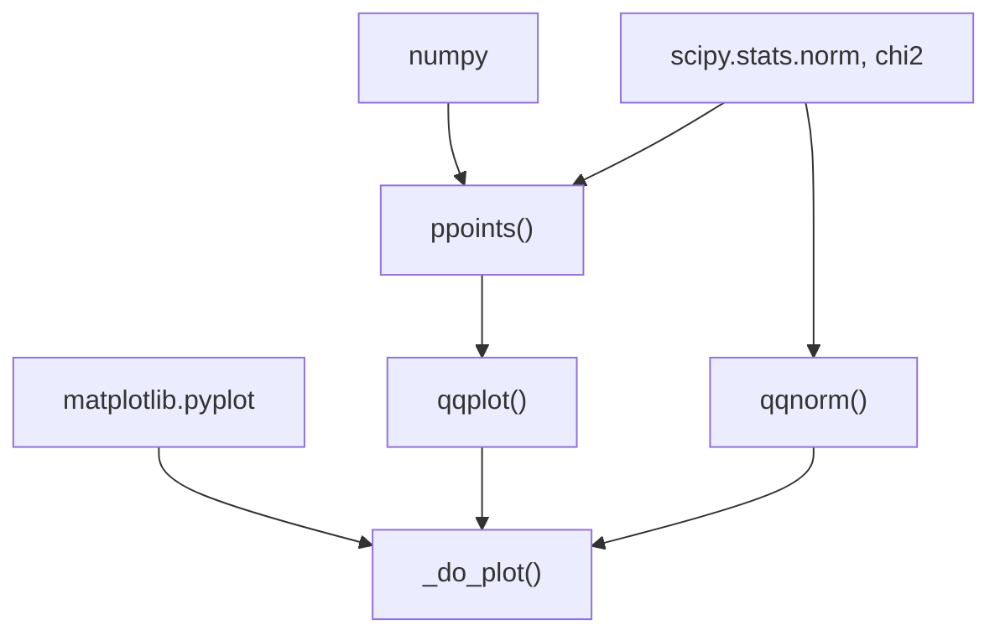

# Q-Q Plots

<cite>
**Referenced Files in This Document**
- [README.md](file://README.md)
- [__init__.py](file://geneview/__init__.py)
- [_qq.py](file://geneview/gwas/_qq.py)
- [qq.py](file://examples/scripts/qq.py)
- [test_qq.py](file://geneview/tests/test_qq.py)
</cite>

## Table of Contents
1. [Introduction](#introduction)
2. [Project Structure](#project-structure)
3. [Core Components](#core-components)
4. [Architecture Overview](#architecture-overview)
5. [Detailed Component Analysis](#detailed-component-analysis)
6. [Dependency Analysis](#dependency-analysis)
7. [Performance Considerations](#performance-considerations)
8. [Troubleshooting Guide](#troubleshooting-guide)
9. [Conclusion](#conclusion)
10. [Appendices](#appendices)

## Introduction
This document explains how to use Q-Q plots for assessing P-value distribution and statistical significance in GWAS-style analyses. It covers the theoretical versus observed P-value comparison methodology, lambda inflation calculation, and how deviations from the diagonal indicate potential issues such as population stratification or multiple testing violations. It documents the implementation details for computing empirical P-value quantiles, generating expected null distributions, and adding annotations. Practical examples demonstrate GWAS QC workflows, population stratification detection, and multiple testing correction assessment. Guidance is also provided for integrating with genomic control and heterogeneity analysis.

## Project Structure
The Q-Q plotting functionality resides in the GWAS module and is exposed via the top-level package interface. The example script demonstrates a minimal workflow using a built-in dataset.

**Diagram sources**
- [__init__.py:7](file://geneview/__init__.py#L7)
- [_qq.py:62-212](file://geneview/gwas/_qq.py#L62-L212)
- [qq.py:1-9](file://examples/scripts/qq.py#L1-L9)
- [test_qq.py:11](file://geneview/tests/test_qq.py#L11)

**Section sources**
- [README.md:200-240](file://README.md#L200-L240)
- [__init__.py:7](file://geneview/__init__.py#L7)
- [qq.py:1-9](file://examples/scripts/qq.py#L1-L9)

## Core Components
- ppoints: Computes plotting positions for quantile calculations, analogous to R’s ppoints.
- qqplot: Creates a Q-Q plot comparing observed P-values to expected null distribution, with optional second dataset for two-sample comparisons.
- qqnorm: Creates a Q-Q plot against the standard normal distribution (useful for normality checks).
- Internal plotting helper: Handles scatter plot rendering, axis limits, and reference line.

Key behaviors:
- Expected quantiles are derived from a uniform distribution for P-values by default.
- Observed P-values are sorted and optionally transformed via -log10.
- Lambda inflation is computed automatically and appended to the plot title.

**Section sources**
- [_qq.py:14-59](file://geneview/gwas/_qq.py#L14-L59)
- [_qq.py:62-212](file://geneview/gwas/_qq.py#L62-L212)
- [_qq.py:215-309](file://geneview/gwas/_qq.py#L215-L309)
- [_qq.py:312-365](file://geneview/gwas/_qq.py#L312-L365)

## Architecture Overview
The Q-Q pipeline follows a straightforward flow: prepare data, compute expected quantiles, sort and transform observed values, render the plot, and annotate with lambda.

**Diagram sources**
- [_qq.py:168-212](file://geneview/gwas/_qq.py#L168-L212)
- [_qq.py:14-59](file://geneview/gwas/_qq.py#L14-L59)
- [_qq.py:312-365](file://geneview/gwas/_qq.py#L312-L365)

## Detailed Component Analysis

### Function: ppoints
Purpose:
- Generate plotting positions for quantile computations.

Behavior:
- Accepts a scalar or array-like input n and an offset parameter a.
- Returns increasing values in (0, 1) suitable for inverse CDF evaluation.
- Raises an error if a is outside (0, 1).

Complexity:
- O(n) to compute the sequence.

Usage in Q-Q:
- Used to derive expected uniform quantiles for P-values.

**Section sources**
- [_qq.py:14-59](file://geneview/gwas/_qq.py#L14-L59)
- [test_qq.py:17-68](file://geneview/tests/test_qq.py#L17-L68)

### Function: qqplot
Purpose:
- Produce a Q-Q plot for P-values against the expected null distribution.

Inputs and parameters:
- data: P-values to compare.
- other: Optional second dataset to compare quantiles against.
- logp: Whether to plot -log10 of P-values.
- ax, marker, color, alpha, title, xlabel, ylabel, ablinecolor: Matplotlib styling and annotations.
- Additional kwargs passed to scatter.

Processing logic:
- Validates numeric inputs.
- Generates expected quantiles from uniform distribution (or uses sorted other).
- Sorts and transforms observed values (-log10 if requested).
- Renders scatter plot and optional diagonal reference line.
- Computes lambda inflation and appends to title.

Lambda inflation:
- Uses median of squared scores under the null with expected median from a chi-square distribution with 1 degree of freedom.
- Rounds to three decimal places.

Styling and annotations:
- Default abline color red; can be disabled by setting ablinecolor to None.
- Automatic axis limits and labels; xlabel/ylabel defaults are applied if not provided.

Two-sample comparison:
- When other is provided, expected quantiles come from sorted(other), enabling comparison between two datasets.

**Section sources**
- [_qq.py:62-212](file://geneview/gwas/_qq.py#L62-L212)
- [test_qq.py:74-92](file://geneview/tests/test_qq.py#L74-L92)

### Function: qqnorm
Purpose:
- Produce a Q-Q plot against the standard normal distribution.

Processing logic:
- Normalizes observed values to mean 0 and std 1.
- Computes expected quantiles from the normal distribution.
- Renders scatter plot and optional diagonal reference line.

Use cases:
- Assess normality of residuals or standardized scores.

**Section sources**
- [_qq.py:215-309](file://geneview/gwas/_qq.py#L215-L309)

### Internal plotting helper: _do_plot
Purpose:
- Shared plotting routine for qqplot and qqnorm.

Behavior:
- Creates a scatter plot with optional color and transparency.
- Sets axis limits and draws the reference diagonal if enabled.

**Section sources**
- [_qq.py:312-365](file://geneview/gwas/_qq.py#L312-L365)

### Example Usage
Minimal example:
- Loads a built-in GWAS dataset and produces a Q-Q plot of P-values.

Customized example:
- Demonstrates passing axes, marker, title, and axis labels.

**Section sources**
- [qq.py:1-9](file://examples/scripts/qq.py#L1-L9)
- [README.md:206-238](file://README.md#L206-L238)

## Dependency Analysis
The Q-Q module depends on:
- NumPy for numerical operations and sorting.
- SciPy stats for probability distributions (uniform via ppoints and normal via qqnorm).
- Matplotlib for plotting.

Integration points:
- Exposed via the top-level package API.
- Tested independently to ensure correctness of quantile positions and plot rendering.

**Diagram sources**
- [_qq.py:7-11](file://geneview/gwas/_qq.py#L7-L11)
- [_qq.py:14-59](file://geneview/gwas/_qq.py#L14-L59)
- [_qq.py:215-309](file://geneview/gwas/_qq.py#L215-L309)
- [_qq.py:312-365](file://geneview/gwas/_qq.py#L312-L365)

**Section sources**
- [_qq.py:7-11](file://geneview/gwas/_qq.py#L7-L11)
- [__init__.py:7](file://geneview/__init__.py#L7)

## Performance Considerations
- Sorting observed P-values is O(n log n); for very large datasets, consider subsampling or pre-sorting if repeated calls are made.
- Computing expected quantiles via ppoints is O(n).
- Lambda inflation involves computing percentiles and a median; negligible overhead compared to sorting.
- Rendering is dominated by Matplotlib; caching or reusing axes improves performance in batch scenarios.

## Troubleshooting Guide
Common issues and resolutions:
- Non-numeric input:
  - qqplot and qqnorm validate that inputs are numeric; ensure P-values are floats and finite.
- Unequal lengths:
  - When comparing against another dataset, lengths must match.
- Unexpected axis labels:
  - The x-axis is always expected (null distribution), and y-axis is always observed; labels reflect this convention.
- Abline visibility:
  - To hide the diagonal reference line, set ablinecolor to None.
- Lambda annotation:
  - Lambda is computed automatically and appended to the title; if not desired, omit title or override after plotting.

Validation references:
- Unit tests cover ppoints behavior, qqplot rendering, and logp toggling.

**Section sources**
- [_qq.py:168-178](file://geneview/gwas/_qq.py#L168-L178)
- [_qq.py:203-208](file://geneview/gwas/_qq.py#L203-L208)
- [test_qq.py:17-68](file://geneview/tests/test_qq.py#L17-L68)
- [test_qq.py:74-92](file://geneview/tests/test_qq.py#L74-L92)

## Conclusion
Q-Q plots are essential for evaluating P-value distributions in GWAS. The implementation in this package provides:
- Empirical quantile computation via ppoints,
- Expected null distribution generation (uniform for P-values),
- Automatic lambda inflation annotation,
- Flexible styling and two-sample comparison capabilities.

These features support robust QC workflows, stratification detection, and correction assessment, and integrate naturally with downstream genomic control and heterogeneity analyses.

## Appendices

### Practical Workflows and Interpretation

- GWAS quality control:
  - Use qqplot to check for inflation or deflation of P-values.
  - Look for systematic deviations above the diagonal indicating selection bias, cryptic relatedness, or population stratification.
  - Compare lambda to thresholds to decide on correction strategies.

- Population stratification detection:
  - Deviations from the diagonal, especially upward drift at large P-values, often indicate structured ascertainment or ancestry differences.
  - Consider genomic control (lambda_gc) and principal component adjustment.

- Multiple testing correction assessment:
  - If lambda is substantially greater than 1, consider Bonferroni or FDR corrections.
  - QQ plots help visualize whether corrections yield a flatter distribution.

- GWAS meta-analysis and cross-study comparison:
  - Use two-sample Q-Q via the other parameter to compare P-values across studies.
  - Assess heterogeneity by examining discordant tails and lambda differences.

- Replication study validation:
  - Overlay replication P-values on discovery QQ to detect lack of concordance.

Note: The implementation computes lambda inflation internally and annotates the plot title. Genomic control scaling (lambda_gc) and heterogeneity metrics are not part of this module but can be applied prior to plotting or evaluated separately using external methods.