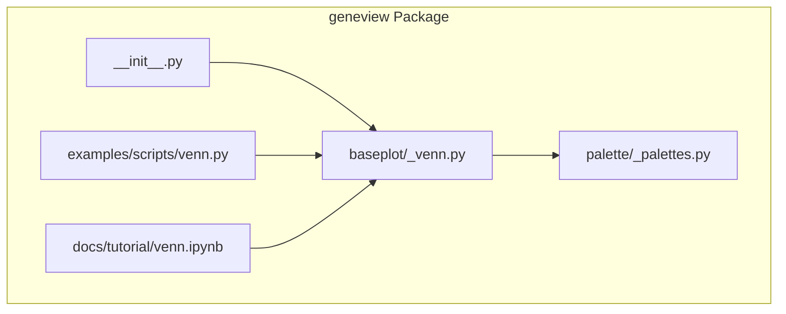
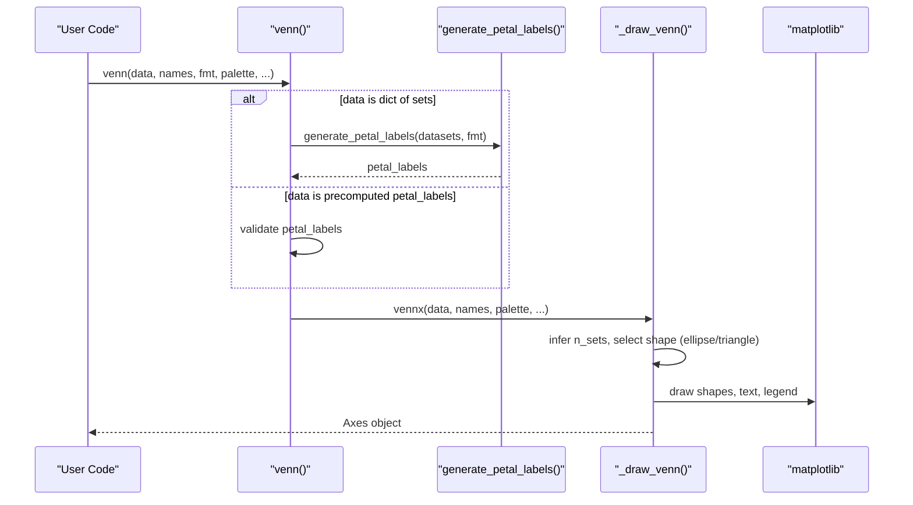
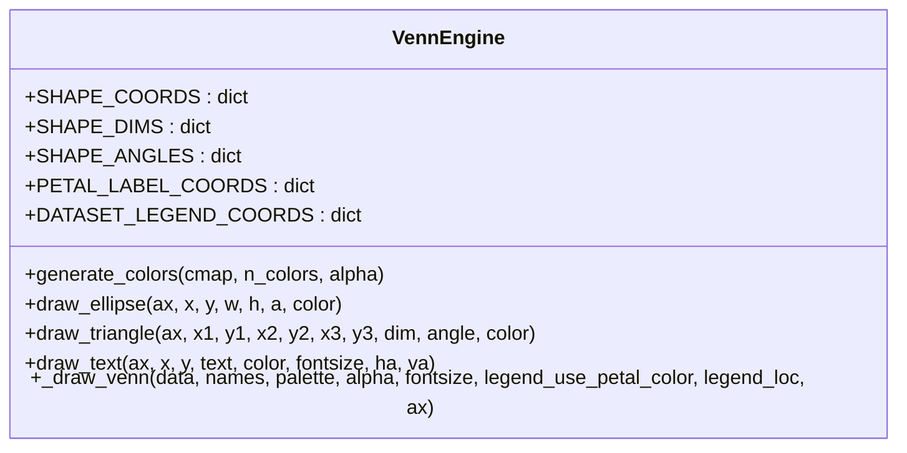
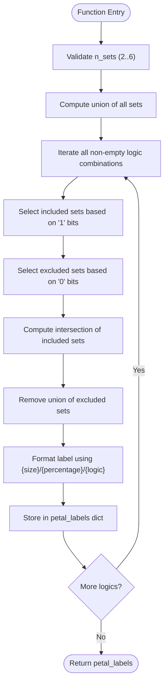
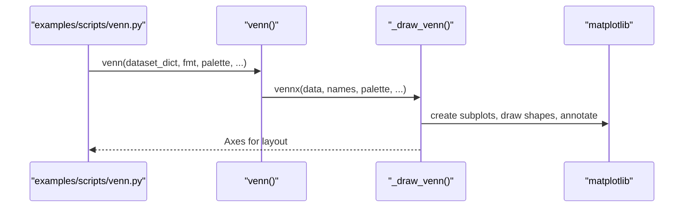
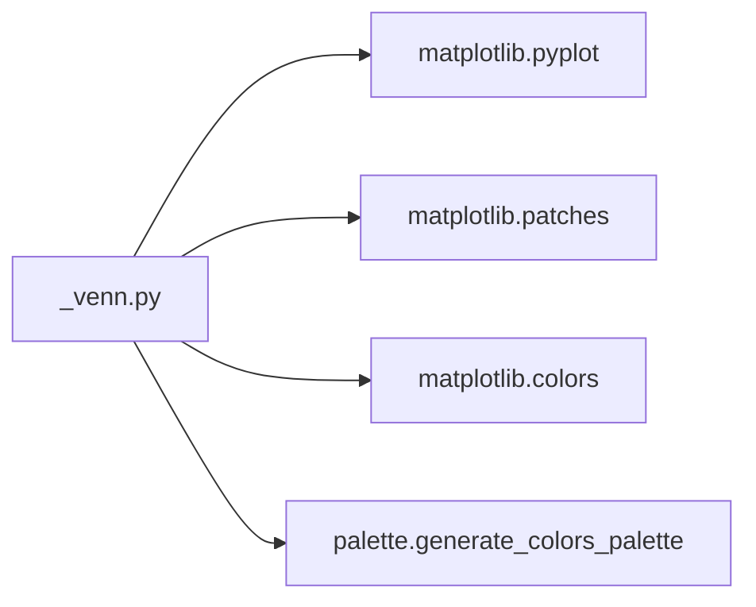

# General Plotting Utilities

<cite>
**Referenced Files in This Document**
- [README.md](file://README.md)
- [__init__.py](file://geneview/__init__.py)
- [_venn.py](file://geneview/baseplot/_venn.py)
- [venn.py](file://examples/scripts/venn.py)
- [venn.ipynb](file://docs/tutorial/venn.ipynb)
- [_palettes.py](file://geneview/palette/_palettes.py)
</cite>

## Table of Contents
1. [Introduction](#introduction)
2. [Project Structure](#project-structure)
3. [Core Components](#core-components)
4. [Architecture Overview](#architecture-overview)
5. [Detailed Component Analysis](#detailed-component-analysis)
6. [Dependency Analysis](#dependency-analysis)
7. [Performance Considerations](#performance-considerations)
8. [Troubleshooting Guide](#troubleshooting-guide)
9. [Conclusion](#conclusion)
10. [Appendices](#appendices)

## Introduction
This document focuses on the General Plotting Utilities section of the geneview package, with emphasis on the Venn diagram functionality for multi-set intersection analysis. The Venn diagram implementation supports 2–6 sets using ellipses and triangles, automatic shape calculation, customizable petal labeling, and seamless integration with other visualization components. It is designed for genomics applications such as comparative genomics, pathway analysis, and functional enrichment studies.

## Project Structure
The Venn diagram functionality resides in the base plotting module and integrates with the broader geneview ecosystem:

**Diagram sources**
- [__init__.py:1-15](file://geneview/__init__.py#L1-L15)
- [_venn.py:1-14](file://geneview/baseplot/_venn.py#L1-L14)
- [_palettes.py:1-13](file://geneview/palette/_palettes.py#L1-L13)
- [venn.py:1-30](file://examples/scripts/venn.py#L1-L30)
- [venn.ipynb:1-146](file://docs/tutorial/venn.ipynb#L1-L146)

**Section sources**
- [README.md:1-370](file://README.md#L1-L370)
- [__init__.py:1-15](file://geneview/__init__.py#L1-L15)

## Core Components
- Venn diagram rendering engine: Draws ellipses/triangles for 2–6 sets, manages colors, and annotates petals.
- Petal label generator: Computes intersection sizes and percentages for each logical combination of sets.
- Color palette integration: Generates colors from matplotlib colormaps or explicit lists.
- Example integrations: Standalone script and Jupyter notebook demonstrating usage patterns.

Key capabilities:
- Automatic shape calculation for 2–6 sets using predefined coordinate, dimension, and angle templates.
- Flexible petal labeling with format strings supporting size, percentage, and logic bits.
- Legend customization for dataset names and petal colors.
- Seamless integration with matplotlib axes and figure sizing.

**Section sources**
- [_venn.py:16-87](file://geneview/baseplot/_venn.py#L16-L87)
- [_venn.py:186-208](file://geneview/baseplot/_venn.py#L186-L208)
- [_venn.py:234-295](file://geneview/baseplot/_venn.py#L234-L295)
- [_palettes.py:5-12](file://geneview/palette/_palettes.py#L5-L12)

## Architecture Overview
The Venn diagram pipeline consists of two primary pathways: direct set input and precomputed petal labels.

**Diagram sources**
- [_venn.py:437-585](file://geneview/baseplot/_venn.py#L437-L585)
- [_venn.py:349-435](file://geneview/baseplot/_venn.py#L349-L435)
- [_venn.py:234-295](file://geneview/baseplot/_venn.py#L234-L295)

## Detailed Component Analysis

### Venn Diagram Rendering Engine
The rendering engine encapsulates:
- Shape selection: 2–5 sets use ellipses; 6 sets use triangles.
- Coordinate templates: Predefined center coordinates, dimensions, and angles for each n-set configuration.
- Color management: Default colors plus user-specified palette via matplotlib colormaps or explicit color lists.
- Text placement: Petal labels positioned using precomputed coordinates; dataset legends placed according to templates.

**Diagram sources**
- [_venn.py:16-87](file://geneview/baseplot/_venn.py#L16-L87)
- [_venn.py:124-177](file://geneview/baseplot/_venn.py#L124-L177)
- [_venn.py:234-295](file://geneview/baseplot/_venn.py#L234-L295)

**Section sources**
- [_venn.py:16-87](file://geneview/baseplot/_venn.py#L16-L87)
- [_venn.py:124-177](file://geneview/baseplot/_venn.py#L124-L177)
- [_venn.py:234-295](file://geneview/baseplot/_venn.py#L234-L295)

### Petal Label Generation
The petal label generator computes intersection sizes and percentages for each logical combination of sets. It validates input and produces a dictionary mapping binary logic strings to formatted labels.

**Diagram sources**
- [_venn.py:186-208](file://geneview/baseplot/_venn.py#L186-L208)

**Section sources**
- [_venn.py:186-208](file://geneview/baseplot/_venn.py#L186-L208)

### Mathematical Foundations and Optimization Criteria
- Mathematical basis: Venn diagrams represent Boolean logic over sets. Each petal corresponds to a unique combination of inclusion/exclusion across sets, computed via set operations.
- Shape optimization: Coordinates, dimensions, and angles are precomputed templates optimized for visual clarity and overlap minimization across 2–6 sets. Ellipses are used for lower n due to simpler geometric properties; triangles are used for 6 sets to accommodate increased complexity.
- Visual clarity criteria:
  - Alpha blending: Default transparency balances overlapping regions while maintaining readability.
  - Font sizing and alignment: Consistent font sizes and anchor points for labels and legends.
  - Legend placement: Dedicated templates for dataset names; optional legend color matching petal colors.

**Section sources**
- [_venn.py:16-87](file://geneview/baseplot/_venn.py#L16-L87)
- [_venn.py:234-295](file://geneview/baseplot/_venn.py#L234-L295)

### Practical Applications in Genomics
- Comparative genomics: Compare gene lists across species or strains to identify conserved and lineage-specific features.
- Pathway analysis: Overlap of differentially expressed genes across experimental conditions or pathways.
- Functional enrichment: Compare target gene sets against background gene sets to assess statistical significance.

Integration patterns:
- Combine with GWAS plots to annotate significant variants within intersecting gene sets.
- Pair with admixture plots to visualize overlaps between ancestral populations and functional categories.

**Section sources**
- [README.md:14-19](file://README.md#L14-L19)

### Parameter Configuration and Output Customization
Key parameters:
- data: Either a dictionary of sets or a precomputed petal_labels dictionary.
- names: Dataset names for legend and labels.
- fmt: Format string for petal labels ({size}, {percentage}, {logic}).
- palette: Colormap name, list of colors, or matplotlib colormap object.
- alpha: Transparency level for shapes.
- fontsize: Size for text elements.
- legend_use_petal_color: Whether legend text matches petal colors.
- legend_loc: Legend positioning string compatible with matplotlib.
- ax: Existing axes object for embedding.

Output customization:
- Petal text placement via precomputed coordinates.
- Legend placement via dedicated templates or explicit location.
- Color customization through palette selection.

**Section sources**
- [_venn.py:349-435](file://geneview/baseplot/_venn.py#L349-L435)
- [_venn.py:437-585](file://geneview/baseplot/_venn.py#L437-L585)

### Examples and Integration Patterns
- Minimal Venn plot: Direct dictionary of sets.
- Manual petal label adjustment: Use generate_petal_labels() to compute labels, modify as needed, then pass to venn().
- Multi-panel examples: Demonstrates 2–6 set configurations with varied colormaps and formatting.

**Diagram sources**
- [venn.py:1-30](file://examples/scripts/venn.py#L1-L30)
- [_venn.py:349-435](file://geneview/baseplot/_venn.py#L349-L435)

**Section sources**
- [venn.py:1-30](file://examples/scripts/venn.py#L1-L30)
- [venn.ipynb:29-136](file://docs/tutorial/venn.ipynb#L29-L136)

## Dependency Analysis
The Venn module depends on:
- matplotlib for rendering shapes, text, and color handling.
- geneview palette utilities for color generation.
- Standard library modules for set operations and iteration.

**Diagram sources**
- [_venn.py:8-12](file://geneview/baseplot/_venn.py#L8-L12)
- [_palettes.py:5-12](file://geneview/palette/_palettes.py#L5-L12)

**Section sources**
- [_venn.py:8-12](file://geneview/baseplot/_venn.py#L8-L12)
- [_palettes.py:5-12](file://geneview/palette/_palettes.py#L5-L12)

## Performance Considerations
- Computational complexity: Petal label generation scales exponentially with n_sets (2^n). For n=6, there are 63 combinations; performance remains acceptable for typical genomics datasets.
- Rendering cost: Drawing ellipses/triangles and annotating text is efficient; avoid excessive re-rendering by reusing axes where possible.
- Memory footprint: Large datasets increase memory usage during union/intersection computations; consider limiting input sizes or using streaming approaches if needed.

## Troubleshooting Guide
Common issues and resolutions:
- Invalid number of sets: Ensure 2 ≤ n_sets ≤ 6; otherwise, a ValueError is raised.
- Incorrect petal label keys: Keys must be binary strings of length n_sets composed of '0' and '1'; invalid keys trigger KeyError.
- Non-dictionary input: Passing non-dictionary data raises TypeError; use either a dict of sets or a validated petal_labels dictionary.
- Legend placement: Use legend_loc=None to disable legend or specify a valid matplotlib legend location string.

Validation helpers:
- is_already_venn_dataset(): Validates precomputed petal_labels and dataset_labels.
- is_valid_dataset_dict(): Ensures input is a dictionary of sets.

**Section sources**
- [_venn.py:298-346](file://geneview/baseplot/_venn.py#L298-L346)
- [_venn.py:421-434](file://geneview/baseplot/_venn.py#L421-L434)

## Conclusion
The Venn diagram functionality in geneview provides a robust, configurable solution for multi-set intersection analysis in genomics. Its mathematical foundation, optimized shape templates, and flexible labeling system make it suitable for comparative genomics, pathway analysis, and functional enrichment studies. The integration with matplotlib and color palettes ensures high-quality, publication-ready visualizations.

## Appendices

### Best Practices for Clear Venn Diagram Presentations
- Choose appropriate palette: Use distinct, saturated colors for overlapping sets; adjust alpha for readability.
- Optimize labels: Prefer concise formats like "{size}" or "{percentage:.1f}%" to reduce clutter.
- Position legends thoughtfully: Use legend_use_petal_color for consistency; place legend_loc strategically to avoid overlap.
- Limit set count: Prefer 2–5 sets for clarity; 6 sets require triangular shapes and careful layout.
- Validate inputs: Ensure consistent binary keys and non-empty names to prevent runtime errors.

**Section sources**
- [_venn.py:349-435](file://geneview/baseplot/_venn.py#L349-L435)
- [_venn.py:437-585](file://geneview/baseplot/_venn.py#L437-L585)