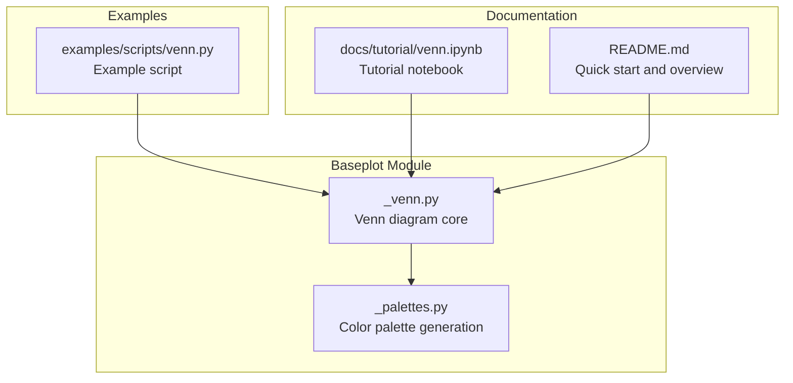
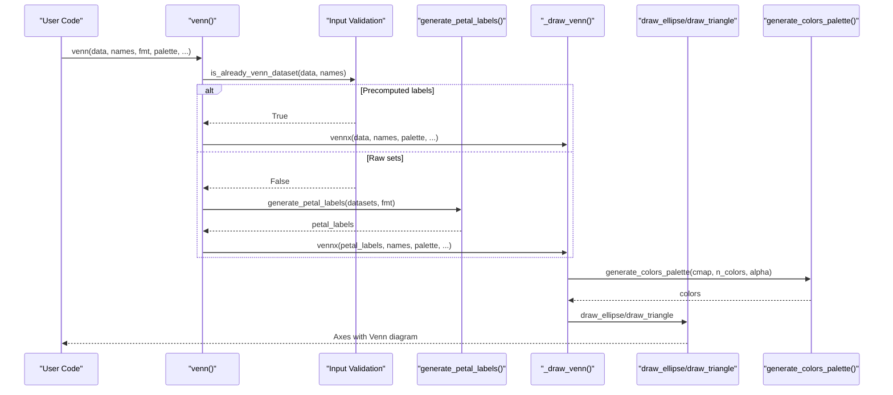
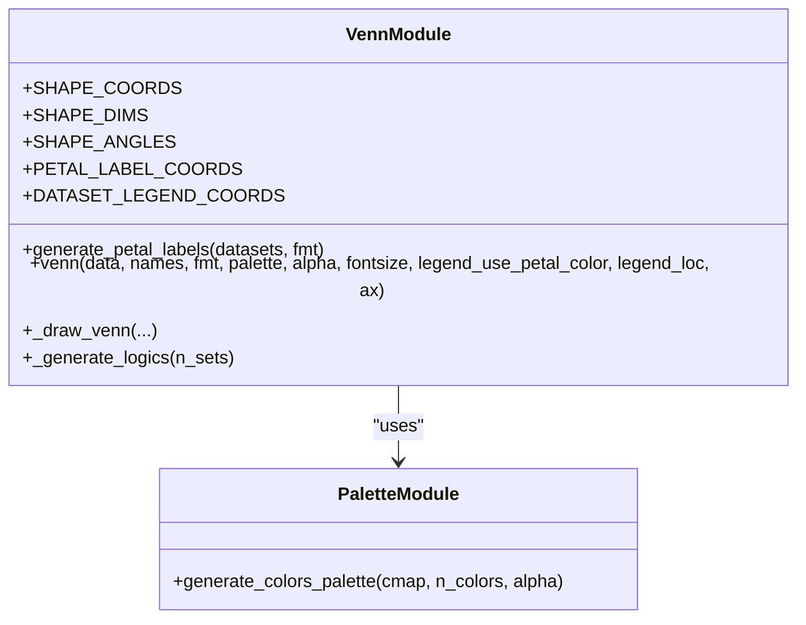
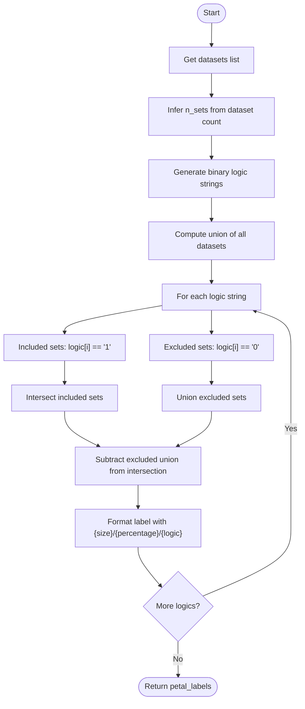
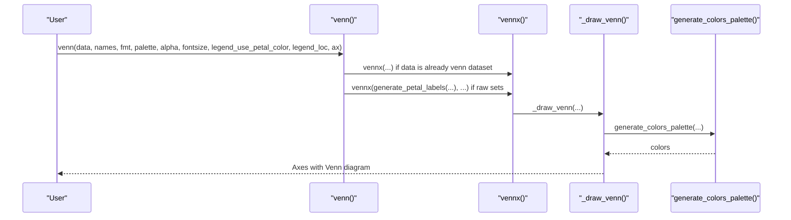
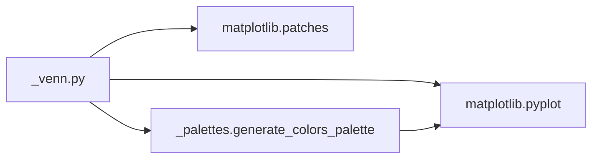

# Venn Diagram Functionality

<cite>
**Referenced Files in This Document**
- [_venn.py](file://geneview/baseplot/_venn.py)
- [_palettes.py](file://geneview/palette/_palettes.py)
- [venn.py](file://examples/scripts/venn.py)
- [venn.ipynb](file://docs/tutorial/venn.ipynb)
- [README.md](file://README.md)
</cite>

## Table of Contents
1. [Introduction](#introduction)
2. [Project Structure](#project-structure)
3. [Core Components](#core-components)
4. [Architecture Overview](#architecture-overview)
5. [Detailed Component Analysis](#detailed-component-analysis)
6. [Dependency Analysis](#dependency-analysis)
7. [Performance Considerations](#performance-considerations)
8. [Troubleshooting Guide](#troubleshooting-guide)
9. [Conclusion](#conclusion)
10. [Appendices](#appendices)

## Introduction
This document provides comprehensive technical and practical documentation for the Venn diagram functionality in the geneview package. It explains how multi-set intersection analysis is implemented for 2–6 sets, how shapes are automatically calculated and optimized for visual clarity, and how the mathematical foundations of Venn diagram construction are realized in code. It covers the `generate_petal_labels` function for customizable labeling, the `venn()` function interface for creating publication-ready Venn diagrams, and practical examples for genomics workflows in comparative genomics, pathway analysis, and functional enrichment studies.

## Project Structure
The Venn diagram functionality is implemented in a dedicated module and integrates with the color palette system. The key files are:
- `_venn.py`: Core Venn diagram implementation, shape coordinates, petal labeling, and drawing routines
- `_palettes.py`: Color palette generation used by Venn diagrams
- `venn.py` (examples): Example script demonstrating multi-set Venn diagrams
- `venn.ipynb` (docs): Tutorial notebook with usage examples and best practices
- `README.md`: High-level overview and quick-start examples

**Diagram sources**
- [_venn.py:1-585](file://geneview/baseplot/_venn.py#L1-L585)
- [_palettes.py:1-13](file://geneview/palette/_palettes.py#L1-L13)
- [venn.py:1-30](file://examples/scripts/venn.py#L1-L30)
- [venn.ipynb:1-358](file://docs/tutorial/venn.ipynb#L1-L358)
- [README.md:289-335](file://README.md#L289-L335)

**Section sources**
- [_venn.py:1-585](file://geneview/baseplot/_venn.py#L1-L585)
- [_palettes.py:1-13](file://geneview/palette/_palettes.py#L1-L13)
- [venn.py:1-30](file://examples/scripts/venn.py#L1-L30)
- [venn.ipynb:1-358](file://docs/tutorial/venn.ipynb#L1-L358)
- [README.md:289-335](file://README.md#L289-L335)

## Core Components
The Venn diagram module centers around two primary functions and supporting infrastructure:
- `venn(data, names, fmt, palette, alpha, fontsize, legend_use_petal_color, legend_loc, ax)`: High-level interface to create Venn diagrams from either raw sets or precomputed petal labels
- `generate_petal_labels(datasets, fmt)`: Computes petal sizes and percentages for each intersection region
- Shape and layout constants: Automatic positioning and sizing for 2–6 sets
- Drawing helpers: Ellipse/triangle rendering and text placement
- Color palette integration: Matplotlib colormap support and transparency controls

Key implementation highlights:
- Multi-set intersection analysis via binary logic strings ("001", "110", etc.) generated by `_generate_logics`
- Petal label generation with customizable formatting using `{size}`, `{percentage}`, and `{logic}`
- Automatic shape selection: ellipses for 2–5 sets, triangles for 6 sets
- Legend and label placement optimized for readability across set counts

**Section sources**
- [_venn.py:180-208](file://geneview/baseplot/_venn.py#L180-L208)
- [_venn.py:234-295](file://geneview/baseplot/_venn.py#L234-L295)
- [_venn.py:45-87](file://geneview/baseplot/_venn.py#L45-L87)

## Architecture Overview
The Venn diagram pipeline follows a clear separation of concerns:
- Input validation and inference: Determines whether raw sets or precomputed labels are provided
- Petal label computation: Generates intersection sizes and percentages
- Layout and drawing: Selects shapes, positions, and colors; renders ellipses/triangles and labels
- Output customization: Controls legend placement, colors, and text formatting

**Diagram sources**
- [_venn.py:560-585](file://geneview/baseplot/_venn.py#L560-L585)
- [_venn.py:349-435](file://geneview/baseplot/_venn.py#L349-L435)
- [_venn.py:234-295](file://geneview/baseplot/_venn.py#L234-L295)
- [_palettes.py:5-12](file://geneview/palette/_palettes.py#L5-L12)

## Detailed Component Analysis

### Mathematical Foundations and Shape Calculation
The Venn diagram implementation relies on predefined geometric parameters for optimal visual balance:
- Shape coordinates (`SHAPE_COORDS`): Center positions for each set
- Shape dimensions (`SHAPE_DIMS`): Width/height parameters for ellipses; triangles use explicit vertices
- Shape angles (`SHAPE_ANGLES`): Rotation angles for ellipses to improve overlap clarity
- Petal label coordinates (`PETAL_LABEL_COORDS`): Precomputed positions for text labels inside each intersection region
- Dataset legend coordinates (`DATASET_LEGEND_COORDS`): Positions for dataset names

These constants encode geometric optimizations for 2–6 sets, balancing overlap visibility and label readability. For 6 sets, triangles are used instead of ellipses to reduce overlap complexity.

**Diagram sources**
- [_venn.py:16-14](file://geneview/baseplot/_venn.py#L16-L14)
- [_venn.py:12-12](file://geneview/baseplot/_venn.py#L12-L12)
- [_palettes.py:5-12](file://geneview/palette/_palettes.py#L5-L12)

**Section sources**
- [_venn.py:16-43](file://geneview/baseplot/_venn.py#L16-L43)
- [_venn.py:45-121](file://geneview/baseplot/_venn.py#L45-L121)

### Multi-Set Intersection Analysis
The intersection analysis uses binary logic strings to enumerate all non-empty subsets:
- `_generate_logics(n_sets)` yields binary strings of length n_sets representing inclusion/exclusion
- For each logic string, the corresponding petal set is computed by intersecting included sets and subtracting excluded sets
- Results are formatted using the provided format string, supporting `{size}`, `{percentage}`, and `{logic}` tokens

**Diagram sources**
- [_venn.py:180-208](file://geneview/baseplot/_venn.py#L180-L208)

**Section sources**
- [_venn.py:180-208](file://geneview/baseplot/_venn.py#L180-L208)

### Circle Positioning and Overlap Area Calculations
The implementation does not compute precise circle positions or overlap areas mathematically. Instead, it uses predefined geometric parameters optimized for visual clarity:
- Ellipses are positioned and sized to maximize overlap visibility while minimizing label occlusion
- Angles are applied to ellipses to improve symmetry and readability
- Triangle geometry for 6 sets reduces overlap complexity

This approach prioritizes human-readable layouts over mathematically optimal solutions, trading precision for clarity.

**Section sources**
- [_venn.py:16-43](file://geneview/baseplot/_venn.py#L16-L43)
- [_venn.py:252-256](file://geneview/baseplot/_venn.py#L252-L256)

### Petal Boundary Determination
Petal boundaries are determined implicitly by the binary logic strings:
- Each petal corresponds to a unique combination of inclusion/exclusion across sets
- Boundaries are represented by the intersection/subtraction logic and rendered as overlapping regions
- Text labels are placed at precomputed coordinates tailored to each set count

**Section sources**
- [_venn.py:180-208](file://geneview/baseplot/_venn.py#L180-L208)
- [_venn.py:45-87](file://geneview/baseplot/_venn.py#L45-L87)

### generate_petal_labels Function
The `generate_petal_labels` function computes:
- Size: Number of elements in each petal
- Percentage: Proportion relative to the universal set
- Logic: Binary string identifying the petal’s membership pattern

It validates input set counts and raises informative errors for invalid configurations.

**Section sources**
- [_venn.py:186-208](file://geneview/baseplot/_venn.py#L186-L208)

### venn() Function Interface
The `venn()` function provides a high-level interface:
- Accepts either raw sets or precomputed petal labels
- Supports custom formatting, color palettes, transparency, font sizes, legend placement, and axis customization
- Automatically selects shapes and positions based on set count

**Diagram sources**
- [_venn.py:437-585](file://geneview/baseplot/_venn.py#L437-L585)
- [_venn.py:349-435](file://geneview/baseplot/_venn.py#L349-L435)
- [_venn.py:234-295](file://geneview/baseplot/_venn.py#L234-L295)
- [_palettes.py:5-12](file://geneview/palette/_palettes.py#L5-L12)

**Section sources**
- [_venn.py:437-585](file://geneview/baseplot/_venn.py#L437-L585)

### Practical Applications and Workflows
The Venn diagram functionality is designed for:
- Comparative genomics: Overlapping variants, genes, or peaks across samples or conditions
- Pathway analysis: Shared and unique hits across multiple databases or tools
- Functional enrichment: Overlaps among gene lists from different analyses

Integration patterns:
- Raw sets: Pass dictionaries of sets to `venn()` for automatic petal computation
- Precomputed labels: Use `generate_petal_labels()` to customize labels and percentages, then pass to `venn()`
- Publication-ready output: Control colors, transparency, fonts, and legends for high-quality figures

**Section sources**
- [README.md:289-335](file://README.md#L289-L335)
- [venn.ipynb:1-358](file://docs/tutorial/venn.ipynb#L1-L358)
- [venn.py:1-30](file://examples/scripts/venn.py#L1-L30)

## Dependency Analysis
The Venn module depends on:
- Matplotlib for rendering patches (ellipses/triangles) and text
- Internal palette module for color generation
- Standard library modules for set operations and iteration

**Diagram sources**
- [_venn.py:8-12](file://geneview/baseplot/_venn.py#L8-L12)
- [_palettes.py:1-12](file://geneview/palette/_palettes.py#L1-L12)

**Section sources**
- [_venn.py:8-12](file://geneview/baseplot/_venn.py#L8-L12)
- [_palettes.py:1-12](file://geneview/palette/_palettes.py#L1-L12)

## Performance Considerations
- Complexity: Intersection computations scale exponentially with the number of sets (2^n). For n > 6, the implementation does not support automatic layout.
- Rendering: Ellipse/triangle drawing and text placement are efficient for typical use cases.
- Recommendations:
  - Prefer precomputed labels for large datasets to avoid repeated intersection computations
  - Limit the number of sets to 6 or fewer for automatic layout
  - Use appropriate transparency and color schemes to improve readability without sacrificing performance

[No sources needed since this section provides general guidance]

## Troubleshooting Guide
Common issues and resolutions:
- Invalid input types: Ensure `names` is a non-empty list and `data` is either a dictionary of sets or a valid petal labels dictionary
- Incorrect petal keys: Keys must be binary strings of length equal to the number of sets
- Unsupported set counts: Only 2–6 sets are supported for automatic layout
- Color palette mismatches: Provide a valid matplotlib colormap name or a list of colors

Validation and error handling:
- Input validation checks for correct types and lengths
- Key validation ensures binary strings and legal combinations
- Clear error messages guide users to fix misconfigurations

**Section sources**
- [_venn.py:220-231](file://geneview/baseplot/_venn.py#L220-L231)
- [_venn.py:421-426](file://geneview/baseplot/_venn.py#L421-L426)
- [_venn.py:189-191](file://geneview/baseplot/_venn.py#L189-L191)

## Conclusion
The Venn diagram functionality in geneview provides a robust, publication-ready solution for multi-set intersection analysis. By combining precomputed geometric parameters, flexible labeling, and customizable styling, it enables clear and informative visualizations for genomics workflows. The implementation balances mathematical simplicity with visual clarity, making it suitable for comparative genomics, pathway analysis, and functional enrichment studies.

[No sources needed since this section summarizes without analyzing specific files]

## Appendices

### Parameter Configuration Options
- `data`: Dictionary of sets or precomputed petal labels
- `names`: List of dataset names
- `fmt`: Format string for petal labels ({size}, {percentage}, {logic})
- `palette`: Matplotlib colormap name or list of colors
- `alpha`: Transparency level for shapes
- `fontsize`: Font size for labels and legends
- `legend_use_petal_color`: Whether to color legend entries with petal colors
- `legend_loc`: Legend location string for matplotlib
- `ax`: Matplotlib axes object for embedding in larger figures

**Section sources**
- [_venn.py:437-585](file://geneview/baseplot/_venn.py#L437-L585)
- [_venn.py:349-435](file://geneview/baseplot/_venn.py#L349-L435)

### Best Practices for Clear and Informative Venn Diagrams
- Limit to 2–6 sets for automatic layout
- Use transparent fills and contrasting colors for readability
- Customize labels to show both sizes and percentages
- Position legends thoughtfully to avoid overlap with petals
- Export at high DPI for publication-quality figures

**Section sources**
- [_venn.py:234-295](file://geneview/baseplot/_venn.py#L234-L295)
- [README.md:289-335](file://README.md#L289-L335)