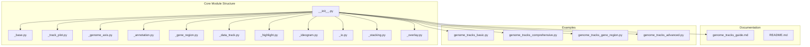
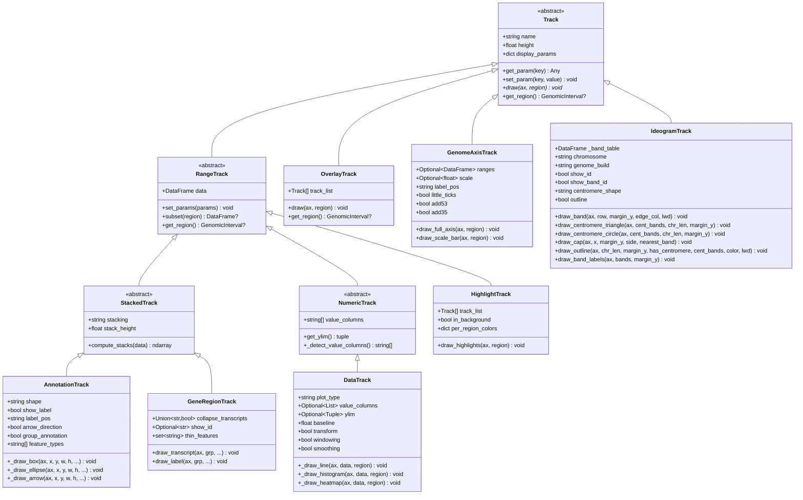
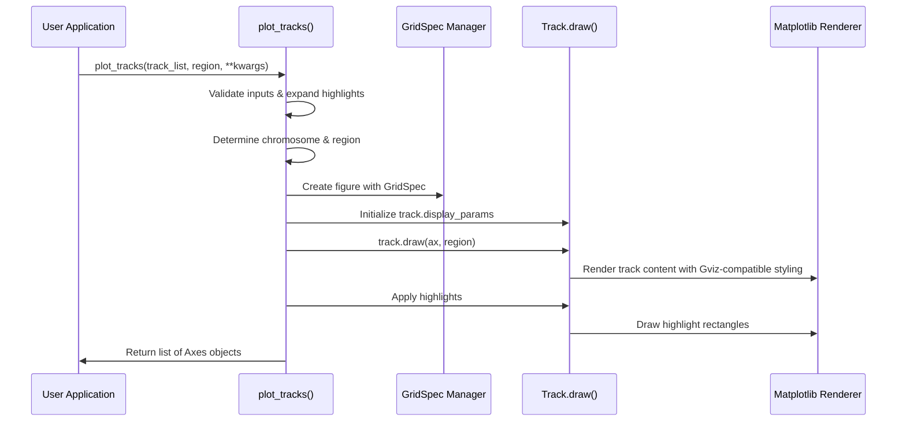
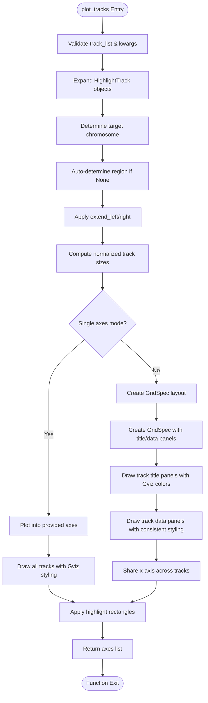
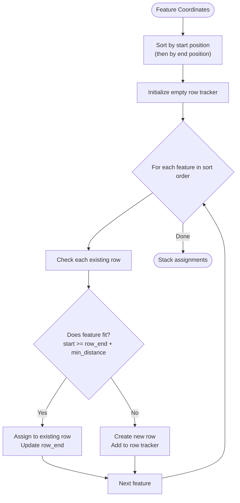
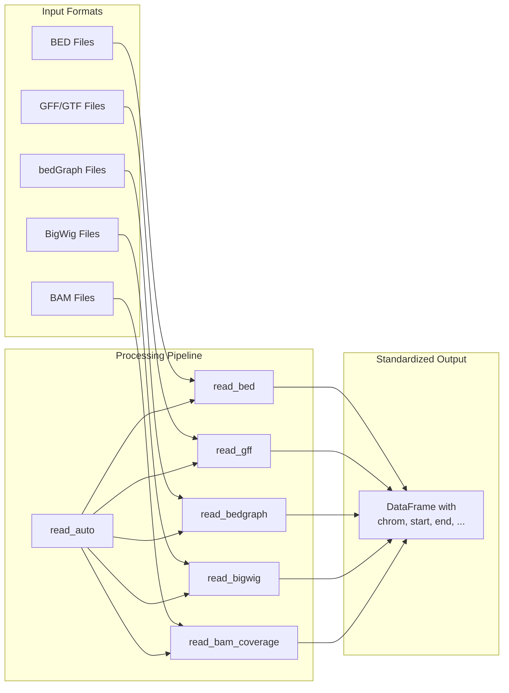
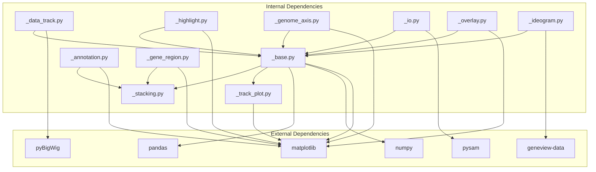

# Genome Tracks Visualization Module

<cite>
**Referenced Files in This Document**
- [README.md](file://README.md)
- [__init__.py](file://geneview/genometracks/__init__.py)
- [_base.py](file://geneview/genometracks/_base.py)
- [_track_plot.py](file://geneview/genometracks/_track_plot.py)
- [_genome_axis.py](file://geneview/genometracks/_genome_axis.py)
- [_annotation.py](file://geneview/genometracks/_annotation.py)
- [_gene_region.py](file://geneview/genometracks/_gene_region.py)
- [_data_track.py](file://geneview/genometracks/_data_track.py)
- [_highlight.py](file://geneview/genometracks/_highlight.py)
- [_ideogram.py](file://geneview/genometracks/_ideogram.py)
- [_io.py](file://geneview/genometracks/_io.py)
- [_stacking.py](file://geneview/genometracks/_stacking.py)
- [_overlay.py](file://geneview/genometracks/_overlay.py)
- [genome_tracks_guide.md](file://docs/genome_tracks_guide.md)
- [genome_tracks_basic.py](file://examples/scripts/genome_tracks_basic.py)
- [genome_tracks_comprehensive.py](file://examples/scripts/genome_tracks_comprehensive.py)
- [genome_tracks_gene_region.py](file://examples/scripts/genome_tracks_gene_region.py)
- [genome_tracks_advanced.py](file://examples/scripts/genome_tracks_advanced.py)
</cite>

## Update Summary
**Changes Made**
- Added comprehensive documentation for the new IdeogramTrack class (500+ lines)
- Updated track hierarchy diagram to include IdeogramTrack
- Added detailed parameter documentation for IdeogramTrack
- Included IdeogramTrack usage examples and integration patterns
- Updated project structure to reflect new _ideogram.py module
- Enhanced track-specific implementations section with IdeogramTrack details
- Added IdeogramTrack to all relevant architectural diagrams

## Table of Contents
1. [Introduction](#introduction)
2. [Project Structure](#project-structure)
3. [Core Components](#core-components)
4. [Architecture Overview](#architecture-overview)
5. [Detailed Component Analysis](#detailed-component-analysis)
6. [Dependency Analysis](#dependency-analysis)
7. [Performance Considerations](#performance-considerations)
8. [Troubleshooting Guide](#troubleshooting-guide)
9. [Conclusion](#conclusion)

## Introduction
The Genome Tracks Visualization Module provides a comprehensive system for creating publication-ready genome browser-style plots. Inspired by the R/Bioconductor Gviz package, it offers a flexible framework for visualizing genomic features across multiple track types while maintaining a unified coordinate system. The module integrates seamlessly with the PyData stack, leveraging pandas for data manipulation and matplotlib for rendering.

Key capabilities include:
- Multi-track genome browser visualization with shared coordinate axes
- Support for various track types (axis, annotations, gene models, data tracks, ideograms)
- Flexible stacking algorithms for overlapping features
- Comprehensive file I/O for common genomic formats
- Interactive highlighting and region selection
- Publication-quality figure generation
- **Enhanced**: Comprehensive visual styling overhaul with Gviz-compatible color schemes and default parameters
- **Improved**: Consistent styling conventions across all track types for professional appearance
- **New**: Complete chromosome ideogram visualization with cytogenetic banding patterns and centromere shapes

## Project Structure
The genome tracks module follows a modular architecture with clear separation of concerns:



**Diagram sources**
- [__init__.py:1-97](file://geneview/genometracks/__init__.py#L1-L97)
- [_base.py:1-417](file://geneview/genometracks/_base.py#L1-L417)
- [_track_plot.py:1-415](file://geneview/genometracks/_track_plot.py#L1-L415)
- [_overlay.py:1-102](file://geneview/genometracks/_overlay.py#L1-L102)
- [_ideogram.py:1-502](file://geneview/genometracks/_ideogram.py#L1-L502)

**Section sources**
- [__init__.py:1-97](file://geneview/genometracks/__init__.py#L1-L97)
- [README.md:1-482](file://README.md#L1-L482)

## Core Components
The module centers around several key components that work together to create sophisticated genome visualizations:

### Track Hierarchy
The system implements a clear inheritance hierarchy that enables polymorphic behavior across different track types:



**Diagram sources**
- [_base.py:118-417](file://geneview/genometracks/_base.py#L118-L417)
- [_overlay.py:16-102](file://geneview/genometracks/_overlay.py#L16-L102)
- [_genome_axis.py:39-316](file://geneview/genometracks/_genome_axis.py#L39-L316)
- [_annotation.py:37-456](file://geneview/genometracks/_annotation.py#L37-L456)
- [_gene_region.py:55-501](file://geneview/genometracks/_gene_region.py#L55-L501)
- [_data_track.py:43-591](file://geneview/genometracks/_data_track.py#L43-L591)
- [_highlight.py:21-180](file://geneview/genometracks/_highlight.py#L21-L180)
- [_ideogram.py:50-502](file://geneview/genometracks/_ideogram.py#L50-L502)

### GenomicInterval Data Structure
The module defines a lightweight data structure for representing genomic regions:

| Property | Type | Description |
|----------|------|-------------|
| chrom | string | Chromosome identifier (e.g., "chr1", "1") |
| start | int | Start position (0-based, inclusive) |
| end | int | End position (exclusive) |
| strand | string | Strand information: "+", "-", or "*" (unstranded) |

**Section sources**
- [_base.py:23-84](file://geneview/genometracks/_base.py#L23-L84)

## Architecture Overview
The genome tracks system employs a coordinated architecture that separates concerns between track rendering, layout management, and data processing:



**Diagram sources**
- [_track_plot.py:26-176](file://geneview/genometracks/_track_plot.py#L26-L176)
- [_track_plot.py:248-358](file://geneview/genometracks/_track_plot.py#L248-L358)

The architecture ensures:
- **Modularity**: Each track type encapsulates its rendering logic with consistent styling
- **Flexibility**: Easy addition of new track types
- **Consistency**: Unified coordinate system across all tracks with Gviz-compatible appearance
- **Performance**: Efficient layout computation and rendering

**Section sources**
- [_track_plot.py:1-415](file://geneview/genometracks/_track_plot.py#L1-L415)

## Detailed Component Analysis

### Plot Orchestration System
The `plot_tracks()` function serves as the central orchestrator, managing the complex interactions between tracks and layout:



**Diagram sources**
- [_track_plot.py:179-358](file://geneview/genometracks/_track_plot.py#L179-L358)

**Updated** Enhanced with Gviz-compatible styling defaults and consistent color schemes across all track types.

**Section sources**
- [_track_plot.py:26-415](file://geneview/genometracks/_track_plot.py#L26-L415)

### Stacking Algorithms
The module implements sophisticated algorithms for handling overlapping genomic features:



**Diagram sources**
- [_stacking.py:61-111](file://geneview/genometracks/_stacking.py#L61-L111)

The stacking modes provide different visual strategies:
- **Full**: Each feature gets its own row (maximum separation)
- **Pack**: Tight packing with minimal gaps
- **Squish**: Pack with reduced row height
- **Dense**: All features collapsed into single row
- **Hide**: No features rendered

**Section sources**
- [_stacking.py:19-168](file://geneview/genometracks/_stacking.py#L19-L168)

### File I/O System
The module provides comprehensive support for common genomic file formats:



**Diagram sources**
- [_io.py:36-367](file://geneview/genometracks/_io.py#L36-L367)

**Section sources**
- [_io.py:1-367](file://geneview/genometracks/_io.py#L1-L367)

### Track-Specific Implementations

#### OverlayTrack
**New Feature**: Container track for overlaying multiple tracks on the same panel.

OverlayTrack allows compositing multiple tracks (e.g., DataTracks) on a single plot area. The first track's title and axis configuration are used. Alpha blending is useful for transparency when overlaying.

| Parameter | Default | Description |
|-----------|---------|-------------|
| `track_list` | [] | List of Track objects to overlay on the same panel |
| `name` | First track's name | Track name for the title panel |
| `height` | 1.5 | Relative track height |
| `display_params` | {} | Additional display parameters applied to all contained tracks |

**Section sources**
- [_overlay.py:16-102](file://geneview/genometracks/_overlay.py#L16-L102)

#### IdeogramTrack
**New Major Feature**: Complete chromosome ideogram visualization system with cytogenetic banding patterns and centromere shapes.

The IdeogramTrack class provides a comprehensive chromosome ideogram display system that mimics Gviz's IdeogramTrack functionality. It supports automatic loading of human karyotype data, custom cytoband specification, and flexible centromere visualization.

**Key Features**:
- Automatic loading of human karyotype data (hg38, hg19) from geneview-data repository
- Support for custom cytoband data via DataFrame or TSV files
- Cytogenetic band coloring using standardized GRC color palette
- Centromere visualization with triangle or circle shapes
- Rounded chromosome ends with automatic cap drawing
- Integrated region highlighting with configurable colors
- Band name labeling with automatic visibility control
- Chromosome identification display

**Parameters**:
| Parameter | Default | Description |
|-----------|---------|-------------|
| `bands` | None | Cytoband data DataFrame or file path (auto-loaded if None) |
| `chromosome` | None | Chromosome to display (uses first chromosome if None) |
| `genome_build` | "hg38" | Genome build for default data loading ("hg38", "hg19") |
| `show_id` | True | Display chromosome name label |
| `show_band_id` | False | Show band name labels inside bands |
| `centromere_shape` | "triangle" | Centromere shape: 'triangle' or 'circle' |
| `outline` | False | Draw black outline around bands |
| `name` | chromosome name | Track name for title panel |
| `height` | 0.5 | Relative track height |
| `display_params` | {} | Additional display parameters |

**Cytogenetic Band Color Palette**:
- `gneg`: #FFFFFF (highly positive bands)
- `gpos25`: #C8C8C8 (25% positive)
- `gpos33`: #D2D2D2 (33% positive)
- `gpos50`: #C8C8C8 (50% positive)
- `gpos66`: #A0A0A0 (66% positive)
- `gpos75`: #828282 (75% positive)
- `gpos100`: #000000 (100% positive)
- `gpos`: #000000 (positive)
- `acen`: #D92F27 (centromere)
- `stalk`: #647FA4 (telomeric/stalk regions)
- `gvar`: #DCDCDC (variant regions)

**Usage Examples**:
```python
# Auto-load human karyotype (hg38) - no data needed
from geneview.genometracks import IdeogramTrack, plot_tracks, GenomicInterval
track = IdeogramTrack(chromosome="chr7")
plot_tracks([track], region=GenomicInterval("chr7", 20000000, 60000000))

# Use hg19 build
track = IdeogramTrack(chromosome="chr7", genome_build="hg19")

# Provide custom cytoband data
import pandas as pd
bands = pd.DataFrame({
    "chrom": ["chr7"] * 5,
    "chromStart": [0, 20000000, 40000000, 58000000, 60000000],
    "chromEnd": [20000000, 40000000, 58000000, 60000000, 159000000],
    "name": ["p15", "p14", "p13", "p12", "p11"],
    "gieStain": ["gneg", "gpos25", "gneg", "gpos50", "acen"],
})
track = IdeogramTrack(bands, chromosome="chr7")
```

**Section sources**
- [_ideogram.py:1-502](file://geneview/genometracks/_ideogram.py#L1-L502)

#### GenomeAxisTrack
The axis track provides coordinate reference with intelligent scaling and direction indicators:

| Parameter | Default | Description |
|-----------|---------|-------------|
| `scale` | None | Show scale bar instead of full axis |
| `label_pos` | "alternating" | Position of tick labels |
| `little_ticks` | False | Add minor tick marks |
| `add53` | False | Show 5' to 3' direction indicator |
| `add35` | False | Show 3' to 5' direction indicator |
| `col` | "darkgray" | Axis line color (Gviz-compatible) |
| `col_range` | "cornsilk4" | Highlighted range fill color |
| `fill_range` | "cornsilk3" | Highlighted range edge color |
| `lwd` | 2 | Axis line width |
| `fontsize` | 9 | Tick label font size |
| `fontcolor` | "#808080" | Tick label color |

**Updated** Enhanced with Gviz-compatible color scheme using dark gray (#808080) for axis elements and cornsilk color palette for highlighted ranges.

#### AnnotationTrack
Flexible annotation display supporting multiple shapes and styling with enhanced grouping:

| Parameter | Default | Description |
|-----------|---------|-------------|
| `shape` | "arrow" | "box", "ellipse", or "arrow" |
| `stacking` | "squish" | Overlap handling mode |
| `show_label` | False | Display feature names |
| `label_pos` | "above" | Label positioning |
| `arrow_direction` | True | Show strand arrows for boxes |
| `group_annotation` | None | Enable grouped annotation display |
| `feature_colors` | Gviz palette | Feature type to color mapping |

**Updated** Enhanced with comprehensive Gviz-compatible color palette:
- Exons: light blue (#ADD8E6)
- CDS: bright blue (#0080FF)
- UTR: light blue (#ADD8E6)
- Introns: dark gray (#808080)
- Default: light blue (#ADD8E6)

#### GeneRegionTrack
Sophisticated gene model visualization with transcript collapsing and meta collapse:

| Parameter | Default | Description |
|-----------|---------|-------------|
| `collapse_transcripts` | False | Transcript grouping strategy |
| `show_id` | "gene" | Identifier display ("gene", "transcript", "exon") |
| `thin_box_features` | UTR features | Features drawn as thin boxes |
| `col` | "orange" | Exon border color (Gviz-compatible) |
| `fill` | "orange" | Exon fill color |
| `fill_utr` | "#FFD699" | UTR fill color |
| `col_intron` | "#808080" | Intron line color |
| `lwd` | 0.8 | Line width |
| `fontsize` | 8 | Label font size |
| `fontcolor` | "#333333" | Label color |

**Updated** Enhanced with Gviz-compatible gene model styling using orange (#FF8C00) for exons and light orange (#FFD699) for UTRs.

#### DataTrack
Multi-format numeric data visualization with advanced transformations:

| Plot Type | Description | Best For |
|-----------|-------------|----------|
| "line" | Connected line plot | Continuous signals |
| "histogram" | Bar chart | Discrete counts |
| "polygon" | Area fill | Signal envelopes |
| "points" | Scatter plot | Sparse data |
| "mountain" | Smoothed area | Large datasets |
| "gradient" | Color gradient | Single sample |
| "heatmap" | Multi-sample comparison | Batch comparisons |
| "boxplot" | Statistical summary | Distribution analysis |

**Enhanced** Added support for:
- Combined plot types with transform parameter for data transformation
- Windowing/smoothing capabilities for noise reduction
- Enhanced statistical plotting modes
- Gviz-compatible color schemes with bright blue (#0080FF) for lines and gray (#808080) for histograms

#### HighlightTrack
Enhanced highlighting with per-region color support:

| Parameter | Default | Description |
|-----------|---------|-------------|
| `track_list` | [] | Tracks to highlight |
| `in_background` | True | Draw highlights behind other tracks |
| `fill` | "#FFE3E6" | Highlight fill color |
| `col` | "red" | Highlight edge color |
| `alpha` | 0.3 | Transparency level |

**Updated** Enhanced with Gviz-compatible highlight styling using light pink (#FFE3E6) fill with red edges for clear visual distinction.

**Section sources**
- [_overlay.py:16-102](file://geneview/genometracks/_overlay.py#L16-L102)
- [_ideogram.py:1-502](file://geneview/genometracks/_ideogram.py#L1-L502)
- [_genome_axis.py:39-316](file://geneview/genometracks/_genome_axis.py#L39-L316)
- [_annotation.py:23-456](file://geneview/genometracks/_annotation.py#L23-L456)
- [_gene_region.py:55-501](file://geneview/genometracks/_gene_region.py#L55-L501)
- [_data_track.py:43-591](file://geneview/genometracks/_data_track.py#L43-L591)
- [_highlight.py:21-180](file://geneview/genometracks/_highlight.py#L21-L180)

## Dependency Analysis
The genome tracks module maintains clean dependencies while integrating with external libraries:



**Diagram sources**
- [_base.py:15-21](file://geneview/genometracks/_base.py#L15-L21)
- [_io.py:210-216](file://geneview/genometracks/_io.py#L210-L216)
- [_overlay.py:11-13](file://geneview/genometracks/_overlay.py#L11-L13)
- [_ideogram.py:19-20](file://geneview/genometracks/_ideogram.py#L19-20)

The dependency structure ensures:
- **Minimal coupling**: Tracks depend only on base classes
- **Optional external libs**: BigWig and BAM support are optional
- **Type safety**: Comprehensive type hints throughout
- **Extensibility**: Easy addition of new track types
- **Data integration**: IdeogramTrack integrates with geneview-data repository

**Section sources**
- [_base.py:15-21](file://geneview/genometracks/_base.py#L15-L21)
- [_io.py:210-216](file://geneview/genometracks/_io.py#L210-L216)
- [_overlay.py:11-13](file://geneview/genometracks/_overlay.py#L11-L13)
- [_ideogram.py:19-20](file://geneview/genometracks/_ideogram.py#L19-20)

## Performance Considerations
The genome tracks module implements several optimizations for efficient rendering:

### Memory Management
- **Lazy evaluation**: Data is processed only when needed
- **Efficient stacking**: Greedy algorithm minimizes computational overhead
- **Shared resources**: Common styling parameters reduce memory footprint
- **Overlay optimization**: Efficient canvas sharing for overlaid tracks
- **Band caching**: IdeogramTrack caches processed band data for reuse

### Rendering Optimizations
- **Vector graphics**: Matplotlib patches for scalable rendering
- **Batch operations**: Multiple features drawn in single operations
- **Caching**: Computed stacking results reused when possible
- **Alpha blending**: Hardware-accelerated transparency for overlay tracks
- **Optimized band drawing**: Efficient polygon rendering for cytogenetic bands

### Data Processing Efficiency
- **NumPy arrays**: Vectorized operations for coordinate calculations
- **Pandas integration**: Optimized DataFrame operations
- **Binary formats**: Direct parsing for BigWig and BAM files
- **Auto-loading**: IdeogramTrack efficiently loads pre-computed karyotype data

## Troubleshooting Guide

### Common Issues and Solutions

**Issue**: Tracks not aligning properly
- **Cause**: Mismatched coordinate systems
- **Solution**: Ensure all tracks use the same `GenomicInterval` region

**Issue**: Overlapping features not stacking correctly  
- **Cause**: Incorrect stacking parameters
- **Solution**: Adjust `min_distance` parameter or choose different stacking mode

**Issue**: Large files causing slow rendering
- **Cause**: Unoptimized data processing
- **Solution**: Use appropriate plot types (e.g., "histogram" for binned data)

**Issue**: Missing external dependencies
- **Cause**: Optional packages not installed
- **Solution**: Install pyBigWig for BigWig support or pysam for BAM processing

**Issue**: Overlay tracks not displaying correctly
- **Cause**: Incompatible track types or missing alpha blending
- **Solution**: Ensure tracks are compatible and use appropriate alpha values

**Issue**: Colors not appearing as expected
- **Cause**: Custom color overrides not applied correctly
- **Solution**: Verify display_params contain proper color specifications

**Issue**: IdeogramTrack not showing bands
- **Cause**: Invalid chromosome name or missing cytoband data
- **Solution**: Verify chromosome exists in band data or use auto-loading with correct genome_build

**Issue**: IdeogramTrack centromere not visible
- **Cause**: Centromere bands missing or incorrect gieStain values
- **Solution**: Ensure centromere bands have "acen" gieStain values and proper start/end positions

**Section sources**
- [_track_plot.py:126-133](file://geneview/genometracks/_track_plot.py#L126-L133)
- [_stacking.py:19-58](file://geneview/genometracks/_stacking.py#L19-L58)
- [_overlay.py:70-87](file://geneview/genometracks/_overlay.py#L70-L87)
- [_ideogram.py:140-147](file://geneview/genometracks/_ideogram.py#L140-L147)

## Conclusion
The Genome Tracks Visualization Module provides a robust, extensible framework for creating sophisticated genome browser-style visualizations. Its modular architecture, comprehensive file I/O support, and flexible rendering system make it suitable for both simple annotation displays and complex multi-track analyses. The implementation maintains excellent performance characteristics while providing extensive customization options for publication-quality figures.

**Recent Enhancements**:
- **Comprehensive Visual Styling Overhaul**: Implementation of Gviz-compatible color schemes across all track types
- **Standardized Default Parameters**: Consistent styling conventions matching R/Bioconductor Gviz appearance
- **Enhanced Color Palettes**: Professional color schemes for annotations, gene regions, and data tracks
- **Improved Visual Consistency**: Unified styling approach for axes, titles, and track elements
- **Gviz-Compatible Defaults**: Default colors and styling that match established bioinformatics visualization standards
- **Major New Feature**: Complete IdeogramTrack implementation for chromosome ideogram visualization with cytogenetic banding patterns

**New Major Feature**: IdeogramTrack
The addition of the IdeogramTrack class represents a significant enhancement to the module's capabilities. This 500+ line implementation provides comprehensive chromosome ideogram visualization with:

- Automatic loading of human karyotype data (hg38, hg19) from the geneview-data repository
- Support for custom cytoband data via DataFrame or TSV files
- Accurate cytogenetic band coloring using standardized GRC color palette
- Flexible centromere visualization with triangle or circle shapes
- Integrated region highlighting with configurable colors
- Band name labeling with automatic visibility control
- Chromosome identification display
- Seamless integration with other genome tracks

The IdeogramTrack enhances the module's ability to create comprehensive genome browser-style visualizations, enabling researchers to display chromosome ideograms alongside other genomic features such as annotations, gene models, and coverage tracks.

The module's design philosophy emphasizes:
- **Intuitive API**: Simple, consistent interfaces across all track types
- **Performance**: Efficient algorithms and memory management
- **Extensibility**: Easy addition of new track types and visualization modes
- **Integration**: Seamless compatibility with the broader PyData ecosystem
- **Professional Appearance**: Publication-ready visual styling that matches established bioinformatics standards
- **Comprehensive Coverage**: Complete support for modern genome visualization needs including ideogram display

This foundation enables researchers and developers to create compelling visual narratives from complex genomic datasets while maintaining scientific rigor and publication quality. The comprehensive visual styling overhaul and the new IdeogramTrack implementation ensure consistency and professional appearance across all track types, making the module suitable for high-quality scientific publications and presentations.