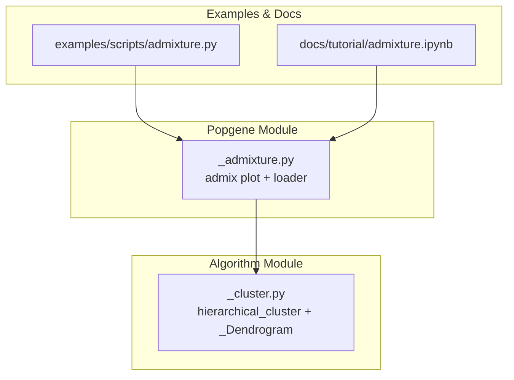
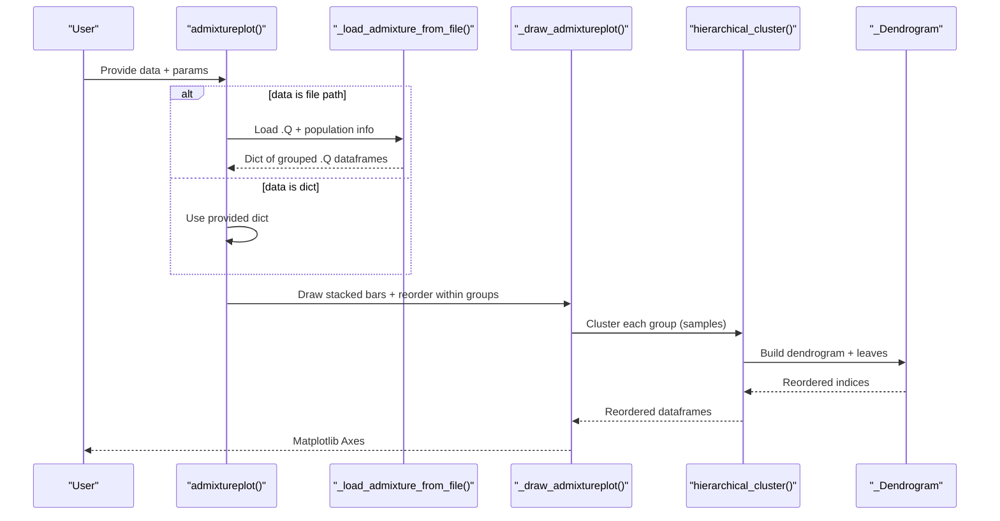
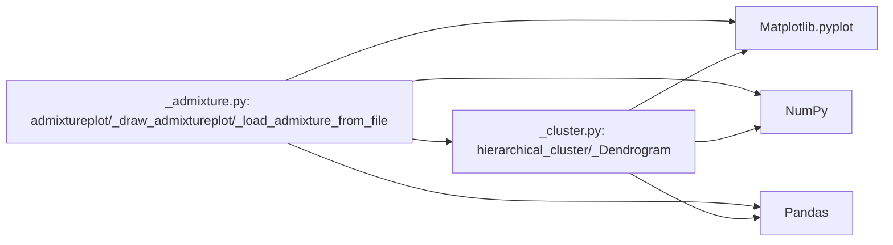

# Admixture Coefficient Analysis

<cite>
**Referenced Files in This Document**
- [_admixture.py](file://geneview/popgene/_admixture.py)
- [_cluster.py](file://geneview/algorithm/_cluster.py)
- [admixture.py](file://examples/scripts/admixture.py)
- [admixture.ipynb](file://docs/tutorial/admixture.ipynb)
</cite>

## Table of Contents
1. [Introduction](#introduction)
2. [Project Structure](#project-structure)
3. [Core Components](#core-components)
4. [Architecture Overview](#architecture-overview)
5. [Detailed Component Analysis](#detailed-component-analysis)
6. [Dependency Analysis](#dependency-analysis)
7. [Performance Considerations](#performance-considerations)
8. [Troubleshooting Guide](#troubleshooting-guide)
9. [Conclusion](#conclusion)
10. [Appendices](#appendices)

## Introduction
This document explains the admixture coefficient analysis functionality in the geneview package, focusing on:
- Biological meaning of ancestry proportions and the .Q file format
- How admixture coefficients represent genetic ancestry
- The admixtureplot function parameters and visualization customization
- Hierarchical clustering integration for optimal sample ordering
- Practical workflows for data preparation, population assignment, and statistical interpretation
- Handling common data quality issues and visualization optimization

## Project Structure
The admixture analysis is implemented in the popgene module and integrates with hierarchical clustering from the algorithm module. Example usage and tutorial notebooks demonstrate typical workflows.

**Diagram sources**
- [_admixture.py:17-364](file://geneview/popgene/_admixture.py#L17-L364)
- [_cluster.py:19-147](file://geneview/algorithm/_cluster.py#L19-L147)
- [admixture.py:1-28](file://examples/scripts/admixture.py#L1-L28)
- [admixture.ipynb:1-436](file://docs/tutorial/admixture.ipynb#L1-L436)

**Section sources**
- [_admixture.py:1-364](file://geneview/popgene/_admixture.py#L1-L364)
- [_cluster.py:1-147](file://geneview/algorithm/_cluster.py#L1-L147)
- [admixture.py:1-28](file://examples/scripts/admixture.py#L1-L28)
- [admixture.ipynb:1-436](file://docs/tutorial/admixture.ipynb#L1-L436)

## Core Components
- admixtureplot: Main plotting function that accepts either a .Q file path plus population info or a prebuilt dictionary of grouped .Q dataframes. It supports color palettes, sample shuffling, group ordering, and hierarchical clustering of samples within groups.
- _draw_admixtureplot: Internal drawing routine that renders stacked bars representing ancestry coefficients, applies hierarchical clustering for sample reordering, and sets axes and labels.
- _load_admixture_from_file: Loads .Q and population info files, splits data by population groups, optionally subsamples within each group, and returns a grouped dictionary suitable for plotting.
- hierarchical_cluster and _Dendrogram: Hierarchical clustering engine used to reorder samples within each group for clearer visualization of relatedness.

Key capabilities:
- Accepts .Q files and population info files or a dictionary of grouped .Q dataframes
- Supports K-way ancestry coefficients per sample (one column per ancestral component)
- Integrates hierarchical clustering to order samples by genetic similarity within groups
- Provides extensive customization for colors, labels, and layout

**Section sources**
- [_admixture.py:17-364](file://geneview/popgene/_admixture.py#L17-L364)
- [_cluster.py:19-147](file://geneview/algorithm/_cluster.py#L19-L147)

## Architecture Overview
The plotting pipeline connects user inputs to visualization via hierarchical clustering and color mapping.

**Diagram sources**
- [_admixture.py:168-364](file://geneview/popgene/_admixture.py#L168-L364)
- [_admixture.py:17-165](file://geneview/popgene/_admixture.py#L17-L165)
- [_cluster.py:114-147](file://geneview/algorithm/_cluster.py#L114-L147)

## Detailed Component Analysis

### Biological Concept: Ancestry Proportions and .Q Format
- Ancestry coefficients (Q) represent the proportion of an individual’s genome that derives from each of K inferred ancestral populations. Each sample is a row with K columns, one per ancestral component. Columns sum to approximately 1 per row.
- The .Q file is whitespace-separated, with rows corresponding to samples and columns to ancestral components (K). The tutorial notebook demonstrates a typical .Q shape and structure.

Practical notes:
- Rows correspond to samples; columns correspond to ancestral components (K).
- Values are non-negative and typically sum to near 1 per row.
- The tutorial notebook shows a 2504×11 .Q matrix as an example.

**Section sources**
- [admixture.ipynb:290-292](file://docs/tutorial/admixture.ipynb#L290-L292)
- [admixture.ipynb:405-408](file://docs/tutorial/admixture.ipynb#L405-L408)

### Data Input Formats for admixtureplot
- File-based input:
  - data: Path to .Q file
  - population_info: Path to a single-column file containing population group labels for each row of the .Q file (same length as number of rows in .Q)
- Dictionary-based input:
  - data: A dict keyed by population group name; values are pandas.DataFrame instances of .Q data for that group
- Optional subsampling:
  - shuffle_popsample_kws: Passed to pandas.DataFrame.sample to randomly select n or frac samples per group

Validation and behavior:
- If population_info is provided, data must be a file path; otherwise, data must be a dict.
- If data is a file path, it is loaded and split into groups using population_info.
- If data is a dict, keys must match group_order if provided.

**Section sources**
- [_admixture.py:326-345](file://geneview/popgene/_admixture.py#L326-L345)
- [_admixture.py:137-165](file://geneview/popgene/_admixture.py#L137-L165)

### Hierarchical Clustering Integration for Sample Ordering
- Within each population group, samples are reordered by hierarchical clustering to reflect genetic similarity.
- Parameters:
  - method: linkage method (default average)
  - metric: distance metric (default euclidean)
  - axis: axis for clustering (default 0, i.e., rows/samples)
- The clustering engine supports multiple linkage methods and metrics and returns reordered indices used to sort samples within each group.

Impact on visualization:
- Samples within a group cluster together, improving interpretability when related individuals are adjacent.
- Different methods and metrics can emphasize different aspects of genetic similarity.

**Section sources**
- [_admixture.py:48-62](file://geneview/popgene/_admixture.py#L48-L62)
- [_cluster.py:114-147](file://geneview/algorithm/_cluster.py#L114-L147)
- [_cluster.py:19-112](file://geneview/algorithm/_cluster.py#L19-L112)

### Visualization Customization and Parameters
Key parameters of admixtureplot:
- data: .Q file path or dict of grouped .Q dataframes
- population_info: Population labels file (required if data is a file path)
- shuffle_popsample_kws: Subsampling kwargs for pandas.DataFrame.sample
- group_order: Order of population groups for plotting
- linewidth: Width of vertical dividers between groups
- edgewidth: Width of plot frame edges
- palette: Color scheme for K ancestry components
- xticklabels: Custom x-axis tick labels
- xticklabel_kws: Keyword args for x-axis tick label formatting
- ylabel: Y-axis label (defaults to inferred K)
- ylabel_kws: Keyword args for y-axis label formatting
- hierarchical_kws: Keyword args for hierarchical clustering
- set_xticklabel_top: Place x-axis tick labels at the top
- ax: Matplotlib axis to draw on

Internal drawing behavior:
- Stacked bars represent ancestry coefficients per sample
- Colors are assigned per K component using the chosen palette
- Warnings are issued if fewer palette colors than K components
- Vertical dividers mark group boundaries
- X-tick positions align with group centers

**Section sources**
- [_admixture.py:168-364](file://geneview/popgene/_admixture.py#L168-L364)
- [_admixture.py:17-134](file://geneview/popgene/_admixture.py#L17-L134)

### Practical Workflows and Examples

#### Workflow 1: File-based input with population info
- Prepare .Q and population info files
- Define group_order to control panel ordering
- Optionally subsample with shuffle_popsample_kws
- Customize colors and labels via palette and x/y label parameters

Example usage is demonstrated in the example script and tutorial notebook.

**Section sources**
- [admixture.py:1-28](file://examples/scripts/admixture.py#L1-L28)
- [admixture.ipynb:1-436](file://docs/tutorial/admixture.ipynb#L1-L436)

#### Workflow 2: Dictionary-based input
- Manually construct the grouped .Q dataframe dictionary
- Optionally apply subsampling per group
- Pass group_order to enforce panel order

This pattern is shown in the tutorial notebook’s manual construction example.

**Section sources**
- [admixture.ipynb:304-323](file://docs/tutorial/admixture.ipynb#L304-L323)

### Statistical Interpretation of Results
- Each row in the .Q matrix represents an individual’s estimated ancestry coefficients across K components.
- Column-wise sums ≈ 1 per row indicate normalized coefficients.
- Visual stacking allows quick identification of:
  - Major ancestry components per individual
  - Population-specific patterns
  - Fine-scale stratification within groups

**Section sources**
- [admixture.ipynb:290-292](file://docs/tutorial/admixture.ipynb#L290-L292)

## Dependency Analysis
The admixture plotting depends on:
- Matplotlib for rendering
- NumPy and Pandas for data handling
- Hierarchical clustering from scipy.cluster.hierarchy (via _Dendrogram)
- Palette generation utilities

**Diagram sources**
- [_admixture.py:1-15](file://geneview/popgene/_admixture.py#L1-L15)
- [_cluster.py:1-17](file://geneview/algorithm/_cluster.py#L1-L17)

**Section sources**
- [_admixture.py:1-15](file://geneview/popgene/_admixture.py#L1-L15)
- [_cluster.py:1-17](file://geneview/algorithm/_cluster.py#L1-L17)

## Performance Considerations
- Hierarchical clustering scales with the number of samples within each group. Larger groups increase computation time.
- Using shuffle_popsample_kws to subsample reduces runtime and improves clarity for large panels.
- The clustering engine prefers fastcluster when available; otherwise, scipy is used with a warning for large matrices.
- Choose appropriate linkage methods and metrics for your data characteristics.

[No sources needed since this section provides general guidance]

## Troubleshooting Guide
Common issues and resolutions:
- Mismatch between .Q rows and population info length:
  - Ensure the number of rows in the .Q file equals the number of entries in population_info.
- Unexpected group_order errors:
  - Verify that all group names in group_order exist as keys in the data dictionary.
- Palette insufficient colors:
  - If palette colors are fewer than K components, a warning is raised advising to adjust the palette.
- Subsampling edge cases:
  - If n exceeds the group size, it is capped to the group size automatically.
- Missing scipy:
  - hierarchical_cluster requires scipy; installation is mandatory.

**Section sources**
- [_admixture.py:146-148](file://geneview/popgene/_admixture.py#L146-L148)
- [_admixture.py:70-74](file://geneview/popgene/_admixture.py#L70-L74)
- [_admixture.py:154-161](file://geneview/popgene/_admixture.py#L154-L161)
- [_cluster.py:142-143](file://geneview/algorithm/_cluster.py#L142-L143)

## Conclusion
The geneview admixture analysis provides a robust, customizable pipeline for visualizing ancestry coefficients from .Q files. By integrating hierarchical clustering for sample ordering and offering flexible grouping and palette controls, it enables interpretable exploration of population structure. Proper data preparation, careful parameter tuning, and awareness of clustering choices help produce clear, statistically meaningful plots.

[No sources needed since this section summarizes without analyzing specific files]

## Appendices

### Parameter Reference for admixtureplot
- data: .Q file path or dict of grouped .Q dataframes
- population_info: Single-column population labels file (required if data is a file path)
- shuffle_popsample_kws: pandas.DataFrame.sample kwargs (n or frac)
- group_order: Ordered list of group names
- linewidth: Line width for group dividers
- edgewidth: Frame edge width
- palette: Color scheme for K components
- xticklabels: Custom x-axis labels
- xticklabel_kws: Formatting kwargs for x-axis labels
- ylabel: Y-axis label (defaults to inferred K)
- ylabel_kws: Formatting kwargs for y-axis label
- hierarchical_kws: Method, metric, axis for clustering
- set_xticklabel_top: Place x-axis labels at top
- ax: Matplotlib axis

**Section sources**
- [_admixture.py:168-364](file://geneview/popgene/_admixture.py#L168-L364)