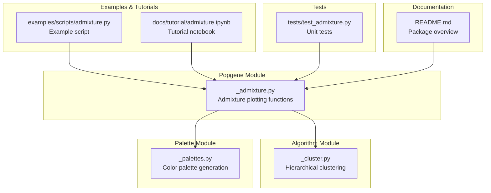
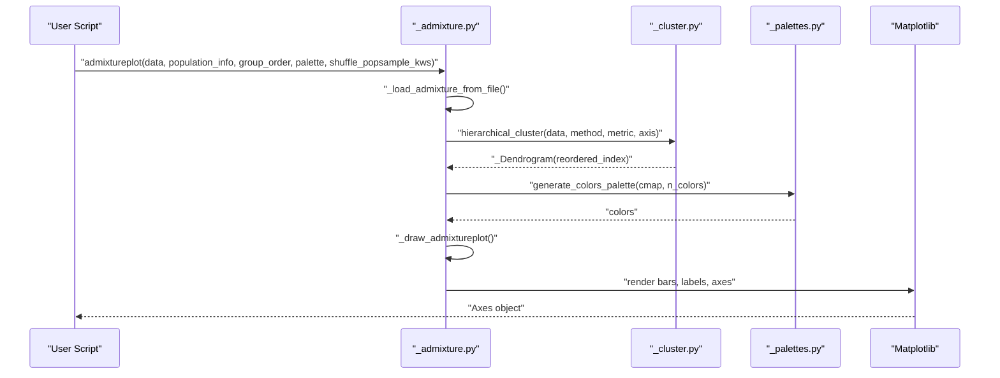
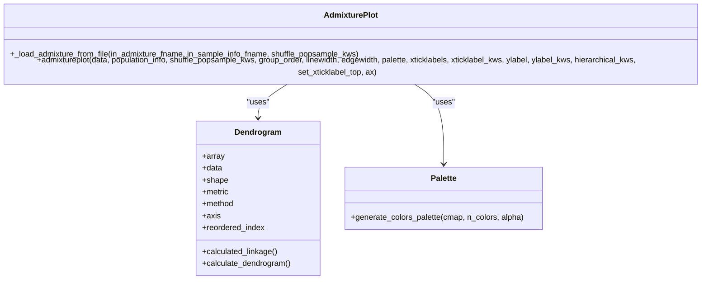
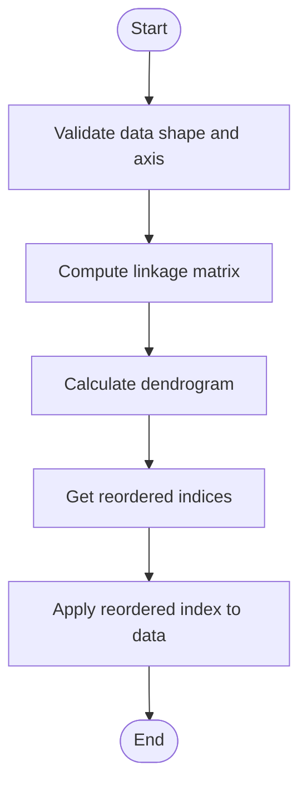
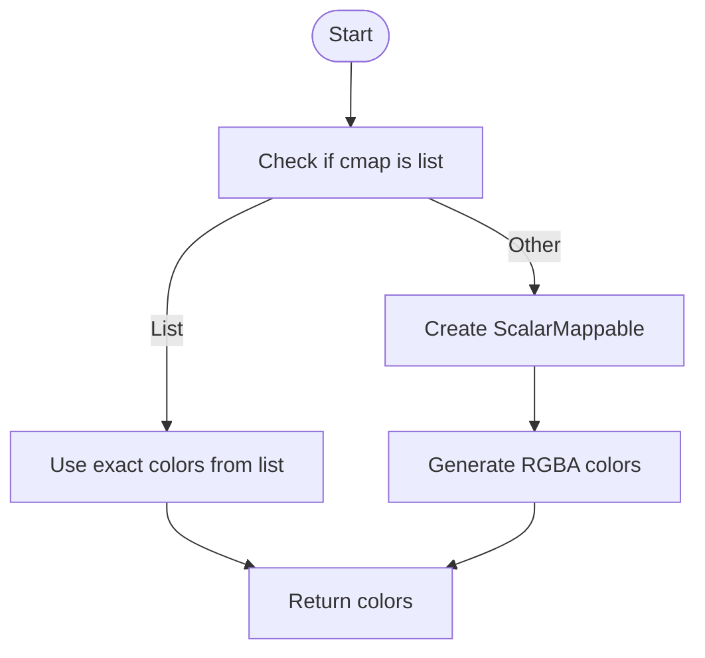
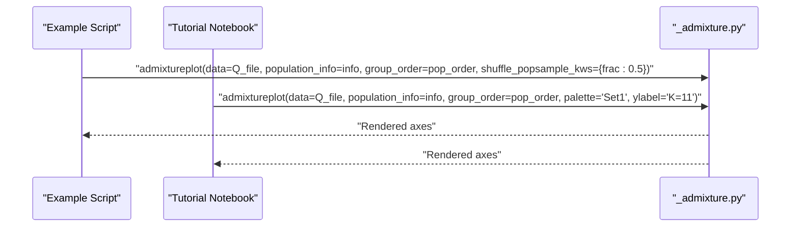
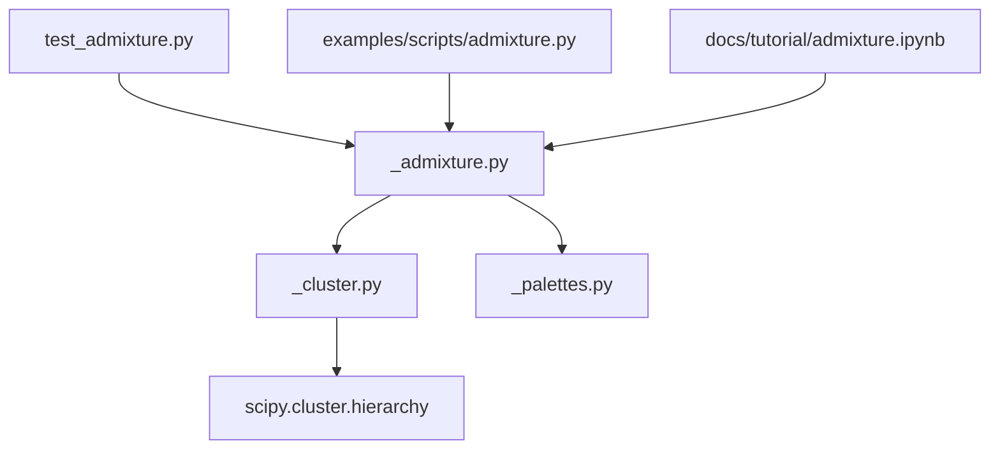

# Population Genetics Visualization

<cite>
**Referenced Files in This Document**
- [_admixture.py](file://geneview/popgene/_admixture.py)
- [_cluster.py](file://geneview/algorithm/_cluster.py)
- [_palettes.py](file://geneview/palette/_palettes.py)
- [admixture.py](file://examples/scripts/admixture.py)
- [admixture.ipynb](file://docs/tutorial/admixture.ipynb)
- [test_admixture.py](file://geneview/tests/test_admixture.py)
- [README.md](file://README.md)
</cite>

## Table of Contents
1. [Introduction](#introduction)
2. [Project Structure](#project-structure)
3. [Core Components](#core-components)
4. [Architecture Overview](#architecture-overview)
5. [Detailed Component Analysis](#detailed-component-analysis)
6. [Dependency Analysis](#dependency-analysis)
7. [Performance Considerations](#performance-considerations)
8. [Troubleshooting Guide](#troubleshooting-guide)
9. [Conclusion](#conclusion)
10. [Appendices](#appendices)

## Introduction
This document provides comprehensive guidance for population genetics visualization focusing on ancestral population structure analysis and visualization using admixture coefficient plotting. It explains the biological basis of admixture analysis, the .Q file format requirements, hierarchical clustering integration for sample ordering optimization, statistical interpretation of admixture coefficients, population structure analysis workflows, and visualization best practices. Practical examples demonstrate data preparation, population group assignment, clustering method selection, and result interpretation. The document also covers how admixture plots integrate with other population genetics analyses and addresses common challenges in population structure analysis and visualization optimization techniques.

## Project Structure
The population genetics visualization functionality is implemented within the geneview package, specifically in the popgene module for admixture plotting, the algorithm module for hierarchical clustering, and the palette module for color generation. The examples and tutorials demonstrate practical usage and workflows.

**Diagram sources**
- [_admixture.py:1-364](file://geneview/popgene/_admixture.py#L1-L364)
- [_cluster.py:1-147](file://geneview/algorithm/_cluster.py#L1-L147)
- [_palettes.py:1-13](file://geneview/palette/_palettes.py#L1-L13)
- [admixture.py:1-28](file://examples/scripts/admixture.py#L1-L28)
- [admixture.ipynb:1-609](file://docs/tutorial/admixture.ipynb#L1-L609)
- [test_admixture.py:1-157](file://geneview/tests/test_admixture.py#L1-L157)
- [README.md:1-370](file://README.md#L1-L370)

**Section sources**
- [_admixture.py:1-364](file://geneview/popgene/_admixture.py#L1-L364)
- [_cluster.py:1-147](file://geneview/algorithm/_cluster.py#L1-L147)
- [_palettes.py:1-13](file://geneview/palette/_palettes.py#L1-L13)
- [admixture.py:1-28](file://examples/scripts/admixture.py#L1-L28)
- [admixture.ipynb:1-609](file://docs/tutorial/admixture.ipynb#L1-L609)
- [test_admixture.py:1-157](file://geneview/tests/test_admixture.py#L1-L157)
- [README.md:1-370](file://README.md#L1-L370)

## Core Components
This section outlines the primary components involved in population structure visualization and admixture coefficient plotting.

- Admixture plotting functions: The main plotting interface and internal drawing routines handle data loading, hierarchical clustering, color palette generation, and rendering of admixture coefficient bars.
- Hierarchical clustering: Provides agglomerative clustering to optimize sample ordering within groups, improving interpretability of admixture plots.
- Color palette generation: Supplies color schemes for representing distinct ancestral components (K) in admixture plots.

Key responsibilities:
- Data ingestion and validation for .Q files and population information.
- Hierarchical clustering integration for sample ordering optimization.
- Statistical interpretation of admixture coefficients and visualization best practices.
- Workflow orchestration for population structure analysis and visualization.

**Section sources**
- [_admixture.py:17-134](file://geneview/popgene/_admixture.py#L17-L134)
- [_cluster.py:114-147](file://geneview/algorithm/_cluster.py#L114-L147)
- [_palettes.py:5-12](file://geneview/palette/_palettes.py#L5-L12)

## Architecture Overview
The admixture visualization pipeline integrates data loading, hierarchical clustering, and plotting into a cohesive workflow. The architecture emphasizes modularity and extensibility, enabling customization of clustering parameters, color palettes, and sample ordering.

**Diagram sources**
- [_admixture.py:137-165](file://geneview/popgene/_admixture.py#L137-L165)
- [_admixture.py:168-364](file://geneview/popgene/_admixture.py#L168-L364)
- [_cluster.py:114-147](file://geneview/algorithm/_cluster.py#L114-L147)
- [_palettes.py:5-12](file://geneview/palette/_palettes.py#L5-L12)

**Section sources**
- [_admixture.py:137-165](file://geneview/popgene/_admixture.py#L137-L165)
- [_admixture.py:168-364](file://geneview/popgene/_admixture.py#L168-L364)
- [_cluster.py:114-147](file://geneview/algorithm/_cluster.py#L114-L147)
- [_palettes.py:5-12](file://geneview/palette/_palettes.py#L5-L12)

## Detailed Component Analysis

### Admixture Plotting Functions
The admixture plotting functionality centers around two primary functions: `_load_admixture_from_file` and `admixtureplot`. The former handles file-based data ingestion and population grouping, while the latter orchestrates the plotting process, including hierarchical clustering and color palette application.

**Diagram sources**
- [_admixture.py:137-165](file://geneview/popgene/_admixture.py#L137-L165)
- [_admixture.py:168-364](file://geneview/popgene/_admixture.py#L168-L364)
- [_cluster.py:19-112](file://geneview/algorithm/_cluster.py#L19-L112)
- [_palettes.py:5-12](file://geneview/palette/_palettes.py#L5-L12)

Key implementation details:
- Data validation and ingestion: Ensures .Q file and population information alignment and raises informative errors for mismatched sizes.
- Hierarchical clustering integration: Applies clustering to optimize sample ordering within groups, enhancing interpretability.
- Color palette generation: Supports both categorical and continuous color mapping for K components.
- Rendering controls: Provides extensive customization for axes, labels, and visual appearance.

Statistical interpretation:
- Admixture coefficients represent the proportion of ancestry from each of K inferred ancestral populations for each individual.
- The sum of coefficients per individual equals 1, enabling stacked bar visualization.
- Clustering improves visual separation of individuals by ancestry composition.

Visualization best practices:
- Choose appropriate palette colors to distinguish K components clearly.
- Optimize group order and sample ordering to minimize visual noise.
- Use ylabel to indicate K and customize x-axis labels for readability.

**Section sources**
- [_admixture.py:137-165](file://geneview/popgene/_admixture.py#L137-L165)
- [_admixture.py:168-364](file://geneview/popgene/_admixture.py#L168-L364)
- [_cluster.py:19-112](file://geneview/algorithm/_cluster.py#L19-L112)
- [_palettes.py:5-12](file://geneview/palette/_palettes.py#L5-L12)

### Hierarchical Clustering Integration
Hierarchical clustering optimizes sample ordering within groups to improve the interpretability of admixture plots. The clustering algorithm computes linkage matrices and reorders samples based on dendrogram leaves.

**Diagram sources**
- [_cluster.py:100-112](file://geneview/algorithm/_cluster.py#L100-L112)
- [_cluster.py:114-147](file://geneview/algorithm/_cluster.py#L114-L147)

Clustering method selection:
- Average linkage: Balances sensitivity and robustness for admixture data.
- Metric selection: Euclidean distance is commonly used for continuous admixture coefficients.
- Axis specification: Controls whether clustering is performed along rows (samples) or columns (ancestral components).

Performance considerations:
- Large datasets benefit from fastcluster when available; otherwise, scipy linkage is used.
- Memory usage scales with dataset size; consider subsampling for very large inputs.

**Section sources**
- [_cluster.py:19-112](file://geneview/algorithm/_cluster.py#L19-L112)
- [_cluster.py:114-147](file://geneview/algorithm/_cluster.py#L114-L147)

### Color Palette Generation
Color palette generation supports flexible color mapping for K components, accommodating both categorical and continuous color schemes.

**Diagram sources**
- [_palettes.py:5-12](file://geneview/palette/_palettes.py#L5-L12)

Best practices:
- Select palettes that maximize contrast among K components.
- Use perceptually uniform colormaps for continuous-like representations.
- Ensure sufficient color diversity when K is large.

**Section sources**
- [_palettes.py:5-12](file://geneview/palette/_palettes.py#L5-L12)

### Practical Examples and Workflows
The examples and tutorial notebooks demonstrate end-to-end workflows for preparing data, assigning population groups, selecting clustering parameters, and interpreting results.

Workflow highlights:
- Data preparation: Load .Q file and population information; ensure alignment between sample counts.
- Population group assignment: Define group order and apply subsampling if needed.
- Clustering method selection: Choose linkage method and metric based on data characteristics.
- Result interpretation: Examine stacked bars to identify ancestry patterns and group structure.

**Diagram sources**
- [admixture.py:1-28](file://examples/scripts/admixture.py#L1-L28)
- [admixture.ipynb:1-609](file://docs/tutorial/admixture.ipynb#L1-L609)
- [_admixture.py:168-364](file://geneview/popgene/_admixture.py#L168-L364)

**Section sources**
- [admixture.py:1-28](file://examples/scripts/admixture.py#L1-L28)
- [admixture.ipynb:1-609](file://docs/tutorial/admixture.ipynb#L1-L609)
- [_admixture.py:168-364](file://geneview/popgene/_admixture.py#L168-L364)

## Dependency Analysis
The admixture plotting module depends on hierarchical clustering and color palette generation, while the clustering module relies on scipy for linkage computation. The tutorial and example scripts demonstrate practical usage patterns.

**Diagram sources**
- [_admixture.py:1-364](file://geneview/popgene/_admixture.py#L1-L364)
- [_cluster.py:1-147](file://geneview/algorithm/_cluster.py#L1-L147)
- [_palettes.py:1-13](file://geneview/palette/_palettes.py#L1-L13)
- [test_admixture.py:1-157](file://geneview/tests/test_admixture.py#L1-L157)
- [admixture.py:1-28](file://examples/scripts/admixture.py#L1-L28)
- [admixture.ipynb:1-609](file://docs/tutorial/admixture.ipynb#L1-L609)

**Section sources**
- [_admixture.py:1-364](file://geneview/popgene/_admixture.py#L1-L364)
- [_cluster.py:1-147](file://geneview/algorithm/_cluster.py#L1-L147)
- [_palettes.py:1-13](file://geneview/palette/_palettes.py#L1-L13)
- [test_admixture.py:1-157](file://geneview/tests/test_admixture.py#L1-L157)
- [admixture.py:1-28](file://examples/scripts/admixture.py#L1-L28)
- [admixture.ipynb:1-609](file://docs/tutorial/admixture.ipynb#L1-L609)

## Performance Considerations
- Hierarchical clustering scalability: For large datasets, consider subsampling or adjusting clustering parameters to balance accuracy and performance.
- Memory usage: Large .Q matrices require substantial memory; use efficient data types and consider chunking strategies.
- Visualization optimization: Reduce K components or adjust figure dimensions to improve rendering speed.
- External dependencies: Ensure scipy is installed for optimal clustering performance; fastcluster can offer improved performance for specific metrics and methods.

[No sources needed since this section provides general guidance]

## Troubleshooting Guide
Common issues and resolutions:
- Mismatched sample counts: Ensure the number of rows in the .Q file matches the population information file.
- Invalid data types: Provide either a dictionary of DataFrames or a file path to the .Q file.
- Incorrect group order: Verify that group_order aligns with the keys in the data dictionary.
- Palette limitations: When K exceeds the number of available palette colors, consider custom color lists or alternative palettes.
- Clustering warnings: Address warnings about axis selection or large matrices to ensure appropriate clustering behavior.

Validation and testing:
- Unit tests cover basic functionality, custom group orders, palette acceptance, and limit checks.
- Synthetic data generation enables controlled testing of clustering and plotting behaviors.

**Section sources**
- [_admixture.py:326-345](file://geneview/popgene/_admixture.py#L326-L345)
- [test_admixture.py:106-121](file://geneview/tests/test_admixture.py#L106-L121)
- [test_admixture.py:134-157](file://geneview/tests/test_admixture.py#L134-L157)

## Conclusion
The population genetics visualization framework provides a robust foundation for analyzing and interpreting ancestral population structure through admixture coefficient plotting. By integrating hierarchical clustering, flexible color palettes, and comprehensive customization options, it enables researchers to produce clear, informative visualizations that reveal complex population dynamics. Proper data preparation, careful selection of clustering parameters, and thoughtful visualization choices are essential for accurate interpretation and effective communication of results.

[No sources needed since this section summarizes without analyzing specific files]

## Appendices

### Biological Basis of Admixture Analysis
- Admixture analysis estimates the proportion of ancestry from K inferred ancestral populations for each individual.
- The .Q file format stores these coefficients, with rows representing individuals and columns representing ancestral components.
- Sum-to-one constraint ensures probabilistic interpretation of ancestry proportions.

### .Q File Format Requirements
- Tabular format with whitespace-separated values.
- Rows correspond to individuals; columns correspond to ancestral components (K).
- Headerless format is supported; column names are automatically generated based on K.

### Hierarchical Clustering Integration Best Practices
- Choose linkage methods and metrics appropriate for admixture coefficient distributions.
- Use axis=0 for sample-wise clustering to optimize within-group ordering.
- Consider subsampling for very large datasets to manage computational costs.

### Statistical Interpretation Guidelines
- Examine stacked bars to identify dominant ancestry components per individual.
- Compare group-level distributions to infer population structure and admixture patterns.
- Use clustering to reduce noise and highlight coherent ancestry clusters.

### Visualization Best Practices
- Select color palettes that maximize contrast among K components.
- Optimize group order and sample ordering to enhance interpretability.
- Customize labels and axes to improve readability and scientific communication.

[No sources needed since this section provides general guidance]