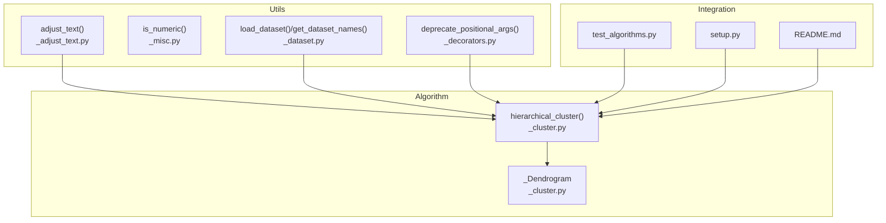
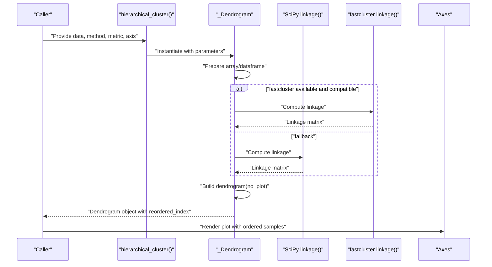
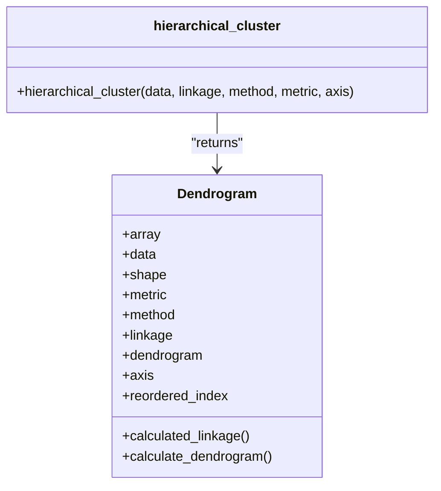
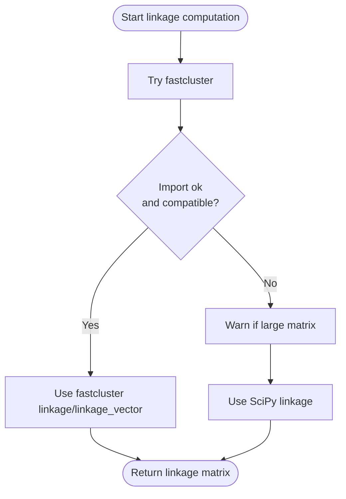
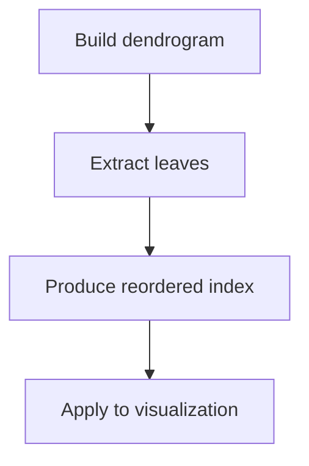
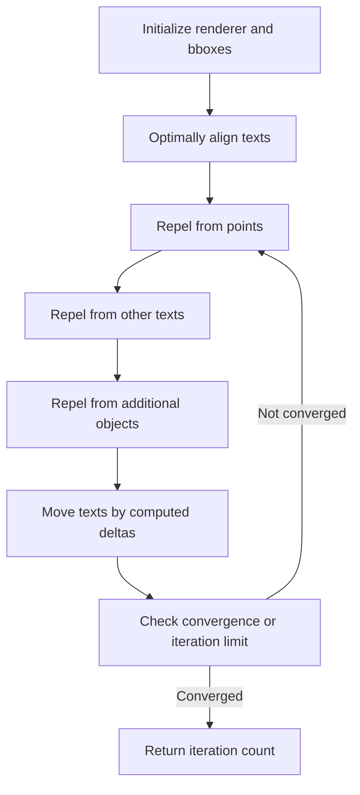
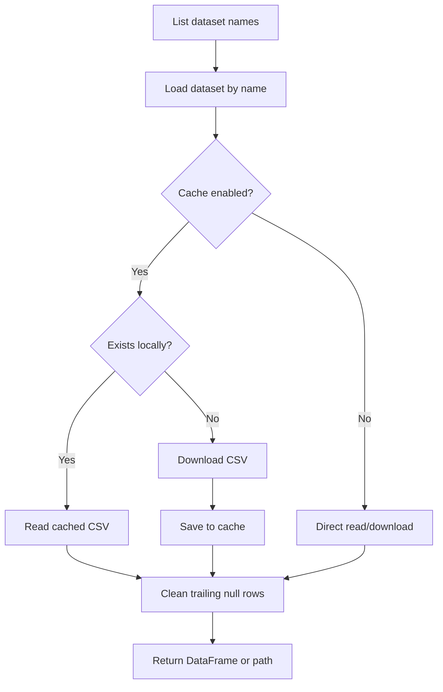
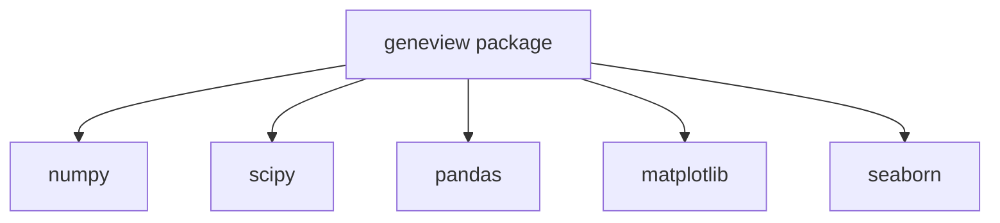

# Algorithmic Support

<cite>
**Referenced Files in This Document**
- [_cluster.py](file://geneview/algorithm/_cluster.py)
- [__init__.py](file://geneview/algorithm/__init__.py)
- [_adjust_text.py](file://geneview/utils/_adjust_text.py)
- [_misc.py](file://geneview/utils/_misc.py)
- [_dataset.py](file://geneview/utils/_dataset.py)
- [_decorators.py](file://geneview/utils/_decorators.py)
- [test_algorithms.py](file://geneview/tests/test_algorithms.py)
- [setup.py](file://setup.py)
- [README.md](file://README.md)
</cite>

## Table of Contents
1. [Introduction](#introduction)
2. [Project Structure](#project-structure)
3. [Core Components](#core-components)
4. [Architecture Overview](#architecture-overview)
5. [Detailed Component Analysis](#detailed-component-analysis)
6. [Dependency Analysis](#dependency-analysis)
7. [Performance Considerations](#performance-considerations)
8. [Troubleshooting Guide](#troubleshooting-guide)
9. [Conclusion](#conclusion)
10. [Appendices](#appendices)

## Introduction
This document describes the Algorithmic Support infrastructure that powers GeneView’s computational backends for genomics visualizations. It focuses on hierarchical clustering for sample ordering, the statistical computation backends, text adjustment utilities for optimal label placement, and miscellaneous utility functions. It also covers integration points with visualization components, performance optimization strategies, and practical workflows for cluster analysis.

## Project Structure
The Algorithmic Support spans two primary areas:
- Algorithmic core: hierarchical clustering via SciPy with optional fastcluster acceleration
- Utilities: text adjustment for matplotlib plots, dataset loading helpers, and general-purpose utilities

**Diagram sources**
- [_cluster.py:114-147](file://geneview/algorithm/_cluster.py#L114-L147)
- [_adjust_text.py:439-759](file://geneview/utils/_adjust_text.py#L439-L759)
- [_misc.py:6-43](file://geneview/utils/_misc.py#L6-L43)
- [_dataset.py:22-88](file://geneview/utils/_dataset.py#L22-L88)
- [_decorators.py:8-46](file://geneview/utils/_decorators.py#L8-L46)
- [test_algorithms.py:1-116](file://geneview/tests/test_algorithms.py#L1-L116)
- [setup.py:44-50](file://setup.py#L44-L50)
- [README.md:351-360](file://README.md#L351-L360)

**Section sources**
- [_cluster.py:1-147](file://geneview/algorithm/_cluster.py#L1-L147)
- [_adjust_text.py:1-759](file://geneview/utils/_adjust_text.py#L1-L759)
- [_misc.py:1-43](file://geneview/utils/_misc.py#L1-L43)
- [_dataset.py:1-88](file://geneview/utils/_dataset.py#L1-L88)
- [_decorators.py:1-60](file://geneview/utils/_decorators.py#L1-L60)
- [test_algorithms.py:1-116](file://geneview/tests/test_algorithms.py#L1-L116)
- [setup.py:44-50](file://setup.py#L44-L50)
- [README.md:351-360](file://README.md#L351-L360)

## Core Components
- Hierarchical clustering backend: Agglomerative clustering with configurable linkage methods and distance metrics, with automatic fallback and optional acceleration via fastcluster.
- Sample ordering: Reordered index derived from dendrogram leaves for downstream visualization.
- Text adjustment utilities: Iterative repulsion and alignment routines to avoid label overlaps in matplotlib plots.
- Dataset utilities: Helpers to fetch example datasets and manage local caches.
- Miscellaneous utilities: Type checks and validation helpers.

**Section sources**
- [_cluster.py:19-147](file://geneview/algorithm/_cluster.py#L19-L147)
- [_adjust_text.py:439-759](file://geneview/utils/_adjust_text.py#L439-L759)
- [_dataset.py:22-88](file://geneview/utils/_dataset.py#L22-L88)
- [_misc.py:6-43](file://geneview/utils/_misc.py#L6-L43)
- [_decorators.py:8-46](file://geneview/utils/_decorators.py#L8-L46)

## Architecture Overview
The clustering pipeline integrates data preparation, linkage computation, dendrogram generation, and sample reordering. Optional fastcluster acceleration is selected based on method and metric compatibility. The resulting reordered indices are used by visualization components to improve label readability and cluster coherence.

**Diagram sources**
- [_cluster.py:22-111](file://geneview/algorithm/_cluster.py#L22-L111)

## Detailed Component Analysis

### Hierarchical Clustering Backend
- Purpose: Compute agglomerative hierarchical clustering and produce a dendrogram with sample ordering.
- Key behaviors:
  - Accepts DataFrame or ndarray; transposes along axis=1 for column-wise clustering.
  - Supports multiple linkage methods and distance metrics via SciPy.
  - Optional precomputed linkage matrix.
  - Automatic selection of fastcluster when available and compatible; otherwise falls back to SciPy.
  - Produces reordered indices suitable for visualization.

**Diagram sources**
- [_cluster.py:19-147](file://geneview/algorithm/_cluster.py#L19-L147)

**Section sources**
- [_cluster.py:19-147](file://geneview/algorithm/_cluster.py#L19-L147)
- [test_algorithms.py:13-79](file://geneview/tests/test_algorithms.py#L13-L79)

### Linkage Computation and Acceleration
- Method selection:
  - Uses fastcluster when available and method/metric are compatible (e.g., Euclidean with centroid, median, ward; or single linkage).
  - Otherwise falls back to SciPy linkage.
- Compatibility notes:
  - Memory-efficient vectorized linkage_vector is used for specific combinations.
  - A warning is issued for large matrices when fastcluster is unavailable.

**Diagram sources**
- [_cluster.py:66-93](file://geneview/algorithm/_cluster.py#L66-L93)

**Section sources**
- [_cluster.py:60-93](file://geneview/algorithm/_cluster.py#L60-L93)

### Sample Ordering Strategies
- Reordered indices are extracted from the dendrogram leaves and can be used to reorder rows or columns depending on the chosen axis.
- Tests confirm permutations are valid and consistent across methods and metrics.

**Diagram sources**
- [_cluster.py:95-111](file://geneview/algorithm/_cluster.py#L95-L111)
- [test_algorithms.py:49-78](file://geneview/tests/test_algorithms.py#L49-L78)

**Section sources**
- [_cluster.py:95-111](file://geneview/algorithm/_cluster.py#L95-L111)
- [test_algorithms.py:49-78](file://geneview/tests/test_algorithms.py#L49-L78)

### Text Adjustment Utilities
- Purpose: Automatically adjust text positions to minimize overlaps with points and other objects in matplotlib plots.
- Capabilities:
  - Repel texts from each other, from points, and from axes boundaries.
  - Optimal alignment selection per text.
  - Iterative adjustment with convergence control and optional step saving.
- Parameters include expansion factors, force multipliers, and movement restrictions.

**Diagram sources**
- [_adjust_text.py:439-759](file://geneview/utils/_adjust_text.py#L439-L759)

**Section sources**
- [_adjust_text.py:439-759](file://geneview/utils/_adjust_text.py#L439-L759)

### Dataset Utilities
- Purpose: Provide example datasets for tutorials and testing.
- Features:
  - List available dataset names from the online repository.
  - Download and cache datasets locally with environment-variable override for cache directory.
  - CSV parsing with post-processing to remove trailing null rows.

**Diagram sources**
- [_dataset.py:10-88](file://geneview/utils/_dataset.py#L10-L88)

**Section sources**
- [_dataset.py:10-88](file://geneview/utils/_dataset.py#L10-L88)

### Miscellaneous Utilities
- Numeric type checker: Validates numeric scalars robustly for preprocessing and filtering.

**Section sources**
- [_misc.py:6-43](file://geneview/utils/_misc.py#L6-L43)

### Decorators
- Positional argument deprecation: Enforces keyword-only arguments for selected APIs to improve clarity and future-proofing.

**Section sources**
- [_decorators.py:8-46](file://geneview/utils/_decorators.py#L8-L46)

## Dependency Analysis
- Core runtime dependencies include NumPy, SciPy, pandas, matplotlib, and seaborn.
- Algorithmic components rely on SciPy for linkage computation and dendrogram generation; optional fastcluster acceleration is detected at runtime.
- Visualization integration occurs downstream via the reordered indices and text adjustment utilities.

**Diagram sources**
- [setup.py:44-50](file://setup.py#L44-L50)

**Section sources**
- [setup.py:44-50](file://setup.py#L44-L50)
- [README.md:351-360](file://README.md#L351-L360)

## Performance Considerations
- Large dataset handling:
  - A warning is issued when fastcluster is unavailable and the matrix product exceeds a threshold, suggesting installation for better performance.
- Acceleration:
  - fastcluster linkage_vector is used for compatible method/metric pairs to reduce memory overhead.
- Practical tips:
  - Prefer Euclidean distance with centroid/median/ward when possible for vectorized fastcluster paths.
  - Use axis=1 for column-wise clustering to reduce dimensionality when appropriate.
  - Cache datasets locally to avoid repeated network overhead during development and testing.

**Section sources**
- [_cluster.py:88-91](file://geneview/algorithm/_cluster.py#L88-L91)
- [_cluster.py:70-76](file://geneview/algorithm/_cluster.py#L70-L76)
- [_dataset.py:55-67](file://geneview/utils/_dataset.py#L55-L67)

## Troubleshooting Guide
- Missing SciPy:
  - The clustering function raises a runtime error if SciPy is not installed.
- Missing fastcluster:
  - When unavailable, the code falls back to SciPy and may warn about performance for large matrices.
- Unexpected reorderings:
  - Verify axis selection (rows vs columns) and ensure data types are numeric.
- Label overlap in plots:
  - Use the text adjustment utilities to iteratively resolve overlaps and improve readability.

**Section sources**
- [_cluster.py:142-143](file://geneview/algorithm/_cluster.py#L142-L143)
- [_cluster.py:88-91](file://geneview/algorithm/_cluster.py#L88-L91)
- [_adjust_text.py:439-759](file://geneview/utils/_adjust_text.py#L439-L759)

## Conclusion
The Algorithmic Support layer provides a robust, extensible foundation for hierarchical clustering and label placement in GeneView. It balances flexibility with performance, leveraging optional acceleration when available and maintaining compatibility with SciPy defaults. The included utilities streamline dataset acquisition and visualization refinement, enabling reproducible and visually effective genomics analyses.

## Appendices

### Practical Workflows
- Cluster analysis workflow:
  - Prepare rectangular data (DataFrame or ndarray).
  - Choose linkage method and metric; select axis for clustering.
  - Compute dendrogram and extract reordered indices.
  - Render visualizations using the reordered indices for improved sample grouping.
- Custom clustering method integration:
  - Precompute a linkage matrix externally and pass it to the clustering function to bypass recomputation.
- Text adjustment workflow:
  - After plotting points and labels, call the adjustment routine with desired expansion and force parameters to minimize overlaps.

**Section sources**
- [_cluster.py:114-147](file://geneview/algorithm/_cluster.py#L114-L147)
- [_adjust_text.py:439-759](file://geneview/utils/_adjust_text.py#L439-L759)
- [test_algorithms.py:69-78](file://geneview/tests/test_algorithms.py#L69-L78)

### Algorithm Selection Criteria
- Ward linkage typically produces compact, spherical clusters but requires Euclidean distance.
- Average and complete linkage are more robust to outliers and work well with multiple metrics.
- Single linkage emphasizes connectivity and can reveal chain-like structures.
- Weighted linkage merges clusters based on average distances between pairs.

**Section sources**
- [test_algorithms.py:59-67](file://geneview/tests/test_algorithms.py#L59-L67)

### Benchmarking and Tuning
- Benchmarking:
  - Compare runtime and memory usage across linkage methods and metrics on representative datasets.
  - Measure performance with and without fastcluster for identical configurations.
- Parameter tuning:
  - Adjust metric to match data characteristics (Euclidean for continuous, cityblock for robustness, cosine for angular similarity).
  - Control convergence and iteration limits in text adjustment to balance quality and speed.

**Section sources**
- [_cluster.py:66-93](file://geneview/algorithm/_cluster.py#L66-L93)
- [_adjust_text.py:531-536](file://geneview/utils/_adjust_text.py#L531-L536)

### Scalability Considerations
- Small datasets: SciPy linkage suffices; fastcluster is optional.
- Medium datasets: Consider fastcluster for compatible methods/metrics.
- Large datasets: Ensure sufficient memory; consider dimensionality reduction or sampling strategies; cache datasets locally.

**Section sources**
- [_cluster.py:88-91](file://geneview/algorithm/_cluster.py#L88-L91)
- [_dataset.py:55-67](file://geneview/utils/_dataset.py#L55-L67)