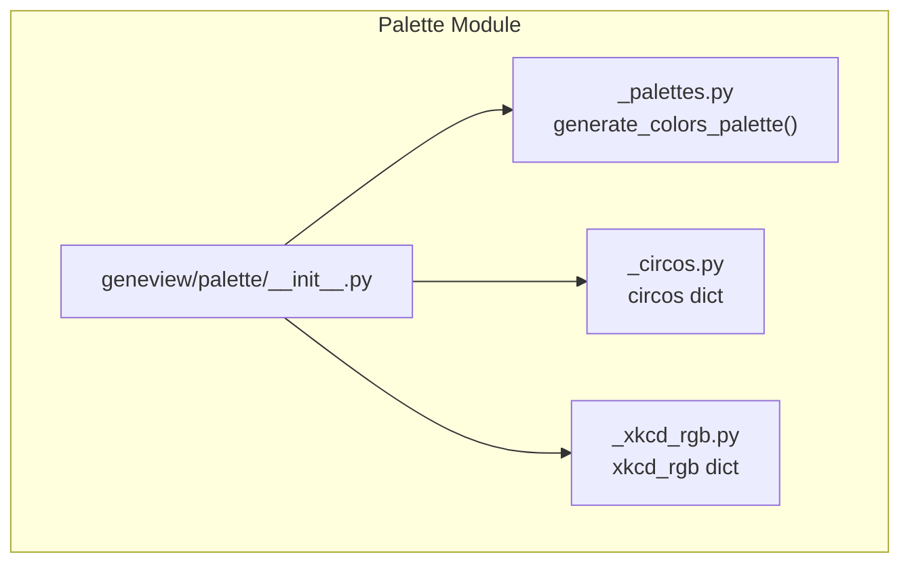
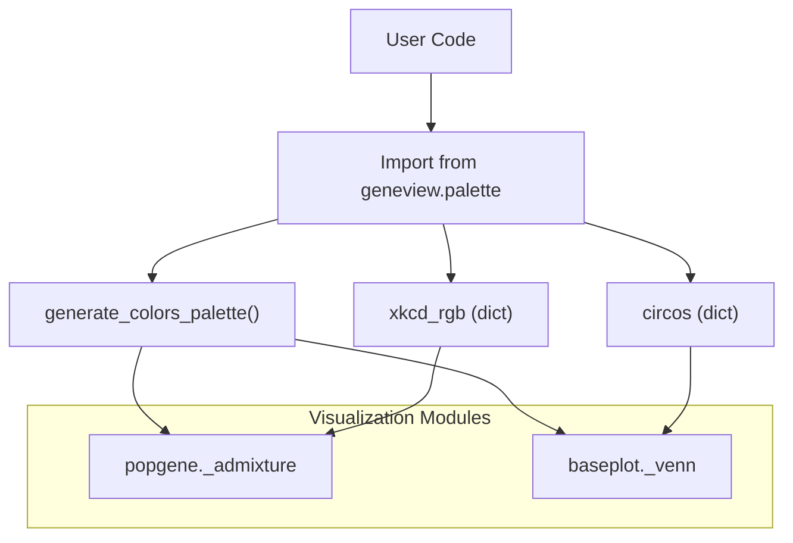
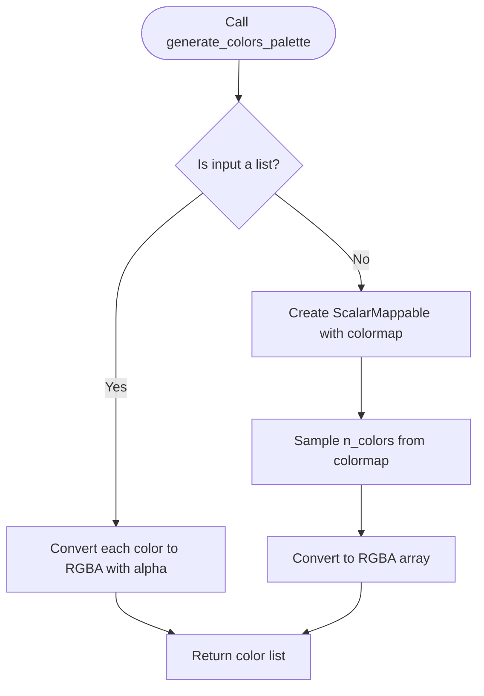
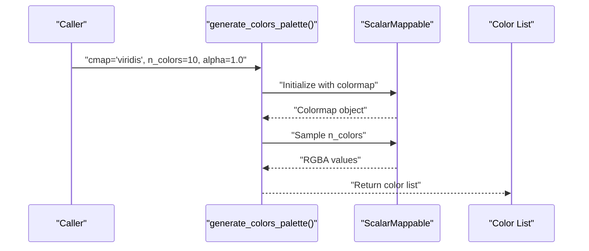
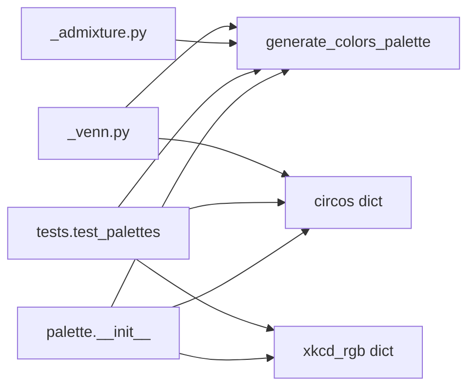

# Color Palette Management

<cite>
**Referenced Files in This Document**
- [__init__.py](file://geneview/palette/__init__.py)
- [_palettes.py](file://geneview/palette/_palettes.py)
- [_circos.py](file://geneview/palette/_circos.py)
- [_xkcd_rgb.py](file://geneview/palette/_xkcd_rgb.py)
- [test_palettes.py](file://geneview/tests/test_palettes.py)
- [_admixture.py](file://geneview/popgene/_admixture.py)
- [_venn.py](file://geneview/baseplot/_venn.py)
</cite>

## Table of Contents
1. [Introduction](#introduction)
2. [Project Structure](#project-structure)
3. [Core Components](#core-components)
4. [Architecture Overview](#architecture-overview)
5. [Detailed Component Analysis](#detailed-component-analysis)
6. [Dependency Analysis](#dependency-analysis)
7. [Performance Considerations](#performance-considerations)
8. [Troubleshooting Guide](#troubleshooting-guide)
9. [Conclusion](#conclusion)
10. [Appendices](#appendices)

## Introduction
This document describes GeneView’s Color Palette Management system, focusing on how color palettes are generated, curated, and integrated across visualization components. It covers:
- Built-in palette generation via matplotlib colormaps
- Circos-compatible color schemes for genomic visualization
- XKCD RGB mappings for expressive and accessible color choices
- Palette selection strategies and theme consistency
- Customization options for different visualization types
- Practical examples of palette creation and integration with matplotlib styling
- Accessibility considerations, contrast optimization, and export strategies
- Performance optimization and extensibility for new palette types

## Project Structure
The palette subsystem resides under geneview/palette and exposes three primary assets:
- A function to generate color palettes from matplotlib colormaps
- A dictionary of Circos-compatible named colors
- A dictionary of XKCD color names mapped to hex values

**Diagram sources**
- [__init__.py:1-10](file://geneview/palette/__init__.py#L1-L10)
- [_palettes.py:1-13](file://geneview/palette/_palettes.py#L1-L13)
- [_circos.py:1-236](file://geneview/palette/_circos.py#L1-L236)
- [_xkcd_rgb.py:1-951](file://geneview/palette/_xkcd_rgb.py#L1-L951)

**Section sources**
- [__init__.py:1-10](file://geneview/palette/__init__.py#L1-L10)

## Core Components
- Matplotlib-based palette generator: Converts a colormap or a list of colors into RGBA arrays suitable for plotting.
- Circos color dictionary: Named RGB colors aligned with Circos conventions for ideograms, chromosomes, and methylation tracks.
- XKCD color dictionary: Human-friendly color names mapped to hex values for intuitive palette authoring.

Key responsibilities:
- Provide deterministic, reproducible color sets for multiple populations and continuous variables
- Support both discrete categorical palettes and continuous gradient palettes
- Offer pre-curated palettes optimized for genomic visualization contexts

**Section sources**
- [_palettes.py:5-12](file://geneview/palette/_palettes.py#L5-L12)
- [_circos.py:24-235](file://geneview/palette/_circos.py#L24-L235)
- [_xkcd_rgb.py:1-951](file://geneview/palette/_xkcd_rgb.py#L1-L951)

## Architecture Overview
The palette system is intentionally lightweight and modular:
- Users import from the palette package to access color dictionaries and the palette generator
- Visualization modules consume these resources to assign colors consistently across plots
- Tests validate palette correctness and usage patterns

**Diagram sources**
- [__init__.py:5-8](file://geneview/palette/__init__.py#L5-L8)
- [_admixture.py](file://geneview/popgene/_admixture.py#L13)
- [_venn.py](file://geneview/baseplot/_venn.py#L11)

## Detailed Component Analysis

### Matplotlib Palette Generator
Purpose:
- Generate a list of colors from a matplotlib colormap or a user-provided list
- Normalize alpha transparency uniformly across colors
- Return RGBA tuples for direct use with plotting backends

Implementation highlights:
- Accepts either a colormap name or a list of color specifications
- Uses matplotlib’s ScalarMappable for colormap sampling
- Applies alpha blending consistently

**Diagram sources**
- [_palettes.py:5-12](file://geneview/palette/_palettes.py#L5-L12)

Practical usage patterns:
- Continuous gradients: pass a colormap name and desired number of colors
- Discrete categories: pass a list of distinct colors for categorical grouping
- Transparency control: adjust alpha for overlays and layered plots

Integration examples:
- Admixture plots rely on this generator to assign harmonious colors to ancestral populations
- Venn diagrams use it to color set regions consistently

**Section sources**
- [_palettes.py:5-12](file://geneview/palette/_palettes.py#L5-L12)
- [_admixture.py](file://geneview/popgene/_admixture.py#L13)
- [_venn.py](file://geneview/baseplot/_venn.py#L11)

### Circos-Compatible Color Scheme
Purpose:
- Provide named colors aligned with Circos conventions for ideograms, chromosomes, and methylation tracks
- Enable seamless integration with Circos-style configurations and genomic track rendering

Coverage:
- Optimized colors for visual distinction
- Karyotype and chromosome-specific palettes
- Methylation level gradients

Usage:
- Access colors by name from the dictionary
- Combine with palette generator for dynamic palettes derived from Circos hues

**Section sources**
- [_circos.py:24-235](file://geneview/palette/_circos.py#L24-L235)

### XKCD RGB Mappings
Purpose:
- Offer human-friendly color names for intuitive palette authoring and exploration
- Improve accessibility by enabling non-visual descriptors for color choices

Coverage:
- Over 900 named colors spanning warm, cool, muted, and saturated palettes
- Useful for thematic consistency and exploratory palette design

Usage:
- Select named colors from the dictionary
- Compose palettes by combining XKCD names with the generator for consistent RGBA output

**Section sources**
- [_xkcd_rgb.py:1-951](file://geneview/palette/_xkcd_rgb.py#L1-L951)

### Palette Factory Pattern Implementation
While not a traditional class-based factory, the palette system follows a functional factory pattern:
- Inputs: colormap name or explicit color list, number of colors, alpha
- Outputs: a ready-to-use palette list
- Extensibility: new palettes can be added by extending the generator or composing existing dictionaries

**Diagram sources**
- [_palettes.py:5-12](file://geneview/palette/_palettes.py#L5-L12)

## Dependency Analysis
- Public API exposure: The palette package exports the generator and both color dictionaries
- Internal usage: Visualization modules import the generator and dictionaries for consistent color assignment
- Test coverage: Unit tests validate palette generation and dictionary availability

**Diagram sources**
- [__init__.py:5-8](file://geneview/palette/__init__.py#L5-L8)
- [test_palettes.py](file://geneview/tests/test_palettes.py#L6)
- [_admixture.py](file://geneview/popgene/_admixture.py#L13)
- [_venn.py](file://geneview/baseplot/_venn.py#L11)

**Section sources**
- [__init__.py:5-8](file://geneview/palette/__init__.py#L5-L8)
- [test_palettes.py](file://geneview/tests/test_palettes.py#L6)

## Performance Considerations
- Prefer passing a list of colors when the palette is static to avoid repeated colormap sampling
- Reuse generated palettes across multiple plots to minimize computation
- For large-scale visualizations, consider caching color lists keyed by parameters (colormap, n_colors, alpha)
- When blending or deriving palettes, batch operations to reduce overhead

## Troubleshooting Guide
Common issues and resolutions:
- Unexpected color ordering: Ensure n_colors matches the intended number of categories or bins
- Transparency inconsistencies: Set alpha explicitly to achieve desired overlay effects
- Name collisions: Use the color dictionaries for standardized names when integrating with Circos or XKCD-based themes
- Validation: Use unit tests to confirm palette generation and dictionary presence

**Section sources**
- [test_palettes.py](file://geneview/tests/test_palettes.py#L6)

## Conclusion
GeneView’s palette system combines a flexible matplotlib-based generator with curated dictionaries for Circos and XKCD color schemes. Together, they enable consistent, accessible, and visually harmonious color assignments across genomic visualizations. The design supports customization, performance optimization, and extensibility for future palette types.

## Appendices

### Practical Examples Index
- Generating a continuous palette for Manhattan plots
  - [Reference:5-12](file://geneview/palette/_palettes.py#L5-L12)
- Assigning discrete colors to ancestry clusters in admixture plots
  - [Reference](file://geneview/popgene/_admixture.py#L13)
- Coloring Venn diagram regions with harmonious defaults
  - [Reference](file://geneview/baseplot/_venn.py#L11)
- Using Circos chromosome colors for ideogram tracks
  - [Reference:103-132](file://geneview/palette/_circos.py#L103-L132)
- Selecting XKCD-named colors for thematic consistency
  - [Reference:1-951](file://geneview/palette/_xkcd_rgb.py#L1-L951)

### Accessibility and Contrast Guidelines
- Use high-contrast pairs for binary comparisons
- Avoid red-green discrimination challenges; prefer blue-orange or hue shifts
- Ensure sufficient luminance differences for small markers and dense plots
- Validate color combinations across simulated color vision deficiencies

### Export and Sharing Palettes
- Serialize palette lists as JSON/YAML for reproducibility
- Document colormap parameters and alpha values used
- Share named color dictionaries alongside usage examples for Circos/XKCD integrations