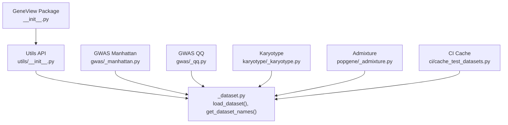
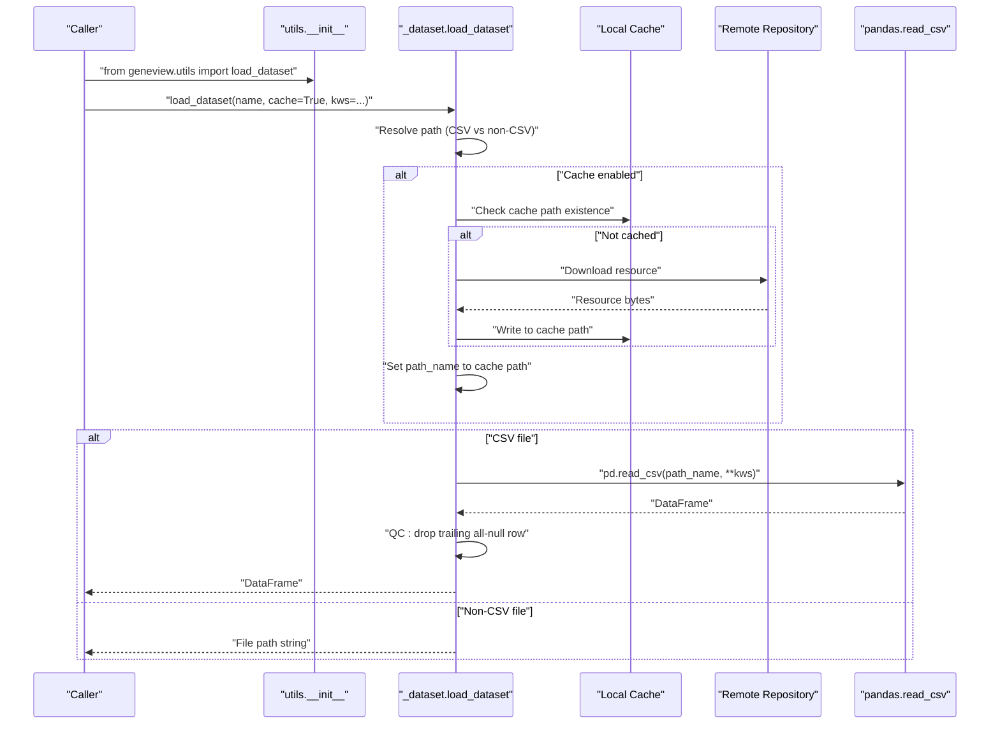
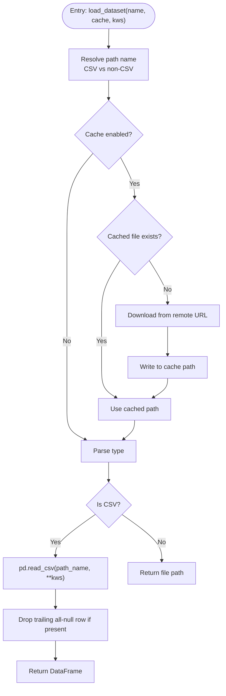
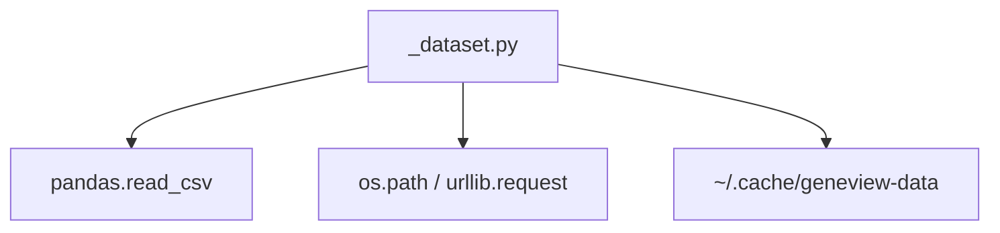

# Dataset Loading System

<cite>
**Referenced Files in This Document**
- [README.md](file://README.md)
- [__init__.py](file://geneview/__init__.py)
- [utils/__init__.py](file://geneview/utils/__init__.py)
- [utils/_dataset.py](file://geneview/utils/_dataset.py)
- [ci/cache_test_datasets.py](file://ci/cache_test_datasets.py)
- [_manhattan.py](file://geneview/gwas/_manhattan.py)
- [_qq.py](file://geneview/gwas/_qq.py)
- [_karyotype.py](file://geneview/karyotype/_karyotype.py)
- [_admixture.py](file://geneview/popgene/_admixture.py)
</cite>

## Table of Contents
1. [Introduction](#introduction)
2. [Project Structure](#project-structure)
3. [Core Components](#core-components)
4. [Architecture Overview](#architecture-overview)
5. [Detailed Component Analysis](#detailed-component-analysis)
6. [Dependency Analysis](#dependency-analysis)
7. [Performance Considerations](#performance-considerations)
8. [Troubleshooting Guide](#troubleshooting-guide)
9. [Conclusion](#conclusion)

## Introduction
This document describes the Dataset Loading System that powers GeneView’s data ingestion and preprocessing pipeline. It focuses on:
- Online repository integration for remote datasets
- Local data file handling and format standardization
- Automatic dataset discovery and caching
- Data validation and quality control
- Supported formats (CSV, VCF stats, and population genetics files such as .Q)
- Practical workflows for loading, preprocessing, and transforming datasets
- Lazy-loading and memory optimization strategies
- Integration with pandas DataFrame operations and data type inference
- Network optimization for remote retrieval

## Project Structure
The dataset loading system is primarily implemented under the utils package and integrated across plotting and analysis modules. Key entry points and components include:
- Public API exposed via the package root
- Dataset discovery and loader utilities
- Example usage across GWAS plots, karyotype, and admixture modules
- CI caching utilities for test datasets

**Diagram sources**
- [__init__.py](file://geneview/__init__.py)
- [utils/__init__.py](file://geneview/utils/__init__.py)
- [utils/_dataset.py](file://geneview/utils/_dataset.py)
- [_manhattan.py](file://geneview/gwas/_manhattan.py)
- [_qq.py](file://geneview/gwas/_qq.py)
- [_karyotype.py](file://geneview/karyotype/_karyotype.py)
- [_admixture.py](file://geneview/popgene/_admixture.py)
- [ci/cache_test_datasets.py](file://ci/cache_test_datasets.py)

**Section sources**
- [README.md](file://README.md)
- [__init__.py](file://geneview/__init__.py)
- [utils/__init__.py](file://geneview/utils/__init__.py)
- [utils/_dataset.py](file://geneview/utils/_dataset.py)

## Core Components
- Public API exposure: The package exposes dataset loading utilities through its root init file.
- Dataset loader: Provides automatic dataset discovery and retrieval from either remote URLs or cached local files, returning either a pandas DataFrame (for CSV) or a file path (for non-CSV).
- Dataset names: A discovery mechanism enumerates available dataset identifiers.
- Caching: Optional local caching of remote datasets under a dedicated data home directory.
- Quality control: Basic validation checks (e.g., dropping trailing all-null rows for CSV) are applied during loading.

Key responsibilities:
- Resolve dataset name to a URL or local path
- Optionally cache remote resources locally
- Parse CSV into a DataFrame or return file path for binary formats
- Provide dataset metadata (names) for discovery

**Section sources**
- [__init__.py](file://geneview/__init__.py)
- [utils/__init__.py](file://geneview/utils/__init__.py)
- [utils/_dataset.py](file://geneview/utils/_dataset.py)

## Architecture Overview
The dataset loading architecture integrates remote retrieval, local caching, and format-specific parsing. The following diagram maps the actual components and their interactions.

**Diagram sources**
- [utils/__init__.py](file://geneview/utils/__init__.py)
- [utils/_dataset.py](file://geneview/utils/_dataset.py)

## Detailed Component Analysis

### Dataset Loader Implementation
The loader resolves dataset names to URLs, supports optional caching, and returns either a DataFrame or a file path depending on the file extension. It also performs a simple quality control step for CSV files.

Key behaviors:
- Name-to-path resolution: Determines whether the requested dataset is a CSV or another format and constructs appropriate URLs.
- Caching: Uses a dedicated data home directory to store downloaded resources locally.
- Parsing: Reads CSV files into a pandas DataFrame and applies a trailing-row QC check.
- Non-CSV handling: Returns the resolved file path for non-CSV formats (e.g., VCF stats).

**Diagram sources**
- [utils/_dataset.py](file://geneview/utils/_dataset.py)

**Section sources**
- [utils/_dataset.py](file://geneview/utils/_dataset.py)

### Dataset Discovery and Names
The dataset discovery mechanism enumerates available dataset identifiers. This enables automatic dataset discovery and helps users select among supported datasets.

Integration points:
- Exposed via the utils API
- Used by example workflows across modules

**Section sources**
- [utils/__init__.py](file://geneview/utils/__init__.py)
- [utils/_dataset.py](file://geneview/utils/_dataset.py)

### Example Workflows Across Modules
- GWAS Manhattan and QQ plots demonstrate loading a GWAS dataset by name and integrating with downstream plotting functions.
- Karyotype module shows loading a karyotype annotation file by name.
- Admixture module demonstrates loading population genetics outputs (e.g., Q file and population info) by name.

These workflows illustrate:
- How to load datasets by name
- How to pass additional pandas read options
- How to integrate loaded data into visualization pipelines

**Section sources**
- [_manhattan.py](file://geneview/gwas/_manhattan.py)
- [_qq.py](file://geneview/gwas/_qq.py)
- [_karyotype.py](file://geneview/karyotype/_karyotype.py)
- [_admixture.py](file://geneview/popgene/_admixture.py)

### CI Caching for Test Datasets
The CI caching script pre-warms the dataset cache to avoid race conditions during parallelized testing. It loads a curated set of datasets by name to populate the local cache.

Practical impact:
- Ensures fast and reliable test execution
- Demonstrates recommended caching strategy for production environments

**Section sources**
- [ci/cache_test_datasets.py](file://ci/cache_test_datasets.py)

## Dependency Analysis
The dataset loading system depends on:
- pandas for CSV parsing and DataFrame creation
- Standard library modules for path handling and HTTP retrieval
- A dedicated data home directory for caching

**Diagram sources**
- [utils/_dataset.py](file://geneview/utils/_dataset.py)

**Section sources**
- [utils/_dataset.py](file://geneview/utils/_dataset.py)

## Performance Considerations
- Caching reduces repeated network fetches and accelerates subsequent loads.
- CSV parsing leverages pandas for efficient I/O; consider passing dtype hints and chunking options via kws for very large CSVs.
- For non-CSV formats, returning a file path avoids unnecessary in-memory parsing and defers processing to specialized readers.
- Memory optimization for large datasets:
  - Use pandas read options to limit columns or rows during initial inspection.
  - Prefer lazy evaluation patterns (e.g., iterators or chunked reads) for downstream processing.
  - Clean up temporary objects after transformations to reduce peak memory usage.

[No sources needed since this section provides general guidance]

## Troubleshooting Guide
Common issues and remedies:
- Network errors when fetching remote datasets:
  - Verify connectivity and retry; optionally disable cache to force re-download.
- Permission errors writing to cache directory:
  - Ensure write permissions to the data home directory; override with a writable data_home if needed.
- Unexpected empty or malformed CSV:
  - Confirm the dataset name resolves to a CSV; inspect the raw file; apply additional pandas read options (e.g., comment lines, encoding).
- Trailing all-null rows:
  - The loader drops a single trailing all-null row automatically; if more rows are problematic, post-process the returned DataFrame accordingly.

**Section sources**
- [utils/_dataset.py](file://geneview/utils/_dataset.py)

## Conclusion
The Dataset Loading System provides a robust, extensible foundation for ingesting and preprocessing datasets in GeneView. It integrates seamlessly with pandas, supports caching and quality control, and offers clear pathways for extending support to new formats. By leveraging the loader across modules and adopting the recommended caching and memory strategies, users can efficiently handle diverse genomic datasets while maintaining reliability and performance.