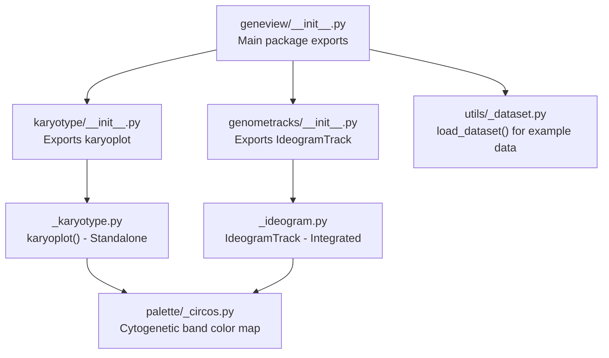
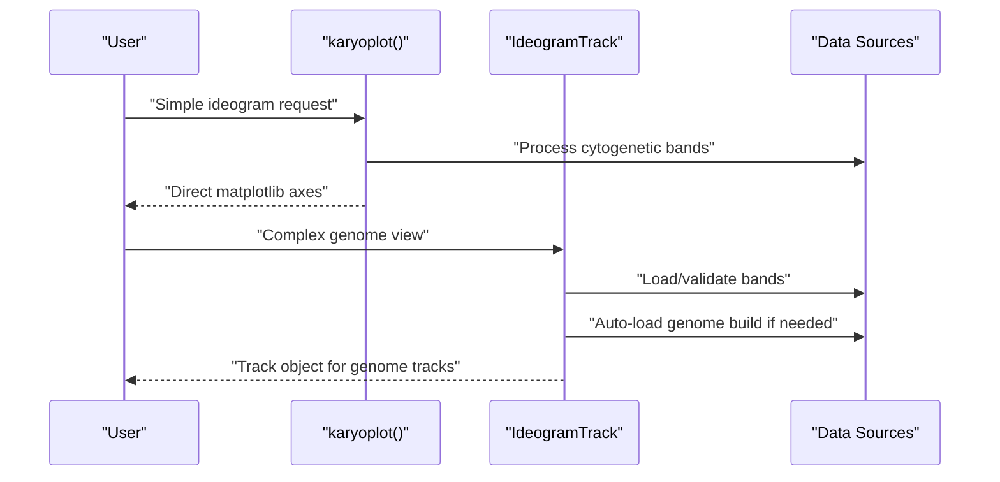
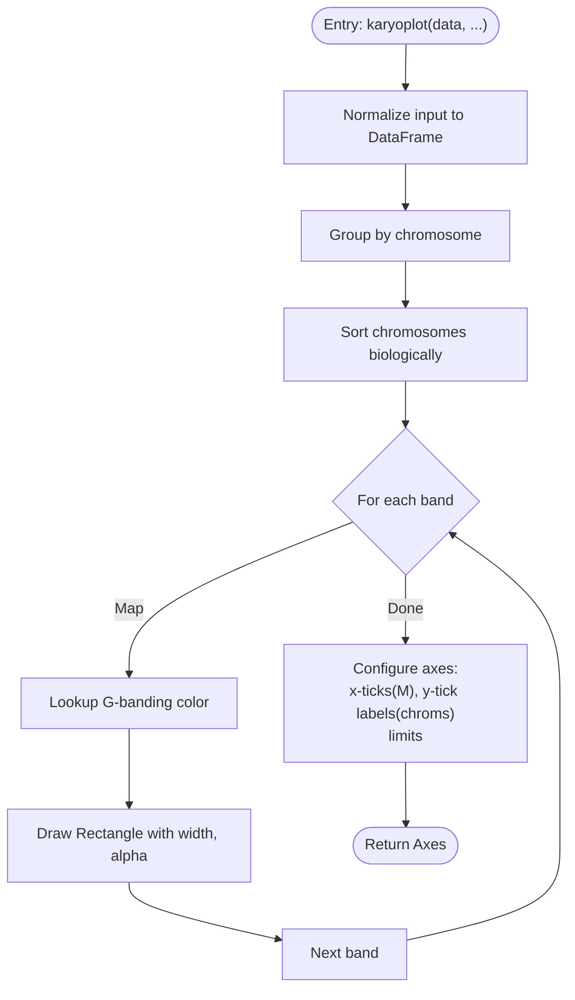
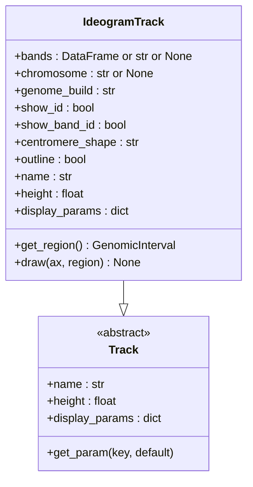
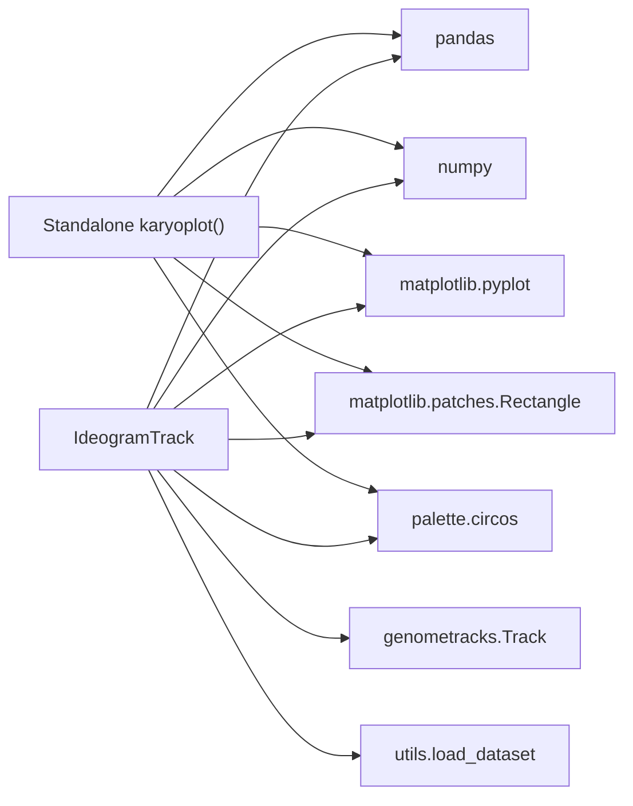

# Karyotype Visualization

<cite>
**Referenced Files in This Document**
- [_karyotype.py](file://geneview/karyotype/_karyotype.py)
- [__init__.py](file://geneview/karyotype/__init__.py)
- [__init__.py](file://geneview/genometracks/__init__.py)
- [__init__.py](file://geneview/__init__.py)
- [README.md](file://README.md)
- [_dataset.py](file://geneview/utils/_dataset.py)
- [_circos.py](file://geneview/palette/_circos.py)
- [test_karyotype.py](file://geneview/tests/test_karyotype.py)
- [_ideogram.py](file://geneview/genometracks/_ideogram.py)
- [test_genome_tracks.py](file://geneview/tests/test_genome_tracks.py)
- [_venn.py](file://geneview/baseplot/_venn.py)
</cite>

## Update Summary
**Changes Made**
- Updated to clarify that IdeogramTrack is now part of the genometracks module, while the original karyotype module remains for standalone ideogram plotting
- Added cross-references between the two approaches to help users choose between simple ideogram plotting and integrated genome tracks
- Enhanced documentation to explain the relationship and differences between the two karyotype visualization approaches

## Table of Contents
1. [Introduction](#introduction)
2. [Project Structure](#project-structure)
3. [Core Components](#core-components)
4. [Architecture Overview](#architecture-overview)
5. [Detailed Component Analysis](#detailed-component-analysis)
6. [Cross-Module Comparison](#cross-module-comparison)
7. [Dependency Analysis](#dependency-analysis)
8. [Performance Considerations](#performance-considerations)
9. [Troubleshooting Guide](#troubleshooting-guide)
10. [Conclusion](#conclusion)
11. [Appendices](#appendices)

## Introduction
This document describes the Karyotype Visualization system within the GeneView ecosystem, focusing on chromosome ideogram plotting, cytogenetic band visualization, and genome-wide chromosome organization. The system now offers two distinct approaches: a standalone karyotype module for simple ideogram generation and an integrated genometracks module with the IdeogramTrack class for complex genome visualization workflows. Both approaches support chromosome ideogram plotting, cytogenetic band visualization, and genome-wide chromosome organization, but serve different use cases and integration scenarios.

## Project Structure
The karyotype system now consists of two complementary modules within the GeneView ecosystem:

**Standalone Karyotype Module**: Located under geneview/karyotype, this module provides a simple, focused API for generating standalone chromosome ideograms from cytogenetic band data.

**Integrated Genometracks Module**: Located under geneview/genometracks, this module provides the IdeogramTrack class as part of a comprehensive genome visualization framework that supports multiple track types and complex genomic data overlays.



**Diagram sources**
- [__init__.py:1-15](file://geneview/__init__.py#L1-L15)
- [__init__.py:1-2](file://geneview/karyotype/__init__.py#L1-L2)
- [__init__.py:1-2](file://geneview/genometracks/__init__.py#L1-L2)
- [_karyotype.py:1-110](file://geneview/karyotype/_karyotype.py#L1-L110)
- [_ideogram.py:1-109](file://geneview/genometracks/_ideogram.py#L1-L109)
- [_circos.py:1-236](file://geneview/palette/_circos.py#L1-L236)
- [_dataset.py:1-88](file://geneview/utils/_dataset.py#L1-L88)

**Section sources**
- [__init__.py:1-15](file://geneview/__init__.py#L1-L15)
- [__init__.py:1-2](file://geneview/karyotype/__init__.py#L1-L2)
- [__init__.py:1-2](file://geneview/genometracks/__init__.py#L1-L2)
- [_karyotype.py:1-110](file://geneview/karyotype/_karyotype.py#L1-L110)
- [_ideogram.py:1-109](file://geneview/genometracks/_ideogram.py#L1-L109)
- [_dataset.py:1-88](file://geneview/utils/_dataset.py#L1-L88)
- [_circos.py:1-236](file://geneview/palette/_circos.py#L1-L236)

## Core Components

### Standalone Karyotype Module (`karyotype/_karyotype.py`)
The standalone karyotype module provides a focused API for generating simple chromosome ideograms:

- **karyoplot()**: Primary function for rendering chromosome ideograms from cytogenetic band data
- **Simple API**: Minimal parameters for basic ideogram generation
- **Direct matplotlib integration**: Returns matplotlib axes objects for immediate use
- **File-based data loading**: Supports direct file paths, URLs, or in-memory data structures

### Integrated Genometracks Module (`genometracks/_ideogram.py`)
The integrated genometracks module provides the IdeogramTrack class as part of a comprehensive genome visualization framework:

- **IdeogramTrack class**: Object-oriented approach with extensive customization options
- **Multiple genome builds**: Built-in support for hg38 and hg19 human genome assemblies
- **Complex visualization**: Integrates with other track types (coverage, variants, annotations)
- **Interactive features**: Region highlighting, band labeling, centromere visualization
- **Flexible data sources**: Auto-loading from geneview-data repository or custom data

**Section sources**
- [_karyotype.py:28-110](file://geneview/karyotype/_karyotype.py#L28-L110)
- [_ideogram.py:50-109](file://geneview/genometracks/_ideogram.py#L50-L109)
- [_dataset.py:22-68](file://geneview/utils/_dataset.py#L22-L68)
- [test_karyotype.py:15-35](file://geneview/tests/test_karyotype.py#L15-L35)

## Architecture Overview
The karyotype system now supports two distinct architectural approaches:

**Standalone Approach**: Direct data processing to ideogram rendering with minimal dependencies
**Integrated Approach**: Object-oriented design within a genome visualization framework with multiple track coordination



**Diagram sources**
- [_karyotype.py:28-110](file://geneview/karyotype/_karyotype.py#L28-L110)
- [_ideogram.py:111-181](file://geneview/genometracks/_ideogram.py#L111-L181)

## Detailed Component Analysis

### Standalone karyoplot() Function
The standalone karyoplot function provides a simple, focused approach to ideogram generation:

- **Input flexibility**: Accepts file paths, URLs, DataFrames, or array-like structures
- **Biological sorting**: Automatic chromosome ordering (1-22, X, Y, MT, Unplaced)
- **Palette integration**: Uses curated G-banding color scheme from palette module
- **Direct rendering**: Returns matplotlib axes for immediate display or further manipulation



**Diagram sources**
- [_karyotype.py:28-110](file://geneview/karyotype/_karyotype.py#L28-L110)
- [_circos.py:78-90](file://geneview/palette/_circos.py#L78-L90)

**Section sources**
- [_karyotype.py:28-110](file://geneview/karyotype/_karyotype.py#L28-L110)
- [test_karyotype.py:73-155](file://geneview/tests/test_karyotype.py#L73-L155)

### Integrated IdeogramTrack Class
The IdeogramTrack class provides a comprehensive approach to chromosome ideogram visualization within genome tracks:

- **Object-oriented design**: Encapsulates ideogram rendering logic in a reusable class
- **Multiple genome builds**: Built-in support for hg38 and hg19 human genome assemblies
- **Advanced styling**: Centromere visualization (triangle or circle), rounded caps, outline options
- **Interactive features**: Region highlighting, band name labeling, customizable appearance
- **Integration ready**: Designed to work alongside other track types in genome visualization frameworks



**Diagram sources**
- [_ideogram.py:50-109](file://geneview/genometracks/_ideogram.py#L50-L109)
- [_ideogram.py:111-181](file://geneview/genometracks/_ideogram.py#L111-L181)

**Section sources**
- [_ideogram.py:50-109](file://geneview/genometracks/_ideogram.py#L50-L109)
- [_ideogram.py:111-181](file://geneview/genometracks/_ideogram.py#L111-L181)
- [test_genome_tracks.py:883-947](file://geneview/tests/test_genome_tracks.py#L883-L947)

## Cross-Module Comparison

### When to Use Each Approach

**Choose Standalone karyoplot() when:**
- You need a simple, focused ideogram without additional track integration
- You want minimal dependencies and straightforward API usage
- You're working with basic cytogenetic band data
- You need direct matplotlib axes for immediate display

**Choose IdeogramTrack when:**
- You're building complex genome visualization workflows
- You need integration with other track types (coverage, variants, annotations)
- You require advanced styling options (centromere shapes, band labeling)
- You need automatic genome build support and data loading
- You're working within the genometracks framework

### Key Differences

| Aspect | Standalone karyoplot() | IdeogramTrack |
|--------|----------------------|---------------|
| **Primary Use Case** | Simple ideogram generation | Complex genome visualization |
| **API Style** | Function-based | Object-oriented |
| **Data Loading** | Manual or example datasets | Auto-loading from geneview-data |
| **Genome Builds** | Manual specification | Built-in hg38/hg19 support |
| **Styling Options** | Basic (width, alpha, color) | Advanced (centromere shapes, outlines, labels) |
| **Integration** | Direct matplotlib | Part of genome tracks framework |
| **Complexity** | Low | High |

**Section sources**
- [_karyotype.py:28-110](file://geneview/karyotype/_karyotype.py#L28-L110)
- [_ideogram.py:50-109](file://geneview/genometracks/_ideogram.py#L50-L109)
- [_ideogram.py:111-181](file://geneview/genometracks/_ideogram.py#L111-L181)

## Dependency Analysis
Both approaches maintain similar internal dependencies while serving different architectural purposes:

**Standalone karyotype module dependencies:**
- pandas for data handling
- numpy for numerical operations  
- matplotlib for rendering
- palette module for color mapping

**Integrated genometracks module dependencies:**
- pandas for data handling
- numpy for numerical operations
- matplotlib for rendering
- Track base class for framework integration
- utils._dataset for auto-loading genome data



**Diagram sources**
- [_karyotype.py:7-13](file://geneview/karyotype/_karyotype.py#L7-L13)
- [_ideogram.py:10-20](file://geneview/genometracks/_ideogram.py#L10-L20)

**Section sources**
- [_karyotype.py:7-13](file://geneview/karyotype/_karyotype.py#L7-L13)
- [_ideogram.py:10-20](file://geneview/genometracks/_ideogram.py#L10-L20)

## Performance Considerations
Both approaches share similar performance characteristics:

**Rendering considerations:**
- Proportional to number of bands; large datasets with many small bands increase rendering time
- Memory usage depends on data size and complexity of visualization features
- Matplotlib backend selection affects performance for batch operations

**Optimization strategies:**
- Choose appropriate genome build (hg38 vs hg19) based on your data requirements
- Use centromere shape options judiciously (triangles vs circles)
- Consider data aggregation for very large genomes
- Select suitable matplotlib backends for automated generation

## Troubleshooting Guide

### Common Issues and Resolutions

**Standalone karyoplot() Issues:**
- Unexpected chromosome order: Ensure consistent chromosome naming conventions
- Unknown G-banding terms: Use color4none parameter for fallback colors
- Single-chromosome plots: Use CHR parameter to filter to specific chromosome
- Axis scaling: X-axis automatically scales to fit maximum end

**IdeogramTrack Issues:**
- Invalid genome_build: Supported values are "hg38" and "hg19"
- Missing bands data: Provide bands parameter or ensure geneview-data repository is accessible
- Centromere visualization problems: Check centromere_shape parameter (triangle/circle)
- Integration issues: Ensure proper Track framework usage

**Section sources**
- [test_karyotype.py:90-112](file://geneview/tests/test_karyotype.py#L90-L112)
- [test_genome_tracks.py:943-947](file://geneview/tests/test_genome_tracks.py#L943-L947)
- [_karyotype.py:49-50](file://geneview/karyotype/_karyotype.py#L49-L50)
- [_karyotype.py:102-103](file://geneview/karyotype/_karyotype.py#L102-L103)

## Conclusion
The GeneView karyotype visualization system now provides two complementary approaches for chromosome ideogram generation. The standalone karyotype module offers a simple, focused solution for basic ideogram needs, while the integrated genometracks module with IdeogramTrack provides a comprehensive framework for complex genome visualization workflows. Both approaches maintain the core functionality of cytogenetic band visualization and chromosome organization while serving different use cases and integration requirements. Users can choose the appropriate approach based on their specific visualization needs and integration complexity requirements.

## Appendices

### API Reference Summary

**Standalone karyoplot()**
- `karyoplot(data, ax=None, width=0.5, CHR=None, alpha=0.8, color4none="#34728B", **kwargs)`
  - Simple function for direct ideogram generation
  - Returns matplotlib axes object

**IdeogramTrack (Integrated)**
- `IdeogramTrack(bands=None, chromosome=None, genome_build="hg38", show_id=True, show_band_id=False, centromere_shape="triangle", outline=False, name=None, height=0.5, display_params=None)`
  - Object-oriented approach with extensive customization
  - Supports auto-loading of genome build data

**Section sources**
- [_karyotype.py:28-54](file://geneview/karyotype/_karyotype.py#L28-L54)
- [_ideogram.py:111-181](file://geneview/genometracks/_ideogram.py#L111-L181)

### Practical Usage Examples

**Standalone Approach:**
```python
# Simple ideogram from example dataset
from geneview.karyotype import karyoplot
from geneview.utils import load_dataset

data = load_dataset("example_karyotype.txt")
ax = karyoplot(data, width=0.8, alpha=0.9)
```

**Integrated Approach:**
```python
# Complex genome visualization with IdeogramTrack
from geneview.genometracks import IdeogramTrack, plot_tracks, GenomicInterval

track = IdeogramTrack(chromosome="chr7", genome_build="hg38")
# Use with other tracks in plot_tracks framework
```

**Section sources**
- [README.md:337-350](file://README.md#L337-L350)
- [_karyotype.py:28-54](file://geneview/karyotype/_karyotype.py#L28-L54)
- [_ideogram.py:86-109](file://geneview/genometracks/_ideogram.py#L86-L109)