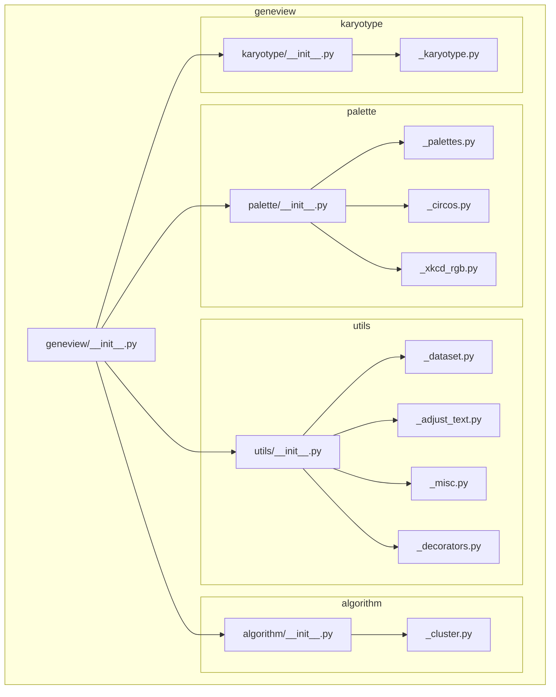
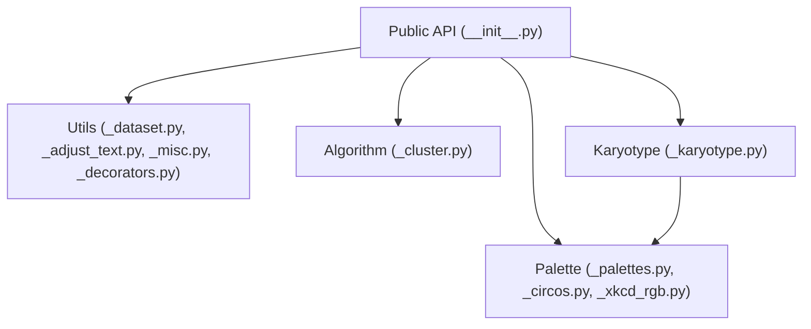
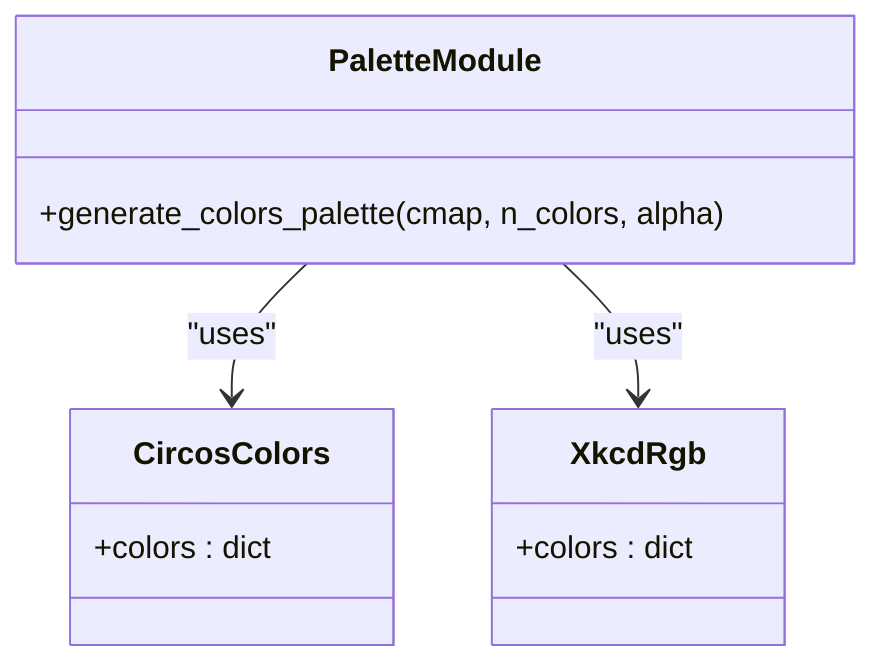
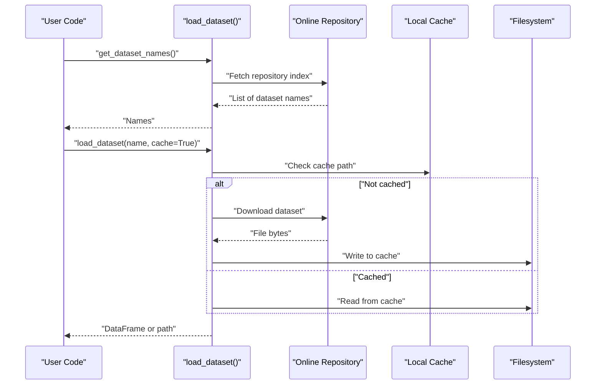
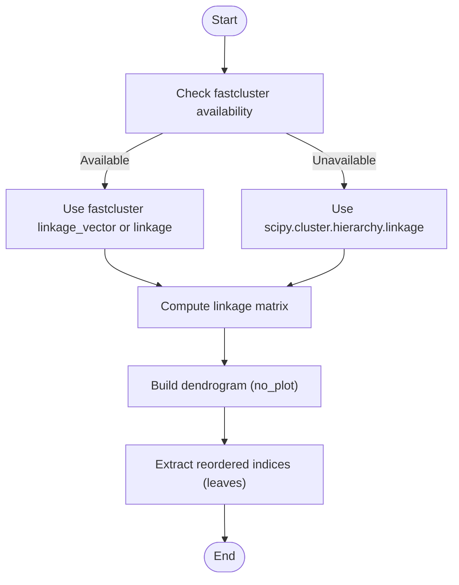
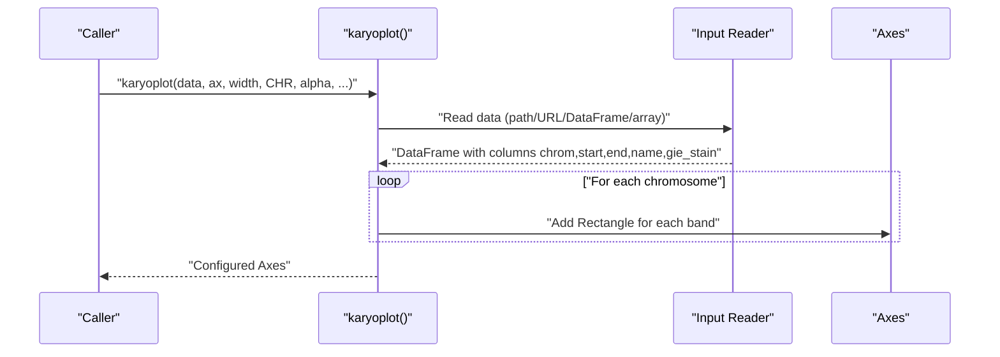
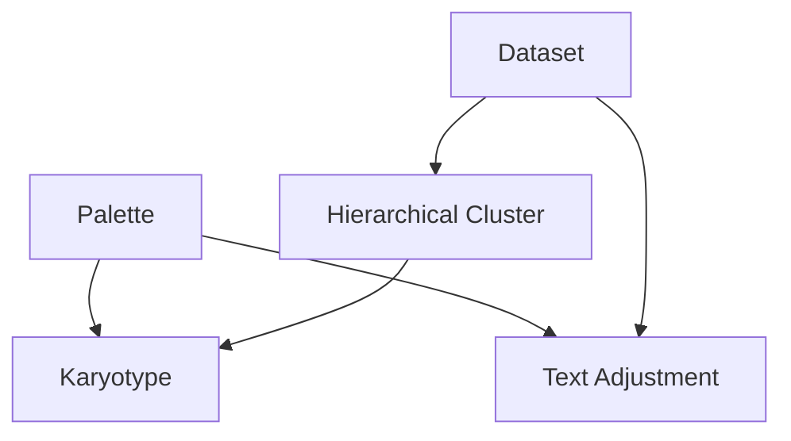
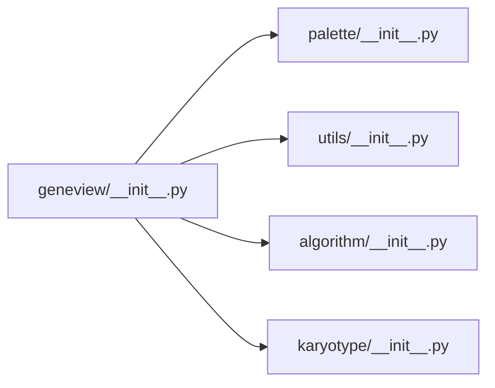

# Visualization Infrastructure

<cite>
**Referenced Files in This Document**
- [__init__.py](file://geneview/__init__.py)
- [palette/__init__.py](file://geneview/palette/__init__.py)
- [_palettes.py](file://geneview/palette/_palettes.py)
- [_circos.py](file://geneview/palette/_circos.py)
- [_xkcd_rgb.py](file://geneview/palette/_xkcd_rgb.py)
- [utils/__init__.py](file://geneview/utils/__init__.py)
- [_dataset.py](file://geneview/utils/_dataset.py)
- [_adjust_text.py](file://geneview/utils/_adjust_text.py)
- [_misc.py](file://geneview/utils/_misc.py)
- [_decorators.py](file://geneview/utils/_decorators.py)
- [algorithm/__init__.py](file://geneview/algorithm/__init__.py)
- [_cluster.py](file://geneview/algorithm/_cluster.py)
- [karyotype/__init__.py](file://geneview/karyotype/__init__.py)
- [_karyotype.py](file://geneview/karyotype/_karyotype.py)
</cite>

## Table of Contents
1. [Introduction](#introduction)
2. [Project Structure](#project-structure)
3. [Core Components](#core-components)
4. [Architecture Overview](#architecture-overview)
5. [Detailed Component Analysis](#detailed-component-analysis)
6. [Dependency Analysis](#dependency-analysis)
7. [Performance Considerations](#performance-considerations)
8. [Troubleshooting Guide](#troubleshooting-guide)
9. [Conclusion](#conclusion)
10. [Appendices](#appendices)

## Introduction
This document describes the Visualization Infrastructure that underpins all GeneView visualizations. It focuses on:
- Color palette management: built-in palette generation, Circos color scheme integration, XKCD RGB mappings, and theme consistency
- Dataset loading: online repository integration, local caching, format standardization
- Algorithmic support: hierarchical clustering for sample ordering, statistical computation backends, and text adjustment utilities
- Karyotype visualization: chromosome ideogram plotting with standardized color schemes
- Practical workflows and extensibility patterns for building robust, scalable visualizations

## Project Structure
GeneView organizes its infrastructure into focused packages:
- Palette management: color generation, Circos color maps, XKCD color names
- Utilities: dataset loading, text adjustment, helpers, and decorators
- Algorithmic support: hierarchical clustering
- Karyotype: ideogram plotting with standardized color schemes
- Public API: top-level imports for convenient access

**Diagram sources**
- [__init__.py:1-15](file://geneview/__init__.py#L1-L15)
- [palette/__init__.py:1-10](file://geneview/palette/__init__.py#L1-L10)
- [utils/__init__.py:1-20](file://geneview/utils/__init__.py#L1-L20)
- [algorithm/__init__.py:1-1](file://geneview/algorithm/__init__.py#L1-L1)
- [karyotype/__init__.py:1-2](file://geneview/karyotype/__init__.py#L1-L2)

**Section sources**
- [__init__.py:1-15](file://geneview/__init__.py#L1-L15)
- [palette/__init__.py:1-10](file://geneview/palette/__init__.py#L1-L10)
- [utils/__init__.py:1-20](file://geneview/utils/__init__.py#L1-L20)
- [algorithm/__init__.py:1-1](file://geneview/algorithm/__init__.py#L1-L1)
- [karyotype/__init__.py:1-2](file://geneview/karyotype/__init__.py#L1-L2)

## Core Components
- Palette management
  - Built-in palette generator: generates discrete color lists from matplotlib colormaps or accepts explicit color lists
  - Circos color scheme: comprehensive ideogram and band color definitions
  - XKCD RGB mappings: named color dictionaries for human-friendly color selection
- Dataset loading
  - Online repository integration: discovers available datasets and fetches CSV or raw files
  - Local caching: stores datasets under a configurable directory with environment override
  - Format standardization: ensures trailing empty rows are removed for CSV data
- Text adjustment utilities
  - Automatic text placement to reduce overlaps with points, other texts, and additional objects
  - Iterative repulsion and alignment with convergence control and optional arrow linking
- Hierarchical clustering
  - Agglomerative clustering with flexible linkage methods and metrics
  - Optional fastcluster acceleration and fallback to scipy.cluster
- Karyotype visualization
  - Ideogram plotting from tabular data or URLs, with standardized Circos color mapping

**Section sources**
- [_palettes.py:1-13](file://geneview/palette/_palettes.py#L1-L13)
- [_circos.py:1-236](file://geneview/palette/_circos.py#L1-L236)
- [_xkcd_rgb.py:1-951](file://geneview/palette/_xkcd_rgb.py#L1-L951)
- [_dataset.py:1-88](file://geneview/utils/_dataset.py#L1-L88)
- [_adjust_text.py:1-759](file://geneview/utils/_adjust_text.py#L1-L759)
- [_cluster.py:1-147](file://geneview/algorithm/_cluster.py#L1-L147)
- [_karyotype.py:1-110](file://geneview/karyotype/_karyotype.py#L1-L110)

## Architecture Overview
The infrastructure integrates palette, dataset, algorithm, and karyotype modules behind a unified public API. The palette module centralizes color definitions and generation, while the utils module provides dataset and text utilities. The algorithm module supplies clustering primitives, and karyotype builds on palette definitions for ideogram rendering.

**Diagram sources**
- [__init__.py:1-15](file://geneview/__init__.py#L1-L15)
- [_palettes.py:1-13](file://geneview/palette/_palettes.py#L1-L13)
- [_circos.py:1-236](file://geneview/palette/_circos.py#L1-L236)
- [_xkcd_rgb.py:1-951](file://geneview/palette/_xkcd_rgb.py#L1-L951)
- [_dataset.py:1-88](file://geneview/utils/_dataset.py#L1-L88)
- [_adjust_text.py:1-759](file://geneview/utils/_adjust_text.py#L1-L759)
- [_cluster.py:1-147](file://geneview/algorithm/_cluster.py#L1-L147)
- [_karyotype.py:1-110](file://geneview/karyotype/_karyotype.py#L1-L110)

## Detailed Component Analysis

### Palette Management System
- Built-in palette generation
  - Accepts either a matplotlib colormap name or a list of colors
  - Produces normalized RGBA arrays with adjustable alpha
- Circos color scheme integration
  - Provides named colors for ideograms, cytogenetic bands, UCSC chromosome palette, and methylation levels
  - Used by karyotype plotting to map staining terms to colors
- XKCD RGB mappings
  - Human-friendly color names mapped to hex values
  - Useful for quick theme prototyping and consistent labeling

**Diagram sources**
- [_palettes.py:1-13](file://geneview/palette/_palettes.py#L1-L13)
- [_circos.py:1-236](file://geneview/palette/_circos.py#L1-L236)
- [_xkcd_rgb.py:1-951](file://geneview/palette/_xkcd_rgb.py#L1-L951)

Practical examples
- Palette customization
  - Use the palette generator to produce a discrete palette from a named colormap or supply a custom color list
  - Reference Circos color names for ideogram consistency across karyotypes
  - Select XKCD color names for thematic coherence in population or ancestry plots
- Theme consistency
  - Centralize color choices via palette functions and shared color dicts to maintain uniformity across visualizations

**Section sources**
- [_palettes.py:1-13](file://geneview/palette/_palettes.py#L1-L13)
- [_circos.py:1-236](file://geneview/palette/_circos.py#L1-L236)
- [_xkcd_rgb.py:1-951](file://geneview/palette/_xkcd_rgb.py#L1-L951)

### Dataset Loading System
- Online repository integration
  - Discovers available datasets by parsing the repository index
  - Fetches CSV or raw files from the remote repository
- Local data handling
  - Configurable cache directory with environment variable override
  - Ensures dataset availability offline after first retrieval
- Format standardization
  - Removes trailing all-null rows for CSV datasets
- Caching mechanisms
  - Uses a dedicated cache directory with lazy creation

**Diagram sources**
- [_dataset.py:1-88](file://geneview/utils/_dataset.py#L1-L88)

Practical examples
- Dataset preprocessing workflows
  - Retrieve dataset names, then load a specific dataset with caching enabled
  - Use the returned path for non-CSV formats or DataFrame for CSV
  - Apply standardization logic (e.g., drop trailing null rows) before plotting

**Section sources**
- [_dataset.py:1-88](file://geneview/utils/_dataset.py#L1-L88)

### Algorithmic Support Infrastructure
- Hierarchical clustering for sample ordering
  - Agglomerative clustering with configurable linkage and distance metric
  - Supports row/column clustering and leverages fastcluster when available
  - Returns reordered indices suitable for heatmaps and dendrograms
- Statistical computation backends
  - scipy.cluster.hierarchy as primary backend
  - fastcluster as optional accelerated backend for specific methods/metrics
- Text adjustment utilities
  - Iterative repulsion of texts from points, other texts, and additional objects
  - Automatic alignment and convergence control with optional arrow linking

**Diagram sources**
- [_cluster.py:1-147](file://geneview/algorithm/_cluster.py#L1-L147)

**Section sources**
- [_cluster.py:1-147](file://geneview/algorithm/_cluster.py#L1-L147)
- [_adjust_text.py:1-759](file://geneview/utils/_adjust_text.py#L1-L759)

### Karyotype Visualization Capabilities
- Ideogram plotting
  - Accepts file path, URL, DataFrame, or array-like input
  - Sorts chromosomes in biological order and renders bands as rectangles
  - Uses Circos color mapping for gie_stain values or a default color for missing entries
- Standardized color scheme
  - Integrates Circos color definitions for consistent ideogram appearance

**Diagram sources**
- [_karyotype.py:1-110](file://geneview/karyotype/_karyotype.py#L1-L110)
- [_circos.py:1-236](file://geneview/palette/_circos.py#L1-L236)

**Section sources**
- [_karyotype.py:1-110](file://geneview/karyotype/_karyotype.py#L1-L110)
- [_circos.py:1-236](file://geneview/palette/_circos.py#L1-L236)

### Conceptual Overview
- Palette customization
  - Choose a colormap or explicit color list; adjust alpha for transparency
  - Map categorical labels to Circos colors for ideograms
  - Use XKCD names for intuitive color selection
- Dataset preprocessing
  - Discover available datasets, cache locally, and standardize CSV format
- Algorithm parameter optimization
  - Select linkage method and metric based on data characteristics
  - Prefer fastcluster for large matrices when available
- Infrastructure integration
  - Import from the public API for streamlined access
  - Combine palette, dataset, clustering, and karyotype components into cohesive workflows

[No sources needed since this diagram shows conceptual workflow, not actual code structure]

## Dependency Analysis
- Public API exports
  - Top-level imports expose palette utilities, dataset loaders, karyotype plotting, Venn utilities, and GWAS/population visualization functions
- Internal dependencies
  - Palette module depends on matplotlib for color conversion and ScalarMappable
  - Karyotype plotting depends on palette color dicts and matplotlib patches
  - Clustering depends on scipy.cluster.hierarchy with optional fastcluster fallback
  - Text adjustment relies on matplotlib transforms and path collections
  - Dataset loading depends on pandas and urllib for remote access and local caching

**Diagram sources**
- [__init__.py:1-15](file://geneview/__init__.py#L1-L15)
- [palette/__init__.py:1-10](file://geneview/palette/__init__.py#L1-L10)
- [utils/__init__.py:1-20](file://geneview/utils/__init__.py#L1-L20)
- [algorithm/__init__.py:1-1](file://geneview/algorithm/__init__.py#L1-L1)
- [karyotype/__init__.py:1-2](file://geneview/karyotype/__init__.py#L1-L2)

**Section sources**
- [__init__.py:1-15](file://geneview/__init__.py#L1-L15)
- [palette/__init__.py:1-10](file://geneview/palette/__init__.py#L1-L10)
- [utils/__init__.py:1-20](file://geneview/utils/__init__.py#L1-L20)
- [algorithm/__init__.py:1-1](file://geneview/algorithm/__init__.py#L1-L1)
- [karyotype/__init__.py:1-2](file://geneview/karyotype/__init__.py#L1-L2)

## Performance Considerations
- Memory management for large datasets
  - Use caching to avoid repeated network downloads and enable offline reuse
  - For clustering, fastcluster can reduce memory overhead for large matrices with supported methods/metrics
- Rendering efficiency
  - Minimize repeated text adjustments; call text adjustment utilities after finalizing axes limits
  - Limit the number of overlapping annotations and use convergence thresholds appropriately
- I/O optimization
  - Prefer local cache paths and avoid redundant reads by checking cache existence before download

[No sources needed since this section provides general guidance]

## Troubleshooting Guide
- Missing scipy
  - Hierarchical clustering raises a runtime error if scipy is not installed; install scipy or use fastcluster for acceleration
- Remote access failures
  - Ensure network connectivity and verify repository URLs; confirm cache directory permissions
- Text adjustment artifacts
  - Adjust expansion factors and convergence thresholds; disable point avoidance if extremely crowded
- Karyotype color mismatches
  - Confirm gie_stain values match Circos color keys; fallback color is applied for unknown stains

**Section sources**
- [_cluster.py:142-144](file://geneview/algorithm/_cluster.py#L142-L144)
- [_dataset.py:55-67](file://geneview/utils/_dataset.py#L55-L67)
- [_adjust_text.py:531-536](file://geneview/utils/_adjust_text.py#L531-L536)
- [_karyotype.py:94-96](file://geneview/karyotype/_karyotype.py#L94-L96)

## Conclusion
GeneView’s Visualization Infrastructure provides a cohesive foundation for color management, dataset handling, algorithmic support, and karyotype plotting. By leveraging centralized palettes, robust dataset caching, efficient clustering backends, and automatic text adjustment, developers can build consistent, scalable visualizations. Extensibility is achieved through modular components and a clean public API, enabling straightforward integration of new visualization types.

## Appendices
- Practical examples
  - Palette customization: generate discrete palettes from named colormaps or explicit color lists; integrate Circos and XKCD color names for theme consistency
  - Dataset preprocessing: discover datasets, load with caching, and standardize CSV format
  - Algorithm parameter optimization: choose linkage and metric based on data scale and structure; leverage fastcluster when available
  - Infrastructure integration: import from the public API and combine palette, dataset, clustering, and karyotype components into unified workflows

[No sources needed since this section aggregates previously analyzed content]