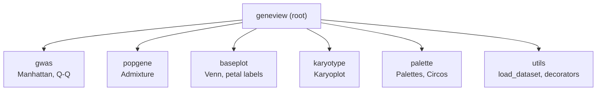
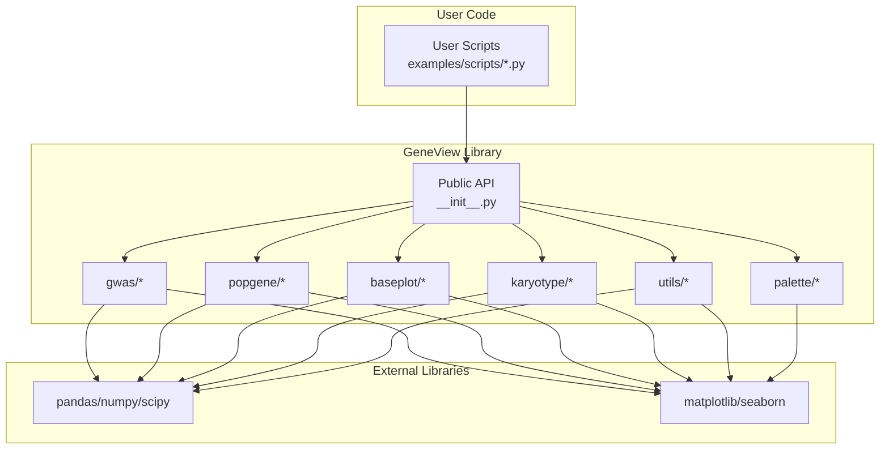
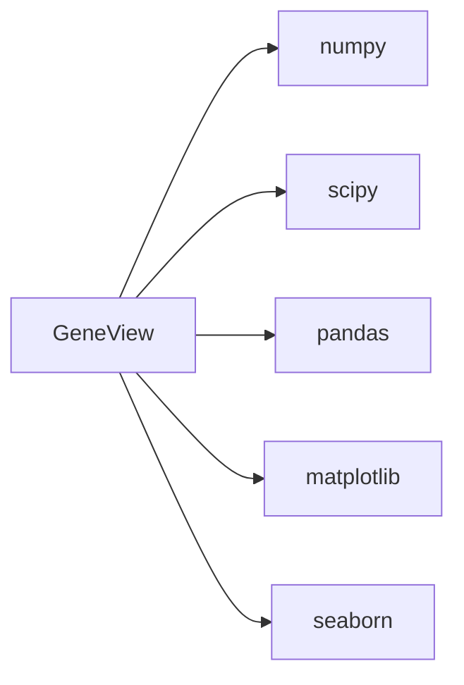

# Introduction

<cite>
**Referenced Files in This Document**
- [README.md](file://README.md)
- [setup.py](file://setup.py)
- [requirements.txt](file://requirements.txt)
- [geneview/__init__.py](file://geneview/__init__.py)
- [geneview/gwas/__init__.py](file://geneview/gwas/__init__.py)
- [geneview/popgene/__init__.py](file://geneview/popgene/__init__.py)
- [geneview/baseplot/__init__.py](file://geneview/baseplot/__init__.py)
- [geneview/karyotype/__init__.py](file://geneview/karyotype/__init__.py)
- [examples/scripts/manhattan.py](file://examples/scripts/manhattan.py)
- [examples/scripts/qq.py](file://examples/scripts/qq.py)
- [examples/scripts/admixture.py](file://examples/scripts/admixture.py)
</cite>

## Table of Contents
1. [Introduction](#introduction)
2. [Project Structure](#project-structure)
3. [Core Components](#core-components)
4. [Architecture Overview](#architecture-overview)
5. [Detailed Component Analysis](#detailed-component-analysis)
6. [Dependency Analysis](#dependency-analysis)
7. [Performance Considerations](#performance-considerations)
8. [Troubleshooting Guide](#troubleshooting-guide)
9. [Conclusion](#conclusion)

## Introduction
GeneView is a Python library designed specifically for creating attractive and informative genomics graphics. It is built on top of matplotlib and integrates tightly with the broader PyData ecosystem, including numpy and pandas data structures. The library’s primary purpose is to serve researchers and bioinformaticians who need to visualize complex genomics datasets with clarity and scientific rigor.

Why GeneView matters in genomics visualization:
- Genomic datasets are inherently multi-dimensional and often require specialized plotting paradigms (e.g., Manhattan plots for genome-wide association studies, Q-Q plots for statistical distributions, admixture plots for population structure, and Venn diagrams for set comparisons).
- Traditional plotting approaches often fall short because they lack domain-specific defaults, standardized workflows, and high-level abstractions tailored to genomics data structures and visualization conventions.
- GeneView bridges this gap by offering high-level functions that streamline common genomics visualization tasks while preserving flexibility for customization.

Key characteristics of GeneView:
- Specialized plotting functions for genomics workflows: Manhattan plots, Q-Q plots, admixture plots, and Venn diagrams.
- High-level abstractions for structuring grids of plots, enabling researchers to compose complex visualizations efficiently.
- Seamless integration with pandas DataFrame and Series, leveraging the PyData stack for robust data handling.
- Designed for reproducibility and publication-ready quality with sensible defaults and typography choices.

Target audience:
- Researchers and bioinformaticians who work with GWAS results, population genetics data, comparative genomics, and functional genomics datasets.
- Users who need quick-to-implement, publication-quality visualizations without sacrificing control over aesthetics and layout.

**Section sources**
- [README.md:8-16](file://README.md#L8-L16)
- [README.md:324-340](file://README.md#L324-L340)
- [setup.py:9](file://setup.py#L9)
- [setup.py:44-50](file://setup.py#L44-L50)

## Project Structure
At a high level, GeneView organizes its functionality by domain and visualization type:
- gwas: GWAS-focused plotting functions (Manhattan plots, Q-Q plots).
- popgene: Population genetics plotting (admixture plots).
- baseplot: General-purpose plotting utilities (Venn diagrams and related helpers).
- karyotype: Karyotype visualization support.
- palette and utils: Palette management and dataset utilities.
- Root-level init: Public API exposure and global matplotlib configuration.

This structure aligns with common genomics visualization workflows, allowing users to import only what they need while still benefiting from shared utilities and consistent styling.

**Diagram sources**
- [geneview/__init__.py:3-8](file://geneview/__init__.py#L3-L8)
- [geneview/gwas/__init__.py:1-3](file://geneview/gwas/__init__.py#L1-L3)
- [geneview/popgene/__init__.py:1-2](file://geneview/popgene/__init__.py#L1-L2)
- [geneview/baseplot/__init__.py:1-2](file://geneview/baseplot/__init__.py#L1-L2)
- [geneview/karyotype/__init__.py:1-2](file://geneview/karyotype/__init__.py#L1-L2)

**Section sources**
- [README.md:18-27](file://README.md#L18-L27)
- [requirements.txt:1-6](file://requirements.txt#L1-L6)
- [setup.py:44-50](file://setup.py#L44-L50)

## Core Components
- Public API surface: The root init exposes key plotting functions and utilities, along with global matplotlib font configuration for publication-ready typography.
- Domain modules:
  - gwas: Provides manhattanplot and qqplot/qqnorm for GWAS visualization.
  - popgene: Provides admixtureplot for ancestry and population structure visualization.
  - baseplot: Provides venn and generate_petal_labels for set overlap visualization.
  - karyotype: Provides karyoplot for genome-wide ideogram-style displays.
- Utilities and palettes: Shared helpers for loading datasets and managing color palettes.

These components collectively enable a streamlined workflow where users can quickly produce domain-appropriate plots with minimal boilerplate.

**Section sources**
- [geneview/__init__.py:3-8](file://geneview/__init__.py#L3-L8)
- [geneview/gwas/__init__.py:1-3](file://geneview/gwas/__init__.py#L1-L3)
- [geneview/popgene/__init__.py:1-2](file://geneview/popgene/__init__.py#L1-L2)
- [geneview/baseplot/__init__.py:1-2](file://geneview/baseplot/__init__.py#L1-L2)
- [geneview/karyotype/__init__.py:1-2](file://geneview/karyotype/__init__.py#L1-L2)

## Architecture Overview
GeneView follows a layered architecture:
- Presentation layer: High-level plotting functions (e.g., manhattanplot, qqplot, admixtureplot, venn).
- Domain logic: Implementation of visualization-specific algorithms and rendering logic.
- Data integration: Tight coupling with pandas for data ingestion and manipulation, plus numpy/scipy for numerical operations.
- Rendering backend: matplotlib for plotting primitives and layout composition.
- Utility layer: Shared helpers for dataset loading, palette management, and text adjustments.

This design ensures that domain-specific visualizations remain cohesive while leveraging the broader PyData ecosystem for performance and interoperability.

**Diagram sources**
- [geneview/__init__.py:3-8](file://geneview/__init__.py#L3-L8)
- [setup.py:44-50](file://setup.py#L44-L50)
- [requirements.txt:1-6](file://requirements.txt#L1-L6)
- [examples/scripts/manhattan.py:1-14](file://examples/scripts/manhattan.py#L1-L14)
- [examples/scripts/qq.py:1-9](file://examples/scripts/qq.py#L1-L9)
- [examples/scripts/admixture.py:1-28](file://examples/scripts/admixture.py#L1-L28)

## Detailed Component Analysis

### Why Traditional Approaches Fall Short for Genomics
Traditional plotting libraries offer powerful primitives but often require extensive boilerplate to achieve publication-ready genomics visualizations:
- GWAS Manhattan plots require careful handling of chromosome labeling, alternating colors, significance thresholds, and SNP annotations—tasks that vary across studies and are error-prone when implemented ad-hoc.
- Q-Q plots demand precise computation of expected vs observed distributions and appropriate axis scaling/logarithmic transformations.
- Population genetics admixture plots involve stacked bars, population ordering, and color palettes that must be consistent across samples and groups.
- Venn diagrams for overlapping sets require careful computation of intersections and manual placement of labels to avoid clutter.

GeneView addresses these challenges by:
- Providing high-level functions with sensible defaults tailored to genomics workflows.
- Encapsulating domain-specific logic (e.g., chromosome sorting, significance thresholds, palette selection) behind simple APIs.
- Maintaining flexibility for customization through keyword arguments and matplotlib axes integration.

**Section sources**
- [README.md:30-138](file://README.md#L30-L138)
- [README.md:187-226](file://README.md#L187-L226)
- [README.md:229-273](file://README.md#L229-L273)
- [README.md:276-322](file://README.md#L276-L322)

### Example Workflows Demonstrated in the Repository
- Manhattan plot: A minimal example shows how to plot GWAS results with rotated x-axis labels and custom layout.
- Q-Q plot: A minimal example demonstrates plotting distributional agreement for P-values.
- Admixture plot: An example illustrates population structure visualization with custom population ordering and styling.

These examples illustrate the library’s philosophy of combining high-level convenience with low-level control.

**Section sources**
- [examples/scripts/manhattan.py:1-14](file://examples/scripts/manhattan.py#L1-L14)
- [examples/scripts/qq.py:1-9](file://examples/scripts/qq.py#L1-L9)
- [examples/scripts/admixture.py:1-28](file://examples/scripts/admixture.py#L1-L28)

## Dependency Analysis
GeneView depends on a core set of scientific Python libraries:
- numpy: Numerical computing foundation.
- scipy: Statistical functions and distributions.
- pandas: Data structures and operations for genomics datasets.
- matplotlib: Plotting primitives and layout.
- seaborn: Enhanced statistical plotting styles and color palettes.

These dependencies reflect the library’s commitment to the PyData ecosystem and ensure compatibility with common genomics workflows.

**Diagram sources**
- [setup.py:44-50](file://setup.py#L44-L50)
- [requirements.txt:1-6](file://requirements.txt#L1-L6)

**Section sources**
- [setup.py:44-50](file://setup.py#L44-L50)
- [requirements.txt:1-6](file://requirements.txt#L1-L6)

## Performance Considerations
- Efficient data handling: By relying on pandas DataFrames and Series, GeneView benefits from vectorized operations and optimized memory usage.
- Plotting efficiency: Matplotlib is used directly for rendering, ensuring fast generation of static images suitable for reports and publications.
- Practical tips:
  - Prefer passing pre-filtered or summarized datasets to reduce rendering overhead.
  - Use tight layouts and appropriate figure sizes to balance readability and file size.
  - Leverage shared palette utilities to minimize repeated computations.

[No sources needed since this section provides general guidance]

## Troubleshooting Guide
Common issues and resolutions:
- Font rendering in PDFs: GeneView sets font type 42 globally to improve PDF font embedding; ensure your environment supports this setting.
- Dataset loading: Use the provided dataset loader to ensure correct column names and data types for genomics plots.
- Layout and labels: Adjust rotation and alignment of tick labels to prevent overlap, especially for chromosome or population labels.

**Section sources**
- [geneview/__init__.py:11-15](file://geneview/__init__.py#L11-L15)
- [README.md:324-340](file://README.md#L324-L340)

## Conclusion
GeneView fills a critical gap in genomics data visualization by combining domain-specific functionality with the power of the PyData stack. Its high-level abstractions enable researchers to produce publication-ready plots quickly, while its modular architecture preserves the flexibility needed for custom visualizations. Whether you are exploring GWAS signals, assessing population structure, or comparing genomic sets, GeneView offers a focused toolkit that respects the unique demands of genomics workflows.

[No sources needed since this section summarizes without analyzing specific files]