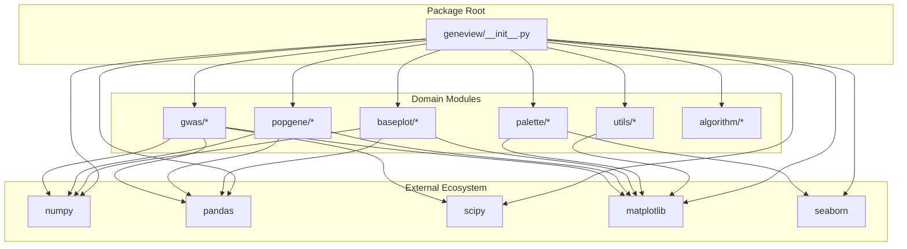
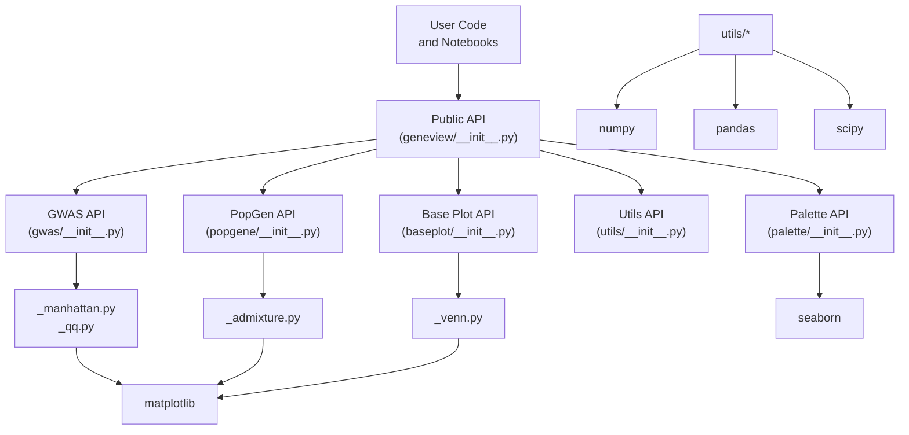
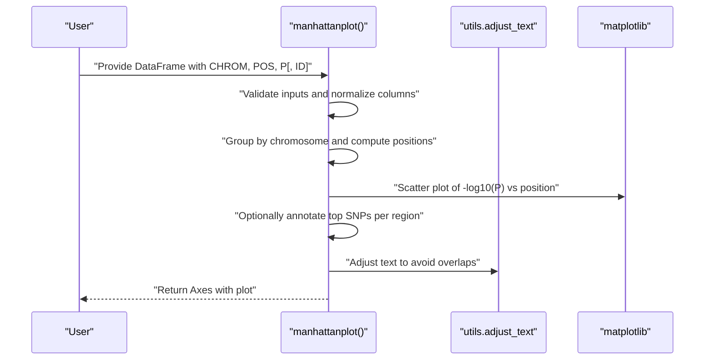
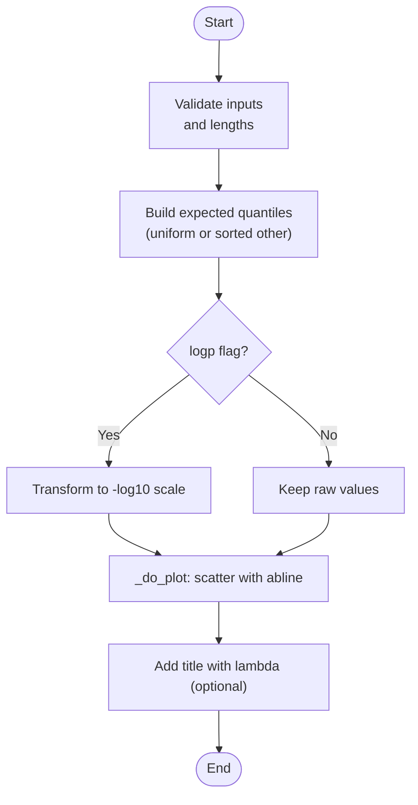
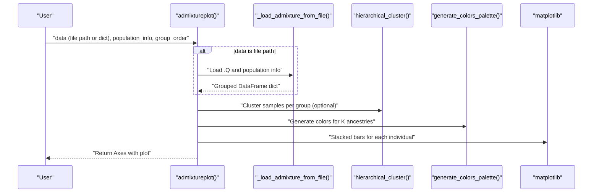
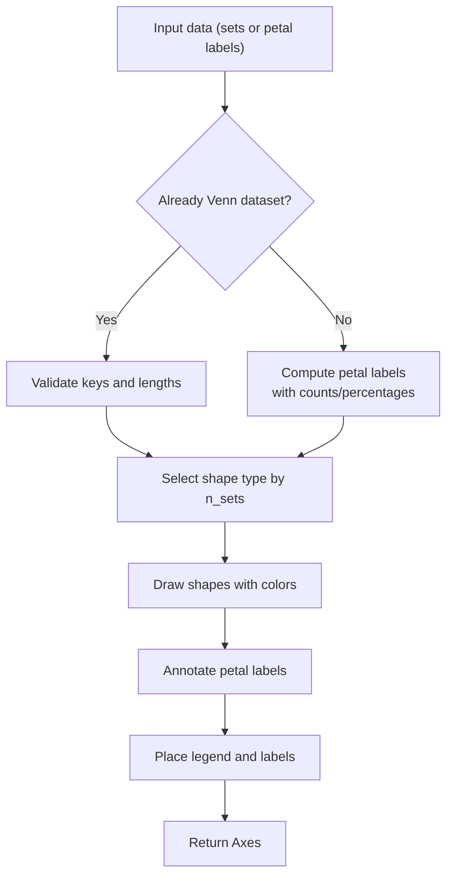
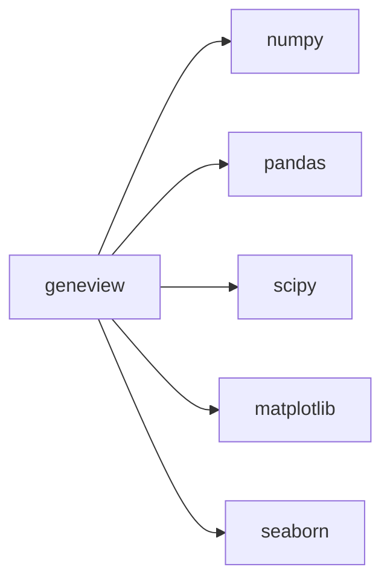

# Project Overview

<cite>
**Referenced Files in This Document**
- [README.md](file://README.md)
- [setup.py](file://setup.py)
- [requirements.txt](file://requirements.txt)
- [geneview/__init__.py](file://geneview/__init__.py)
- [docs/tutorial/README.md](file://docs/tutorial/README.md)
- [geneview/gwas/__init__.py](file://geneview/gwas/__init__.py)
- [geneview/gwas/_manhattan.py](file://geneview/gwas/_manhattan.py)
- [geneview/gwas/_qq.py](file://geneview/gwas/_qq.py)
- [geneview/popgene/__init__.py](file://geneview/popgene/__init__.py)
- [geneview/popgene/_admixture.py](file://geneview/popgene/_admixture.py)
- [geneview/baseplot/__init__.py](file://geneview/baseplot/__init__.py)
- [geneview/baseplot/_venn.py](file://geneview/baseplot/_venn.py)
- [geneview/palette/__init__.py](file://geneview/palette/__init__.py)
- [geneview/utils/__init__.py](file://geneview/utils/__init__.py)
- [examples/scripts/manhattan.py](file://examples/scripts/manhattan.py)
</cite>

## Table of Contents
1. [Introduction](#introduction)
2. [Project Structure](#project-structure)
3. [Core Components](#core-components)
4. [Architecture Overview](#architecture-overview)
5. [Detailed Component Analysis](#detailed-component-analysis)
6. [Dependency Analysis](#dependency-analysis)
7. [Performance Considerations](#performance-considerations)
8. [Troubleshooting Guide](#troubleshooting-guide)
9. [Conclusion](#conclusion)
10. [Appendices](#appendices)

## Introduction
GeneView is a Python library designed to produce attractive and informative genomics graphics. Built on matplotlib and tightly integrated with the broader PyData ecosystem (NumPy, pandas, SciPy, Seaborn), it provides high-level, reusable plotting functions tailored for common genomics visualization tasks. The library emphasizes usability for newcomers to genomics visualization while offering flexible customization for advanced users.

Key target audiences:
- Beginners: Quickly generate standard plots (Manhattan, Q-Q, admixture, Venn) with sensible defaults and minimal code.
- Experienced developers: Leverage modular components, extensible APIs, and tight integration with scientific Python libraries for reproducible, publication-ready figures.

## Project Structure
GeneView organizes functionality by domain and reuse potential:
- Top-level package exports in the package initializer
- Domain-specific subpackages:
  - gwas: GWAS-focused plots (Manhattan, Q-Q)
  - popgene: Population genetics plots (Admixture)
  - baseplot: General-purpose plots (Venn)
  - palette: Color utilities and palettes
  - utils: Utilities for datasets, decorators, and helpers
  - algorithm: Lightweight algorithms (e.g., clustering)
- Examples and tutorials demonstrate usage and best practices

**Diagram sources**
- [geneview/__init__.py:1-15](file://geneview/__init__.py#L1-L15)
- [setup.py:44-50](file://setup.py#L44-L50)

**Section sources**
- [README.md:1-344](file://README.md#L1-L344)
- [setup.py:1-65](file://setup.py#L1-L65)
- [requirements.txt:1-6](file://requirements.txt#L1-L6)

## Core Components
GeneView exposes a concise public API via the package initializer, aggregating domain-specific plotting functions and utilities. The primary capabilities include:

- GWAS plots
  - Manhattan plot: Chromosome vs. -log10(P) with significance thresholds, optional top SNP annotation, and customizable styling
  - Q-Q plot: Observed vs. expected -log10(P) with optional comparison against another dataset or normal distribution
- Population genetics
  - Admixture plot: Barplot of ancestry proportions across individuals and subpopulations with optional hierarchical clustering and sampling
- General-purpose visualization
  - Venn diagrams: Support for 2–6 sets with automatic petal labeling and color palettes
- Utilities and palette
  - Dataset loading helpers
  - Color palette generation and palette utilities

Practical examples:
- Manhattan plot with rotation and custom thresholds
- Q-Q plot with custom labels and styling
- Admixture plot with group ordering and sampling
- Venn diagram with custom petal labels and legend

**Section sources**
- [README.md:30-323](file://README.md#L30-L323)
- [geneview/__init__.py:1-15](file://geneview/__init__.py#L1-L15)
- [geneview/gwas/__init__.py:1-3](file://geneview/gwas/__init__.py#L1-L3)
- [geneview/popgene/__init__.py:1-2](file://geneview/popgene/__init__.py#L1-L2)
- [geneview/baseplot/__init__.py:1-2](file://geneview/baseplot/__init__.py#L1-L2)

## Architecture Overview
At a high level, GeneView follows a layered architecture:
- Public API surface: Centralized in the package initializer, exposing convenience functions for common tasks
- Domain modules: Specialized plotting logic organized by biological domain
- Utility and palette modules: Shared helpers for data handling, color generation, and lightweight algorithms
- External dependencies: Tight integration with NumPy, pandas, SciPy, matplotlib, and Seaborn

**Diagram sources**
- [geneview/__init__.py:1-15](file://geneview/__init__.py#L1-L15)
- [geneview/gwas/__init__.py:1-3](file://geneview/gwas/__init__.py#L1-L3)
- [geneview/popgene/__init__.py:1-2](file://geneview/popgene/__init__.py#L1-L2)
- [geneview/baseplot/__init__.py:1-2](file://geneview/baseplot/__init__.py#L1-L2)
- [geneview/utils/__init__.py:1-20](file://geneview/utils/__init__.py#L1-L20)
- [geneview/palette/__init__.py:1-10](file://geneview/palette/__init__.py#L1-L10)

## Detailed Component Analysis

### GWAS Manhattan Plot
The Manhattan plot function creates chromosome-wise association signals, supporting:
- Standard multi-chromosome layout with alternating colors and chromosome ticks
- Single-chromosome zoom mode with genomic position on the x-axis
- Significance thresholds (suggestive and genome-wide) and optional horizontal line customization
- Highlighting significant SNPs and annotating the top SNP per linkage disequilibrium region
- Flexible styling via matplotlib parameters

**Diagram sources**
- [geneview/gwas/_manhattan.py:20-335](file://geneview/gwas/_manhattan.py#L20-L335)

**Section sources**
- [geneview/gwas/_manhattan.py:20-335](file://geneview/gwas/_manhattan.py#L20-L335)
- [README.md:30-138](file://README.md#L30-L138)

### Q-Q Plot
The Q-Q plot compares observed -log10(P) values to expected distributions:
- Compare against uniform distribution (default) or another dataset
- Optional comparison against the normal distribution
- Automatic lambda estimation for genomic inflation
- Customizable styling and axis labels

**Diagram sources**
- [geneview/gwas/_qq.py:62-212](file://geneview/gwas/_qq.py#L62-L212)

**Section sources**
- [geneview/gwas/_qq.py:62-212](file://geneview/gwas/_qq.py#L62-L212)
- [README.md:187-226](file://README.md#L187-L226)

### Population Genetics Admixture Plot
The admixture plot displays ancestry proportions across individuals and subpopulations:
- Accepts either a file path to ADMIXTURE .Q output plus a population info file, or a grouped dictionary
- Optional hierarchical clustering to reorder samples within groups
- Sampling per group to reduce density
- Customizable palette, group order, and tick label placement

**Diagram sources**
- [geneview/popgene/_admixture.py:168-363](file://geneview/popgene/_admixture.py#L168-L363)

**Section sources**
- [geneview/popgene/_admixture.py:168-363](file://geneview/popgene/_admixture.py#L168-L363)
- [README.md:229-273](file://README.md#L229-L273)

### Venn Diagrams
The Venn diagram supports 2–6 sets with automatic petal labeling and color palettes:
- Accepts either raw sets or precomputed petal labels
- Generates petal labels with counts and percentages
- Supports ellipse-based shapes for 2–5 sets and triangle-based for 6 sets
- Configurable legend and label colors

**Diagram sources**
- [geneview/baseplot/_venn.py:437-584](file://geneview/baseplot/_venn.py#L437-L584)

**Section sources**
- [geneview/baseplot/_venn.py:437-584](file://geneview/baseplot/_venn.py#L437-L584)
- [README.md:276-322](file://README.md#L276-L322)

### Palette and Utilities
- Palette module provides color generation and palettes for consistent, publication-grade visuals
- Utils module includes dataset loaders, numeric checks, text adjustment, and decorator utilities

**Section sources**
- [geneview/palette/__init__.py:1-10](file://geneview/palette/__init__.py#L1-L10)
- [geneview/utils/__init__.py:1-20](file://geneview/utils/__init__.py#L1-L20)

## Dependency Analysis
GeneView’s runtime dependencies are declared in both setup metadata and requirements:
- Core: numpy, scipy, pandas, matplotlib
- Optional enhancements: seaborn for color palettes and extended styling
- The package initializer configures matplotlib defaults for scalable fonts and rendering quality

**Diagram sources**
- [setup.py:44-50](file://setup.py#L44-L50)
- [requirements.txt:1-6](file://requirements.txt#L1-L6)
- [geneview/__init__.py:11-15](file://geneview/__init__.py#L11-L15)

**Section sources**
- [setup.py:44-50](file://setup.py#L44-L50)
- [requirements.txt:1-6](file://requirements.txt#L1-L6)
- [geneview/__init__.py:11-15](file://geneview/__init__.py#L11-L15)

## Performance Considerations
- Vectorized operations: Heavy reliance on pandas and numpy ensures efficient data handling for large-scale GWAS datasets
- Plotting efficiency: Matplotlib-backed rendering with minimal overhead; consider adjusting figure sizes and marker styles for dense datasets
- Text annotation: Use text adjustment utilities judiciously to avoid excessive recomputation in crowded plots
- Data preprocessing: Pre-filter or subsample large admixture or Venn datasets to improve readability and performance

[No sources needed since this section provides general guidance]

## Troubleshooting Guide
Common issues and resolutions:
- Input validation errors: Ensure required columns are present and of correct types (chromosome, position, p-value)
- Mixed single/multi-chromosome modes: Do not set both single-chromosome selection and custom x-tick sets simultaneously
- Admixture data mismatches: Verify that population info matches the number of rows in the admixture file
- Venn data format: When passing precomputed petal labels, confirm binary keys and consistent set counts
- Font rendering: The package sets vectorized font types by default; export to vector formats for print-quality figures

**Section sources**
- [geneview/gwas/_manhattan.py:209-222](file://geneview/gwas/_manhattan.py#L209-L222)
- [geneview/popgene/_admixture.py:146-148](file://geneview/popgene/_admixture.py#L146-L148)
- [geneview/baseplot/_venn.py:220-231](file://geneview/baseplot/_venn.py#L220-L231)
- [geneview/__init__.py:11-15](file://geneview/__init__.py#L11-L15)

## Conclusion
GeneView streamlines genomics visualization by combining domain-focused plotting functions with the robust scientific Python stack. Its modular architecture, clear APIs, and sensible defaults make it suitable for quick exploratory analyses and reproducible publication graphics. By leveraging pandas for data handling, numpy/scipy for computation, and matplotlib for rendering, GeneView fits naturally into modern bioinformatics workflows.

[No sources needed since this section summarizes without analyzing specific files]

## Appendices

### Getting Started with Tutorials
- Install Jupyter and configure a kernel for the environment to run interactive tutorials
- Explore tutorial notebooks for Manhattan, Q-Q, admixture, and Venn plots

**Section sources**
- [docs/tutorial/README.md:1-8](file://docs/tutorial/README.md#L1-L8)

### Example: Minimal Manhattan Plot
- Load a GWAS dataset and render a Manhattan plot with rotated x-axis labels and custom horizontal lines

**Section sources**
- [examples/scripts/manhattan.py:1-14](file://examples/scripts/manhattan.py#L1-L14)
- [README.md:30-138](file://README.md#L30-L138)