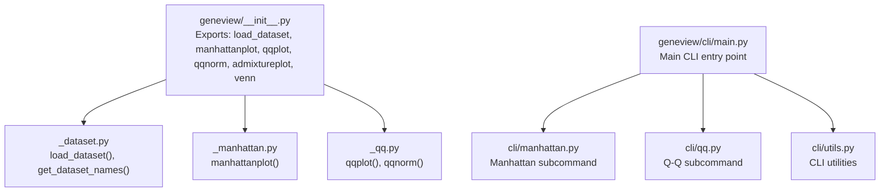
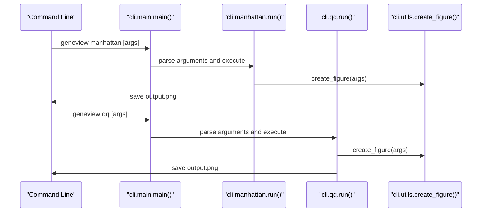
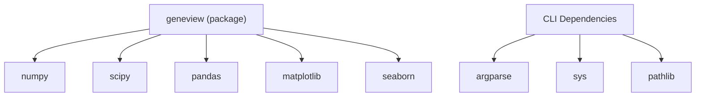

# Quick Start Guide

<cite>
**Referenced Files in This Document**
- [README.md](file://README.md)
- [__init__.py](file://geneview/__init__.py)
- [_dataset.py](file://geneview/utils/_dataset.py)
- [_manhattan.py](file://geneview/gwas/_manhattan.py)
- [_qq.py](file://geneview/gwas/_qq.py)
- [manhattan.py](file://examples/scripts/manhattan.py)
- [qq.py](file://examples/scripts/qq.py)
- [setup.py](file://setup.py)
- [cli/main.py](file://geneview/cli/main.py)
- [cli/manhattan.py](file://geneview/cli/manhattan.py)
- [cli/qq.py](file://geneview/cli/qq.py)
- [cli/utils.py](file://geneview/cli/utils.py)
- [tests/test_cli.py](file://geneview/tests/test_cli.py)
</cite>

## Table of Contents
1. [Introduction](#introduction)
2. [Project Structure](#project-structure)
3. [Core Components](#core-components)
4. [Architecture Overview](#architecture-overview)
5. [Detailed Component Analysis](#detailed-component-analysis)
6. [Command-Line Interface Usage](#command-line-interface-usage)
7. [Dependency Analysis](#dependency-analysis)
8. [Performance Considerations](#performance-considerations)
9. [Troubleshooting Guide](#troubleshooting-guide)
10. [Conclusion](#conclusion)

## Introduction
This quick start guide helps you become productive quickly with GeneView's most common visualizations: Manhattan plots and Q-Q plots for GWAS data. You will learn both Python API and command-line workflows to:
- Import the package and load a sample dataset
- Create a basic Manhattan plot and a basic Q-Q plot
- Customize colors, markers, labels, and figure sizes
- Save high-quality figures for reports and publications
- Interpret the outputs and apply common modifications like rotated x-axis labels and titles

**Updated** Added comprehensive command-line interface (CLI) usage examples alongside Python API workflows.

## Project Structure
GeneView organizes functionality by domain:
- gwas: Manhattan and Q-Q plotting functions
- utils: dataset utilities (loading sample data)
- palette: color palettes
- baseplot: generic plotting helpers (e.g., Venn)
- popgene: admixture plots
- karyotype: karyotype plots
- cli: command-line interface with subcommands for automated workflows



**Diagram sources**
- [__init__.py:1-15](file://geneview/__init__.py#L1-L15)
- [cli/main.py:1-53](file://geneview/cli/main.py#L1-L53)
- [cli/manhattan.py](file://geneview/cli/manhattan.py)
- [cli/qq.py](file://geneview/cli/qq.py)
- [cli/utils.py:46-90](file://geneview/cli/utils.py#L46-L90)
- [_dataset.py:22-67](file://geneview/utils/_dataset.py#L22-L67)
- [_manhattan.py:21-27](file://geneview/gwas/_manhattan.py#L21-L27)
- [_qq.py:62-110](file://geneview/gwas/_qq.py#L62-L110)

**Section sources**
- [README.md:1-30](file://README.md#L1-L30)
- [__init__.py:1-15](file://geneview/__init__.py#L1-L15)
- [cli/main.py:1-53](file://geneview/cli/main.py#L1-L53)

## Core Components
- Loading sample datasets: use load_dataset() to fetch example data from the online repository. The "gwas" dataset includes columns such as chromosome, position, and P-value.
- Manhattan plot: manhattanplot() renders genome-wide association results with optional significance thresholds, top-SNP annotation, and chromosome positioning.
- Q-Q plot: qqplot() compares observed versus expected P-value distributions and computes the genomic inflation factor λ.
- CLI subcommands: geneview manhattan and geneview qq provide automated command-line workflows for batch processing.

Key entry points and responsibilities:
- geneview/__init__.py exports load_dataset, manhattanplot, qqplot, qqnorm, admixtureplot, and venn.
- geneview/utils/_dataset.py provides load_dataset() and get_dataset_names().
- geneview/gwas/_manhattan.py implements manhattanplot() with extensive customization.
- geneview/gwas/_qq.py implements qqplot() and qqnorm().
- geneview/cli/main.py provides the main CLI entry point with subcommands.
- geneview/cli/manhattan.py implements the manhattan subcommand.
- geneview/cli/qq.py implements the qq subcommand.
- geneview/cli/utils.py provides CLI utilities for figure handling and argument parsing.

**Section sources**
- [__init__.py:3-8](file://geneview/__init__.py#L3-L8)
- [_dataset.py:22-67](file://geneview/utils/_dataset.py#L22-L67)
- [_manhattan.py:21-27](file://geneview/gwas/_manhattan.py#L21-L27)
- [_qq.py:62-110](file://geneview/gwas/_qq.py#L62-L110)
- [cli/main.py:28-53](file://geneview/cli/main.py#L28-L53)
- [cli/manhattan.py](file://geneview/cli/manhattan.py)
- [cli/qq.py](file://geneview/cli/qq.py)
- [cli/utils.py:46-90](file://geneview/cli/utils.py#L46-L90)

## Architecture Overview
The typical workflow has two pathways:
- Python API workflow: Import geneview and matplotlib → Load dataset via load_dataset("gwas") → Call manhattanplot() or qqplot() → Optionally customize axes, markers, colors, and thresholds → Save the figure using matplotlib's save routines
- Command-line workflow: Use geneview CLI subcommands → Provide input files and parameters → Generate plots automatically → Save output files

```mermaid
sequenceDiagram
participant User as "User Script"
participant GV as "geneview (__init__.py)"
participant DS as "utils._dataset.load_dataset()"
participant MP as "gwas._manhattan.manhattanplot()"
participant QQ as "gwas._qq.qqplot()"
User->>GV : import geneview as gv
User->>DS : df = gv.load_dataset("gwas")
User->>MP : ax = gv.manhattanplot(data=df)
User->>QQ : ax = gv.qqplot(data=df["P"])
User->>User : plt.savefig("output.pdf"); plt.show()
```



**Diagram sources**
- [__init__.py:3-8](file://geneview/__init__.py#L3-L8)
- [cli/main.py:28-53](file://geneview/cli/main.py#L28-L53)
- [cli/manhattan.py](file://geneview/cli/manhattan.py)
- [cli/qq.py](file://geneview/cli/qq.py)
- [cli/utils.py:84-90](file://geneview/cli/utils.py#L84-L90)

## Detailed Component Analysis

### Manhattan Plot Quick Start
Goal: produce a basic Manhattan plot and a customized version with rotated x-axis labels, custom colors, and a title.

Essential steps:
- Import geneview and matplotlib
- Load the sample dataset
- Call manhattanplot() with minimal parameters
- Rotate x-axis labels and add a title
- Save the figure

Minimal runnable example paths:
- Basic Manhattan plot: [examples/scripts/manhattan.py:1-14](file://examples/scripts/manhattan.py#L1-L14)
- README example (basic): [README.md:78-87](file://README.md#L78-L87)
- README example (rotated labels): [README.md:94-100](file://README.md#L94-L100)
- README example (turn off thresholds): [README.md:111-116](file://README.md#L111-L116)
- README example (single chromosome zoom): [README.md:125-128](file://README.md#L125-L128)
- README example (highlight significant SNPs and annotate top SNP): [README.md:137-142](file://README.md#L137-L142)
- README example (advanced customization): [README.md:157-196](file://README.md#L157-L196)

Key parameters and customization highlights:
- Data columns: expects chromosome, position, and P-value columns; defaults align with PLINK2.x output
- Colors and markers: color, marker, sign_marker_color, sign_marker_p
- Thresholds: suggestiveline and genomewideline; set to None to disable
- Labels and rotation: xlabel, ylabel, xticklabel_kws
- Single-chromosome view: CHR parameter; disables xtick_label_set
- Top SNP annotation: is_annotate_topsnp and ld_block_size
- Figure sizing and layout: pass ax from plt.subplots(figsize=...) and call plt.tight_layout()

Interpretation tips:
- Points below the genome-wide threshold indicate strong associations
- Rotated or shortened x-axis labels improve readability across chromosomes
- Top SNP annotation highlights the most significant variant per locus

Saving figures:
- Use matplotlib's save routines after generating the plot to export high-quality PDF/PNG/SVG.

**Section sources**
- [README.md:43-196](file://README.md#L43-L196)
- [manhattan.py:1-14](file://examples/scripts/manhattan.py#L1-L14)
- [_manhattan.py:21-125](file://geneview/gwas/_manhattan.py#L21-L125)

### Q-Q Plot Quick Start
Goal: produce a basic Q-Q plot and a customized version with labels and title.

Essential steps:
- Import geneview and matplotlib
- Load the sample dataset
- Call qqplot() with P-values
- Add labels and a title
- Save the figure

Minimal runnable example paths:
- Basic Q-Q plot: [examples/scripts/qq.py:1-9](file://examples/scripts/qq.py#L1-L9)
- README example (basic): [README.md:206-217](file://README.md#L206-L217)
- README example (advanced customization): [README.md:227-238](file://README.md#L227-L238)

Key parameters and customization highlights:
- Data: accepts a vector of P-values
- Log-transform: logp toggles -log10 scale for observed values
- Labels and title: xlabel, ylabel, title
- Abline: ablinecolor controls the reference line color (set to None to hide)
- Figure sizing: pass ax from plt.subplots(figsize=...)

Interpretation tips:
- Points near the diagonal indicate expected null distributions
- Deviations above the line suggest enrichment of small P-values (potential polygenic signals)
- The plot title includes the genomic inflation factor λ

Saving figures:
- Use matplotlib's save routines to export high-quality figures.

**Section sources**
- [README.md:200-238](file://README.md#L200-L238)
- [qq.py:1-9](file://examples/scripts/qq.py#L1-L9)
- [_qq.py:62-110](file://geneview/gwas/_qq.py#L62-L110)

### Dataset Loading
How to load sample datasets:
- Use load_dataset("gwas") to fetch a GWAS summary statistics dataset
- Optionally pass pandas.read_csv-compatible arguments via keyword arguments
- Control caching and local storage location via environment variables or parameters

Example path:
- [README.md:45-47](file://README.md#L45-L47)
- [README.md:41-48](file://README.md#L41-L48)
- [_dataset.py:22-67](file://geneview/utils/_dataset.py#L22-L67)

**Section sources**
- [README.md:41-48](file://README.md#L41-L48)
- [_dataset.py:22-67](file://geneview/utils/_dataset.py#L22-L67)

## Command-Line Interface Usage

**Updated** Added comprehensive command-line interface usage examples alongside Python API workflows.

### CLI Installation and Setup
The CLI is installed automatically with the geneview package. Verify installation by running:
```bash
geneview --help
```

This displays available subcommands: manhattan, qq, admixture, and venn.

### CLI Workflow Overview
The CLI provides automated workflows for batch processing and reproducible results:
- Use geneview manhattan for automated Manhattan plot generation
- Use geneview qq for automated Q-Q plot creation
- Both support standardized figure saving, DPI control, and batch processing

### Command-Line Examples

#### Basic Manhattan Plot via CLI
Generate a Manhattan plot using command-line arguments:
```bash
geneview manhattan --input gwas_results.csv \
                   --chromosome CHROM \
                   --position BP \
                   --pvalue P \
                   --output manhattan.png \
                   --figsize 12 4 \
                   --dpi 300
```

#### Basic Q-Q Plot via CLI
Generate a Q-Q plot using command-line arguments:
```bash
geneview qq --input gwas_results.csv \
            --pvalue P \
            --output qq_plot.png \
            --figsize 6 6 \
            --dpi 300
```

#### Advanced CLI Customization
Customize plots with additional parameters:
```bash
geneview manhattan --input gwas_results.csv \
                   --chromosome CHROM \
                   --position BP \
                   --pvalue P \
                   --suggestive-line 1e-5 \
                   --genome-wide-line 5e-8 \
                   --title "GWAS Manhattan Plot" \
                   --xlabel "Chromosome" \
                   --ylabel "-log10(P-value)" \
                   --output manhattan_custom.png
```

### CLI Argument Reference

#### Common Figure Arguments
All CLI subcommands support these common arguments:
- `-o, --output`: Output file path (auto-detects format from extension)
- `--figsize`: Figure dimensions in inches (width height)
- `--dpi`: Resolution in dots per inch
- `--facecolor`: Background color

#### Manhattan CLI Arguments
- `--input`: Input CSV file path
- `--chromosome`: Column name for chromosome (default: CHROM)
- `--position`: Column name for genomic position (default: BP)
- `--pvalue`: Column name for P-values (default: P)
- `--suggestive-line`: Suggestive significance threshold
- `--genome-wide-line`: Genome-wide significance threshold
- `--title`, `--xlabel`, `--ylabel`: Plot labels

#### Q-Q CLI Arguments
- `--input`: Input CSV file path
- `--pvalue`: Column name for P-values
- `--log-transform`: Enable -log10 transformation
- `--abline-color`: Reference line color
- `--title`, `--xlabel`, `--ylabel`: Plot labels

### CLI Output Handling
CLI automatically handles figure saving and provides status feedback:
- Automatically detects output format from file extension (.png, .pdf, .svg, .eps)
- Writes informational messages to stderr during processing
- Supports high-resolution output via DPI parameter

### Batch Processing with CLI
Process multiple datasets efficiently:
```bash
for dataset in *.csv; do
    geneview manhattan --input "$dataset" \
                       --output "${dataset%.csv}_manhattan.png" \
                       --dpi 300
done
```

**Section sources**
- [cli/main.py:1-53](file://geneview/cli/main.py#L1-L53)
- [cli/manhattan.py](file://geneview/cli/manhattan.py)
- [cli/qq.py](file://geneview/cli/qq.py)
- [cli/utils.py:46-90](file://geneview/cli/utils.py#L46-L90)
- [tests/test_cli.py:127-166](file://geneview/tests/test_cli.py#L127-L166)

## Dependency Analysis
GeneView depends on the PyData stack and integrates closely with matplotlib. The setup defines core dependencies.



**Diagram sources**
- [setup.py:44-49](file://setup.py#L44-L49)
- [cli/main.py:12-14](file://geneview/cli/main.py#L12-L14)

**Section sources**
- [setup.py:44-49](file://setup.py#L44-L49)

## Performance Considerations
- For large datasets, consider subsetting or filtering before plotting to reduce rendering overhead.
- Use appropriate figure sizes (figsize) to balance detail and readability.
- Avoid unnecessary repeated computations; compute -log10 transformations once if reusing values.
- CLI workflows support batch processing for multiple datasets efficiently.
- Command-line interface provides standardized parameters for reproducible results across runs.

## Troubleshooting Guide
Common issues and resolutions:
- Missing required columns: ensure your DataFrame includes chromosome, position, and P-value columns expected by manhattanplot(). The function validates presence and raises descriptive errors if missing.
- Mixed-type chromosome identifiers: manhattanplot() enforces chromosome column as strings; ensure consistent types.
- Mutually exclusive parameters: do not set both CHR and xtick_label_set simultaneously in manhattanplot(); the function will raise an error.
- Empty input arrays: if no data remains after filtering, manhattanplot() raises a zero-size array error; verify filters and selections.
- Non-numeric inputs: qqplot() and qqnorm() require numeric P-values; ensure inputs are numeric and properly formatted.
- CLI argument validation: CLI subcommands validate required arguments and provide helpful error messages for missing or invalid parameters.
- File format detection: CLI automatically detects output format from file extensions; ensure proper file extensions are used.

**Section sources**
- [_manhattan.py:209-222](file://geneview/gwas/_manhattan.py#L209-L222)
- [_manhattan.py:269-272](file://geneview/gwas/_manhattan.py#L269-L272)
- [_qq.py:168-178](file://geneview/gwas/_qq.py#L168-L178)
- [cli/main.py:28-53](file://geneview/cli/main.py#L28-L53)

## Conclusion
You can quickly create informative Manhattan and Q-Q plots with GeneView using either Python API or command-line workflows:
- Loading a sample dataset with load_dataset("gwas")
- Generating basic plots with manhattanplot() and qqplot() (Python API)
- Or using geneview manhattan and geneview qq (CLI)
- Applying simple customizations (colors, markers, labels, thresholds)
- Saving high-quality figures for presentations and manuscripts
- Leveraging CLI for batch processing and reproducible workflows

These dual-path workflows provide flexibility for both interactive exploration and automated analysis pipelines.