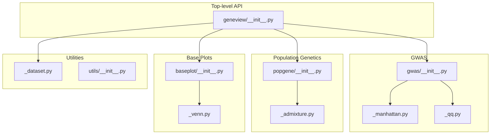
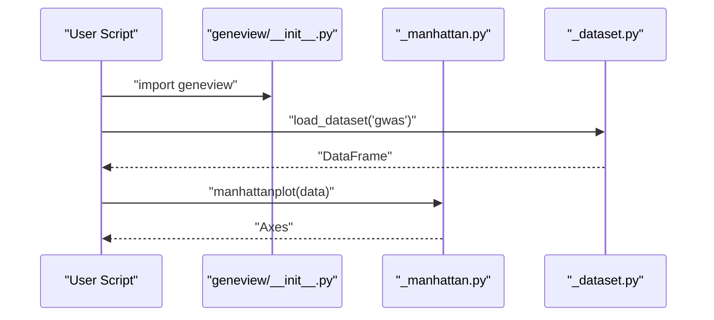
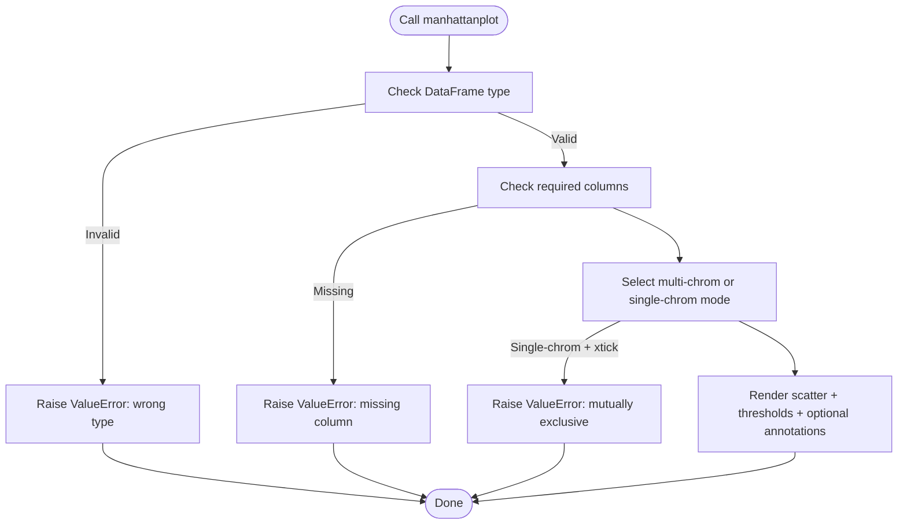
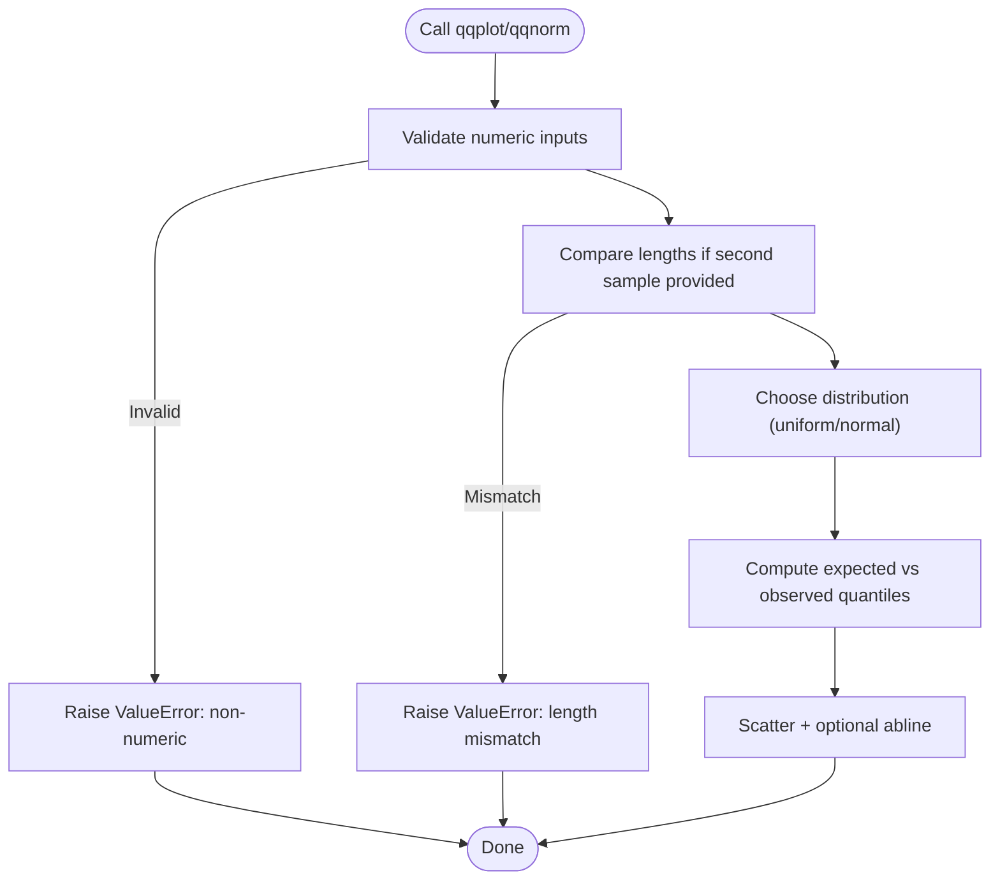
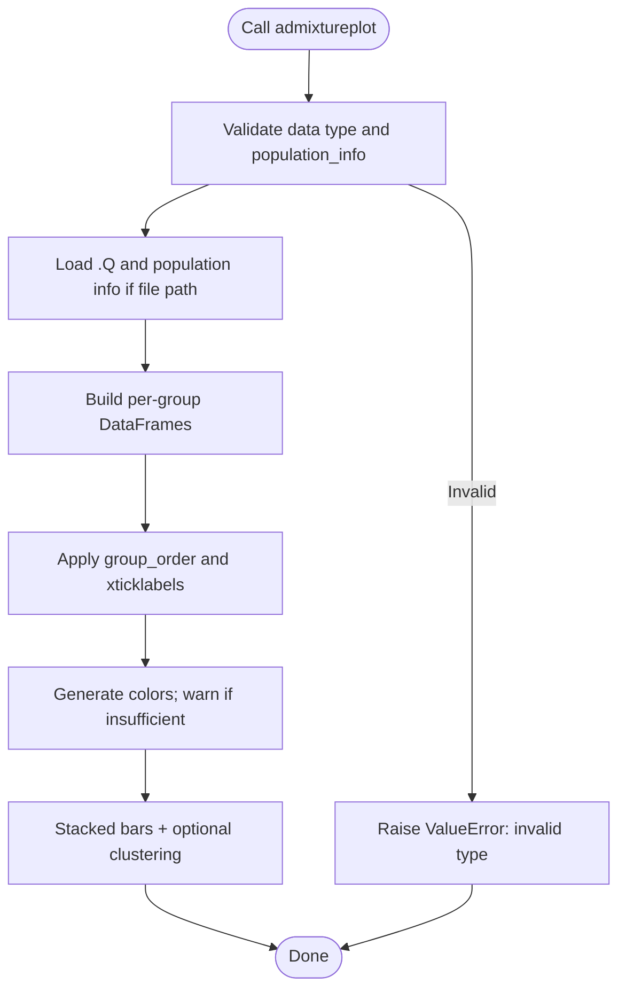
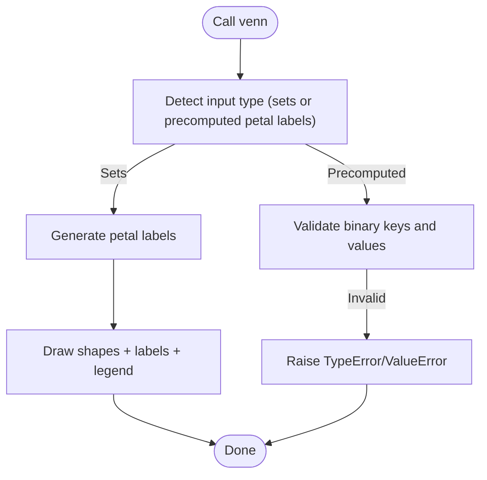
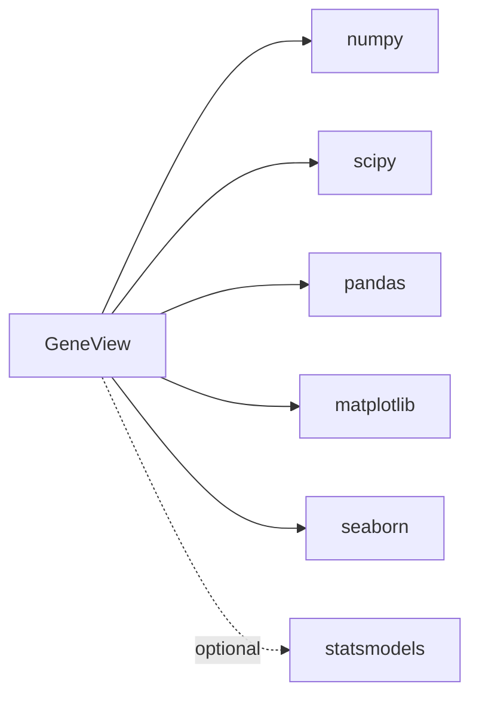

# Troubleshooting and FAQ

<cite>
**Referenced Files in This Document**
- [README.md](file://README.md)
- [setup.py](file://setup.py)
- [requirements.txt](file://requirements.txt)
- [geneview/__init__.py](file://geneview/__init__.py)
- [geneview/gwas/__init__.py](file://geneview/gwas/__init__.py)
- [geneview/gwas/_manhattan.py](file://geneview/gwas/_manhattan.py)
- [geneview/gwas/_qq.py](file://geneview/gwas/_qq.py)
- [geneview/popgene/__init__.py](file://geneview/popgene/__init__.py)
- [geneview/popgene/_admixture.py](file://geneview/popgene/_admixture.py)
- [geneview/baseplot/__init__.py](file://geneview/baseplot/__init__.py)
- [geneview/baseplot/_venn.py](file://geneview/baseplot/_venn.py)
- [geneview/utils/__init__.py](file://geneview/utils/__init__.py)
- [geneview/utils/_dataset.py](file://geneview/utils/_dataset.py)
</cite>

## Table of Contents
1. [Introduction](#introduction)
2. [Project Structure](#project-structure)
3. [Core Components](#core-components)
4. [Architecture Overview](#architecture-overview)
5. [Detailed Component Analysis](#detailed-component-analysis)
6. [Dependency Analysis](#dependency-analysis)
7. [Performance Considerations](#performance-considerations)
8. [Troubleshooting Guide](#troubleshooting-guide)
9. [Conclusion](#conclusion)
10. [Appendices](#appendices)

## Introduction
This document provides a comprehensive troubleshooting guide and FAQ for GeneView, focusing on installation issues, dependency conflicts, memory and performance problems with large datasets, visualization quality concerns, error message explanations, debugging strategies, and performance optimization. It also covers data format compatibility, plotting parameter pitfalls, integration with other Python packages, memory management, batch processing strategies, scaling for large genomics datasets, and common misconceptions about genomics visualization and statistical interpretation.

## Project Structure
GeneView organizes functionality by domain:
- GWAS plotting: Manhattan and Q-Q plots
- Population genetics: Admixture plots
- General plotting: Venn diagrams
- Utilities: dataset loading and helpers
- Palette and algorithm modules support the above

**Diagram sources**
- [geneview/__init__.py:1-15](file://geneview/__init__.py#L1-L15)
- [geneview/gwas/__init__.py:1-3](file://geneview/gwas/__init__.py#L1-L3)
- [geneview/popgene/__init__.py:1-2](file://geneview/popgene/__init__.py#L1-L2)
- [geneview/baseplot/__init__.py:1-2](file://geneview/baseplot/__init__.py#L1-L2)
- [geneview/gwas/_manhattan.py:1-413](file://geneview/gwas/_manhattan.py#L1-L413)
- [geneview/gwas/_qq.py:1-366](file://geneview/gwas/_qq.py#L1-L366)
- [geneview/popgene/_admixture.py:1-364](file://geneview/popgene/_admixture.py#L1-L364)
- [geneview/baseplot/_venn.py:1-585](file://geneview/baseplot/_venn.py#L1-L585)
- [geneview/utils/_dataset.py:1-88](file://geneview/utils/_dataset.py#L1-L88)

**Section sources**
- [README.md:1-344](file://README.md#L1-L344)
- [geneview/__init__.py:1-15](file://geneview/__init__.py#L1-L15)

## Core Components
- Manhattan plot: Validates DataFrame columns, handles single-chromosome vs multi-chromosome modes, manages significance thresholds, optional top SNP annotation, and LD-based grouping.
- Q-Q plot: Validates numeric inputs, supports uniform vs normal reference distributions, computes genomic inflation lambda, and draws reference lines.
- Admixture plot: Loads structured input (file path or dict), optionally shuffles samples per group, performs hierarchical clustering per group, and renders stacked bars.
- Venn diagram: Supports 2–6 sets via ellipses/triangles, generates petal labels, and places legends and labels.

Common error conditions and safeguards:
- DataFrame type checks and required column presence
- Mutually exclusive parameters (e.g., single chromosome vs custom x-tick labels)
- Numeric validation for plotting inputs
- Palette/category mismatch warnings
- Shape count and label format validation for Venn

**Section sources**
- [geneview/gwas/_manhattan.py:209-221](file://geneview/gwas/_manhattan.py#L209-L221)
- [geneview/gwas/_manhattan.py:269-272](file://geneview/gwas/_manhattan.py#L269-L272)
- [geneview/gwas/_qq.py:168-178](file://geneview/gwas/_qq.py#L168-L178)
- [geneview/popgene/_admixture.py:137-165](file://geneview/popgene/_admixture.py#L137-L165)
- [geneview/popgene/_admixture.py:339-340](file://geneview/popgene/_admixture.py#L339-L340)
- [geneview/baseplot/_venn.py:186-208](file://geneview/baseplot/_venn.py#L186-L208)
- [geneview/baseplot/_venn.py:220-231](file://geneview/baseplot/_venn.py#L220-L231)

## Architecture Overview
High-level call flows for each plotting function and typical error scenarios.

**Diagram sources**
- [geneview/__init__.py:1-15](file://geneview/__init__.py#L1-L15)
- [geneview/gwas/_manhattan.py:209-221](file://geneview/gwas/_manhattan.py#L209-L221)
- [geneview/utils/_dataset.py:22-67](file://geneview/utils/_dataset.py#L22-L67)

## Detailed Component Analysis

### Manhattan Plot Troubleshooting
Common issues and fixes:
- Wrong input type: Ensure the input is a pandas DataFrame.
- Missing required columns: Provide "#CHROM", "POS", "P"; optionally "ID" for annotation.
- Mutually exclusive parameters: Do not set both single-chromosome mode and custom x-tick labels simultaneously.
- Empty data subset: When filtering to a single chromosome, ensure the filter yields data.
- Large datasets: Consider subsampling or adjusting DPI and figure size to reduce memory pressure.

**Diagram sources**
- [geneview/gwas/_manhattan.py:209-221](file://geneview/gwas/_manhattan.py#L209-L221)
- [geneview/gwas/_manhattan.py:269-272](file://geneview/gwas/_manhattan.py#L269-L272)

**Section sources**
- [geneview/gwas/_manhattan.py:209-221](file://geneview/gwas/_manhattan.py#L209-L221)
- [geneview/gwas/_manhattan.py:269-272](file://geneview/gwas/_manhattan.py#L269-L272)

### Q-Q Plot Troubleshooting
Common issues and fixes:
- Non-numeric inputs: Ensure all values are numeric; NaN/infinite values can cause unexpected behavior.
- Mismatched lengths: When comparing two samples, ensure equal lengths.
- Unexpected axis labels: Understand that expected vs observed axes depend on the chosen distribution.
- Lambda interpretation: Genomic inflation lambda is computed from observed vs theoretical quantiles.

**Diagram sources**
- [geneview/gwas/_qq.py:168-178](file://geneview/gwas/_qq.py#L168-L178)

**Section sources**
- [geneview/gwas/_qq.py:168-178](file://geneview/gwas/_qq.py#L168-L178)

### Admixture Plot Troubleshooting
Common issues and fixes:
- Data type: Accepts either a file path to .Q output plus population info, or a dict keyed by group with DataFrames.
- Group order and labels: Ensure group_order matches loaded groups; xticklabels length must match group_order.
- Palette/category mismatch: If palette produces fewer colors than K, a warning is raised.
- Sampling per group: shuffle_popsample_kws uses pandas.DataFrame.sample; avoid axis=1 for row-wise sampling.
- File format: .Q file is whitespace-separated; ensure alignment with population info.

**Diagram sources**
- [geneview/popgene/_admixture.py:339-340](file://geneview/popgene/_admixture.py#L339-L340)
- [geneview/popgene/_admixture.py:137-165](file://geneview/popgene/_admixture.py#L137-L165)

**Section sources**
- [geneview/popgene/_admixture.py:339-340](file://geneview/popgene/_admixture.py#L339-L340)
- [geneview/popgene/_admixture.py:137-165](file://geneview/popgene/_admixture.py#L137-L165)

### Venn Diagram Troubleshooting
Common issues and fixes:
- Number of sets: Must be between 2 and 6; shapes differ (ellipses/triangles).
- Petal label keys: Must be binary strings of consistent length; values must be strings.
- Names list: Must be a non-empty list matching inferred set count.
- Formatting: Use generate_petal_labels(fmt=...) to customize labels.

**Diagram sources**
- [geneview/baseplot/_venn.py:560-564](file://geneview/baseplot/_venn.py#L560-L564)
- [geneview/baseplot/_venn.py:574-576](file://geneview/baseplot/_venn.py#L574-L576)
- [geneview/baseplot/_venn.py:220-231](file://geneview/baseplot/_venn.py#L220-L231)

**Section sources**
- [geneview/baseplot/_venn.py:560-564](file://geneview/baseplot/_venn.py#L560-L564)
- [geneview/baseplot/_venn.py:574-576](file://geneview/baseplot/_venn.py#L574-L576)
- [geneview/baseplot/_venn.py:220-231](file://geneview/baseplot/_venn.py#L220-L231)

## Dependency Analysis
- Python version: Requires Python 3; setup enforces modern Python versions.
- Core dependencies: numpy, scipy, pandas, matplotlib, seaborn.
- Optional usage: statsmodels may be used by some functions.
- Matplotlib font configuration: GeneView sets PDF/PS font type and sans-serif defaults globally.

**Diagram sources**
- [setup.py:44-50](file://setup.py#L44-L50)
- [requirements.txt:1-6](file://requirements.txt#L1-L6)
- [geneview/__init__.py:11-14](file://geneview/__init__.py#L11-L14)

**Section sources**
- [setup.py:44-50](file://setup.py#L44-L50)
- [requirements.txt:1-6](file://requirements.txt#L1-L6)
- [geneview/__init__.py:11-14](file://geneview/__init__.py#L11-L14)

## Performance Considerations
- Memory management
  - Prefer subsampling large datasets before plotting (e.g., random sampling per group for admixture).
  - Limit visible annotations to top signals to reduce rendering overhead.
  - Adjust figure size and DPI to balance quality and memory footprint.
- Batch processing
  - Iterate over subsets (e.g., chromosomes) and save figures incrementally.
  - Use non-interactive backends for headless environments.
- Scaling for large datasets
  - Use efficient data types (e.g., appropriate integer/float dtypes).
  - Avoid repeated DataFrame copies; reuse grouped objects where possible.
- Visualization quality
  - Control marker sizes and transparency to mitigate overplotting.
  - Use logarithmic scales appropriately (-log10 p-values).
- Integration tips
  - Ensure matplotlib backend is compatible with your environment (Agg for server/headless).
  - Pin compatible versions of dependencies to avoid regressions.

[No sources needed since this section provides general guidance]

## Troubleshooting Guide

### Installation and Environment
- Problem: pip install fails or installs incompatible versions.
  - Verify Python version support and install dependencies as listed.
  - Use virtual environments to avoid conflicts.
  - Reinstall with --upgrade if stale caches exist.
- Problem: Font or PDF export issues.
  - GeneView sets PS/PDF font type globally; ensure fonts are available on the target system.

**Section sources**
- [README.md:18-26](file://README.md#L18-L26)
- [setup.py:44-50](file://setup.py#L44-L50)
- [requirements.txt:1-6](file://requirements.txt#L1-L6)
- [geneview/__init__.py:11-14](file://geneview/__init__.py#L11-L14)

### Dependency Conflicts
- Symptom: Import errors or runtime crashes after installing other visualization libraries.
  - Conflicts often arise from different matplotlib or pandas versions.
  - Isolate environments and pin versions compatible with GeneView’s requirements.
- Symptom: Statsmodels-related failures.
  - Some functions may use statsmodels; install it explicitly if needed.

**Section sources**
- [setup.py:44-50](file://setup.py#L44-L50)
- [README.md:324-339](file://README.md#L324-L339)

### Memory Issues with Large Datasets
- Manhattan plot
  - Subsample SNPs or limit to a single chromosome to reduce memory.
  - Reduce figure size and marker density.
- Q-Q plot
  - Ensure input arrays are finite and free of extreme outliers.
- Admixture plot
  - Limit samples per group using shuffle_popsample_kws.
  - Disable hierarchical clustering if unnecessary.
- Venn diagram
  - Keep set sizes reasonable; 2–6 sets recommended.

**Section sources**
- [geneview/gwas/_manhattan.py:269-272](file://geneview/gwas/_manhattan.py#L269-L272)
- [geneview/gwas/_qq.py:168-178](file://geneview/gwas/_qq.py#L168-L178)
- [geneview/popgene/_admixture.py:137-165](file://geneview/popgene/_admixture.py#L137-L165)
- [geneview/baseplot/_venn.py:186-208](file://geneview/baseplot/_venn.py#L186-L208)

### Visualization Quality Problems
- Overlapping x-axis labels (Manhattan)
  - Rotate labels or set xticklabel_kws rotation.
- Threshold lines not visible
  - Confirm suggestiveline/genomewideline values and hline_kws.
- Admixture plot color confusion
  - Increase palette diversity or explicitly set colors; note warnings when palette lacks sufficient hues.
- Venn labels unreadable
  - Adjust fontsize and use generate_petal_labels(fmt=...) to control label content.

**Section sources**
- [geneview/gwas/_manhattan.py:294-301](file://geneview/gwas/_manhattan.py#L294-L301)
- [geneview/popgene/_admixture.py:70-74](file://geneview/popgene/_admixture.py#L70-L74)
- [geneview/baseplot/_venn.py:186-208](file://geneview/baseplot/_venn.py#L186-L208)

### Data Format Compatibility
- Manhattan
  - Required columns: "#CHROM", "POS", "P"; optional "ID" for annotation.
  - Chromosome column must be string-like; positions numeric.
- Q-Q
  - Inputs must be numeric; if comparing two samples, lengths must match.
- Admixture
  - Accepts file path to .Q plus population info file, or a dict keyed by group with DataFrames.
  - Population info must align with .Q rows.
- Venn
  - Input sets must be Python sets; petal labels must be binary-keyed dicts with string values.

**Section sources**
- [geneview/gwas/_manhattan.py:209-218](file://geneview/gwas/_manhattan.py#L209-L218)
- [geneview/gwas/_qq.py:168-178](file://geneview/gwas/_qq.py#L168-L178)
- [geneview/popgene/_admixture.py:339-340](file://geneview/popgene/_admixture.py#L339-L340)
- [geneview/baseplot/_venn.py:574-576](file://geneview/baseplot/_venn.py#L574-L576)

### Plotting Parameter Problems
- Mutually exclusive parameters
  - Single-chromosome mode and custom x-tick labels cannot be used together.
- Palette and colors
  - If palette colors are fewer than categories, a warning is issued.
- Backend and export
  - Use Agg or similar non-interactive backends for server environments.

**Section sources**
- [geneview/gwas/_manhattan.py:220-221](file://geneview/gwas/_manhattan.py#L220-L221)
- [geneview/popgene/_admixture.py:70-74](file://geneview/popgene/_admixture.py#L70-L74)

### Integration Challenges with Other Python Packages
- Matplotlib backends
  - Configure backend appropriately for your environment (TkAgg, Agg, PDF, SVG).
- Seaborn and pandas
  - GeneView leverages seaborn color palettes and pandas DataFrames; ensure consistent versions.
- statsmodels
  - Install explicitly if functions relying on it are used.

**Section sources**
- [setup.py:44-50](file://setup.py#L44-L50)
- [README.md:324-339](file://README.md#L324-L339)

### Debugging Strategies
- Reproduce with minimal data
  - Use load_dataset to fetch example datasets and confirm the issue persists.
- Validate inputs
  - Check DataFrame dtypes and column names; ensure numeric inputs for Q-Q.
- Inspect intermediate steps
  - For Manhattan, verify grouped data and LD block boundaries.
  - For Venn, validate petal label keys and values.
- Logging and warnings
  - Pay attention to warnings (e.g., palette insufficient) and address them.

**Section sources**
- [geneview/utils/_dataset.py:22-67](file://geneview/utils/_dataset.py#L22-L67)
- [geneview/gwas/_manhattan.py:245-267](file://geneview/gwas/_manhattan.py#L245-L267)
- [geneview/baseplot/_venn.py:220-231](file://geneview/baseplot/_venn.py#L220-L231)

### Performance Optimization Techniques
- Reduce data volume
  - Filter to significant regions or subsample.
- Optimize rendering
  - Lower DPI, simplify markers, and avoid excessive annotations.
- Use non-interactive backends
  - Switch to Agg for batch generation.
- Cache datasets
  - Utilize local caching for repeated access to example datasets.

**Section sources**
- [geneview/utils/_dataset.py:55-67](file://geneview/utils/_dataset.py#L55-L67)

### Common Misconceptions
- Manhattan thresholds
  - Suggestive and genome-wide thresholds are conventional cutoffs; adjust based on study specifics.
- Q-Q interpretation
  - Lambda reflects overall deviation from expected distribution; investigate data quality if substantially elevated.
- Admixture colors
  - Palette choice affects interpretability; ensure sufficient distinct hues for K components.
- Venn sizing
  - Very large set intersections can obscure smaller ones; consider zooming into regions of interest.

**Section sources**
- [geneview/gwas/_manhattan.py:294-301](file://geneview/gwas/_manhattan.py#L294-L301)
- [geneview/gwas/_qq.py:201-208](file://geneview/gwas/_qq.py#L201-L208)
- [geneview/popgene/_admixture.py:70-74](file://geneview/popgene/_admixture.py#L70-L74)

## Conclusion
This guide consolidates practical troubleshooting steps, error handling patterns, and optimization strategies for GeneView. By validating inputs, managing dependencies, controlling memory usage, and understanding function-specific behaviors, most issues can be resolved efficiently. For persistent problems, reproduce with minimal datasets and consult the referenced sections for targeted diagnostics.

[No sources needed since this section summarizes without analyzing specific files]

## Appendices

### Quick Reference: Error Messages and Fixes
- “Input data must be a pandas.DataFrame.”
  - Ensure the input is a DataFrame and includes required columns.
- “Column 'X' not found!”
  - Provide the correct column names for chromosome, position, and p-value.
- “Cannot set both single-chromosome and xtick_label_set”
  - Choose one mode: single-chromosome or custom x-ticks.
- “zero-size array to reduction operation”
  - Filter yielded no data; adjust selection criteria.
- “Input must all be numeric”
  - Clean inputs to remove non-numeric values.
- “Length mismatch”
  - Align lengths of compared samples.
- “KeyError: 'group'"
  - Ensure group_order matches loaded groups.
- “Number of sets must be between 2 and 6”
  - Reduce or split the number of sets.

**Section sources**
- [geneview/gwas/_manhattan.py:210-221](file://geneview/gwas/_manhattan.py#L210-L221)
- [geneview/gwas/_manhattan.py:269-272](file://geneview/gwas/_manhattan.py#L269-L272)
- [geneview/gwas/_qq.py:168-178](file://geneview/gwas/_qq.py#L168-L178)
- [geneview/popgene/_admixture.py:91-92](file://geneview/popgene/_admixture.py#L91-L92)
- [geneview/baseplot/_venn.py:190-191](file://geneview/baseplot/_venn.py#L190-L191)