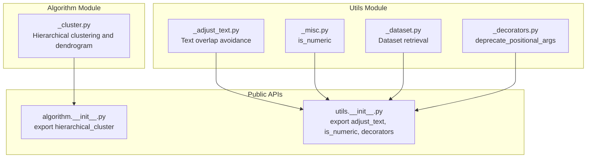
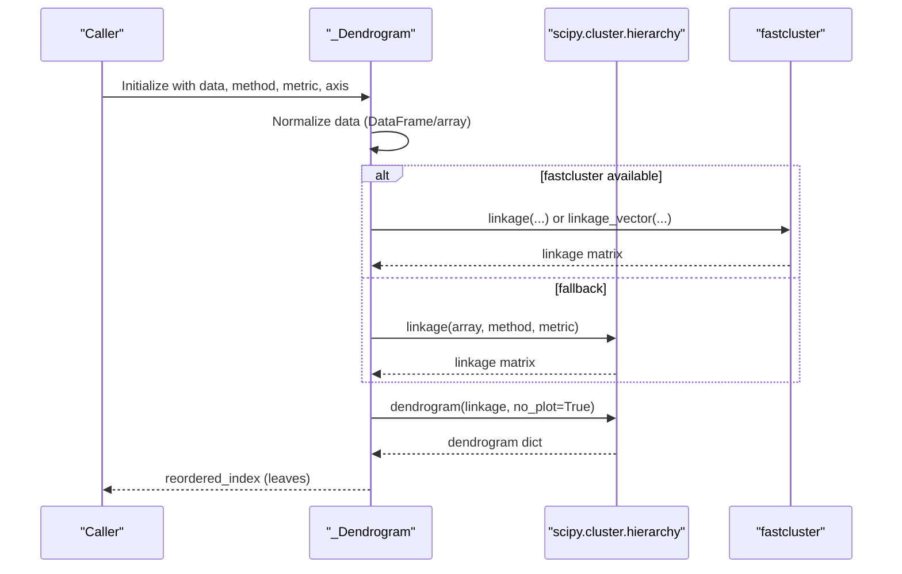
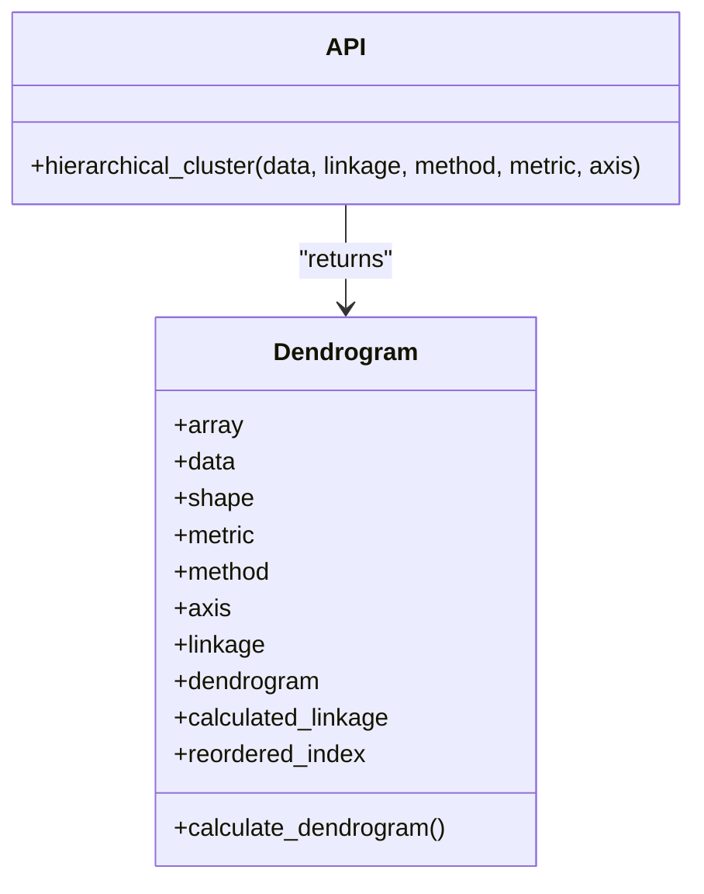
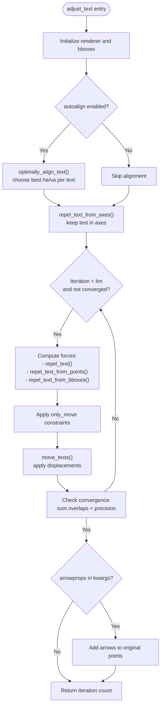
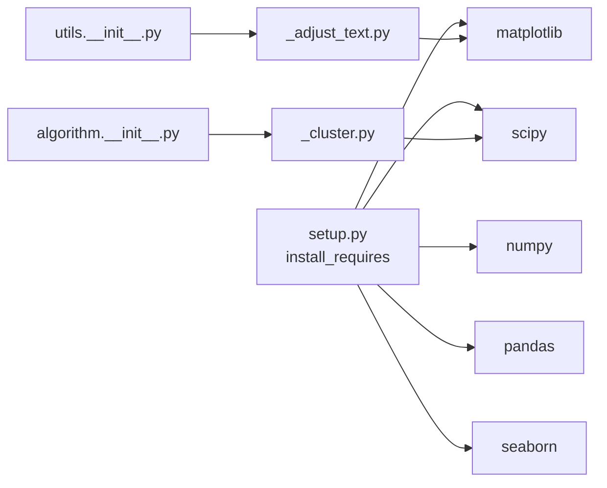

# Algorithmic Support

<cite>
**Referenced Files in This Document**
- [_cluster.py](file://geneview/algorithm/_cluster.py)
- [test_algorithms.py](file://geneview/tests/test_algorithms.py)
- [_adjust_text.py](file://geneview/utils/_adjust_text.py)
- [_misc.py](file://geneview/utils/_misc.py)
- [_dataset.py](file://geneview/utils/_dataset.py)
- [_decorators.py](file://geneview/utils/_decorators.py)
- [__init__.py (algorithm)](file://geneview/algorithm/__init__.py)
- [__init__.py (utils)](file://geneview/utils/__init__.py)
- [setup.py](file://setup.py)
- [README.md](file://README.md)
</cite>

## Table of Contents
1. [Introduction](#introduction)
2. [Project Structure](#project-structure)
3. [Core Components](#core-components)
4. [Architecture Overview](#architecture-overview)
5. [Detailed Component Analysis](#detailed-component-analysis)
6. [Dependency Analysis](#dependency-analysis)
7. [Performance Considerations](#performance-considerations)
8. [Troubleshooting Guide](#troubleshooting-guide)
9. [Conclusion](#conclusion)
10. [Appendices](#appendices)

## Introduction
This document explains GeneView’s algorithmic support infrastructure with a focus on:
- Hierarchical clustering for genomics visualization, including linkage method selection, fastcluster integration, and dendrogram reordering.
- Text adjustment utilities to prevent label overlap in dense plots, including collision detection and iterative positioning strategies.
- Miscellaneous utility functions for data transformation and validation.
- Practical examples for parameter tuning, layout optimization, and performance benchmarking.
- Computational complexity, memory usage, and scalability considerations for large-scale genomic datasets.

## Project Structure
The algorithmic support spans two primary modules:
- geneview/algorithm: hierarchical clustering and dendrogram utilities.
- geneview/utils: text adjustment, dataset loading, and general-purpose helpers.

**Diagram sources**
- [_cluster.py:1-147](file://geneview/algorithm/_cluster.py#L1-L147)
- [_adjust_text.py:1-759](file://geneview/utils/_adjust_text.py#L1-L759)
- [_misc.py:1-43](file://geneview/utils/_misc.py#L1-L43)
- [_dataset.py:1-88](file://geneview/utils/_dataset.py#L1-L88)
- [_decorators.py:1-60](file://geneview/utils/_decorators.py#L1-L60)
- [__init__.py (algorithm):1-1](file://geneview/algorithm/__init__.py#L1-L1)
- [__init__.py (utils):1-20](file://geneview/utils/__init__.py#L1-L20)

**Section sources**
- [__init__.py (algorithm):1-1](file://geneview/algorithm/__init__.py#L1-L1)
- [__init__.py (utils):1-20](file://geneview/utils/__init__.py#L1-L20)

## Core Components
- Hierarchical clustering: Agglomerative clustering with configurable linkage methods and metrics, with automatic fallback to fastcluster when available.
- Text adjustment: Iterative collision avoidance among texts, points, and additional objects with configurable expansion and movement constraints.
- Utilities: Numeric type checking, dataset retrieval, and decorator for API stability.

**Section sources**
- [_cluster.py:1-147](file://geneview/algorithm/_cluster.py#L1-L147)
- [_adjust_text.py:1-759](file://geneview/utils/_adjust_text.py#L1-L759)
- [_misc.py:1-43](file://geneview/utils/_misc.py#L1-L43)
- [_dataset.py:1-88](file://geneview/utils/_dataset.py#L1-L88)
- [_decorators.py:1-60](file://geneview/utils/_decorators.py#L1-L60)

## Architecture Overview
The clustering pipeline integrates NumPy/Pandas data with SciPy’s hierarchy and optional fastcluster acceleration. The text adjustment pipeline operates on matplotlib objects and uses renderer-aware bounding boxes to iteratively resolve overlaps.

**Diagram sources**
- [_cluster.py:19-111](file://geneview/algorithm/_cluster.py#L19-L111)

## Detailed Component Analysis

### Hierarchical Clustering
Implements agglomerative hierarchical clustering with:
- Axis-aware transpose for row vs column clustering.
- Configurable linkage methods and distance metrics.
- Automatic fastcluster integration with performance hints for vectorized methods.
- Reordered index extraction for downstream visualization.

Key behaviors:
- Supports multiple linkage methods via SciPy; fastcluster is used when available and compatible.
- Forwards metric compatibility checks (e.g., vectorized path for specific methods with Euclidean).
- Provides a dendrogram dictionary for internal use and exposes the leaf order for reordering matrices.

**Diagram sources**
- [_cluster.py:19-147](file://geneview/algorithm/_cluster.py#L19-L147)

Practical usage examples (parameter tuning):
- Choose axis=0 to cluster samples (rows) or axis=1 to cluster features (columns).
- Select metric aligned with data scale and domain (Euclidean for continuous, Cityblock for robustness, Cosine for angular similarity).
- Prefer Ward linkage with Euclidean for variance-minimizing clusters; use Average or Complete for compact or chained structures.

Validation techniques:
- Compare reordered_index permutations against identity for sanity checks.
- Cross-validate with precomputed linkage matrices to isolate performance bottlenecks.

Benchmarking tips:
- Measure wall-clock time around hierarchical_cluster calls for varying N × M shapes.
- Compare scipy vs fastcluster timings; note that fastcluster’s vectorized path is limited to specific combinations (e.g., Euclidean with centroid/median/Ward, or single linkage).

**Section sources**
- [_cluster.py:19-147](file://geneview/algorithm/_cluster.py#L19-L147)
- [test_algorithms.py:13-116](file://geneview/tests/test_algorithms.py#L13-L116)

### Text Adjustment Utilities
Provides iterative text layout optimization to avoid overlaps with:
- Other texts (mutual repulsion).
- Data points (repulsion from x/y arrays).
- Additional matplotlib objects (e.g., patches, collections).

Core algorithms:
- Bounding box computation via renderer-aware extents.
- Overlap detection using point-in-Bbox queries and intersection areas.
- Iterative displacement updates with configurable forces and movement restrictions.
- Optional arrow linking from final text positions back to original data coordinates.

**Diagram sources**
- [_adjust_text.py:439-759](file://geneview/utils/_adjust_text.py#L439-L759)

Layout optimization strategies:
- Increase expand_text/expand_points to widen avoidance zones for dense regions.
- Tune force_text, force_points, force_objects to balance speed and quality.
- Use only_move to constrain motion along specific axes for readability.
- Save intermediate steps to inspect convergence behavior.

**Section sources**
- [_adjust_text.py:1-759](file://geneview/utils/_adjust_text.py#L1-L759)

### Miscellaneous Utilities
- Numeric type checker: Validates scalar numeric inputs robustly.
- Dataset loader: Fetches example datasets from an online repository with local caching.
- Decorator: Enforces keyword-only arguments for API stability.

**Section sources**
- [_misc.py:1-43](file://geneview/utils/_misc.py#L1-L43)
- [_dataset.py:1-88](file://geneview/utils/_dataset.py#L1-L88)
- [_decorators.py:1-60](file://geneview/utils/_decorators.py#L1-L60)

## Dependency Analysis
External libraries:
- NumPy and Pandas for numerical/data handling.
- SciPy for hierarchical clustering linkage and dendrogram computation.
- Matplotlib for rendering and text positioning.
- Optional fastcluster for accelerated linkage computation.

Internal exports:
- algorithm.__init__.py exposes hierarchical_cluster.
- utils.__init__.py exposes adjust_text, is_numeric, and deprecate_positional_args.

**Diagram sources**
- [setup.py:44-49](file://setup.py#L44-L49)
- [_cluster.py:10-16](file://geneview/algorithm/_cluster.py#L10-L16)
- [_adjust_text.py:8-14](file://geneview/utils/_adjust_text.py#L8-L14)
- [__init__.py (algorithm):1-1](file://geneview/algorithm/__init__.py#L1-L1)
- [__init__.py (utils):1-20](file://geneview/utils/__init__.py#L1-L20)

**Section sources**
- [setup.py:44-49](file://setup.py#L44-L49)
- [__init__.py (algorithm):1-1](file://geneview/algorithm/__init__.py#L1-L1)
- [__init__.py (utils):1-20](file://geneview/utils/__init__.py#L1-L20)

## Performance Considerations
- Clustering complexity:
  - Standard SciPy linkage scales roughly O(n^3) in time and O(n^2) in memory for dense distance matrices. For n ≳ 1000, expect substantial runtime and memory usage.
  - fastcluster accelerates computation, especially with vectorized paths for specific methods/metrics. The implementation selects vectorized linkage_vector when compatible.
- Memory optimization:
  - Prefer axis=0 or 1 to cluster the smaller dimension first.
  - Use precomputed linkage matrices to avoid recomputation when exploring parameter sweeps.
  - Downcast data types if acceptable for precision.
- Concurrency:
  - No explicit parallel processing is implemented in clustering or text adjustment. Consider batching or external orchestration for multiple independent runs.
- Rendering overhead:
  - Text adjustment relies on renderer calls; minimize repeated redraws by calling adjust_text once at the end of plotting.

[No sources needed since this section provides general guidance]

## Troubleshooting Guide
Common issues and remedies:
- Missing SciPy: hierarchical_cluster raises a runtime error if SciPy is unavailable. Ensure installation includes scipy.
- Large matrices: When shape prod ≥ 10000 and fastcluster is missing, a warning suggests installing fastcluster for better performance.
- Text overlap persists:
  - Increase expand_text/expand_points.
  - Tighten precision or increase lim.
  - Disable avoid_points in extremely crowded scenarios to reduce computation.
- Incorrect axes limits:
  - Call adjust_text after finalizing axes limits; the function uses renderer extents to compute overlaps.

**Section sources**
- [_cluster.py:88-93](file://geneview/algorithm/_cluster.py#L88-L93)
- [_adjust_text.py:573-581](file://geneview/utils/_adjust_text.py#L573-L581)

## Conclusion
GeneView’s algorithmic support combines efficient hierarchical clustering with robust text layout tools. Hierarchical clustering leverages SciPy with optional fastcluster acceleration, while text adjustment provides iterative collision avoidance tailored for complex genomic visualizations. Together, they enable scalable, readable, and reproducible analyses across diverse genomics plots.

[No sources needed since this section summarizes without analyzing specific files]

## Appendices

### Practical Examples Index
- Clustering parameter tuning:
  - Vary axis between 0 and 1 depending on whether to cluster samples or features.
  - Try metrics “euclidean”, “cityblock”, “cosine”; pair Ward with Euclidean.
  - Validate with precomputed linkage matrices and compare reordered_index permutations.
- Text layout optimization:
  - Increase expand_text/expand_points; tune force_* parameters; restrict movement with only_move.
  - Save intermediate steps to inspect convergence.
- Benchmarking:
  - Time hierarchical_cluster across datasets of increasing size.
  - Compare scipy vs fastcluster builds for identical parameters.

[No sources needed since this section provides general guidance]