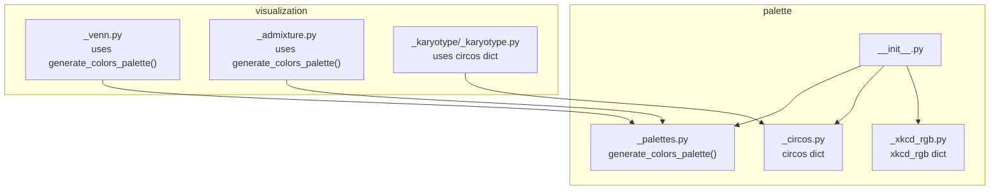
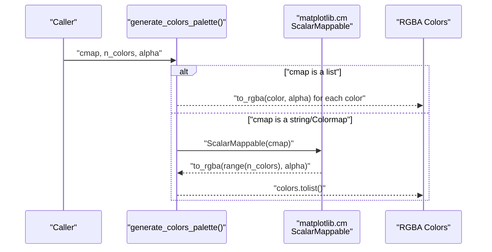
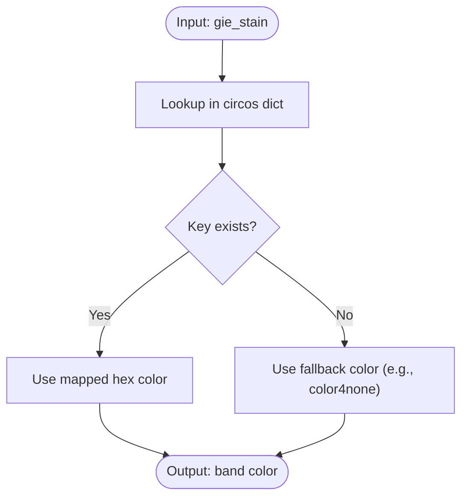
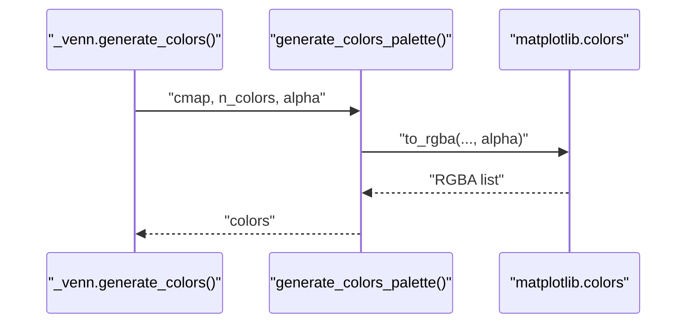
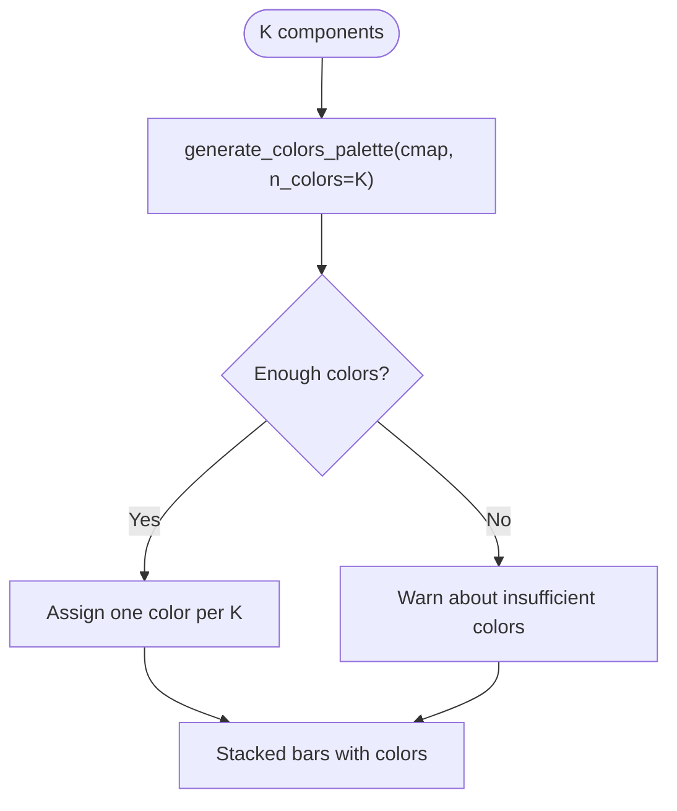
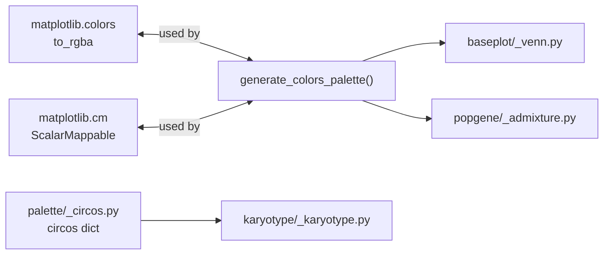

# Color Palette Management

<cite>
**Referenced Files in This Document**
- [__init__.py](file://geneview/palette/__init__.py)
- [_palettes.py](file://geneview/palette/_palettes.py)
- [_circos.py](file://geneview/palette/_circos.py)
- [_xkcd_rgb.py](file://geneview/palette/_xkcd_rgb.py)
- [_venn.py](file://geneview/baseplot/_venn.py)
- [_admixture.py](file://geneview/popgene/_admixture.py)
- [_karyotype.py](file://geneview/karyotype/_karyotype.py)
- [test_palettes.py](file://geneview/tests/test_palettes.py)
</cite>

## Table of Contents
1. [Introduction](#introduction)
2. [Project Structure](#project-structure)
3. [Core Components](#core-components)
4. [Architecture Overview](#architecture-overview)
5. [Detailed Component Analysis](#detailed-component-analysis)
6. [Dependency Analysis](#dependency-analysis)
7. [Performance Considerations](#performance-considerations)
8. [Troubleshooting Guide](#troubleshooting-guide)
9. [Conclusion](#conclusion)
10. [Appendices](#appendices)

## Introduction
This document explains GeneView’s color palette management system with a focus on generating consistent, accessible, and scientifically appropriate colors for genomic visualizations. It covers:
- The generate_colors_palette() function for matplotlib colormap integration
- Integration with Circos color schemes for chromosome ideograms and population genetics plots
- Accessible color choices via XKCD RGB mappings
- Practical palette selection strategies for different plot types, colorblind-friendly schemes, and custom color scheme creation
- Performance considerations for large-scale color generation and memory optimization

## Project Structure
GeneView organizes color palette utilities under the palette package and integrates them across visualization modules:
- Palette core: generate_colors_palette() and predefined dictionaries (Circos and XKCD)
- Visualization modules: Venn diagrams, admixture plots, and karyotype ideograms
- Tests validate color generation, alpha handling, and dictionary integrity

**Diagram sources**
- [__init__.py:1-10](file://geneview/palette/__init__.py#L1-L10)
- [_palettes.py:1-13](file://geneview/palette/_palettes.py#L1-L13)
- [_circos.py:1-236](file://geneview/palette/_circos.py#L1-L236)
- [_xkcd_rgb.py:1-951](file://geneview/palette/_xkcd_rgb.py#L1-L951)
- [_venn.py:1-14](file://geneview/baseplot/_venn.py#L1-L14)
- [_admixture.py:1-14](file://geneview/popgene/_admixture.py#L1-L14)
- [_karyotype.py:1-13](file://geneview/karyotype/_karyotype.py#L1-L13)

**Section sources**
- [__init__.py:1-10](file://geneview/palette/__init__.py#L1-L10)
- [_palettes.py:1-13](file://geneview/palette/_palettes.py#L1-L13)
- [_circos.py:1-236](file://geneview/palette/_circos.py#L1-L236)
- [_xkcd_rgb.py:1-951](file://geneview/palette/_xkcd_rgb.py#L1-L951)
- [_venn.py:1-14](file://geneview/baseplot/_venn.py#L1-L14)
- [_admixture.py:1-14](file://geneview/popgene/_admixture.py#L1-L14)
- [_karyotype.py:1-13](file://geneview/karyotype/_karyotype.py#L1-L13)

## Core Components
- generate_colors_palette(cmap="viridis", n_colors=10, alpha=1.0): Generates a list of RGBA colors either from a matplotlib colormap or an explicit list. It supports passing a list for exact colors and applies alpha uniformly.
- circos: A dictionary of predefined hex colors aligned with Circos conventions, including ideogram band colors (e.g., gpos*, acen, stalk) and UCSC chromosome palette (e.g., chr1–chr24, chrX, chrY, chrUn, chrNA).
- xkcd_rgb: A large dictionary of XKCD-accessible color names mapped to hex values, enabling intuitive and inclusive color selection.

Key behaviors validated by tests:
- Returned color list length equals n_colors
- Each color is a 4-channel RGBA structure
- Alpha parameter controls transparency consistently

**Section sources**
- [_palettes.py:5-12](file://geneview/palette/_palettes.py#L5-L12)
- [_circos.py:24-235](file://geneview/palette/_circos.py#L24-L235)
- [_xkcd_rgb.py:1-951](file://geneview/palette/_xkcd_rgb.py#L1-L951)
- [test_palettes.py:10-32](file://geneview/tests/test_palettes.py#L10-L32)
- [test_palettes.py:68-82](file://geneview/tests/test_palettes.py#L68-L82)
- [test_palettes.py:84-101](file://geneview/tests/test_palettes.py#L84-L101)

## Architecture Overview
The palette system is designed around a small set of reusable utilities:
- Centralized generation via generate_colors_palette()
- Predefined dictionaries for domain-specific use (ideograms, accessibility)
- Consumption by visualization modules for consistent color usage

**Diagram sources**
- [_palettes.py:5-12](file://geneview/palette/_palettes.py#L5-L12)

**Section sources**
- [_palettes.py:5-12](file://geneview/palette/_palettes.py#L5-L12)

## Detailed Component Analysis

### Matplotlib Colormap Integration: generate_colors_palette()
- Purpose: Provide a unified interface to produce a list of RGBA colors suitable for plotting.
- Parameters:
  - cmap: Accepts a matplotlib colormap name or object, or a list of exact colors.
  - n_colors: Number of colors to generate.
  - alpha: Transparency factor applied to all generated colors.
- Behavior:
  - If cmap is a list, each color is converted to RGBA with the specified alpha.
  - Otherwise, a ScalarMappable is used to map indices to colors from the colormap and then to RGBA with alpha.

Practical usage examples (conceptual):
- Categorical plots: pass a discrete colormap name or a list of distinct colors.
- Continuous gradients: pass a continuous colormap name and adjust n_colors to match categories.
- Transparency control: reduce alpha for overlay plots or increase for emphasis.

Validation highlights:
- Color count and RGBA structure verified by tests
- Alpha consistency across returned colors

**Section sources**
- [_palettes.py:5-12](file://geneview/palette/_palettes.py#L5-L12)
- [test_palettes.py:13-32](file://geneview/tests/test_palettes.py#L13-L32)

### Circos Color Scheme Integration
- Ideogram bands: gneg, gpos25, gpos50, gpos75, gpos100, acen, stalk, gvar
- Chromosome palette: chr1–chr24, chrX, chrY, chrUn, chrNA
- Usage pattern: Select a key from the dictionary to color ideograms or related tracks.

Integration points:
- Karyotype plotting uses circos to map gie_stain values to band colors.

**Diagram sources**
- [_karyotype.py:94-96](file://geneview/karyotype/_karyotype.py#L94-L96)
- [_circos.py:78-90](file://geneview/palette/_circos.py#L78-L90)
- [_circos.py:102-132](file://geneview/palette/_circos.py#L102-L132)

**Section sources**
- [_karyotype.py:28-109](file://geneview/karyotype/_karyotype.py#L28-L109)
- [_circos.py:24-235](file://geneview/palette/_circos.py#L24-L235)
- [test_palettes.py:84-101](file://geneview/tests/test_palettes.py#L84-L101)

### XKCD RGB Color Mapping for Accessibility
- Purpose: Provide human-friendly, accessible color names mapped to hex values.
- Usage: Choose XKCD names that are easy to interpret and robust across devices and color vision variations.

Integration points:
- Accessible color names can be used directly as named colors or as inspiration for custom palettes.

**Section sources**
- [_xkcd_rgb.py:1-951](file://geneview/palette/_xkcd_rgb.py#L1-L951)

### Visualization Modules and Palette Usage

#### Venn Diagrams
- Uses generate_colors_palette() to produce translucent colors for overlapping shapes.
- Supports palette override via a colormap name, list, or explicit colors.
- Alpha parameter controls overlap visibility.

**Diagram sources**
- [_venn.py:124-130](file://geneview/baseplot/_venn.py#L124-L130)
- [_palettes.py:5-12](file://geneview/palette/_palettes.py#L5-L12)

**Section sources**
- [_venn.py:124-130](file://geneview/baseplot/_venn.py#L124-L130)

#### Admixture Plots
- Uses generate_colors_palette() to assign a distinct color per ancestry component (K).
- Warns if the number of colors from the palette is fewer than K to avoid confusion.

**Diagram sources**
- [_admixture.py:67-75](file://geneview/popgene/_admixture.py#L67-L75)
- [_palettes.py:5-12](file://geneview/palette/_palettes.py#L5-L12)

**Section sources**
- [_admixture.py:67-75](file://geneview/popgene/_admixture.py#L67-L75)

#### Karyotype Ideograms
- Uses circos dictionary to map G-banding stain types to band colors.
- Provides a fallback color for unknown stains.

**Section sources**
- [_karyotype.py:94-96](file://geneview/karyotype/_karyotype.py#L94-L96)
- [_circos.py:78-90](file://geneview/palette/_circos.py#L78-L90)

## Dependency Analysis
- Palette core depends on matplotlib for colormap handling and color conversion.
- Visualization modules depend on palette utilities for consistent color assignment.
- Dictionary integrity is validated by tests ensuring keys are hex-formatted strings.

**Diagram sources**
- [_palettes.py:1-12](file://geneview/palette/_palettes.py#L1-L12)
- [_venn.py:12-12](file://geneview/baseplot/_venn.py#L12-L12)
- [_admixture.py:14-14](file://geneview/popgene/_admixture.py#L14-L14)
- [_karyotype.py:13-13](file://geneview/karyotype/_karyotype.py#L13-L13)
- [_circos.py:24-235](file://geneview/palette/_circos.py#L24-L235)

**Section sources**
- [_palettes.py:1-12](file://geneview/palette/_palettes.py#L1-L12)
- [_venn.py:12-12](file://geneview/baseplot/_venn.py#L12-L12)
- [_admixture.py:14-14](file://geneview/popgene/_admixture.py#L14-L14)
- [_karyotype.py:13-13](file://geneview/karyotype/_karyotype.py#L13-L13)
- [_circos.py:24-235](file://geneview/palette/_circos.py#L24-L235)

## Performance Considerations
- Prefer passing a list of exact colors when n_colors is small and fixed to avoid repeated colormap computations.
- For large n_colors, reuse the generated palette across multiple plots to minimize repeated conversions.
- Control alpha once during generation rather than adjusting per patch to reduce overhead.
- When using Circos ideogram colors, rely on dictionary lookups which are O(1); ensure the dictionary is imported once and reused.
- Memory optimization: avoid generating intermediate arrays unnecessarily; pass precomputed color lists to plotting routines.

[No sources needed since this section provides general guidance]

## Troubleshooting Guide
Common issues and resolutions:
- Unexpected color count: Verify n_colors matches the intended number of categories and that the palette is not truncated.
- Incorrect alpha: Ensure alpha is set consistently; note that transparency affects overlaps and legends.
- Unknown Circos keys: Fall back to a default color when a gie_stain key is missing.
- Insufficient colors for K components: Increase palette resolution or switch to a palette with more distinct colors.

Validation references:
- Color count and RGBA structure checks
- Alpha parameter verification
- Dictionary key and hex format validation

**Section sources**
- [test_palettes.py:13-32](file://geneview/tests/test_palettes.py#L13-L32)
- [test_palettes.py:25-32](file://geneview/tests/test_palettes.py#L25-L32)
- [test_palettes.py:84-101](file://geneview/tests/test_palettes.py#L84-L101)

## Conclusion
GeneView’s palette system offers a flexible, validated foundation for color generation and consistent visualization across genomic plots. By leveraging generate_colors_palette() for colormap-driven colors, circos for ideogram fidelity, and XKCD names for accessibility, users can create clear, inclusive, and scientifically sound visualizations. Following the performance and troubleshooting guidance ensures scalable, maintainable color workflows.

[No sources needed since this section summarizes without analyzing specific files]

## Appendices

### Practical Palette Selection Strategies
- Venn diagrams: Use semi-transparent colors with moderate saturation; adjust alpha for overlap clarity.
- Admixture plots: Choose a palette with sufficient distinct hues; warn if palette lacks enough colors for K.
- Karyotype ideograms: Use established gpos/acen/stalk colors; provide a fallback for unknown stains.
- Colorblind-friendly schemes: Favor palettes with high luminance contrast and minimal hue repetition; consider perceptually uniform colormaps.

[No sources needed since this section provides general guidance]