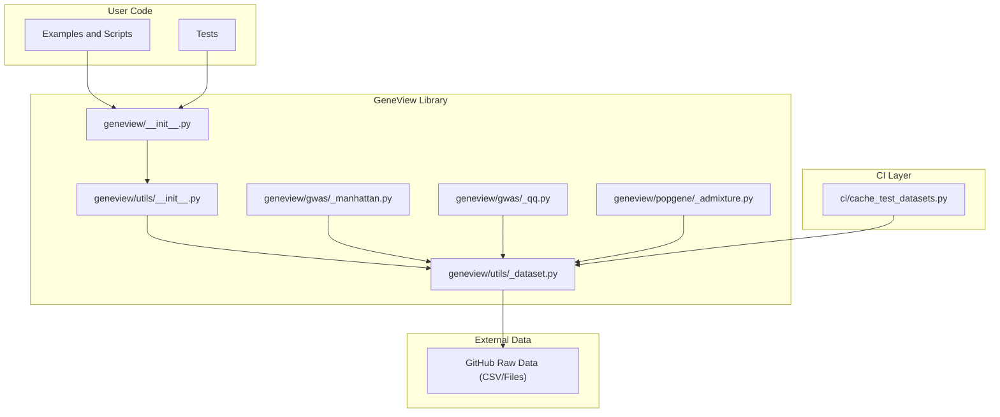
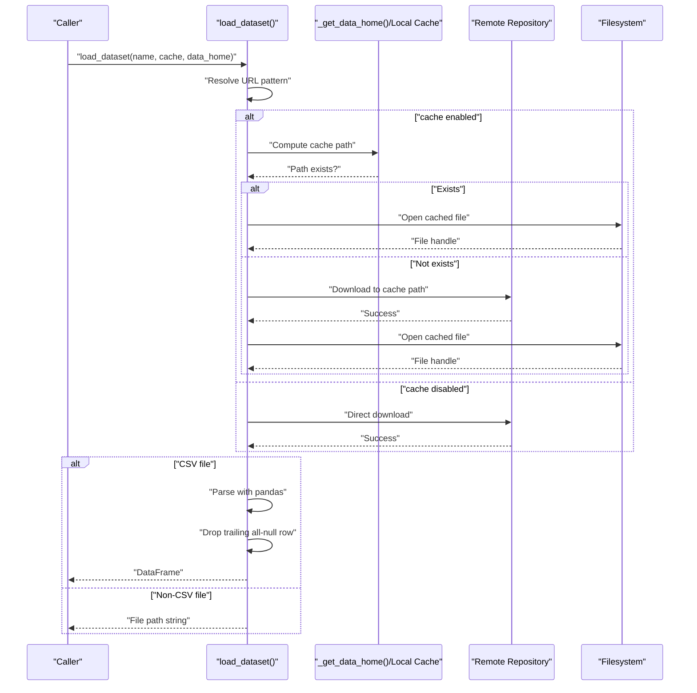
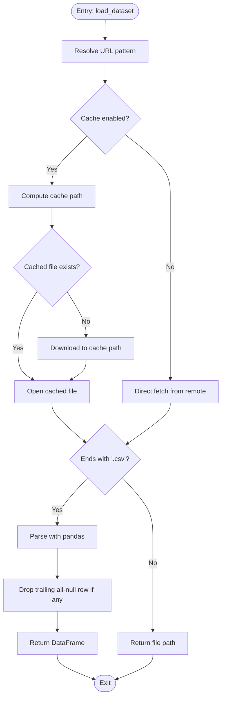
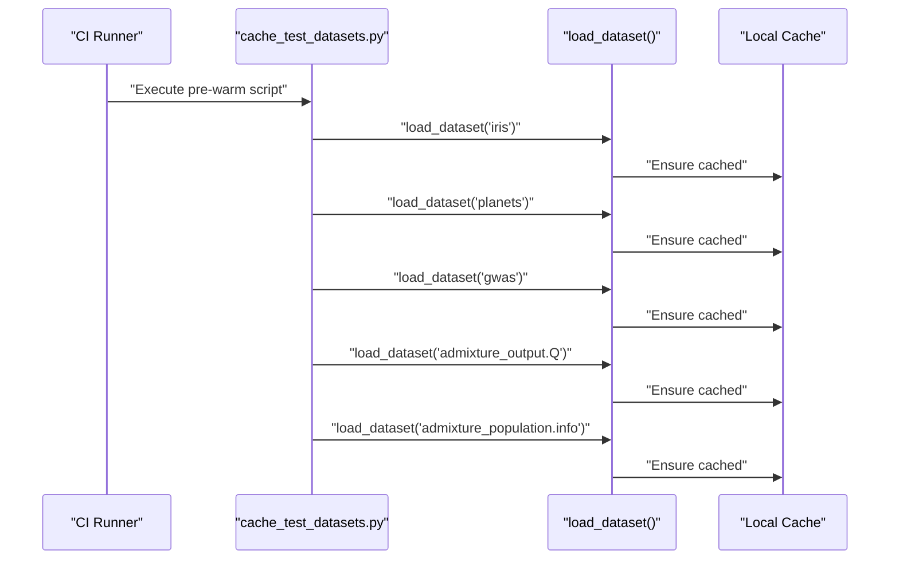
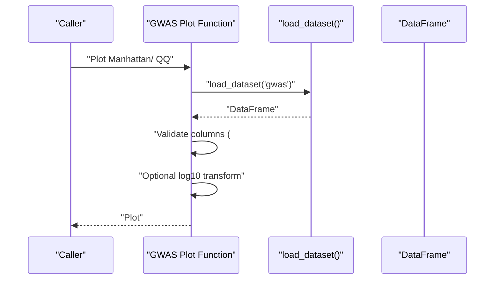
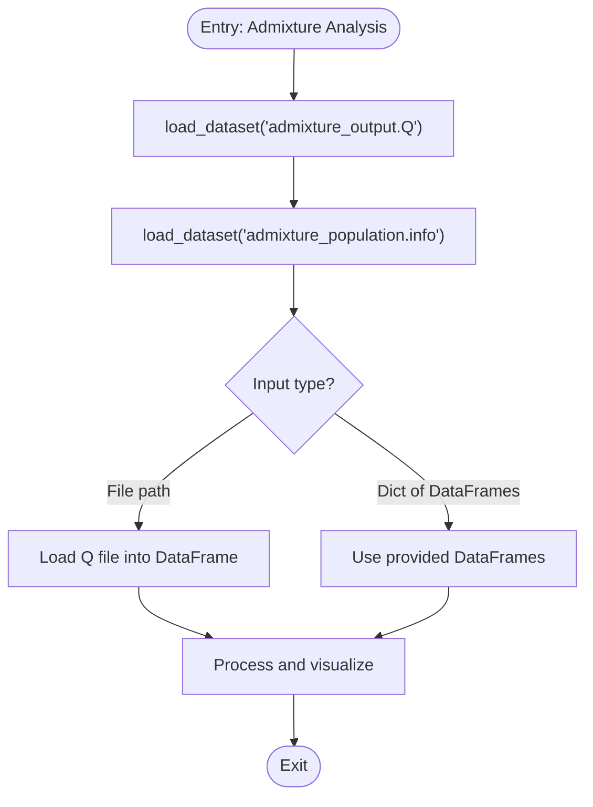
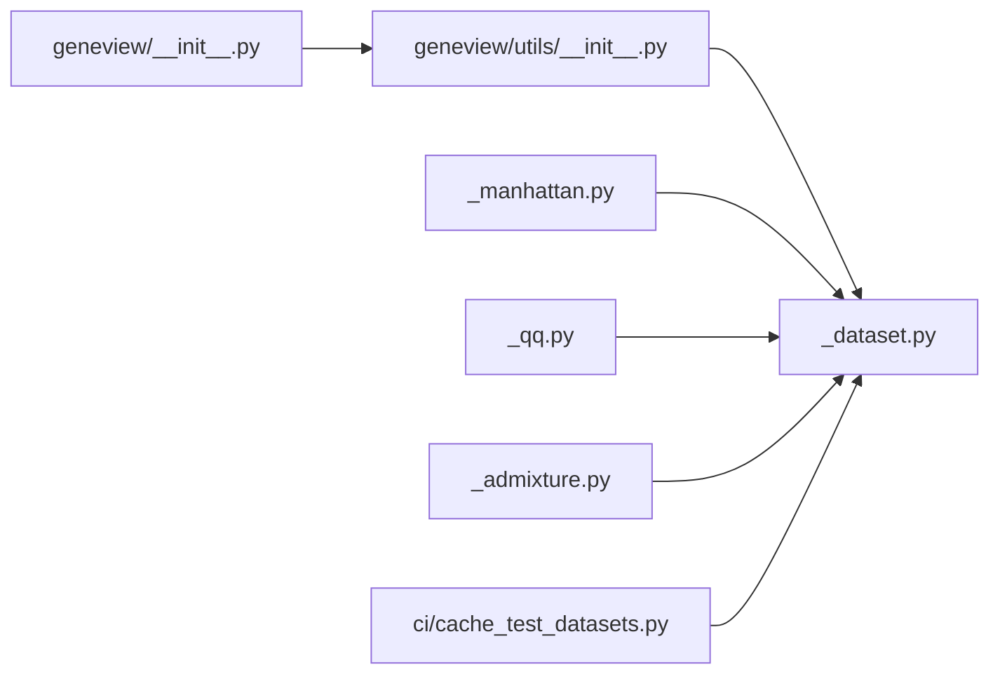

# Dataset Loading System

<cite>
**Referenced Files in This Document**
- [__init__.py](file://geneview/__init__.py)
- [_dataset.py](file://geneview/utils/_dataset.py)
- [cache_test_datasets.py](file://ci/cache_test_datasets.py)
- [_manhattan.py](file://geneview/gwas/_manhattan.py)
- [_qq.py](file://geneview/gwas/_qq.py)
- [_admixture.py](file://geneview/popgene/_admixture.py)
- [admixture.py](file://examples/scripts/admixture.py)
- [README.md](file://README.md)
</cite>

## Table of Contents
1. [Introduction](#introduction)
2. [Project Structure](#project-structure)
3. [Core Components](#core-components)
4. [Architecture Overview](#architecture-overview)
5. [Detailed Component Analysis](#detailed-component-analysis)
6. [Dependency Analysis](#dependency-analysis)
7. [Performance Considerations](#performance-considerations)
8. [Troubleshooting Guide](#troubleshooting-guide)
9. [Conclusion](#conclusion)

## Introduction
This document explains GeneView’s dataset loading and management system with a focus on:
- Online repository integration for accessing public genomics datasets
- Local file handling for common genomics formats
- Standardization and preprocessing workflows
- Caching mechanisms for performance optimization
- Practical examples, error handling, and best practices for large-scale genomics datasets

## Project Structure
GeneView organizes dataset-related functionality primarily under the utils module, while higher-level plotting and analysis modules consume standardized datasets. The CI layer pre-warms caches to avoid race conditions during parallelized testing.

**Diagram sources**
- [__init__.py:1-20](file://geneview/__init__.py#L1-L20)
- [_dataset.py:1-120](file://geneview/utils/_dataset.py#L1-L120)
- [_manhattan.py:140-160](file://geneview/gwas/_manhattan.py#L140-L160)
- [_qq.py:130-150](file://geneview/gwas/_qq.py#L130-L150)
- [_admixture.py:250-260](file://geneview/popgene/_admixture.py#L250-L260)
- [cache_test_datasets.py:1-20](file://ci/cache_test_datasets.py#L1-L20)

**Section sources**
- [__init__.py:1-20](file://geneview/__init__.py#L1-L20)
- [_dataset.py:1-120](file://geneview/utils/_dataset.py#L1-L120)
- [cache_test_datasets.py:1-20](file://ci/cache_test_datasets.py#L1-L20)

## Core Components
- Dataset loader: Provides centralized access to public datasets via an online repository and supports local file handling and CSV parsing with automatic cleanup of trailing null rows.
- CI cache pre-warming: Proactively downloads and stores test datasets locally to reduce contention and improve reliability during parallel test runs.
- Consumer modules: GWAS plotting utilities and admixture analysis rely on the dataset loader to obtain standardized datasets.

Key responsibilities:
- Online access: Resolve dataset names to URLs and fetch content from a remote repository.
- Local handling: Return file paths for non-CSV datasets and parse CSV into pandas DataFrames.
- Standardization: Normalize dataset shapes and remove malformed trailing rows.
- Caching: Store downloaded artifacts under a predictable directory to accelerate repeated loads.

**Section sources**
- [_dataset.py:30-120](file://geneview/utils/_dataset.py#L30-L120)
- [cache_test_datasets.py:1-20](file://ci/cache_test_datasets.py#L1-L20)

## Architecture Overview
The dataset loading pipeline integrates three primary flows:
- Remote CSV download and parse
- Remote file path retrieval
- Local cache lookup and fallback

**Diagram sources**
- [_dataset.py:30-120](file://geneview/utils/_dataset.py#L30-L120)

## Detailed Component Analysis

### Dataset Loader: load_dataset
Responsibilities:
- Resolve dataset names to either CSV or binary file URLs.
- Optionally cache artifacts under a user-specified or default directory.
- Parse CSV files into pandas DataFrames and sanitize trailing null rows.
- Return file paths for non-CSV datasets.

Processing logic highlights:
- URL construction based on presence of an extension.
- Conditional caching with existence checks.
- CSV parsing with post-processing to drop a trailing all-null row if present.
- Non-CSV returns a file path for downstream consumers to process.

**Diagram sources**
- [_dataset.py:30-120](file://geneview/utils/_dataset.py#L30-L120)

**Section sources**
- [_dataset.py:30-120](file://geneview/utils/_dataset.py#L30-L120)

### CI Cache Pre-Warming
Purpose:
- Pre-download commonly used datasets prior to running tests to avoid concurrent downloads and race conditions.

Behavior:
- Iterates over a curated list of dataset identifiers.
- Invokes the dataset loader for each identifier to trigger caching.

**Diagram sources**
- [cache_test_datasets.py:1-20](file://ci/cache_test_datasets.py#L1-L20)

**Section sources**
- [cache_test_datasets.py:1-20](file://ci/cache_test_datasets.py#L1-L20)

### Consumers: GWAS Manhattan and QQ Plot Utilities
These modules demonstrate dataset usage patterns:
- They accept a DataFrame for plotting.
- They validate required columns and enforce expected data types.
- They support optional SNP annotation and log-transformed p-values.

**Diagram sources**
- [_manhattan.py:30-60](file://geneview/gwas/_manhattan.py#L30-L60)
- [_manhattan.py:210-221](file://geneview/gwas/_manhattan.py#L210-L221)
- [_qq.py:130-150](file://geneview/gwas/_qq.py#L130-L150)

**Section sources**
- [_manhattan.py:30-60](file://geneview/gwas/_manhattan.py#L30-L60)
- [_manhattan.py:210-221](file://geneview/gwas/_manhattan.py#L210-L221)
- [_qq.py:130-150](file://geneview/gwas/_qq.py#L130-L150)

### Consumers: Admixture Analysis
Admixture analysis accepts either a file path to a Q matrix or a dictionary of DataFrames. The dataset loader simplifies obtaining the Q file and population metadata.

**Diagram sources**
- [_admixture.py:180-200](file://geneview/popgene/_admixture.py#L180-L200)
- [_admixture.py:250-260](file://geneview/popgene/_admixture.py#L250-L260)

**Section sources**
- [_admixture.py:180-200](file://geneview/popgene/_admixture.py#L180-L200)
- [_admixture.py:250-260](file://geneview/popgene/_admixture.py#L250-L260)

### Example Script: Admixture Workflow
The example script demonstrates end-to-end usage of the dataset loader to obtain the Q file and integrate with downstream analysis.

**Section sources**
- [admixture.py:1-10](file://examples/scripts/admixture.py#L1-L10)

## Dependency Analysis
- Public API exposure: The package initializer re-exports dataset utilities for convenient access.
- Internal dependencies:
  - GWAS plotting modules depend on the dataset loader for standardized datasets.
  - Admixture module depends on the dataset loader for Q and population metadata.
  - CI pre-warming depends on the dataset loader to populate caches.

**Diagram sources**
- [__init__.py:1-20](file://geneview/__init__.py#L1-L20)
- [_dataset.py:1-120](file://geneview/utils/_dataset.py#L1-L120)
- [_manhattan.py:140-160](file://geneview/gwas/_manhattan.py#L140-L160)
- [_qq.py:130-150](file://geneview/gwas/_qq.py#L130-L150)
- [_admixture.py:250-260](file://geneview/popgene/_admixture.py#L250-L260)
- [cache_test_datasets.py:1-20](file://ci/cache_test_datasets.py#L1-L20)

**Section sources**
- [__init__.py:1-20](file://geneview/__init__.py#L1-L20)
- [_dataset.py:1-120](file://geneview/utils/_dataset.py#L1-L120)
- [_manhattan.py:140-160](file://geneview/gwas/_manhattan.py#L140-L160)
- [_qq.py:130-150](file://geneview/gwas/_qq.py#L130-L150)
- [_admixture.py:250-260](file://geneview/popgene/_admixture.py#L250-L260)
- [cache_test_datasets.py:1-20](file://ci/cache_test_datasets.py#L1-L20)

## Performance Considerations
- Caching: Enable caching to avoid repeated network fetches and reduce latency for repeated loads. The cache directory defaults to a user-specific location and can be overridden.
- Batch pre-warming: Use the CI pre-warming script to populate caches before running parallel tests or long pipelines.
- CSV normalization: The loader automatically drops a trailing all-null row for CSV datasets, reducing downstream preprocessing overhead.
- Memory management:
  - Prefer chunked or streaming reads for very large CSVs if extending the loader.
  - Use appropriate dtypes and categorical encodings for categorical columns to reduce memory footprint.
  - Close file handles promptly after reading and avoid holding references to large DataFrames unnecessarily.
- Parallelism: The CI pre-warming mitigates race conditions during parallel test execution by ensuring cache availability.

[No sources needed since this section provides general guidance]

## Troubleshooting Guide
Common issues and resolutions:
- Missing dataset name: Ensure the dataset name corresponds to an existing entry in the remote repository. The loader resolves names to URLs based on whether an extension is present.
- Corrupted or incomplete downloads: Re-run the cache pre-warming script to refresh cached artifacts. The loader will re-fetch if the cached file is absent or corrupted.
- CSV parsing errors: Verify that the dataset is indeed a CSV and that column names match expectations. The loader removes a trailing all-null row, but downstream consumers still require specific columns.
- Column validation failures: GWAS plotting utilities explicitly check for required columns and raise descriptive errors if missing. Confirm that the loaded DataFrame contains the expected columns.

**Section sources**
- [_dataset.py:50-70](file://geneview/utils/_dataset.py#L50-L70)
- [_manhattan.py:210-221](file://geneview/gwas/_manhattan.py#L210-L221)
- [_qq.py:130-150](file://geneview/gwas/_qq.py#L130-L150)

## Conclusion
GeneView’s dataset loading system centralizes access to public genomics datasets, standardizes data formats, and optimizes performance through intelligent caching. By leveraging the dataset loader, consumers such as GWAS plotting utilities and admixture analysis benefit from consistent, reliable, and efficient data ingestion. Adopting the CI pre-warming strategy further improves robustness in parallel environments, while built-in CSV normalization reduces downstream preprocessing effort.

[No sources needed since this section summarizes without analyzing specific files]