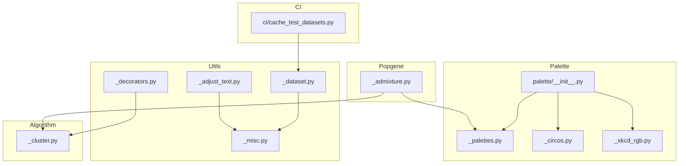
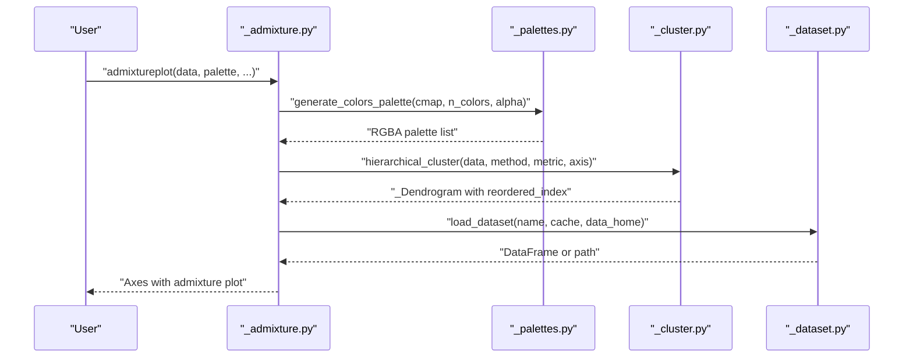
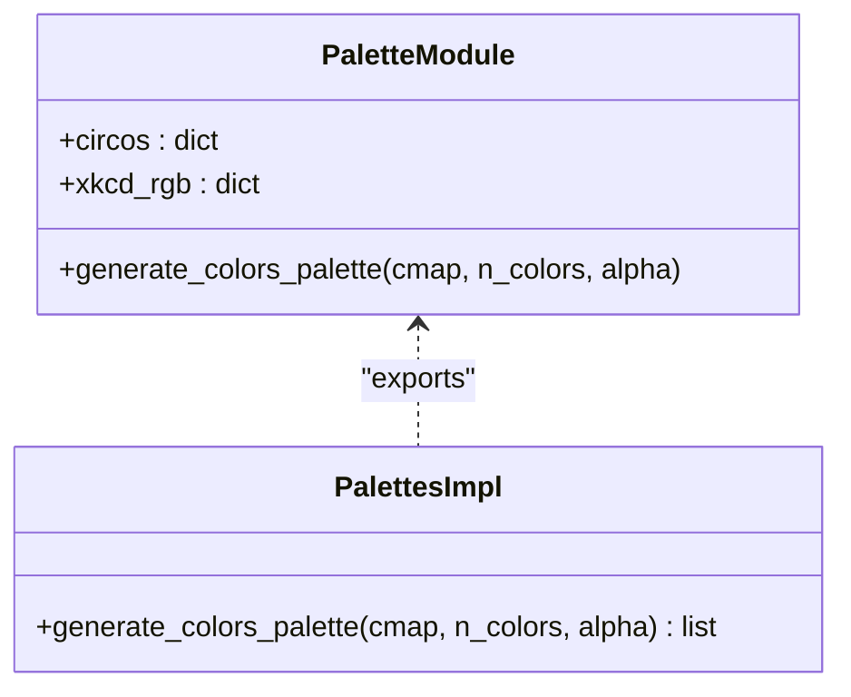
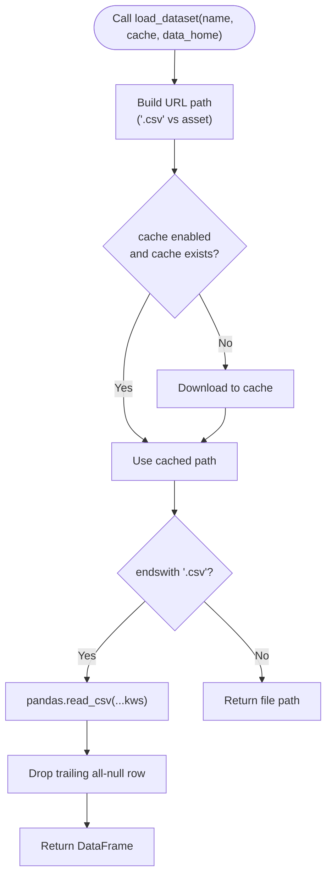
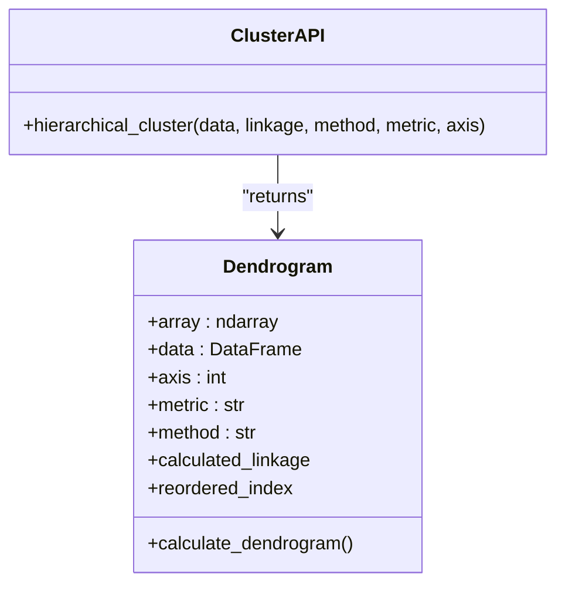
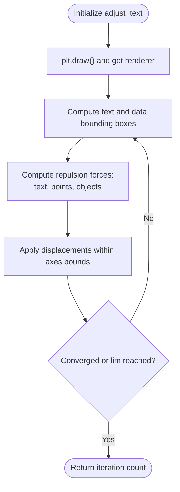
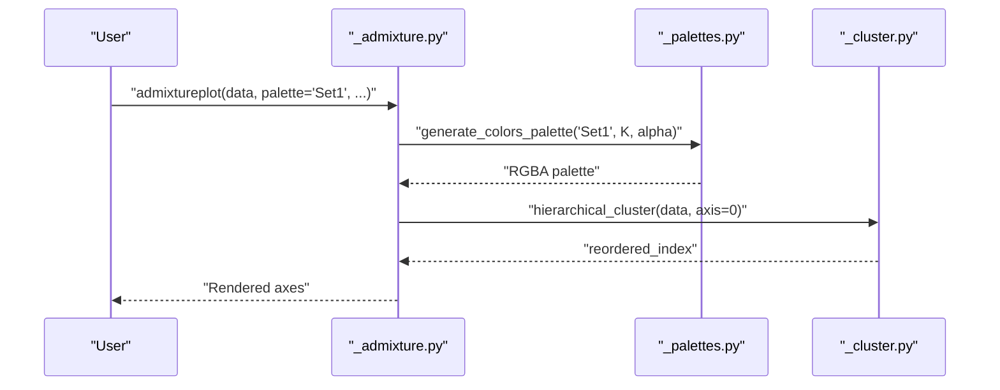
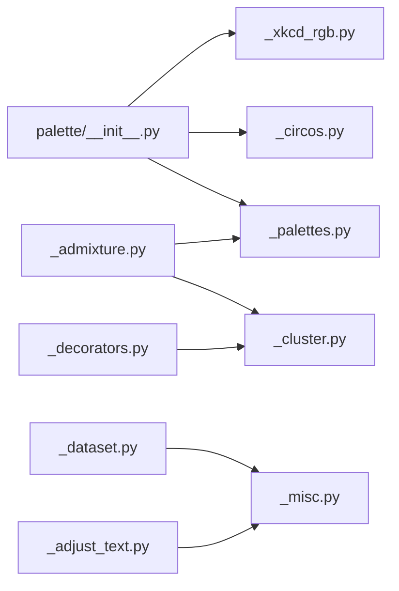

# Visualization Infrastructure

<cite>
**Referenced Files in This Document**
- [palette/__init__.py](file://geneview/palette/__init__.py)
- [_palettes.py](file://geneview/palette/_palettes.py)
- [_circos.py](file://geneview/palette/_circos.py)
- [_xkcd_rgb.py](file://geneview/palette/_xkcd_rgb.py)
- [_dataset.py](file://geneview/utils/_dataset.py)
- [_adjust_text.py](file://geneview/utils/_adjust_text.py)
- [_decorators.py](file://geneview/utils/_decorators.py)
- [_misc.py](file://geneview/utils/_misc.py)
- [_cluster.py](file://geneview/algorithm/_cluster.py)
- [_admixture.py](file://geneview/popgene/_admixture.py)
- [cache_test_datasets.py](file://ci/cache_test_datasets.py)
- [palettes.ipynb](file://docs/tutorial/palettes.ipynb)
- [examples/scripts/admixture.py](file://examples/scripts/admixture.py)
</cite>

## Table of Contents
1. [Introduction](#introduction)
2. [Project Structure](#project-structure)
3. [Core Components](#core-components)
4. [Architecture Overview](#architecture-overview)
5. [Detailed Component Analysis](#detailed-component-analysis)
6. [Dependency Analysis](#dependency-analysis)
7. [Performance Considerations](#performance-considerations)
8. [Troubleshooting Guide](#troubleshooting-guide)
9. [Conclusion](#conclusion)

## Introduction
This document describes GeneView’s visualization infrastructure with a focus on:
- Color palette management: built-in palette creation, custom color schemes, theme integration with Circos color compatibility, and XKCD RGB mappings
- Dataset handling: online repository integration, local data caching, and format standardization
- Algorithmic support: hierarchical clustering, statistical computations, and text adjustment utilities

It provides practical strategies for palette selection, dataset preprocessing workflows, and performance optimization techniques, grounded in the repository’s implementation.

## Project Structure
GeneView organizes visualization infrastructure into modular packages:
- Palette subsystem: color generation, Circos compatibility, and XKCD mappings
- Dataset utilities: remote data retrieval, caching, and standardization
- Algorithmic support: clustering and text adjustment
- Popgenetics plotting: admixture visualization integrating clustering and palette selection

**Diagram sources**
- [palette/__init__.py:1-10](file://geneview/palette/__init__.py#L1-L10)
- [_palettes.py:1-13](file://geneview/palette/_palettes.py#L1-L13)
- [_circos.py:1-236](file://geneview/palette/_circos.py#L1-L236)
- [_xkcd_rgb.py:1-951](file://geneview/palette/_xkcd_rgb.py#L1-L951)
- [_dataset.py:1-88](file://geneview/utils/_dataset.py#L1-L88)
- [_adjust_text.py:1-759](file://geneview/utils/_adjust_text.py#L1-L759)
- [_decorators.py:1-60](file://geneview/utils/_decorators.py#L1-L60)
- [_misc.py:1-43](file://geneview/utils/_misc.py#L1-L43)
- [_cluster.py:1-147](file://geneview/algorithm/_cluster.py#L1-L147)
- [_admixture.py:1-364](file://geneview/popgene/_admixture.py#L1-L364)
- [cache_test_datasets.py:1-15](file://ci/cache_test_datasets.py#L1-L15)

**Section sources**
- [palette/__init__.py:1-10](file://geneview/palette/__init__.py#L1-L10)
- [_dataset.py:1-88](file://geneview/utils/_dataset.py#L1-L88)
- [_cluster.py:1-147](file://geneview/algorithm/_cluster.py#L1-L147)
- [_adjust_text.py:1-759](file://geneview/utils/_adjust_text.py#L1-L759)
- [_admixture.py:1-364](file://geneview/popgene/_admixture.py#L1-L364)
- [cache_test_datasets.py:1-15](file://ci/cache_test_datasets.py#L1-L15)

## Core Components
- Color palette generation: flexible mapping from Matplotlib colormaps or explicit color lists, with alpha control
- Theme integrations: Circos color palette dictionary and XKCD RGB mapping for expressive palettes
- Dataset loading: remote CSV retrieval with local caching and standardized DataFrame output
- Clustering: hierarchical clustering with configurable linkage and metrics, plus fastcluster fallback
- Text adjustment: automatic positioning to minimize overlaps and improve readability
- Popgenetics plotting: admixture visualization with optional clustering and palette selection

**Section sources**
- [_palettes.py:5-12](file://geneview/palette/_palettes.py#L5-L12)
- [_circos.py:24-236](file://geneview/palette/_circos.py#L24-L236)
- [_xkcd_rgb.py:1-951](file://geneview/palette/_xkcd_rgb.py#L1-L951)
- [_dataset.py:22-67](file://geneview/utils/_dataset.py#L22-L67)
- [_cluster.py:19-147](file://geneview/algorithm/_cluster.py#L19-L147)
- [_adjust_text.py:439-759](file://geneview/utils/_adjust_text.py#L439-L759)
- [_admixture.py:17-134](file://geneview/popgene/_admixture.py#L17-L134)

## Architecture Overview
The visualization pipeline integrates palette selection, dataset ingestion, algorithmic computation, and plotting utilities.

**Diagram sources**
- [_admixture.py:168-364](file://geneview/popgene/_admixture.py#L168-L364)
- [_palettes.py:5-12](file://geneview/palette/_palettes.py#L5-L12)
- [_cluster.py:114-147](file://geneview/algorithm/_cluster.py#L114-L147)
- [_dataset.py:22-67](file://geneview/utils/_dataset.py#L22-L67)

## Detailed Component Analysis

### Color Palette Management
- Palette generation:
  - Accepts Matplotlib colormap names or explicit color lists
  - Produces RGBA arrays with configurable alpha
  - Supports arbitrary n_colors for continuous palettes
- Theme integrations:
  - Circos palette: named RGB colors for ideograms, chromosomes, methylation levels, and general hues
  - XKCD RGB: human-friendly color names mapped to hex codes for expressive visuals
- Practical strategies:
  - Use Circos-compatible names for genomic tracks and ideogram themes
  - Leverage XKCD names for exploratory or publication-ready palettes
  - Control transparency via alpha for layered plots

**Diagram sources**
- [palette/__init__.py:1-10](file://geneview/palette/__init__.py#L1-L10)
- [_palettes.py:5-12](file://geneview/palette/_palettes.py#L5-L12)
- [_circos.py:24-236](file://geneview/palette/_circos.py#L24-L236)
- [_xkcd_rgb.py:1-951](file://geneview/palette/_xkcd_rgb.py#L1-L951)

**Section sources**
- [_palettes.py:5-12](file://geneview/palette/_palettes.py#L5-L12)
- [_circos.py:24-236](file://geneview/palette/_circos.py#L24-L236)
- [_xkcd_rgb.py:1-951](file://geneview/palette/_xkcd_rgb.py#L1-L951)
- [palette/__init__.py:1-10](file://geneview/palette/__init__.py#L1-L10)

### Dataset Loading and Caching
- Online repository integration:
  - Enumerates available datasets by scraping repository metadata
  - Loads CSV datasets via URL retrieval and converts to pandas DataFrame
  - Returns file path for non-CSV assets
- Local caching:
  - Stores cached datasets under a configurable directory (~/.geneview-data by default)
  - Reuses cached files on subsequent calls
- Format standardization:
  - Removes trailing all-null rows from CSVs
  - Exposes keyword arguments to pandas.read_csv for customization

**Diagram sources**
- [_dataset.py:22-67](file://geneview/utils/_dataset.py#L22-L67)

**Section sources**
- [_dataset.py:10-88](file://geneview/utils/_dataset.py#L10-L88)
- [cache_test_datasets.py:1-15](file://ci/cache_test_datasets.py#L1-L15)

### Hierarchical Clustering and Statistical Computations
- Hierarchical clustering:
  - Supports configurable linkage method and distance metric
  - Uses fastcluster when available for performance; falls back to SciPy
  - Provides dendrogram leaves ordering for downstream plotting
- Decorators and utilities:
  - Positional argument deprecation helper for API stability
  - Numeric detection utilities for robust preprocessing

**Diagram sources**
- [_cluster.py:19-147](file://geneview/algorithm/_cluster.py#L19-L147)
- [_decorators.py:8-46](file://geneview/utils/_decorators.py#L8-L46)

**Section sources**
- [_cluster.py:19-147](file://geneview/algorithm/_cluster.py#L19-L147)
- [_decorators.py:8-46](file://geneview/utils/_decorators.py#L8-L46)
- [_misc.py:6-43](file://geneview/utils/_misc.py#L6-L43)

### Text Adjustment Utilities
- Automatic positioning:
  - Computes bounding boxes for text and data points
  - Applies repulsion forces to reduce overlaps
  - Supports alignment optimization and boundary constraints
- Practical usage:
  - Call adjust_text after rendering to refine label placement
  - Tune force multipliers and convergence thresholds for complex layouts

**Diagram sources**
- [_adjust_text.py:439-759](file://geneview/utils/_adjust_text.py#L439-L759)

**Section sources**
- [_adjust_text.py:1-759](file://geneview/utils/_adjust_text.py#L1-L759)

### Admixture Plotting Workflow
- Palette-driven visualization:
  - Generates categorical colors for K components
  - Supports custom palettes and alpha blending
- Optional clustering:
  - Performs hierarchical clustering by sample to reorder panels
- Layout and labeling:
  - Places tick labels at top or bottom as requested
  - Configurable y-axis label and styling

**Diagram sources**
- [_admixture.py:168-364](file://geneview/popgene/_admixture.py#L168-L364)
- [_palettes.py:5-12](file://geneview/palette/_palettes.py#L5-L12)
- [_cluster.py:114-147](file://geneview/algorithm/_cluster.py#L114-L147)

**Section sources**
- [_admixture.py:17-134](file://geneview/popgene/_admixture.py#L17-L134)
- [examples/scripts/admixture.py:1-28](file://examples/scripts/admixture.py#L1-L28)
- [palettes.ipynb:1-129](file://docs/tutorial/palettes.ipynb#L1-L129)

## Dependency Analysis
- Palette subsystem exports:
  - generate_colors_palette, circos, xkcd_rgb
- Popgenetics plotting depends on:
  - Palette generation for categorical colors
  - Hierarchical clustering for sample reordering
- Dataset utilities depend on:
  - Environment variables and filesystem for caching
  - Pandas for CSV parsing and standardization
- Algorithmic components depend on:
  - SciPy for linkage computation; fastcluster as optional acceleration
  - Decorators for API stability

**Diagram sources**
- [palette/__init__.py:1-10](file://geneview/palette/__init__.py#L1-L10)
- [_palettes.py:1-13](file://geneview/palette/_palettes.py#L1-L13)
- [_circos.py:1-236](file://geneview/palette/_circos.py#L1-L236)
- [_xkcd_rgb.py:1-951](file://geneview/palette/_xkcd_rgb.py#L1-L951)
- [_admixture.py:1-364](file://geneview/popgene/_admixture.py#L1-L364)
- [_cluster.py:1-147](file://geneview/algorithm/_cluster.py#L1-L147)
- [_dataset.py:1-88](file://geneview/utils/_dataset.py#L1-L88)
- [_adjust_text.py:1-759](file://geneview/utils/_adjust_text.py#L1-L759)
- [_decorators.py:1-60](file://geneview/utils/_decorators.py#L1-L60)
- [_misc.py:1-43](file://geneview/utils/_misc.py#L1-L43)

**Section sources**
- [palette/__init__.py:1-10](file://geneview/palette/__init__.py#L1-L10)
- [_admixture.py:1-364](file://geneview/popgene/_admixture.py#L1-L364)
- [_cluster.py:1-147](file://geneview/algorithm/_cluster.py#L1-L147)
- [_dataset.py:1-88](file://geneview/utils/_dataset.py#L1-L88)
- [_adjust_text.py:1-759](file://geneview/utils/_adjust_text.py#L1-L759)
- [_decorators.py:1-60](file://geneview/utils/_decorators.py#L1-L60)
- [_misc.py:1-43](file://geneview/utils/_misc.py#L1-L43)

## Performance Considerations
- Clustering performance:
  - Prefer fastcluster when available for large matrices; falls back to SciPy with warnings
  - Use appropriate linkage methods and metrics for memory efficiency
- Text adjustment:
  - Tune precision and iteration limits to balance quality and speed
  - Reduce overlapping objects and simplify layout to minimize repulsion iterations
- Dataset caching:
  - Enable caching to avoid repeated network requests
  - Configure cache directory via environment variable for shared environments
- Palette generation:
  - Limit n_colors for continuous palettes to reduce memory footprint
  - Precompute palettes when reused across plots

[No sources needed since this section provides general guidance]

## Troubleshooting Guide
- Remote data retrieval fails:
  - Verify internet connectivity and repository accessibility
  - Check cache directory permissions and environment overrides
- Unexpected palette behavior:
  - Confirm colormap name or provide explicit color list
  - Adjust alpha for layered transparency
- Clustering errors:
  - Install fastcluster for improved performance on large datasets
  - Validate input shape and axis orientation for hierarchical_cluster
- Text overlap persists:
  - Increase iteration limits and force multipliers
  - Manually constrain alignment and boundaries for complex plots

**Section sources**
- [_dataset.py:22-67](file://geneview/utils/_dataset.py#L22-L67)
- [_palettes.py:5-12](file://geneview/palette/_palettes.py#L5-L12)
- [_cluster.py:82-94](file://geneview/algorithm/_cluster.py#L82-L94)
- [_adjust_text.py:439-759](file://geneview/utils/_adjust_text.py#L439-L759)

## Conclusion
GeneView’s visualization infrastructure combines flexible color palette management, robust dataset handling with caching, and efficient algorithmic support. By leveraging Circos and XKCD color dictionaries, hierarchical clustering, and text adjustment utilities, users can build reproducible, publication-ready visualizations for genomics applications. Practical strategies—such as pre-caching datasets, tuning clustering parameters, and optimizing palette choices—ensure reliable performance and maintainable workflows.