# geneview: A python package for genomics data visualization

[](https://pypi.org/project/geneview/)
[](https://badge.fury.io/py/geneview)

[](https://codecov.io/gh/ShujiaHuang/geneview)

**geneview** is a library for making attractive and informative genomic graphics in Python.
It is built on top of matplotlib and tightly integrated with the PyData stack, including
support for `numpy` and `pandas` data structures. And now it is actively developed.

Some of the features that geneview offers are:

- High-level abstractions for structuring grids of plots that let you easily build complex visualizations.
- Functions for visualizing general genomic plots.


## Installation

To install the released version, just do

```bash
pip install geneview
```

This command will install `geneview` and all the dependencies.

## Quick start

### **Manhattan** and **Q-Q** plot

We use a PLINK2.x association output data `gwas.csv` which
is in [geneview-data](https://github.com/ShujiaHuang/geneview-data) directory, 
as the input for the plots below. Here is the format preview of `gwas`:

|**#CHROM**|**POS**|**ID**|**REF**|**ALT**|**A1**|**TEST**|**OBS_CT**|**BETA**|**SE**|**T_STAT**|**P**|
|:-----:|:-----:|:-----:|:-----:|:-----:|:-----:|:-----:|:-----:|:-----:|:-----:|:-----:|:-----:|
|chr1|904165|1\_904165|G|A|A|ADD|282|-0.0908897|0.195476|-0.464967|0.642344|
|chr1|1563691|1\_1563691|T|G|G|ADD|271|0.447021|0.422194|1.0588|0.290715|
|chr1|1707740|1\_1707740|T|G|G|ADD|283|0.149911|0.161387|0.928888|0.353805|
|chr1|2284195|1\_2284195|T|C|C|ADD|275|-0.024704|0.13966|-0.176887|0.859739|
|chr1|2779043|1\_2779043|T|C|T|ADD|272|-0.111771|0.139929|-0.79877|0.425182|
|chr1|2944527|1\_2944527|G|A|A|ADD|276|-0.054472|0.166038|-0.32807|0.743129|
|chr1|3803755|1\_3803755|T|C|T|ADD|283|-0.0392713|0.128528|-0.305547|0.760193|
|chr1|4121584|1\_4121584|A|G|G|ADD|279|0.120902|0.127063|0.951511|0.342239|
|chr1|4170048|1\_4170048|C|T|T|ADD|280|0.250807|0.143423|1.74873|0.0815274|
|chr1|4180842|1\_4180842|C|T|T|ADD|277|0.209195|0.146122|1.43165|0.153469|
|chr1|6053630|1\_6053630|T|G|G|ADD|269|-0.210917|0.129069|-1.63414|0.103503|
|chr1|7569602|1\_7569602|C|T|C|ADD|281|-0.136834|0.13265|-1.03154|0.303249|
|chr1|7575666|1\_7575666|T|C|C|ADD|277|-0.231278|0.159448|-1.45049|0.14815|

#### Manhattan plot with default parameters

The `manhattanplot()` function in **geneview** takes a data frame with
columns containing the chromosomal name/id, chromosomal position,
P-value and optionally the name of SNP(e.g. rsID in dbSNP).

By default, `manhattanplot()` looks for column names corresponding to
those outout by the plink2 association results, namely, `#CHROM`,
`POS`, `P`, and `ID`, although different column names can be
specificed by user. Calling `manhattanplot()` function with a data frame
of GWAS results as the single argument draws a basic manhattan plot,
defaulting to a darkblue and lightblue color scheme.

```python
import matplotlib.pyplot as plt
import geneview as gv

# load data
df = gv.utils.load_dataset("gwas")
# Plot a basic manhattan plot with horizontal xtick labels and the figure will display in screen.
ax = gv.manhattanplot(data=df)
plt.show()
```

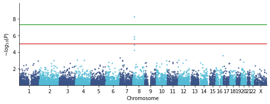

Rotate the x-axis tick label by setting `xticklabel_kws` to avoid label
overlap:

```python
ax = manhattanplot(data=df, xticklabel_kws={"rotation": "vertical"})
```

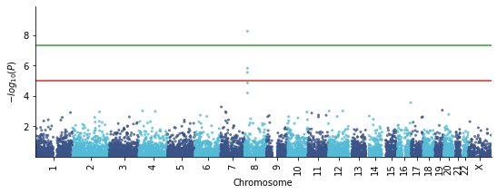

Or rotate the labels 45 degrees by setting `xticklabel_kws={"rotation": 45}`.

When run with default parameters, the `manhattanplot()` function draws
horizontal lines drawn at $-log_{10}{(1e-5)}$ for "**suggestive**"
associations and $-log_{10}{(5e-8)}$ for the "**genome-wide
significant**" threshold. These can be move to different locations or
turned off completely with the arguments `suggestiveline` and
`genomewideline`, respectively.


```python
ax = manhattanplot(data=df,
                   suggestiveline=None,  # Turn off suggestiveline
                   genomewideline=None,  # Turn off genomewideline
                   xticklabel_kws={"rotation": "vertical"})
```

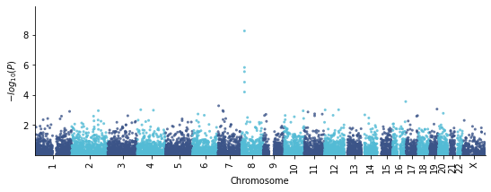

The behavior of the `manhattanplot` function changes slightly when
results from only a single chromosome is used. Here, instead of plotting
alternating colors and chromosome ID on the x-axis, the SNP\'s position
on the chromosome is plotted on the x-axis:

```python
# plot only results of chromosome 8.
manhattanplot(data=df, CHR="chr8", xlabel="Chromosome 8")
```

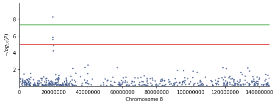

`manhattanplot()` funcion has the ability to highlight SNPs with
significant GWAS signal and annotate the Top SNP, which has the lowest
P-value:


```python
ax = manhattanplot(data=df,
                   sign_marker_p=1e-6,  # highline the significant SNP with ``sign_marker_color`` color.
                   is_annotate_topsnp=True,  # annotate the top SNP
                   xticklabel_kws={"rotation": "vertical"})
```


Additionally, highlighting SNPs of interest can be combined with
limiting to a single chromosome to enable \"zooming\" into a particular
region containing SNPs of interest.

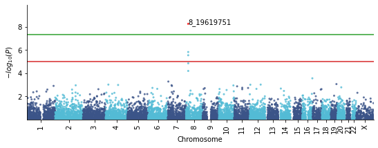

#### Show a better manhattan plot
Futher graphical parameters can be passed to the `manhattanplot()` function 
to control thing like plot title, point character, size, colors, etc. 
Here is the example:

```python
import matplotlib.pyplot as plt
import geneview as gv

# common parameters for plotting
plt_params = {
    "font.sans-serif": "Arial",
    "legend.fontsize": 14,
    "axes.titlesize": 18,
    "axes.labelsize": 16,
    "xtick.labelsize": 14,
    "ytick.labelsize": 14
}
plt.rcParams.update(plt_params)

# Create a manhattan plot
f, ax = plt.subplots(figsize=(12, 4), facecolor="w", edgecolor="k")
xtick = set(["chr" + i for i in list(map(str, range(1, 10))) + ["11", "13", "15", "18", "21", "X"]])
_ = gv.manhattanplot(data=df,
                     marker=".",
                     sign_marker_p=1e-6,  # Genome wide significant p-value
                     sign_marker_color="r",
                     snp="ID",  # The column name of annotation information for top SNPs.

                     title="Test",
                     xtick_label_set=xtick,
                  
                     xlabel="Chromosome",
                     ylabel=r"$-log_{10}{(P)}$",

                     sign_line_cols=["#D62728", "#2CA02C"],
                     hline_kws={"linestyle": "--", "lw": 1.3},

                     is_annotate_topsnp=True,
                     ld_block_size=50000,  # 50000 bp
                     text_kws={"fontsize": 12,
                               "arrowprops": dict(arrowstyle="-", color="k", alpha=0.6)},
                     ax=ax)
```
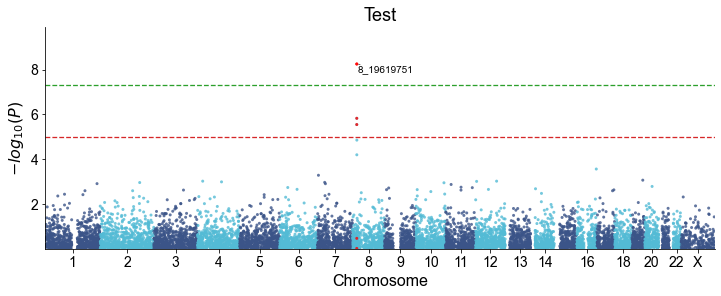


#### QQ plot with default parameters

The `qqplot()` function can be used to generate a Q-Q plot to visualize the 
distribution of association "P-value". The `qqplot()` function takes a vector 
of P-values as its the only required argument.

```python

import matplotlib.pyplot as plt
import geneview as gv

# load data
df = gv.utils.load_dataset("gwas")
# Plot a basic manhattan plot with horizontal xtick labels and the figure will display in screen.
ax = gv.qqplot(data=df["P"])
plt.show()

```

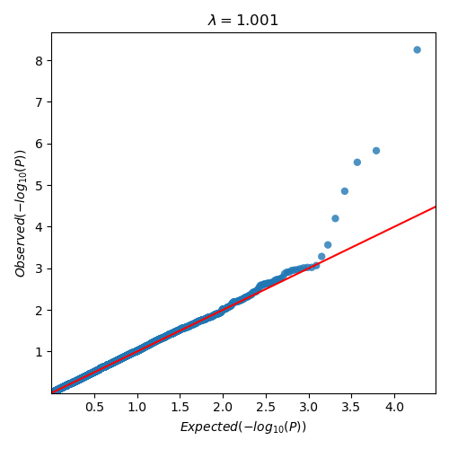

#### Show a better QQ plot

Futher graphical parameters can be passed to ``qqplot()`` to control the plot 
title, axis labels, point characters, colors, points sizes, etc. Here is the 
example:

```python
import matplotlib.pyplot as plt
import geneview as gv

f, ax = plt.subplots(figsize=(6, 6), facecolor="w", edgecolor="k")
_ = gv.qqplot(data=df["P"],
              marker="o",
              title="Test",
              xlabel=r"Expected $-log_{10}{(P)}$",
              ylabel=r"Observed $-log_{10}{(P)}$",
              ax=ax)
```

- [More tutorials about GWAS](./docs/tutorial/gwas_plot.ipynb)

### Admixture plot
Generate **Admixture** plot from the raw admixture output result:

#### simple example for admixtureplot

```python
import matplotlib.pyplot as plt
from geneview.utils import load_dataset
from geneview import admixtureplot

f, ax = plt.subplots(1, 1, figsize=(14, 2), facecolor="w", constrained_layout=True, dpi=300)
admixtureplot(data=load_dataset("admixture_output.Q"), 
              population_info=load_dataset("admixture_population.info"),
              ylabel_kws={"rotation": 45, "ha": "right"},
              ax=ax)
```
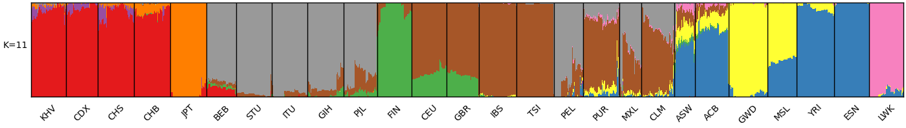

or

```python
import matplotlib.pyplot as plt
import geneview as gv

admixture_output_fn = gv.utils.load_dataset("admixture_output.Q")
population_group_fn = gv.utils.load_dataset("admixture_population.info")

# define the order for population to plot
pop_group_1kg = ["KHV", "CDX", "CHS", "CHB", "JPT", "BEB", "STU", "ITU", "GIH", "PJL", "FIN", 
                 "CEU", "GBR", "IBS", "TSI", "PEL", "PUR", "MXL", "CLM", "ASW", "ACB", "GWD", 
                 "MSL", "YRI", "ESN", "LWK"]

f, ax = plt.subplots(1, 1, figsize=(14, 2), facecolor="w", constrained_layout=True, dpi=300)
gv.popgen.admixtureplot(data=admixture_output_fn, 
                        population_info=population_group_fn,
                        group_order=pop_group_1kg,
                        shuffle_popsample_kws={"frac": 0.5},
                        ylabel_kws={"rotation": 45, "ha": "right"},
                        ax=ax)
```


- [More tutorials about admixtureplot](./docs/tutorial/admixture.ipynb)


### Venn plots

**Venn diagrams for 2, 3, 4, 5, 6 sets.**

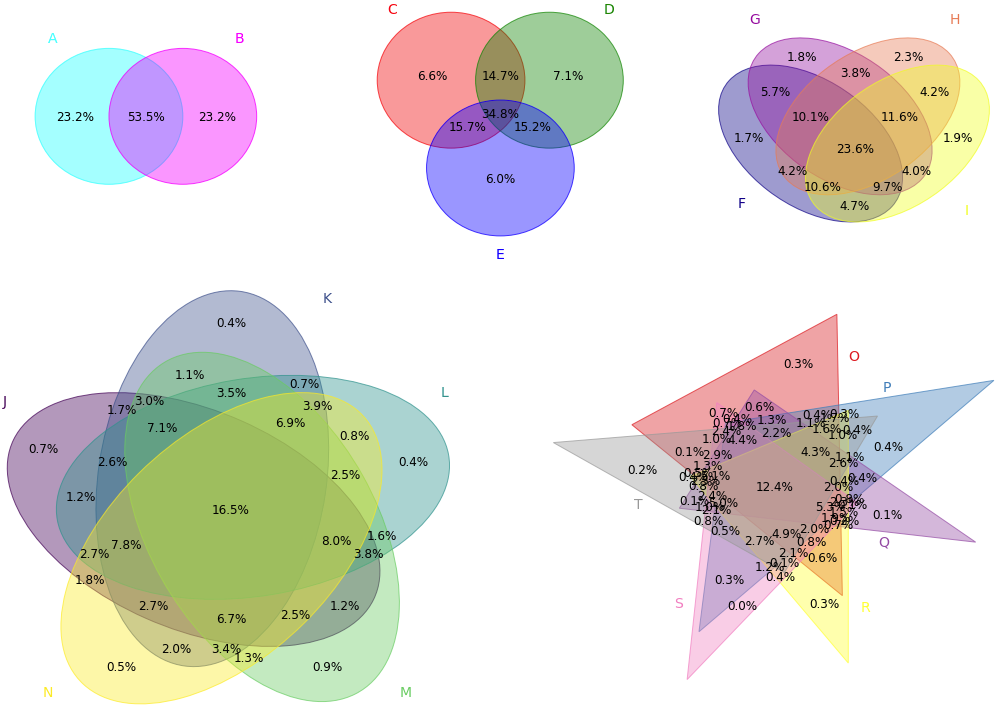

#### Minimal venn plot example

```python
import geneview as gv

table = {
    "Dataset 1": {"A", "B", "D", "E"},
    "Dataset 2": {"C", "F", "B", "G"},
    "Dataset 3": {"J", "C", "K"}
}
ax = gv.venn(table) 

```

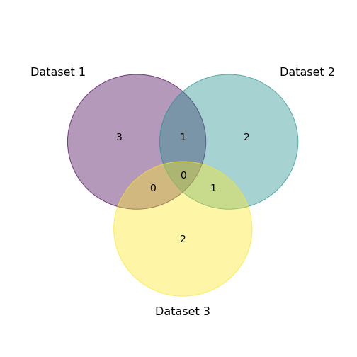

#### Manual adjustment of petal labels
If necessary, the labels on the petals (i.e., various intersections in the 
Venn diagram) can be adjusted manually.

For this, `generate_petal_labels()` can be called first to get the 
`petal_labels` dictionary, which can be modified.

After modification, pass petal_labels to functions `venn()`.

```python
from numpy.random import choice
import geneview as gv

dataset_dict = {
    name: set(choice(1000, 250, replace=False))
    for name in list("ABCD")
}

petal_labels = gv.generate_petal_labels(dataset_dict.values(), fmt="{logic}\n({percentage:.1f}%)") 
ax = gv.venn(data=petal_labels, names=list(dataset_dict.keys()), legend_use_petal_color=True)

```
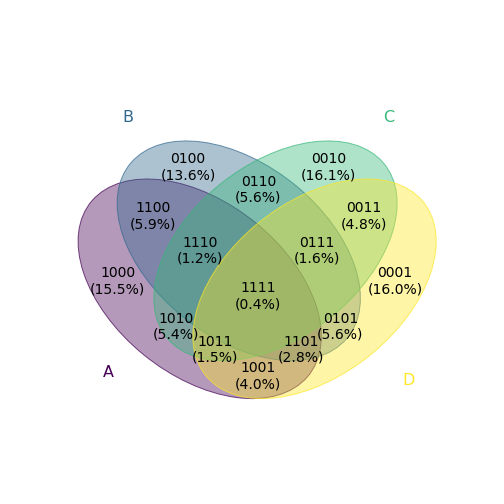

- [More tutorials about venn](./docs/tutorial/venn.ipynb)

## Dependencies

**Geneview** only supports Python 3 and no longer supports Python 2.

Installation requires [numpy](http://www.numpy.org/), 
[scipy](http://www.scipy.org/), 
[pandas](http://pandas.pydata.org/), and 
[matplotlib](http://matplotlib.org/). 
Some functions will use 
[statsmodels](http://statsmodels.sourceforge.net/).


We need the data structures: `DataFrame` and `Series` in **pandas**. 
It's easy and worth to learn, click 
[here](http://pda.readthedocs.org/en/latest/chp5.html) to see more detail 
tutorial for these two data type.

## License

Released under a BSD (3-clause) license
