# geneview: A python package for visualizing genomics data

[](https://pypi.org/project/geneview/)
[](https://badge.fury.io/py/geneview)

[](https://codecov.io/gh/ShujiaHuang/geneview)

**geneview** is a toolkit for making attractive and informative genomics graphics, available as both a **Python library** and a **command-line tool**.
It is built on top of [matplotlib](https://matplotlib.org/) and tightly integrated with the PyData 
stack, including support for `numpy` and `pandas` data structures. And now it is actively developed.

**geneview** provides two ways to use:

- **Python library** — Import `geneview` in your scripts for full programmatic control over genomics figures.
- **Command-line tool** — Run `geneview <subcommand>` directly from the terminal to create publication-quality plots without writing any Python code.

Some of the features that geneview offers are:

- **Manhattan plot** — GWAS association results with significance thresholds, top-SNP annotation, and chromosome zoom.
- **Q-Q plot** — Quantile-quantile plots for P-value distributions with genomic inflation factor (λ).
- **Admixture plot** — Population structure visualization from ADMIXTURE output (.Q files) with hierarchical clustering.
- **Venn diagram** — Set intersection diagrams for 2–6 datasets with customizable petal labels and colors.
- **Karyotype plot** — Cytogenetic band visualization with G-banding color schemes.
- **Genome Tracks** — Gviz-style track browser with IdeogramTrack (chromosome ideogram), AnnotationTrack, GeneRegionTrack (UCSC-style gene models with strand coloring, intron chevron arrows, and left-positioned labels), DataTrack (line/histogram/heatmap + average/confint/smooth/horizon/grid/regression), SequenceTrack (nucleotide display), AlignmentsTrack (BAM/CRAM pileup/sashimi with read direction arrows, strand coloring, clipping, overlap highlighting, read labels, custom color_fn), BAMCoverageTrack (standalone coverage line/fill), VCFTrack (variant display with custom coloring), GroupedAlignmentsTrack (grouped BAM reads), DetailsAnnotationTrack (detail panels), HighlightTrack, and OverlayTrack. BigBed file support included. CLI supports BAM/CRAM, VCF, and all track types directly.
- **Plot Styles** — Built-in journal-compliant styles (**Nature**, **Science**, **Cell**) that configure fonts, sizes, colours, and export settings in a single call.
- **Color palettes** — Curated color schemes (XKCD RGB, Circos, matplotlib colormaps) optimized for genomics figures.
- High-level abstractions for structuring grids of plots that let you easily build complex visualizations.


## Installation

To install the released version, just do

```bash
pip install geneview
```

This command will install `geneview` and all the dependencies.

For genome tracks with BigWig, BAM, and CRAM support:

```bash
pip install geneview[genometracks]
```

### Install from source

```bash
git clone https://github.com/ShujiaHuang/geneview.git
cd geneview
pip install .
```

## Quick start

**geneview** can be used in two ways: as a **command-line tool** for quick plotting without coding, or as a **Python library** for programmatic access.

---

### Command-line interface (CLI)

After installation, the `geneview` command is available in your terminal. Run `geneview --help` to see all available subcommands:

```bash
geneview --help
```

```
subcommands:
  manhattan    Create a Manhattan plot from GWAS association results.
  qq           Create a Q-Q plot from GWAS association results.
  venn         Create a Venn diagram from 2-6 input files.
  admixture    Create an Admixture plot from ADMIXTURE .Q output.
  tracks       Create a genome track plot from BED, GFF, BAM, VCF, or bedGraph files.
```

Use `geneview <subcommand> --help` for detailed options of each command.

#### Manhattan plot

Create a Manhattan plot from a PLINK2.x association output (tab-delimited, with columns `#CHROM`, `POS`, `P`):

```bash
geneview manhattan -i gwas_results.assoc -o manhattan.png
```

Add significance markers and annotate top SNPs:

```bash
geneview manhattan -i gwas_results.assoc -o manhattan.png \
    --title "My GWAS" \
    --sign-marker-p 1e-6 \
    --annotate-topsnp
```

Apply a journal-compliant plot style:

```bash
geneview manhattan -i gwas_results.assoc -o manhattan_nature.png \
    --title "My GWAS" \
    --sign-marker-p 1e-6 \
    --annotate-topsnp \
    --style nature
```

Plot only a specific chromosome:

```bash
geneview manhattan -i gwas_results.assoc --chr chr8 -o manhattan_chr8.png
```

Use CSV input with custom column names:

```bash
geneview manhattan -i gwas.csv --sep "," --chrom CHROM --pos BP --pv PVAL -o manhattan.png
```

#### Q-Q plot

Create a Q-Q plot from a file containing a P-value column:

```bash
geneview qq -i gwas_results.assoc -o qq.png
```

Customize title and appearance:

```bash
geneview qq -i gwas_results.assoc -o qq.png \
    --title "GWAS QQ Plot" \
    --marker "o" --figsize 6 6
```

Apply a Science journal style:

```bash
geneview qq -i gwas_results.assoc -o qq_science.png \
    --title "GWAS QQ Plot" \
    --style science
```

#### Venn diagram

Create a Venn diagram by comparing 2–6 gene/variant list files (one identifier per line):

```bash
geneview venn -i genes_A.txt genes_B.txt -o venn2.png
```

Compare three datasets with custom names and colors:

```bash
geneview venn -i DEG_list1.txt DEG_list2.txt DEG_list3.txt \
    --names "Study A" "Study B" "Study C" \
    --palette plasma \
    --legend-use-petal-color \
    -o venn3.png
```

Apply a Cell journal style:

```bash
geneview venn -i DEG_list1.txt DEG_list2.txt DEG_list3.txt \
    --names "Study A" "Study B" "Study C" \
    --palette plasma \
    --legend-use-petal-color \
    --style cell \
    -o venn3_cell.png
```

#### Admixture plot

Create an Admixture plot from the standard ADMIXTURE `.Q` output and a population info file:

```bash
geneview admixture -i output.3.Q -p population.txt -o admixture.png
```

Customize appearance and specify population order:

```bash
geneview admixture -i output.5.Q -p population.txt \
    --palette Set1 --edgewidth 2.0 \
    --group-order POP1 POP2 POP3 POP4 POP5 \
    --set-xticklabel-top \
    -o admixture_K5.png
```

Apply a Nature journal style:

```bash
geneview admixture -i output.5.Q -p population.txt \
    --palette Set1 --edgewidth 2.0 \
    --group-order POP1 POP2 POP3 POP4 POP5 \
    --set-xticklabel-top \
    --style nature \
    -o admixture_K5_nature.png
```

#### Genome tracks

Create a genome browser-style track plot from BED, GFF, and bedGraph files:

```bash
geneview tracks --region chr7:26490000-26720000 \
    --ideogram \
    -a cpg_islands.bed \
    -g gene_models.gtf \
    -d coverage.bedgraph \
    -o genome_tracks.png
```

Add BAM alignment pileup, BAM coverage, and VCF variant tracks:

```bash
geneview tracks --region chr14:66903600-66905100 \
    --vcf hg002.chr14.vcf.gz \
    -b illumina.chr14.bam --aln-type pileup --paired --aln-color gray \
    --bam-coverage illumina.chr14.bam --coverage-type fill \
    --reference chr14.fa \
    -o vcf_bam_tracks.png
```

Customize data track appearance and add highlight regions:

```bash
geneview tracks --region chr7:26M-27M \
    -d signal.bedgraph --data-type line --data-color blue \
    -a features.bed --annotation-shape box \
    --highlight regions.bed --highlight-fill yellow \
    -o custom_tracks.png
```

Apply a journal-compliant plot style:

```bash
geneview tracks --region chr7:26490000-26720000 \
    --ideogram \
    -a cpg_islands.bed \
    -g gene_models.gtf \
    -d coverage.bedgraph \
    --style nature \
    -o genome_tracks_nature.png
```

---

### Python API

#### **Manhattan** and **Q-Q** plot

We use a PLINK2.x association output data `gwas.csv` which
is in [geneview-data](https://github.com/ShujiaHuang/geneview-data) directory, 
as the input for the plots below. Here is the format preview of `gwas`:

|**#CHROM**|**POS**|**ID**|**REF**|**ALT**|**A1**|**TEST**|**OBS_CT**|**BETA**|**SE**|**T_STAT**|**P**|
|:-----:|:-----:|:-----:|:-----:|:-----:|:-----:|:-----:|:-----:|:-----:|:-----:|:-----:|:-----:|
|chr1|904165|1\_904165|G|A|A|ADD|282|-0.0908897|0.195476|-0.464967|0.642344|
|chr1|1563691|1\_1563691|T|G|G|ADD|271|0.447021|0.422194|1.0588|0.290715|
|chr1|1707740|1\_1707740|T|G|G|ADD|283|0.149911|0.161387|0.928888|0.353805|
|chr1|2284195|1\_2284195|T|C|C|ADD|275|-0.024704|0.13966|-0.176887|0.859739|
|chr1|2779043|1\_2779043|T|C|T|ADD|272|-0.111771|0.139929|-0.79877|0.425182|
|chr1|2944527|1\_2944527|G|A|A|ADD|276|-0.054472|0.166038|-0.32807|0.743129|
|chr1|3803755|1\_3803755|T|C|T|ADD|283|-0.0392713|0.128528|-0.305547|0.760193|
|chr1|4121584|1\_4121584|A|G|G|ADD|279|0.120902|0.127063|0.951511|0.342239|
|chr1|4170048|1\_4170048|C|T|T|ADD|280|0.250807|0.143423|1.74873|0.0815274|
|chr1|4180842|1\_4180842|C|T|T|ADD|277|0.209195|0.146122|1.43165|0.153469|
|chr1|6053630|1\_6053630|T|G|G|ADD|269|-0.210917|0.129069|-1.63414|0.103503|
|chr1|7569602|1\_7569602|C|T|C|ADD|281|-0.136834|0.13265|-1.03154|0.303249|
|chr1|7575666|1\_7575666|T|C|C|ADD|277|-0.231278|0.159448|-1.45049|0.14815|

#### Manhattan plot with default parameters

The `manhattanplot()` function in **geneview** takes a data frame with
columns containing the chromosomal name/id, chromosomal position,
P-value and optionally the name of SNP(e.g. rsID in dbSNP).

By default, `manhattanplot()` looks for column names corresponding to
those outout by the plink2 association results, namely, `#CHROM`,
`POS`, `P`, and `ID`, although different column names can be
specificed by user. Calling `manhattanplot()` function with a data frame
of GWAS results as the single argument draws a basic manhattan plot,
defaulting to a darkblue and lightblue color scheme.

```python
import matplotlib.pyplot as plt
import geneview as gv

# load data
df = gv.load_dataset("gwas")
# Plot a basic manhattan plot with horizontal xtick labels and the figure will display in screen.
ax = gv.manhattanplot(data=df)
plt.show()
```

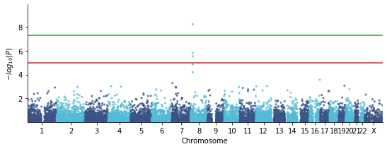

Rotate the x-axis tick label by setting `xticklabel_kws` to avoid label
overlap:

```python
ax = manhattanplot(data=df, xticklabel_kws={"rotation": "vertical"})
```

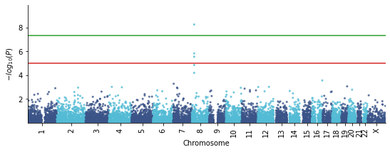

Or rotate the labels 45 degrees by setting `xticklabel_kws={"rotation": 45}`.

When run with default parameters, the `manhattanplot()` function draws
horizontal lines drawn at $-log_{10}{(1e-5)}$ for "**suggestive**"
associations and $-log_{10}{(5e-8)}$ for the "**genome-wide
significant**" threshold. These can be move to different locations or
turned off completely with the arguments `suggestiveline` and
`genomewideline`, respectively.


```python
ax = manhattanplot(data=df,
                   suggestiveline=None,  # Turn off suggestiveline
                   genomewideline=None,  # Turn off genomewideline
                   xticklabel_kws={"rotation": "vertical"})
```

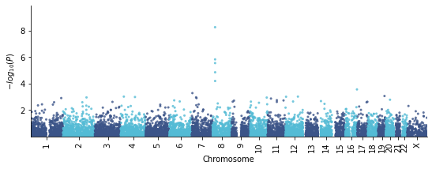

The behavior of the `manhattanplot` function changes slightly when
results from only a single chromosome is used. Here, instead of plotting
alternating colors and chromosome ID on the x-axis, the SNP\'s position
on the chromosome is plotted on the x-axis:

```python
# plot only results of chromosome 8.
manhattanplot(data=df, CHR="chr8", xlabel="Chromosome 8")
```

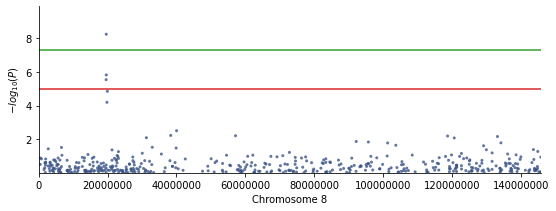

`manhattanplot()` funcion has the ability to highlight SNPs with
significant GWAS signal and annotate the Top SNP, which has the lowest
P-value:


```python
ax = manhattanplot(data=df,
                   sign_marker_p=1e-6,  # highline the significant SNP with ``sign_marker_color`` color.
                   is_annotate_topsnp=True,  # annotate the top SNP
                   xticklabel_kws={"rotation": "vertical"})
```


Additionally, highlighting SNPs of interest can be combined with
limiting to a single chromosome to enable \"zooming\" into a particular
region containing SNPs of interest.

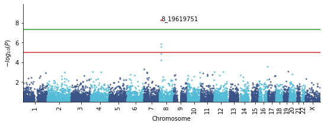

#### Show a better manhattan plot
Futher graphical parameters can be passed to the `manhattanplot()` function 
to control thing like plot title, point character, size, colors, etc. 
Here is the example:

```python
import matplotlib.pyplot as plt
import geneview as gv

# common parameters for plotting
plt_params = {
    "pdf.fonttype": 42,
    "font.sans-serif": "Arial",
    "legend.fontsize": 14,
    "axes.titlesize": 18,
    "axes.labelsize": 16,
    "xtick.labelsize": 14,
    "ytick.labelsize": 14
}
plt.rcParams.update(plt_params)

# Create a manhattan plot
f, ax = plt.subplots(figsize=(12, 4), facecolor="w", edgecolor="k")
xtick = set(["chr" + i for i in list(map(str, range(1, 10))) + ["11", "13", "15", "18", "21", "X"]])
_ = gv.manhattanplot(data=df,
                     marker=".",
                     sign_marker_p=1e-6,  # Genome wide significant p-value
                     sign_marker_color="r",
                     snp="ID",  # The column name of annotation information for top SNPs.

                     title="Test",
                     xtick_label_set=xtick,
                  
                     xlabel="Chromosome",
                     ylabel=r"$-log_{10}{(P)}$",

                     sign_line_cols=["#D62728", "#2CA02C"],
                     hline_kws={"linestyle": "--", "lw": 1.3},

                     is_annotate_topsnp=True,
                     ld_block_size=50000,  # 50000 bp
                     text_kws={"fontsize": 12,
                               "arrowprops": dict(arrowstyle="-", color="k", alpha=0.6)},
                     ax=ax)
```

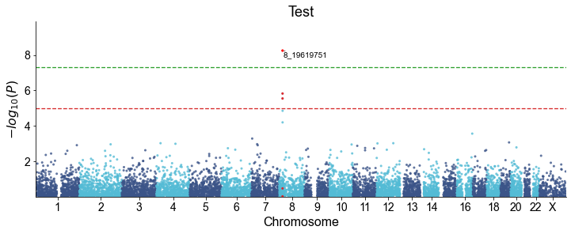

#### Plot Styles for Journal Submission

geneview includes built-in styles that produce figures compliant with the requirements of **Nature**, **Science**, and **Cell**. Each style configures fonts, sizes, colour palettes, figure dimensions, and export settings automatically. Styles work with all plot types — including Manhattan, Q-Q, Venn, Admixture, and **Genome Tracks**.

```python
import geneview as gv

# List available styles
print(gv.list_styles())
# ['cell', 'geneview', 'nature', 'science']

# Apply a style to a single plot
ax = gv.manhattanplot(data=df, style="nature")

# Or use as a context manager
with gv.use_style("science"):
    ax = gv.qqplot(data=df["P"])
    plt.savefig("qq_science.pdf")

# Or set a style globally for all subsequent plots
gv.apply_style("cell")

# Genome tracks in Nature style
from geneview.genometracks import plot_tracks, GenomeAxisTrack, IdeogramTrack, GenomicInterval
region = GenomicInterval("chr7", 20_000_000, 60_000_000)
axes = plot_tracks([IdeogramTrack(chromosome="chr7"), GenomeAxisTrack()], region=region, style="nature")
```

| Style | Description | Font size | Figure width | Palette |
|-------|-------------|-----------|--------------|--------|
| `geneview` | Default — readable, general-purpose | 10–12 pt | 9 in | geneview legacy |
| `nature` | Nature Research Figure Guide | 5–7 pt | 3.5 in | Wong (colour-blind safe) |
| `science` | AAAS *Science* guidelines | 6–10 pt | 2.36 in | Okabe–Ito |
| `cell` | Cell Press guidelines | 6–8 pt | 3.35 in | Cell accessible |

You can also define and register your own custom style:

```python
from geneview.plotstyle import PlotStyle, register_style

my_style = PlotStyle(
    name="my_journal",
    font_size_title=9.0,
    font_size_label=8.0,
    figure_figsize=(4.0, 3.0),
    color_palette=["#1f77b4", "#ff7f0e", "#2ca02c"],
)
register_style(my_style)
ax = gv.manhattanplot(data=df, style="my_journal")
```

See the [Plot Styles tutorial](./docs/tutorial/plotstyle.ipynb) for a full walkthrough.

#### QQ plot with default parameters

The `qqplot()` function can be used to generate a Q-Q plot to visualize the 
distribution of association "P-value". The `qqplot()` function takes a vector 
of P-values as its the only required argument.

```python

import matplotlib.pyplot as plt
import geneview as gv

# load data
df = gv.load_dataset("gwas")
# Plot a basic manhattan plot with horizontal xtick labels and the figure will display in screen.
ax = gv.qqplot(data=df["P"])
plt.show()

```

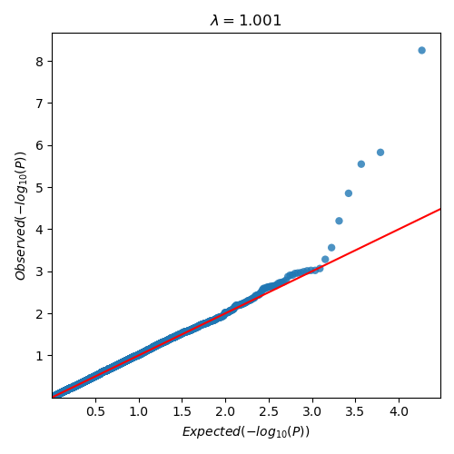

#### Show a better QQ plot

Futher graphical parameters can be passed to ``qqplot()`` to control the plot 
title, axis labels, point characters, colors, points sizes, etc. Here is the 
example:

```python
import matplotlib.pyplot as plt
import geneview as gv

f, ax = plt.subplots(figsize=(6, 6), facecolor="w", edgecolor="k")
_ = gv.qqplot(data=df["P"],
              marker="o",
              title="Test",
              xlabel=r"Expected $-log_{10}{(P)}$",
              ylabel=r"Observed $-log_{10}{(P)}$",
              ax=ax)
```

- [More tutorials about GWAS](./docs/tutorial/gwas_plot.ipynb)

### Admixture plot

Generate **Admixture** plot from the raw admixture output result:

#### simple example for admixtureplot

```python
import matplotlib.pyplot as plt
from geneview import load_dataset
from geneview import admixtureplot

f, ax = plt.subplots(1, 1, figsize=(14, 2), facecolor="w", constrained_layout=True, dpi=300)
admixtureplot(data=load_dataset("admixture_output.Q"), 
              population_info=load_dataset("admixture_population.info"),
              ylabel_kws={"rotation": 45, "ha": "right"},
              ax=ax)
```

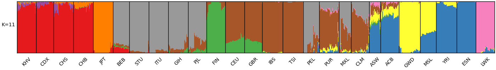

or

```python
import matplotlib.pyplot as plt
import geneview as gv

admixture_output_fn = gv.load_dataset("admixture_output.Q")
population_group_fn = gv.load_dataset("admixture_population.info")

# define the order for population to plot
pop_group_1kg = ["KHV", "CDX", "CHS", "CHB", "JPT", "BEB", "STU", "ITU", "GIH", "PJL", "FIN", 
                 "CEU", "GBR", "IBS", "TSI", "PEL", "PUR", "MXL", "CLM", "ASW", "ACB", "GWD", 
                 "MSL", "YRI", "ESN", "LWK"]

f, ax = plt.subplots(1, 1, figsize=(14, 2), facecolor="w", constrained_layout=True, dpi=300)
gv.admixtureplot(data=admixture_output_fn, 
                        population_info=population_group_fn,
                        edgewidth=2.0,
                        group_order=pop_group_1kg,
                        shuffle_popsample_kws={"frac": 0.5},
                        ylabel_kws={"rotation": 45, "ha": "right"},
                        ax=ax)
```


- [The format of input files and more details about admixtureplot](./docs/tutorial/admixture.ipynb)

### Venn plots

**Venn diagrams for 2, 3, 4, 5, 6 sets.**

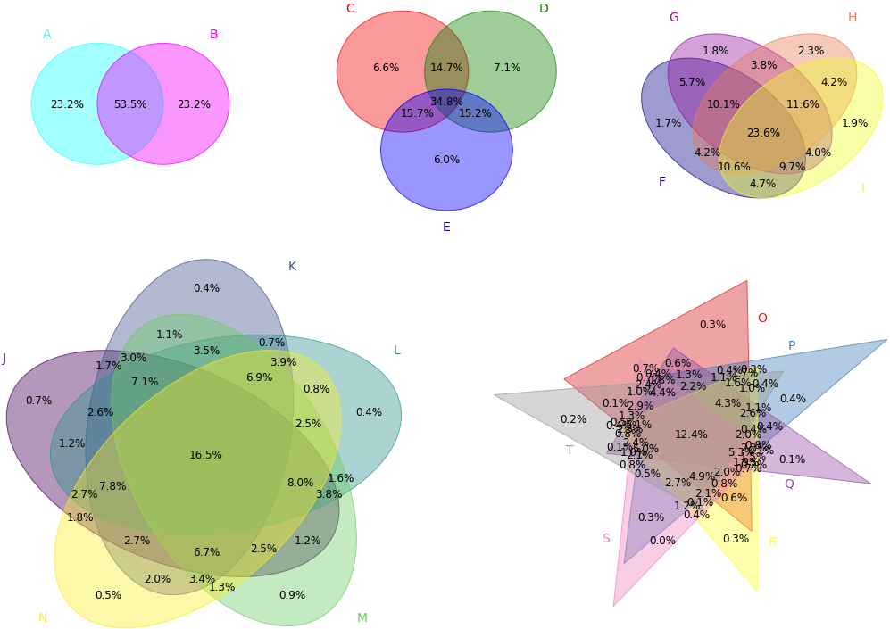

#### Minimal venn plot example

```python
import geneview as gv

table = {
    "Dataset 1": {"A", "B", "D", "E"},
    "Dataset 2": {"C", "F", "B", "G"},
    "Dataset 3": {"J", "C", "K"}
}
ax = gv.venn(table) 

```

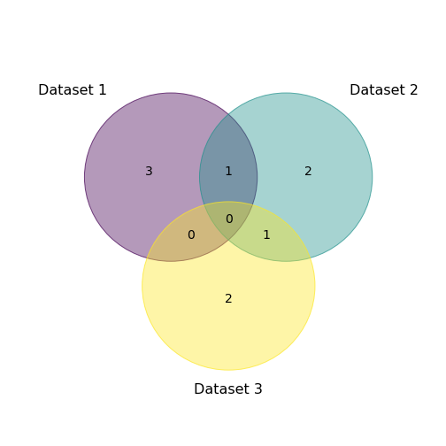

#### Manual adjustment of petal labels

If necessary, the labels on the petals (i.e., various intersections in the Venn diagram) can be adjusted manually.

For this, `generate_petal_labels()` can be called first to get the 
`petal_labels` dictionary, which can be modified.

After modification, pass petal_labels to functions `venn()`.

```python
from numpy.random import choice
import geneview as gv

dataset_dict = {
    name: set(choice(1000, 250, replace=False))
    for name in list("ABCD")
}

petal_labels = gv.generate_petal_labels(dataset_dict.values(), fmt="{logic}\n({percentage:.1f}%)") 
ax = gv.venn(data=petal_labels, names=list(dataset_dict.keys()), legend_use_petal_color=True)

```

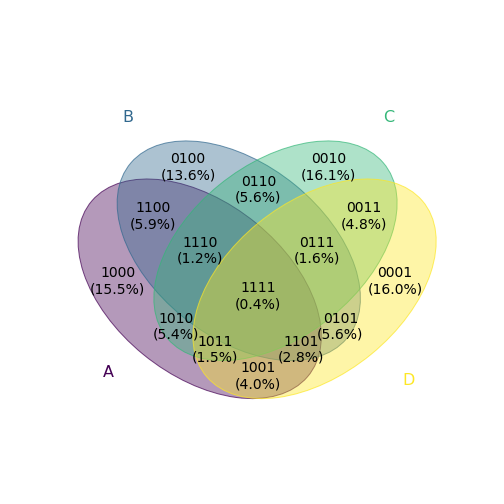

- [More tutorials about venn](./docs/tutorial/venn.ipynb)

### Genome Tracks

The **genome tracks** module provides a Gviz-inspired track browser for visualizing genomic features along a shared coordinate axis. Gene models are rendered in **UCSC Genome Browser style** (thick CDS blocks, thin UTR blocks, intron lines with directional chevron arrows, strand-based coloring, and left-positioned gene labels). Read alignments show **directional block arrows** indicating each read's orientation. It supports multiple track types including IdeogramTrack (chromosome ideogram), AnnotationTrack, GeneRegionTrack, DataTrack, SequenceTrack, AlignmentsTrack, BAMCoverageTrack, VCFTrack, GroupedAlignmentsTrack, DetailsAnnotationTrack, HighlightTrack, and OverlayTrack.

#### IdeogramTrack — Chromosome ideogram (auto-loaded)

`IdeogramTrack` automatically downloads human karyotype data (hg38 or hg19) from the geneview-data repository — no manual data preparation needed:

```python
from geneview.genometracks import IdeogramTrack, GenomeAxisTrack, GenomicInterval, plot_tracks
import matplotlib.pyplot as plt

# Auto-load hg38 karyotype for chromosome 7
itrack = IdeogramTrack(chromosome="chr7")
gtrack = GenomeAxisTrack()

region = GenomicInterval("chr7", 20_000_000, 60_000_000)
axes = plot_tracks([itrack, gtrack], region=region, figsize=(12, 3))
plt.show()
```

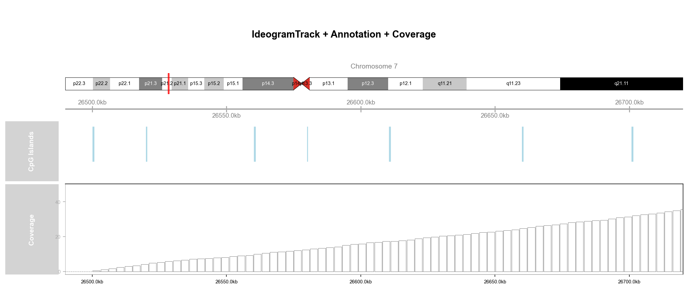

#### Comprehensive genome tracks example

Combine all track types into a multi-panel figure:

```python
from geneview.genometracks import (
    IdeogramTrack, GenomeAxisTrack, AnnotationTrack,
    GeneRegionTrack, DataTrack, HighlightTrack,
    GenomicInterval, plot_tracks, read_bed, read_gff, read_bedgraph,
)
import pandas as pd

# Load data
cpg_data = read_bed("examples/data/genome_tracks/cpg_islands.bed")
gene_data = read_gff("examples/data/genome_tracks/gene_models.gtf")
cov_data = read_bedgraph("examples/data/genome_tracks/coverage.bedgraph")

region = GenomicInterval("chr7", 26_490_000, 26_720_000)

# Create tracks
itrack = IdeogramTrack(chromosome="chr7")
gtrack = GenomeAxisTrack(little_ticks=True)
atrack = AnnotationTrack(cpg_data, name="CpG Islands")
grtrack = GeneRegionTrack(gene_data, name="Gene Models", collapse_transcripts="longest")
dtrack = DataTrack(cov_data, type="histogram", name="Coverage")

# Add highlights
ht = HighlightTrack(
    regions=pd.DataFrame({
        "chrom": ["chr7", "chr7"],
        "start": [26_505_000, 26_600_000],
        "end":   [26_535_000, 26_665_000],
    }),
    track_list=[atrack, grtrack, dtrack],
    fill="#FFF3BF", alpha=0.3,
)

# Plot
axes = plot_tracks([itrack, gtrack, ht], region=region, figsize=(16, 10))
plt.show()
```

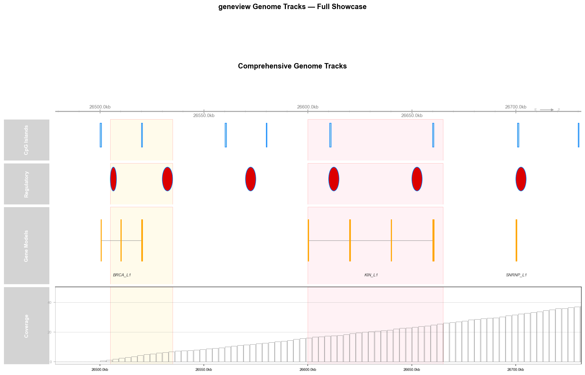

- [Complete genome tracks guide](./docs/genome_tracks_guide.md)
- [Genome tracks tutorial notebook](./docs/tutorial/genome_tracks.ipynb)
- [Plot styles tutorial](./docs/tutorial/plotstyle.ipynb)
- [More example scripts](./examples/scripts/)

#### BAM / CRAM coverage

Compute alignment coverage from BAM or CRAM files and visualize as a DataTrack:

```python
from geneview.genometracks import (
    GenomeAxisTrack, DataTrack, GenomicInterval, plot_tracks,
    read_bam_coverage, read_cram_coverage,
)
import matplotlib.pyplot as plt

region = GenomicInterval("chr7", 26_500_000, 26_800_000)

# BAM (must be indexed with samtools index)
bam_cov = read_bam_coverage("sample.bam", region=region)
bam_track = DataTrack(bam_cov, type="histogram", name="BAM Coverage")

# CRAM (reference FASTA usually required)
cram_cov = read_cram_coverage("sample.cram", region=region, reference="hg38.fa")
cram_track = DataTrack(cram_cov, type="histogram", name="CRAM Coverage")

axes = plot_tracks([GenomeAxisTrack(), bam_track, cram_track], region=region, figsize=(14, 6))
plt.show()
```

#### SequenceTrack — Nucleotide display

Display nucleotide sequences as colored letters, boxes, or lines depending on zoom level:

```python
from geneview.genometracks import SequenceTrack, GenomeAxisTrack, GenomicInterval, plot_tracks

seq = "ATCGATCGATCGATCG" * 5
track = SequenceTrack(sequence=seq, name="Sequence")
axes = plot_tracks([GenomeAxisTrack(), track],
                   region=GenomicInterval("chr1", 0, len(seq)), figsize=(12, 3))
```

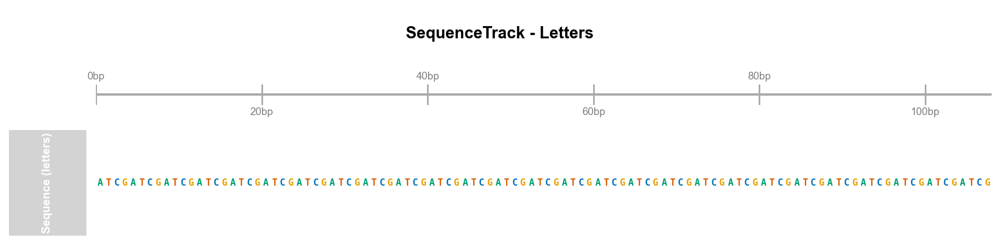

#### AlignmentsTrack — BAM/CRAM read alignments

Visualize read alignments with coverage histograms, pileup diagrams, and sashimi plots. Each read is drawn as a directional block arrow indicating its alignment orientation (requires `pysam`):

```python
from geneview.genometracks import AlignmentsTrack, GenomeAxisTrack, GenomicInterval, plot_tracks

track = AlignmentsTrack(filepath="alignments.bam", type=["coverage", "pileup"])
axes = plot_tracks([GenomeAxisTrack(), track],
                   region=GenomicInterval("chr12", 2966800, 2966950), figsize=(12, 6))
```

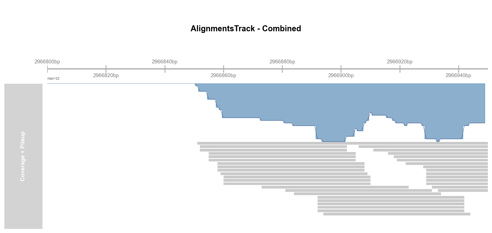

#### BAMCoverageTrack — Standalone BAM coverage

Display per-base coverage from a BAM/CRAM file as a continuous line or filled area:

```python
from geneview.genometracks import BAMCoverageTrack, GenomeAxisTrack, GenomicInterval, plot_tracks

cov = BAMCoverageTrack(filepath="alignments.bam", type="fill", col="#4CAF50")
axes = plot_tracks([GenomeAxisTrack(), cov],
                   region=GenomicInterval("chr7", 26_500_000, 26_800_000), figsize=(14, 4))
```

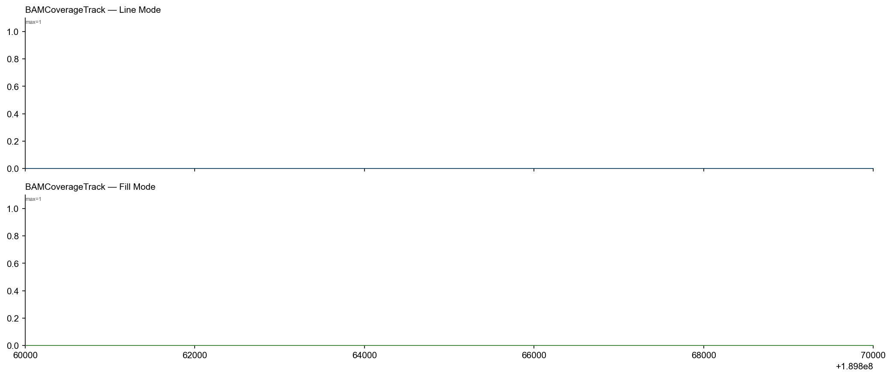

#### VCFTrack — Variant display

Display SNPs and other variants from a VCF/BCF file as colored rectangles, with custom coloring by alt allele or quality:

```python
from geneview.genometracks import VCFTrack, GenomeAxisTrack, GenomicInterval, plot_tracks

tracks = [
    GenomeAxisTrack(),
    VCFTrack("sample.vcf.gz", name="SNPs"),
]
axes = plot_tracks(tracks, region=GenomicInterval("14", 66903600, 66905100))
```

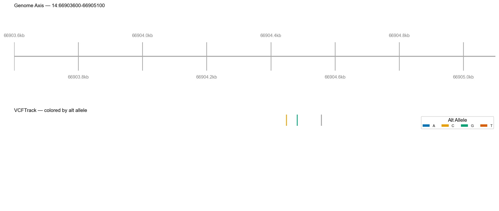

#### Custom read coloring (color_fn)

Color each read individually using a callback function — useful for coloring by insert size, mapping quality, or as a gray backdrop for variant display:

```python
from geneview.genometracks import AlignmentsTrack

# Color by insert size
def color_by_insert_size(read):
    isize = abs(read.template_length)
    if isize < 100 or isize > 1500:
        return "red"
    if isize > 550:
        return "blue"
    return "green"

aln = AlignmentsTrack("paired_end.bam", type="pileup", is_paired=True,
                      color_fn=color_by_insert_size)
```

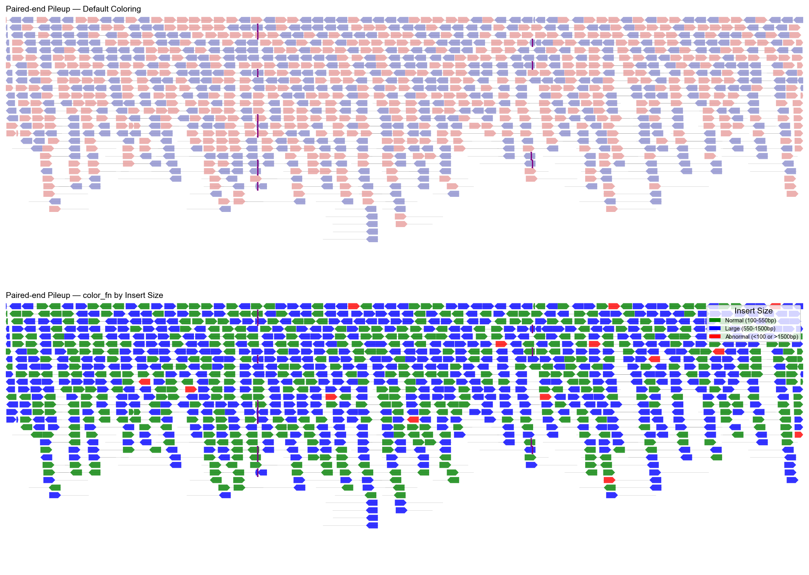

#### DetailsAnnotationTrack — Annotation with detail panels

Extend AnnotationTrack with detail panels below features:

```python
from geneview.genometracks import DetailsAnnotationTrack, GenomeAxisTrack, GenomicInterval, plot_tracks
import pandas as pd

data = pd.DataFrame({
    "chrom": ["chr7"] * 3, "start": [1000, 2000, 3000],
    "end": [1500, 2800, 3600], "name": ["geneA", "geneB", "geneC"],
})
track = DetailsAnnotationTrack(data, name="Details")
axes = plot_tracks([GenomeAxisTrack(), track],
                   region=GenomicInterval("chr7", 800, 4000), figsize=(12, 4))
```

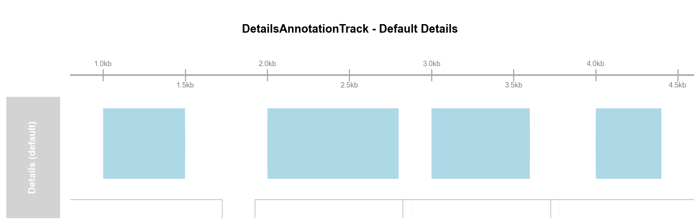

#### Extended DataTrack plot types

DataTrack supports additional plot types: average (`"a"`), confidence interval (`"confint"`), LOWESS smooth (`"smooth"`), horizon plot (`"horizon"`), grid (`"g"`), regression (`"r"`), and composite types:

```python
from geneview.genometracks import DataTrack

# Composite: boxplot + average + grid
dtrack = DataTrack(data, type=["boxplot", "a", "g"], name="Composite")
```

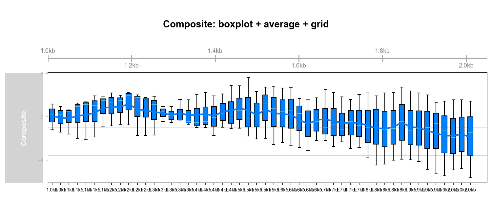

#### Color schemes

Apply predefined color schemes to gene and annotation tracks:

```python
axes = plot_tracks([grtrack], region=region, scheme="genes")
```

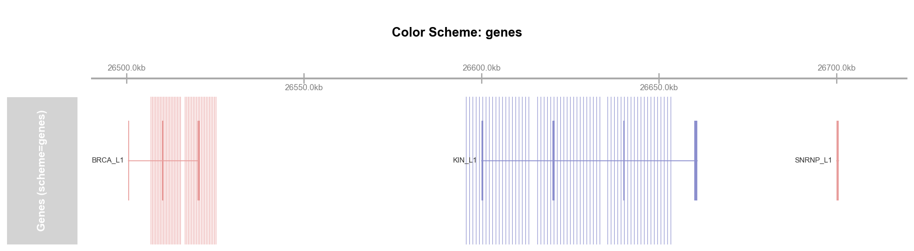

#### Export tracks

Export track data to BED, GFF, bedGraph, or WIG format:

```python
from geneview.genometracks import export_tracks
export_tracks(track, "output.bed", fmt="bed")
```

### Karyotype plot

**Karyotype** plots display cytogenetic bands with standard G-banding stain colors.

```python
import matplotlib.pyplot as plt
import geneview as gv

k_fn = gv.load_dataset("karyotype_human_hg19.txt")
fig, ax = plt.subplots(figsize=(20, 5))
_ = gv.karyoplot(k_fn, ax=ax)
plt.show()
```

## Documentation

Comprehensive documentation is available:

- [User Guide](./docs/user_guide.md) — Overview of all features with examples
- [Plot Styles](./docs/user_guide.md#plot-styles) — Journal-compliant figure styles (Nature, Science, Cell)
- [Genome Tracks Guide](./docs/genome_tracks_guide.md) — Detailed guide for the genome tracks module
- [Tutorial Notebooks](./docs/tutorial/) — Jupyter notebooks for GWAS, Venn, Admixture, Palettes, Genome Tracks, and Plot Styles
- [API Reference](./docs/user_guide.md#api-reference) — Function and class reference

## Dependencies

**Geneview** supports Python 3.8+ and requires the following packages:

- [numpy](http://www.numpy.org/)
- [scipy](http://www.scipy.org/)
- [pandas](http://pandas.pydata.org/)
- [matplotlib](http://matplotlib.org/)
- [seaborn](https://seaborn.pydata.org/)

Optional dependencies for genome tracks (BigWig, BAM, CRAM support):

```bash
pip install geneview[genometracks]  # installs pyranges, pyBigWig, pysam
```

## Citation

If you use **geneview** in your research, please cite:

> Huang, S. geneview: A python package for visualizing genomics data. https://github.com/ShujiaHuang/geneview

## License

Released under a [GPL-3.0 license](./LICENSE).
