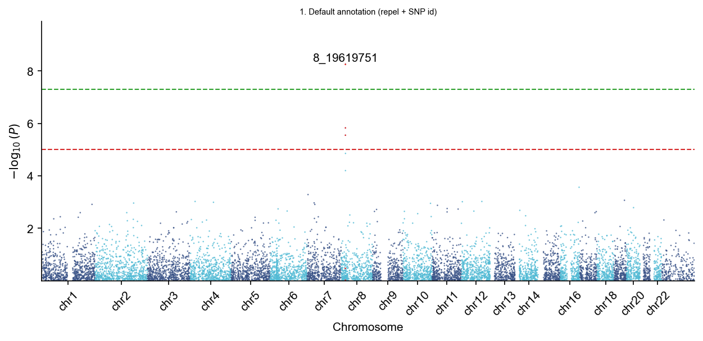
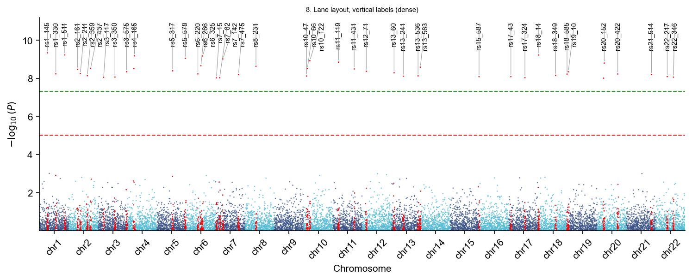
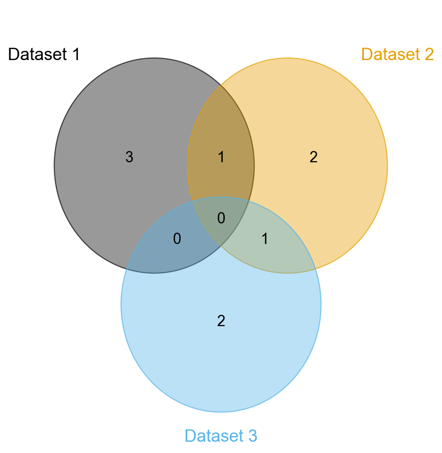
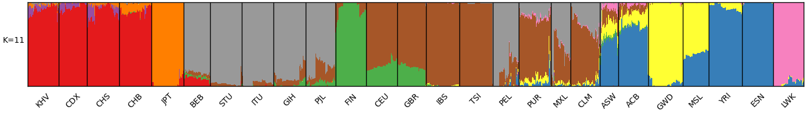
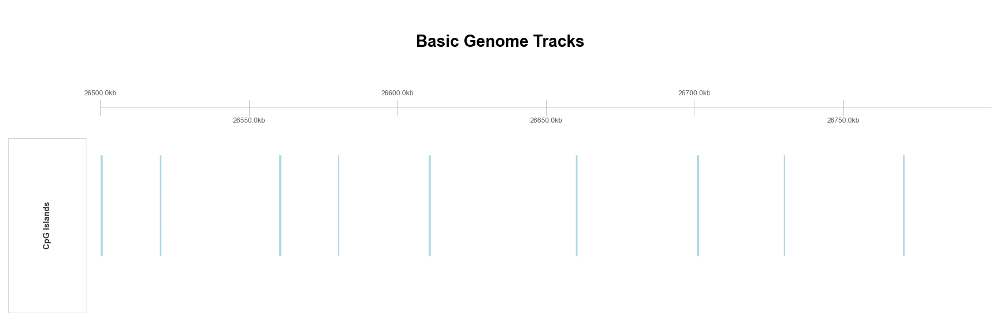

# geneview Command-Line Interface

After installing geneview, a `geneview` command becomes available in your terminal, so you can produce publication-quality figures **without writing any Python**. This page is the canonical reference for every subcommand and option.

```bash
geneview --help                 # list all subcommands
geneview <subcommand> --help    # full options for one subcommand
geneview --version              # print the installed version
```

```text
subcommands:
  manhattan    Create a Manhattan plot from GWAS association results.
  qq           Create a Q-Q plot from GWAS association results.
  venn         Create a Venn diagram from 2-6 input files.
  admixture    Create an Admixture plot from ADMIXTURE .Q output.
  tracks       Create a genome track plot from BED, GFF, BAM, VCF, or bedGraph files.
```

---

## Common options (all subcommands)

Every subcommand accepts these shared figure/output options:

| Option | Description | Default |
|--------|-------------|---------|
| `-o, --output` | Output path; format inferred from extension (`.png`, `.pdf`, `.svg`, `.eps`, `.jpg`, `.tiff`) | `<subcommand>.png` |
| `--figsize W H` | Figure size in inches, e.g. `--figsize 12 4` | per-command |
| `--dpi` | Resolution in dots per inch | `300` |
| `--facecolor` | Figure background color | `w` |
| `--style` | Journal style: `geneview`, `nature`, `science`, `cell` | active style |

### The `--set` escape hatch (advanced)

`manhattan` (and any command whose underlying plot function accepts `**kwargs`) also supports a repeatable `--set KEY=VALUE` flag that overrides or extends **nested** plot kwargs which have no dedicated flag — for example the repel engine's `adjust_text_kws`, or matplotlib scatter kwargs such as marker size `s`.

- `KEY` may be dotted to address nested dicts, e.g. `adjust_text_kws.force_text`.
- `VALUE` is auto-typed: `int`, `float`, `true`/`false`, `none`/`null`, a comma list (`0.5,0.8` → tuple), or JSON (`[1,2]` / `{"a":1}`).
- Later `--set` values override the dedicated flags.
- Recognised nested targets for `manhattan`: `text_kws`, `adjust_text_kws`, `hline_kws`, `xticklabel_kws`. Any other top-level key is forwarded to the scatter call (so `--set s=20` enlarges the points).

```bash
geneview manhattan -i gwas.assoc --sign-marker-p 1e-6 --annotate-topsnp \
    --set adjust_text_kws.force_text=0.5,0.8 \
    --set adjust_text_kws.lim=300 \
    --set s=25 \
    -o manhattan.png
```

---

## `manhattan` — Manhattan plot

Reads a tab-delimited (or `--sep`-separated) table with chromosome, position and p-value columns (PLINK2.x names `#CHROM`, `POS`, `P`, `ID` by default).

```bash
# Basic
geneview manhattan -i gwas.assoc -o manhattan.png

# CSV input with custom column names
geneview manhattan -i gwas.csv --sep "," --chrom CHROM --pos BP --pv PVAL --snp SNP -o mh.png

# Highlight significant SNPs + annotate the top SNP of each locus
geneview manhattan -i gwas.assoc --sign-marker-p 1e-6 --annotate-topsnp -o mh_annot.png

# One chromosome only
geneview manhattan -i gwas.assoc --chr chr8 -o mh_chr8.png
```



**Input / columns**

| Option | Description | Default |
|--------|-------------|---------|
| `-i, --input` *(required)* | Input table | — |
| `--sep` | Column separator | tab |
| `--chrom / --pos / --pv / --snp` | Column names | `#CHROM` / `POS` / `P` / `ID` |

**Content / appearance**

| Option | Description | Default |
|--------|-------------|---------|
| `--title / --xlabel / --ylabel` | Text labels | — / `Chromosome` / `-log10(P)` |
| `--color` | Comma-separated per-chromosome colors | `#3B5488,#53BBD5` |
| `--marker / --alpha` | Point marker / transparency | `.` / `0.8` |
| `--no-logp` | Plot raw p-values instead of −log10(p) | off |
| `--chr` | Plot a single chromosome (mutually exclusive with `--xtick-labels`) | — |
| `--xtick-labels` | Only show these chromosome labels | all |
| `--xtick-rotation` | Rotate x-tick labels (degrees) | — |
| `--suggestiveline / --genomewideline` | Significance thresholds (set `0` to disable) | `1e-5` / `5e-8` |
| `--sign-line-colors` | Colors for the two threshold lines | `#D62728,#2CA02C` |
| `--hline-linestyle / --hline-lw` | Threshold line style / width | `--` / `1.3` |
| `--sign-marker-p / --sign-marker-color` | Highlight SNPs below this p-value, in this color | — / `r` |

**Top-SNP annotation** (require `--annotate-topsnp`)

| Option | Description | Default |
|--------|-------------|---------|
| `--annotate-topsnp` | Turn annotation on (labels the top SNP per LD block) | off |
| `--ld-block-size` | LD block size (bp) used to group significant SNPs | `50000` |
| `--annotate-fmt` | Label content as a format string over `{snp}`, `{chrom}`, `{pos}`, `{p}`, `{log10p}` (e.g. `'{snp}\nP={p:.1e}'`; `\n` becomes a real line break). SNP id if omitted | SNP id |
| `--annotate-layout` | `repel` (push overlapping labels apart) or `lane` (tidy top row + leader lines) | `repel` |
| `--annotate-rotation` | Rotate label text (degrees), e.g. `90` for vertical | layout default |
| `--annotate-color` | Label text color | matplotlib default |
| `--no-annotate-arrow` | Draw no connecting arrows / leader lines | arrows on |
| `--text-fontsize` | Annotation font size | `12` |
| `--set` | Nested-kwarg overrides (see [The `--set` escape hatch](#the-set-escape-hatch-advanced)) | — |

**Annotation layouts.** `repel` iteratively de-overlaps labels near their points (good for a handful of loci); `lane` places every label tidily along the top with a leader line (scales to many loci).

```bash
# Tidy "lane" layout with SNP id + p-value, vertical labels, Nature style
geneview manhattan -i gwas.assoc -o mh_lane.png \
    --sign-marker-p 1e-6 --annotate-topsnp \
    --annotate-fmt '{snp}\nP={p:.1e}' \
    --annotate-layout lane --annotate-rotation 90 \
    --style nature
```

| repel (default) | lane (`--annotate-layout lane`) |
|---|---|
|  |  |

---

## `qq` — Q-Q plot

Reads a file with a p-value column; the genomic inflation factor (λ) is appended to the title automatically.

```bash
geneview qq -i gwas.assoc -o qq.png
geneview qq -i gwas.csv --sep "," --pv PVAL --title "GWAS QQ" --marker o --style science -o qq.png
```

| Option | Description | Default |
|--------|-------------|---------|
| `-i, --input` *(required)* | Input table | — |
| `--sep / --pv` | Separator / p-value column | tab / `P` |
| `--title / --xlabel / --ylabel` | Text labels | auto |
| `--marker / --color / --alpha` | Point style / color / transparency | `o` / auto / `0.8` |
| `--no-logp` | Plot raw p-values | off |
| `--ablinecolor` | Color of the y=x reference line (`none` to disable) | `r` |

---

## `venn` — Venn diagram

Compares 2–6 files, each containing one identifier per line.

```bash
geneview venn -i genes_A.txt genes_B.txt -o venn2.png

geneview venn -i A.txt B.txt C.txt \
    --names "Study A" "Study B" "Study C" \
    --palette plasma --fmt "{size}\n({percentage:.0f}%)" \
    --legend-use-petal-color --style cell -o venn3.png
```



| Option | Description | Default |
|--------|-------------|---------|
| `-i, --input` *(required)* | 2–6 input files | — |
| `--names` | Dataset labels | file names |
| `--fmt` | Petal label format: `{size}`, `{percentage}`, `{logic}` | `{size}` |
| `--palette` | Palette name or comma-separated hex colors | `viridis` |
| `--alpha / --fontsize` | Petal opacity / label font size | `0.4` / `14` |
| `--legend-use-petal-color` | Color legend text to match petals | off |
| `--legend-loc` | Legend location (e.g. `upper left`) | around diagram |

---

## `admixture` — Admixture / population-structure plot

Reads a standard ADMIXTURE `.Q` file plus a population-info file (one label per line, matching the rows of the `.Q`).

```bash
geneview admixture -i output.3.Q -p population.txt -o admixture.png

geneview admixture -i output.5.Q -p population.txt \
    --palette Set1 --edgewidth 2.0 \
    --group-order POP1 POP2 POP3 POP4 POP5 \
    --set-xticklabel-top --xtick-rotation 45 \
    --style nature -o admixture_K5.png
```



| Option | Description | Default |
|--------|-------------|---------|
| `-i, --input` *(required)* | ADMIXTURE `.Q` file | — |
| `-p, --population-info` *(required)* | Population label file (one per line) | — |
| `--group-order` | Explicit population order | data order |
| `--palette` | Palette name or comma-separated hex colors | `tab10` |
| `--linewidth / --edgewidth` | Between-group line width / frame width | `1.0` / `1.0` |
| `--ylabel` | Y-axis label | `K=<n>` |
| `--set-xticklabel-top` | Put population labels on top | off |
| `--xtick-rotation / --xtick-labels` | Rotate / override x labels | — |
| `--shuffle-n / --shuffle-frac` | Randomly sample N / a fraction per population | — |

---

## `tracks` — Genome browser-style tracks

Builds a stacked track figure for a genomic region. Tracks are drawn in the order the flags appear; the repeatable flags (`-a`, `-g`, `-d`, `-b`, `--bam-coverage`, `--vcf`) can be given multiple times.

```bash
# Ideogram + annotation + gene model + coverage
geneview tracks --region chr7:26490000-26720000 \
    --ideogram -a cpg_islands.bed -g gene_models.gtf -d coverage.bedgraph \
    -o genome_tracks.png

# BAM pileup + coverage + VCF variants (region accepts M/K suffixes)
geneview tracks --region chr14:66.9M-66.91M \
    --vcf hg002.chr14.vcf.gz \
    -b illumina.chr14.bam --aln-type pileup --paired --aln-color gray \
    --bam-coverage illumina.chr14.bam --coverage-type fill \
    --reference chr14.fa -o vcf_bam_tracks.png
```



**Region / scaffolding**

| Option | Description | Default |
|--------|-------------|---------|
| `--region` *(required)* | `chr:start-end` (accepts `M`/`m`, `K`/`k` suffixes) | — |
| `--ideogram / --genome-build` | Add chromosome ideogram / karyotype build (`hg38`,`hg19`) | off / `hg38` |
| `--no-axis` | Disable the default genome axis track | axis on |

**Track inputs** (repeatable)

| Option | Description | Default |
|--------|-------------|---------|
| `-a, --annotation` | BED file → AnnotationTrack | — |
| `-g, --gene-region` | GFF/GTF → GeneRegionTrack | — |
| `-d, --data` | bedGraph/BigWig → DataTrack | — |
| `-b, --bam` | BAM/CRAM → AlignmentsTrack | — |
| `--bam-coverage` | BAM/CRAM → standalone coverage track | — |
| `--vcf` | VCF/BCF → VCFTrack | — |
| `--sequence` | FASTA or 2bit → SequenceTrack | — |
| `--highlight` | BED regions highlighted across tracks | — |

**Track appearance**

| Option | Description | Default |
|--------|-------------|---------|
| `--data-type / --data-color` | DataTrack style / color | `histogram` / `#5B8DB8` |
| `--annotation-shape` | `box`,`arrow`,`ellipse`,`fixedArrow`,`smallArrow` | `arrow` |
| `--collapse-transcripts` | `gene`,`longest`,`shortest`,`meta` | `longest` |
| `--aln-type / --paired` | `coverage`,`pileup`,`sashimi` / paired-end | `coverage` / off |
| `--aln-color` | `strand`, `gray`, or any color | auto |
| `--reference / --min-indel-size` | FASTA for mismatch display / min indel len | — / `0` |
| `--coverage-type / --coverage-color` | `line`,`fill` / color | `fill` / `#5B8DB8` |
| `--vcf-color-by` | `allele` / `quality` | `allele` |
| `--highlight-fill / --highlight-alpha` | Highlight color / opacity | `#FFF3BF` / `0.3` |

---

## Applying a plot style

Every subcommand accepts `--style`, applying a built-in journal-compliant theme (fonts, sizes, colors, export settings):

```bash
geneview manhattan -i gwas.assoc -o mh.png --style nature
geneview qq        -i gwas.assoc -o qq.png --style science
geneview venn      -i A.txt B.txt -o venn.png --style cell
```

Available styles: `geneview` (default), `nature`, `science`, `cell`. See the [Plot Styles](user_guide.md#plot-styles) section of the User Guide for details.

---

## Exit codes & error handling

- `0` — success.
- `1` — any error (unreadable input, invalid region, unknown column/chromosome, plotting failure, ...). A short `[ERROR] <message>` is printed to stderr.

Examples of clear validation messages:

```text
[ERROR] Chromosome 'chr8' (from --chr) is not present in the input file. Available chromosomes: chr1, chr2, chr3, chr4, chr5
[ERROR] Invalid --set value 'noequalsign'; expected KEY=VALUE.
```
